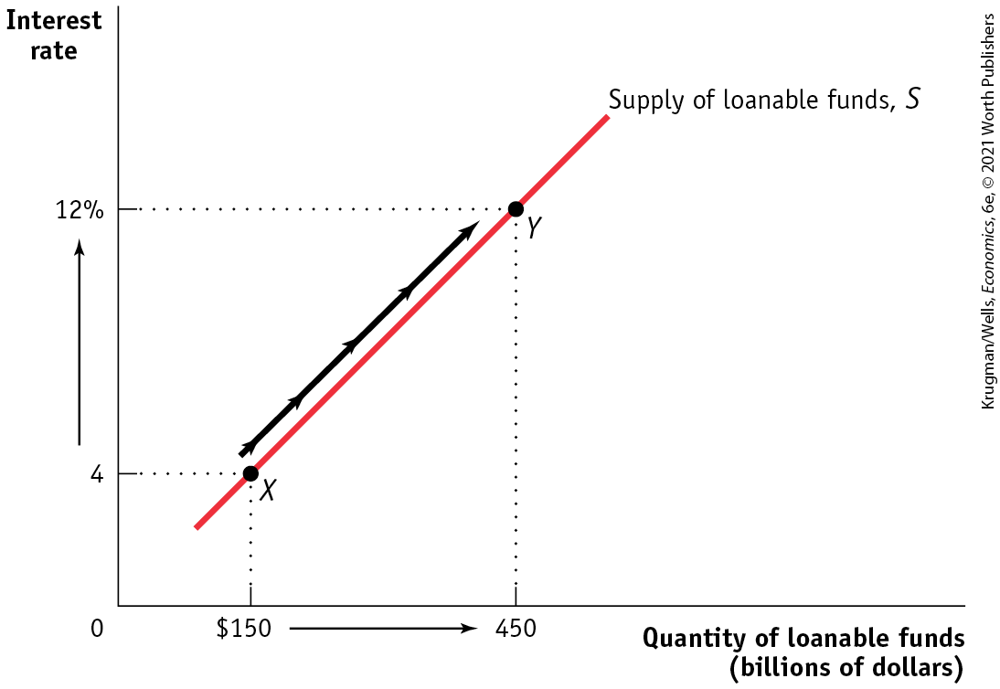
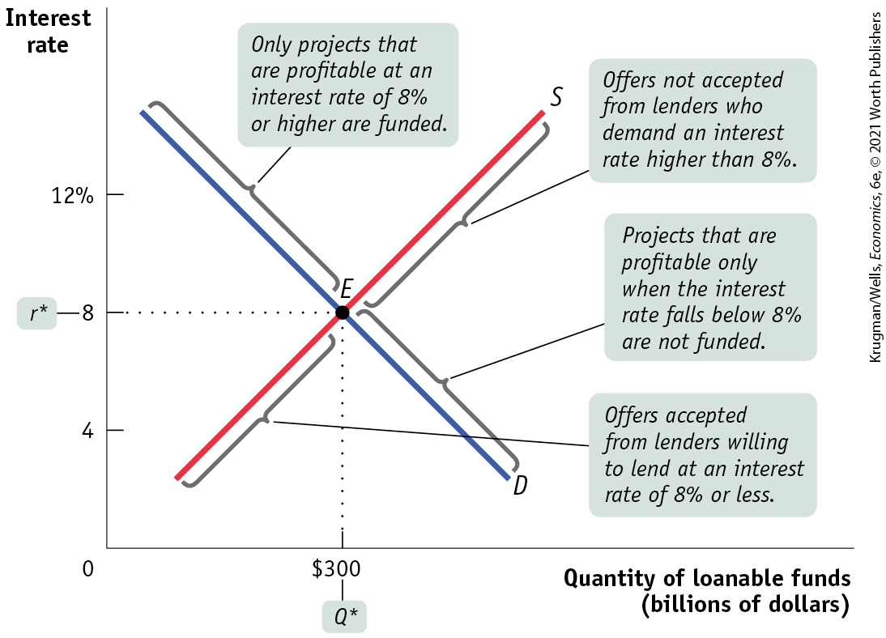
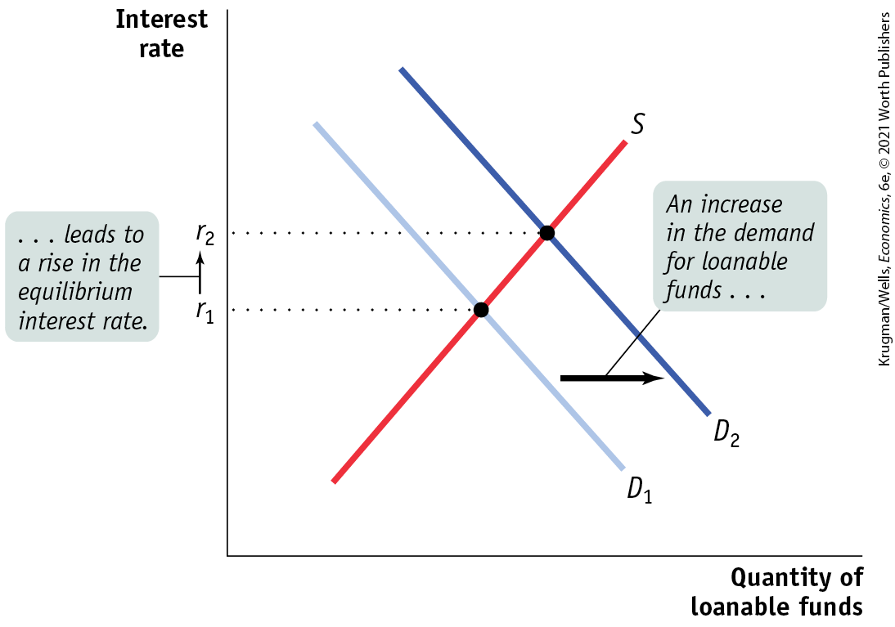
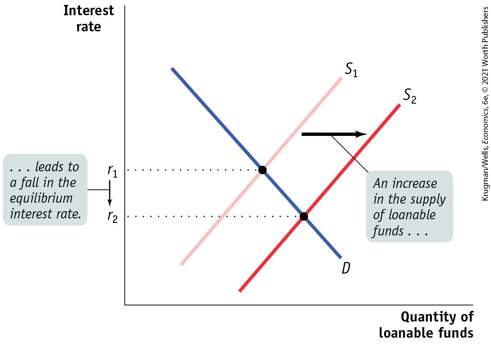
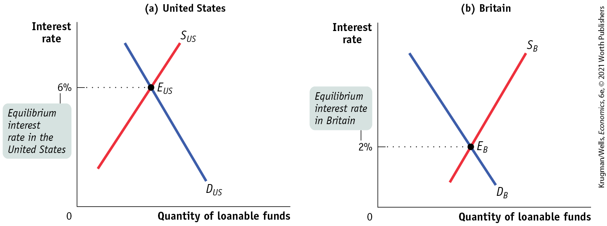
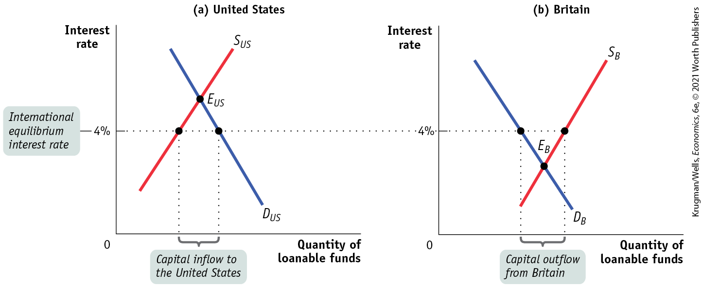

##### For inquiring minds

Using Present Value

An understanding of the concept of present value shows why the demand curve for loanable funds slopes downward. A simple way to grasp the essence of present value is to consider an example that illustrates the difference in value between having a sum of money today and having the same sum of money a year from now.

Suppose that exactly one year from today you will graduate, and you want to reward yourself by taking a trip that will cost \$1,000. In order to have \$1,000 a year from now, how much do you need today? It’s not \$1,000, and the reason why has to do with the interest rate.

Let’s call the amount you need today *X.* We’ll use *r* to represent the interest rate you receive on funds deposited in the bank. If you put *X* into the bank today and earn interest rate *r* on it, then after one year, the bank will pay you $X \times (1 + r)$. If what the bank will pay you a year from now is equal to \$1,000, then the amount you need today is:

$$X \times (1 + r) = \text{\$}1,000$$

You can apply some basic algebra to find that:

$$\left. X = \text{\$}1,000/(1 + r \right)$$

Notice that the value of *X* depends on the interest rate *r,* which is always greater than 0. This fact implies that *X is always less than* \$1,000. For example, if $r = 5\%$ (that is, $r = 0.05$), then $X = \text{\$}952.38$. In other words, having \$952.38 today is equivalent to having \$1,000 a year from now when the interest rate is 5%. That is, \$952.38 is the value of \$1,000 today given an interest rate of 5%.

Now we can define the *present value* of *X:* it is the amount of money needed today in order to receive *X* in the future given the interest rate. In this numerical example, \$952.38 is the present value of \$1,000 received one year from now given an interest rate of 5%.

The concept of present value also applies to decisions made by firms. Think about a firm that has two potential investment projects in mind, each of which will yield \$1,000 a year from now. However, each project has different initial costs — say, one requires that the firm borrow \$900 right now and the other requires that the firm borrow \$950. Which, if any, of these projects is worth borrowing money to finance and undertake?

The answer depends on the interest rate, which determines the present value of \$1,000 a year from now. If the interest rate is 10%, the present value of \$1,000 delivered a year from now is \$909. In other words, at an interest rate of 10%, a \$909 loan requires a repayment of \$1,000 in a year’s time. A loan less than \$909 requires a repayment less than \$1,000, while a loan of more than \$909 requires a repayment of more than \$1,000. So only the first project, which has an initial cost of less than \$909, is profitable, because its return in a year’s time is more than the amount of the loan repayment.

With an interest rate of 10%, the return on any project costing more than \$909 is less than the amount the firm has to repay on its loan and is therefore unprofitable. If the interest rate is only 5%, however, the present value of \$1,000 rises to \$952. At this interest rate, both projects are profitable, because \$952 exceeds both projects’ initial cost. So a firm will borrow more and engage in more investment spending when the interest rate is lower.

Meanwhile, similar calculations will be taking place at other firms. So a lower interest rate will lead to higher investment spending in the economy as a whole: the demand curve for loanable funds slopes downward.

<figure id="pau_9781319320164_M3RxVrXQeE" class="figure lm_img_lightbox unnum c3 center">

<figcaption>
When making financial decisions, individuals and firms must always keep in mind that having $1,000 today is worth more than having $1,000 a year from now.
</figcaption>
</figure>

</aside>

In present value calculations, we use the interest rate to determine how the value of a dollar in the future compares to the value of a dollar today. But the fact is that future dollars are worth less than a dollar today, and they are worth even less when the interest rate is higher.

The intuition behind present value calculations is simple. The interest rate measures the opportunity cost of investment spending that results in a future return: instead of spending money on an investment spending project, a company could simply put the money into the bank and earn interest on it. And the higher the interest rate, the more attractive it is to simply put money into the bank and let it earn interest instead of investing it in an investment spending project.

In other words, the higher the interest rate, the higher the opportunity cost of investment spending. And, the higher the opportunity cost of investment spending, the lower the number of investment spending projects firms want to carry out, and therefore the lower the quantity of loanable funds demanded. It is this insight that explains why the demand curve for loanable funds is downward sloping.

When businesses engage in investment spending, they spend money right now in return for an expected payoff in the future. To evaluate whether a particular investment spending project is worth undertaking, a business must compare the present value of the future payoff with the current cost of that project. If the present value of the future payoff is greater than the current cost, a project is profitable and worth investing in. If the interest rate falls, then the present value of any given project rises, so more projects pass that test. If the interest rate rises, then the present value of any given project falls, and fewer projects pass that test.

So total investment spending, and hence the demand for loanable funds to finance that spending, is negatively related to the interest rate. Thus, the demand curve for loanable funds slopes downward. You can see this in <a href="#kru_9781319245269_ch10_02.xhtml#pau_9781319320164_JURXHw1Au6" id="kru_9781319245269_ch10_02.xhtml#pau_9781319320164_QLYQqZPG0T" class="crossref">Figure 10-2</a>. When the interest rate falls from 12% to 4%, the quantity of loanable funds demanded rises from \$150 billion (point *A*) to \$450 billion (point *B*).

#### The Supply of Loanable Funds

<a href="#kru_9781319245269_ch10_02.xhtml#pau_9781319320164_kN2saR7J3I" id="kru_9781319245269_ch10_02.xhtml#pau_9781319320164_XSwQS9iAUQ" class="crossref">Figure 10-3</a> shows a hypothetical supply curve for loanable funds, *S.* Again, the interest rate plays the same role that the price plays in ordinary supply and demand analysis. But why is this curve upward sloping?

<figure id="pau_9781319320164_kN2saR7J3I" class="figure lm_img_lightbox num c3 main-flow">

<figcaption>
FIGURE 10-3 The Supply of Loanable Funds

The supply curve for loanable funds slopes upward: the higher the interest rate, the greater the quantity of loanable funds supplied. Here, increasing the interest rate from 4% to 12% increases the quantity of loanable funds supplied from $150 billion to $450 billion.
</figcaption>
</figure>

<aside class="hidden" id="pau_9781319320164_irvFS6CGL0" title="hidden">

The vertical axis labeled Interest rate shows markings at 0, 4, and 12 percent from bottom to top. The horizontal axis labeled Quantity of loanable funds (billions of dollars) shows markings at 0, 150 dollars, and 450 from left to right. The graph depicts a positive sloping supply curve for Loanable funds S, passing through two points at X (150, 4) and Y (450, 12). An arrow from X is pointing toward Y along the slope of the curve. An upward arrow is from 4 percent to 12 percent on the vertical axis.

</aside>

The answer is that loanable funds are supplied by savers, and savers incur an opportunity cost when they lend to a business: the funds could instead be spent on consumption — say, a nice vacation. Whether a given saver becomes a lender by making funds available to borrowers depends on the interest rate received in return. By saving your money today and earning interest on it, you are rewarded with higher consumption in the future when the loan you made is repaid with interest. So it is a good assumption that more people are willing to forgo current consumption and make a loan to a borrower when the interest rate is higher.

As a result, our hypothetical supply curve of loanable funds slopes upward. In <a href="#kru_9781319245269_ch10_02.xhtml#pau_9781319320164_kN2saR7J3I" id="kru_9781319245269_ch10_02.xhtml#pau_9781319320164_V9RX6i1XqC" class="crossref">Figure 10-3</a>, lenders will supply \$150 billion to the loanable funds market at an interest rate of 4% (point *X*); if the interest rate rises to 12%, the quantity of loanable funds supplied will rise to \$450 billion (point *Y*).

#### The Equilibrium Interest Rate

The interest rate at which the quantity of loanable funds supplied equals the quantity of loanable funds demanded is called the <a href="#kru_9781319245269_EM_glossary.xhtml#pau_9781319320164_rwxp19npuT" id="kru_9781319245269_ch10_02.xhtml#pau_9781319320164_kxHWVPPnAv" class="glossref" role="doc-glossref">equilibrium interest rate</a>. As you can see in <a href="#kru_9781319245269_ch10_02.xhtml#pau_9781319320164_WpMVRMCTvn" id="kru_9781319245269_ch10_02.xhtml#pau_9781319320164_777yuIlhLN" class="crossref">Figure 10-4</a>, the equilibrium interest rate, *r*\*, and the total quantity of lending, *Q*\*, are determined by the intersection of the supply and demand curves, at point *E.*

<aside aria-label="title 9" class="glossary c3 main-flow v1" epub:type="glossary" id="pau_9781319320164_lspenig2cK">

**equilibrium interest rate**  
The interest rate at which the quantity of loanable funds supplied equals the quantity of loanable funds demanded is the **equilibrium interest rate.**

</aside>

<figure id="pau_9781319320164_WpMVRMCTvn" class="figure lm_img_lightbox num c3 main-flow">

<figcaption>
FIGURE 10-4 Equilibrium in the Loanable Funds Market

At the equilibrium interest rate, the quantity of loanable funds supplied equals the quantity of loanable funds demanded. Here, the equilibrium interest rate is 8%, with $300 billion of funds lent and borrowed. Lenders who demand an interest rate of 8% or lower have their offers of loans accepted; those who demand a higher interest rate do not. Projects that are profitable at an interest rate of 8% or higher are funded; those that are profitable only when the interest rate falls below 8% are not.
</figcaption>
</figure>

<aside class="hidden" id="pau_9781319320164_VbeMEZ3go5" title="hidden">

The vertical axis labeled Interest rate ranges from 0 to 12 percent, in increments of 4 percent. The horizontal axis labeled Quantity of loanable funds (billions of dollars) shows markings at 0 and 300 dollars, from left to right. A negative sloping demand curve D intersects a positive sloping supply curve S at equilibrium point E (300, 8). The portion of the demand curve above the equilibrium point is labeled, “Only projects that are profitable at an interest rate of 8 percent or higher are funded.” The portion of the demand curve below the equilibrium point is labeled, “Projects that are profitable only when the interest rate falls below 8 percent are not funded.” The portion of the supply curve above the equilibrium point is labeled, “Offers not accepted from lenders who demand an interest rate higher than 8 percent.” The portion of the supply curve below the equilibrium point labeled, “Offers accepted from lenders willing to lend at an interest rate of 8 percent or less.” The marking at 300 dollars on the horizontal axis is labeled Q superscript asterisk, and the marking at 8 percent on vertical axis is labeled r asterisk.

</aside>

Here, the equilibrium interest rate is 8%, at which \$300 billion is lent and borrowed. In this equilibrium, only investment spending projects that are profitable if the interest rate is 8% or higher are funded. Projects that are profitable only when the interest rate falls below 8% are not funded. Correspondingly, only lenders who are willing to accept an interest rate of 8% or less will have their offers to lend funds accepted; lenders who demand an interest rate higher than 8% do not have their offers to lend accepted.

<a href="#kru_9781319245269_ch10_02.xhtml#pau_9781319320164_WpMVRMCTvn" id="kru_9781319245269_ch10_02.xhtml#pau_9781319320164_QkVJXIQfhV" class="crossref">Figure 10-4</a> shows how the market for loanable funds matches up desired savings with desired investment spending: in equilibrium, the quantity of funds that savers want to lend is equal to the quantity of funds that firms want to borrow. The figure also shows that this match-up is efficient, in two senses. First, the right investments get made: the investment spending projects that are actually financed have higher payoffs (in terms of present value) than those that do not get financed. Second, the right people do the saving and lending: the savers who actually lend funds are willing to lend for lower interest rates than those who do not.

The insight that the loanable funds market leads to an efficient use of savings, although drawn from a highly simplified model, has important implications for real life. As we’ll see shortly, it is the reason that a well-functioning financial system increases an economy’s long-run economic growth rate.

Before we get to that, let’s look at how the market for loanable funds responds to shifts of demand and supply. As in the standard model of supply and demand, where the equilibrium price changes in response to shifts of the demand or supply curves, here, the equilibrium interest rate changes when there are shifts of the demand curve for loanable funds, the supply curve for loanable funds, or both.

#### Shifts of the Demand for Loanable Funds

Let’s start by looking at the causes and effects of changes in demand.

The factors that can cause the demand curve for loanable funds to shift include the following:

1.  *Changes in perceived business opportunities.* A change in beliefs about the payoff of investment spending can increase or decrease the amount of desired spending at any given interest rate. For example, during the 1990s there was great excitement over the business possibilities created by the internet, which had just begun to be widely used. As a result, businesses rushed to buy computer equipment, put fiber-optic cables in the ground, launch websites, and so on. This shifted the demand for loanable funds to the right. By 2001, the failure of many dot-com businesses had led to disillusionment with technology-related investment; this shifted the demand for loanable funds back to the left.
2.  *Changes in government borrowing.* A government runs a budget deficit when, in a given year, it spends more than it receives. A government that runs budget deficits can be a major source of demand for loanable funds. For example, in 2009 the U.S. federal government was running a budget deficit in excess of \$1.413 trillion, but by 2016 the federal deficit had been cut by \$1 trillion to a little more than \$330 billion. The federal government greatly reduced its borrowing needs. This change in the federal budget position had the effect, other things equal, of shifting the demand curve for loanable funds to the left.

<a href="#kru_9781319245269_ch10_02.xhtml#pau_9781319320164_LCIEAPELRh" id="kru_9781319245269_ch10_02.xhtml#pau_9781319320164_M1vjGqkRQc" class="crossref">Figure 10-5</a> shows the effects of an increase in the demand for loanable funds. *S* is the supply of loanable funds, and $D_{1}$ is the initial demand curve. The initial equilibrium interest rate is $r_{1}$. An increase in the demand for loanable funds means that the quantity of funds demanded rises at any given interest rate, so the demand curve shifts rightward to $D_{2}$. As a result, the equilibrium interest rate rises to $r_{2}$.

<figure id="pau_9781319320164_LCIEAPELRh" class="figure lm_img_lightbox num c3 main-flow">

<figcaption>
FIGURE 10-5 An Increase in the Demand for Loanable Funds

If the quantity of funds demanded by borrowers rises at any given interest rate, the demand for loanable funds shifts rightward from <em>D</em>1 to <em>D</em>2. As a result, the equilibrium interest rate rises from <em>r</em>1 to <em><em>r</em>2</em>.
</figcaption>
</figure>

<aside class="hidden" id="pau_9781319320164_A7yndxgftt" title="hidden">

The vertical axis labeled interest rate shows markings at r subscript 1 and r subscript 2 from bottom to top, and the horizontal axis is labeled Quantity of loanable funds. A positive sloping supply curve S, intersects two negative sloping demand curves, D subscript 1 and D subscript 2, at two points corresponding to r subscript 1 and r subscript 2, respectively. D subscript 2 is parallel and to the right of D subscript 1, and an arrow from D subscript 1 to D subscript 2 is labeled “An increase in the demand for loanable funds ellipsis.” An upward arrow from r subscript 1 to r subscript 2 on the vertical axis is labeled “ellipsis leads to a rise in the equilibrium interest rate.”

</aside>

The fact that an increase in the demand for loanable funds leads, other things equal, to a rise in the interest rate has one especially important implication: it tells us that increasing or persistent government budget deficits are cause for concern because an increase in the government’s deficit shifts the demand curve for loanable funds to the right, which leads to a higher interest rate. If the interest rate rises, businesses will cut back on their investment spending.

So, other things equal, a rise in the government budget deficit tends to reduce overall investment spending. Economists call the negative effect of government budget deficits on investment spending <a href="#kru_9781319245269_EM_glossary.xhtml#pau_9781319320164_FrfN6nCKaX" id="kru_9781319245269_ch10_02.xhtml#pau_9781319320164_UzSXTu1nVW" class="glossref" role="doc-glossref">crowding out</a>. Concerns about crowding out are one key reason to worry about increasing or persistent budget deficits.

<aside aria-label="title 10" class="glossary c3 main-flow v1" epub:type="glossary" id="pau_9781319320164_CDm7lG9t3J">

**crowding out**  
**Crowding out** occurs when a government budget deficit drives up the interest rate and leads to reduced investment spending.

</aside>

However, it’s important to add a qualification here: crowding out may not occur if the economy is depressed. When the economy is operating far below full employment, government spending can lead to higher incomes, and these higher incomes lead to increased savings at any given interest rate. Higher savings allows the government to borrow without raising interest rates. Many economists believe, for example, that the large budget deficits that the U.S. government ran from 2008 to 2013 in the face of a depressed economy caused little if any crowding out.

#### Shifts of the Supply of Loanable Funds

Like the demand for loanable funds, the supply of loanable funds can shift. Among the factors that can cause the supply of loanable funds to shift are the following:

1.  *Changes in private savings behavior.* A number of factors can cause the level of private savings to change at any given interest rate. For example, following the coronavirus pandemic and concerns of a growing recession, households cut back on spending. In April 2020, the personal saving rate, savings as a percent of disposable income, increased to 33% from about 8% earlier in the year. This had the effect of shifting the supply curve of loanable funds to the right.
2.  *Changes in net capital inflows.* Capital flows into and out of a country can change as investors’ perceptions of that country change. For example, Greece experienced large net capital inflows after the creation of the euro, Europe’s common currency, in 1999, because investors believed that Greece’s adoption of the euro as its currency had made it a safe place to put their funds. By 2009, however, worries about the Greek government’s solvency (and the discovery that it had been understating its debt) led to a collapse in investor confidence, and the net inflow of funds dried up. The effect of shrinking capital inflows was to shift the supply curve in the Greek loanable funds market to the left.

In the mid-2000s, the United States received large net capital inflows, with much of the money coming from China and the Middle East. Those inflows helped fuel a big increase in residential investment spending — newly constructed homes — from 2003 to 2006. As a result of the bursting of the U.S. housing bubble in 2006–2007 and the subsequent deep recession, those inflows declined, and as of 2019 were still much smaller, as a percentage of GDP, than they had been at their peak.

<a href="#kru_9781319245269_ch10_02.xhtml#pau_9781319320164_759H0m44VV" id="kru_9781319245269_ch10_02.xhtml#pau_9781319320164_OITK498DSf" class="crossref">Figure 10-6</a> shows the effects of an increase in the supply of loanable funds. *D* is the demand for loanable funds, and $S_{1}$ is the initial supply curve. The initial equilibrium interest rate is $r_{1}$. An increase in the supply of loanable funds means that the quantity of funds supplied rises at any given interest rate, so the supply curve shifts rightward to $S_{2}$. As a result, the equilibrium interest rate falls to $r_{2}$.

<figure id="pau_9781319320164_759H0m44VV" class="figure lm_img_lightbox num c3 main-flow">

<figcaption>
FIGURE 10-6 An Increase in the Supply of Loanable Funds

If the quantity of funds supplied by lenders rises at any given interest rate, the supply of loanable funds shifts rightward from <em>S</em>1 to <em>S</em>2. As a result, the equilibrium interest rate falls from <em>r</em>1 to <em>r</em>2.
</figcaption>
</figure>

<aside class="hidden" id="pau_9781319320164_Z23tG3UttK" title="hidden">

The vertical axis labeled interest rate shows markings at r subscript 1 and r subscript 2 from top to bottom, and the horizontal axis is labeled Quantity of loanable funds. A negative sloping demand curve D, intersects two positive sloping supply curves, S subscript 1 and S subscript 2, at two points corresponding to r subscript 1 and r subscript 2, respectively. S subscript 2 is parallel and to the right of S subscript 1, and an arrow from S subscript 1 to S subscript 2 is labeled “An increase in the supply of loanable funds ellipsis.” A downward arrow from r subscript 1 to r subscript 2 on the vertical axis is labeled “ellipsis leads to a rise in the equilibrium interest rate.”

</aside>

#### A Global Market for Loanable Funds?

As we’ve noted, international capital flows can be an important influence on interest rates. What determines these capital flows? Most of the time, capital flows from countries where interest rates are relatively low to countries where interest rates are relatively high. And the result of these flows is to raise interest rates where they were low, and reduce rates where they were high.

For some purposes, it is useful to think about what would happen if this process went all the way — if international capital flows were so large that they had the effect of completely equalizing interest rates across countries. In that case we could talk about a <a href="#kru_9781319245269_EM_glossary.xhtml#pau_9781319320164_QBvoLX3Bqe" id="kru_9781319245269_ch10_02.xhtml#pau_9781319320164_5wfHaUkB1Q" class="glossref" role="doc-glossref">global loanable funds market</a>.

<aside aria-label="title 11" class="glossary c3 main-flow v1" epub:type="glossary" id="pau_9781319320164_dRJm6ymqaU">

**global loanable funds market**  
A **global loanable funds market** arises when international capital flows are so large that they equalize interest rates across countries.

</aside>

<a href="#kru_9781319245269_ch10_02.xhtml#pau_9781319320164_Ch3ZKgrG8m" id="kru_9781319245269_ch10_02.xhtml#pau_9781319320164_7u13e2MErW" class="crossref">Figure 10-7</a> shows how such a market would work. We imagine a world consisting of only two countries, the United States and Britain. Panel (a) shows the loanable funds market in the United States, where the equilibrium in the absence of international capital flows is at point $E_{US}$*,* with an interest rate of 6%. Panel (b) shows the loanable funds market in Britain, where the equilibrium in the absence of international capital flows is at point $E_{B}$, with an interest rate of 2%.

<figure id="pau_9781319320164_Ch3ZKgrG8m" class="figure lm_img_lightbox num c4 main-flow">

<figcaption>
FIGURE 10-7 Loanable Funds Markets in a Two-Country World

Here we show two countries, the United States and Britain, each with its own loanable funds market. The equilibrium interest rate is 6% in the U.S. market but only 2% in the British market. This creates an incentive for capital to flow from Britain to the United States.
</figcaption>
</figure>

<aside class="hidden" id="pau_9781319320164_Ge6Uz94w32" title="hidden">

Graph (a) United States: The vertical axis labeled Interest rate shows markings at 0 and 6 percent from bottom to top. The horizontal axis is labeled Quantity of loanable funds. A positive sloping supply curve S subscript (U S) intersects a negative sloping demand curve D subscript (U S) at a point E subscript (U S), corresponding to 6 percent on the vertical axis, labeled Equilibrium interest rate in the United States. Graph (b) Britain: The vertical axis labeled Interest rate shows markings at 0 and 2 percent from bottom to top. The horizontal axis is labeled Quantity of loanable funds. A positive sloping supply curve S subscript B, intersects a negative sloping demand curve D subscript B at a point E subscript B, corresponding to 2 percent on the vertical axis, labeled Equilibrium interest rate in the Britain.

</aside>

Will the actual interest rate in the United States remain at 6% and that in Britain at 2%? Not if it is easy for British residents to make loans to Americans. In that case, British lenders, attracted by high U.S. interest rates, will send some of their loanable funds to the United States. This capital inflow will increase the quantity of loanable funds supplied to American borrowers, pushing the U.S. interest rate down. It will also reduce the quantity of loanable funds supplied to British borrowers, pushing the British interest rate up. So international capital flows will narrow the gap between U.S. and British interest rates.

Let’s further suppose that British lenders consider a loan to an American to be just as good as a loan to one of their own compatriots, and that U.S. borrowers regard a debt to a British lender as no more costly than a debt to a U.S. lender. In that case, the flow of funds from Britain to the United States will continue until the gap between their interest rates is eliminated. In other words, when residents of the two countries believe that foreign assets and foreign liabilities are as good as domestic ones, then international capital flows will equalize the interest rates in the two countries.

<a href="#kru_9781319245269_ch10_02.xhtml#pau_9781319320164_6KBQH7i7yd" id="kru_9781319245269_ch10_02.xhtml#pau_9781319320164_hKmyXxrewK" class="crossref">Figure 10-8</a> shows how an international equilibrium in the loanable funds market arises. In this case, the equilibrium interest rate is 4% in both the United States and Britain. At this interest rate, the quantity of loanable funds demanded by U.S. borrowers exceeds the quantity of loanable funds supplied by U.S. lenders. This gap is filled by “imported” funds — a capital inflow from Britain. At the same time, the quantity of loanable funds supplied by British lenders is greater than the quantity of loanable funds demanded by British borrowers. This excess is “exported” in the form of a capital outflow to the United States. A global loanable funds market arises as the two markets are in equilibrium at a common interest rate of 4%. At that rate, the total quantity of loans demanded by borrowers across the two markets is equal to the total quantity of loans supplied by lenders across the two markets.

<figure id="pau_9781319320164_6KBQH7i7yd" class="figure lm_img_lightbox num c4 main-flow">

<figcaption>
FIGURE 10-8 International Capital Flows in a Two-Country World

British lenders lend to borrowers in the United States, leading to equalization of interest rates at 4% in both countries. At that rate, U.S. borrowing exceeds U.S. lending; the difference is made up by capital inflows to the United States. Meanwhile, British lending exceeds British borrowing; the excess is a capital outflow from Britain.
</figcaption>
</figure>

<aside class="hidden" id="pau_9781319320164_dZ2cLQJ71L" title="hidden">

Graph (a) United States: The vertical axis labeled Interest rate shows markings at 0 and 4 percent from bottom to top. The horizontal axis is labeled Quantity of loanable funds. A positive sloping supply curve S subscript (U S) intersects a negative sloping demand curve D subscript (U S) at a point E subscript (U S). 4 percent on the vertical axis is labeled “International equilibrium interest rate” and is below the equilibrium point. A horizontal dashed line from 4 percent intersects the supply and demand curves. The horizontal difference between the supply and demand curves corresponding to 4 percent is labeled “Capital inflow to the United States.” Graph (b) Britain: The vertical axis labeled Interest rate shows markings at 0 and 4 percent from bottom to top. The horizontal axis is labeled Quantity of loanable funds. A positive sloping supply curve S subscript B, intersects a negative sloping demand curve D subscript B at a point E subscript B. 4 percent on the vertical axis is labeled “International equilibrium interest rate” and is above the equilibrium point. A horizontal dashed line from 4 percent intersects the demand and supply curves. The horizontal difference between the supply and demand curves corresponding to 4 percent is labeled “Capital outflow from Britain.” A dotted line is connecting both the graphs at 4 percent.

</aside>

In short, international flows of capital are like international flows of goods and services. Capital moves from places where it would be cheap in the absence of international capital flows to places where it would be expensive in the absence of such flows.

In practice, this picture is complicated by various factors. In particular, countries use different currencies — the United States uses dollars, Britain uses pounds — and when you compare the interest rate on loans in dollars with the rate on loans in pounds, you need to take into account the possibility that the value of a pound in dollars can change over time. Still, the concept of a global market for loanable funds is very useful for some purposes, and we will return to this concept in later chapters.
