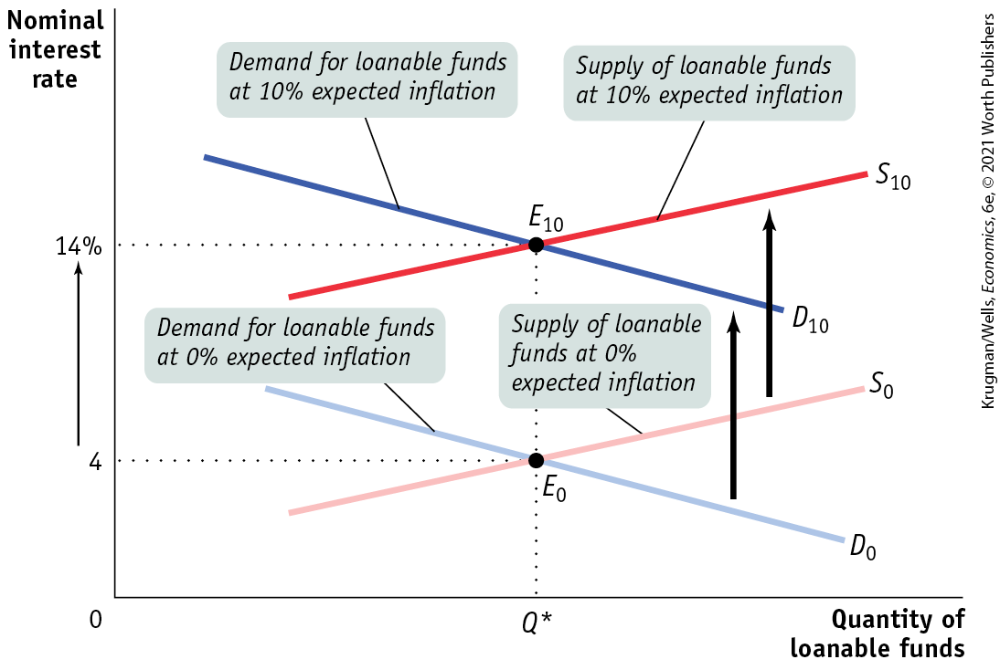
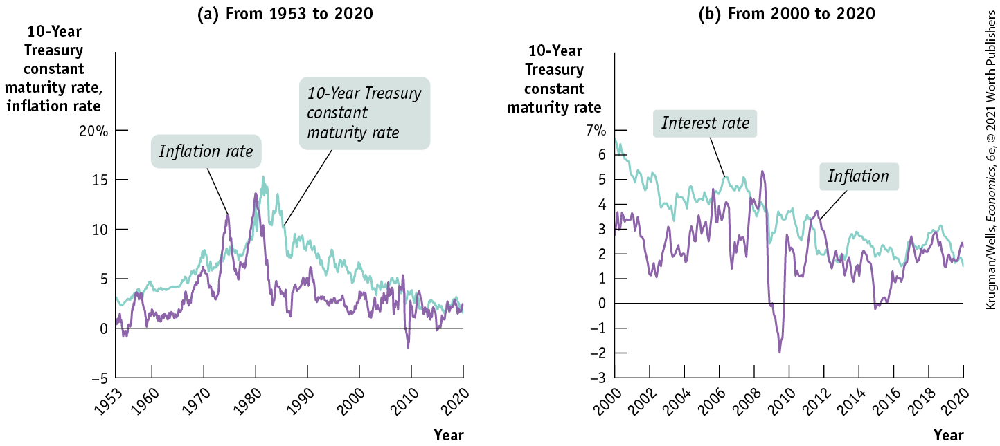

#### Inflation and Interest Rates

Anything that shifts either the supply of loanable funds curve or the demand for loanable funds curve changes the interest rate. Historically, major changes in interest rates have been driven by many factors, including changes in government policy and technological innovations that created new investment opportunities.

However, arguably the most important factor affecting interest rates over time — the main reason, for example, that interest rates today are much lower than they were in the late 1970s and early 1980s — is changing expectations about future inflation, which shift both the supply and the demand for loanable funds.

To understand the effect of expected future inflation on interest rates, recall our discussion in <a href="#kru_9781319245269_ch08_01.xhtml#pau_9781319320164_6AH2l2uZnD" id="kru_9781319245269_ch10_02.xhtml#pau_9781319320164_WG8PzAKxMB" class="crossref">Chapter 8</a> of the way inflation creates winners and losers — for example, the way that higher than expected U.S. inflation in the 1970s and 1980s reduced the real value of homeowners’ mortgages, which was good for the homeowners but bad for the banks. We also learned that economists summarize the effect of inflation on borrowers and lenders by distinguishing between the *nominal interest rate* and the *real interest rate,* where the difference is:

$$\text{Real interest rate} = \text{Nominal interest rate} - \text{Inflation rate}$$

The true cost of borrowing is the real interest rate, not the nominal interest rate. To see why, suppose a firm borrows \$10,000 for one year at a 10% nominal interest rate. At the end of the year, it must repay \$11,000 — the amount borrowed plus the interest. But suppose that over the course of the year the average level of prices increases by 10%, so that the real interest rate is zero. Then the \$11,000 repayment has the same purchasing power as the original \$10,000 loan. In real terms, the borrower has received a zero-interest loan.

Similarly, the true payoff to lending is the real interest rate, not the nominal interest rate. Suppose that a bank makes a \$10,000 loan for one year at a 10% nominal interest rate. At the end of the year, the bank receives an \$11,000 repayment. But if the average level of prices rises by 10% per year, the purchasing power of the money the bank gets back is no more than that of the money it lent out. In real terms, the bank has made a zero-interest loan.

Now we can add an important detail to our analysis of the loanable funds market. <a href="#kru_9781319245269_ch10_02.xhtml#pau_9781319320164_LCIEAPELRh" id="kru_9781319245269_ch10_02.xhtml#pau_9781319320164_bCNrVMulRi" class="crossref">Figures 10-5</a> and <a href="#kru_9781319245269_ch10_02.xhtml#pau_9781319320164_759H0m44VV" id="kru_9781319245269_ch10_02.xhtml#pau_9781319320164_mPWcn4zpOr" class="crossref">10-6</a> are drawn with the vertical axis measuring the *nominal interest rate for a given expected future inflation rate.* Why do we use the nominal interest rate rather than the real interest rate? Because in the real world neither borrowers nor lenders know what the future inflation rate will be when they make a deal. Actual loan contracts therefore specify a nominal interest rate rather than a real interest rate. Because we are holding the expected future inflation rate fixed in <a href="#kru_9781319245269_ch10_02.xhtml#pau_9781319320164_LCIEAPELRh" id="kru_9781319245269_ch10_02.xhtml#pau_9781319320164_NlfFS003uu" class="crossref">Figures 10-5</a> and <a href="#kru_9781319245269_ch10_02.xhtml#pau_9781319320164_759H0m44VV" id="kru_9781319245269_ch10_02.xhtml#pau_9781319320164_2qhK0ThpIY" class="crossref">10-6</a>, however, changes in the nominal interest rate also lead to changes in the real interest rate.

The expectations of borrowers and lenders about future inflation rates are normally based on recent experience. In the late 1970s, after a decade of high inflation, borrowers and lenders expected future inflation to be high. By the late 1990s, after a decade of fairly low inflation, borrowers and lenders expected future inflation to be low. And these changing expectations about future inflation had a strong effect on the nominal interest rate, largely explaining why nominal interest rates were much lower in the early years of the twenty-first century than they were in the early 1980s.

Let’s look at how changes in the expected future rate of inflation are reflected in the loanable funds model.

In <a href="#kru_9781319245269_ch10_02.xhtml#pau_9781319320164_P72TPZZINi" id="kru_9781319245269_ch10_02.xhtml#pau_9781319320164_68z14clBoA" class="crossref">Figure 10-9</a>, the curves $S_{0}$ and $D_{0}$ show the supply and demand for loanable funds given that the expected future rate of inflation is 0%. In that case, equilibrium is at $E_{0}$, and the equilibrium nominal interest rate is 4%. Because expected future inflation is 0%, the equilibrium expected real interest rate over the life of the loan is also 4%.

<figure id="pau_9781319320164_P72TPZZINi" class="figure lm_img_lightbox num c3 main-flow">

<figcaption>
FIGURE 10-9 The Fisher Effect

<em>D</em>0 and <em>S</em>0 are the demand and supply curves for loanable funds when the expected future inflation rate is 0%. At an expected inflation rate of 0%, the equilibrium nominal interest rate is 4%. An increase in expected future inflation pushes both the demand and supply curves upward by 1 percentage point for every percentage point increase in expected future inflation. <em>D</em>10 and <em>S</em>10 are the demand and supply curves for loanable funds when the expected future inflation rate is 10%. The 10 percentage point increase in expected future inflation raises the equilibrium nominal interest rate to 14%. The expected real interest rate remains at 4%, and the equilibrium quantity of loanable funds also remains unchanged.
</figcaption>
</figure>

<aside class="hidden" id="pau_9781319320164_JUP0l3dBne" title="hidden">

The vertical axis labeled Nominal interest rate shows markings at 0, 4, and 14 percent from bottom to top. The horizontal axis is labeled Quantity of loanable funds. A positive sloping supply curve S subscript 0 intersects a negative sloping demand curve D subscript 0 at E subscript 0, corresponding to 4 percent on the vertical axis and Q superscript asterisk on horizontal axis. The portion of the demand curve above the equilibrium point is labeled, “Demand for loanable funds at 0 percent expected inflation.” The portion of the supply curve above the equilibrium point is labeled, “Supply of loanable funds at 0 percent expected inflation.” An upward shifted positive sloping supply curve S subscript 10 intersects an upward shifted negative sloping demand curve D subscript 10 at E subscript 10, corresponding to 14 percent on the vertical axis and Q superscript asterisk on the horizontal axis. The portion of the shifted demand curve above the equilibrium point is labeled, “Demand for loanable funds at 10 percent expected inflation.” The portion of the shifted supply curve above the equilibrium point is labeled, “Supply of loanable funds at 10 percent expected inflation.” Two upward arrows from D subscript 0 and S subscript 0 point to D subscript 10 and S subscript 10, respectively.

</aside>

Now suppose that the expected future inflation rate rises to 10%. The demand curve for loanable funds shifts upward to $D_{10}$: borrowers are now willing to borrow as much at a nominal interest rate of 14% as they were previously willing to borrow at 4%. That’s because with a 10% inflation rate, a 14% nominal interest rate corresponds to a 4% real interest rate.

Similarly, the supply curve of loanable funds shifts upward to $S_{10}$: lenders require a nominal interest rate of 14% to persuade them to lend as much as they would previously have lent at 4%. The new equilibrium is at $E_{10}$: the result of an expected future inflation rate of 10% is that the equilibrium nominal interest rate rises from 4% to 14%.

This situation can be summarized as a general principle, known as the <a href="#kru_9781319245269_EM_glossary.xhtml#pau_9781319320164_3RsZMGAk4p" id="kru_9781319245269_ch10_02.xhtml#pau_9781319320164_e7VzitKIAK" class="glossref" role="doc-glossref">Fisher effect</a> (after the U.S. economist Irving Fisher, who proposed it in 1930): *the expected real interest rate is unaffected by changes in expected future inflation.*

<aside aria-label="title 12" class="glossary c3 main-flow v1" epub:type="glossary" id="pau_9781319320164_qvVdlNKrcC">

**Fisher effect**  
According to the **Fisher effect**, an increase in expected future inflation drives up the nominal interest rate, leaving the expected real interest rate unchanged.

</aside>

According to the Fisher effect, an increase in expected future inflation drives up the nominal interest rate, where each additional percentage point of expected future inflation drives up the nominal interest rate by 1 percentage point. The central point is that both lenders and borrowers base their decisions on the expected real interest rate. As a result, a change in the expected rate of inflation does not affect the equilibrium quantity of loanable funds or the expected real interest rate; all it affects is the equilibrium nominal interest rate.

### ECONOMICS \>\> *in Action*

Three Generations of U.S. Interest Rates

There have been some large movements in U.S. interest rates dating back to the 1950s. These movements clearly show how both changes in expected future inflation and changes in the expected return on investment spending move interest rates.

Panel (a) of <a href="#kru_9781319245269_ch10_02.xhtml#pau_9781319320164_WSwlu0aowX" id="kru_9781319245269_ch10_02.xhtml#pau_9781319320164_lfXcaDEh2S" class="crossref">Figure 10-10</a> illustrates the first effect. It shows the average interest rate on bonds issued by the U.S. government — specifically, bonds for which the government promises to repay the full amount after 10 years — from 1953 to 2020, along with the rate of consumer price inflation over the same period. As you can see, the big story about interest rates is the way they soared in the 1970s, before coming back down in the 1980s.

<figure id="pau_9781319320164_WSwlu0aowX" class="figure lm_img_lightbox num c4 main-flow">

<figcaption>
FIGURE 10-10 Changes in U.S. Expected Inflation and Interest Rates

<em>Data from:</em> Federal Reserve Bank of St. Louis.
</figcaption>
</figure>

<aside class="hidden" id="pau_9781319320164_UdnUJ2yPVi" title="hidden">

Graph (a) From 1953 to 2020: The vertical axis labeled 10-Year Treasury constant maturity rate, inflation rate ranges from negative 5 to 20 percent in increment of 5 percent. The horizontal axis labeled Year shows markings at 1953, 1960, 1970, 1980, 1990, 2000, 2010, and 2020 from left to right. The approximated data of a curve representing 10-year treasury constant maturity rate are as follows, 1953, 2.5; 1960, 5; 1970, 8; 1983, 15; 1990, 9; 2000, 6; 2010, 4; and 2020, 2.5. The approximated data of a curve representing inflation rate are as follows, 1953, 0; 1960, 1.5; 1970, 6; 1975, 11.5; 1980, 14; 1990, 5; 2000, 4; 2010, negative 2; and 2020, 2. Both the curves show a fluctuating trend and continue to rise and fall. Graph (b) From 2000 to 2020: The vertical axis labeled 10-Year Treasury constant maturity rate, inflation rate ranges from negative 3 to 7 percent in increment of 1 percent. The horizontal axis labeled Year ranges from 2000 to 2020 in increment of 2 years. The approximated data of a curve representing interest rate are as follows, 2000, 6.5; 2004, 4.5; 2008, 5; 2009, 2.5; 2012, 2; 2016, 2; and 2020, 1.75. The approximated data of a curve representing inflation are as follows, 2000, 3; 2002, 1; 2004, 1.5; 2006, 4.5; 2008, 2; between 2008 and 2009, 5.3; between 2009 and 2010, negative 2; 2010, 3; 2012, 4; 2016, 0; 2018, 2; and 2020, 2.5. Both the curves show a fluctuating trend and continue to rise and fall.

</aside>

It’s not hard to see why that happened: inflation shot up during the 1970s, leading to widespread expectations that high inflation would continue. And as we’ve seen, a higher expected inflation rate raises the equilibrium interest rate. As the inflation rate came down in the 1980s, so did expectations of future inflation, and this brought interest rates down as well.

Panel (b) illustrates the second effect: changes in the expected return on investment spending and interest rates, with a “close-up” of interest rates and inflation from 2000 to 2020. Interest rates have been much lower in recent years — usually below 2% — than they were at the beginning of the twenty-first century, when they typically exceeded 5%. Yet inflation didn’t fall very much. In fact, surveys and other evidence suggest that expected inflation has been stable, at around 2%, for the past couple of decades. What happened instead seems to have been a decline in perceived investment returns. Economists are still debating the causes of this decline, although many point to slowing population growth, which has reduced the need for new housing, office buildings, and other forms of capital.

Throughout this whole process, total savings was equal to total investment spending, and the rise and fall of the interest rate played a key role in matching lenders with borrowers.

### *\>\> Quick Review*

- The **savings–investment spending identity** is an accounting fact: savings is equal to investment spending for the economy as a whole.
- The government is a source of savings when it runs a positive **budget balance**, a **budget surplus.** It is a source of dissavings when it runs a negative budget balance, a **budget deficit**, which can be financed by **government borrowing** — the total amount of funds borrowed by federal, state, and local governments in the financial markets.
- Savings is equal to **national savings** plus **net capital inflow**, which may be either positive or negative.
- To make the correct comparison when costs or benefits arrive at different times, you must transform any dollars realized in the future into their present value.
- The **loanable funds market** matches savers to borrowers. In equilibrium, only investment spending projects with an expected return greater than or equal to the **equilibrium interest rate** are funded.
- Because government borrowing competes with private borrowers in the loanable funds market, a government deficit can cause **crowding out**, which is less likely if the economy is in a slump.
- Capital flows allow countries to export their savings to borrowers in other countries. Capital flows from a country with a lower interest rate to a country with a higher interest rate, reducing the difference in those rates. If capital flows are large, a **global loanable funds market** arises, equalizing interest rates across countries.
- Higher expected future inflation raises the nominal interest rate through the **Fisher effect**, leaving the real interest rate unchanged.

### *\>\> Check Your Understanding* 10-1

1.  Use a diagram of the loanable funds market to illustrate the effect of the following events on the equilibrium interest rate and investment spending.
    1.  An economy is opened to international movements of capital, and a net capital inflow occurs.
    2.  Retired people generally save less than working people at any interest rate. The proportion of retired people in the population goes up.
2.  Explain what is wrong with the following statement: “Savings and investment spending may not be equal in the economy as a whole because when the interest rate rises, households will want to save more money than businesses will want to invest.”
3.  Suppose that expected inflation rises from 3% to 6%.
    1.  How will the real interest rate be affected by this change?
    2.  How will the nominal interest rate be affected by this change?
    3.  What will happen to the equilibrium quantity of loanable funds?

## The Financial System

A well-functioning financial system that brings together the funds of investors and the vision of entrepreneurs has made the rise of Amazon possible. But to think that this is an exclusively modern phenomenon would be misguided. Financial markets raised the funds that were used to develop colonial markets in India, to build canals across Europe, and to finance the Napoleonic wars in the eighteenth and early nineteenth centuries. Capital inflows financed the early economic development of the United States, funding investment spending in mining, railroads, and canals. In fact, many of the principal features of financial markets and assets have been well understood in Europe and the United States since the eighteenth century. These features are no less relevant today. So let’s begin by understanding exactly what is traded in financial markets.

<a href="#kru_9781319245269_EM_glossary.xhtml#pau_9781319320164_IrLikWgI8P" id="kru_9781319245269_ch10_03.xhtml#pau_9781319320164_h9Fyx4tz2i" class="glossref" role="doc-glossref">Financial markets</a> are where households invest their current savings and their accumulated savings, or <a href="#kru_9781319245269_EM_glossary.xhtml#pau_9781319320164_FGuoBrGO0v" id="kru_9781319245269_ch10_03.xhtml#pau_9781319320164_T5JN0Xytac" class="glossref" role="doc-glossref">wealth</a>, by purchasing *financial assets.* A <a href="#kru_9781319245269_EM_glossary.xhtml#pau_9781319320164_WYF6NGF3c9" id="kru_9781319245269_ch10_03.xhtml#pau_9781319320164_g39oHL0s89" class="glossref" role="doc-glossref">financial asset</a> is a paper claim that entitles the buyer to future income from the seller. For example, when a saver lends funds to a company, the loan is a financial asset sold by the company that entitles the lender (the buyer of the financial asset) to future income from the company.

<aside aria-label="title 1" class="glossary c3 main-flow v1" epub:type="glossary" id="pau_9781319320164_6AYprBgaiX">

**financial markets, wealth**  
**Financial markets** are where households invest their current and accumulated savings. A household’s **wealth** is the value of its accumulated savings.

</aside>
<aside aria-label="title 2" class="glossary c3 main-flow v1" epub:type="glossary" id="pau_9781319320164_wFiSQ7Jsw3">

**financial asset**  
A **financial asset** is a paper claim that entitles the buyer to future income from the seller.

</aside>

A household can also invest its current savings or wealth by purchasing a <a href="#kru_9781319245269_EM_glossary.xhtml#pau_9781319320164_gJ9XTpUBrh" id="kru_9781319245269_ch10_03.xhtml#pau_9781319320164_E4NqJOq2TV" class="glossref" role="doc-glossref">physical asset</a>, a tangible object that can be used to generate future income such as a preexisting house or preexisting piece of equipment. Purchasing a physical asset gives the owner the right to dispose of the object as they wish (for example, rent it or sell it).

<aside aria-label="title 3" class="glossary c3 main-flow v1" epub:type="glossary" id="pau_9781319320164_wDZ5M1OcrP">

**physical asset**  
A **physical asset** is a tangible object that can be used to generate future income.

</aside>

Recall that the purchase of a financial or physical asset is typically called investing. So if you purchase a preexisting piece of equipment — say, a used airliner — you are investing in a physical asset. In contrast, if you spend funds that *add* to the stock of physical capital in the economy — say, purchasing a newly manufactured airplane — you are engaging in investment spending.

If you get a loan from your local bank — say, to buy a new car — you and the bank are creating a financial asset: your loan. A *loan* is one important kind of financial asset in the real world, one that is owned by the lender — in this case, your local bank. In creating that loan, you and the bank are also creating a <a href="#kru_9781319245269_EM_glossary.xhtml#pau_9781319320164_7t9Agr1lE1" id="kru_9781319245269_ch10_03.xhtml#pau_9781319320164_mvIL1FaIk3" class="glossref" role="doc-glossref">liability</a>, a requirement to pay income in the future.

<aside aria-label="title 4" class="glossary c3 main-flow v1" epub:type="glossary" id="pau_9781319320164_wEhbsTPdXv">

**liability**  
A **liability** is a requirement to pay income in the future.

</aside>

So although your loan is a financial asset from the bank’s point of view, it is a liability from your point of view. In addition to loans, there are three other important kinds of financial assets: *stocks, bonds,* and *bank deposits.* Because a financial asset is a claim to future income that someone has to pay, it is also someone else’s liability. We’ll explain in detail shortly who bears the liability for each type of financial asset.

These four types of financial assets — loans, stocks, bonds, and bank deposits — exist because the economy has developed a set of specialized markets, like the stock market and the bond market, and specialized institutions, like banks, that facilitate the flow of funds from lenders to borrowers. Taken together, these institutions and markets are known as the financial system.

A well-functioning financial system is a critical ingredient in achieving long-run growth because it encourages greater savings and investment spending. It also ensures that savings and investment spending are undertaken efficiently. To understand how this occurs, we first need to know what tasks the financial system needs to accomplish. Then we can see how the job gets done.

### Three Tasks of a Financial System

Our earlier analysis of the loanable funds market ignored three important problems facing borrowers and lenders: *transaction costs, risk,* and the desire for *liquidity.* The three tasks of a financial system are to reduce these problems in a cost-effective way that enhances the efficiency of financial markets and makes it more likely that lenders and borrowers will make mutually beneficial trades — trades that make society as a whole richer. We’ll turn now to examining how financial assets are designed and how institutions are developed to cope with these problems.

#### Task 1: Reducing Transaction Costs

The expenses of actually putting together and executing a deal are known as <a href="#kru_9781319245269_EM_glossary.xhtml#pau_9781319320164_p5SUnHZkVD" id="kru_9781319245269_ch10_03.xhtml#pau_9781319320164_CjKuM2QUfe" class="glossref" role="doc-glossref">transaction costs</a>. For example, arranging a loan requires spending time and money negotiating the terms of the deal, verifying the borrower’s ability to pay, drawing up and executing legal documents, and so on.

<aside aria-label="title 5" class="glossary c3 main-flow v1" epub:type="glossary" id="pau_9781319320164_EJAyUC56MH">

**transaction costs**  
**Transaction costs** are the expenses of negotiating and executing a deal.

</aside>

Suppose a large business decided that it wanted to raise \$1 billion for investment spending. No individual would be willing to lend that much. And negotiating individual loans from thousands of different people, each willing to lend a modest amount, would impose very large total costs because each individual transaction would incur a cost. Total costs would be so large that the entire deal would probably be unprofitable for the business.

Fortunately, that’s not necessary: when large businesses want to borrow money, they either go to a bank or sell bonds in the bond market. Obtaining a loan from a bank avoids large transaction costs by involving only a single borrower and a single lender. We’ll explain more about how bonds work in the next section. For now, it is enough to know that the principal reason a bond market exists is to allow companies to borrow large sums of money without incurring large transaction costs.

#### Task 2: Reducing Risk

Another problem that real-world borrowers and lenders face is <a href="#kru_9781319245269_EM_glossary.xhtml#pau_9781319320164_OGED54L54l" id="kru_9781319245269_ch10_03.xhtml#pau_9781319320164_JA90ibvNQx" class="glossref" role="doc-glossref">financial risk</a>, uncertainty about future outcomes that involve financial losses or gains. Financial risk, or simply risk, is a problem because the future is uncertain, containing the potential for losses as well as gains. For example, owning and driving a car entails the financial risk of a costly accident. Most people view potential losses and gains in an *asymmetrical* way: most people experience the loss in welfare from losing a given amount of money more intensely than they experience the increase in welfare from gaining the same amount of money.

<aside aria-label="title 6" class="glossary c3 main-flow v1" epub:type="glossary" id="pau_9781319320164_kOXZqb1GzZ">

**financial risk**  
**Financial risk** is uncertainty about future outcomes that involve financial losses or gains.

</aside>

A person who is more sensitive to a loss than to a gain of an equal dollar amount is called *risk-averse.* Most people are risk-averse, although to differing degrees. For example, people who are wealthy are typically less risk-averse than those who are not so well-off.

A well-functioning financial system helps people reduce their exposure to risk, which risk-averse people would like to do. Suppose the owner of a business expects to make a greater profit if they buy additional capital equipment, but they aren’t completely sure that this greater profit will happen. The business owner could pay for the equipment by using their savings or selling their house. But if the profit is significantly less than expected, the business owner will have lost savings, a house, or both. That is, the owner would be exposed to a lot of risk due to uncertainty about how well or poorly the business performs. (This is why business owners, who typically have a significant portion of their own personal wealth tied up in their businesses, are usually more tolerant of risk than the average person.)

So, being risk-averse, this business owner wants to share the risk of purchasing new capital equipment with someone, even if that requires sharing some of the profit if all goes well. A business owner can do this by selling shares of the company to other people and using the money received from selling shares, rather than money from the sale of other assets, to finance the equipment purchase. By selling shares in the company, the business owner reduces personal losses if the profit is less than expected: the owner won’t have lost any other assets. But if things go well, the shareholders earn a share of the profit as a return on their investment.

By selling a share of the business, the owner has achieved *diversification:* the owner has been able to invest in several things in a way that lowers total risk. The owner has maintained their investment in their bank account, a financial asset; in ownership of their house, a physical asset; and in ownership of the unsold portion of their business, a financial asset. These investments are likely to carry some risk of their own; for example, the bank may fail or the house may burn down (though in the modern United States it is likely that the business owner is partly protected against these risks by insurance).

But even in the absence of insurance, the business owner is better off having maintained investments in these different assets because their different risks are *unrelated,* or *independent, events.* This means, for example, that the house is no more likely to burn down if the business does poorly and that the bank is no more likely to fail if the house burns down.

To put it another way, if one asset performs poorly, it is very likely that the other assets will be unaffected and, as a result, the total risk of loss has been reduced. But if the business owner had invested all their wealth in their business, the owner would have faced the prospect of losing everything if the business had performed poorly. By engaging in <a href="#kru_9781319245269_EM_glossary.xhtml#pau_9781319320164_HLTonOSsxr" id="kru_9781319245269_ch10_03.xhtml#pau_9781319320164_YgDJdcwxyq" class="glossref" role="doc-glossref">diversification</a> — investing in several assets with unrelated, or independent, risks — our business owner has lowered the total risk of loss.

<aside aria-label="title 7" class="glossary c3 main-flow v1" epub:type="glossary" id="pau_9781319320164_Er99ogWsYk">

**diversification**  
An individual can engage in **diversification** by investing in several different assets so that the possible losses are independent events.

</aside>

The desire of individuals to manage and reduce their total risk by engaging in diversification is why we have stocks and a stock market, as we’ll explain in detail in the next section.

#### Task 3: Providing Liquidity

The financial system also exists to provide investors with *liquidity,* a concern that — like risk — arises because the future is uncertain. Suppose that, having made a loan, a lender suddenly finds themself in need of cash — say, to meet a medical emergency. Unfortunately, if that loan was made to a business that used it to buy new equipment, the business cannot repay the loan on short notice to satisfy the lender’s need to recover the money. Knowing in advance that there is a danger of needing to get the money back before the term of the loan is up, our lender might be reluctant to lock up the money by lending it to a business.

An asset is <a href="#kru_9781319245269_EM_glossary.xhtml#pau_9781319320164_BU5iI9bB0X" id="kru_9781319245269_ch10_03.xhtml#pau_9781319320164_nErdefh63W" class="glossref" role="doc-glossref">liquid</a> if it can be quickly converted into cash with relatively little loss of value, <a href="#kru_9781319245269_EM_glossary.xhtml#pau_9781319320164_qWbzoMbd3Q" id="kru_9781319245269_ch10_03.xhtml#pau_9781319320164_0v8BEIW5Hj" class="glossref" role="doc-glossref">illiquid</a> if it cannot. As we’ll see, stocks and bonds are a partial answer to the problem of liquidity. Banks provide an additional way for individuals to hold liquid assets and still finance illiquid investment spending projects, such as buying capital equipment for a business.

<aside aria-label="title 8" class="glossary c3 main-flow v1" epub:type="glossary" id="pau_9781319320164_TWf3CjZHxJ">

**liquid**  
An asset is **liquid** if it can be quickly converted into cash with relatively little loss of value.

</aside>
<aside aria-label="title 9" class="glossary c3 main-flow v1" epub:type="glossary" id="pau_9781319320164_bEm9FtsLle">

**illiquid**  
An asset is **illiquid** if it cannot be quickly converted into cash with relatively little loss of value.

</aside>

To help lenders and borrowers make mutually beneficial deals, then, the economy needs ways to reduce transaction costs, to reduce and manage risk through diversification, and to provide liquidity. How does it achieve these tasks?

### Types of Financial Assets

Recall that in the modern economy there are four main types of financial assets: *loans, bonds, stocks,* and *bank deposits.* In addition, financial innovation has allowed the creation of a wide range of *loan-backed securities.* Each asset serves a somewhat different purpose. We’ll examine loans, bonds, stocks, and loan-backed securities now, reserving our discussion of bank deposits until the following section.

#### Loans

A lending agreement made between an individual lender and an individual borrower is a <a href="#kru_9781319245269_EM_glossary.xhtml#pau_9781319320164_WHC0FBbuvp" id="kru_9781319245269_ch10_03.xhtml#pau_9781319320164_980YFlKr7i" class="glossref" role="doc-glossref">loan</a>. Most people encounter loans in the form of a student loan or a bank loan to finance the purchase of a car or a house. And small businesses usually use bank loans to buy new equipment.

<aside aria-label="title 10" class="glossary c3 main-flow v1" epub:type="glossary" id="pau_9781319320164_YfneIObbvK">

**loan**  
A **loan** is a lending agreement between an individual lender and an individual borrower.

</aside>

The good aspect of loans is that a given loan is usually tailored to the needs of the borrower. Before a small business can get a loan, it usually has to discuss its business plans, its profits, and so on with the lender. This results in a loan that meets the borrower’s needs and ability to pay.

The bad aspect of loans is that making a loan to an individual person or a business typically involves a lot of transaction costs, such as the cost of negotiating the terms of the loan, investigating the borrower’s credit history and ability to repay, and so on. To minimize these costs, large borrowers such as major corporations and governments often take a more streamlined approach: they sell (or issue) bonds.

#### Bonds

An IOU issued by a borrower is known as a bond. Normally, the seller of the bond promises to pay a fixed sum of interest each year and to repay the principal — the value stated on the face of the bond — to the owner of the bond on a particular date. So a bond is a financial asset from its owner’s point of view and a liability from its issuer’s point of view.

A bond issuer sells a number of bonds with a given interest rate and maturity date to whoever is willing to buy them, a process that avoids costly negotiation of the terms of a loan with many individual lenders.

Bond purchasers can acquire information free of charge on the quality of the bond issuer, such as the bond issuer’s credit history, from bond-rating agencies rather than incurring the expense of investigating it themselves. A particular concern for investors is the possibility of <a href="#kru_9781319245269_EM_glossary.xhtml#pau_9781319320164_LxCIYflEdJ" id="kru_9781319245269_ch10_03.xhtml#pau_9781319320164_z7AGoG6g74" class="glossref" role="doc-glossref">default</a>, the risk that the bond issuer will fail to make payments as specified by the bond contract. Once a bond’s risk of default has been rated, it can be sold on the bond market as a more or less standardized product, one with clearly defined terms and quality. In general, bonds with a higher default risk must pay a higher interest rate to attract investors.

<aside aria-label="title 11" class="glossary c3 main-flow v1" epub:type="glossary" id="pau_9781319320164_qfw9FFaLgn">

**default**  
A **default** occurs when a borrower fails to make payments as specified by the loan or bond contract.

</aside>

Another important advantage of bonds is that they are easy to resell. This provides liquidity to bond purchasers. Indeed, a bond will often pass through many hands before it finally comes due. Loans, in contrast, are much more difficult to resell because, unlike bonds, they are not standardized: they differ in size, quality, terms, and so on. This makes them a lot less liquid than bonds.

#### Loan-Backed Securities

Assets created by pooling individual loans and selling shares in that pool (a process called *securitization*) are called <a href="#kru_9781319245269_EM_glossary.xhtml#pau_9781319320164_Z7Tqb3dYuV" id="kru_9781319245269_ch10_03.xhtml#pau_9781319320164_dMXFkopypa" class="glossref" role="doc-glossref">loan-backed securities</a>. This type of asset has become extremely popular over the past two decades. While mortgage-backed securities — in which thousands of individual home mortgages are pooled and shares are sold to investors — are the best-known example, securitization has also been widely applied to student loans, credit card loans, and auto loans.

<aside aria-label="title 12" class="glossary c3 main-flow v1" epub:type="glossary" id="pau_9781319320164_eHxSNRlolL">

**loan-backed security**  
A **loan-backed security** is an asset created by pooling individual loans and selling shares in that pool.

</aside>

These loan-backed securities are traded on financial markets like bonds; they are preferred by investors because they provide more diversification and liquidity than individual loans. However, with so many loans packaged together, it can be difficult to assess the true quality of the asset. That difficulty came to haunt investors during the financial crisis of 2008, when the bursting of the housing bubble led to widespread defaults on mortgages and large losses for holders of supposedly “safe” mortgage-backed securities, pain that spread throughout the entire financial system.

#### Stocks

A share in the ownership of a company is a stock. A share of stock is a financial asset from its owner’s point of view and a liability from the company’s point of view. Not all companies sell shares of their stock; privately held companies are owned by an individual or a few partners, who get to keep all of the company’s profit. Most large companies, however, do sell stock. For example, Microsoft has nearly 8 billion shares outstanding; if you buy one of those shares, you are entitled to one eight billionth of the company’s profit, as well as 1 of 8 billion votes on company decisions.

Why does Microsoft, historically a very profitable company, allow you to buy a share in its ownership? Why didn’t Bill Gates and Paul Allen, the two founders of Microsoft, keep complete ownership for themselves and just sell bonds for their investment spending needs? The reason, as we have just learned, is risk: few individuals are risk-tolerant enough to face the risk involved in being the sole owner of a large company.

Reducing the risk that business owners face, however, is not the only way in which the existence of stocks improves society’s welfare: it also improves the welfare of investors who buy stocks. Shareowners are able to enjoy the higher returns over time that stocks generally offer in comparison to bonds. Over the past century, stocks have typically yielded about 7% after adjusting for inflation; bonds have yielded only about 2%. But as investment companies warn you, “past performance is no guarantee of future results.”

And there is a downside: owning the stock of a given company is riskier than owning a bond issued by the same company. Why? Loosely speaking, a bond is a promise while a stock is a hope: by law, a company must pay what it owes its lenders before it distributes any profit to its shareholders. And if the company should fail (that is, be unable to pay its interest obligations and declare bankruptcy), its physical and financial assets go to its bondholders — its lenders — while its shareholders generally receive nothing. So although a stock generally provides a higher return to an investor than a bond, it also carries higher risk.

But the financial system has devised ways to help investors as well as business owners simultaneously manage risk and enjoy somewhat higher returns. It does that through the services of institutions known as *financial intermediaries.*

### Financial Intermediaries

A <a href="#kru_9781319245269_EM_glossary.xhtml#pau_9781319320164_bpEqE27eg3" id="kru_9781319245269_ch10_03.xhtml#pau_9781319320164_79ViVpbleH" class="glossref" role="doc-glossref">financial intermediary</a> is an institution that transforms funds gathered from many individuals into financial assets. The most important types of financial intermediaries are *mutual funds, pension funds, life insurance companies,* and *banks.* About three-quarters of the financial assets Americans own are held through these intermediaries rather than directly.

<aside aria-label="title 13" class="glossary c3 main-flow v1" epub:type="glossary" id="pau_9781319320164_ifivkev4Ay">

**financial intermediary**  
A **financial intermediary** is an institution that transforms the funds it gathers from many individuals into financial assets.

</aside>
