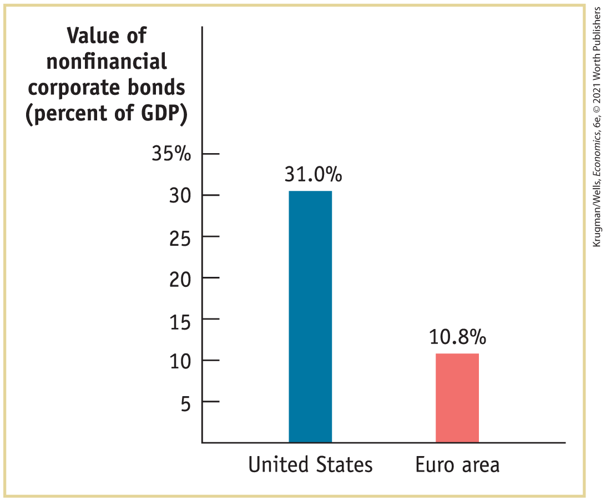
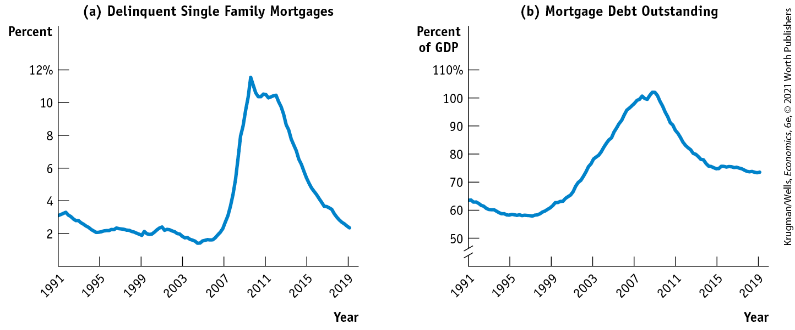

#### Mutual Funds

As we’ve seen, owning shares of a company entails accepting risk in return for a higher potential reward. But it should come as no surprise that stock investors can lower their total risk by engaging in diversification. By owning a *diversified portfolio* of stocks — a group of stocks in which risks are unrelated to, or offset by, one another — rather than concentrating investment in the shares of a single company or a group of related companies, investors can reduce their risk.

In addition, financial advisers, aware that most people are risk-averse, almost always advise their clients to diversify not only their stock portfolio but also their entire wealth by holding other assets in addition to stock — assets such as bonds and cash. (And, for good measure, to have plenty of insurance in case of accidental losses.)

However, for individuals who don’t have a large amount of money to invest — say, \$1 million or more — building a diversified stock portfolio can incur high transaction costs (particularly fees paid to stockbrokers) because they are buying a few shares of a lot of companies. Fortunately for such investors, *mutual funds* help solve the problem of achieving diversification without high transaction costs.

A <a href="#kru_9781319245269_EM_glossary.xhtml#pau_9781319320164_0fmiajIpIx" id="kru_9781319245269_ch10_03.xhtml#pau_9781319320164_2ZJCISI3NL" class="glossref" role="doc-glossref">mutual fund</a> is a financial intermediary that creates a stock portfolio by buying and holding shares in companies and then selling shares of the stock portfolio to individual investors. By buying these shares, investors with a relatively small amount of money to invest can indirectly hold a diversified portfolio, achieving a better return for any given level of risk than they could otherwise achieve. <a href="#kru_9781319245269_ch10_03.xhtml#pau_9781319320164_BTotUTL203" id="kru_9781319245269_ch10_03.xhtml#pau_9781319320164_d4QsVswxxi" class="crossref">Table 10-1</a> shows an example of a diversified mutual fund, the Vanguard 500 Index Fund. It shows the percentage of investors’ money invested in the stocks of the largest companies in the mutual fund’s portfolio.

<aside aria-label="title 14" class="glossary c3 main-flow v1" epub:type="glossary" id="pau_9781319320164_6ZhWLeuQog">

**mutual fund**  
A **mutual fund** is a financial intermediary that creates a stock portfolio and then resells shares of this portfolio to individual investors.

</aside>

| Company                                                                                                                            | Percent of mutual fund assets invested in a company |
|------------------------------------------------------------------------------------------------------------------------------------|-----------------------------------------------------|
| Microsoft Corp.                                                                                                                    |      5.03%                                          |
| Apple Inc.                                                                                                                         | 4.64                                                |
| <a href="http://Amazon.com" id="kru_9781319245269_ch10_03.xhtml#pau_9781319320164_vq5w5UQURc" class="external">Amazon.com</a> Inc. | 3.19                                                |
| Facebook Inc. A                                                                                                                    | 1.88                                                |
| Alphabet Inc. A                                                                                                                    | 1.63                                                |
| Alphabet Inc. C                                                                                                                    | 1.63                                                |
| Berkshire Hathaway Inc. B                                                                                                          | 1.60                                                |
| Johnson & Johnson                                                                                                                  | 1.44                                                |
| JPMorgan Chase & Co.                                                                                                               | 1.43                                                |
| Visa Inc. A                                                                                                                        | 1.27                                                |
| *Data from:* Morningstar.                                                                                                          |                                                     |

TABLE 10-1 Vanguard 500 Index Fund, Top Holdings (as of January 2020)

Many mutual funds also perform market research on the companies they invest in. This is important because there are thousands of stock-issuing U.S. companies (not to mention foreign companies), each differing in terms of its likely profitability, dividend payments, and so on. It would be extremely time-consuming and costly for an individual investor to do adequate research on even a small number of companies. Mutual funds save transaction costs by doing this research for their customers.

The mutual fund industry represents a huge portion of the modern U.S. economy, not just of the U.S. financial system. In total, U.S. mutual funds had assets of \$17.7 trillion at the end of 2019. In 2019, the largest mutual fund company was Vanguard, with \$3.4 trillion in assets in mutual funds.

We should mention, by the way, that mutual funds charge fees for their services. These fees are quite small for mutual funds that simply hold a diversified portfolio of stocks without trying to pick winners. But the fees charged by mutual funds that claim to have special expertise in investing your money can be quite high.

#### Pension Funds and Life Insurance Companies

In addition to mutual funds, many Americans have holdings in <a href="#kru_9781319245269_EM_glossary.xhtml#pau_9781319320164_gGMZcVExIN" id="kru_9781319245269_ch10_03.xhtml#pau_9781319320164_GztVnjMCQI" class="glossref" role="doc-glossref">pension funds</a>, nonprofit institutions that collect the savings of their members and invest those funds in a wide variety of assets, providing their members with income when they retire. Although pension funds are subject to some special rules and receive special treatment for tax purposes, they function much like mutual funds. They invest in a diverse array of financial assets, allowing their members to achieve more cost-effective diversification and market research than they would be able to achieve individually. At the end of 2019, pension funds in the United States held more than \$24.4 trillion in assets.

<aside aria-label="title 15" class="glossary c3 main-flow v1" epub:type="glossary" id="pau_9781319320164_jenZPKTDcJ">

**pension fund**  
A **pension fund** is a type of mutual fund that holds assets in order to provide retirement income to its members.

</aside>

Americans also have substantial holdings in the policies of <a href="#kru_9781319245269_EM_glossary.xhtml#pau_9781319320164_PcGR4dIapR" id="kru_9781319245269_ch10_03.xhtml#pau_9781319320164_R2afh3F9vU" class="glossref" role="doc-glossref">life insurance companies</a>, which guarantee a payment to the policyholder’s beneficiaries (typically, the family) when the policyholder dies. By enabling policyholders to cushion their beneficiaries from financial hardship arising from their death, life insurance companies also improve welfare by reducing risk.

<aside aria-label="title 16" class="glossary c3 main-flow v1" epub:type="glossary" id="pau_9781319320164_AWlzXtN5m0">

**life insurance company**  
A **life insurance company** sells policies that guarantee a payment to a policyholder’s beneficiaries when the policyholder dies.

</aside>

#### Banks

Recall the problem of liquidity: other things equal, people want assets that can be readily converted into cash. Bonds and stocks are much more liquid than physical assets or loans, yet the transaction cost of selling bonds or stocks to meet a sudden expense can be large. Furthermore, for many small and moderate-size companies, the cost of issuing bonds and stocks is too large given the modest amount of money they seek to raise. A *bank* is an institution that helps resolve the conflict between lenders’ needs for liquidity and the financing needs of borrowers who don’t want to use the stock or bond markets.

A bank works by first accepting funds from *depositors:* when you put your money in a bank, you are essentially becoming a lender by lending the bank your money. In return, you receive credit for a <a href="#kru_9781319245269_EM_glossary.xhtml#pau_9781319320164_J6FqLBCiI7" id="kru_9781319245269_ch10_03.xhtml#pau_9781319320164_OAqKVgCFEA" class="glossref" role="doc-glossref">bank deposit</a> — a claim on the bank, which is obliged to give you your cash if and when you demand it. So a bank deposit is a financial asset owned by the depositor and a liability of the bank that holds it.

<aside aria-label="title 17" class="glossary c3 main-flow v1" epub:type="glossary" id="pau_9781319320164_6WOx6e6tcp">

**bank deposit**  
A **bank deposit** is a claim on a bank that obliges the bank to give the depositor their cash when demanded.

</aside>
<aside class="case-study c3 main-flow v5" epub:type="case-study" id="pau_9781319320164_ro733N0bhZ" title="GLOBAL COMPARISON CORPORATE BONDS IN THE UNITED STATES AND THE EURO AREA">

##### Global comparison

CORPORATE BONDS IN THE UNITED STATES AND THE EURO AREA

A business that wants to borrow funds could do this two ways: by selling bonds to investors or by getting loans from banks. There are advantages and disadvantages to each strategy.

On the one hand, issuing bonds tends to be cheaper than borrowing from a bank, because it eliminates the middleman. Also, banks often place conditions on loans, restricting the borrower’s freedom to conduct its business as it chooses. On the other hand, bank loans can be less risky than issuing bonds. If a borrower gets into difficulty, its bank will typically be supportive, offering more time to repay if a good plan is in place to fix their problems. Bond holders are much less flexible.

It’s a tough choice — and interestingly, companies in the United States and their counterparts in Europe generally make different choices. The figure shows the value of bonds issued by nonfinancial corporations in the United States and in the euro area, the group of European countries using the euro as a common currency, both expressed as a percentage of GDP in 2019. U.S. companies issue more bonds than their European counterparts, who rely much more on bank borrowing.

Why the difference? Generally, U.S. companies are more inclined to take risks. Also, European households are more inclined than U.S. households to leave large sums in bank accounts. As a result, European banks have more money to lend than their U.S. counterparts.

<figure id="pau_9781319320164_1outbiRLgw" class="figure lm_img_lightbox unnum c4 main-flow">

<figcaption>
<em>Data from:</em> BIS Statistics Explorer.
</figcaption>
</figure>

<aside class="hidden" id="pau_9781319320164_zN4dPKZ3CH" title="hidden">

The vertical axis labeled Value of nonfinancial corporate bonds (percent of G D P) ranges from 5 to 35 percent in increments of 5 percent. The horizontal axis shows United States and Euro area. The data from the bar graph are as follows, United States, 31.0 percent; and Euro area, 10.8 percent.

</aside>
</aside>

A bank, however, keeps only a fraction of its customers’ deposits in the form of ready cash. Most of its deposits are lent out to businesses, buyers of new homes, and other borrowers. These loans come with a long-term commitment by the bank to the borrower: as long as the borrower makes their payments on time, the loan cannot be recalled by the bank and converted into cash. So a bank enables those who wish to borrow for long lengths of time to use the funds of those who wish to lend but simultaneously want to maintain the ability to get their cash back on demand.

More formally, a <a href="#kru_9781319245269_EM_glossary.xhtml#pau_9781319320164_KaszYeNCRw" id="kru_9781319245269_ch10_03.xhtml#pau_9781319320164_8Y3md8m6IT" class="glossref" role="doc-glossref">bank</a> is a financial intermediary that provides liquid financial assets in the form of deposits to lenders and uses their funds to finance the illiquid investment spending needs of borrowers. In essence, a bank is engaging in a kind of mismatch: lending for long periods of time while subject to the condition that its depositors could demand their funds back at any time. How can it manage that?

<aside aria-label="title 18" class="glossary c3 main-flow v1" epub:type="glossary" id="pau_9781319320164_lCtbqCj1Pj">

**bank**  
A **bank** is a financial intermediary that provides liquid assets in the form of bank deposits to lenders and uses those funds to finance the illiquid investment spending needs of borrowers.

</aside>

The bank counts on the fact that, on average, only a small fraction of its depositors will want their cash at the same time. On any given day, some people will make withdrawals and others will make new deposits; these will roughly cancel each other out. So the bank needs to keep only a limited amount of cash on hand to satisfy its depositors.

In addition, if a bank becomes financially incapable of paying its depositors, individual bank deposits are guaranteed to depositors up to \$250,000 by the Federal Deposit Insurance Corporation, or FDIC, a federal agency. This reduces the risk to a depositor of holding a bank deposit, in turn reducing the incentive to withdraw funds if concerns about the financial state of the bank should arise. So, under normal conditions, banks need to hold only a fraction of their depositors’ cash.

By reconciling the needs of savers for liquid assets with the needs of borrowers for long-term financing, banks play a key economic role. As the following Economics in Action explains, the creation of a well-functioning banking system seems to be an important condition for economic success.

### ECONOMICS \>\> *in Action*

Banks, Success, and South America

<figure id="pau_9781319320164_gShWx2gt8Z" class="figure lm_img_lightbox unnum c2 right">

<figcaption>
Reforms to the financial system made banking safer in Chile, fueling growth.
</figcaption>
</figure>

Argentina, as we noted in <a href="#kru_9781319245269_ch09_01.xhtml#pau_9781319320164_iTpnzadcyz" id="kru_9781319245269_ch10_03.xhtml#pau_9781319320164_W8XV4yo7UE" class="crossref">Chapter 9</a>, is a notable example of disappointing long-run economic growth. In the early twentieth century it was considered a rich country, but GDP per capita has grown only slowly since then. And in the past few decades Argentina has fallen well behind some of its neighbors, especially Chile, Latin America’s biggest economic success story. As recently as 1990 Argentina was slightly richer than Chile, but since then Chile’s GDP per capita has risen at an annual rate of 3.3%, versus only 1.7% in Argentina, so that Chile is now about 50% richer than its neighbor.

What explains this difference in fortunes? There are surely multiple reasons, but financial development is probably an important factor. After a banking crisis in the early 1980s, Chile implemented reforms that made banks safer, encouraging savers to increase deposits and allowing rapid growth in loans to the private sector. Argentina, by contrast, continued to experience a series of banking crises, as well as bouts of inflation that eroded the real value of deposits.

The result is that there is vastly more financial intermediation in Chile than in Argentina. Economists often use domestic credit to the private sector, measured as a percentage of GDP, as a rough measure of the amount of financial intermediation in an economy. In advanced countries with well-developed financial institutions this number typically ranges between 100% and 200%. In 2018 Chile’s domestic credit was 116% of GDP, similar to that of advanced countries. In Argentina the number was only 16%, indicating an economy with very limited financial intermediation. This probably means that Chile is doing a much better job than its once-richer neighbor of channeling its savings into productive investments.

### *\>\> Quick Review*

- **Financial markets** are where households can invest their current savings or their **wealth** by purchasing either **financial assets** or **physical assets.** A financial asset is a seller’s **liability.**
- A well-functioning financial system reduces **transaction costs**, reduces **financial risk** by enabling **diversification**, and provides **liquid** assets, which investors prefer to **illiquid** assets.
- The four main types of financial assets are **loans**, bonds, stocks, and **bank deposits.** A recent innovation is **loan-backed securities**, which are more liquid and more diversified than individual loans. Bonds with a higher **default** risk typically must pay a higher interest rate.
- The most important types of **financial intermediaries** are **mutual funds, pension funds, life insurance companies**, and **banks.**
- A bank accepts bank deposits, which obliges it to return depositors’ cash on demand, and lends those funds to borrowers for long lengths of time.

### *\>\> Check Your Understanding* 10-2

1.  Rank the following assets in terms of (i) level of transaction costs, (ii) level of risk, (iii) level of liquidity.
    1.  A bank deposit with a guaranteed interest rate
    2.  A share of a highly diversified mutual fund, which can be quickly sold
    3.  A share of the family business, which can be sold only if you find a buyer and all other family members agree to the sale
2.  What relationship would you expect to find between the level of development of a country’s financial system and its level of economic development? Explain in terms of the country’s level of savings and level of investment spending.

## Financial Fluctuations

We’ve learned that the financial system is an essential part of the economy; without stock markets, bond markets, and banks, long-run economic growth would be hard to achieve. Yet the news isn’t entirely good: the financial system sometimes doesn’t function well and instead is a source of instability in the short run.

In fact, the financial consequences of a sharp fall in housing prices became a major problem for economic policy makers starting in the summer of 2007. By the fall of 2008, it was clear that the U.S. economy faced a severe slump as it adjusted to the consequences of greatly reduced home values, and unemployment stayed elevated for years. We could easily write a whole book on asset market fluctuations. In fact, many people have. Here, we briefly discuss the causes of asset price fluctuations.

### The Demand for Stocks

Once a company issues shares of stock to investors, those shares can then be resold to other investors in the stock market. And thanks to cable TV and the internet, you can easily spend all day watching stock market fluctuations — the movement up and down of the prices of individual stocks — as well as summary measures of stock prices like the Dow Jones Industrial Average. These fluctuations reflect changes in supply and demand by investors. But what causes the supply and demand for stocks to shift?

Remember that stocks are financial assets: they are shares in the ownership of a company. Unlike a good or service, whose value to its owner comes from its consumption, the value of an asset comes from its ability to generate higher future consumption of goods or services.

A financial asset allows higher future consumption in two ways. First, many financial assets provide regular income to their owners in the form of interest payments or dividends. But many companies don’t pay dividends; instead, they retain their earnings to finance future investment spending. Investors purchase non-dividend-paying stocks in the belief that they will earn income from selling the stock in the future at a profit, the second way of generating higher future income. Even in the cases of a bond or a dividend-paying stock, investors will not want to purchase an asset that they believe will sell for less in the future than today, because such an asset will reduce their wealth when they sell it.

So the value of a financial asset today depends on investors’ beliefs about the future value or price of the asset. If investors believe that it will be worth more in the future, they will demand more of the asset today at any given price; consequently, today’s equilibrium price of the asset will rise. Conversely, if investors believe the asset will be worth less in the future, they will demand less today at any given price; consequently, today’s equilibrium price of the asset will fall. Today’s stock prices will change according to changes in investors’ expectations about future stock prices.

<aside class="case-study c3 main-flow v1" epub:type="case-study" id="pau_9781319320164_PZqkbIpqxp" title="For Inquiring Minds">

#### For inquiring minds 

How Now, Dow Jones?

Financial news reports often lead with the day’s stock market action, as measured by changes in the Dow Jones Industrial Average, the S&P 500, and the NASDAQ.

All three are stock market indices. Like the consumer price index, they are numbers constructed as a summary of average prices — in this case, prices of stocks.

- The Dow, created by the financial analysis company Dow Jones, is an index of the prices of stock in 30 leading companies.
- The S&P 500 is an index of 500 companies, created by Standard and Poor’s, another financial company.
- The NASDAQ is compiled by the National Association of Securities Dealers, which trades the stocks of smaller new companies.

Because these indices contain different groups of stocks, they track somewhat different things. The Dow, because it contains only 30 of the largest companies, tends to reflect traditional business powerhouses. The NASDAQ is heavily influenced by technology stocks. The S&P 500, a broad measure, is in between.

These indexes give investors a quick, snapshot view of how stocks from certain sectors of the economy are doing. And the price of a stock embodies investors’ expectations about the future prospects of the underlying company. By implication, an index composed of stocks drawn from companies in a particular sector embodies investors’ expectations of the future prospects of that sector of the economy.

<figure id="pau_9781319320164_tGoVU1V7iv" class="figure lm_img_lightbox unnum c5 center">

<figcaption>
The numbers tell the tale.
</figcaption>
</figure>

</aside>

Suppose an event occurs that leads to a rise in the expected future price of a company’s shares — say, for example, Apple announces that it forecasts higher than expected profitability due to torrential sales of the latest version of the iPhone. Demand for Apple shares will increase. At the same time, existing shareholders will be less willing to supply their shares to the market at any given price, leading to a decrease in the supply of Apple shares. And as we know, an increase in demand or a decrease in supply (or both) leads to a rise in price.

Alternatively, suppose that an event occurs that leads to a fall in the expected future price of a company’s shares — say, Home Depot announces that it expects lower profitability because a slump in home sales has depressed the demand for home improvements. Demand for Home Depot shares will decrease. At the same time, supply will increase because existing shareholders will be more willing to supply their Home Depot shares to the market. Both changes lead to a fall in the stock price.

So stock prices are determined by the supply and demand for shares — which, in turn, depend on investors’ expectations about the future stock price.

Stock prices are also affected by changes in the attractiveness of substitute assets, like bonds. As we learned early on, the demand for a particular good decreases when purchasing a substitute good becomes more attractive — say, due to a fall in its price. The same lesson holds true for stocks: when purchasing bonds becomes more attractive due to a rise in interest rates, stock prices will fall. And when purchasing bonds becomes less attractive due to a fall in interest rates, stock prices will rise.

### The Demand for Other Assets

Everything we’ve just said about stocks applies to other assets as well, including physical assets. Consider the demand for commercial real estate — office buildings, shopping malls, and other structures that provide space for business activities. An investor who buys an office building does so for two reasons. First, because space in the building can be rented out, the owner of the building receives income in the form of rent. Second, the investor may expect the building to rise in value, meaning that it can be sold at a higher price at some future date.

As in the case of stocks, the demand for commercial real estate also depends on the attractiveness of substitute assets, especially bonds. When interest rates rise, the demand for commercial real estate decreases; when interest rates fall, the demand for commercial real estate increases.

Most Americans don’t own commercial real estate. Only half of the population owns any stock, even indirectly through mutual funds, and for most of those people, stock ownership is well under \$50,000. However, at the end of 2019 about 65% of American households owned another kind of asset: their own homes. What determines housing prices?

You might wonder whether home prices can be analyzed the same way we analyze stock prices or the price of commercial real estate. After all, stocks pay dividends, commercial real estate yields rents, but when a family lives in its own home, no money changes hands.

In economic terms, however, that doesn’t matter very much. To a large extent, the benefit of owning your own home is the fact that you don’t have to pay rent to someone else — or, to put it differently, it’s as if you were paying rent to yourself. In fact, the U.S. government includes *implicit rent* — an estimate of the amount that homeowners, in effect, pay to themselves — in its estimates of GDP. The amount people are willing to pay for a house depends in part on the implicit rent they expect to receive from that house.

The demand for housing, like the demand for other assets, also depends on what people expect to happen to future prices: they’re willing to pay more for a house if they believe they can sell it at a higher price sometime in the future.

Last but not least, the demand for houses depends on interest rates: a rise in the interest rate increases the cost of a mortgage and leads to a decrease in housing demand; a fall in the interest rate reduces the cost of a mortgage and causes an increase in housing demand.

All asset prices, then, are determined by a similar set of factors. But we haven’t yet fully answered the question of what determines asset prices because we haven’t explained what determines investors’ *expectations* about future asset prices.

### Asset Price Expectations

There are two principal competing views about how asset price expectations are determined. One view, which comes from traditional economic analysis, emphasizes the rational reasons why expectations *should* change. The other, widely held by market participants and also supported by some economists, emphasizes the irrationality of market participants.

#### The Efficient Markets Hypothesis

Suppose you were trying to assess what Home Depot’s stock is really worth. To do this, you would look at the *fundamentals,* the underlying determinants of the company’s future profits. These would include factors like the changing shopping habits of the U.S. public and the prospects for home remodeling. You would also want to compare the earnings you could expect to receive from Home Depot with the likely returns on other financial assets, such as bonds.

According to one view of asset prices, the value you would come up with after a careful study of this kind would, in fact, turn out to be the price at which Home Depot stock is already selling in the market. Why? Because all publicly available information about Home Depot’s fundamentals is already embodied in its stock price. Any difference between the market price and the value suggested by a careful analysis of the underlying fundamentals indicates a profit opportunity to smart investors, who then sell Home Depot stock if it looks overpriced and buy it if it looks underpriced.

The <a href="#kru_9781319245269_EM_glossary.xhtml#pau_9781319320164_jMoJfhpxkB" id="kru_9781319245269_ch10_04.xhtml#pau_9781319320164_FAhreKyJAK" class="glossref" role="doc-glossref">efficient markets hypothesis</a> is the general form of this view; it means that asset prices always embody all publicly available information. One implication of the efficient markets hypothesis is that at any point in time, stock prices are fairly valued: they reflect all currently available information about fundamentals. So they are neither overpriced nor underpriced.

<aside aria-label="title 1" class="glossary c3 main-flow v1" epub:type="glossary" id="pau_9781319320164_8aGvJJNjrs">

**efficient markets hypothesis**  
According to the **efficient markets hypothesis**, asset prices embody all publicly available information.

</aside>

Another implication of the efficient markets hypothesis is that the prices of stocks and other assets should change only in response to new information about the underlying fundamentals. Since new information is by definition unpredictable — if it were predictable, it wouldn’t be new information — movements in asset prices are also unpredictable. As a result, the movement of, say, stock prices will follow a <a href="#kru_9781319245269_EM_glossary.xhtml#pau_9781319320164_8I4nCPJe38" id="kru_9781319245269_ch10_04.xhtml#pau_9781319320164_IzqvW6FGuD" class="glossref" role="doc-glossref">random walk</a> — the general term for the movement over time of an unpredictable variable.

<aside aria-label="title 2" class="glossary c3 main-flow v1" epub:type="glossary" id="pau_9781319320164_HWsOq6Yyb8">

**random walk**  
A **random walk** is the movement over time of an unpredictable variable.

</aside>

The efficient markets hypothesis plays an important role in understanding how financial markets work. Most investment professionals and many economists, however, regard it as an oversimplification. Investors, they claim, aren’t that rational.

#### Irrational Markets?

Many people who actually trade in the markets, such as individual investors and professional money managers, are skeptical of the efficient markets hypothesis. They believe that markets often behave irrationally and that a smart investor can engage in successful *market timing* — buying stocks when they are underpriced and selling them when they are overpriced.

Although economists are generally skeptical about claims that there are surefire ways to outsmart the market, many have also challenged the efficient markets hypothesis. It’s important to understand, however, that finding particular examples where the market got it wrong does not disprove the efficient markets hypothesis. If the price of Home Depot stock plunges from \$40 to \$10 because of a sudden change in buying patterns, this doesn’t mean that the market was inefficient in originally pricing the stock at \$40. The fact that buying patterns were about to change wasn’t publicly available information, so it wasn’t embodied in the earlier stock price.

<aside class="case-study c3 main-flow v1" epub:type="case-study" id="pau_9781319320164_Ki9wJTN9mn" title="For Inquiring Minds">

##### For inquiring minds 

Behavioral Finance

Individuals often make irrational — sometimes predictably irrational — choices that leave them worse off economically than would other, feasible alternatives. People also have a habit of repeating the same decision-making mistakes. This kind of behavior is the subject of *behavioral economics,* which includes the rapidly growing subfield of *behavioral finance,* the study of how investors in financial markets often make predictably irrational choices. In fact, the 2013 Nobel Prize in Economics was awarded to Yale professor Robert Shiller (along with two others), for his work showing how financial markets exhibit clear signs of irrationality.

Like most people, investors depart from rationality in systematic ways. In particular, they are prone to

- *Overconfidence:* having a misguided faith that they are able to spot a winning stock
- *Loss aversion:* being unwilling to sell an unprofitable asset and accept the loss
- A *herd mentality:* buying an asset when its price has already been driven high and selling it when its price has already been driven low

This irrational behavior raises an important question: can investors who *are* rational make a lot of money at the expense of those investors who aren’t — for example, by buying a company’s stock if irrational fears make it cheap?

The answer to this question is sometimes yes and sometimes no. Some professional investors have made huge profits by betting against irrational moves in the market — buying when there is irrational selling and selling when there is irrational buying. For example, the billionaire hedge fund manager John Paulson made \$4 billion by betting against subprime mortgages during the U.S. housing bubble of 2007–2008 because he understood that these financial assets were being sold at inflated prices.

But sometimes even a rational investor cannot profit from market irrationality. For example, a money manager has to obey customers’ orders to buy or sell even when those actions are irrational. Likewise, it can be much safer for professional money managers to follow the herd: if they do that and their investments go badly, they have the career-saving excuse that no one foresaw a problem.

But if they’ve gone against the herd and their investments go south, they are likely to be fired for making poor choices. So rational investors can even exacerbate the irrational moves in financial markets.

Some observers of historical trends hypothesize that financial markets alternate between periods of complacency and forgetfulness, which breed bubbles as investors irrationally believe that prices can only go up, followed by a crash, which in turn leads investors to avoid financial markets altogether and renders asset prices irrationally cheap.

Clearly, the events of the past 20 years, with a huge housing bubble followed by extreme turmoil in financial markets, have given researchers in the area of behavioral finance a lot of material to work with.

<figure id="pau_9781319320164_KVPLx4gpsk" class="figure lm_img_lightbox unnum c4 main-flow">

</figure>

</aside>

Serious challenges to the efficient markets hypothesis focus instead either on evidence of systematic misbehavior of market prices or on evidence that individual investors don’t behave in the way the theory suggests. For example, some economists believe they have found strong evidence that stock prices fluctuate more than can be explained by news about fundamentals.

Others believe they have strong evidence that individual investors behave in systematically irrational ways. For example, people seem to expect that a stock that has risen in the past will keep on rising, even though the efficient markets hypothesis tells us there is no reason to expect this. The same appears to be true of other assets, especially housing: the great housing bubble, discussed in the Economics in Action that follows this section, arose in large part because homebuyers assumed that home prices would continue rising in the future.

### Asset Prices and Macroeconomics

How should macroeconomists and policy makers deal with the fact that asset prices fluctuate a lot and that these fluctuations can have important economic effects? This question has become one of the major problems facing macroeconomic policy.

On one side, policy makers are reluctant to assume that the market is wrong — that asset prices are either too high or too low. In part, this reflects the efficient markets hypothesis, which says that any information that is publicly available is already accounted for in asset prices. More generally, it’s hard to make the case that government officials are better judges of appropriate prices than private investors who are putting their own money on the line.

On the other side, the past 25 years were marked by not one but two huge asset bubbles, each of which created major macroeconomic problems when it burst. In the late 1990s the prices of technology stocks, including but not limited to dot-com internet firms, soared to hard-to-justify heights. When the bubble burst, these stocks lost, on average, two-thirds of their value in a short time, helping to cause the 2001 recession and a period of high unemployment. A few years later there was a major bubble in housing prices. The collapse of this bubble in 2008 triggered a severe financial crisis followed by a deep recession, and the lingering effects of the crisis afflicted the U.S. economy years later.

These events have prompted much debate over whether and how to limit financial instability. We discuss financial regulation and the efforts to make it more effective in <a href="#kru_9781319245269_ch14_01.xhtml#pau_9781319320164_kfN9Q68LJR" id="kru_9781319245269_ch10_04.xhtml#pau_9781319320164_X1ZMRVH4VH" class="crossref">Chapter 14</a>.

### ECONOMICS \>\> *in Action*

The Rise and Fall of Mortgage Delinquencies

For the past 40 years about a quarter of U.S. investment spending, on average, has been “residential fixed investment”: building places for people to live. Because these are mainly single-family homes or condos rather than apartment buildings, families must come up with large sums to purchase their dwellings, and relatively few people can afford to pay cash.

Instead, home purchases are typically paid for by taking out a mortgage — a loan from a bank or other financial intermediary that gives the lender the right to seize your house if you fail to make scheduled payments. That might sound like a risky proposition for the borrower; what if one or more members of the family lose their jobs or face unexpected medical expenses, and can’t keep up the payments? In practice, however, “delinquencies” — missed payments — are normally rare, affecting only about 1 mortgage in 40. One reason the rate is so low is that families in financial difficulties can often sell their houses and pay off their loans.

As panel (a) of <a href="#kru_9781319245269_ch10_04.xhtml#pau_9781319320164_puLxR2fXQV" id="kru_9781319245269_ch10_04.xhtml#pau_9781319320164_91S9AasEED" class="crossref">Figure 10-11</a> shows, however, there was a huge surge in mortgage delinquencies from 2007 to 2010, at which point almost 1 in 8 families was missing payments. This period of widespread mortgage delinquencies lasted several years, before beginning a gradual decline. As of 2019 delinquencies were back down to normal historical levels.

<figure id="pau_9781319320164_puLxR2fXQV" class="figure lm_img_lightbox num c4 main-flow">

<figcaption>
FIGURE 10-11 Debt and Delinquencies

<em>Data from:</em> Panel (a): Board of Governors of the Federal Reserve System. Panel (b): Bureau of Economic Analysis and Board of Governors of the Federal Reserve System.
</figcaption>
</figure>

<aside class="hidden" id="pau_9781319320164_360nFkXRVO" title="hidden">

Graph (a) Delinquent Single Family Mortgages: The vertical axis, labeled Percent ranges from 0 to 12 percent in increments of 2 percent. The horizontal axis, labeled Year ranges from 1991 to 2019 in increments of 4 years. The graph plots a curve that starts at (1991, 3), decreases to (2003, 1.5) through (1995, 2) and (1999, 2), then increases to (2010, 11.5) through (2007, 1.5) and (2008, 6), and then decreases to (2019, 3) through (2011, 10) and (2015, 5). The curve shows a fluctuating trend with continuous rise and fall. Graph (b) Mortgage Debt Outstanding: The vertical axis labeled Percent of G D P is truncated and ranges from 50 to 110 percent in increments of 10 percent. The horizontal axis labeled Year ranges from year 1991 to year 2019 in increments of 4 years. The graph plots a curve that starts at (1991, 64), decreases to (1997, 58), then increases to (2008, 100) through (2004, 80), and then decreases to (2019, 75) through (2011, 85). All values are approximated.

</aside>

What happened? As panel (b) of <a href="#kru_9781319245269_ch10_04.xhtml#pau_9781319320164_puLxR2fXQV" id="kru_9781319245269_ch10_04.xhtml#pau_9781319320164_KKyvVX8AwR" class="crossref">Figure 10-11</a> shows, there was a dramatic increase in mortgage debt between 2000 and 2007, which was closely associated with a period of rapidly rising home prices. Both borrowers and lenders believed that it was safe for homebuyers to borrow more than in the past, because rising prices would make it easy to sell houses and repay loans even if borrowers experienced financial difficulties.

As it turned out, however, the big rise in home prices was a bubble — and the bursting of the bubble provoked a severe recession, which led to high unemployment and greater financial distress. So delinquencies surged.

Eventually, as you can see in the figure, reduced borrowing and economic recovery reduced the level of mortgage debt relative to income, and delinquencies returned to more or less normal levels.

### *\>\> Quick Review*

- Financial market fluctuations can be a source of short-run macroeconomic instability.
- Asset prices are driven by supply and demand as well as by the desirability of competing assets like bonds. Supply and demand also reflect expectations about future asset prices. One view of expectations is the **efficient markets hypothesis**, which leads to the view that stock prices follow a **random walk.**
- Market participants and some economists question the efficient markets hypothesis. In practice, policy makers don’t assume that they can outsmart the market, but they also don’t assume that markets will always behave rationally.
