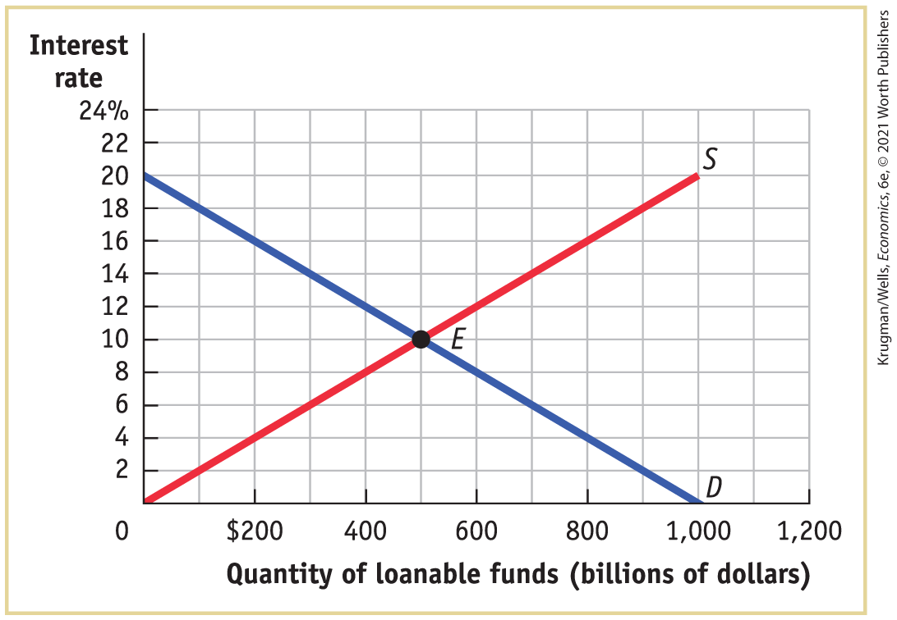
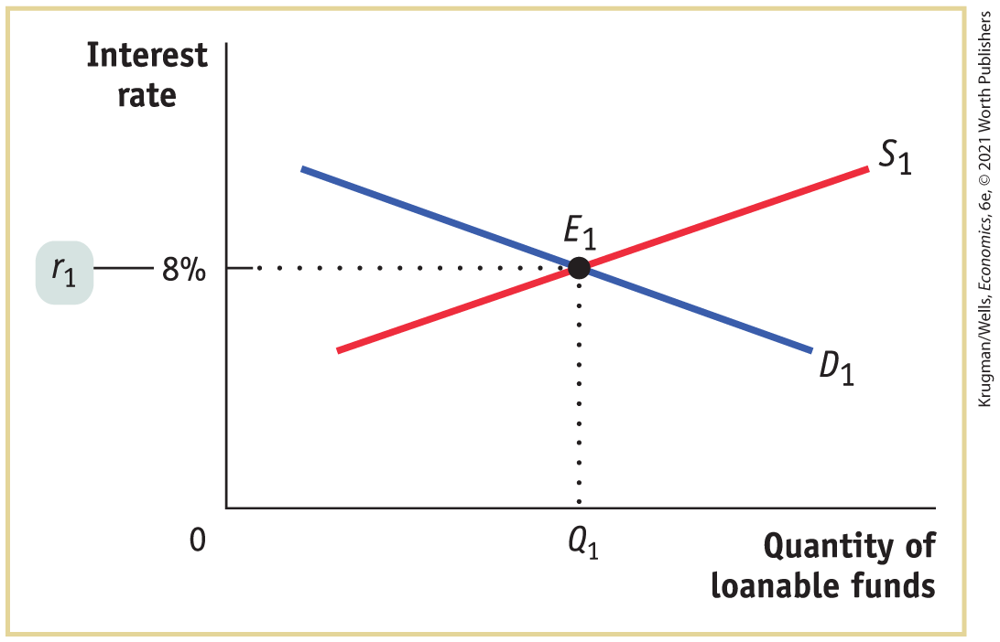
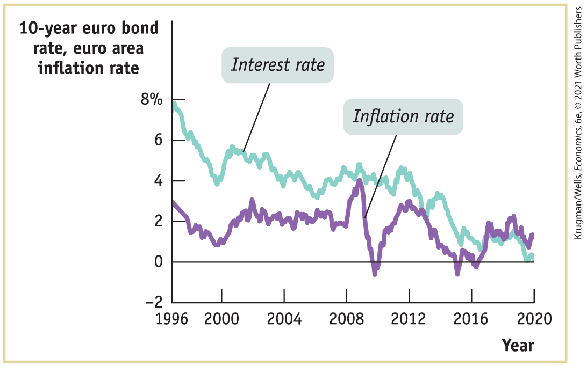
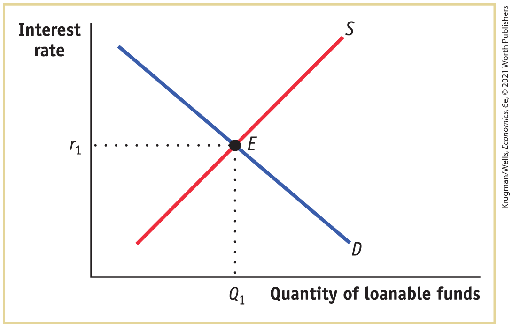

### *\>\> Check Your Understanding* 10-3

1.  What is the likely effect of each of the following events on the stock price of a company? Explain your answers.
    1.  The company announces that although profits are low this year, it has discovered a new line of business that will generate high profits next year.
    2.  The company announces that although it had high profits this year, those profits will be less than had been previously announced.
    3.  Other companies in the same industry announce that sales are unexpectedly slow this year.
    4.  The company announces that it is on track to meet its previously forecast profit target.
2.  Assess the following statement: “Although many investors may be irrational, it is unlikely that over time they will behave irrationally in exactly the same way — such as always buying stocks the day after the Dow has risen by 1%.”

## Business case 

Grameen Bank: Banking Against Poverty

<figure id="pau_9781319320164_Uys2gyjHxl" class="figure lm_img_lightbox unnum c2 right">

</figure>

An old joke says that a banker will only lend you money if you don’t need it. So when Guadalupe Perez found it hard to pay the rent for her party decoration store in Queens, New York, as the Great Recession hurt her business, she normally would have been forced to close her doors. Instead she was able to turn for help to Grameen America, obtaining a loan to tide her over. “It opened up a way for me to keep my business,” she said. “It was a loan that I could pay little by little; I felt it was a good choice for me.” And she returned to Grameen, borrowing several more times to expand her store and invest in more inventory.

Grameen America is a subsidiary of Grameen Bank in Bangladesh, which pioneered the business of *microcredit,* providing small loans to poor individuals. It was created in the mid-1970s by Muhammad Yunus, a Bangladeshi economist with a PhD from Vanderbilt University. Regular banks require a borrower to have an established credit history $\text{and/or}$ assets that are put up as collateral for the loan (and will be seized if the loan isn’t repaid on time) — requirements that a poor person can rarely meet.

Instead, Grameen Bank relies on collective responsibility to ensure that its loans are repaid: each borrower is part of a five-member group that approves each other’s loan and provides oversight. The group doesn’t have any legal obligation to repay the loan, but in practice the group usually does take financial responsibility if a borrower gets into difficulties. If everyone in the group repays on time, each member is able to borrow a larger amount the next time.

Grameen operates in over 100 countries, from the United States to Uganda. The great majority of its customers are rural women seeking to escape poverty by starting small businesses. Since its inception it has lent over \$30 billion to well over nine million women.

Even in a rich country like the United States, *microlending* — defined as a loan of less than \$50,000 — has become a booming business. Since 2008, when it was founded, through 2019 Grameen America has made over 530,000 microloans to women and dispensed nearly \$1.4 billion. The company estimates that borrowers have increased their income by an average of \$1,800 annually.

However, microcredit isn’t a panacea. Multiple studies have found that while microcredit does increase small-business investment, its impacts in reducing poverty and improving family well-being are limited. And in some cases it leads to excessive debt. Still, the overall impact of microcredit is positive, especially when combined with other efforts to expand access to the financial system.

Fittingly, in 2006 Yunus and Grameen received the Nobel Peace Prize for their contributions to development and poverty reduction.

<aside class="assessments c3 main-flow v1" epub:type="assessments" id="pau_9781319320164_oAEztneNh9">

### Questions for thought

1.  What market inefficiency is being exploited by Grameen Bank? What is the source of this inefficiency?
2.  What tasks of a financial system does microlending perform?
3.  What do you predict is the effect of Grameen Bank’s lending on a community?

</aside>

### Summary

1.  Investment in physical capital is necessary for long-run economic growth. So in order for an economy to grow, it must channel savings into investment spending.
2.  According to the **savings–investment spending identity**, savings and investment spending are always equal for the economy as a whole. The government is a source of savings when it runs a positive **budget balance**, also known as a **budget surplus;** it is a source of dissavings when it runs a negative budget balance, also known as a **budget deficit.** One way a government can finance a budget deficit is by borrowing. **Government borrowing** is the total amount of funds borrowed by federal, state, and local governments in the financial markets. In a closed economy, savings is equal to **national savings**, the sum of private savings plus the budget balance. In an open or international economy, savings is equal to national savings plus **net capital inflow** of foreign savings. When a negative net capital inflow occurs, some portion of national savings is funding investment spending in other countries.
3.  The hypothetical **loanable funds market** shows how loans from savers are allocated among borrowers with investment spending projects. At the **equilibrium interest rate** the quantity of loans demanded equals the quantity of loans offered. Only those investment projects with an expected return greater or equal to the equilibrium interest rate are funded. By showing how gains from trade between lenders and borrowers are maximized, the loanable funds market shows why a well-functioning financial system leads to greater long-run economic growth. Increasing or persistent government budget deficits can lead to **crowding out:** higher interest rates and reduced investment spending. Changes in perceived business opportunities and in government borrowing shift the demand curve for loanable funds; changes in private savings and capital inflows shift the supply curve.
4.  In order to evaluate a project in which the return, *X,* is realized in the future, you must transform *X* into its present value using the interest rate, *r.* The present value of \$1 received one year from now is $\left. \text{\$}1/(1 + r \right)$, the amount of money you must lend out today to have \$1 one year from now. The present value of a given project rises as the interest rate falls and falls as the interest rate rises. This tells us that the demand curve for loanable funds is downward sloping.
5.  Capital flows narrow differences in interest rates across countries by flowing from low interest rate countries to high interest rate countries. When flows are large, a **global loanable funds market** arises in which interest rates are equalized across countries.
6.  Because neither borrowers nor lenders can know the future inflation rate, loans specify a nominal interest rate rather than a real interest rate. For a given expected future inflation rate, shifts of the demand and supply curves of loanable funds result in changes in the underlying real interest rate, leading to changes in the nominal interest rate. According to the **Fisher effect**, an increase in expected future inflation raises the nominal interest rate one-to-one so that the expected real interest rate remains unchanged.
7.  **Financial markets** are where households invest their current savings or **wealth** — their accumulated savings — by purchasing assets. Assets come in the form of either a **financial asset**, a paper claim that entitles the buyer to future income from the seller, or a **physical asset**, a tangible object that can generate future income. A financial asset is also a **liability** from the point of view of its seller. There are four main types of financial assets: **loans**, bonds, stocks, and **bank deposits.** Each of them serves a different purpose in addressing the three fundamental tasks of a financial system: reducing **transaction costs** — the cost of making a deal; reducing **financial risk** — uncertainty about future outcomes that involves financial gains and losses; and providing **liquid** assets — assets that can be quickly converted into cash without much loss of value (in contrast to **illiquid** assets, which are not easily converted).
8.  Although many small and moderate borrowers use bank loans to fund investment spending, larger companies typically issue bonds. Bonds with a higher risk of **default** must typically pay a higher interest rate. Business owners reduce their risk by selling stock. Although stocks usually generate a higher return than bonds, investors typically wish to reduce their risk by engaging in **diversification**, owning a wide range of assets whose returns are based on unrelated, or independent, events. Most people are risk-averse, more sensitive to a loss than to an equal-size gain. **Loan-backed securities**, a recent innovation, are assets created by pooling individual loans and selling shares of that pool to investors. Because they are more diversified and more liquid than individual loans, bonds are preferred by investors. It can be difficult, however, to assess a bond’s quality.
9.  **Financial intermediaries** — institutions such as **mutual funds, pension funds, life insurance companies**, and **banks** — are critical components of the financial system. Mutual funds and pension funds allow small investors to diversify, and life insurance companies reduce risk.
10. A bank allows individuals to hold liquid bank deposits that are then used to finance illiquid loans. Banks can perform this mismatch because on average only a small fraction of depositors withdraw their funds at any one time. A well-functioning banking sector is a key ingredient of long-run economic growth.
11. Asset market fluctuations can be a source of short-run macroeconomic instability. Asset prices are determined by supply and demand as well as by the desirability of competing assets, like bonds: when the interest rate rises, prices of stocks and physical assets such as real estate generally fall, and vice versa. Expectations drive the supply of and demand for assets: expectations of higher future prices push today’s asset prices higher, and expectations of lower future prices drive them lower. One view of how expectations are formed is the **efficient markets hypothesis**, which holds that the prices of assets embody all publicly available information. It implies that fluctuations are inherently unpredictable — they follow a **random walk.**
12. Many market participants and economists believe that, based on actual evidence, financial markets are not as rational as the efficient markets hypothesis claims. Such evidence includes the fact that stock price fluctuations are too great to be driven by fundamentals alone. Likewise, policy makers do not believe that markets always behave rationally or that they can outsmart them.

### Key Terms

- <a href="#kru_9781319245269_ch10_02.xhtml#pau_9781319320164_ZITZyTHkY4" id="kru_9781319245269_ch10_06.xhtml#pau_9781319320164_wAC1WufgrD" class="crossref">Savings–investment spending identity</a>
- <a href="#kru_9781319245269_ch10_02.xhtml#pau_9781319320164_25t2qdASZu" id="kru_9781319245269_ch10_06.xhtml#pau_9781319320164_lraftXu8OO" class="crossref">Budget surplus</a>
- <a href="#kru_9781319245269_ch10_02.xhtml#pau_9781319320164_dPdgVBvXh2" id="kru_9781319245269_ch10_06.xhtml#pau_9781319320164_X1nM8qgLwB" class="crossref">Budget deficit</a>
- <a href="#kru_9781319245269_ch10_02.xhtml#pau_9781319320164_tz6SVkvMKB" id="kru_9781319245269_ch10_06.xhtml#pau_9781319320164_zG2ck3hgrQ" class="crossref">Government borrowing</a>
- <a href="#kru_9781319245269_ch10_02.xhtml#pau_9781319320164_hvyByBUHri" id="kru_9781319245269_ch10_06.xhtml#pau_9781319320164_hjcNcMCC8b" class="crossref">Budget balance</a>
- <a href="#kru_9781319245269_ch10_02.xhtml#pau_9781319320164_Vj845oBIVm" id="kru_9781319245269_ch10_06.xhtml#pau_9781319320164_JzTfpwyCJf" class="crossref">National savings</a>
- <a href="#kru_9781319245269_ch10_02.xhtml#pau_9781319320164_iBnZbIpp7n" id="kru_9781319245269_ch10_06.xhtml#pau_9781319320164_1eHPTvVN83" class="crossref">Net capital inflow</a>
- <a href="#kru_9781319245269_ch10_02.xhtml#pau_9781319320164_ELRg47ShMr" id="kru_9781319245269_ch10_06.xhtml#pau_9781319320164_OzttbwzocP" class="crossref">Loanable funds market</a>
- <a href="#kru_9781319245269_ch10_02.xhtml#pau_9781319320164_OhcUw69BrQ" id="kru_9781319245269_ch10_06.xhtml#pau_9781319320164_ak4fUHEOb9" class="crossref">Equilibrium interest rate</a>
- <a href="#kru_9781319245269_ch10_02.xhtml#pau_9781319320164_prk0oC3aPS" id="kru_9781319245269_ch10_06.xhtml#pau_9781319320164_w7bThbiDYX" class="crossref">Crowding out</a>
- <a href="#kru_9781319245269_ch10_02.xhtml#pau_9781319320164_Fd7P1SPmhv" id="kru_9781319245269_ch10_06.xhtml#pau_9781319320164_skMCYOrraM" class="crossref">Global loanable funds market</a>
- <a href="#kru_9781319245269_ch10_02.xhtml#pau_9781319320164_Bzdoc1NhP0" id="kru_9781319245269_ch10_06.xhtml#pau_9781319320164_ZBqOj5yXNp" class="crossref">Fisher effect</a>
- <a href="#kru_9781319245269_ch10_03.xhtml#pau_9781319320164_Y8kEFxoTp1" id="kru_9781319245269_ch10_06.xhtml#pau_9781319320164_kq2LeMva7C" class="crossref">Financial markets</a>
- <a href="#kru_9781319245269_ch10_03.xhtml#pau_9781319320164_S5w4owQVkA" id="kru_9781319245269_ch10_06.xhtml#pau_9781319320164_Q3elQLxO4k" class="crossref">Wealth</a>
- <a href="#kru_9781319245269_ch10_03.xhtml#pau_9781319320164_4HdLfscPPI" id="kru_9781319245269_ch10_06.xhtml#pau_9781319320164_9XqK4bSqGd" class="crossref">Financial asset</a>
- <a href="#kru_9781319245269_ch10_03.xhtml#pau_9781319320164_HEsrAnTehj" id="kru_9781319245269_ch10_06.xhtml#pau_9781319320164_OhFnTjEkr6" class="crossref">Physical asset</a>
- <a href="#kru_9781319245269_ch10_03.xhtml#pau_9781319320164_7kyG0okIeh" id="kru_9781319245269_ch10_06.xhtml#pau_9781319320164_tGHr1WWPRh" class="crossref">Liability</a>
- <a href="#kru_9781319245269_ch10_03.xhtml#pau_9781319320164_4ZP8V9ZLey" id="kru_9781319245269_ch10_06.xhtml#pau_9781319320164_68zaUEx3gU" class="crossref">Transaction costs</a>
- <a href="#kru_9781319245269_ch10_03.xhtml#pau_9781319320164_ISqtyrjjKm" id="kru_9781319245269_ch10_06.xhtml#pau_9781319320164_Xp2KK04R33" class="crossref">Financial risk</a>
- <a href="#kru_9781319245269_ch10_03.xhtml#pau_9781319320164_gi2u6itSni" id="kru_9781319245269_ch10_06.xhtml#pau_9781319320164_Ys8xDc238K" class="crossref">Diversification</a>
- <a href="#kru_9781319245269_ch10_03.xhtml#pau_9781319320164_eIB3a4JNmK" id="kru_9781319245269_ch10_06.xhtml#pau_9781319320164_agANjEGtGO" class="crossref">Liquid</a>
- <a href="#kru_9781319245269_ch10_03.xhtml#pau_9781319320164_lrReo2rcFw" id="kru_9781319245269_ch10_06.xhtml#pau_9781319320164_xAiSM7sjI2" class="crossref">Illiquid</a>
- <a href="#kru_9781319245269_ch10_03.xhtml#pau_9781319320164_Ki7DvyutjF" id="kru_9781319245269_ch10_06.xhtml#pau_9781319320164_59WTKMWhUs" class="crossref">Loan</a>
- <a href="#kru_9781319245269_ch10_03.xhtml#pau_9781319320164_7QCrHtY8FF" id="kru_9781319245269_ch10_06.xhtml#pau_9781319320164_MXkeAgxENq" class="crossref">Default</a>
- <a href="#kru_9781319245269_ch10_03.xhtml#pau_9781319320164_tbL1ZdYelc" id="kru_9781319245269_ch10_06.xhtml#pau_9781319320164_LKYQCcbOgM" class="crossref">Loan-backed securities</a>
- <a href="#kru_9781319245269_ch10_03.xhtml#pau_9781319320164_HToov6azvB" id="kru_9781319245269_ch10_06.xhtml#pau_9781319320164_OS44Q4V8o8" class="crossref">Financial intermediary</a>
- <a href="#kru_9781319245269_ch10_03.xhtml#pau_9781319320164_AhYy2xxS3X" id="kru_9781319245269_ch10_06.xhtml#pau_9781319320164_FiXAF2aNWu" class="crossref">Mutual fund</a>
- <a href="#kru_9781319245269_ch10_03.xhtml#pau_9781319320164_5AtX4mNBV6" id="kru_9781319245269_ch10_06.xhtml#pau_9781319320164_RC0IRMbUCj" class="crossref">Pension fund</a>
- <a href="#kru_9781319245269_ch10_03.xhtml#pau_9781319320164_02azhjYcXt" id="kru_9781319245269_ch10_06.xhtml#pau_9781319320164_uHMuzA1uOH" class="crossref">Life insurance company</a>
- <a href="#kru_9781319245269_ch10_03.xhtml#pau_9781319320164_MfJU1UY2LZ" id="kru_9781319245269_ch10_06.xhtml#pau_9781319320164_qPLdjNoMQQ" class="crossref">Bank deposit</a>
- <a href="#kru_9781319245269_ch10_03.xhtml#pau_9781319320164_WmR5jWbKCi" id="kru_9781319245269_ch10_06.xhtml#pau_9781319320164_lhGvWFqDoU" class="crossref">Bank</a>
- <a href="#kru_9781319245269_ch10_04.xhtml#pau_9781319320164_DKh1TZWhGy" id="kru_9781319245269_ch10_06.xhtml#pau_9781319320164_MPdyIM9SZw" class="crossref">Efficient markets hypothesis</a>
- <a href="#kru_9781319245269_ch10_04.xhtml#pau_9781319320164_wKi4fAPeI3" id="kru_9781319245269_ch10_06.xhtml#pau_9781319320164_WlXwDTZyOz" class="crossref">Random walk</a>

### Practice questions

1.  Explain why equilibrium in the loanable funds market maximizes efficiency.
2.  How would you respond to a friend who claims that the government should eliminate all purchases that are financed by borrowing because such borrowing crowds out private investment spending?
3.  What are the important types of financial intermediaries in the U.S. economy? What are the primary assets of these intermediaries, and how do they facilitate investment spending and saving?

### Problems

1.  Given the following information about the closed economy of Brittania, what is the level of investment spending and private savings, and what is the budget balance? What is the relationship among the three? Is national savings equal to investment spending? There are no government transfers.

    $$\begin{array}{lcl}
    {\text{GDP} = \text{\$}1,000\,\text{million}} & \, & {T = \text{\$}50\,\text{million}} \\
    {C = \text{\$}850\,\text{million}} & \, & {G = \text{\$}100\,\text{million}}
    \end{array}$$

2.  Given the following information about the international economy of Regalia, what is the level of investment spending and private savings, and what are the budget balance and net capital inflow? What is the relationship among the four? There are no government transfers. \[*Hint:* Net capital inflow equals the value of imports (*IM*) minus the value of exports (*X*).\]

    $$\begin{array}{lcl}
    {\text{GDP} = \text{\$}1,000\,\text{million}} & \, & {G = \text{\$}100\,\text{million}} \\
    {C = \text{\$}850\,\text{million}} & \, & {X = \text{\$}100\,\text{million}} \\
    {T = \text{\$}50\,\text{million}} & \, & {IM = \text{\$}125\,\text{million}}
    \end{array}$$

3.  The accompanying table shows the percentage of GDP accounted for by private savings, investment spending, and net capital inflow in the economies of Capsland and Marsalia. Capsland is currently experiencing a positive net capital inflow and Marsalia, a negative net capital inflow. What is the budget balance (as a percentage of GDP) in both countries? Are Capsland and Marsalia running a budget deficit or surplus?
    |                                            |          |          |
    |--------------------------------------------|----------|----------|
    |                                            | Capsland | Marsalia |
    | Investment spending as a percentage of GDP | 20%      | 20%      |
    | Private savings as a percentage of GDP     | 10       | 25       |
    | Net capital inflow as a percentage of GDP  |   5      | −2       |

4.  Assume the economy is open to capital inflows and outflows and therefore net capital inflow equals imports (*IM*) minus exports (*X*)*.* Calculate each of the following.
    1.  

        $$\begin{array}{l}
        {X = \text{\$}125\,\text{million}} \\
        {IM = \text{\$}80\,\text{million}} \\
        {\text{Budget}\,\text{balance} = \operatorname{-\$ 200}\,\text{million}} \\
        {I = \text{\$}350\,\text{million}}
        \end{array}$$

        Calculate private savings.

    2.  

        $$\begin{array}{l}
        {X = \text{\$}85\,\text{million}} \\
        {IM = \text{\$}135\,\text{million}} \\
        {\text{Budget}\,\text{balance} = \text{\$}100\,\text{million}} \\
        {\text{Private}\,\text{savings} = \text{\$}250\,\text{million}}
        \end{array}$$

        Calculate *I.*

    3.  

        $$\begin{array}{l}
        {X = \text{\$}60\,\text{million}} \\
        {IM = \text{\$}95\,\text{million}} \\
        {\text{Private}\,\text{savings} = \text{\$}325\,\text{million}} \\
        {I = \text{\$}300\,\text{million}}
        \end{array}$$

        Calculate the budget balance.

    4.  

        $$\begin{array}{l}
        {\text{Private}\,\text{savings} = \text{\$}325\,\text{million}} \\
        {I = \text{\$}400\,\text{million}} \\
        {\text{Budget}\,\text{balance} = \text{\$}10\,\text{million}} \\
        {\text{Calculate}\, IM - X\text{.}}
        \end{array}$$

5.  The government is running a budget balance of zero when it decides to increase education spending by \$200 billion and finance the spending by selling bonds. The accompanying diagram shows the market for loanable funds before the government sells the bonds. Assume that there are no capital inflows or outflows. How will the equilibrium interest rate and the equilibrium quantity of loanable funds change? Is there any crowding out in the market?

    <figure id="pau_9781319320164_TfSD27j50n" class="figure lm_img_lightbox unnum c5 center">
    
    </figure>

    <aside class="hidden" id="pau_9781319320164_5Nzq5HIJXL" title="hidden">

    The vertical axis, labeled Interest rate ranges from 0 to 24 percent in increments of 2 percent. The horizontal axis, labeled Quantity of loanable funds (billions of dollars) ranges from 0 to 1,200 dollars in increments of 200 dollars. A positive sloping supply line S starts at the origin and ends at (1,000, 20). A negative sloping demand line D starts at (0, 20) and ends at (1,000, 0). Both lines intersect at E (500, 10).

    </aside>

6.  Congress estimated that the cost of increasing support and expanding pre-kindergarten education and infant and toddler child care would cost \$28 billion in 2014. Since the U.S. government was running a budget deficit at the time, assume that the new pre-K funding was financed by government borrowing, which increases the demand for loanable funds without affecting supply. This question considers the likely effect of this government expenditure on the interest rate.
    1.  Draw typical demand $\left( D_{1} \right)$ and supply $\left( S_{1} \right)$ curves for loanable funds without the cost of the expanded pre-K programs accounted for. Label the vertical axis “Interest rate” and the horizontal axis “Quantity of loanable funds.” Label the equilibrium point $\left( E_{1} \right)$ and the equilibrium interest rate $\left( r_{1} \right)$.
    2.  Now draw a new diagram with the cost of the expanded pre-K programs included in the analysis. Shift the demand curve in the appropriate direction. Label the new equilibrium point $\left( E_{2} \right)$ and the new equilibrium interest rate $\left( r_{2} \right)$.
    3.  How does the equilibrium interest rate change in response to government expenditure on the expanded pre-K programs? Explain.

7.  Lynn agrees to lend Boris \$10,000, which Boris will repay with interest in one year. They agree to a nominal interest rate of 8%, reflecting a real interest rate of 3% on the loan and a commonly shared expected inflation rate of 5% over the next year.
    1.  If the inflation rate is actually 4% over the next year, how does that lower-than-expected inflation rate affect Boris and Lynn? Who is better off?
    2.  If the actual inflation rate is 7% over the next year, how does that affect Boris and Lynn? Who is better off?

8.  Using the accompanying diagram, explain what will happen to the market for loanable funds when there is a fall of 2 percentage points in the expected future inflation rate. How will the change in the expected future inflation rate affect the equilibrium quantity of loanable funds?

    <figure id="pau_9781319320164_YArGJ83e0D" class="figure lm_img_lightbox unnum c5 center">
    
    </figure>

    <aside class="hidden" id="pau_9781319320164_xsx2Zt1bXQ" title="hidden">

    The vertical axis, labeled Interest rate shows markings at 0 and 8 percent from bottom to top. The horizontal axis, labeled Quantity of loanable funds (billions of dollars) shows markings at 0 and Q subscript 1 from left to right. A positive sloping supply line S subscript 1 intersects a negative sloping demand line D subscript 1 at point E subscript 1 corresponding to 8 percent on the vertical axis as r subscript 1 and Q subscript 1 on the horizontal axis.

    </aside>

9.  The accompanying diagram shows data for the interest rate on 10-year euro area government bonds and inflation rate for the euro area from 1996 through early 2020, as reported by the European Central Bank. How would you describe the relationship between the two? How does the pattern compare to that of the United States in <a href="#kru_9781319245269_ch10_02.xhtml#pau_9781319320164_WSwlu0aowX" id="kru_9781319245269_ch10_06.xhtml#pau_9781319320164_iR5Gt5DZhQ" class="crossref">Figure 10-10</a>?

    <figure id="pau_9781319320164_GsQJVrxkRH" class="figure lm_img_lightbox unnum c5 center">
    
    <figcaption>
<em>Data from:</em> Euro Stat.
</figcaption>
    </figure>

    <aside class="hidden" id="pau_9781319320164_7wxX80qDzm" title="hidden">

    The vertical axis, labeled 10-year euro bond rate, euro area inflation rate ranges from negative 2 to 8 percent in increments of 2 percent. The horizontal axis, labeled Year ranges from 1996 to 2020 in increment of 4 years. A curve labeled interest rate decreases through the approximate points (1996, 8), (2000, 4), (2004, 4), (2008, 4.2), (2012, 3.8), (2016, 1), and (2020, 0). Another curve labeled inflation rate passes through the approximate points (1996, 3), (2000, 1), (2004, 2), (2008, 2), (2009, 4), (2010, negative 0.5), (2012, 3), (2016, 0), and (2020, 1). Both the curves show a fluctuating trend and continue to rise and fall.

    </aside>

10. For each of the following, is it an example of investment spending, investing in financial assets, or investing in physical assets?
    1.  Rupert, a wealthy investor, buys 100 shares of existing Coca-Cola stock.
    2.  Rhonda, the star of a blockbuster film franchise, spends \$10 million to buy a mansion built in the 1970s.
    3.  Rhonda’s costar, Ronald, spends \$10 million to build a new mansion with a view of the Pacific Ocean.
    4.  Rawlings builds a new plant to make catcher’s mitts.
    5.  Russia buys \$100 million in U.S. government bonds.

11. Explain how a well-functioning financial system increases savings and investment spending, holding the budget balance and any capital flows fixed.

12. Explain the effect on a company’s stock price today of each of the following events, other things held constant.
    1.  The interest rate on bonds falls.
    2.  Several companies in the same sector announce surprisingly higher sales.
    3.  A change in the tax law passed last year reduces this year’s profit.
    4.  The company unexpectedly announces that due to an accounting error, it must amend last year’s accounting statement and reduce last year’s reported profit by \$5 million. It also announces that this change has no implications for future profits.

13. Sallie Mae is a quasi-governmental agency that packages individual student loans into pools of loans and sells shares of these pools to investors as Sallie Mae bonds.
    1.  What is this process called? What effect will it have on investors compared to situations in which they could only buy and sell individual student loans?
    2.  What effect do you think Sallie Mae’s actions will have on the ability of students to get loans?
    3.  Suppose that a very severe recession hits and, as a consequence, many graduating students cannot get jobs and default on their student loans. What effect will this have on Sallie Mae bonds? Why is it likely that investors now believe Sallie Mae bonds to be riskier than expected? What will be the effect on the availability of student loans?

14.  Access the Discovering Data activity for <!--<a class="crossref" href="kru_9781319245269_ch10_01.xhtml#ch10_sec_1" id="ch10_exe_10">-->Chapter 10<!--</a>-->, Problem 14 online.
    1.  What is the relationship between domestic investment and national saving? How has the relationship changed over time?
    2.  Calculate the difference between investment and national saving in 2008, 2014, and 2019. What does the value represent?
    3.  Using the loanable funds framework, predict what would happen to interest rates in 2008, 2014, and 2019.

15.  Access the Discovering Data activity for <!--<a class="crossref" href="kru_9781319245269_ch10_01.xhtml#ch10_sec_1" id="ch10_exe_10a">-->Chapter 10<!--</a>-->, Problem 15 online.
    1.  In what year did the United States last run a government surplus?
    2.  Calculate the deficit as a percent of GDP in 1971, 1983, 1992, 2003, and 2010. What year had the largest deficit as a percent of GDP?
    3.  How would you describe the relationship between government debt and long-term interest rates?
    4.  Have larger deficits increased the crowding out of private investment?

**Work It Out**

16. Use the market for loanable funds shown in the accompanying diagram to explain what happens to private savings, private investment spending, and the interest rate if each of the following events occur. Assume that there are no capital inflows or outflows.
    1.  The government reduces the size of its deficit to zero.

    2.  At any given interest rate, consumers decide to save more. Assume the budget balance is zero.

    3.  At any given interest rate, businesses become very optimistic about the future profitability of investment spending. Assume the budget balance is zero.

        <figure id="pau_9781319320164_Bql4sdjhWY" class="figure lm_img_lightbox unnum c5 center">
        
        </figure>

        <aside class="hidden" id="pau_9781319320164_MM7hcJ375t" title="hidden">

        The vertical axis, labeled Interest rate shows a marking at r subscript 1. The horizontal axis, labeled Quantity of loanable funds (billions of dollars) shows a marking at Q subscript 1. A positive sloping supply line S intersects a negative sloping demand line D, at point E corresponding to r subscript 1 on the vertical axis and Q subscript 1 on the horizontal axis.

        </aside>

## Chapter 10 Appendix Toward a Fuller Understanding of Present Value

In this appendix we will show how you can expand the use of present value calculations to understand how businesses make investment spending decisions and how investors determine the prices of existing financial assets like stocks and bonds. We begin by showing how to apply present value calculations for one-year and multiyear projects. Then we show how to calculate the present value of a project that has revenues and costs arising in the future. Finally, we use present value to calculate the prices of financial assets like bonds and stocks.

The key point to keep in mind is that when businesses engage in investment spending, the lower the equilibrium interest rate, the greater the payoff from a project, other things equal. As a result, when the interest rate falls, more businesses will spend on investment projects. Likewise, consider an existing financial asset like a stock or bond that promises to deliver payments to its owner in the future. When the equilibrium interest rate falls, the value today of those promised future payments goes up. As a result, the prices of those existing financial assets will rise in financial markets.
