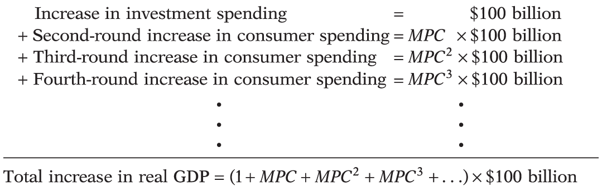
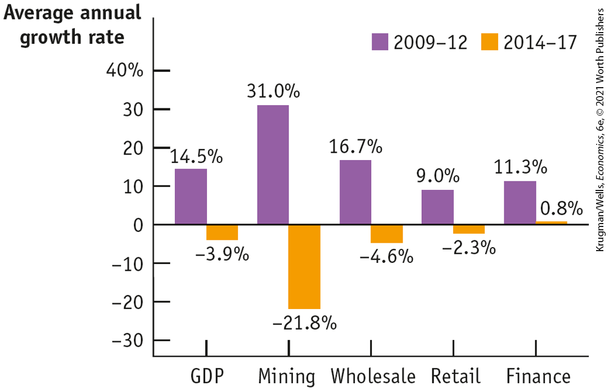

# Chapter 11 Income and Expenditure

## The Malls in Spain Have Mainly Dodged the Pain

<figure id="pau_9781319320164_xhDCPKdpY3" class="figure lm_img_lightbox unnum c2 right">

<figcaption>
<strong>A mall that was saved by Spain’s recovery.</strong>
</figcaption>
</figure>

**WHEN PUERTO VENECIA, IN THE CITY OF ZARAGOZA, SPAIN,** opened in October 2012, it was one of Europe’s biggest shopping malls. Like some U.S. mega-malls, it offers more than just shopping: it’s meant to be a destination experience, with cinemas, a skating rink, an artificial surfing wave, and a lake with rowboats.

The timing of its opening, however, appeared to be terrible: Spain’s economy was at a low point. Two back-to-back crises — the global financial crisis of 2008, and the crisis of the euro, Europe’s shared currency, which began in 2010 — had pushed Spain into a deep recession. The Spanish unemployment rate when the mall opened was almost 26%. It was not, you might have thought, a great time to open a high-end shopping complex.

Fortunately for Puerto Venecia’s investors, however, late 2012 marked Spain’s low point. Over the next few years the economy rebounded, largely thanks to a surge in exports, especially cars: by 2018 Spain was producing more than 2 million cars a year, more than any other European nation other than Germany. And with the economy’s recovery came a surge in consumer spending, especially, as it happens, in large shopping centers.

But wait: why should good news for Spain’s auto industry also be good news for its shopping malls?

The answer is that the increased sales of cars and other exports meant higher incomes for Spanish households, who spent much of this higher income on other goods and services. This meant another round of income increases among Spaniards producing or selling these goods and services. And the process didn’t stop there: rising income led to even more consumer spending, leading to even more income gains, and so on.

Spain’s recovery illustrates the way booms and busts happen for the economy as a whole. The business cycle is often driven by ups or downs in one particular kind of spending — either exports, as was the case in Spain, or investment spending. These first-round changes in spending then lead to changes in consumer spending, which magnify — or, as economists usually say, *multiply* — the effect of the initial changes on the economy as a whole.

In this chapter we’ll study how this process works, showing how *multiplier* analysis helps us understand the business cycle. As a first step, we introduce the concept of the multiplier informally. 

<aside class="learning-objectives c3 main-flow v3" epub:type="learning-objectives" id="pau_9781319320164_oim2oid5l9">

### WHAT YOU WILL LEARN

- What is the importance of the **multiplier**, which summarizes how initial changes in spending lead to further changes?
- What is the **aggregate consumption function?**
- How do expected future income and aggregate wealth affect consumer spending?
- What determines investment spending and why do we need to distinguish between **planned investment spending** and **unplanned inventory investment?**
- How does the inventory adjustment process move the economy to a new equilibrium after a change in demand?
- Why is investment spending considered a leading indicator of the future state of the economy?

</aside>

## The Multiplier: An Informal Introduction

The story of Spain’s recovery involves a sort of chain reaction in which an initial rise or fall in aggregate spending leads to changes in income, which lead to further changes in aggregate spending, and so on. Let’s examine that chain reaction more closely, this time thinking through the effects of changes in aggregate spending in the economy as a whole.

For the sake of this analysis, we’ll initially make four simplifying assumptions that will have to be reconsidered later.

1.  We assume that *producers are willing to supply additional output at a fixed price.* That is, if consumers or businesses buying investment goods decide to spend an additional \$1 billion, that will translate into the production of \$1 billion worth of additional goods and services without driving up the overall level of prices. As a result, *changes in aggregate spending translate into changes in aggregate output,* as measured by real GDP. As we’ll learn in the next chapter, this assumption isn’t too unrealistic in the short run, but it needs to be changed when we think about the long-run effects of changes in demand.
2.  We take the interest rate as given.
3.  We assume that there is no government spending and no taxes.
4.  We assume that exports and imports are zero (which is obviously a departure from our Spanish example, but in a later section we’ll see how to bring trade back).

Given these simplifying assumptions, consider what happens if there is a change in investment spending. For example, imagine that for some reason home builders decide to spend an extra \$100 billion on home construction over the next year.

The direct effect of this increase in investment spending will be to increase income and the value of aggregate output by the same amount. That’s because each dollar spent on home construction translates into a dollar’s worth of income for construction workers, suppliers of building materials, electricians, and so on. If the process stopped there, the increase in housing investment spending would raise overall income by exactly \$100 billion.

But the process doesn’t stop there. The increase in aggregate output leads to an increase in disposable income that flows to households in the form of profits and wages. The increase in households’ disposable income leads to a rise in consumer spending, which, in turn, induces firms to increase output yet again. This generates another rise in disposable income, which leads to another round of consumer spending increases, and so on. So there are multiple rounds of increases in aggregate output.

How large is the total effect on aggregate output if we sum the effect from all these rounds of spending increases? To answer this question, we need to introduce the concept of the <a href="#kru_9781319245269_EM_glossary.xhtml#pau_9781319320164_FjCtNcgfGe" id="kru_9781319245269_ch11_02.xhtml#pau_9781319320164_Y6Tzc0bd4S" class="glossref" role="doc-glossref"><strong>marginal propensity to consume</strong></a>, or <a href="#kru_9781319245269_EM_glossary.xhtml#pau_9781319320164_FjCtNcgfGe" id="kru_9781319245269_ch11_02.xhtml#pau_9781319320164_Y6Tzc0bd4A" class="glossref" role="doc-glossref"><strong><em>MPC</em></strong></a>: the increase in consumer spending when disposable income rises by \$1. When consumer spending changes because of a rise or fall in disposable income, *MPC* is the change in consumer spending divided by the change in disposable income:

$$MPC = \frac{\text{Δ}\,\text{Consumer}\,\text{spending}}{\text{Δ}\,\text{Disposable}\,\text{income}}$$

**(11-1)**

<aside aria-label="title 1" class="glossary c3 main-flow v1" epub:type="glossary" id="pau_9781319320164_N8K8MNXZMZ">

**marginal propensity to consume**, or ***MPC**,*  
The **marginal propensity to consume**, or ***MPC**,* is the increase in consumer spending when disposable income rises by \$1.

</aside>

where the symbol $\text{Δ}$ (delta) means “change in.” For example, if consumer spending goes up by \$6 billion when disposable income goes up by \$10 billion, $MPC\,\text{is}\,\text{\$}6\,\text{billion/\$}10\,\text{billion} = 0.6.$

Because consumers normally spend part but not all of an additional dollar of disposable income, *MPC* is a number between 0 and 1. The additional disposable income that consumers don’t spend is saved; the <a href="#kru_9781319245269_EM_glossary.xhtml#pau_9781319320164_FjCtNcgfGe" id="kru_9781319245269_ch11_02.xhtml#pau_9781319320164_ldDFJxNrtE" class="glossref" role="doc-glossref"><strong>marginal propensity to save</strong></a>, or <a href="#kru_9781319245269_EM_glossary.xhtml#pau_9781319320164_FjCtNcgfGe" id="kru_9781319245269_ch11_02.xhtml#pau_9781319320164_ldDFJxNrtA" class="glossref" role="doc-glossref"><em><strong>MPS</strong></em></a>, is the fraction of an additional dollar of disposable income that is saved. *MPS* is equal to $1 - MPC$.

<aside aria-label="title 2" class="glossary c3 main-flow v1" epub:type="glossary" id="pau_9781319320164_Oz8P4dV0jx">

**marginal propensity to save, or** ***MPS***  
The **marginal propensity to save**, or ***MPS**,* is the increase in household savings when disposable income rises by \$1.

</aside>

Because we assumed that there are no taxes and no international trade, each \$1 increase in aggregate spending raises both real GDP and disposable income by \$1. So the \$100 billion increase in investment spending initially raises real GDP by \$100 billion. This leads to a second-round increase in consumer spending, which raises real GDP by a further $MPC \times \$ 100\,\text{billion}$. It is followed by a third-round increase in consumer spending of $MPC \times MPC \times \$ 100\,\text{billion}$, and so on. After an infinite number of rounds, the total effect on real GDP is:

<figure id="pau_9781319320164_KxM7iwHbpy" class="figure lm_img_lightbox unnum c3 main-flow">

</figure>

<aside class="hidden" id="pau_9781319320164_ogX2LSPjhg" title="hidden">

Four lines of equations are added above a horizontal line, and their addition is below the horizontal line. Line 1: Increase in investment spending equals 100 billion dollars. Line 2: Second round increase in consumer spending equals M P C times 100 billion dollars. Line 3: Third round increase in consumer spending equals M P C squared times 100 billion dollars. Line 3: Fourth round increase in consumer spending equals M P C cubed times 100 billion dollars. Below these lines are vertical ellipsis and then a horizontal line. Below the horizontal line, total increase in real G D P equals (1 plus M P C plus M P C squared plus M P C cubed plus ellipsis) times 100 billion dollars.

</aside>

So the \$100 billion increase in investment spending sets off a chain reaction in the economy. The net result of this chain reaction is that a \$100 billion increase in investment spending leads to a change in real GDP that is a *multiple* of the size of that initial change in spending.

How large is this multiple? It’s a mathematical fact that an infinite series of the form $1 + x + x^{2} + x^{3} + .\ .\ .$, where *x* is between 0 and 1, is equal to $1\text{/}(1 - x)$. So the total effect of a \$100 billion increase in investment spending, *I,* taking into account all the subsequent increases in consumer spending (and assuming no taxes and no international trade), is given by:

$$\begin{array}{l}
{\text{Total~increase~in~real~GDP~from~a~}\$ 100\text{~billion~rise~in~}I} \\
\begin{array}{ll}
 = & {\frac{1}{1\operatorname{~-~}MPC} \times \$ 100\,\text{billion}}
\end{array}
\end{array}$$

**(11-2)**

Let’s consider a numerical example in which $MPC = 0.6$: each \$1 in additional disposable income causes a \$0.60 rise in consumer spending. In that case, a \$100 billion increase in investment spending raises real GDP by \$100 billion in the first round. The second-round increase in consumer spending raises real GDP by another $0.6 \times \$ 100\,\text{billion}$, or \$60 billion. The third-round increase in consumer spending raises real GDP by another $0.6 \times \$ 60\,\text{billion}$, or \$36 billion. <a href="#kru_9781319245269_ch11_02.xhtml#pau_9781319320164_73sgBBMtgB" id="kru_9781319245269_ch11_02.xhtml#pau_9781319320164_rcyG27nzfE" class="crossref">Table 11-1</a> shows the successive stages of increases, where “…” means the process goes on an infinite number of times. In the end, real GDP rises by \$250 billion as a consequence of the initial \$100 billion rise in investment spending:

$$\frac{1}{0.6} \times \$ 100\,\text{billion} = 2.5 \times \$ 100\,\text{billion} = \$ 250\,\text{billion}$$

Notice that even though there are an infinite number of rounds of expansion of real GDP, the total rise in real GDP is limited to \$250 billion. The reason is that at each stage some of the rise in disposable income “leaks out” because it is saved. How much of an additional dollar of disposable income is saved depends on *MPS,* the marginal propensity to save.

| Rounds | Increase in real GDP (billions) | Total increase in real GDP (billions) |
|--------|---------------------------------|---------------------------------------|
| First  | \$100                           | \$100                                 |
| Second | 60                              | 160                                   |
| Third  | 36                              | 196                                   |
| Fourth | 21.6                            | 217.6                                 |
| …      | …                               | …                                     |
| Final  | 0                               | 250                                   |

Table 11-1 Rounds of Increases in Real GDP When $\mathbf{M}\mathbf{P}\mathbf{C}\mathbf{\:=\:}\mathbf{0.6}$

We’ve described the effects of a change in investment spending, but the same analysis can be applied to any other change in aggregate spending. The important thing is to distinguish between the initial change in aggregate spending, before real GDP rises, and the additional change in aggregate spending caused by the change in real GDP as the chain reaction unfolds. For example, suppose that a boom in housing prices makes consumers feel richer and that, as a result, they become willing to spend more at any given level of disposable income. This will lead to an initial rise in consumer spending, before real GDP rises. But it will also lead to second and later rounds of higher consumer spending as real GDP rises.

An initial rise or fall in aggregate spending at a given level of real GDP is called an **<a href="#kru_9781319245269_EM_glossary.xhtml#pau_9781319320164_jlpU6wBmra" id="kru_9781319245269_ch11_02.xhtml#pau_9781319320164_3VdhJbZypU" class="glossref" role="doc-glossref">autonomous change in aggregate spending</a>**. It’s autonomous — which means self-governing — because it’s the cause, not the result, of the chain reaction we’ve just described. Formally, the **<a href="#kru_9781319245269_EM_glossary.xhtml#pau_9781319320164_Ec1VVEsi0a" id="kru_9781319245269_ch11_02.xhtml#pau_9781319320164_Ctl7y6avjb" class="glossref" role="doc-glossref">multiplier</a>** is the ratio of the total change in real GDP caused by an autonomous change in aggregate spending to the size of that autonomous change.

<aside aria-label="title 3" class="glossary c3 main-flow v1" epub:type="glossary" id="pau_9781319320164_ppTh32nSMf">

**autonomous change in aggregate spending**  
An **autonomous change in aggregate spending** is an initial change in the desired level of spending by firms, households, or government at a given level of real GDP.

</aside>
<aside aria-label="title 4" class="glossary c3 main-flow v1" epub:type="glossary" id="pau_9781319320164_PWbRruirNh">

**multiplier**  
The **multiplier** is the ratio of the total change in real GDP caused by an autonomous change in aggregate spending to the size of that autonomous change.

</aside>

If we let $\text{Δ}AAS$ stand for autonomous change in aggregate spending and $\text{Δ}Y$ stand for the change in real GDP, then the multiplier is equal to $\text{Δ}Y\text{/}\text{Δ}AAS$. And we’ve already seen how to find the value of the multiplier. Assuming no taxes and no trade, the change in real GDP caused by an autonomous change in spending is:

$$\text{Δ}Y = \frac{1}{1 - MPC} \times \text{Δ}AAS$$

**(11-3)**

So the multiplier is:

$$\text{Multiplier} = \frac{\text{Δ}Y}{\text{Δ}AAS} = \frac{1}{1 - MPC}$$

**(11-4)**

Notice that the size of the multiplier depends on *MPC.* If the marginal propensity to consume is high, so is the multiplier. This is true because the size of *MPC* determines how large each round of expansion is compared with the previous round. To put it another way, the higher *MPC* is, the less disposable income leaks out into savings at each round of expansion.

In later chapters we’ll use the concept of the multiplier to analyze the effects of fiscal and monetary policies. We’ll also see that the formula for the multiplier changes when we introduce various complications, including taxes and foreign trade. First, however, we need to look more deeply at what determines consumer spending.

### ECONOMICS \>\> *in Action*

To Shale and Back

For most of America, recovery from the severe recession of 2007–2009 was disappointingly slow. But a few parts of the country experienced rapid growth — and none more rapid than North Dakota, whose economy grew 60% between 2009 and 2012. That’s an annual growth rate of 15%, more than five times the growth of the U.S. economy as a whole.

There’s no mystery about the North Dakota boom: it was all about shale oil. Fracking made it possible to extract oil from the Bakken shale, which underlies the state. Oil companies and other investors rushed in, along with thousands of oil-field workers, more than doubling the output of the mining sector in just two years.

But as <a href="#kru_9781319245269_ch11_02.xhtml#pau_9781319320164_ppPEgBfLDu" id="kru_9781319245269_ch11_02.xhtml#pau_9781319320164_tIZ9okf3Xz" class="crossref">Figure 11-1</a> shows, mining and related industries weren’t the only sectors growing fast. North Dakota also saw much faster growth than other states in a number of areas, notably retail and wholesale trade, banking, and utilities. Why?

<figure id="pau_9781319320164_ppPEgBfLDu" class="figure lm_img_lightbox num c3 main-flow">

<figcaption>
FIGURE 11-1 Comparing Industry Growth Rates for North Dakota, 2009–2012 and 2014–2017

<em>Data from:</em> Bureau of Economic Analysis.
</figcaption>
</figure>

<aside class="hidden" id="pau_9781319320164_zsDXQiAf90" title="hidden">

The vertical axis, labeled Average annual growth rate ranges from negative 30 to 40 percent, in increments of 10 percent. The horizontal axis shows the following markings from left to right, G D P, Mining, Wholesale, Retail, and Finance. The data from the graph are as follows, G D P, 2009 to 2012, 14.5 percent; 2014 to 2017, negative 3.9 percent. Mining, 2009 to 2012, 31.0 percent; 2014 to 2017, negative 21.8 percent. Wholesale, 2009 to 2012, 16.7 percent; 2014 to 2017, negative 4.6 percent. Retail, 2009 to 2012, 9.0 percent; 2014 to 2017, negative 2.3 percent. Finance, 2009 to 2012, 11.3 percent; 2014 to 2017, 0.8 percent.

</aside>

The answer was the multiplier. As high-paying shale-related jobs surged, so did consumer spending — much of which ended up in the hands of local shops, bank branches, companies supplying electricity and heating oil, and so on. These local suppliers, in turn, hired more workers, whose incomes added to consumer spending and fed additional rounds of expansion.

Obviously this extraordinary growth couldn’t last. In fact, the shale boom came to an abrupt end in late 2014, as falling oil prices led to a drastic slowdown: mining employment in North Dakota fell more than 50% between October 2014 and July 2016, which had a ripple effect throughout the state’s economy. But the boom was fun while it lasted, and it also gave an excellent example of the multiplier at work.

### \>\> *Quick Review*

- A change in investment spending arising from a change in expectations starts a chain reaction in which the initial change in real GDP leads to changes in consumer spending, leading to further changes in real GDP, and so on. The total change in aggregate output is a multiple of the initial change in investment spending.
- Any **autonomous change in aggregate spending**, a change in spending that is not caused by a change in real GDP, generates the same chain reaction. The total size of the change in real GDP depends on the size of the **multiplier.** Assuming that there are no taxes and no trade, the multiplier is equal to $1\text{/}(1 - MPC)$, where ***MPC*** is the **marginal propensity to consume.** The total change in real GDP, $\text{Δ}Y$, is equal to $1\text{/}(1 - MPC) \times \text{Δ}AAS$.

### \>\> *Check Your Understanding* 11-1

1.  Explain why a decline in investment spending caused by a change in business expectations leads to a fall in consumer spending.
2.  What is the multiplier if the marginal propensity to consume is 0.5? What is it if *MPC* is 0.8?
3.  As a percentage of GDP, savings accounts for a larger share of the economy in the country of Scania compared to the country of Amerigo. Which country is likely to have the larger multiplier? Explain.

## Consumer Spending

Should you splurge on a restaurant meal or save money by eating at home? Should you buy a new car and, if so, how expensive a model? Should you redo that bathroom or live with it for another year? In the real world, households are constantly confronted with such choices — not just about the consumption mix but also about how much to spend in total.

These choices, in turn, have a powerful effect on the economy: consumer spending normally accounts for two-thirds of total spending on final goods and services. In particular, as we’ve just seen, the decision about how much of an additional dollar in income to spend — the marginal propensity to consume — determines the size of the multiplier, which determines the ultimate effect on the economy of autonomous changes in spending.

But what determines how much consumers spend?
