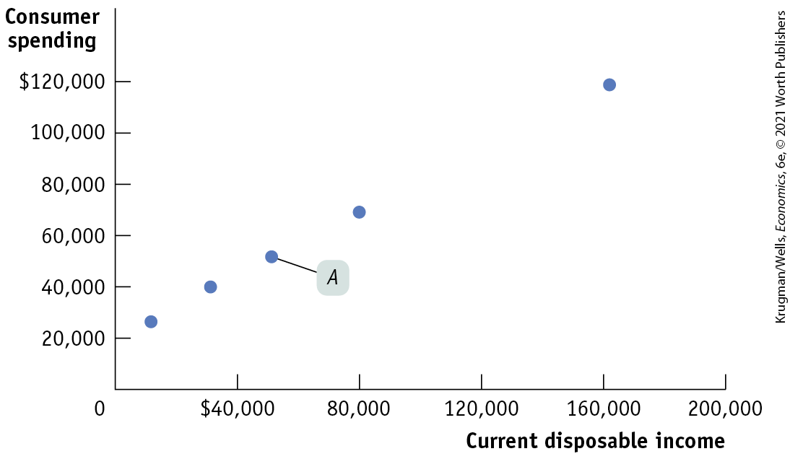
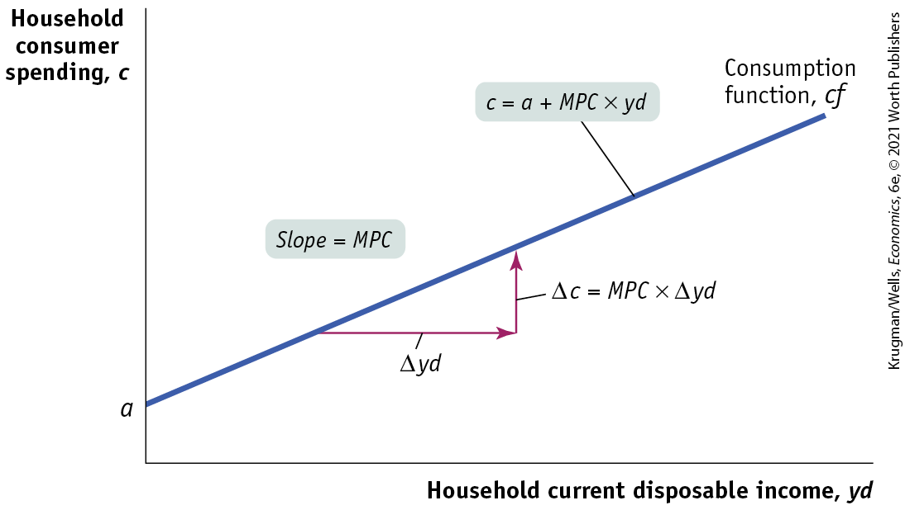
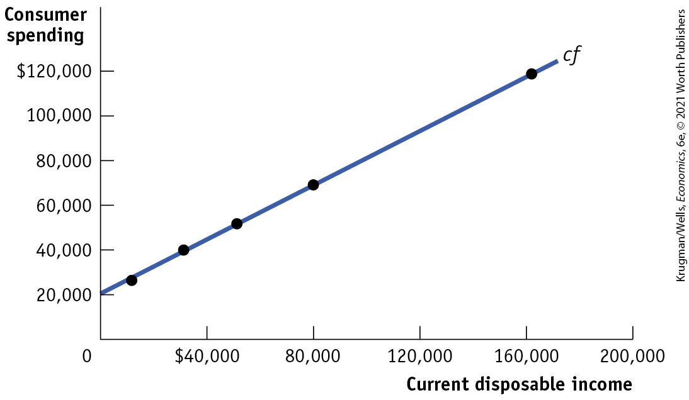
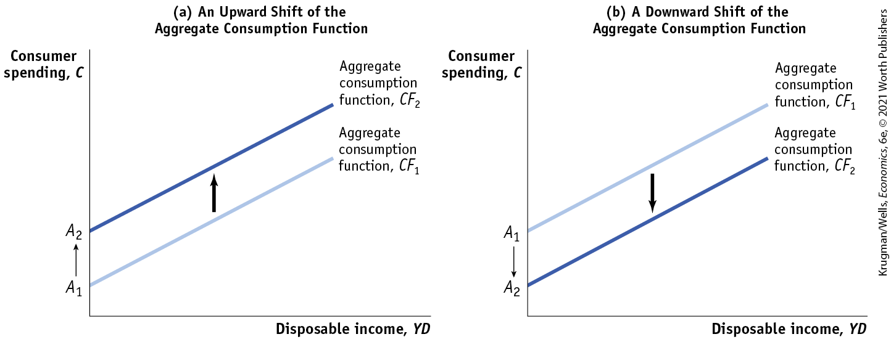
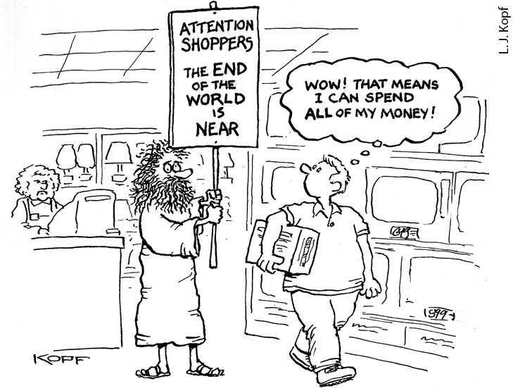
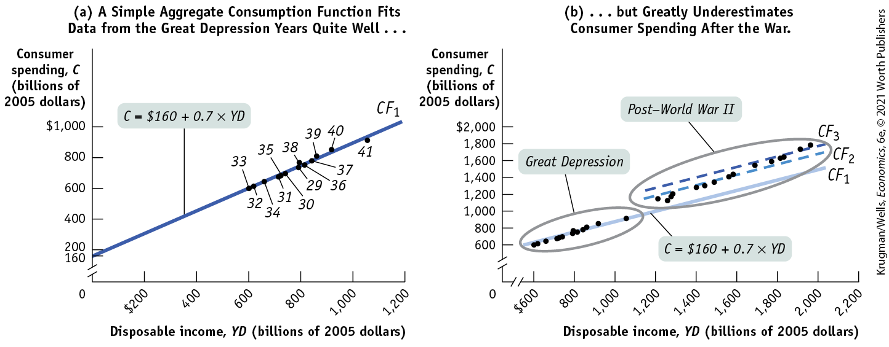
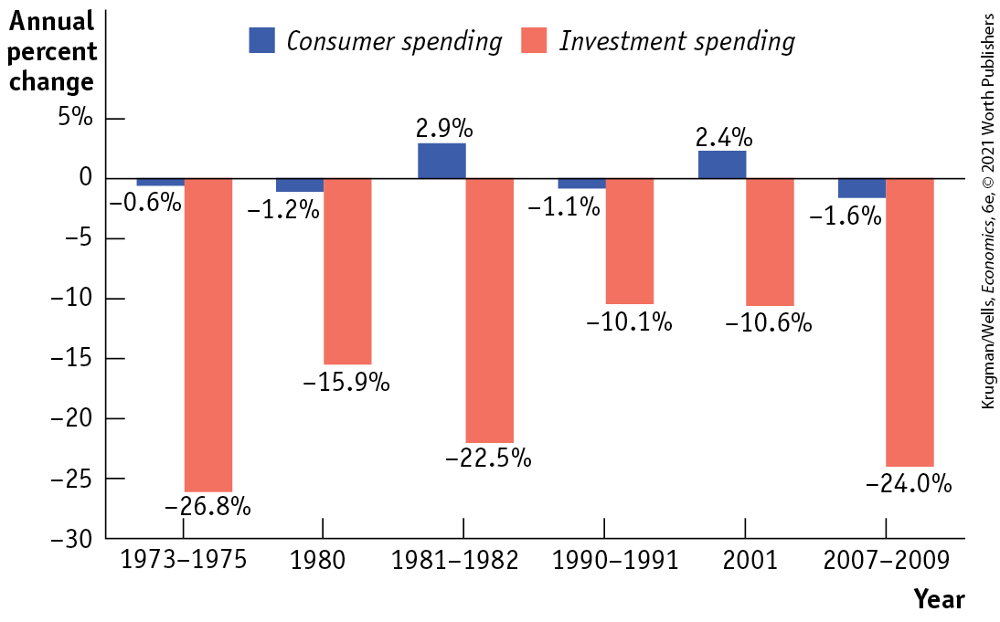

### Current Disposable Income and Consumer Spending

<figure id="pau_9781319320164_rELzta813p" class="figure lm_img_lightbox unnum c2 right">

<figcaption>
People with lower disposable incomes may avoid higher-priced brand-name goods in favor of generics that cost less.
</figcaption>
</figure>

The most important factor affecting a family’s consumer spending is its current disposable income — income after taxes are paid and government transfers are received. It’s obvious from daily life that people with high disposable incomes on average drive more expensive cars, live in more expensive houses, and spend more on meals and clothing than people with lower disposable incomes. And the relationship between current disposable income and spending is clear in the data.

The Bureau of Labor Statistics (BLS) collects annual data on family income and spending. Families are grouped by levels of before-tax income, and after-tax income for each group is also reported. Since the income figures include transfers from the government, what the BLS calls a household’s after-tax income is equivalent to its current disposable income.

<a href="#kru_9781319245269_ch11_03.xhtml#pau_9781319320164_TkRJt9aWTP" id="kru_9781319245269_ch11_03.xhtml#pau_9781319320164_ntAJ7yUlhB" class="crossref">Figure 11-2</a> is a scatter diagram illustrating the relationship between household current disposable income and household consumer spending for American households by income group in 2018. For example, point *A* shows that in 2018 the middle fifth of the population had an average current disposable income of \$51,211 and average spending of \$51,729. The pattern of the dots slopes upward from left to right, making it clear that households with higher current disposable income had higher consumer spending.

<figure id="pau_9781319320164_TkRJt9aWTP" class="figure lm_img_lightbox num c3 main-flow">

<figcaption>
FIGURE 11-2 Current Disposable Income and Consumer Spending for U.S. Households in 2018

For each income group of households, average current disposable income in 2018 is plotted versus average consumer spending in 2018. For example, the middle income group, with current disposable income of $41,490 to $70,367, is represented by point <em>A,</em> indicating a household average current disposable income of $51,211 and average household consumer spending of $51,729. The data clearly show a positive relationship between current disposable income and consumer spending: families with higher current disposable income have higher consumer spending.

<em>Data from:</em> Bureau of Labor Statistics.
</figcaption>
</figure>

<aside class="hidden" id="pau_9781319320164_RDWj04ItNM" title="hidden">

The vertical axis, labeled Consumer spending ranges from 0 to 120,000 dollars, in increments of 20,000 dollars. The horizontal axis, labeled Current disposable income ranges from 0 to 200,000 dollars, in increments of 40,000 dollars. The approximate data from the plot are as follows, (10,000, 25,000), (30,000, 40,000), (50,000, 50,000) labeled A, (80,000, 70,000), and (160,000, 120,000).

</aside>

It’s very useful to represent the relationship between an individual household’s current disposable income and its consumer spending with an equation. The **<a href="#kru_9781319245269_EM_glossary.xhtml#pau_9781319320164_km9Dxin2pC" id="kru_9781319245269_ch11_03.xhtml#pau_9781319320164_m35F0abYPG" class="glossref" role="doc-glossref">consumption function</a>** is an equation showing how an individual household’s consumer spending varies with the household’s current disposable income. The simplest version of a consumption function is a linear equation:

<aside aria-label="title 1" class="glossary c3 main-flow v1" epub:type="glossary" id="pau_9781319320164_anJYgpZKYV">

**consumption function**  
The **consumption function** is an equation showing how an individual household’s consumer spending varies with the household’s current disposable income.

</aside>

$$c = a + MPC \times yd$$

**(11-5)**

where lowercase letters indicate variables measured for an individual household.

In this equation, *c* is individual household consumer spending and *yd* is individual household current disposable income. Recall that *MPC,* the marginal propensity to consume, is the amount by which consumer spending rises if current disposable income rises by \$1. Finally, *a* is a constant term — individual household *autonomous consumer spending,* the amount of spending a household would have if it had zero disposable income. We assume that *a* is greater than zero because a household with zero disposable income is able to fund some consumption by borrowing or using its savings.

Notice, by the way, that we’re using *y* for income. That’s standard practice in macroeconomics, even though *income* isn’t actually spelled “yncome.” The reason is that *I* is reserved for investment spending.

Recall that we expressed *MPC* as the ratio of a change in consumer spending to the change in current disposable income. We’ve rewritten it for an individual household as <a href="#kru_9781319245269_ch11_03.xhtml#pau_9781319320164_K60P1fTjrt" id="kru_9781319245269_ch11_03.xhtml#pau_9781319320164_cNcjR870K0" class="crossref">Equation 11-6</a>:

$$MPC = \text{Δ}c\text{/}\text{Δ}yd$$

(**11-6**)

Multiplying both sides of <a href="#kru_9781319245269_ch11_03.xhtml#pau_9781319320164_K60P1fTjrt" id="kru_9781319245269_ch11_03.xhtml#pau_9781319320164_wnufAzJCef" class="crossref">Equation 11-6</a> by $\text{Δ}yd$, we get:

$$MPC \times \text{Δ}yd = \text{Δ}c$$

(**11-7**)

<a href="#kru_9781319245269_ch11_03.xhtml#pau_9781319320164_6i8US3rd76" id="kru_9781319245269_ch11_03.xhtml#pau_9781319320164_ePDCVQ4BZF" class="crossref">Equation 11-7</a> tells us that when *yd* goes up by \$1, *c* goes up by $MPC \times \$ 1$.

<a href="#kru_9781319245269_ch11_03.xhtml#pau_9781319320164_ToTOs9Uutl" id="kru_9781319245269_ch11_03.xhtml#pau_9781319320164_dWoVVvSf5v" class="crossref">Figure 11-3</a> shows what <a href="#kru_9781319245269_ch11_03.xhtml#pau_9781319320164_Pcp5XllK2e" id="kru_9781319245269_ch11_03.xhtml#pau_9781319320164_5Ziczq9IWk" class="crossref">Equation 11-5</a> looks like graphically, plotting *yd* on the horizontal axis and *c* on the vertical axis. Individual household autonomous consumer spending, *a,* is the value of *c* when *yd* is zero — it is the vertical *intercept* of the consumption function, *cf. MPC* is the *slope* of the line, measured by rise over run. If current disposable income rises by $\text{Δ}yd$, household consumer spending, *c,* rises by $\text{Δ}c$. Since *MPC* is defined as $\text{Δ}c\text{/}\text{Δ}yd$, the slope of the consumption function is:

$$\begin{array}{l}
\text{Slope~of~consumption~function} \\
\begin{array}{ll}
 = & \text{Rise~over~run} \\
 = & {\text{Δ}c/\text{Δ}yd} \\
 = & {MPC}
\end{array}
\end{array}$$

**(11-8)**

<figure id="pau_9781319320164_ToTOs9Uutl" class="figure lm_img_lightbox num c3 main-flow">

<figcaption>
FIGURE 11-3 The Consumption Function

The consumption function relates a household’s current disposable income to its consumer spending. The vertical intercept, <em>a,</em> is individual household autonomous consumer spending: the amount of a household’s consumer spending if its current disposable income is zero. The slope of the consumption function line, <em>cf,</em> is the marginal propensity to consume, or <em>MPC:</em> of every additional $1 of current disposable income, <em>M</em><em>P</em><em>C</em> × $1 is spent.
</figcaption>
</figure>

<aside class="hidden" id="pau_9781319320164_VTd5y43Zib" title="hidden">

The vertical axis, labeled Household consumer spending c, shows a marking at “a”. The horizontal axis is labeled Household current disposable income, y d. The consumption spending, c f, is a positive sloping line that starts from the marking “a” on the vertical axis. In the slope of the line, the run is delta y d and the rise is delta c equals M P C times delta y d, which means the slope equals M P C. The positive sloping line is labeled c equals a plus M P C times y d.

</aside>

In reality, actual data has never fit <a href="#kru_9781319245269_ch11_03.xhtml#pau_9781319320164_Pcp5XllK2e" id="kru_9781319245269_ch11_03.xhtml#pau_9781319320164_2fq6cchWnd" class="crossref">Equation 11-5</a> perfectly, but the fit can be pretty good. <a href="#kru_9781319245269_ch11_03.xhtml#pau_9781319320164_htwy4L8x9w" id="kru_9781319245269_ch11_03.xhtml#pau_9781319320164_bYQmitv7VH" class="crossref">Figure 11-4</a> shows the data from <a href="#kru_9781319245269_ch11_03.xhtml#pau_9781319320164_TkRJt9aWTP" id="kru_9781319245269_ch11_03.xhtml#pau_9781319320164_j0TJrqD1Q5" class="crossref">Figure 11-2</a> again, together with a line drawn to fit the data as closely as possible. According to the data on households’ consumer spending and current disposable income, the best estimate of *a* is \$20,195 and of *MPC* is 0.60. So the consumption function fitted to the data is:

$$c = \$ 20,195 + 0.60 \times yd$$

That is, the data suggest a marginal propensity to consume of approximately 0.60. This implies that the marginal propensity to save (*MPS*) — the amount of an additional \$1 of disposable income that is saved — is approximately 0.40, and the multiplier is approximately $1\text{/}0.40 = 2.50$.

<figure id="pau_9781319320164_htwy4L8x9w" class="figure lm_img_lightbox num c3 main-flow">

<figcaption>
FIGURE 11-4 A Consumption Function Fitted to Data

The data from <a href="#kru_9781319245269_ch11_03.xhtml#pau_9781319320164_TkRJt9aWTP" id="kru_9781319245269_ch11_03.xhtml#pau_9781319320164_RJT70sPEN3" class="crossref">Figure 11-2</a> are reproduced here, along with a line drawn to fit the data as closely as possible. For U.S. households in 2018 the best estimate of the average household’s autonomous consumer spending, <em>a,</em> is $20,195 and the best estimate of <em>MPC</em> is 0.60.

<em>Data from:</em> Bureau of Labor Statistics.
</figcaption>
</figure>

<aside class="hidden" id="pau_9781319320164_EWC8cR2BDr" title="hidden">

The vertical axis, labeled Consumer spending ranges from 0 to 120,000 dollars in increments of 20,000 dollars. The horizontal axis, labeled Current disposable income ranges from 0 to 200,000 dollars in increments of 40,000 dollars. A positive sloping line, labeled c f, starts from (0, 20,000) passing through the approximate points (10,000, 25,000), (30,000, 40,000), (55,000, 50,000), (80,000, 70,000), and (165,000, 120,000).

</aside>

It’s important to realize that <a href="#kru_9781319245269_ch11_03.xhtml#pau_9781319320164_htwy4L8x9w" id="kru_9781319245269_ch11_03.xhtml#pau_9781319320164_sy6BKTA9kl" class="crossref">Figure 11-4</a> shows a *microeconomic* relationship between the current disposable income of individual households and their spending on goods and services. However, macroeconomists assume that a similar relationship holds *for the economy as a whole:* that there is a relationship, called the **<a href="#kru_9781319245269_EM_glossary.xhtml#pau_9781319320164_6WNLmIiA2C" id="kru_9781319245269_ch11_03.xhtml#pau_9781319320164_Sj6mdtFYsE" class="glossref" role="doc-glossref">aggregate consumption function</a>**, between aggregate current disposable income and aggregate consumer spending. We’ll assume that it has the same form as the household-level consumption function:

$$C = A + MPC \times YD$$

(**11-9**)

<aside aria-label="title 2" class="glossary c3 main-flow v1" epub:type="glossary" id="pau_9781319320164_mKlZXeKRXd">

**aggregate consumption function**  
The **aggregate consumption function** is the relationship for the economy as a whole between aggregate current disposable income and aggregate consumer spending.

</aside>

Here, *C* is aggregate consumer spending (called just “consumer spending”); *YD* is aggregate current disposable income (called, for simplicity, just “disposable income”); and *A* is aggregate autonomous consumer spending, the amount of consumer spending when *YD* equals zero. This is the relationship represented in <a href="#kru_9781319245269_ch11_03.xhtml#pau_9781319320164_9HrdZeLR9O" id="kru_9781319245269_ch11_03.xhtml#pau_9781319320164_NdNDtnPxFZ" class="crossref">Figure 11-5</a> by *CF,* analogous to *cf* in <a href="#kru_9781319245269_ch11_03.xhtml#pau_9781319320164_ToTOs9Uutl" id="kru_9781319245269_ch11_03.xhtml#pau_9781319320164_WtynOBUqbY" class="crossref">Figure 11-3</a>.

<figure id="pau_9781319320164_9HrdZeLR9O" class="figure lm_img_lightbox num c4 main-flow">

<figcaption>
FIGURE 11-5 Shifts of the Aggregate Consumption Function

Panel (a) illustrates the effect of an increase in expected aggregate future disposable income. Consumers will spend more at every given level of aggregate current disposable income, <em>YD.</em> As a result, the initial aggregate consumption function <em>C</em><em>F</em>1, with aggregate autonomous consumer spending <em>A</em>1, shifts up to a new position at <em>C</em><em>F</em>2 and aggregate autonomous consumer spending <em>A</em>2. An increase in aggregate wealth will also shift the aggregate consumption function up. Panel (b), in contrast, illustrates the effect of a reduction in expected aggregate future disposable income. Consumers will spend less at every given level of aggregate current disposable income, <em>YD.</em> Consequently, the initial aggregate consumption function <em>C</em><em>F</em>1, with aggregate autonomous consumer spending <em>A</em>1, shifts down to a new position at <em>C</em><em>F</em>2 and aggregate autonomous consumer spending <em>A</em>2. A reduction in aggregate wealth will have the same effect.
</figcaption>
</figure>

<aside class="hidden" id="pau_9781319320164_TjNQRdaPuw" title="hidden">

Graph (a) An Upward Shift of the Aggregate Consumption Function: The vertical axis, labeled Consumer spending, C shows the markings at A subscript 1 and A subscript 2, from bottom to top. The horizontal axis is labeled Disposable income, Y D. Two positive sloping parallel lines, labeled Aggregate consumption function C F subscript 1 and Aggregate consumption function C F subscript 2, start from A subscript 1 and A subscript 2, respectively. An upward shift from A subscript 1 to A subscript 2 is indicated by an upward arrow. Graph (b) A Downward Shift of the Aggregate Consumption Function: The vertical axis, labeled Consumer spending, C shows markings at A subscript 2 and A subscript 1, from bottom to top. The horizontal axis is labeled Disposable income, Y D. Two positive sloping parallel lines, labeled Aggregate consumption function C F subscript 2 and Aggregate consumption function C F subscript 1, start from A subscript 2 and A subscript 1, respectively. A downward shift from A subscript 1 to A subscript 2 is indicated by a downward arrow.

</aside>

### Shifts of the Aggregate Consumption Function

The aggregate consumption function shows the relationship between disposable income and consumer spending for the economy as a whole, other things equal. When things other than disposable income change, the aggregate consumption function shifts. There are two principal causes of shifts of the aggregate consumption function: changes in expected future disposable income and changes in aggregate wealth.

#### Changes in Expected Future Disposable Income

Suppose you land a really good, well-paying job on graduating from college in May — but the job, and the paychecks, won’t start until September. So your disposable income hasn’t risen yet. Even so, it’s likely that you will start spending more on final goods and services right away — maybe buying nicer work clothes than you originally planned — because you know that higher income is coming.

Conversely, suppose you have a good job but learn that the company is planning to downsize your division, raising the possibility that you may lose your job and have to take a lower-paying one somewhere else. Even though your disposable income hasn’t gone down yet, you might well cut back on spending even while still employed, to save for a rainy day.

Both of these examples show how expectations about future disposable income can affect consumer spending. The two panels of <a href="#kru_9781319245269_ch11_03.xhtml#pau_9781319320164_9HrdZeLR9O" id="kru_9781319245269_ch11_03.xhtml#pau_9781319320164_luLMTpK9Wq" class="crossref">Figure 11-5</a>, which plot disposable income against consumer spending, show how changes in expected future disposable income affect the aggregate consumption function. In both panels, $CF_{1}$ is the initial aggregate consumption function. Panel (a) shows the effect of good news: information that leads consumers to expect higher disposable income in the future than they did before.

Consumers will now spend more at any given level of current disposable income, *YD,* corresponding to an increase in *A,* aggregate autonomous consumer spending, from $A_{1}$ to $A_{2}$. The effect is to shift the aggregate consumption function up, from $CF_{1}$ to $CF_{2}$. Panel (b) shows the effect of bad news: information that leads consumers to expect lower disposable income in the future than they did before. Consumers will now spend less at any given level of current disposable income, *YD,* corresponding to a fall in *A* from $A_{1}$ to $A_{2}$. The effect is to shift the aggregate consumption function down, from $CF_{1}$ to $CF_{2}$.

In a famous 1957 book, *A Theory of the Consumption Function,* Milton Friedman showed that taking the effects of expected future income into account explains an otherwise puzzling fact about consumer behavior. If we look at consumer spending during any given year, we find that people with high current income save a larger fraction of their income than those with low current income. (This is obvious from the data in <a href="#kru_9781319245269_ch11_03.xhtml#pau_9781319320164_htwy4L8x9w" id="kru_9781319245269_ch11_03.xhtml#pau_9781319320164_igKDCsQ4RP" class="crossref">Figure 11-4</a>: people with higher incomes spend considerably less than their income; those with lower incomes spend more than their income.) You might think this implies that the overall savings rate will rise as the economy grows and average current incomes rise; in fact, however, this hasn’t happened.

Friedman pointed out that when we look at individual incomes in a given year, there are systematic differences between current and expected future income that create a positive relationship between current income and the savings rate. On one side, people with low current incomes are often having an unusually bad year. For example, they may be workers who have been laid off but will probably find new jobs eventually. They are people whose expected future income is higher than their current income, so it makes sense for them to have low or even negative savings. On the other side, people with high current incomes in a given year are often having an unusually good year. For example, they may have investments that happened to do extremely well. They are people whose expected future income is lower than their current income, so it makes sense for them to save most of their windfall.

<figure id="pau_9781319320164_BeeALg1Y5K" class="figure lm_img_lightbox unnum c2 right">

</figure>

When the economy grows, by contrast, current and expected future incomes rise together. Higher current income tends to lead to higher savings today, but higher expected future income tends to lead to less savings today. As a result, there’s a weaker relationship between current income and the savings rate.

Friedman argued that consumer spending ultimately depends mainly on the income people expect to have over the long term rather than on their current income. This argument is known as the *permanent income hypothesis.*

#### Changes in Aggregate Wealth

Imagine two individuals, Maria and Mark, both of whom expect to earn \$30,000 this year. Suppose, however, that they have different histories. Maria has been working steadily for the past 10 years, owns her own home, and has \$200,000 in the bank. Mark is the same age as Maria, but he has been in and out of work, hasn’t managed to buy a house, and has very little in savings. In this case, Maria has something that Mark doesn’t have: *wealth.* Even though they have the same disposable income, other things equal, you’d expect Maria to spend more on consumption than Mark. That is, wealth has an effect on consumer spending.

The effect of wealth on spending is emphasized by an influential economic model of how consumers make choices about spending versus saving called the *life-cycle hypothesis.* According to this hypothesis, consumers plan their spending over a lifetime, not just in response to their current disposable income. As a result, people try to smooth their consumption over their lifetimes — they save some of their current disposable income during their years of peak earnings (typically occurring during a worker’s 40s and 50s) and during their retirement live off the wealth they accumulated while working.

We won’t go into the details of this hypothesis but will simply point out that it implies an important role for wealth in determining consumer spending. For example, a middle-aged couple who have accumulated a lot of wealth — who have paid off the mortgage on their house and already own plenty of stocks and bonds — will, other things equal, spend more on goods and services than a couple who have the same current disposable income but still need to save for their retirement.

Because wealth affects household consumer spending, changes in wealth across the economy can shift the aggregate consumption function. A rise in aggregate wealth — say, because of a booming stock market — increases the vertical intercept *A,* aggregate autonomous consumer spending. This, in turn, shifts the aggregate consumption function up in the same way as does an expected increase in future disposable income. A decline in aggregate wealth — say, because of a fall in housing prices as occurred in 2008 — reduces *A* and shifts the aggregate consumption function down.

### ECONOMICS \>\> *in Action*

Famous First Forecasting Failures

The Great Depression created modern macroeconomics. It also gave birth to the modern field of *econometrics —* the use of statistical techniques to fit economic models to empirical data. The aggregate consumption function was one of the first things econometricians studied. And, sure enough, they quickly experienced one of the first major failures of economic forecasting: consumer spending after World War II was much higher than estimates of the aggregate consumption function based on prewar data would have predicted.

<a href="#kru_9781319245269_ch11_03.xhtml#pau_9781319320164_rmFO5iS4VU" id="kru_9781319245269_ch11_03.xhtml#pau_9781319320164_9Ed1fqjR0u" class="crossref">Figure 11-6</a> tells the story. Panel (a) shows aggregate data on disposable income and consumer spending from 1929 to 1941, measured in billions of 2005 dollars. A simple linear consumption function, $CF_{1}$, seems to fit the data very well. And many economists thought this relationship would continue to hold in the future. But panel (b) shows what actually happened in later years. The points in the circle at the left are the data from the Great Depression shown in panel (a). The points in the circle at the right are data from 1946 to 1960. (Data from 1942 to 1945 aren’t included because rationing during World War II prevented consumers from spending normally.)

<figure id="pau_9781319320164_rmFO5iS4VU" class="figure lm_img_lightbox num c4 main-flow">

<figcaption>
FIGURE 11-6 Changes in the Aggregate Consumption Function Over Time

<em>Data from:</em> Bureau of Economic Analysis.
</figcaption>
</figure>

<aside class="hidden" id="pau_9781319320164_Vkg3RKFg4v" title="hidden">

Graph (a) A Simple Aggregate Consumption Function Fits Data from the Great Depression Years Quite Well ellipsis: The vertical axis, labeled Consumer spending, C (billions of 2005 dollars) is truncated and shows markings at 160, 200, 400, 600, 800, and 1,000 dollars, from bottom to top. The horizontal axis, labeled Disposable income, Y D (billions of 2005 dollars) ranges from 0 to 1,200 in increments of 200 dollars. A positive sloping straight line labeled C F subscript 1 starts from (0, 160) and ends at (1,200, 1,000), passing through 13 points. A corresponding textbox reads C equals 160 dollars plus 0.7 times Y D. The thirteen points are marked approximately with a label as follows, (600, 600), 33; (610, 600), 32; (650, 620), 34; (700, 650), 31; (750, 655), 35; (780, 700), 30; (800, 750), 29; (810, 755), 36; (815, 780), 38; (850, 790), 37; (880, 795), 39; (900, 800), 40; and (1,100, 850), 41. Graph (b) ellipsis but Greatly Underestimates Consumer Spending After the War: The vertical axis, labeled Consumer spending, C (billions of 2005 dollars) is truncated and ranges from 600 to 2,000 dollars in increments of 200 dollars. The horizontal axis, labeled Disposable income, Y D (billions of 2005 dollars) is truncated and ranges from 600 to 2,200 dollars in increments of 200 dollars. A positive sloping straight line starts at (500, 600) and ends at (2,100, 1,500) and is labeled C F subscript 1 with a textbox that reads, C equals 160 dollars plus 0.7 times Y D. The portion of the line between 600 and 1,200 of the horizontal axis is encircled and labeled Great Depression. A positive sloping straight dashed line, labeled C F subscript 2, starts at (1,200, 1,100) and ends at (2,100, 1,600), and it is parallel to C F subscript 1. Another positive sloping straight dashed line, labeled C F subscript 3, starts at (1,200, 1,200) and ends at (2,100, 1,650), and it is parallel to C F subscript 2. Points are marked between 1,200 and 2,000, starting from a point below C F subscript 2 and crossing above C F subscript 3. These two dashed lines along with the points are circled and labeled Post–world war 2.

</aside>

The solid line in the figure, $CF_{1}$, is the consumption function fitted to 1929–1941 data. As you can see, post–World War II consumer spending was much higher than the relationship from the Depression years would have predicted. For example, in 1960 consumer spending was 13.5% higher than the level predicted by $CF_{1}$.

Why was extrapolating from the earlier relationship so misleading? The answer is that from 1946 onward, both expected future disposable income and aggregate wealth were steadily rising. Consumers grew increasingly confident that the Great Depression wouldn’t reemerge and that the post–World War II economic boom would continue. At the same time, wealth was steadily increasing. As indicated by the dashed lines in panel (b), $CF_{2}$ and $CF_{3}$, the increases in expected future disposable income and in aggregate wealth shifted the aggregate consumption function up a number of times.

In macroeconomics, failure — whether of economic policy or of economic prediction — often leads to intellectual progress. The embarrassing failure of early estimates of the aggregate consumption function to predict post–World War II consumer spending led to important progress in our understanding of consumer behavior.

### *\>\> Quick Review*

- The **consumption function** shows the relationship between an individual household’s current disposable income and its consumer spending.
- The **aggregate consumption function** shows the relationship between disposable income and consumer spending across the economy. It can shift due to changes in expected future disposable income and changes in aggregate wealth.

### *Check Your Understanding* 11-2

1.  Suppose the economy consists of three people: Angelina, Felicia, and Marina. The table shows how their consumer spending varies as their current disposable income rises by \$10,000.
    1.  Derive each individual’s consumption function, where *MPC* is calculated for a \$10,000 change in current disposable income.
    2.  Derive the aggregate consumption function.
        | Current disposable income | Consumer spending |         |         |
        |---------------------------|-------------------|---------|---------|
        | Angelina                  | Felicia           | Marina  |         |
        | \$0                       | \$8,000           | \$6,500 | \$7,250 |
        | 10,000                    | 12,000            | 14,500  | 14,250  |
2.  Suppose that problems in the capital markets make consumers unable either to borrow or to put money aside for future use. What implication does this have for the effects of expected future disposable income on consumer spending?

## Investment Spending

Although consumer spending is much larger than investment spending, booms and busts in investment spending tend to drive the business cycle. In fact, most recessions originate as a fall in investment spending. <a href="#kru_9781319245269_ch11_04.xhtml#pau_9781319320164_FBXLFZz8Au" id="kru_9781319245269_ch11_04.xhtml#pau_9781319320164_6bImnyLuNX" class="crossref">Figure 11-7</a> illustrates this point; it shows the annual percent change of investment spending and consumer spending in the United States, measured in real terms, during six recessions from 1973 to 2009. As you can see, swings in investment spending are much more dramatic than those in consumer spending. In addition, due to the multiplier process, economists believe that declines in consumer spending are usually the result of a process that begins with a slump in investment spending. Soon we’ll examine in more detail how a slump in investment spending generates a fall in consumer spending through the multiplier process.

<figure id="pau_9781319320164_FBXLFZz8Au" class="figure lm_img_lightbox num c3 main-flow">

<figcaption>
FIGURE 11-7 Fluctuations in Investment Spending and Consumer Spending

The bars illustrate the annual percent change in investment spending and consumer spending during six recent recessions. As the lengths of the bars show, swings in investment spending were much larger in percentage terms than those in consumer spending. This pattern has led economists to believe that recessions typically originate as a slump in investment spending.

<em>Data from:</em> Bureau of Economic Analysis.
</figcaption>
</figure>

<aside class="hidden" id="pau_9781319320164_EdARGoqLem" title="hidden">

The vertical axis, labeled Annual percent change ranges from negative 30 to 5 percent in increments of 5 percent. The horizontal axis, labeled Year shows markings at 1973 to 1975, 1980, 1981 to 1982, 1990 to 1991, 2001, and 2007 to 2009. The data from the graph are as follows, 1973 to 1975: Consumer spending, negative 0.6 percent; Investment spending, negative 26.8 percent. 1980: Consumer spending, negative 1.2 percent; Investment spending, negative 15.9 percent. 1981 to 1982: Consumer spending, 2.9 percent; Investment spending, negative 22.5 percent. 1990 to 1991: Consumer spending, negative 1.1 percent; Investment spending, negative 10.1 percent. 2001: Consumer spending, 2.4 percent; Investment spending, negative 10.6 percent. 2007 to 2009: Consumer spending, negative 1.6 percent; Investment spending, negative 24 percent.

</aside>

Before we do that, however, let’s analyze the factors that determine investment spending, which are somewhat different from those that determine consumer spending. The most important ones are the interest rate and expected future real GDP. We’ll also revisit a fact that we noted in <a href="#kru_9781319245269_ch10_01.xhtml#pau_9781319320164_GbPAtnS6LO" id="kru_9781319245269_ch11_04.xhtml#pau_9781319320164_IC1dzn2OYW" class="crossref">Chapter 10</a>: the level of investment spending businesses *actually* carry out is sometimes not the same level as <a href="#kru_9781319245269_EM_glossary.xhtml#pau_9781319320164_CocCK0kYT0" id="kru_9781319245269_ch11_04.xhtml#pau_9781319320164_sY6CdS1hXt" class="glossref" role="doc-glossref"><strong>planned investment spending</strong></a>, the investment spending that firms *intend* to undertake during a given period.

<aside aria-label="title 1" class="glossary c3 main-flow v1" epub:type="glossary" id="pau_9781319320164_jTIK3YEpt8">

**planned investment spending**  
**Planned investment spending** is the investment spending that businesses intend to undertake during a given period.

</aside>

Planned investment spending depends on three principal factors that we’ll analyze next.

1.  The interest rate
2.  The expected future level of real GDP
3.  The current level of production capacity

First, we’ll analyze the effect of the interest rate.

### 1. The Interest Rate and Investment Spending

Interest rates have their clearest effect on one particular form of investment spending: spending on residential construction — that is, on the construction of homes. The reason is straightforward: home builders only build houses they think they can sell, and houses are more affordable — and so more likely to sell — when the interest rate is low.

Consider a family that needs to borrow \$350,000 to buy a new house. At an interest rate of 6.5%, a 30-year home mortgage will mean payments of \$2,212 per month. At an interest rate of 4.0%, those payments would be only \$1,722 per month, making houses significantly more affordable.

Interest rates also affect other forms of investment spending. Firms with investment spending projects will only go ahead with a project if they expect a rate of return higher than the cost of the funds they would have to borrow to finance that project. As we saw in <a href="#kru_9781319245269_ch10_01.xhtml#pau_9781319320164_GbPAtnS6LO" id="kru_9781319245269_ch11_04.xhtml#pau_9781319320164_k9vg7N8upn" class="crossref">Chapter 10</a>, if the interest rate rises, fewer projects will pass that test, and as a result investment spending will be lower.

You might think that the trade-off a firm faces is different if it can fund its investment project with its past profits rather than through borrowing. Past profits used to finance investment spending are called *retained earnings.* But even if a firm pays for investment spending out of retained earnings, the trade-off it must make in deciding whether or not to fund a project remains the same because it must take into account the opportunity cost of its funds. For example, instead of purchasing new equipment, the firm could lend out the funds and earn interest. The forgone interest earned is the opportunity cost of using retained earnings to fund an investment project.

So the trade-off the firm faces when comparing a project’s rate of return to the market interest rate has not changed when it uses retained earnings rather than borrowed funds, which means that regardless of whether a firm funds investment spending through borrowing or retained earnings, a rise in the market interest rate makes any given investment project less profitable.

Conversely, a fall in the interest rate makes some investment projects that were unprofitable before profitable at the now lower interest rate. So some projects that had been unfunded before will be funded now.

So planned investment spending — spending on investment projects that firms voluntarily decide whether or not to undertake — is negatively related to the interest rate. Other things equal, a higher interest rate leads to a lower level of planned investment spending.
