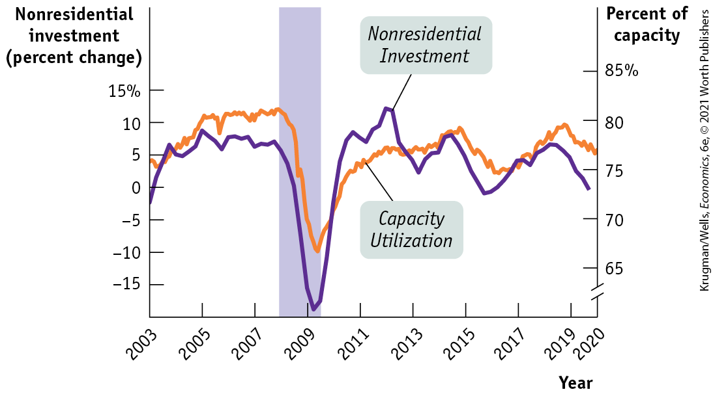
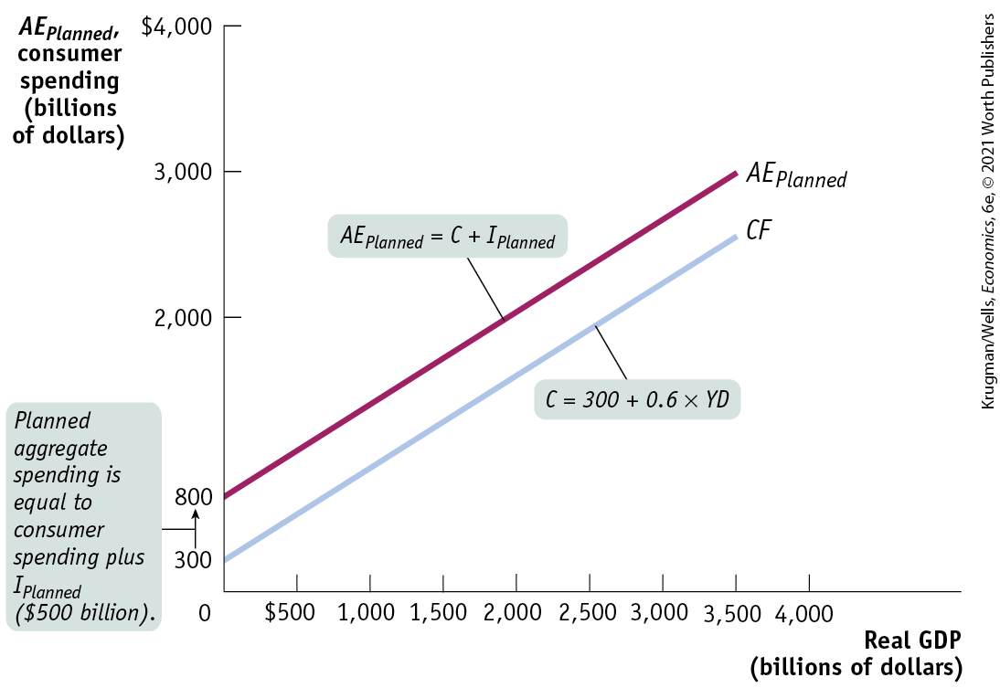

### 2. Expected Future Real GDP, Production Capacity, and Investment Spending

Suppose a firm has enough capacity to continue to produce the amount it is currently selling but doesn’t expect its sales to grow in the future. Then it will engage in investment spending only to replace existing equipment and structures that wear out or are rendered obsolete by new technologies. But if, instead, the firm expects its sales to grow rapidly in the future, it will find its existing production capacity insufficient for its future production needs. So the firm will undertake investment spending to meet those needs. This implies that, other things equal, firms will undertake more investment spending when they expect their sales to grow.

Now suppose that the firm currently has considerably more capacity than necessary to meet current production needs. Even if it expects sales to grow, it won’t have to undertake investment spending for a while — not until the growth in sales catches up with its excess capacity. This illustrates the fact that, other things equal, the current level of productive capacity has a negative effect on investment spending: other things equal, the higher the current capacity, the lower the investment spending.

If we combine the effects on investment spending of both growth in expected future sales and the size of current production capacity, we can see one situation in which we can be reasonably sure that firms will undertake high levels of investment spending: when they expect sales to grow rapidly. In that case, even excess production capacity will soon be used up, leading firms to resume investment spending.

What is an indicator of high expected growth of future sales? It’s a high expected future growth rate of real GDP. A higher expected future growth rate of real GDP results in a higher level of planned investment spending, but a lower expected future growth rate of real GDP leads to lower planned investment spending. This relationship is summarized in a proposition known as the **<a href="#kru_9781319245269_EM_glossary.xhtml#pau_9781319320164_GerMP7bmd9" id="kru_9781319245269_ch11_04.xhtml#pau_9781319320164_fVYqBEhtqh" class="glossref" role="doc-glossref">accelerator principle</a>**. Generally, the effects of the accelerator principle play an important role in *investment spending slumps,* periods of low investment spending.

<aside aria-label="title 2" class="glossary c3 main-flow v1" epub:type="glossary" id="pau_9781319320164_ja9JlPTFZU">

**accelerator principle**  
According to the **accelerator principle**, a higher growth rate of real GDP leads to higher planned investment spending, but a lower growth rate of real GDP leads to lower planned investment spending.

</aside>

### 3. Inventories and Unplanned Investment Spending

Most firms maintain **<a href="#kru_9781319245269_EM_glossary.xhtml#pau_9781319320164_vX7263OmMb" id="kru_9781319245269_ch11_04.xhtml#pau_9781319320164_E5ppMqdv0W" class="glossref" role="doc-glossref">inventories</a>**, stocks of goods held to satisfy future sales. Firms hold inventories so they can quickly satisfy buyers — a consumer can purchase an item off the shelf rather than waiting for it to be manufactured. In addition, businesses often hold inventories of their inputs to be sure they have a steady supply of necessary materials and spare parts. At the end of December 2019, the overall value of inventories in the U.S. economy was estimated at \$2.04 trillion, just under 10% of GDP.

<aside aria-label="title 3" class="glossary c3 main-flow v1" epub:type="glossary" id="pau_9781319320164_3nqmiDwaRz">

**inventories**  
**Inventories** are stocks of goods held to satisfy future sales.

</aside>

A firm that increases its inventories is engaging in a form of investment spending. Suppose, for example, that the U.S. auto industry produces 800,000 cars per month but sells only 700,000. The remaining 100,000 cars are added to the inventory at auto company warehouses or car dealerships, ready to be sold in the future. **<a href="#kru_9781319245269_EM_glossary.xhtml#pau_9781319320164_gr1PKt04Gr" id="kru_9781319245269_ch11_04.xhtml#pau_9781319320164_3V3zlaD0z7" class="glossref" role="doc-glossref">Inventory investment</a>** is the value of the change in total inventories held in the economy during a given period. Unlike other forms of investment spending, inventory investment can actually be negative. If, for example, the auto industry reduces its inventory over the course of a month, we say that it has engaged in negative inventory investment.

<aside aria-label="title 4" class="glossary c3 main-flow v1" epub:type="glossary" id="pau_9781319320164_rxrZKDfMdu">

**inventory investment**  
**Inventory investment** is the value of the change in total inventories held in the economy during a given period.

</aside>

To understand inventory investment, think about a manager stocking the canned goods section of a supermarket. The manager tries to keep the store fully stocked so that shoppers can almost always find what they’re looking for. But the manager does not want the shelves too heavily stocked because shelf space is limited and products can spoil. Similar considerations apply to many firms and typically lead them to manage their inventories carefully.

However, sales fluctuate. And because firms cannot always accurately predict sales, they often find themselves holding more or less inventories than they had intended. These unintended swings in inventories due to unforeseen changes in sales are called **<a href="#kru_9781319245269_EM_glossary.xhtml#pau_9781319320164_NNxm607Quf" id="kru_9781319245269_ch11_04.xhtml#pau_9781319320164_uHFcCmGpd4" class="glossref" role="doc-glossref">unplanned inventory investment</a>**. They represent investment spending, positive or negative, that occurred but was unplanned.

<aside aria-label="title 5" class="glossary c3 main-flow v1" epub:type="glossary" id="pau_9781319320164_sViipNMVuS">

**unplanned inventory investment**  
**Unplanned inventory investment** is an unintended swing in inventory that occurs when actual sales are higher or lower than expected sales.

</aside>

So in any given period, **<a href="#kru_9781319245269_EM_glossary.xhtml#pau_9781319320164_QTz3uIDdUo" id="kru_9781319245269_ch11_04.xhtml#pau_9781319320164_MezEE4P5Gb" class="glossref" role="doc-glossref">actual investment spending</a>** is equal to planned investment spending plus unplanned inventory investment. If we let $I_{Unplanned}$ represent unplanned inventory investment, $I_{Planned}$ represent planned investment spending, and *I* represent actual investment spending, then the relationship among all three can be represented as: 

$$I = I_{Unplanned} + I_{Planned}$$

(**11-10**)

<aside aria-label="title 6" class="glossary c3 main-flow v1" epub:type="glossary" id="pau_9781319320164_qtnLG0B5vT">

**actual investment spending**  
**Actual investment spending** is the sum of planned investment spending and unplanned inventory investment.

</aside>

<figure id="pau_9781319320164_N1vFeTqPLy" class="figure lm_img_lightbox unnum c2 right">

<figcaption>
When the economy slumps, as it did in 2009, consumer spending plunges and inventory—such as cars at auto dealers—goes unsold, leading to a rise in unplanned inventory investment.
</figcaption>
</figure>

To see how unplanned inventory investment can occur, let’s continue to focus on the auto industry and make the following assumptions. First, let’s assume that the industry must determine each month’s production volume in advance, before it knows the volume of actual sales. Second, let’s assume that it anticipates selling 800,000 cars next month and that it plans neither to add to nor subtract from existing inventories. In that case, it will produce 800,000 cars to match anticipated sales.

Now imagine that next month’s actual sales are less than expected, only 700,000 cars. As a result, the value of 100,000 cars will be added to investment spending as unplanned inventory investment.

The auto industry will, of course, eventually adjust to this slowdown in sales and the resulting unplanned inventory investment. The industry will probably cut next month’s production volume in order to reduce inventories.

In fact, economists who study macroeconomic variables in an attempt to determine the future path of the economy pay careful attention to changes in inventory levels. Rising inventories typically indicate positive unplanned inventory investment and a slowing economy, as sales are less than had been forecast. Falling inventories typically indicate negative unplanned inventory investment and a growing economy, as sales are greater than forecast.

In the next section, we will see how production adjustments in response to fluctuations in sales and inventories ensure that the value of final goods and services actually produced is equal to desired purchases of those final goods and services.

### ECONOMICS \>\> *in Action*

Business Investment in the Great Recession

Between December 2007 and June 2009 the U.S. economy experienced its worst economic downturn since the 1930s. Almost all economists agree that the principal driver of the Great Recession was the housing market: as a huge housing bubble deflated, residential investment — construction of new housing — plunged, and falling home values also reduced consumer wealth and therefore consumption spending.

But the Great Recession wasn’t just about residential investment. As <a href="#kru_9781319245269_ch11_04.xhtml#pau_9781319320164_qIZytrsiSQ" id="kru_9781319245269_ch11_04.xhtml#pau_9781319320164_5dFaorqkHO" class="crossref">Figure 11-8</a> shows, nonresidential investment — which basically consists of business spending on new factories, office parks, warehouses, and so on — also plunged. Why?

<figure id="pau_9781319320164_qIZytrsiSQ" class="figure lm_img_lightbox num c3 main-flow">

<figcaption>
FIGURE 11-8 Nonresidential Investment and Firm Capacity

<em>Data from:</em> Federal Reserve Board of Governors and Bureau of Economic Analysis.
</figcaption>
</figure>

<aside class="hidden" id="pau_9781319320164_043LtUhXOE" title="hidden">

The left vertical axis, labeled Nonresidential investment (percent change) ranges from negative 15 to 15 percent in increments of 5 percent. The right vertical axis, labeled Percent of capacity is truncated and ranges from 65 to 85 percent in increments of 5 percent. The horizontal axis labeled Year ranges from 2003 to 2019 in increments of 2 years, with an additional marking at 2020. The curve representing nonresidential investment passes through the approximate points (2003, negative 2), (2004, 6), (2008, 8), (2009, negative 18), (2011, 8), (2012, 10), (2013, 2), (2014, 6), (2016, negative 2), (2018, 5), and (2020, 0). The curve representing capacity utilization passes through the approximate points (2003, 76), (2006, 80), (2008, 80), (2009, 68), (2011, 75), (2015, 78), (2017, 75), (2019, 80), and (2020, 77). A vertical shaded bar is placed between late 2007 and mid 2009.

</aside>

The answer is that the sharp fall in residential investment and consumer spending left U.S. businesses with a great deal of *excess capacity,* as shown by the orange line in <a href="#kru_9781319245269_ch11_04.xhtml#pau_9781319320164_qIZytrsiSQ" id="kru_9781319245269_ch11_04.xhtml#pau_9781319320164_S9fLLjok1B" class="crossref">Figure 11-8</a>. That is, because people weren’t buying as much as before, there were many idle assembly lines, empty offices, unused space in warehouses, and so on. And since businesses weren’t using the capacity they had, they saw little reason to build more.

As a result, a sharp drop in housing construction led to a further drop in nonhousing investment, deepening the recession.

The good news is that once the economy stabilized and began growing again, excess business capacity was put back in use, and soon businesses began investing again.

### \>\> *Quick Review*

- **Planned investment spending** is negatively related to the interest rate and positively related to expected future real GDP. According to the **accelerator principle**, there is a positive relationship between planned investment spending and the expected future growth rate of real GDP.
- Firms hold **inventories** to sell in the future. **Inventory investment**, a form of investment spending, can be positive or negative.
- When actual sales are more or less than expected, **unplanned inventory investment** occurs. **Actual investment spending** is equal to planned investment spending plus unplanned inventory investment.

### \>\> *Check Your Understanding* 11-3

1.  For each event, explain whether planned investment spending or unplanned inventory investment will change and in what direction.
    1.  An unexpected increase in consumer spending
    2.  A sharp rise in the cost of business borrowing
    3.  A sharp increase in the economy’s growth rate of real GDP
    4.  An unanticipated fall in sales
2.  Historically, investment spending has experienced more extreme upward and downward swings than consumer spending. Why do you think this is so? (*Hint:* Consider the marginal propensity to consume and the accelerator principle.)
3.  Consumer spending was sluggish in late 2007, and economists worried that an *inventory overhang* — a high level of unplanned inventory investment throughout the economy — would make it difficult for the economy to recover anytime soon. Explain why an inventory overhang might, like the existence of too much production capacity, depress current economic activity.

## The Income–Expenditure Model

Earlier in this chapter, we described how autonomous changes in spending — such as a fall in investment spending when a housing bubble bursts — lead to a multistage process through the actions of the multiplier that magnifies the effect of these changes on real GDP. We will now examine this multistage process more closely.

We’ll see that the multiple rounds of changes in real GDP are accomplished through changes in the amount of output produced by firms — changes that they make in response to changes in their inventories. We’ll come to understand why inventories play a central role in macroeconomic models of the economy in the short run as well as why economists pay particular attention to the behavior of firms’ inventories when trying to understand the likely future state of the economy.

Before we begin, let’s quickly recap the assumptions underlying the multiplier process.

1.  *Changes in overall spending lead to changes in aggregate output.* We assume that producers are willing to supply additional output at a fixed price level. As a result, changes in spending translate into changes in output rather than moving the overall price level up or down. A fixed aggregate price level also implies that there is no difference between nominal GDP and real GDP. So we can use the two terms interchangeably in this chapter.
2.  *The interest rate is fixed.* We’ll take the interest rate as predetermined and unaffected by the factors we analyze in the model. As in the case of the aggregate price level, what we’re really doing here is leaving the determinants of the interest rate outside the model. As we’ll see, the model can still be used to study the effects of a change in the interest rate.
3.  *Taxes, government transfers, and government purchases are all zero.*
4.  *Exports and imports are both zero.*

In all subsequent chapters, we will drop the assumption that the aggregate price level is fixed. The <a href="#kru_9781319245269_ch13_01.xhtml#pau_9781319320164_zdnoTrYOS8" id="kru_9781319245269_ch11_05.xhtml#pau_9781319320164_HuH7bWEliQ" class="crossref">Chapter 13</a> appendix addresses how taxes affect the multiplier process. We’ll discuss how foreign trade enters the picture briefly later in this chapter, and bring it fully into the model in <a href="#kru_9781319245269_ch18_01.xhtml#pau_9781319320164_L1a5VDcA2j" id="kru_9781319245269_ch11_05.xhtml#pau_9781319320164_KZDvrlZRj1" class="crossref">Chapter 18</a>.

### Planned Aggregate Spending and Real GDP

In an economy with no government and no foreign trade, there are only two sources of aggregate spending: consumer spending, *C,* and investment spending, *I.* And since we assume that there are no taxes or transfers, aggregate disposable income is equal to GDP (which, since the aggregate price level is fixed, is the same as real GDP): the total value of final sales of goods and services ultimately accrues to households as income. So in this highly simplified economy, there are two basic equations of national income accounting:

$$GDP = C + I$$

**(11-11)**

$$YD = GDP$$

**(11-12)**

As we learned earlier, the aggregate consumption function shows the relationship between disposable income and consumer spending. Let’s continue to assume that the aggregate consumption function is of the same form as in <a href="#kru_9781319245269_ch11_03.xhtml#pau_9781319320164_7DdosL5BZm" id="kru_9781319245269_ch11_05.xhtml#pau_9781319320164_LBzGX5yVlP" class="crossref">Equation 11-9</a>:

$$C = A + MPC \times YD$$

**(11-13)**

In our simplified model, we will also assume planned investment spending, $I_{Planned}$, is fixed.

We need one more concept before putting the model together: **<a href="#kru_9781319245269_EM_glossary.xhtml#pau_9781319320164_aWBYyIEdj9" id="kru_9781319245269_ch11_05.xhtml#pau_9781319320164_8yaPQK1tsL" class="glossref" role="doc-glossref">planned aggregate spending</a>**, the total amount of planned spending in the economy. Unlike firms, households don’t take unintended actions like unplanned inventory investment. So planned aggregate spending is equal to the sum of consumer spending and planned investment spending. We denote planned aggregate spending by $AE_{Planned}$, so:

$$AE_{Planned} = C + I_{Planned}$$

**(11-14)**

<aside aria-label="title 1" class="glossary c3 main-flow v1" epub:type="glossary" id="pau_9781319320164_K7Nxvx1TAM">

**planned aggregate spending**  
**Planned aggregate spending** is the total amount of planned spending in the economy.

</aside>

The level of planned aggregate spending in a given year depends on the level of real GDP in that year. To see why, let’s look at a specific example, shown in <a href="#kru_9781319245269_ch11_05.xhtml#pau_9781319320164_l06Kh7zeUd" id="kru_9781319245269_ch11_05.xhtml#pau_9781319320164_yaBIGjCsgt" class="crossref">Table 11-2</a>. We assume that the aggregate consumption function is:

$$C = 300 + 0.6 \times YD$$

**(11-15)**

| Real GDP              | *YD*  | *C*   | $\mathbf{I}_{\mathbf{P}\mathbf{l}\mathbf{a}\mathbf{n}\mathbf{n}\mathbf{e}\mathbf{d}}$ | $\mathbf{A}\mathbf{E}_{\mathbf{P}\mathbf{l}\mathbf{a}\mathbf{n}\mathbf{n}\mathbf{e}\mathbf{d}}$ |
|-----------------------|-------|-------|--------------------------------------------------------------------------------------------------------------------------------------------------------------------------------------------------------|------------------------------------------------------------------------------------------------------------------------------------------------------------------------------------------------------------------|
| (billions of dollars) |       |       |                                                                                                                                                                                                        |                                                                                                                                                                                                                  |
| \$0                   | \$0   | \$300 | \$500                                                                                                                                                                                                  | \$800                                                                                                                                                                                                            |
| 500                   | 500   | 600   | 500                                                                                                                                                                                                    | 1,100                                                                                                                                                                                                            |
| 1,000                 | 1,000 | 900   | 500                                                                                                                                                                                                    | 1,400                                                                                                                                                                                                            |
| 1,500                 | 1,500 | 1,200 | 500                                                                                                                                                                                                    | 1,700                                                                                                                                                                                                            |
| 2,000                 | 2,000 | 1,500 | 500                                                                                                                                                                                                    | 2,000                                                                                                                                                                                                            |
| 2,500                 | 2,500 | 1,800 | 500                                                                                                                                                                                                    | 2,300                                                                                                                                                                                                            |
| 3,000                 | 3,000 | 2,100 | 500                                                                                                                                                                                                    | 2,600                                                                                                                                                                                                            |
| 3,500                 | 3,500 | 2,400 | 500                                                                                                                                                                                                    | 2,900                                                                                                                                                                                                            |

TABLE 11-2 Equilibrium When Real $\mathbf{G}\mathbf{D}\mathbf{P}\mathbf{\:=\:}\mathbf{Y}\mathbf{D}\mathbf{\:=\:}\mathbf{A}\mathbf{E}_{\mathbf{P}\mathbf{l}\mathbf{a}\mathbf{n}\mathbf{n}\mathbf{e}\mathbf{d}}$

Real GDP, *YD, C, $I_{Planned}$,* and $AE_{Planned}$ are all measured in billions of dollars, and we assume that the level of planned investment, $I_{Planned}$, is fixed at \$500 billion per year. The first column shows possible levels of real GDP. The second column shows disposable income, *YD,* which in our simplified model is equal to real GDP. The third column shows consumer spending, *C,* equal to \$300 billion plus 0.6 times disposable income, *YD.* The fourth column shows planned investment spending, $I_{Planned}$, which we have assumed is \$500 billion regardless of the level of real GDP. Finally, the last column shows planned aggregate spending, $AE_{Planned}$, the sum of aggregate consumer spending, *C,* and planned investment spending, $I_{Planned}$. (To economize on notation, we’ll assume that it is understood from now on that all the variables in <a href="#kru_9781319245269_ch11_05.xhtml#pau_9781319320164_l06Kh7zeUd" id="kru_9781319245269_ch11_05.xhtml#pau_9781319320164_OahWKOtURl" class="crossref">Table 11-2</a> are measured in billions of dollars per year.)

As you can see, a higher level of real GDP leads to a higher level of disposable income: every 500 increase in real GDP raises *YD* by 500, which in turn raises *C* by $500 \times 0.6 = 300$ and $AE_{Planned}\,\text{by}\, 300$.

<a href="#kru_9781319245269_ch11_05.xhtml#pau_9781319320164_STaPNFoCJU" id="kru_9781319245269_ch11_05.xhtml#pau_9781319320164_12dkhqgnFU" class="crossref">Figure 11-9</a> illustrates the information in <a href="#kru_9781319245269_ch11_05.xhtml#pau_9781319320164_l06Kh7zeUd" id="kru_9781319245269_ch11_05.xhtml#pau_9781319320164_4kbS0hX8bQ" class="crossref">Table 11-2</a> graphically. Real GDP is measured on the horizontal axis. *CF* is the aggregate consumption function; it shows how consumer spending depends on real GDP. $AE_{Planned}$, the planned aggregate spending line, corresponds to the aggregate consumption function shifted up by 500 (the amount of $I_{Planned}$). It shows how planned aggregate spending depends on real GDP. Both lines have a slope of 0.6, equal to *MPC,* the marginal propensity to consume.

<figure id="pau_9781319320164_STaPNFoCJU" class="figure lm_img_lightbox num c3 main-flow">

<figcaption>
FIGURE 11-9 The Aggregate Consumption Function and Planned Aggregate Spending

The lower line, <em>CF,</em> is the aggregate consumption function constructed from the data in <a href="#kru_9781319245269_ch11_05.xhtml#pau_9781319320164_l06Kh7zeUd" id="kru_9781319245269_ch11_05.xhtml#pau_9781319320164_DiGoFC37AU" class="crossref">Table 11-2</a>. The upper line, <em>A</em><em>E</em><em>P</em><em>l</em><em>a</em><em>n</em><em>n</em><em>e</em><em>d</em>, is the planned aggregate spending line, also constructed from the data in <a href="#kru_9781319245269_ch11_05.xhtml#pau_9781319320164_l06Kh7zeUd" id="kru_9781319245269_ch11_05.xhtml#pau_9781319320164_5rbfTL8lRv" class="crossref">Table 11-2</a>. It is equivalent to the aggregate consumption function shifted up by $500 billion, the amount of planned investment spending, <em>I</em><em>P</em><em>l</em><em>a</em><em>n</em><em>n</em><em>e</em><em>d</em>.
</figcaption>
</figure>

<aside class="hidden" id="pau_9781319320164_urxdsF57nr" title="hidden">

The vertical axis, labeled Auto sales (millions) is truncated and ranges from 10 to 20 in increments of 2. The horizontal axis, labeled Year ranges from 2000 to 2020 in increments of 2 years. The curve passes through the following approximate points, (2000, 19), (2004, 17), (2008, 9), (2014, 18), and (2020, 17).

</aside>

But this isn’t the end of the story. <a href="#kru_9781319245269_ch11_05.xhtml#pau_9781319320164_l06Kh7zeUd" id="kru_9781319245269_ch11_05.xhtml#pau_9781319320164_P6pAietxmN" class="crossref">Table 11-2</a> reveals that real GDP equals planned aggregate spending, $AE_{Planned}$, only when the level of real GDP is at 2,000. Real GDP does not equal $AE_{Planned}$ at any other level. Is that possible? Didn’t we learn in <a href="#kru_9781319245269_ch07_01.xhtml#pau_9781319320164_J4fyDEWkvv" id="kru_9781319245269_ch11_05.xhtml#pau_9781319320164_8ZyFcHUdXI" class="crossref">Chapter 7</a>, with the circular-flow diagram, that total spending on final goods and services in the economy is equal to the total value of output of final goods and services? The answer is that for *brief* periods of time, planned aggregate spending can differ from real GDP because of the role of *unplanned* aggregate spending — $I_{Unplanned}$, unplanned inventory investment.

But as we’ll see next, the economy moves over time to a situation in which there is no unplanned inventory investment, a situation called *income–expenditure equilibrium.* And when the economy is in income–expenditure equilibrium, planned aggregate spending on final goods and services equals aggregate output.
