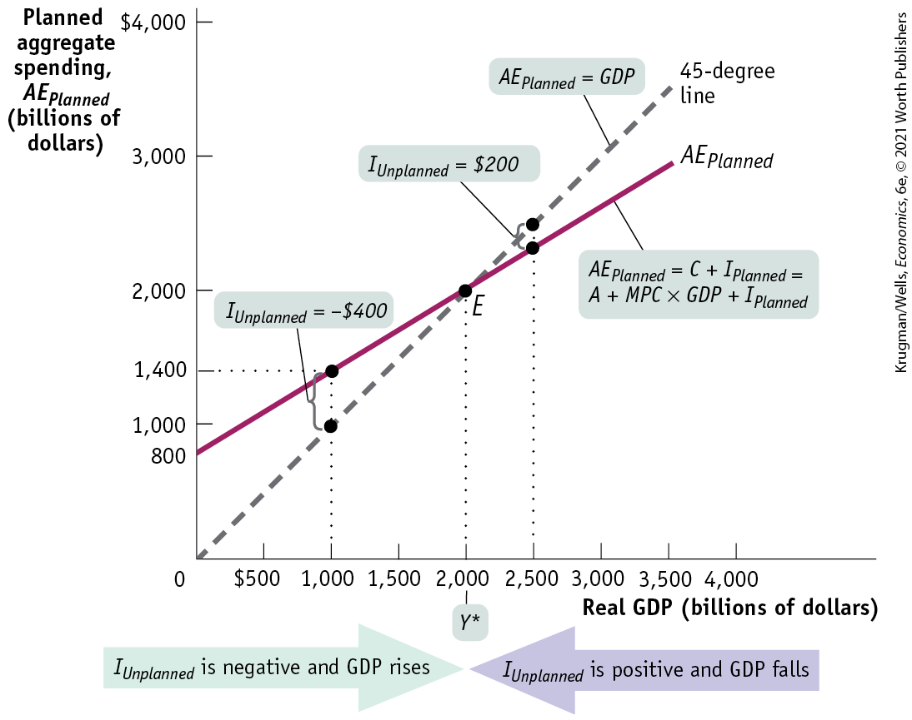
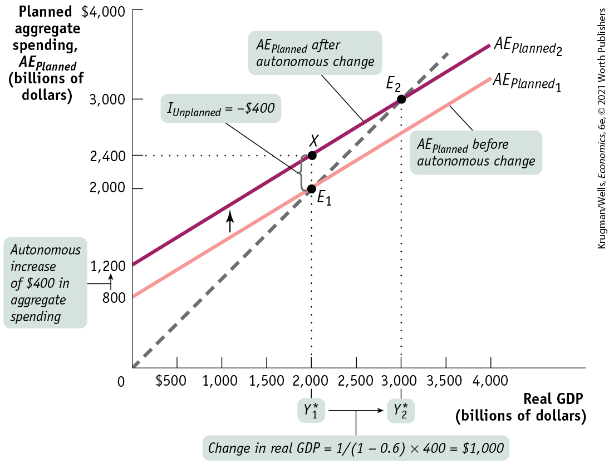
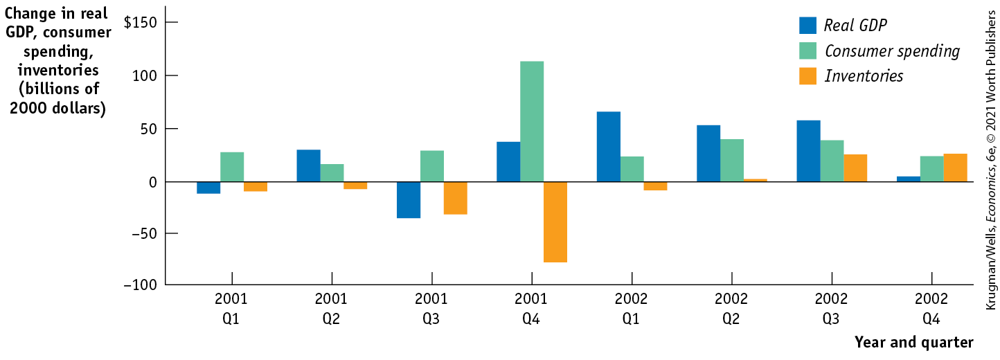

### Income–Expenditure Equilibrium

For all but one value of real GDP shown in <a href="#kru_9781319245269_ch11_05.xhtml#pau_9781319320164_l06Kh7zeUd" id="kru_9781319245269_ch11_05.xhtml#pau_9781319320164_PZCY3ci1ue" class="crossref">Table 11-2</a>, real GDP is either more or less than $AE_{Planned}$, the sum of consumer spending and *planned* investment spending. For example, when real GDP is 1,000, consumer spending, *C,* is 900 and planned investment spending is 500, making planned aggregate spending 1,400. This is 400 *more* than the corresponding level of real GDP. Now consider what happens when real GDP is 2,500; consumer spending, *C,* is 1,800 and planned investment spending is 500, making planned aggregate spending only 2,300, which is 200 *less* than real GDP.

As we’ve just explained, planned aggregate spending can be different from real GDP only if there is unplanned inventory investment, $I_{Unplanned}$, in the economy. Let’s examine <a href="#kru_9781319245269_ch11_05.xhtml#pau_9781319320164_tJXUuQWb4P" id="kru_9781319245269_ch11_05.xhtml#pau_9781319320164_Ksr3NGCM0P" class="crossref">Table 11-3</a>, which includes the numbers for real GDP and for planned aggregate spending from <a href="#kru_9781319245269_ch11_05.xhtml#pau_9781319320164_l06Kh7zeUd" id="kru_9781319245269_ch11_05.xhtml#pau_9781319320164_QyWO0XZa5w" class="crossref">Table 11-2</a>. It also includes the levels of unplanned inventory investment, $I_{Unplanned}$, that each combination of real GDP and planned aggregate spending implies. For example, if real GDP is 2,500, planned aggregate spending is only 2,300. This 200 excess of real GDP over $AE_{Planned}$ must consist of positive unplanned inventory investment. This can happen only if firms have overestimated sales and produced too much, leading to unintended additions to inventories.

| Real GDP                  | $\mathbf{A}\mathbf{E}_{\mathbf{P}\mathbf{l}\mathbf{a}\mathbf{n}\mathbf{n}\mathbf{e}\mathbf{d}}$ | $\mathbf{I}_{\mathbf{U}\mathbf{n}\mathbf{p}\mathbf{l}\mathbf{a}\mathbf{n}\mathbf{n}\mathbf{e}\mathbf{d}}$ |
|---------------------------|------------------------------------------------------------------------------------------------------------------------------------------------------------------------------------------------------------------|----------------------------------------------------------------------------------------------------------------------------------------------------------------------------------------------------------------------------|
| **(billions of dollars)** |                                                                                                                                                                                                                  |                                                                                                                                                                                                                            |
| \$0                       | \$800                                                                                                                                                                                                            | $- \$ 800$                                                                                                |
| 500                       | 1,100                                                                                                                                                                                                            | $- 600$                                                                                                   |
| 1,000                     | 1,400                                                                                                                                                                                                            | $- 400$                                                                                                   |
| 1,500                     | 1,700                                                                                                                                                                                                            | $- 200$                                                                                                   |
| 2,000                     | 2,000                                                                                                                                                                                                            | 0                                                                                                                                                                                                                          |
| 2,500                     | 2,300                                                                                                                                                                                                            | 200                                                                                                                                                                                                                        |
| 3,000                     | 2,600                                                                                                                                                                                                            | 400                                                                                                                                                                                                                        |
| 3,500                     | 2,900                                                                                                                                                                                                            | 600                                                                                                                                                                                                                        |

TABLE 11-3 Equilibrium When $\mathbf{I}_{\mathbf{U}\mathbf{n}\mathbf{p}\mathbf{l}\mathbf{a}\mathbf{n}\mathbf{n}\mathbf{e}\mathbf{d}}\mathbf{~=~}\mathbf{0}$

More generally, any level of real GDP in excess of 2,000 corresponds to a situation in which firms are producing more than consumers and other firms want to purchase, creating an unintended increase in inventories.

Conversely, a level of real GDP below 2,000 implies that planned aggregate spending is *greater* than real GDP. For example, when real GDP is 1,000, planned aggregate spending is much larger, at 1,400. The 400 excess of $AE_{Planned}$ over real GDP corresponds to negative unplanned inventory investment equal to $- 400$. More generally, any level of real GDP below 2,000 implies that firms have underestimated sales, leading to a negative level of unplanned inventory investment in the economy.

By putting together <a href="#kru_9781319245269_ch11_04.xhtml#pau_9781319320164_trJNHIxZhB" id="kru_9781319245269_ch11_05.xhtml#pau_9781319320164_su0WxhiYKa" class="crossref">Equations 11-10</a>, <a href="#kru_9781319245269_ch11_05.xhtml#pau_9781319320164_qFKGIgyrCh" id="kru_9781319245269_ch11_05.xhtml#pau_9781319320164_lHLG0dGE41" class="crossref">11-11</a>, and <a href="#kru_9781319245269_ch11_05.xhtml#pau_9781319320164_yzbHgxzugv" id="kru_9781319245269_ch11_05.xhtml#pau_9781319320164_5e89c3PpSG" class="crossref">11-14</a>, we can summarize the general relationships among real GDP, planned aggregate spending, and unplanned inventory investment as follows:

$$\begin{array}{rcl}
{GDP} & = & {C + I} \\
 & = & {C + I_{Planned} + I_{Unplanned}} \\
 & = & {AE_{Planned} + I_{Unplanned}}
\end{array}$$

**(11-16)**

So whenever real GDP exceeds $AE_{Planned}$*, $I_{Unplanned}$* is positive; whenever real GDP is less than $AE_{Planned}$*, $I_{Unplanned}$* is negative.

But firms will act to correct their mistakes. We’ve assumed that they don’t change their prices, but they *can* adjust their output. Specifically, they will reduce production if they have experienced an unintended rise in inventories or increase production if they have experienced an unintended fall in inventories. And these responses will eventually eliminate the unanticipated changes in inventories and move the economy to a point at which real GDP is equal to planned aggregate spending.

Staying with our example, if real GDP is 1,000, negative unplanned inventory investment will lead firms to increase production, leading to a rise in real GDP. In fact, this will happen whenever real GDP is less than 2,000 — that is, whenever real GDP is less than planned aggregate spending. Conversely, if real GDP is 2,500, positive unplanned inventory investment will lead firms to reduce production, leading to a fall in real GDP. This will happen whenever real GDP is greater than planned aggregate spending.

The only situation in which firms won’t have an incentive to change output in the next period is when aggregate output, measured by real GDP, is equal to planned aggregate spending in the current period, an outcome known as **<a href="#kru_9781319245269_EM_glossary.xhtml#pau_9781319320164_x2DFxCphPV" id="kru_9781319245269_ch11_05.xhtml#pau_9781319320164_zDr03SoE7k" class="glossref" role="doc-glossref">income–expenditure equilibrium</a>**. In <a href="#kru_9781319245269_ch11_05.xhtml#pau_9781319320164_tJXUuQWb4P" id="kru_9781319245269_ch11_05.xhtml#pau_9781319320164_HQDeDr3BR3" class="crossref">Table 11-3</a>, income–expenditure equilibrium is achieved when real GDP is 2,000, the only level of real GDP at which unplanned inventory investment is zero. From now on, we’ll denote the real GDP level at which income–expenditure equilibrium occurs as *Y*\* and call it the **<a href="#kru_9781319245269_EM_glossary.xhtml#pau_9781319320164_SPkcbHWPnt" id="kru_9781319245269_ch11_05.xhtml#pau_9781319320164_Vms8G8aUNJ" class="glossref" role="doc-glossref">income–expenditure equilibrium GDP</a>**.

<aside aria-label="title 2" class="glossary c3 main-flow v1" epub:type="glossary" id="pau_9781319320164_LssldXGWfq">

**income–expenditure equilibrium**  
The economy is in **income–expenditure equilibrium** when aggregate output, measured by real GDP, is equal to planned aggregate spending.

</aside>
<aside aria-label="title 3" class="glossary c3 main-flow v1" epub:type="glossary" id="pau_9781319320164_yFUv1tq0h9">

**income–expenditure equilibrium GDP**  
**Income–expenditure equilibrium GDP** is the level of real GDP at which real GDP equals planned aggregate spending.

</aside>

<a href="#kru_9781319245269_ch11_05.xhtml#pau_9781319320164_1Z9cfuIYWg" id="kru_9781319245269_ch11_05.xhtml#pau_9781319320164_cdE5tc0fkR" class="crossref">Figure 11-10</a> illustrates the concept of income–expenditure equilibrium graphically. Real GDP is on the horizontal axis and planned aggregate spending, $AE_{Planned}$, is on the vertical axis. There are two lines in the figure. The solid line is the planned aggregate spending line. It shows how $AE_{Planned}$, equal to $C + I_{Planned}$, depends on real GDP; it has a slope of 0.6, equal to the marginal propensity to consume, *MPC,* and a vertical intercept equal to $A + I_{Planned}(300 + 500 = 800)$. The dashed line, which goes through the origin with a slope of 1 (often called a 45-degree line), shows all the possible points at which planned aggregate spending is equal to real GDP.

<figure id="pau_9781319320164_1Z9cfuIYWg" class="figure lm_img_lightbox num c3 main-flow">

<figcaption>
FIGURE 11-10 Income–Expenditure Equilibrium

Income–expenditure equilibrium occurs at <em>E,</em> the point where the planned aggregate spending line, <em>A</em><em>E</em><em>P</em><em>l</em><em>a</em><em>n</em><em>n</em><em>e</em><em>d</em>, crosses the 45-degree line. At <em>E,</em> the economy produces real GDP of $2,000 billion per year, the only point at which real GDP equals planned aggregate spending, <em>A</em><em>E</em><em>P</em><em>l</em><em>a</em><em>n</em><em>n</em><em>e</em><em>d</em>, and unplanned inventory investment, <em>I</em><em>U</em><em>n</em><em>p</em><em>l</em><em>a</em><em>n</em><em>n</em><em>e</em><em>d</em>, is zero. This is the level of income–expenditure equilibrium GDP, <em>Y</em>*. At any level of real GDP less than <em>Y</em>*, <em>A</em><em>E</em><em>P</em><em>l</em><em>a</em><em>n</em><em>n</em><em>e</em><em>d</em> exceeds real GDP. As a result, unplanned inventory investment, <em>I</em><em>U</em><em>n</em><em>p</em><em>l</em><em>a</em><em>n</em><em>n</em><em>e</em><em>d</em>, is negative and firms respond by increasing production. At any level of real GDP greater than <em>Y</em>*, real GDP exceeds <em>A</em><em>E</em><em>P</em><em>l</em><em>a</em><em>n</em><em>n</em><em>e</em><em>d</em>. Unplanned inventory investment, <em>I</em><em>U</em><em>n</em><em>p</em><em>l</em><em>a</em><em>n</em><em>n</em><em>e</em><em>d</em>, is positive and firms respond by reducing production.
</figcaption>
</figure>

<aside class="hidden" id="pau_9781319320164_UerQdBFqTt" title="hidden">

The vertical axis, labeled Planned aggregate spending, A E subscript Planned (billions of dollars) ranges from 0 to 4,000 dollars in increments of 1,000 dollars, with two additional markings at 800 and 1,400. The horizontal axis, labeled Real G D P (billions of dollars) ranges from 0 to 4,000 dollars in increments of 500 dollars. A 45-degree straight dashed line starts at the origin and passes through the points (1,000, 1,000), (2,000, 2,000), and (2,500, 2,500), and it is labeled A E Planned equals G D P. A positive sloping solid line, A E subscript planned, starts at (0, 800) and ends at (3,500, 3,000), passing through the points (1,000, 1,400), (2,000, 2,000), and (2,500, 2,300). Both the lines intersect each other at E (2,000, 2,000). The solid line is labeled A E subscript Planned equals C plus I subscript Planned equals A plus M P C times G D P plus I subscript Planned. The gap between two lines before point E is labeled I subscript Unplanned equals negative 400 dollars, and the gap between the two lines after point E is labeled I subscript Unplanned equals 200 dollars. Below the horizontal axis, a horizontal arrow from left to right is labeled, “I subscript Unplanned is negative and G D P rises,” and another horizontal arrow from right to left is labeled, “I subscript Unplanned is positive and G D P falls.” Both the arrows meet at a point Y superscript asterisk, which is (2,000, 0)

</aside>

This line allows us to easily spot the point of income–expenditure equilibrium, which must lie on both the 45-degree line and the planned aggregate spending line. So the point of income–expenditure equilibrium is at *E,* where the two lines cross. And the income–expenditure equilibrium GDP, $Y\text{*}$, is 2,000 — the same outcome we derived in <a href="#kru_9781319245269_ch11_05.xhtml#pau_9781319320164_tJXUuQWb4P" id="kru_9781319245269_ch11_05.xhtml#pau_9781319320164_XSttxJUxTS" class="crossref">Table 11-3</a>.

Now consider what happens if the economy isn’t in income–expenditure equilibrium. We can see from <a href="#kru_9781319245269_ch11_05.xhtml#pau_9781319320164_1Z9cfuIYWg" id="kru_9781319245269_ch11_05.xhtml#pau_9781319320164_ZS8qGrofxm" class="crossref">Figure 11-10</a> that whenever real GDP is less than $Y\text{*}$, the planned aggregate spending line lies above the 45-degree line and $AE_{Planned}$ exceeds real GDP. In this situation, $I_{Unplanned}$ is negative: as shown in the figure, at a real GDP of 1,000, $I_{Unplanned}$ is $- 400$. As a consequence, real GDP will rise. In contrast, whenever real GDP is greater than $Y\text{*}$, the planned aggregate expenditure line lies below the 45-degree line. Here, $I_{Unplanned}$ is positive: as shown, at a real GDP of 2,500, $I_{Unplanned}$ is 200. The unanticipated accumulation of inventory leads to a fall in real GDP.

The type of diagram shown in <a href="#kru_9781319245269_ch11_05.xhtml#pau_9781319320164_1Z9cfuIYWg" id="kru_9781319245269_ch11_05.xhtml#pau_9781319320164_eZ9pMeS3Om" class="crossref">Figure 11-10</a>, which identifies income–expenditure equilibrium as the point at which the planned aggregate spending line crosses the 45-degree line, has a special place in the history of economic thought. Known as the **<a href="#kru_9781319245269_EM_glossary.xhtml#pau_9781319320164_RmHcTiBtSy" id="kru_9781319245269_ch11_05.xhtml#pau_9781319320164_D770FxAoYa" class="glossref" role="doc-glossref">Keynesian cross</a>**, it was developed by Paul Samuelson, one of the greatest economists of the twentieth century (as well as a Nobel Prize winner), to explain the ideas of John Maynard Keynes, the founder of macroeconomics as we know it.

<aside aria-label="title 4" class="glossary c3 main-flow v1" epub:type="glossary" id="pau_9781319320164_ORKpRNgYxb">

**keynesian cross**  
The **keynesian cross** diagram identifies income–expenditure equilibrium as the point where the planned aggregate spending line crosses the 45-degree line.

</aside>

### The Multiplier Process and Inventory Adjustment

We’ve just learned about a very important feature of the macroeconomy: when planned spending by households and firms does not equal the current aggregate output by firms, this difference shows up in changes in inventories. The response of firms to those inventory changes moves real GDP over time to the point at which real GDP and planned aggregate spending are equal. That’s why, as we mentioned earlier, changes in inventories are considered a leading indicator of future economic activity.

Now that we understand how real GDP moves to achieve income–expenditure equilibrium for a given level of planned aggregate spending, let’s turn to understanding what happens when there is *a shift of the planned aggregate spending line.* How does the economy move from the initial point of income–expenditure equilibrium to a new point of income–expenditure equilibrium? And what are the possible sources of changes in planned aggregate spending?

In our simple model there are only two possible sources of a shift of the planned aggregate spending line: a change in planned investment spending, $I_{Planned}$, or a shift of the aggregate consumption function, *CF*. For example, a change in $I_{Planned}$ can occur because of a change in the interest rate. (Remember, we’re assuming that the interest rate is fixed by factors that are outside the model. But we can still ask what happens when the interest rate changes.) A shift of the aggregate consumption function (that is, a change in its vertical intercept, *A*) can occur because of a change in aggregate wealth — say, due to a rise in house prices. When the planned aggregate spending line shifts — when there is a change in the level of planned aggregate spending at any given level of real GDP — there is an autonomous change in planned aggregate spending.

Recall that an autonomous change in planned aggregate spending is a change in the desired level of spending by firms, households, and government at any given level of real GDP (although we’ve assumed away the government for the time being). How does an autonomous change in planned aggregate spending affect real GDP in income–expenditure equilibrium?

<a href="#kru_9781319245269_ch11_05.xhtml#pau_9781319320164_vOZfCSTsDS" id="kru_9781319245269_ch11_05.xhtml#pau_9781319320164_s2GYb8nzW6" class="crossref">Table 11-4</a> and <a href="#kru_9781319245269_ch11_05.xhtml#pau_9781319320164_wHpDjCcOQP" id="kru_9781319245269_ch11_05.xhtml#pau_9781319320164_0OFVA2Drsf" class="crossref">Figure 11-11</a> start from the same numerical example we used in <a href="#kru_9781319245269_ch11_05.xhtml#pau_9781319320164_tJXUuQWb4P" id="kru_9781319245269_ch11_05.xhtml#pau_9781319320164_Wri2xdLHRe" class="crossref">Table 11-3</a> and <a href="#kru_9781319245269_ch11_05.xhtml#pau_9781319320164_1Z9cfuIYWg" id="kru_9781319245269_ch11_05.xhtml#pau_9781319320164_vjbNRkMNmM" class="crossref">Figure 11-10</a>. They also show the effect of an autonomous increase in planned aggregate spending of 400 — what happens when planned aggregate spending is 400 higher at each level of real GDP.

| Real GDP              | $\mathbf{A}\mathbf{E}_{\mathbf{P}\mathbf{l}\mathbf{a}\mathbf{n}\mathbf{n}\mathbf{e}\mathbf{d}}$ before autonomous change | $\mathbf{A}\mathbf{E}_{\mathbf{P}\mathbf{l}\mathbf{a}\mathbf{n}\mathbf{n}\mathbf{e}\mathbf{d}}$ after autonomous change |
|-----------------------|-------------------------------------------------------------------------------------------------------------------------------------------------------------------------------------------------------------------------------------------|------------------------------------------------------------------------------------------------------------------------------------------------------------------------------------------------------------------------------------------|
| (billions of dollars) |                                                                                                                                                                                                                                           |                                                                                                                                                                                                                                          |
| \$0                   | \$800                                                                                                                                                                                                                                     | \$1,200                                                                                                                                                                                                                                  |
| 500                   | 1,100                                                                                                                                                                                                                                     | 1,500                                                                                                                                                                                                                                    |
| 1,000                 | 1,400                                                                                                                                                                                                                                     | 1,800                                                                                                                                                                                                                                    |
| 1,500                 | 1,700                                                                                                                                                                                                                                     | 2,100                                                                                                                                                                                                                                    |
| 2,000                 | 2,000                                                                                                                                                                                                                                     | 2,400                                                                                                                                                                                                                                    |
| 2,500                 | 2,300                                                                                                                                                                                                                                     | 2,700                                                                                                                                                                                                                                    |
| 3,000                 | 2,600                                                                                                                                                                                                                                     | 3,000                                                                                                                                                                                                                                    |
| 3,500                 | 2,900                                                                                                                                                                                                                                     | 3,300                                                                                                                                                                                                                                    |
| 4,000                 | 3,200                                                                                                                                                                                                                                     | 3,600                                                                                                                                                                                                                                    |

TABLE 11-4 Real GDP Before and After Autonomous Spending Increases by $\mathbf{400~(}\mathbf{M}\mathbf{P}\mathbf{C}\mathbf{~=~}\mathbf{0}\mathbf{.6)}$

<figure id="pau_9781319320164_wHpDjCcOQP" class="figure lm_img_lightbox num c3 main-flow">

<figcaption>
FIGURE 11-11 The Multiplier

This figure illustrates the change in <em>Y</em>* caused by an autonomous increase in planned aggregate spending. The economy is initially at equilibrium point <em>E</em>1 with an income–expenditure equilibrium GDP, <em>Y</em>1*, equal to 2,000. An autonomous increase in <em>A</em><em>E</em><em>P</em><em>l</em><em>a</em><em>n</em><em>n</em><em>e</em><em>d</em> of 400 shifts the planned aggregate spending line upward by 400. The economy is no longer in income–expenditure equilibrium: real GDP is equal to 2,000 but <em>A</em><em>E</em><em>P</em><em>l</em><em>a</em><em>n</em><em>n</em><em>e</em><em>d</em> is now 2,400, represented by point <em>X.</em> The vertical distance between the two planned aggregate spending lines, equal to 400, represents <em>I</em><em>U</em><em>n</em><em>p</em><em>l</em><em>a</em><em>n</em><em>n</em><em>e</em><em>d</em> = -400  — the negative inventory investment that the economy now experiences. Firms respond by increasing production, and the economy eventually reaches a new income–expenditure equilibrium at <em>E</em>2 with a higher level of income–expenditure equilibrium GDP, <em>Y</em>2* , equal to 3,000.
</figcaption>
</figure>

<aside class="hidden" id="pau_9781319320164_kgGvv2qMan" title="hidden">

The vertical axis, labeled Planned aggregate spending, A E subscript Planned (billions of dollars) shows the markings at 0, 800, 1,200, 2,000, 2,400, 3,000, and 4,000 dollars, from bottom to top. The horizontal axis, labeled Real G D P (billions of dollars) ranges from 0 to 4,000 dollars in increments of 500 dollars. A 45-degree dashed line starts at the origin and passes through the points (2,000, 2,000) and (3,000, 3,000). A positive sloping straight line, labeled A E subscript Planned 1, starts at (0, 800), passes through the approximate points (1,000, 1,200), (2,000, 2,000), and (3,000, 2,500), and intersects the 45-degree line at E subscript 1 (2,000, 2,000). The line, A E subscript Planned 1, is labeled A E subscript Planned before autonomous change. Another positive sloping line, labeled A E subscript Planned 2, starts at (0, 1,200), passes through X (2,000, 2,400) and E subscript 2 (3,000, 3,000), and intersects the 45-degree line at E subscript 2 (3,000, 3,000). The line, A E subscript Planned 2, is labeled A E subscript Planned after autonomous change. A gap between point X (2,000, 2,400) and E subscript 1 (2,000, 2,000) is labeled I subscript Unplanned equals negative 400 dollars. An upward arrow pointing from 800 to 1,200 on the vertical axis is labeled Autonomous increase of 400 dollars in aggregate spending. A horizontal arrow pointing from 2,000 (Y asterisk 1) to 3,000 (Y asterisk 2) on the horizontal axis is labeled Change in real G D P equals 1 over (1 minus 0.6) times 400 equals 1,000 dollars. An upward arrow points from A E subscript Planned 1 to A E subscript Planned 2.

</aside>

Look first at <a href="#kru_9781319245269_ch11_05.xhtml#pau_9781319320164_vOZfCSTsDS" id="kru_9781319245269_ch11_05.xhtml#pau_9781319320164_QVusk5pBCy" class="crossref">Table 11-4</a>. Before the autonomous increase in planned aggregate spending, the level of real GDP at which planned aggregate spending is equal to real GDP, $Y\text{*}$, is 2,000. After the autonomous change, $Y\text{*}$ has risen to 3,000. The same result is visible in <a href="#kru_9781319245269_ch11_05.xhtml#pau_9781319320164_wHpDjCcOQP" id="kru_9781319245269_ch11_05.xhtml#pau_9781319320164_tEy66q4HWl" class="crossref">Figure 11-11</a>. The initial income–expenditure equilibrium is at $E_{1}$, where $Y_{1}^{*}$ is 2,000. The autonomous rise in planned aggregate spending shifts the planned aggregate spending line up, leading to a new income–expenditure equilibrium at $E_{2}$, where $Y_{2}^{*}$ is 3,000.

The fact that the rise in income–expenditure equilibrium GDP, from 2,000 to 3,000, is much larger than the autonomous increase in aggregate spending, which is only 400, has a familiar explanation: the multiplier process. In the specific example we have just described, an autonomous increase in planned aggregate spending of 400 leads to an increase in $Y\text{*}$ from 2,000 to 3,000, a rise of 1,000. So the multiplier in this example is $1,000\text{/}400 = 2.5$.

We can examine in detail what underlies the multistage multiplier process by looking more closely at <a href="#kru_9781319245269_ch11_05.xhtml#pau_9781319320164_wHpDjCcOQP" id="kru_9781319245269_ch11_05.xhtml#pau_9781319320164_jIIIXhT3yA" class="crossref">Figure 11-11</a>. First, starting from $E_{1}$, the autonomous increase in planned aggregate spending leads to a gap between planned aggregate spending and real GDP. This is represented by the vertical distance between *X,* at 2,400, and $E_{1}$, at 2,000. This gap illustrates an unplanned fall in inventory investment: $I_{Unplanned} = \operatorname{-400}$. Firms respond by increasing production, leading to a rise in real GDP from $Y_{1}^{*}$. The rise in real GDP translates into an increase in disposable income, *YD.*

That’s the first stage in the chain reaction. But it doesn’t stop there — the increase in *YD* leads to a rise in consumer spending, *C,* which sets off a second-round rise in real GDP. This in turn leads to a further rise in disposable income and consumer spending, and so on. And we could play this process in reverse: an autonomous fall in aggregate spending will lead to a chain reaction of reductions in real GDP and consumer spending.

We can summarize these results in an equation, where $\text{Δ}AAE_{Planned}$ represents the autonomous change in $AE_{Planned}$, and $\text{Δ}Y\text{*=}Y{}_{2}^{*} - Y{}_{1}^{*}$, the subsequent change in income–expenditure equilibrium GDP:

$$\text{Δ}Y^{\ast} = \text{Multiplier} \times \text{Δ}AAE_{Planned} = \frac{1}{1 - MPC} \times \text{Δ}AAE_{Planned}$$

**(11-17)**

Recalling that the multiplier, $1\text{/}(1 - MPC)$, is greater than 1, <a href="#kru_9781319245269_ch11_05.xhtml#pau_9781319320164_6qxcHiwzjc" id="kru_9781319245269_ch11_05.xhtml#pau_9781319320164_PTsL6tFAIA" class="crossref">Equation 11-17</a> tells us that the change in income–expenditure equilibrium GDP, $\text{Δ}Y\text{*}$, is several times larger than the autonomous change in planned aggregate spending, $\text{Δ}AAE_{Planned}$. It also helps us recall an important point: because the marginal propensity to consume is less than 1, each increase in disposable income and each corresponding increase in consumer spending is smaller than in the previous round. That’s because at each round some of the increase in disposable income leaks out into savings.

As a result, although real GDP grows at each round, the increase in real GDP diminishes from each round to the next. At some point the increase in real GDP is negligible, and the economy converges to a new income–expenditure equilibrium GDP at $Y_{2}^{*}$.

#### The Paradox of Thrift

In an earlier chapter we mentioned the paradox of thrift to illustrate the fact that in macroeconomics the outcome of many individual actions can generate a result that is different from and worse than the simple sum of those individual actions. In the paradox of thrift, households and firms cut their spending in anticipation of future tough economic times. These actions depress the economy, leaving households and firms worse off than if they hadn’t acted virtuously to prepare for tough times. It is called a paradox because what’s usually “good” (saving to provide for your family in hard times) is “bad” (because it can make everyone worse off).

<figure id="pau_9781319320164_ih2NbWyqqf" class="figure lm_img_lightbox unnum c2 right">

<figcaption>
Lavish spending after a slump makes everyone better off thanks to the multiplier effect.
</figcaption>
</figure>

Using the multiplier, we can now see exactly how this scenario unfolds. Suppose that there is a slump in consumer spending or investment spending, or both, just like the slump in residential construction investment spending leading up to the 2007–2009 recession. This causes a fall in income–expenditure equilibrium GDP that is several times larger than the original fall in spending. The fall in real GDP leaves consumers and producers worse off than they would have been if they hadn’t cut their spending.

Conversely, prodigal behavior is rewarded: if consumers or producers increase their spending, the resulting multiplier process makes the increase in income–expenditure equilibrium GDP several times larger than the original increase in spending. So lavish spending makes consumers and producers better off than if they had been cautious spenders.

It’s important to realize that our result that the multiplier is equal to $1\text{/}(1 - MPC)$ depends on the simplifying assumption that there are no taxes or transfers, so that disposable income is equal to real GDP. In the <a href="#kru_9781319245269_ch13_01.xhtml#pau_9781319320164_zdnoTrYOS8" id="kru_9781319245269_ch11_05.xhtml#pau_9781319320164_LdVPW5oXwR" class="crossref">Chapter 13</a> appendix, we’ll bring taxes into the picture, which makes the expression for the multiplier more complicated and the multiplier itself smaller.

But the general principle we just learned remains valid: an autonomous change in planned aggregate spending leads to a change in income–expenditure equilibrium GDP, both directly and through an induced change in consumer spending.

As we’ve seen, declines in planned investment spending are usually the major factor causing recessions, because historically they have been the most common source of autonomous reductions in aggregate spending. The tendency of the consumption function to shift upward over time, which as noted earlier in the Economics in Action, “Famous First Forecasting Failures,” means that autonomous changes in both planned investment spending and consumer spending play important roles in expansions. But regardless of the source, there are multiplier effects in the economy that magnify the size of the initial change in aggregate spending.

### What About Exports and Imports?

The simple version of the income–expenditure model that we have just laid out assumes that there is no international trade. But, as you may have noticed, the opening story for this chapter deviates in an important way from this simple version of the model. Spain’s economic rebound was largely the result of a strong boost in exports of automobiles. And in a basic sense the boom in North Dakota, described in an earlier Economics in Action, also involved trade — North Dakota’s shale oil is sold to other states and countries, not to local consumers.

So how does bringing exports and imports back in change the story? The answer is that the basic multiplier story continues to work, with two modifications.

First, income earned from exports is a source of spending on domestically produced goods and services, just like consumption and investment. Changes in exports act just like autonomous changes in spending, like an investment boom or slump. In Spain’s case, the boost in automobile exports led to a direct increase in Spanish incomes. This then led to an increase in the demand for consumer goods, which led to a further increase in income, and so on, exactly the way an increase in investment spending leads via the multiplier process to an economic expansion.

Second, the multiplier process itself is made somewhat weaker thanks to foreign trade: when consumer spending rises or falls, part of that change is reflected in changes in spending on imports, which don’t affect a nation’s own income. Suppose, for example, that U.S. consumer spending rises by \$1 billion. If the United States didn’t engage in foreign trade, all of that rise in spending would translate directly into a rise in U.S. GDP. In reality, however, a significant part of the total — say \$200 million — will be a rise in spending on goods produced in Canada, Mexico, China, or elsewhere. And this spending *isn’t* part of U.S. GDP. As economists sometimes put it, part of any spending change “leaks” abroad.

The effect of this leakage is to reduce the size of the multiplier. The extent to which the multiplier falls depends on how much of an additional dollar of spending falls on imports rather than domestic goods — the *marginal propensity to import.* In the case of the United States, which is a very large economy with only limited international trade, leaks from imports have only a modest effect on the size of the multiplier. In small countries that engage in a lot of trade, trade may greatly reduce the multiplier.

One final point about the effect of trade: it creates interdependence among national economies, because each country’s exports are some other country’s imports. Suppose that the U.S. economy enters a recession. This will lead, other things equal, to a decline in the amount we spend on goods produced in Canada, which means a decline in Canadian exports. And this spillover will tend to drag Canada’s economy down, too. More broadly, the trade links between economies are one reason business cycles are often international, even global, in scope: many countries tend to have recessions and recoveries at the same time.

One thing is important to realize, however, about exports and imports: while they can change the size of the multiplier, they don’t change the fundamental story about how aggregate spending rises and falls.

### ECONOMICS \>\> *in Action*

Inventories and the End of a Recession

A very clear example of the role of inventories in the multiplier process took place in late 2001, as that year’s recession came to an end. The driving force behind the recession was a slump in business investment spending. It took several years before investment spending bounced back in the form of a housing boom. By late 2001 the economy had begun to recover, largely due to an increase in consumer spending — especially on durable goods such as automobiles.

Initially, this increase in consumer spending caught manufacturers by surprise. <a href="#kru_9781319245269_ch11_05.xhtml#pau_9781319320164_X1mwRFPBex" id="kru_9781319245269_ch11_05.xhtml#pau_9781319320164_EY3MZ6Kw2r" class="crossref">Figure 11-12</a> shows changes in real GDP, real consumer spending, and real inventories in each quarter of 2001 and 2002. Notice the surge in consumer spending in the fourth quarter of 2001. Initially, it didn’t lead to significant GDP growth because it was offset by a plunge in inventories. But in the first quarter of 2002, producers greatly increased their production, leading to a jump in real GDP.

<figure id="pau_9781319320164_X1mwRFPBex" class="figure lm_img_lightbox num c4 main-flow">

<figcaption>
FIGURE 11-12 Inventories and the End of a Recession

<em>Data from:</em> Bureau of Economic Analysis.
</figcaption>
</figure>

<aside class="hidden" id="pau_9781319320164_HzUWtK0fi6" title="hidden">

The vertical axis, labeled Change in real G D P, consumer spending, inventories (billions of 2000 dollars) ranges from negative 100 to 150 dollars in increments of 50 dollars. The horizontal axis, labeled Year and quarter shows markings at 2001 Q 1, 2001 Q 2, 2001 Q 3, 2001 Q 4, 2002 Q 1, 2002 Q 2, 2002 Q 3, and 2002 Q 4, from left to right. The approximate data from the graph are as follows, 2001 Q 1: Real G D P, negative 10; Consumer spending, 30; Inventories, negative 5. 2001 Q 2: Real G D P, 35; Consumer spending, 20; Inventories, negative 3. 2001 Q 3: Real G D P, negative 40; Consumer spending, 30; Inventories, negative 30. 2001 Q 4: Real G D P, 45; Consumer spending, 110; Inventories, negative 75. 2002 Q 1: Real G D P, 70; Consumer spending, 25; Inventories, negative 4. 2002 Q 2: Real G D P, 50; Consumer spending, 40; Inventories, 2. 2002 Q 3: Real G D P, 55; Consumer spending, 40; Inventories, 30. 2002 Q 4: Real G D P, 3; Consumer spending, 25; Inventories, 28.

</aside>
