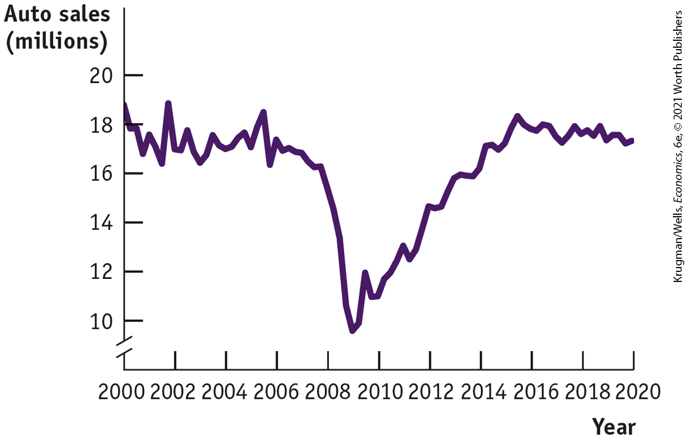

# Business case

What’s Good for America Is Good for GM

<figure id="pau_9781319320164_34qV3xZV8M" class="figure lm_img_lightbox unnum c2 right">

</figure>

With the economy in a steep nosedive in 2009, the U.S. government took many stabilization measures, some of which were highly controversial. The decision to use taxpayer’s funds to bail out General Motors, which was teetering on the edge of bankruptcy, was among the most controversial. To keep the company afloat, the U.S. government gave it \$49.5 billion in loans that were then converted into stock, giving the government temporary ownership of 61% of the company.

General Motors — or GM, as it was often called in its heyday — was once a U.S. icon, so dominant that in the 1950s the company’s president, who had been nominated as Secretary of Defense, famously claimed that any conflict of interest was inconceivable: “I thought what was good for our country was good for General Motors, and vice versa.”

By 2009 the fate of GM and the fate of the United States seemed less intertwined. Still, the case for the bailout rested crucially on the belief that GM’s problems weren’t entirely self-made, that the company was in trouble because the U.S. economy was in trouble, and that national recovery would make a big difference to the automaker’s fortune, too.

On the face of it, this interdependence wasn’t entirely obvious: the 2007–2009 recession was driven by a housing bust and troubles in the banking sector, not by developments in the auto industry. But multiplier effects had indeed led to a plunge in auto sales, as shown in <a href="#kru_9781319245269_ch11_06.xhtml#pau_9781319320164_BYa8dp85kR" id="kru_9781319245269_ch11_06.xhtml#pau_9781319320164_GnWUiADsDU" class="crossref">Figure 11-13</a>. And sure enough, as the economy began to recover, auto sales made up most of their lost ground, with GM sharing in the industry’s resurgence.

<figure id="pau_9781319320164_BYa8dp85kR" class="figure lm_img_lightbox num c3 main-flow">

<figcaption>
FIGURE 11-13 U.S. Auto Sales 2000–2020

<em>Data from:</em>Data Federal Reserve Bank of St. Louis.
</figcaption>
</figure>

<aside class="hidden" id="pau_9781319320164_jOZkCM5aBP" title="hidden">

The vertical axis, labeled Auto sales (millions) is truncated and ranges from 10 to 20 in increments of 2. The horizontal axis, labeled Year ranges from 2000 to 2020 in increments of 2 years. The curve passes through the following approximate points, (2000, 19), (2004, 17), (2008, 9), (2014, 18), and (2020, 17).

</aside>

Did saving GM justify the bailout? The company’s recovery meant that taxpayers got most of their money back — but not all of it. Recall that the government loan of almost \$50 billion was converted into GM stock. Over time, the government sold off its stake for roughly \$40 billion — leaving taxpayers with a \$10 billion loss.

Defenders of the bailout nonetheless declared it a success, because it resuscitated the U.S. auto industry and saved many jobs, not just in the auto companies and their suppliers, but in the many businesses whose sales depend on the incomes of workers employed in the auto industry. In the summer of 2009 the unemployment rate in Michigan, still the U.S. automotive heartland, rose above 14% — but it then began a rapid decline, falling below the national average to 4.5% by the summer of 2016. Few would argue that the speedy recovery in employment in Michigan would have happened without the auto bailout.

In the end, GM bounced back because the U.S. economy recovered; what was good for America was indeed still good for General Motors. And what was good for General Motors was clearly good for Michigan — and maybe, arguably, for the United States as a whole.

<aside class="assessments c3 main-flow v1" epub:type="assessments" id="pau_9781319320164_crhaHvypPu">

## Questions for Thought

1.  Why did a national slump that began with housing affect companies like General Motors?
2.  Why was it reasonable in June 2009 to predict that auto sales would improve in the near future?
3.  How does this story about General Motors help explain how a slump in housing — a relatively small part of the U.S. economy — could produce such a deep national recession?

</aside>

### Summary

1.  An **autonomous change in aggregate spending** leads to a chain reaction in which the total change in real GDP is equal to the **multiplier** times the initial change in aggregate spending. The size of the multiplier, $1\text{/}(1 - MPC)$, depends on the **marginal propensity to consume,** ***MPC**,* the fraction of an additional dollar of disposable income spent on consumption. The larger the *MPC,* the larger the multiplier and the larger the change in real GDP for any given autonomous change in aggregate spending. The **marginal propensity to save,** ***MPS**,* is equal to $1 - MPC$.
2.  The **consumption function** shows how an individual household’s consumer spending is determined by its current disposable income. The **aggregate consumption function** shows the relationship for the entire economy. According to the life-cycle hypothesis, households try to smooth their consumption over their lifetimes. As a result, the aggregate consumption function shifts in response to changes in expected future disposable income and changes in aggregate wealth.
3.  **Planned investment spending** depends negatively on the interest rate and on existing production capacity; it depends positively on expected future real GDP. The **accelerator principle** says that investment spending is greatly influenced by the expected growth rate of real GDP.
4.  Firms hold **inventories** of goods so that they can satisfy consumer demand quickly. **Inventory investment** is positive when firms add to their inventories, negative when they reduce them. Often, however, changes in inventories are unintended. They arise when expected sales and actual sales don’t match. The result is **unplanned inventory investment. Actual investment spending** is the sum of planned investment spending and unplanned inventory investment.
5.  In **income–expenditure equilibrium, planned aggregate spending**, which in a simplified model with no government and no trade is the sum of consumer spending and planned investment spending, is equal to real GDP. At the **income–expenditure equilibrium GDP**, or $Y\text{*}$, unplanned inventory investment is zero. When planned aggregate spending is larger than $Y\text{*}$, unplanned inventory investment is negative; there is an unanticipated reduction in inventories and firms increase production. When planned aggregate spending is less than $Y\text{*}$, unplanned inventory investment is positive; there is an unanticipated increase in inventories and firms reduce production. The **Keynesian cross** shows how the economy self-adjusts to income–expenditure equilibrium through inventory adjustments.
6.  After an autonomous change in planned aggregate spending, the inventory adjustment process moves the economy to a new income–expenditure equilibrium. The change in income–expenditure equilibrium GDP arising from an autonomous change in spending is equal to $(1\text{/}(1 - MPC)) \times \text{Δ}AAE_{Planned}$.
7.  When trade is introduced, the basic multiplier story continues to work but it is modified in two ways: first, income earned from exports is a source of spending on domestically produced goods and services, just like consumption and investment; and second, imports reduce the size of the multiplier.

### Key Terms

- <a href="#kru_9781319245269_ch11_02.xhtml#pau_9781319320164_Y6Tzc0bd4S" id="kru_9781319245269_ch11_07.xhtml#pau_9781319320164_dQuUHR6xVo" class="crossref">Marginal propensity to consume (<em>MPC</em>)</a>
- <a href="#kru_9781319245269_ch11_02.xhtml#pau_9781319320164_ldDFJxNrtE" id="kru_9781319245269_ch11_07.xhtml#pau_9781319320164_tmMnKRADBE" class="crossref">Marginal propensity to save (<em>MPS</em>)</a>
- <a href="#kru_9781319245269_ch11_02.xhtml#pau_9781319320164_3VdhJbZypU" id="kru_9781319245269_ch11_07.xhtml#pau_9781319320164_tUYAvmNDAB" class="crossref">Autonomous change in aggregate spending</a>
- <a href="#kru_9781319245269_ch11_02.xhtml#pau_9781319320164_Ctl7y6avjb" id="kru_9781319245269_ch11_07.xhtml#pau_9781319320164_TQ3zkfUmQV" class="crossref">Multiplier</a>
- <a href="#kru_9781319245269_ch11_03.xhtml#pau_9781319320164_m35F0abYPG" id="kru_9781319245269_ch11_07.xhtml#pau_9781319320164_09GhGD0av8" class="crossref">Consumption function</a>
- <a href="#kru_9781319245269_ch11_03.xhtml#pau_9781319320164_Sj6mdtFYsE" id="kru_9781319245269_ch11_07.xhtml#pau_9781319320164_21mefEByh1" class="crossref">Aggregate consumption function</a>
- <a href="#kru_9781319245269_ch11_04.xhtml#pau_9781319320164_sY6CdS1hXt" id="kru_9781319245269_ch11_07.xhtml#pau_9781319320164_OjqiLhbIy6" class="crossref">Planned investment spending</a>
- <a href="#kru_9781319245269_ch11_04.xhtml#pau_9781319320164_fVYqBEhtqh" id="kru_9781319245269_ch11_07.xhtml#pau_9781319320164_B2s4ad3oeH" class="crossref">Accelerator principle</a>
- <a href="#kru_9781319245269_ch11_04.xhtml#pau_9781319320164_E5ppMqdv0W" id="kru_9781319245269_ch11_07.xhtml#pau_9781319320164_2tzLOWdShj" class="crossref">Inventories</a>
- <a href="#kru_9781319245269_ch11_04.xhtml#pau_9781319320164_3V3zlaD0z7" id="kru_9781319245269_ch11_07.xhtml#pau_9781319320164_Om4qCIFTqa" class="crossref">Inventory investment</a>
- <a href="#kru_9781319245269_ch11_04.xhtml#pau_9781319320164_uHFcCmGpd4" id="kru_9781319245269_ch11_07.xhtml#pau_9781319320164_zKHvKmTetO" class="crossref">Unplanned inventory investment</a>
- <a href="#kru_9781319245269_ch11_04.xhtml#pau_9781319320164_MezEE4P5Gb" id="kru_9781319245269_ch11_07.xhtml#pau_9781319320164_QT2HTOjfS7" class="crossref">Actual investment spending</a>
- <a href="#kru_9781319245269_ch11_05.xhtml#pau_9781319320164_8yaPQK1tsL" id="kru_9781319245269_ch11_07.xhtml#pau_9781319320164_o10chKnEVt" class="crossref">Planned aggregate spending</a>
- <a href="#kru_9781319245269_ch11_05.xhtml#pau_9781319320164_zDr03SoE7k" id="kru_9781319245269_ch11_07.xhtml#pau_9781319320164_DdVVtiJzWf" class="crossref">Income–expenditure equilibrium</a>
- <a href="#kru_9781319245269_ch11_05.xhtml#pau_9781319320164_Vms8G8aUNJ" id="kru_9781319245269_ch11_07.xhtml#pau_9781319320164_0eTYoAbwys" class="crossref">Income–expenditure equilibrium GDP</a>
- <a href="#kru_9781319245269_ch11_05.xhtml#pau_9781319320164_D770FxAoYa" id="kru_9781319245269_ch11_07.xhtml#pau_9781319320164_BoigssrfqH" class="crossref">Keynesian cross</a>

### Practice questions

1.  Explain how each of the following actions will affect the level of planned investment spending and unplanned inventory investment. Assume the economy is initially in income–expenditure equilibrium.
    1.  The Federal Reserve raises the interest rate.
    2.  There is a rise in the expected growth rate of real GDP.
    3.  A sizable inflow of foreign funds into the country lowers the interest rate.
    4.  A large economic shutdown of nonessential businesses causes a significant reduction in consumer spending.
2.  The chapter introduced a linear consumption function, which assumes the marginal propensity to consume is equal at all levels of disposable income. Yet many research studies show that *MPC* varies across income levels. Would you expect *MPC* to be greater for lower or higher income groups? How would relaxing the assumption of a constant *MPC,* allowing it to vary across income groups, change the multiplier?

### Problems

1.  Due to an increase in consumer wealth, there is a \$40 billion autonomous increase in consumer spending in the economies of Westlandia and Eastlandia. Assuming that the aggregate price level is constant, the interest rate is fixed in both countries, and there are no taxes and no foreign trade, complete the accompanying tables to show the various rounds of increased spending that will occur in both economies if the marginal propensity to consume is 0.5 in Westlandia and 0.75 in Eastlandia. What do your results indicate about the relationship between the size of *MPC* and the multiplier?
    | Rounds                    | Westlandia                                                                                                                                                                                  | Total change in GDP |
    |---------------------------|---------------------------------------------------------------------------------------------------------------------------------------------------------------------------------------------|---------------------|
    | Incremental change in GDP |                                                                                                                                                                                             |                     |
    | 1                         | $\text{Δ}\text{C} = \$ 40\,\text{billion}$                                 | ?                   |
    | 2                         | $MPC \times \text{Δ}\text{C} = \,\,\,\,\,\,\,?$                            | ?                   |
    | 3                         | $MPC \times MPC \times \text{Δ}\text{C} = \,\,\,\,\,\,\,?$                 | ?                   |
    | 4                         | $MPC \times MPC \times MPC \times \text{Δ}\text{C} = \,\,\,\,\,\,\,?$      | ?                   |
    | …                         | …                                                                                                                                                                                           | …                   |
    | Total change in GDP       | $(1\text{/}(1\mathbf{-MPC}))\,\text{×}\,\text{Δ}\,\mathbf{C}\mathbf{~=~}?$ |                     |

    | Rounds                    | Eastlandia                                                                                                                                                                                  | Total change in GDP |
    |---------------------------|---------------------------------------------------------------------------------------------------------------------------------------------------------------------------------------------|---------------------|
    | Incremental change in GDP |                                                                                                                                                                                             |                     |
    | 1                         | $\text{Δ}\text{C} = \$ 40\,\text{billion}$                                 | ?                   |
    | 2                         | $MPC \times \text{Δ}\text{C} = \,\,\,\,\,\,\,?$                            | ?                   |
    | 3                         | $MPC \times MPC \times \text{Δ}\text{C} = \,\,\,\,\,\,\,?$                 | ?                   |
    | 4                         | $MPC \times MPC \times MPC \times \text{Δ}\text{C} = \,\,\,\,\,\,\,?$      | ?                   |
    | …                         | …                                                                                                                                                                                           | …                   |
    | Total change in GDP       | $(1\text{/}(1\mathbf{-MPC}))\,\text{×}\,\text{Δ}\,\mathbf{C}\mathbf{~=~}?$ |                     |
2.  Assuming that the aggregate price level is constant, the interest rate is fixed, and there are no taxes and no foreign trade, what will be the change in GDP if the following events occur?
    1.  There is an autonomous increase in consumer spending of \$25 billion; the marginal propensity to consume is 2/3.
    2.  Firms reduce investment spending by \$40 billion; the marginal propensity to consume is 0.8.
    3.  The government increases its purchases of military equipment by \$60 billion; the marginal propensity to consume is 0.6.
3.  Economists observed the only five residents of a very small economy and estimated each one’s consumer spending at various levels of current disposable income. The accompanying table shows each resident’s consumer spending at three income levels.
    | Individual consumer spending by | Individual current disposable income |          |          |
    |---------------------------------|--------------------------------------|----------|----------|
    | \$0                             | \$20,000                             | \$40,000 |          |
    | Andre                           | \$1,000                              | \$15,000 | \$29,000 |
    | Barbara                         | 2,500                                | 12,500   | 22,500   |
    | Casey                           | 2,000                                | 20,000   | 38,000   |
    | Declan                          | 5,000                                | 17,000   | 29,000   |
    | Elena                           | 4,000                                | 19,000   | 34,000   |

    1.  What is each resident’s consumption function? What is *MPC* for each resident?
    2.  What is the economy’s aggregate consumption function? What is *MPC* for the economy?
4.  From 2014 to 2019, Eastlandia experienced large fluctuations in both aggregate consumer spending and disposable income, but wealth, the interest rate, and expected future disposable income did not change. The accompanying table shows the level of aggregate consumer spending and disposable income in millions of dollars for each of these years. Use this information to answer the following questions.
    | Year | Disposable income (millions of dollars) | Consumer spending (millions of dollars) |
    |------|-----------------------------------------|-----------------------------------------|
    | 2014 | \$100                                   | \$180                                   |
    | 2015 | 350                                     | 380                                     |
    | 2016 | 300                                     | 340                                     |
    | 2017 | 400                                     | 420                                     |
    | 2018 | 375                                     | 400                                     |
    | 2019 | 500                                     | 500                                     |

    1.  Plot the aggregate consumption function for Eastlandia.
    2.  What is *MPC?* What is *MPS?*
    3.  What is the aggregate consumption function?
5.  The Bureau of Economic Analysis reported that, in real terms, overall consumer spending increased by \$335.5 billion in 2019.
    1.  If *MPC* is 0.50, by how much will real GDP change in response?
    2.  If there are no other changes to autonomous spending other than the increase in consumer spending in part a, and unplanned inventory investment, $I_{Unplanned}$, decreased by \$100 billion, what is the change in real GDP?
    3.  GDP at the end of 2019 was \$18,638.2 billion. If GDP were to increase by the amount calculated in part b, what would be the percent increase in GDP?
6.  During the early 2000s, the Case–Shiller U.S. Home Price Index, a measure of average home prices, rose continuously until it peaked in March 2006. From March 2006 to May 2009, the index lost 32% of its value. Meanwhile, the stock market experienced similar ups and downs. From March 2003 to October 2007, the Standard and Poor’s 500 (S&P 500) stock index, a broad measure of stock market prices, almost doubled, from 800.73 to a high of 1,565.15. From that time until March 2009, the index fell by almost 60%, to a low of 676.53. How do you think the movements in home prices both influenced the growth in real GDP during the first half of the decade and added to the concern about maintaining consumer spending after the collapse in the housing market that began in 2006? To what extent did the movements in the stock market hurt or help consumer spending?
7.  How will planned investment spending change as the following events occur?
    1.  The interest rate falls as a result of Federal Reserve policy.
    2.  The U.S. Environmental Protection Agency decrees that corporations must upgrade or replace their machinery in order to reduce their emissions of sulfur dioxide.
    3.  Baby boomers begin to retire in large numbers and reduce their savings, resulting in higher interest rates.
8.  In an economy with no government and no foreign sectors, autonomous consumer spending is \$250 billion, planned investment spending is \$350 billion, and the marginal propensity to consume is $2\text{/}3$.
    1.  Plot the aggregate consumption function and planned aggregate spending.
    2.  What is unplanned inventory investment when real GDP equals \$600 billion?
    3.  What is $Y\text{*}$, income–expenditure equilibrium GDP?
    4.  What is the value of the multiplier?
    5.  If planned investment spending rises to \$450 billion, what will be the new $Y\text{*}$?
9.  An economy has a marginal propensity to consume of 0.5, and $Y\text{*}$, income–expenditure equilibrium GDP, equals \$500 billion. Given an autonomous increase in planned investment of \$10 billion, show the rounds of increased spending that take place by completing the accompanying table. The first and second rows are filled in for you. In the first row, the increase of planned investment spending of \$10 billion raises real GDP and *YD* by \$10 billion, leading to an increase in consumer spending of \$5 billion $(MPC \times \text{change}\,\text{in}\,\text{disposable}\,\text{income})$ in row 2, raising real GDP and *YD* by a further \$5 billion.
    |        |                                                                                                                                                                                                                         |                    |                |
    |--------|-------------------------------------------------------------------------------------------------------------------------------------------------------------------------------------------------------------------------|--------------------|----------------|
    |        | Change in $\mathbf{I}_{\mathbf{P}\mathbf{l}\mathbf{a}\mathbf{n}\mathbf{n}\mathbf{e}\mathbf{d}}$ or *C* | Change in real GDP | Change in *YD* |
    | Rounds | (billions of dollars)                                                                                                                                                                                                   |                    |                |
    | 1      | $\text{Δ}I_{Planned} = \$ 10.00$                                                                       | \$10.00            | \$10.00        |
    | 2      | $\text{Δ}C = \$ 5.00$                                                                                  | \$5.00             | \$5.00         |
    | 3      | $\text{Δ}C = ?$                                                                                        | ?                  | ?              |
    | 4      | $\text{Δ}C = ?$                                                                                        | ?                  | ?              |
    | 5      | $\text{Δ}C = ?$                                                                                        | ?                  | ?              |
    | 6      | $\text{Δ}C = ?$                                                                                        | ?                  | ?              |
    | 7      | $\text{Δ}C = ?$                                                                                        | ?                  | ?              |
    | 8      | $\text{Δ}C = ?$                                                                                        | ?                  | ?              |
    | 9      | $\text{Δ}C = ?$                                                                                        | ?                  | ?              |
    | 10     | $\text{Δ}C = ?$                                                                                        | ?                  | ?              |

    1.  What is the total change in real GDP after the 10 rounds? What is the value of the multiplier? What would you expect the total change in $Y\text{*}$ to be based on the multiplier formula? How do your answers to the first and third questions compare?
    2.  Redo the table starting from round 2, assuming *MPC* is 0.75. What is the total change in real GDP after 10 rounds? What is the value of the multiplier? As the marginal propensity to consume increases, what happens to the value of the multiplier?
10. Although the United States is one of the richest nations in the world, it is also the world’s largest debtor nation. We often hear that the problem is the nation’s low savings rate. Suppose policy makers attempt to rectify this by encouraging greater savings in the economy. What effect will their successful attempts have on real GDP?
11. The U.S. economy slowed significantly in early 2008, and policy makers were extremely concerned about growth. To boost the economy, Congress passed several relief packages (the Economic Stimulus Act of 2008 and the American Recovery and Reinvestment Act of 2009) that combined would deliver about \$700 billion in government spending. Assume, for the sake of argument, that this spending was in the form of payments made directly to consumers. The objective was to boost the economy by increasing the disposable income of American consumers.
    1.  Calculate the initial change in aggregate consumer spending as a consequence of this policy measure if *MPC* in the United States is 0.5. Then calculate the resulting change in real GDP arising from the \$700 billion in payments.
    2.  Illustrate the effect on real GDP with the use of a graph depicting the income–expenditure equilibrium. Label the vertical axis “Planned aggregate spending, $AE_{Planned}$” and the horizontal axis “Real GDP.” Draw two planned aggregate expenditure curves $(AE_{Planned\mathbf{1}}\,\text{and}\, AE_{Planned\mathbf{2}})$ and a 45-degree line to show the effect of the autonomous policy change on the equilibrium.
12.  Access the Discovery Data exercise for <!--<a class="crossref" href="kru_9781319245269_ch11_01.xhtml#ch11_sec_1" id="DUMM51">-->Chapter 11<!--</a>-->, Problem 12 online.
    1.  Calculate the marginal propensity to consume for the United States from 2002 through 2019.
    2.  Find the change in real exports of goods and services from 2008 to 2009 and 2017 to 2018.
    3.  Using *MPC* from part a, calculate the multiplier and the effect of a change in real exports from part b on real GDP.
13.  Access the Discovering Data exercise for <!--<a class="crossref" href="kru_9781319245269_ch11_01.xhtml#ch11_sec_1" id="DUMM52">-->Chapter 11<!--</a>-->, Problem 13 online.
    1.  The United Kingdom and most of Europe suffered from the Long Depression from 1873 to 1896. Calculate *MPC* in the United Kingdom using data from 1830 through 1900.
    2.  Find the change in real investment expenditures from 1877 to 1880 and 1883 to 1886.
    3.  Using the multiplier from part a, calculate multiplier and the effect of a change in real exports from part b on real GDP. How does your calculation compare with the actual change in real GDP?

 **Work It Out**

14. 

    1.  The accompanying table shows gross domestic product (GDP), disposable income (*YD*), consumer spending (*C*), and planned investment spending $(I_{Planned})$ in an economy. Assume there is no government or foreign sector in this economy. Complete the table by calculating planned aggregate spending $(AE_{Planned})$ and unplanned inventory investment $(I_{Unplanned})$.
    2.  What is the aggregate consumption function?
    3.  What is $Y\text{*}$, income–expenditure equilibrium GDP?
    4.  What is the value of the multiplier?
    5.  If planned investment spending falls to \$200 billion, what will be the new $Y\text{*}$?
    6.  If autonomous consumer spending rises to \$200 billion, what will be the new $Y\text{*}$?
        | GDP                   | *YD*  | *C*   | $\mathbf{I}_{\mathbf{P}\mathbf{l}\mathbf{a}\mathbf{n}\mathbf{n}\mathbf{e}\mathbf{d}}$ | $\mathbf{A}\mathbf{E}_{\mathbf{P}\mathbf{l}\mathbf{a}\mathbf{n}\mathbf{n}\mathbf{e}\mathbf{d}}$ | $\mathbf{I}_{\mathbf{U}\mathbf{n}\mathbf{p}\mathbf{l}\mathbf{a}\mathbf{n}\mathbf{n}\mathbf{e}\mathbf{d}}$ |
        |-----------------------|-------|-------|--------------------------------------------------------------------------------------------------------------------------------------------------------------------------------------------------------|------------------------------------------------------------------------------------------------------------------------------------------------------------------------------------------------------------------|----------------------------------------------------------------------------------------------------------------------------------------------------------------------------------------------------------------------------|
        | (billions of dollars) |       |       |                                                                                                                                                                                                        |                                                                                                                                                                                                                  |                                                                                                                                                                                                                            |
        | \$0                   | \$0   | \$100 | \$300                                                                                                                                                                                                  | ?                                                                                                                                                                                                                | ?                                                                                                                                                                                                                          |
        | 400                   | 400   | 400   | 300                                                                                                                                                                                                    | ?                                                                                                                                                                                                                | ?                                                                                                                                                                                                                          |
        | 800                   | 800   | 700   | 300                                                                                                                                                                                                    | ?                                                                                                                                                                                                                | ?                                                                                                                                                                                                                          |
        | 1,200                 | 1,200 | 1,000 | 300                                                                                                                                                                                                    | ?                                                                                                                                                                                                                | ?                                                                                                                                                                                                                          |
        | 1,600                 | 1,600 | 1,300 | 300                                                                                                                                                                                                    | ?                                                                                                                                                                                                                | ?                                                                                                                                                                                                                          |
        | 2,000                 | 2,000 | 1,600 | 300                                                                                                                                                                                                    | ?                                                                                                                                                                                                                | ?                                                                                                                                                                                                                          |
        | 2,400                 | 2,400 | 1,900 | 300                                                                                                                                                                                                    | ?                                                                                                                                                                                                                | ?                                                                                                                                                                                                                          |
        | 2,800                 | 2,800 | 2,200 | 300                                                                                                                                                                                                    | ?                                                                                                                                                                                                                | ?                                                                                                                                                                                                                          |
        | 3,200                 | 3,200 | 2,500 | 300                                                                                                                                                                                                    | ?                                                                                                                                                                                                                | ?                                                                                                                                                                                                                          |

        

## Chapter 11 Appendix Deriving the Multiplier Algebraically

This appendix shows how to derive the multiplier algebraically. First, recall that in this chapter planned aggregate spending, $AE_{Planned}$, is the sum of consumer spending, *C,* which is determined by the consumption function, and planned investment spending, $I_{Planned}$. That is, $AE_{Planned} = C + I_{Planned}$. Rewriting this equation to express all its terms fully, we have:

$$AE_{Planned} = A + MPC \times YD + I_{Planned}$$

**(11A-1)**

Because there are no taxes or government transfers in this model, disposable income is equal to GDP, so <a href="#kru_9781319245269_ch11_app.xhtml#pau_9781319320164_oJNIhhjf4G" id="kru_9781319245269_ch11_app.xhtml#pau_9781319320164_9ZKD2foiLX" class="crossref">Equation 11A-1</a> becomes:

$$AE_{Planned} = A + MPC \times GDP + I_{Planned}$$

**(11A-2)**

The income–expenditure equilibrium GDP, *Y*\*, is equal to planned aggregate spending:

$$\begin{array}{l}
\begin{array}{lll}
{Y*} & = & {AE_{Planned}} \\
\  & = & {A + MPC \times Y* + I_{Planned}}
\end{array} \\
{\text{~~~~~~~~~~in~income}\operatorname{~-~}\text{expenditure~equilibrium}}
\end{array}$$

**(11A-3)**

Just two more steps. Subtract $MPC \times Y\text{*}$ from both sides of <a href="#kru_9781319245269_ch11_app.xhtml#pau_9781319320164_3a3QwkkFXq" id="kru_9781319245269_ch11_app.xhtml#pau_9781319320164_BQAyb9TixT" class="crossref">Equation 11A-3</a>:

$$Y^{*} - MPC \times Y\text{*} = Y\text{*} \times (1 - MPC) = \ A + I_{Planned}$$

**(11A-4)**

Finally, divide both sides by $(1 - MPC)$:

$$Y* = \frac{A + I_{Planned}}{1 - MPC}$$

**(11A-5)**

<a href="#kru_9781319245269_ch11_app.xhtml#pau_9781319320164_GSHiKxzD25" id="kru_9781319245269_ch11_app.xhtml#pau_9781319320164_wNVknvqXAs" class="crossref">Equation 11A-5</a> tells us that a \$1 autonomous change in planned aggregate spending — a change in either *A* or $I_{Planned}$ — causes a $\$ 1\text{/}(1 - MPC)$ change in income–expenditure equilibrium GDP, *Y*\*. The multiplier in our simple model is therefore:

$$\text{Multiplier} = 1\text{/}(1 - MPC)$$

**(11A-6)**

### PROBLEMS

1.  Complete the following table by calculating the value of the multiplier and identifying the change in *Y*\* due to the change in autonomous spending. How does the value of the multiplier change with the marginal propensity to consume?
    | *MPC* | Value of multiplier | Change in spending                                                                                                                                                    | Change in *Y*\* |
    |-------|---------------------|-----------------------------------------------------------------------------------------------------------------------------------------------------------------------|-----------------|
    | 0.5   | ?                   | $\text{Δ}C = + \mspace{2mu}\$ 50\,\text{million}$  | ?               |
    | 0.6   | ?                   | $\text{Δ}I = - \mspace{2mu}\$ 10\,\text{million}$  | ?               |
    | 0.75  | ?                   | $\text{Δ}C = - \mspace{2mu}\$ 25\,\text{million}$  | ?               |
    | 0.8   | ?                   | $\text{Δ}I = + \mspace{2mu}\$ 20\,\text{million}$  | ?               |
    | 0.9   | ?                   | $\text{Δ}C = - \mspace{2mu}\$ 2.5\,\text{million}$ | ?               |
2.  In an economy without government purchases, transfers, or taxes, and without imports or exports, aggregate autonomous consumer spending is \$500 billion, planned investment spending is \$250 billion, and the marginal propensity to consume is 0.5.
    1.  Write the expression for planned aggregate spending as in <a href="#kru_9781319245269_ch11_app.xhtml#pau_9781319320164_oJNIhhjf4G" id="kru_9781319245269_ch11_app.xhtml#pau_9781319320164_gapCH51cG9" class="crossref">Equation 11A-1</a>.
    2.  Solve for *Y*\* algebraically.
    3.  What is the value of the multiplier?
    4.  How will *Y*\* change if autonomous consumer spending falls to \$450 billion?
