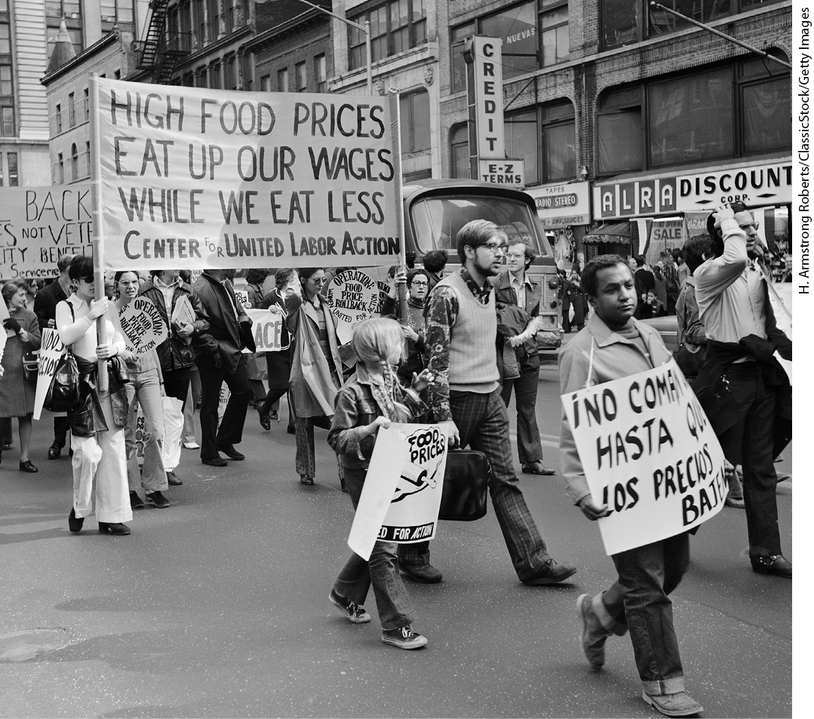
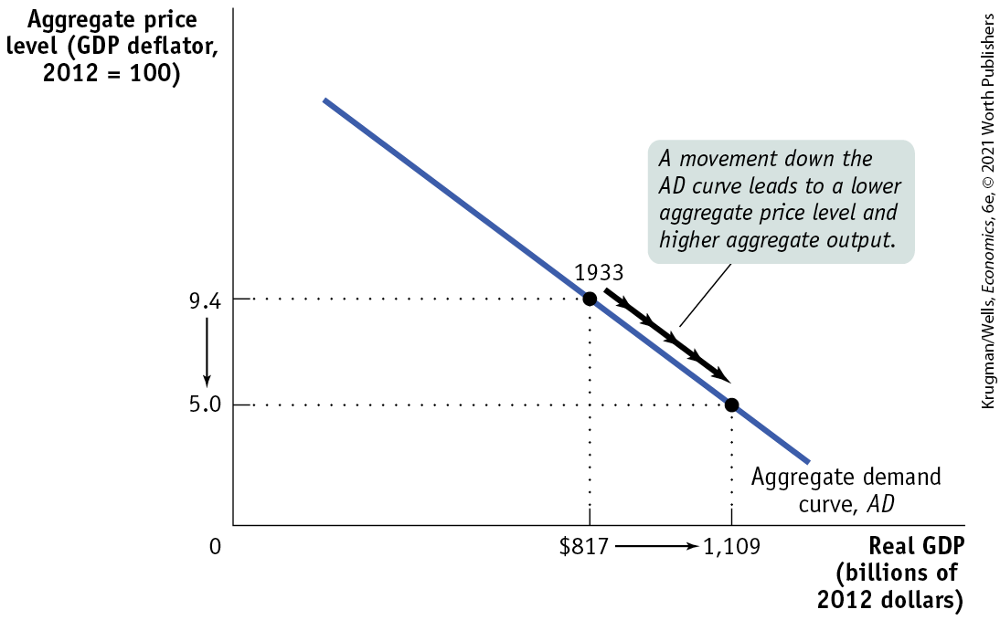
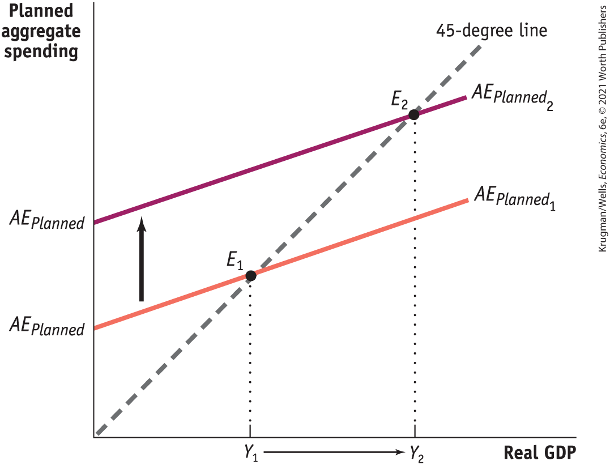
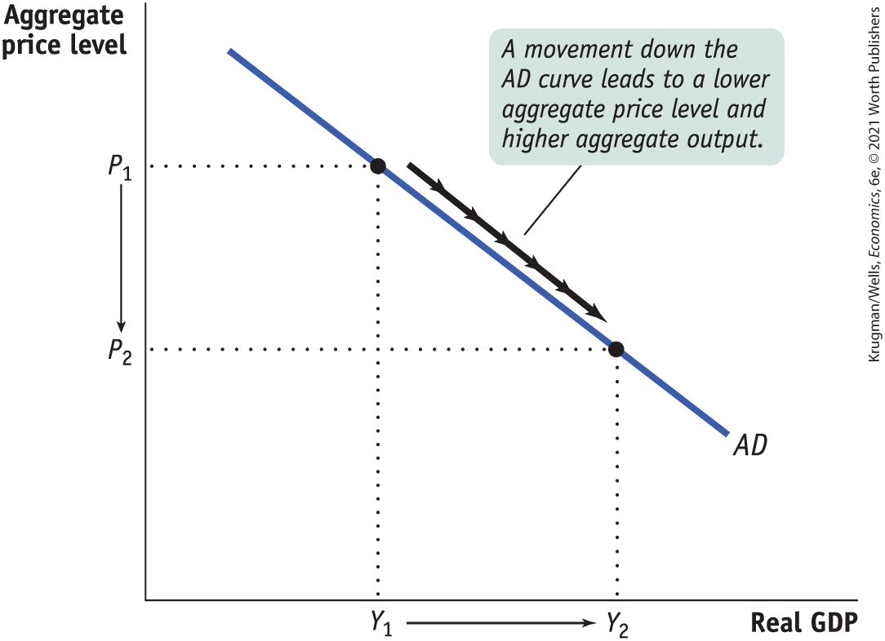
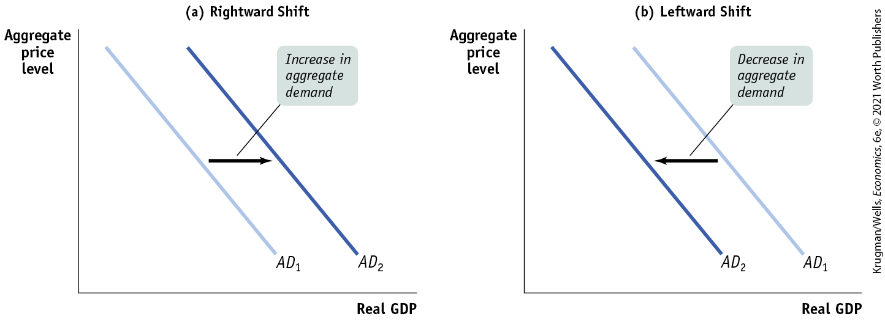
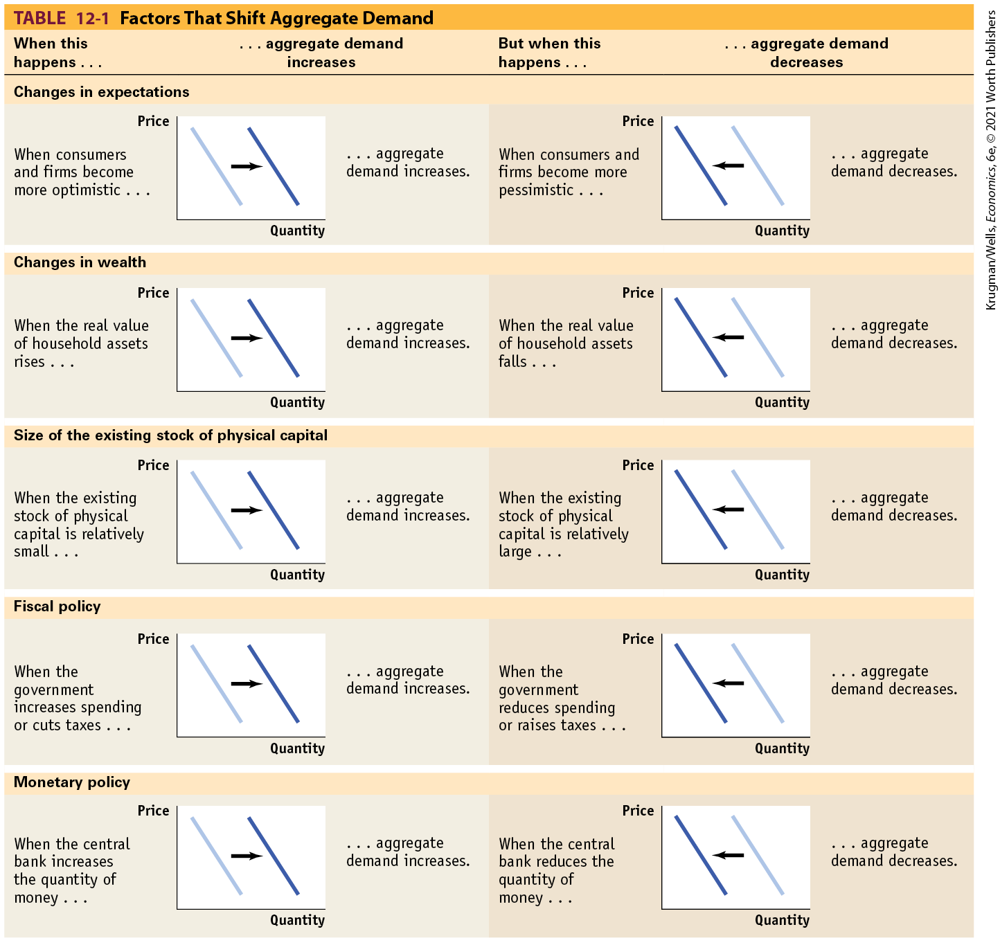

# Chapter 12 Aggregate Demand and Aggregate Supply

## DIFFERENT GENERATIONS, DIFFERENT POLICIES

<figure id="pau_9781319320164_JPTG87zEOV" class="figure lm_img_lightbox unnum c2 right">

<figcaption>
<strong>Officials who came of age in the 1970s probably worry about inflation.</strong>
</figcaption>
</figure>

**UNEMPLOYMENT AND INFLATION** are the two great evils of macroeconomics, and policy makers do their best to keep both under control. Sometimes, however, this task isn’t straightforward, as we learned in <a href="#kru_9781319245269_ch08_01.xhtml#pau_9781319320164_6AH2l2uZnD" id="kru_9781319245269_ch12_01.xhtml#pau_9781319320164_DG7g5Smxvp" class="crossref">Chapter 8</a>: policies to control inflation can worsen unemployment and policies aimed at reducing unemployment can cause inflation. So at times it’s hard to know whether inflation or unemployment poses the bigger risk to the economy.

Policy makers at the Federal Reserve, also known as the Fed, found themselves facing such a quandary in 2011, when the unemployment rate, at around 9%, was very high by historical standards, but inflation had spiked to almost 4%, twice the widely accepted policy target of 2%. So should policy remain expansionary, to fight unemployment, or should it be contractionary, to reduce inflation?

In the end, the Fed decided to keep its foot on the gas and continue with a strong expansionary monetary policy — it reduced interest rates with the goal of boosting the economy. Fed officials believed that the inflation surge was a blip caused by a temporary rise in oil prices, and that it would soon dissipate. Time proved them right: once the oil price rise ran its course, inflation quickly fell back below 2%. The Fed’s counterpart in Europe, the European Central Bank, or ECB, faced a similar situation: a 10% unemployment rate and 3% inflation. Yet it made the opposite policy choice: contractionary monetary policy — raising interest rates with the goal of slowing the economy.

Why did these two central banks, facing similar circumstances, move in opposite directions? Differences in the ages of the two bank leaders may provide a clue: Jean-Claude Trichet, President of the ECB, was 68, while Ben Bernanke, the chairman of the Fed, was 57. The 11-year age difference may seem inconsequential, but it was in fact significant because it corresponded to differences in the kinds of economic problems that dominated when each man was coming of age.

In fact, Neil Irwin of the *New York Times* has found a strong correlation between the ages of policy makers and their policy stances. Those like Mr. Trichet, who spent their young adulthood during the high-inflation 1970s, were more likely to call for interest-rate hikes and tightening monetary policy to head off inflation than were younger policy makers, like Mr. Bernanke, who, in contrast, were more concerned about unemployment and growth.

Bernanke understood that an economic slump can arise from different types of shocks. This understanding requires a model of the economy that can distinguish between different types of short-run economic fluctuations, a model that extends beyond the income–expenditure framework we studied in the previous chapter.

So why was Bernanke right in this case? Because the recessions of the 1970s were very different from the severe slump that began in 2007 and was still afflicting the economy in 2011. The recessions of the 1970s were largely caused by *supply shocks,* while the Great Recession of 2007–2009 was the result of a *demand shock.* (We discuss supply and demand shocks at length in the chapter.) Unlike Trichet, Bernanke seemed to have grasped the fact that times had changed.

In this chapter, we will develop the *AD–AS model* to help you understand how these shocks affect the economy. We’ll proceed in three steps. First, we’ll develop the concept of *aggregate demand.* Then we’ll turn to the parallel concept of *aggregate supply.* Finally, we’ll put the two concepts together. 

<aside class="learning-objectives c3 main-flow v3" epub:type="learning-objectives" id="pau_9781319320164_7OAMuygF96">

### WHAT YOU WILL LEARN

- How does the **aggregate demand curve** illustrate the relationship between the aggregate price level and the quantity of aggregate output demanded?
- How does the **aggregate supply curve** illustrate the relationship between the aggregate price level and the quantity of aggregate output supplied?
- Why is the aggregate supply curve different in the short run compared to the long run?
- How is the ***AD–AS* model** used to analyze economic fluctuations?
- How can monetary policy and fiscal policy stabilize the economy?

</aside>

## Aggregate Demand

The Great Depression, the great majority of economists agree, was the result of a massive negative demand shock. What does that mean? In <a href="#kru_9781319245269_ch03_01.xhtml#pau_9781319320164_ECGi4IZqUE" id="kru_9781319245269_ch12_02.xhtml#pau_9781319320164_fJlPAVXpQq" class="crossref">Chapter 3</a> we explained that when economists talk about a fall in the demand for a particular good or service, they’re referring to a leftward shift of the demand curve. Similarly, when economists talk about a negative demand shock to the economy as a whole, they’re referring to a leftward shift of the <a href="#kru_9781319245269_EM_glossary.xhtml#pau_9781319320164_rhbctbnuSm" id="kru_9781319245269_ch12_02.xhtml#pau_9781319320164_7IVUx5Gpjr" class="glossref" role="doc-glossref">aggregate demand curve</a>, a curve that shows the relationship between the aggregate price level and the quantity of aggregate output demanded by households, firms, the government, and the rest of the world.

<aside aria-label="title 1" class="glossary c3 main-flow v1" epub:type="glossary" id="pau_9781319320164_SE0kv2efv4">

**aggregate demand curve**  
The **aggregate demand curve** shows the relationship between the aggregate price level and the quantity of aggregate output demanded by households, businesses, the government, and the rest of the world.

</aside>

<a href="#kru_9781319245269_ch12_02.xhtml#pau_9781319320164_kjG4bb3dNj" id="kru_9781319245269_ch12_02.xhtml#pau_9781319320164_LiAEAjYVfm" class="crossref">Figure 12-1</a> shows what the aggregate demand curve may have looked like in 1933, at the end of the 1929–1933 recession. The horizontal axis shows the total quantity of domestic goods and services demanded, measured in 2012 dollars. We use real GDP to measure aggregate output and will often use the two terms interchangeably.

<figure id="pau_9781319320164_kjG4bb3dNj" class="figure lm_img_lightbox num c3 main-flow">

<figcaption>
FIGURE 12-1 The Aggregate Demand Curve

The aggregate demand curve shows the relationship between the aggregate price level and the quantity of aggregate output demanded. The curve is downward sloping due to the wealth effect of a change in the aggregate price level and the interest rate effect of a change in the aggregate price level. Corresponding to actual 1933 data, here the total quantity of goods and services demanded at an aggregate price level of 9.4 is $817 billion in 2012 dollars. According to our hypothetical curve, however, if the aggregate price level had been only 5.0, the quantity of aggregate output demanded would have risen to $1,109 billion.
</figcaption>
</figure>

<aside class="hidden" id="pau_9781319320164_dQFv9eh50t" title="hidden">

The vertical axis, labeled Aggregate price level (G D P deflator, 2012 equals 100) shows markings at 5 and 9.4, from bottom to top. The horizontal axis, labeled Real G D P (billions of 2012 dollars) shows markings at 817 and 1,109 dollars, from left to right. A negative sloping line, labeled Aggregate demand curve A D, passes through a point labeled 1933 at (817, 9.4) and another point (1,109, 5). An arrow pointing from (817, 9.4) to (1,109, 5) is labeled, “A movement down the A D curve leads to a lower aggregate price level and higher aggregate output.” A rightward arrow is from 817 to 1,109 on the horizontal axis, and a downward arrow is from 9.4 to 5.0 on the vertical axis.

</aside>

The vertical axis shows the aggregate price level, measured by the GDP deflator. With these variables on the axes, we can draw a curve, *AD,* showing how much aggregate output would have been demanded at any given aggregate price level. Since *AD* is meant to illustrate aggregate demand, the point labeled 1933 on the curve corresponds to actual data from that year, when the aggregate price level was 9.4 and the total quantity of domestic final goods and services purchased was \$817 billion in 2012 dollars.

The aggregate demand curve in <a href="#kru_9781319245269_ch12_02.xhtml#pau_9781319320164_kjG4bb3dNj" id="kru_9781319245269_ch12_02.xhtml#pau_9781319320164_rzvYecafIB" class="crossref">Figure 12-1</a> is downward sloping, indicating a negative relationship between the aggregate price level and the quantity of aggregate output demanded. A higher aggregate price level, other things equal, reduces the quantity of aggregate output demanded; a lower aggregate price level, other things equal, increases the quantity of aggregate output demanded. According to <a href="#kru_9781319245269_ch12_02.xhtml#pau_9781319320164_kjG4bb3dNj" id="kru_9781319245269_ch12_02.xhtml#pau_9781319320164_aUk1OKmuDm" class="crossref">Figure 12-1</a>, if the price level in 1933 had been 5 instead of 9.4, the total quantity of domestic final goods and services demanded would have been \$1,109 billion in 2012 dollars instead of \$817 billion.

The first key question about the aggregate demand curve is: why should the curve be downward sloping?

### Why Is the Aggregate Demand Curve Downward Sloping?

In <a href="#kru_9781319245269_ch12_02.xhtml#pau_9781319320164_kjG4bb3dNj" id="kru_9781319245269_ch12_02.xhtml#pau_9781319320164_UHziSq5yMh" class="crossref">Figure 12-1</a>, the curve *AD* is downward sloping. Why? Recall the basic equation of national income accounting:

$$\text{GDP} = C + I + G + X - IM$$

**(12-1)**

where *C* is consumer spending, *I* is investment spending, *G* is government purchases of goods and services, *X* is exports to other countries, and *IM* is imports. If we measure these variables in constant dollars — that is, in prices of a base year — then $C + I + G + X - IM$ is the quantity of domestically produced final goods and services demanded during a given period. *G* is decided by the government, but the other variables are private-sector decisions. To understand why the aggregate demand curve slopes downward, we need to understand why a rise in the aggregate price level reduces *C, I,* and $X - IM$.

You might think that the downward slope of the aggregate demand curve is a natural consequence of the *law of demand* defined back in <a href="#kru_9781319245269_ch03_01.xhtml#pau_9781319320164_ECGi4IZqUE" id="kru_9781319245269_ch12_02.xhtml#pau_9781319320164_YU3wneoch9" class="crossref">Chapter 3</a>. That is, since the demand curve for any one good is downward sloping, isn’t it natural that the demand curve for aggregate output is also downward sloping? This turns out, however, to be a misleading parallel. The demand curve for any individual good shows how the quantity demanded depends on the price of that good, *holding the prices of other goods and services constant.* The main reason the quantity of a good demanded falls when the price of that good rises — that is, the quantity of a good demanded falls as we move up the demand curve — is that people switch their consumption to other goods and services.

But when we consider movements up or down the aggregate demand curve, we’re considering *a simultaneous change in the prices of all final goods and services.* Furthermore, changes in the composition of goods and services in consumer spending aren’t relevant to the aggregate demand curve: if consumers decide to buy fewer clothes but more cars, this doesn’t necessarily change the total quantity of final goods and services they demand.

Why, then, does a rise in the aggregate price level lead to a fall in the quantity of all domestically produced final goods and services demanded? There are two main reasons: the *wealth effect* and the *interest rate effect* of a change in the aggregate price level.

#### The Wealth Effect

An increase in the aggregate price level, other things equal, reduces the purchasing power of many assets. Consider, for example, someone who has \$5,000 in a bank account. If the aggregate price level were to rise by 25%, what used to cost \$5,000 would now cost \$6,250, and would no longer be affordable. And what used to cost \$4,000 would now cost \$5,000, so that the \$5,000 in the bank account would now buy only as much as \$4,000 would have bought previously. With the loss in purchasing power, the owner of that bank account would probably scale back their consumption plans. Millions of other people would respond the same way, leading to a fall in spending on final goods and services, because a rise in the aggregate price level reduces the purchasing power of everyone’s bank account.

Correspondingly, a fall in the aggregate price level increases the purchasing power of consumers’ assets and leads to more consumer demand. The <a href="#kru_9781319245269_EM_glossary.xhtml#pau_9781319320164_5Ra4Aiinde" id="kru_9781319245269_ch12_02.xhtml#pau_9781319320164_SspoHv3r70" class="glossref" role="doc-glossref">wealth effect of a change in the aggregate price level</a> is the effect on consumer spending caused by the effect of a change in the aggregate price level on the purchasing power of consumers’ assets. Because of the wealth effect, consumer spending, *C,* falls when the aggregate price level rises, leading to a downward-sloping aggregate demand curve.

<aside aria-label="title 2" class="glossary c3 main-flow v1" epub:type="glossary" id="pau_9781319320164_7GzwENzqR8">

**wealth effect of a change in the aggregate price level**  
The **wealth effect of a change in the aggregate price level** is the effect on consumer spending caused by the effect of a change in the aggregate price level on the purchasing power of consumers’ assets.

</aside>

#### The Interest Rate Effect

Economists use the term *money* in its narrowest sense to refer to cash and bank accounts on which people can use a debit card and write checks. People and firms hold money because it reduces the cost and inconvenience of making transactions. An increase in the aggregate price level, other things equal, reduces the purchasing power of a given amount of money holdings. To purchase the same basket of goods and services as before, people and firms now need to hold more money. So, in response to an increase in the aggregate price level, the public tries to increase its money holdings, either by borrowing more or by selling assets such as bonds. This reduces the funds available for lending to other borrowers and drives interest rates up.

In <a href="#kru_9781319245269_ch10_01.xhtml#pau_9781319320164_GbPAtnS6LO" id="kru_9781319245269_ch12_02.xhtml#pau_9781319320164_s10xu9GLKh" class="crossref">Chapter 10</a> we learned that a rise in the interest rate reduces investment spending because it makes the cost of borrowing higher. It also reduces consumer spending because households save more of their disposable income. So a rise in the aggregate price level depresses investment spending, *I,* and consumer spending, *C,* through its effect on the purchasing power of money holdings, an effect known as the <a href="#kru_9781319245269_EM_glossary.xhtml#pau_9781319320164_dvwwsFLAMe" id="kru_9781319245269_ch12_02.xhtml#pau_9781319320164_VSao4MccVI" class="glossref" role="doc-glossref">interest rate effect of a change in the aggregate price level</a>. This also leads to a downward-sloping aggregate demand curve.

<aside aria-label="title 3" class="glossary c3 main-flow v1" epub:type="glossary" id="pau_9781319320164_yil5VpnPOK">

**interest rate effect of a change in the aggregate price level**  
The **interest rate effect of a change in the aggregate price level** is the effect on consumer spending and investment spending caused by the effect of a change in the aggregate price level on the purchasing power of consumers’ and firms’ money holdings.

</aside>

We’ll have a lot more to say about money and interest rates in <a href="#kru_9781319245269_ch15_01.xhtml#pau_9781319320164_4oAIkgdXHI" id="kru_9781319245269_ch12_02.xhtml#pau_9781319320164_bC6DAtqm1v" class="crossref">Chapter 15</a> on monetary policy. We’ll also see, in <a href="#kru_9781319245269_ch18_01.xhtml#pau_9781319320164_L1a5VDcA2j" id="kru_9781319245269_ch12_02.xhtml#pau_9781319320164_32foJ5PKUd" class="crossref">Chapter 18</a>, which covers international macroeconomics, that a higher interest rate indirectly tends to reduce exports (*X*) and increase imports (*IM*). For now, the important point is that the aggregate demand curve is downward sloping due to both the wealth effect and the interest rate effect of a change in the aggregate price level.

### The Aggregate Demand Curve and the Income–Expenditure Model

In the preceding chapter we introduced the *income–expenditure model,* which shows how the economy arrives at *income–expenditure equilibrium.* Now we’ve introduced the aggregate demand curve, which relates the overall demand for goods and services to the overall price level. How do these concepts fit together?

Recall that one of the assumptions of the income–expenditure model is that the aggregate price level is fixed. We now drop that assumption. We can still use the income–expenditure model, however, to ask what aggregate spending would be *at any given aggregate price level,* which is precisely what the aggregate demand curve shows. So the *AD* curve is actually derived from the income–expenditure model. Economists sometimes say that the income–expenditure model is “embedded” in the *AD–AS* model.

<a href="#kru_9781319245269_ch12_02.xhtml#pau_9781319320164_kJVZ8iyWSh" id="kru_9781319245269_ch12_02.xhtml#pau_9781319320164_CkFs6qheUo" class="crossref">Figure 12-2</a> shows, once again, how income–expenditure equilibrium is determined. Real GDP is on the horizontal axis; real planned aggregate spending is on the vertical axis. Other things equal, planned aggregate spending, equal to consumer spending plus planned investment spending, rises with real GDP. This is illustrated by the upward-sloping lines $AE_{Planned}{}_{{}_{1}}$ and $AE_{Planned}{}_{{}_{2}}$. Income–expenditure equilibrium, as we learned in <a href="#kru_9781319245269_ch11_01.xhtml#pau_9781319320164_qvzco1ppmg" id="kru_9781319245269_ch12_02.xhtml#pau_9781319320164_YVIxlwIoYx" class="crossref">Chapter 11</a>, is at the point where the line representing planned aggregate spending crosses the 45-degree line. For example, if $AE_{Planned}{}_{{}_{1}}$ is the relationship between real GDP and planned aggregate spending, then income–expenditure equilibrium is at point $E_{1}$, corresponding to a level of real GDP equal to $Y_{1}$.

<figure id="pau_9781319320164_kJVZ8iyWSh" class="figure lm_img_lightbox num c3 main-flow">

<figcaption>
FIGURE 12-2 How Changes in the Aggregate Price Level Affect Income–Expenditure Equilibrium

Income–expenditure equilibrium occurs at the point where the curve <em>A</em><em>E</em><em>P</em><em>l</em><em>a</em><em>n</em><em>n</em><em>e</em><em>d</em>, which shows real aggregate planned spending, crosses the 45-degree line. A fall in the aggregate price level causes the <em>A</em><em>E</em><em>P</em><em>l</em><em>a</em><em>n</em><em>n</em><em>e</em><em>d</em> curve to shift from <em>A</em><em>E</em><em>P</em><em>l</em><em>a</em><em>n</em><em>n</em><em>e</em><em>d</em>1 to <em>A</em><em>E</em><em>P</em><em>l</em><em>a</em><em>n</em><em>n</em><em>e</em><em>d</em>2, leading to a rise in income–expenditure equilibrium GDP from <em>Y</em>1 to <em>Y</em>2.
</figcaption>
</figure>

<aside class="hidden" id="pau_9781319320164_fH59FUbu82" title="hidden">

The vertical axis is labeled Planned aggregate spending, and the horizontal axis, labeled Real G D P shows markings at Y subscript 1 and Y subscript 2, from left to right. A 45-degree positive sloping dashed line starts at the origin and moves upward to the right. A positive sloping straight line, labeled A E subscript Planned 1, starts from the positive vertical axis and intersects the 45-degree line at E subscript 1. Another positive sloping straight line, labeled A E subscript Planned 2, starts from the positive vertical axis and intersects the 45-degree line at E subscript 2. The line labeled A E subscript Planned 2 is above and parallel to the line labeled A E subscript Planned 1. Point E subscript 2 is above and to the right of point E subscript 1. Two dotted lines extend from E subscript 1 and E subscript 2 to Y subscript 1 and Y subscript 2 on the horizontal axis, respectively. An upward arrow between the parallel lines indicates an upward shift.

</aside>

We’ve just seen, however, that changes in the aggregate price level change the level of planned aggregate spending *at any given level of real GDP.* This means that when the aggregate price level changes, the $AE_{Planned}$ curve shifts. For example, suppose that the aggregate price level falls. As a result of both the wealth effect and the interest rate effect, the fall in the aggregate price level will lead to higher planned aggregate spending at any given level of real GDP. So the $AE_{Planned}$ curve will shift up, as illustrated in <a href="#kru_9781319245269_ch12_02.xhtml#pau_9781319320164_kJVZ8iyWSh" id="kru_9781319245269_ch12_02.xhtml#pau_9781319320164_gpgJKAHzlx" class="crossref">Figure 12-2</a> by the shift from $AE_{Planned}{}_{{}_{1}}$ to $AE_{Planned}{}_{{}_{2}}$. The increase in planned aggregate spending leads to a multiplier process that moves the income–expenditure equilibrium from point $E_{1}$ to point $E_{2}$, raising real GDP from $Y_{1}$ to $Y_{2}$.

<a href="#kru_9781319245269_ch12_02.xhtml#pau_9781319320164_BMpqkCV1kQ" id="kru_9781319245269_ch12_02.xhtml#pau_9781319320164_KRxv7ies40" class="crossref">Figure 12-3</a> shows how this result can be used to derive the aggregate demand curve. In <a href="#kru_9781319245269_ch12_02.xhtml#pau_9781319320164_BMpqkCV1kQ" id="kru_9781319245269_ch12_02.xhtml#pau_9781319320164_mVfnU7b6Bg" class="crossref">Figure 12-3</a>, we show a fall in the aggregate price level from $P_{1}$ to $P_{2}$. We see in <a href="#kru_9781319245269_ch12_02.xhtml#pau_9781319320164_kJVZ8iyWSh" id="kru_9781319245269_ch12_02.xhtml#pau_9781319320164_P2Mm2yCJIm" class="crossref">Figure 12-2</a> that a fall in the aggregate price level would lead to an upward shift of the $AE_{Planned}$ curve and hence a rise in real GDP. We can see this same result in <a href="#kru_9781319245269_ch12_02.xhtml#pau_9781319320164_BMpqkCV1kQ" id="kru_9781319245269_ch12_02.xhtml#pau_9781319320164_x6YfRuwqTR" class="crossref">Figure 12-3</a> as a movement along the *AD* curve: as the aggregate price level falls, real GDP rises from $Y_{1}$ to $Y_{2}$.

<figure id="pau_9781319320164_BMpqkCV1kQ" class="figure lm_img_lightbox num c3 main-flow">

<figcaption>
FIGURE 12-3 The Income–Expenditure Model and the Aggregate Demand Curve

<a href="#kru_9781319245269_ch12_02.xhtml#pau_9781319320164_kJVZ8iyWSh" id="kru_9781319245269_ch12_02.xhtml#pau_9781319320164_7rhs3cGI9h" class="crossref">Figure 12-2</a> shows how a fall in the aggregate price level shifts the planned aggregate spending curve up, leading to a rise in real GDP. Here we see that same result as a movement along the aggregate demand curve. If the aggregate price level falls from <em>P</em>1 to <em>P</em>2, real GDP rises from <em>Y</em>1 to <em>Y</em>2. The <em>AD</em> curve is therefore downward sloping.
</figcaption>
</figure>

<aside class="hidden" id="pau_9781319320164_EEmeefPHD3" title="hidden">

The vertical axis, labeled Aggregate price level shows markings at P subscript 2 and P subscript 1, from bottom to top. The horizontal axis, labeled Real G D P shows markings at Y subscript 1 and Y subscript 2, from left to right. A negative sloping straight line, labeled A D, passes through the points (Y subscript 1, P subscript 1) and (Y subscript 2, P subscript 2). An arrow pointing from (Y subscript 1, P subscript 1) to (Y subscript 2, P subscript 2) is labeled, “A movement down the A D curve leads to a lower aggregate price level and higher aggregate output.” A rightward arrow is from Y subscript 1 to Y subscript 2 on the horizontal axis, and a downward arrow is from P subscript 1 to P subscript 2 on the vertical axis.

</aside>

So the aggregate demand curve doesn’t replace the income–expenditure model. Instead, it’s a way to summarize what the income–expenditure model says about the effects of changes in the aggregate price level.

In practice, economists often use the income–expenditure model to analyze short-run economic fluctuations, even though strictly speaking it should be seen as a component of a more complete model. In the short run, in particular, this is usually a reasonable shortcut.

### Shifts of the Aggregate Demand Curve

In <a href="#kru_9781319245269_ch03_01.xhtml#pau_9781319320164_ECGi4IZqUE" id="kru_9781319245269_ch12_02.xhtml#pau_9781319320164_MCk3sqWDW7" class="crossref">Chapter 3</a>, where we introduced the analysis of supply and demand in the market for an individual good or service, we stressed the importance of the distinction between *movements along* the demand curve and *shifts of* the demand curve. The same distinction applies to the aggregate demand curve. <a href="#kru_9781319245269_ch12_02.xhtml#pau_9781319320164_kjG4bb3dNj" id="kru_9781319245269_ch12_02.xhtml#pau_9781319320164_86jCPqAdGC" class="crossref">Figure 12-1</a> shows a *movement along* the aggregate demand curve, a change in the aggregate quantity of goods and services demanded as the aggregate price level changes.

But there can also be *shifts of* the aggregate demand curve, changes in the quantity of goods and services demanded at any given price level, as shown in <a href="#kru_9781319245269_ch12_02.xhtml#pau_9781319320164_8KJGniF9EY" id="kru_9781319245269_ch12_02.xhtml#pau_9781319320164_Ot0b2R8qnu" class="crossref">Figure 12-4</a>. When we talk about an increase in aggregate demand, we mean a shift of the aggregate demand curve to the right, as shown in panel (a) by the shift from $AD_{1}$ to $AD_{2}$. A rightward shift occurs when the quantity of aggregate output demanded increases at any given aggregate price level. A decrease in aggregate demand means that the *AD* curve shifts to the left, as in panel (b). A leftward shift implies that the quantity of aggregate output demanded falls at any given aggregate price level.

<figure id="pau_9781319320164_8KJGniF9EY" class="figure lm_img_lightbox num c4 main-flow">

<figcaption>
FIGURE 12-4 Shifts of the Aggregate Demand Curve

Panel (a) shows the effect of events that increase the quantity of aggregate output demanded at any given aggregate price level, such as improvements in business and consumer expectations or increased government spending. Such changes shift the aggregate demand curve to the right, from <em>A</em><em>D</em>1 to <em>A</em><em>D</em>2. Panel (b) shows the effect of events that decrease the quantity of aggregate output demanded at any given aggregate price level, such as a fall in wealth caused by a stock market decline. This shifts the aggregate demand curve leftward from <em>A</em><em>D</em>1 to <em>A</em><em>D</em>2.
</figcaption>
</figure>

<aside class="hidden" id="pau_9781319320164_uXum1VIKEt" title="hidden">

Graph (a) Rightward Shift: The vertical axis is labeled Aggregate price level, and the horizontal axis is labeled Real G D P. Two negative sloping parallel straight lines are labeled A D subscript 1 and A D subscript 2, from left to right. A rightward arrow pointing from A D subscript 1 to A D subscript 2 is labeled, “Increase in aggregate demand.” Graph (b) Leftward Shift: The vertical axis is labeled Aggregate price level, and the horizontal axis is labeled Real G D P. Two negative sloping parallel straight lines are labeled A D subscript 2 and A D subscript 1, from left to right. A leftward arrow from A D subscript 1 to A D subscript 2 is labeled, “Decrease in aggregate demand.”

</aside>

A number of factors can shift the aggregate demand curve. Among the most important factors are changes in expectations, changes in wealth, and the size of the existing stock of physical capital. In addition, both fiscal and monetary policy can shift the aggregate demand curve. All five factors set the multiplier process in motion. By causing an initial rise or fall in real GDP, they change disposable income, which leads to additional changes in aggregate spending, which lead to further changes in real GDP, and so on. For an overview of factors that shift the aggregate demand curve, see <a href="#kru_9781319245269_ch12_02.xhtml#pau_9781319320164_rmdI74W0YS" id="kru_9781319245269_ch12_02.xhtml#pau_9781319320164_qCkdo0UEd5" class="crossref">Table 12-1</a>.

<!--
<strong class="important">[Comp: place table on same spread as call-out, without breaking it.]</strong>
--> <!--
[InsertTable 12-1 is from Macro5e p. 351]
-->

<figure id="pau_9781319320164_rmdI74W0YS" class="figure lm_img_lightbox unnum c4 main-flow">

</figure>

<aside class="hidden" id="pau_9781319320164_Sh0sDTzjcY" title="hidden">

The column headings are as follows, “When this happens ellipsis aggregate demand increases” and “But when this happens ellipsis aggregate demand decreases.” Each graph under the columns plots price on the vertical axis and quantity on the horizontal axis. The first row, titled Changes in expectations has two graphs: A graph under column 1 has two negative sloping parallel lines, with a rightward arrow between them. Text beside the graph reads, “When consumers and firms become more optimistic, aggregate demand increases”. A graph under column 2 has two negative sloping parallel lines, with a leftward arrow between them. Text beside the graph reads, “When consumers and firms become more pessimistic, aggregate demand decreases.” The second row, titled Changes in wealth has two graphs: A graph under column 1 has two negative sloping parallel lines, with a rightward arrow between them. Text beside the graph reads, “When the real value of household assets rises, aggregate demand increases”. A graph under column 2 has two negative sloping parallel lines, with a leftward arrow between them. Text beside the graph reads, “When the real value of household assets falls, aggregate demand decreases.” The third row, titled Size of the existing stock of physical capital has two graphs: A graph under column 1 has two negative sloping parallel lines, with a rightward arrow between them. Text beside the graph reads, “When the existing stock of physical capital is relatively small, aggregate demand increases:. A graph under column 2 has two negative sloping parallel lines, with a leftward arrow between them. Text beside the graph reads, “When the existing stock of physical capital is relatively large, aggregate demand decreases.” The fourth row, titled Fiscal policy has two graphs: A graph under column 1 has two negative sloping parallel lines, with a rightward arrow between them. Text beside the graph reads, “When the government increases spending or cuts taxes, aggregate demand increases”. A graph under column 2 has two negative sloping parallel lines, with a leftward arrow between them. Text beside the graph reads, “When the government reduces spending or raises taxes, aggregate demand decreases.” The fifth row, titled Monetary policy has two graphs: A graph under column 1 has two negative sloping parallel lines, with a rightward arrow between them. Text beside the graph reads, “When the central bank increases the quantity of money, aggregate demand increases”. A graph under column 2 has two negative sloping parallel lines, with a leftward arrow between them. Text beside the graph reads, “When the central bank reduces the quantity of money, aggregate demand decreases.”

</aside>

#### Changes in Expectations

Both consumer spending and planned investment spending depend in part on people’s expectations about the future. Consumers base their spending not only on the income they have now but also on the income they expect to have in the future. Firms base their planned investment spending not only on current conditions but also on the sales they expect to make in the future. As a result, changes in expectations can push consumer spending and planned investment spending up or down. If consumers and firms become more optimistic, aggregate spending rises; if they become more pessimistic, aggregate spending falls.

In fact, short-run economic forecasters pay careful attention to surveys of consumer and business sentiment. In particular, forecasters watch the Consumer Confidence Index, a monthly measure calculated by The Conference Board, and the Michigan Consumer Sentiment Index, a similar measure calculated by the University of Michigan.

#### Changes in Wealth

Consumer spending depends in part on the value of household assets. When the real value of these assets rises, the purchasing power they embody also rises, leading to an increase in aggregate spending. For example, in the 1990s there was a significant rise in the stock market that increased aggregate demand. And when the real value of household assets falls (because of a stock market crash, for instance), the purchasing power they embody is reduced and aggregate demand also falls. The stock market crash of 1929 was a significant factor leading to the Great Depression. Similarly, a sharp decline in real estate values was a major factor depressing consumer spending during the 2007–2009 recession.

<!--
<strong class="important">[Start Pitfalls Box; position near here]</strong>
-->
<aside class="case-study c3 main-flow v5" epub:type="case-study" id="pau_9781319320164_sdqsECVQwR" title="Pitfalls">

##### *Pitfalls*

A MOVEMENT ALONG VERSUS A SHIFT OF THE AGGREGATE DEMAND CURVE

As we’ve seen, one reason the *AD* curve is downward sloping is the wealth effect of a change in the aggregate price level: a higher aggregate price level reduces the purchasing power of households’ assets and leads to a fall in consumer spending, *C.* But we’ve also just learned that changes in wealth lead to a shift of the *AD* curve. Aren’t those two principles contradictory? Which one is right — does a change in wealth move the economy along the *AD* curve or does it shift the *AD* curve? The answer is that both are correct: *it depends on the source of the change in wealth.*

A movement along the *AD* curve occurs when a change in the aggregate price level changes the purchasing power of consumers’ existing wealth (the real value of their assets). This is the *wealth effect of a change in the aggregate price level* — a change in the aggregate price level is the source of the change in wealth. For example, a fall in the aggregate price level increases the purchasing power of consumers’ assets and leads to a movement down the *AD* curve.

<!--
[Macro-12UN01]
--> <!--
[Cartoon; no caption]
-->

In contrast, a change in wealth *independent of a change in the aggregate price level* shifts the *AD* curve. For example, a rise in the stock market or a rise in real estate values leads to an increase in the real value of consumers’ assets at any given aggregate price level. In this case, the source of the change in wealth is a change in the values of assets without any change in the aggregate price level — that is, a change in asset values holding the prices of all final goods and services constant.

</aside>
<!--
<strong class="important">[End Pitfalls Box]</strong>
-->
