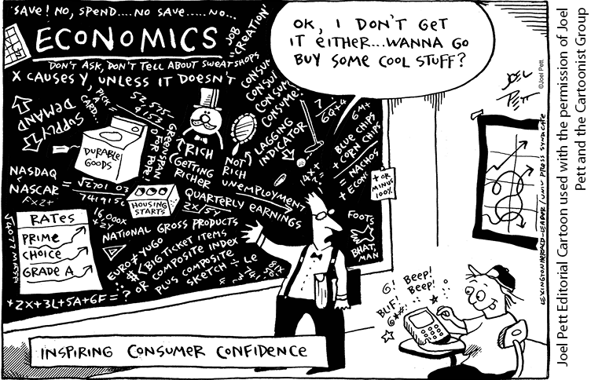
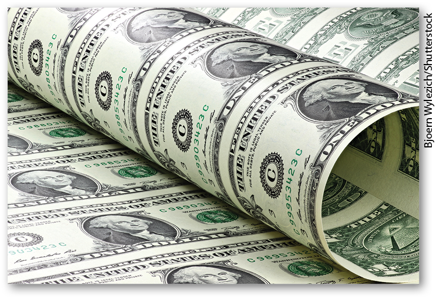
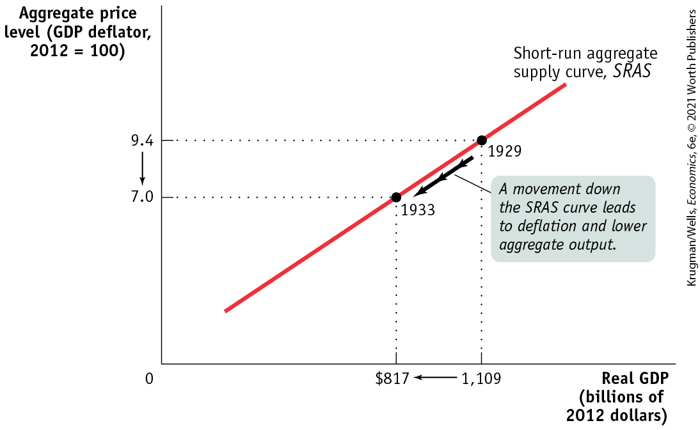
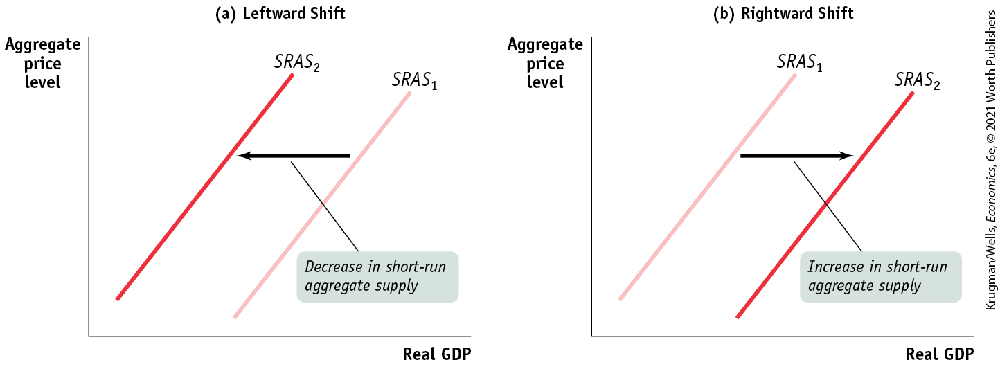
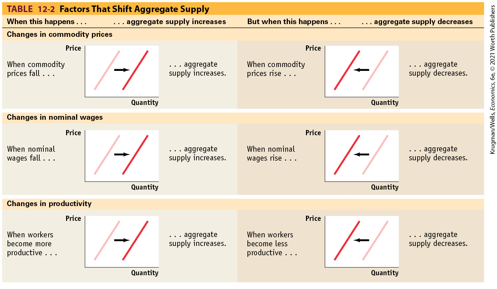

#### Size of the Existing Stock of Physical Capital

<figure id="pau_9781319320164_Jjm9xxZPkh" class="figure lm_img_lightbox unnum c2 right">

</figure>

Firms engage in planned investment spending to add to their stock of physical capital. Their incentive to spend depends in part on how much physical capital they already have: the more they have, the less they will feel a need to add more, other things equal. The same applies to other types of investment spending. For example, if a large number of houses have been built in recent years, this will depress the demand for new houses and, as a result, will also tend to reduce residential investment spending. In fact, that’s part of the reason for the deep slump in residential investment spending that began in 2006. The housing boom of the previous few years had created an oversupply of houses: by spring 2009, the inventory of unsold houses on the market was equal to more than 14 months of sales, and prices of new homes had fallen more than 25% from their peak. This gave the construction industry little incentive to build even more homes.

### Government Policies and Aggregate Demand

One of the key insights of macroeconomics is that the government can have a powerful influence on aggregate demand and that, in some circumstances, this influence can be used to improve economic performance.

<!--
<strong class="important">[12UN05-cartoon] [added late, art ID out of order] [set in margin, no wrap, anywhere in this H2 section]</strong>
--> <!--
[Macro-12UN05&#x2014;cartoon]
-->

The two main ways the government can influence the aggregate demand curve are through fiscal policy and monetary policy. We’ll briefly discuss their influence on aggregate demand, leaving a full-length discussion for upcoming chapters.

#### Fiscal Policy

The use of either government spending — government purchases of final goods and services and government transfers — or tax policy to stabilize the economy is known as fiscal policy. In practice, governments often respond to recessions by increasing spending, cutting taxes, or both. They often respond to inflation by reducing spending or increasing taxes.

The effect of government purchases of final goods and services, *G,* on the aggregate demand curve is *direct* because government purchases are themselves a component of aggregate demand. So an increase in government purchases shifts the aggregate demand curve to the right and a decrease shifts it to the left. History’s most dramatic example of how increased government purchases affect aggregate demand was the effect of wartime government spending during World War II.

<figure id="pau_9781319320164_9FPBALb1MC" class="figure lm_img_lightbox unnum c2 right">

</figure>

Because of the war, U.S. federal purchases surged 400%. This increase in purchases is usually credited with ending the Great Depression. In the 1990s Japan used large public works projects — such as government-financed construction of roads, bridges, and dams — in an effort to increase aggregate demand in the face of a slumping economy. Similarly, in 2009, in the wake of the Great Recession, the United States began spending more than \$100 billion on infrastructure projects such as improving highways, bridges, public transportation, and more, to stimulate overall spending.

In contrast, changes in either tax rates or government transfers influence the economy *indirectly* through their effect on disposable income. A lower tax rate means that consumers get to keep more of what they earn, increasing their disposable income. An increase in government transfers also increases consumers’ disposable income. In either case, this increases consumer spending and shifts the aggregate demand curve to the right. A higher tax rate or a reduction in transfers reduces the amount of disposable income received by consumers. This reduces consumer spending and shifts the aggregate demand curve to the left.

<!--
<strong class="important">[AU: Review this paragraph Ryan added.]</strong>
-->

During the onset of the coronavirus pandemic in 2020, many businesses closed, requiring the federal government to implement an unprecedented economic relief package. It included transfer payments through unemployment insurance for those laid off and a one-time tax rebate of \$1,200 to individuals earning less than \$75,000 with an extra \$500 per child dependent. These measures were designed to stabilize consumer spending, preventing a further decline in aggregate demand, minimizing the economic shock from the virus.

#### Monetary Policy

<!--
<strong class="important">[AU: If we tweak CO, edit this first sentence.]</strong>
-->

We opened this chapter by talking about the problems faced by the Federal Reserve in 2011. The Fed controls monetary policy — the use of changes in the quantity of money or the interest rate to stabilize the economy. We’ve just discussed how a rise in the aggregate price level, by reducing the purchasing power of money holdings, causes a rise in the interest rate. That, in turn, reduces both investment spending and consumer spending.

But what happens if the quantity of money in the hands of households and firms changes? In modern economies, the quantity of money in circulation is largely determined by the decisions of a *central bank* created by the government. As we’ll learn in <a href="#kru_9781319245269_ch14_01.xhtml#pau_9781319320164_kfN9Q68LJR" id="kru_9781319245269_ch12_02.xhtml#pau_9781319320164_IWJDhwSuXc" class="crossref">Chapter 14</a>, the Federal Reserve, the U.S. central bank, is a special institution that is neither exactly part of the government nor exactly a private institution. When the central bank increases the quantity of money in circulation, households and firms have more money, which they are willing to lend out. The effect is to drive the interest rate down at any given aggregate price level, leading to higher investment spending and higher consumer spending.

That is, increasing the quantity of money shifts the aggregate demand curve to the right. Reducing the quantity of money has the opposite effect: households and firms have fewer money holdings than before, leading them to borrow more and lend less. This raises the interest rate, reduces investment spending and consumer spending, and shifts the aggregate demand curve to the left.

<!--
<strong class="important">[Start EIA] [NOTE: EIA runs in exactly as shown in MS. It DOES NOT float. ALL SUCH.]</strong>
-->

### ECONOMICS \>\> *in Action*

Moving Along the Aggregate Demand Curve, 1979–1980

When looking at data, it’s often hard to distinguish between changes in spending that represent *movements along* the aggregate demand curve and those that represent *shifts of* the aggregate demand curve. One telling exception, however, is what happened right after the oil crisis of 1979. Faced with a sharp increase in the aggregate price level — the rate of consumer price inflation reached 14.8% in March of 1980 — the Fed stuck to a policy of increasing the quantity of money slowly. The aggregate price level was rising steeply, but the quantity of money circulating in the economy was growing slowly. The net result was that the purchasing power of the quantity of money in circulation fell.

<!--
[Macro-12UN02]
-->

<figure id="pau_9781319320164_ksI3qfidhe" class="figure lm_img_lightbox unnum c2 right">

<figcaption>
During the 1979 oil crisis, the interest rate effect from a rise in the aggregate price level pushed the economy up the <em>AD</em> curve, leading to a fall in aggregate output.
</figcaption>
</figure>

This led to an increase in the demand for borrowing and a surge in interest rates. The *prime rate,* which is the interest rate banks charge their best customers, climbed above 20%. High interest rates, in turn, caused both consumer spending and investment spending to fall: in 1980 purchases of durable consumer goods like cars fell by 5.3% and real investment spending fell by 8.9%.

In other words, in 1979–1980 the economy responded just as we’d expect if it were moving upward along the aggregate demand curve from right to left: due to the wealth effect and the interest rate effect of a change in the aggregate price level, the quantity of aggregate output demanded fell as the aggregate price level rose. This does not explain, of course, why the aggregate price level rose. But as we’ll see in the upcoming section on the *AD–AS* model, the answer to that question lies in the behavior of the *short-run aggregate supply curve.*

<!--
<strong class="important">[End EIA] [Note: Quick Review and Check Your Understanding position exactly where shown in MS. They do not float. ALL SUCH. See layouts for recto/verso design differences.]</strong>
-->

### \>\> *Quick Review*

- The **aggregate demand curve** is downward sloping because of the **wealth effect of a change in the aggregate price level** and the **interest rate effect of a change in the aggregate price level.**
- The aggregate demand curve shows how income–expenditure equilibrium GDP changes when the aggregate price level changes.
- Changes in consumer spending caused by changes in wealth and expectations about the future shift the aggregate demand curve. Changes in investment spending caused by changes in expectations and by the size of the existing stock of physical capital also shift the aggregate demand curve.
- Fiscal policy affects aggregate demand directly through government purchases and indirectly through changes in taxes or government transfers. Monetary policy affects aggregate demand indirectly through changes in the interest rate.

### \>\> *Check Your Understanding* 12-1

1.  Determine the effect on aggregate demand of each of the following events. Explain whether it represents a movement along the aggregate demand curve (up or down) or a shift of the curve (leftward or rightward).
    1.  A rise in the interest rate caused by a change in monetary policy
    2.  A fall in the real value of money in the economy due to a higher aggregate price level
    3.  News of a worse-than-expected job market next year
    4.  A fall in tax rates
    5.  A rise in the real value of assets in the economy due to a lower aggregate price level
    6.  A rise in the real value of assets in the economy due to a surge in real estate values

## Aggregate Supply

Between 1929 and 1933, there was a sharp fall in aggregate demand — a reduction in the quantity of goods and services demanded at any given price level. One consequence of the economy-wide decline in demand was a fall in the prices of most goods and services. By 1933, the GDP deflator (one of the price indexes we defined in <a href="#kru_9781319245269_ch07_01.xhtml#pau_9781319320164_J4fyDEWkvv" id="kru_9781319245269_ch12_03.xhtml#pau_9781319320164_4Zp1ONCM83" class="crossref">Chapter 7</a>) was 26% below its 1929 level, and other indexes were down by similar amounts. A second consequence was a decline in the output of most goods and services: by 1933, real GDP was 27% below its 1929 level. A third consequence, closely tied to the fall in real GDP, was a surge in the unemployment rate from 3% to 25%.

The association between the plunge in real GDP and the plunge in prices wasn’t an accident. Between 1929 and 1933, the U.S. economy was moving down its <a href="#kru_9781319245269_EM_glossary.xhtml#pau_9781319320164_PayTwcK15M" id="kru_9781319245269_ch12_03.xhtml#pau_9781319320164_KFD6lMp1bI" class="glossref" role="doc-glossref">aggregate supply curve</a>, which shows the relationship between the economy’s aggregate price level (the overall price level of final goods and services in the economy) and the total quantity of final goods and services, or aggregate output, producers are willing to supply. (As you will recall, we use real GDP to measure aggregate output. So we’ll often use the two terms interchangeably.) More specifically, between 1929 and 1933 the U.S. economy moved down its *short-run aggregate supply curve.*

<aside aria-label="title 1" class="glossary c3 main-flow v1" epub:type="glossary" id="pau_9781319320164_ZtgvqKnTwn">

**aggregate supply curve**  
The **aggregate supply curve** shows the relationship between the aggregate price level and the quantity of aggregate output supplied in the economy.

</aside>

### The Short-Run Aggregate Supply Curve

The period from 1929 to 1933 demonstrated that there is a positive relationship in the short run between the aggregate price level and the quantity of aggregate output supplied. That is, a rise in the aggregate price level is associated with a rise in the quantity of aggregate output supplied, other things equal; a fall in the aggregate price level is associated with a fall in the quantity of aggregate output supplied, other things equal. To understand why this positive relationship exists, consider the most basic question facing a producer: is producing a unit of output profitable or not? Let’s define profit per unit: 

<!--
<strong class="important">[COMP: Align Profit and Price. Will have to be set on two lines like Macro 5e, p. 354.]</strong>
-->

$$\begin{array}{l}
{\text{Profit~per~unit~of~output~} =} \\
\text{Price~per~unit~of~output~−~Production~cost~per~unit~of~output}
\end{array}$$

**(12-2)**

Thus, the answer to the question depends on whether the price the producer receives for a unit of output is greater than or less than the cost of producing that unit of output. At any given point in time, many of the costs producers face are fixed per unit of output and can’t be changed for an extended period of time. Typically, the largest source of inflexible production cost is the wages paid to workers. *Wages* here refers to all forms of worker compensation, such as employer-paid health care and retirement benefits in addition to earnings.

Wages are typically an inflexible production cost because the dollar amount of any given wage paid, called the <a href="#kru_9781319245269_EM_glossary.xhtml#pau_9781319320164_GP7rgapJMs" id="kru_9781319245269_ch12_03.xhtml#pau_9781319320164_K7uHNEk4o8" class="glossref" role="doc-glossref">nominal wage</a>, is often determined by contracts that were signed some time ago. And even when there are no formal contracts, there are often informal agreements between management and workers, making companies reluctant to change wages in response to economic conditions. For example, companies usually will not reduce wages during poor economic times — unless the downturn has been particularly long and severe — for fear of generating worker resentment. Correspondingly, they typically won’t raise wages during better economic times — until they are at risk of losing workers to competitors — because they don’t want to encourage workers to routinely demand higher wages.

<aside aria-label="title 2" class="glossary c3 main-flow v1" epub:type="glossary" id="pau_9781319320164_s4lKpPU1wZ">

**nominal wage**  
The **nominal wage** is the dollar amount of the wage paid.

</aside>

As a result of both formal and informal agreements, then, the economy is characterized by <a href="#kru_9781319245269_EM_glossary.xhtml#pau_9781319320164_qqcvCNKyoA" id="kru_9781319245269_ch12_03.xhtml#pau_9781319320164_BZlmxcltQC" class="glossref" role="doc-glossref">sticky wages</a>: nominal wages that are slow to fall even in the face of high unemployment and slow to rise even in the face of labor shortages. It’s important to note, however, that nominal wages cannot be sticky forever: ultimately, formal contracts and informal agreements will be renegotiated to take into account changed economic circumstances. As the upcoming For Inquiring Minds explains, how long it takes for nominal wages to become flexible is an integral component of what distinguishes the short run from the long run.

<aside aria-label="title 3" class="glossary c3 main-flow v1" epub:type="glossary" id="pau_9781319320164_CmNu6mhnQM">

**sticky wages**  
**Sticky wages** are nominal wages that are slow to fall even in the face of high unemployment and slow to rise even in the face of labor shortages.

</aside>

To understand how the fact that many costs are fixed in nominal terms gives rise to an upward-sloping short-run aggregate supply curve, it’s helpful to know that prices are set somewhat differently in different kinds of markets. In *perfectly competitive markets,* producers take prices as given; in *imperfectly competitive markets,* producers have some ability to choose the prices they charge. In both kinds of markets, there is a short-run positive relationship between prices and output, but for slightly different reasons.

Let’s start with the behavior of producers in perfectly competitive markets; remember, they take the price as given. Imagine that, for some reason, the aggregate price level falls, which means that the price received by the typical producer of a final good or service falls. Because many production costs are fixed in the short run, production cost per unit of output doesn’t fall by the same proportion as the fall in the price of output. So the profit per unit of output declines, leading perfectly competitive producers to reduce the quantity supplied in the short run.

On the other hand, suppose that for some reason the aggregate price level rises. As a result, the typical producer receives a higher price for its final good or service. Again, many production costs are fixed in the short run, so production cost per unit of output doesn’t rise by the same proportion as the rise in the price of a unit. And since the typical perfectly competitive producer takes the price as given, profit per unit of output rises and output increases.

Now consider an imperfectly competitive producer that is able to set its own price. If there is a rise in the demand for this producer’s product, it will be able to sell more at any given price. Given stronger demand for its products, it will probably choose to increase its prices as well as its output, as a way of increasing profit per unit of output. In fact, industry analysts often talk about variations in an industry’s *pricing power:* when demand is strong, firms with pricing power are able to raise prices — and they do.

Conversely, if there is a fall in demand, firms will normally try to limit the fall in their sales by cutting prices.

Both the responses of firms in perfectly competitive industries and those of firms in imperfectly competitive industries lead to an upward-sloping relationship between aggregate output and the aggregate price level. The positive relationship between the aggregate price level and aggregate output in the short run is illustrated by an upward-sloping <a href="#kru_9781319245269_EM_glossary.xhtml#pau_9781319320164_NaN7kmNsO7" id="kru_9781319245269_ch12_03.xhtml#pau_9781319320164_o970ITha8U" class="glossref" role="doc-glossref">short-run aggregate supply curve</a>. Along this curve, producers are willing to supply final goods and services during the time period when many production costs, particularly nominal wages, can be taken as fixed. <a href="#kru_9781319245269_ch12_03.xhtml#pau_9781319320164_B1TcEAwzNA" id="kru_9781319245269_ch12_03.xhtml#pau_9781319320164_opE1NaTqaE" class="crossref">Figure 12-5</a> shows a hypothetical short-run aggregate supply curve, *SRAS,* that matches actual U.S. data for 1929 and 1933. On the horizontal axis is aggregate output (or, equivalently, real GDP) — the total quantity of final goods and services supplied in the economy — measured in 2012 dollars. On the vertical axis is the aggregate price level as measured by the GDP deflator, with the value for the year 2012 equal to 100. In 1929, the aggregate price level was 9.4 and real GDP was \$1,109 billion. In 1933, the aggregate price level was 7.0 and real GDP was only \$817 billion. The movement down the *SRAS* curve corresponds to the deflation and fall in aggregate output experienced over those years.

<aside aria-label="title 4" class="glossary c3 main-flow v1" epub:type="glossary" id="pau_9781319320164_eF3OIi1Ca5">

**short-run aggregate supply curve**  
The **short-run aggregate supply curve** shows the relationship between the aggregate price level and the quantity of aggregate output supplied that exists in the short run, the time period when many production costs can be taken as fixed.

</aside>

<figure id="pau_9781319320164_B1TcEAwzNA" class="figure lm_img_lightbox num c3 main-flow">

<figcaption>
FIGURE 12-5 The Short-Run Aggregate Supply Curve

The short-run aggregate supply curve shows the relationship between the aggregate price level and the quantity of aggregate output supplied in the short run, the period in which many production costs such as nominal wages are fixed. It is upward sloping because a higher aggregate price level leads to higher profit per unit of output and higher aggregate output given fixed nominal wages. Here we show numbers corresponding to early in the Great Depression, from 1929 to 1933. When deflation occurred and the aggregate price level fell from 9.4 (in 1929) to 7.0 (in 1933), firms responded by reducing the quantity of aggregate output supplied from $1,109 billion to $817 billion measured in 2012 dollars.
</figcaption>
</figure>

<aside class="hidden" id="pau_9781319320164_iCS55ohNFR" title="hidden">

The vertical axis labeled Aggregate price level (G D P deflator, 2012 equals 100) shows markings at 7 and 9.4, from bottom to top. The horizontal axis labeled Real G D P (billions of 2012 dollars) shows markings at 817 and 1,109 dollars, from left to right. A positive sloping straight line, labeled Short-run aggregate supply curve S R A S, passes through a point labeled 1933 at (817, 7) and a point labeled 1929 at (1,109, 9.4). An arrow pointing from 1929 to 1933, is labeled, “A movement down the S R A S curve leads to deflation and lower aggregate output.” A leftward arrow is from 1,109 to 817 dollars on the horizontal axis, and a downward arrow is from 9.4 to 7 on the vertical axis.

</aside>
<!--
<strong class="important">[Start FIM Box; position near here]</strong>
-->
<aside class="case-study c3 main-flow v1" epub:type="case-study" id="pau_9781319320164_Q5MBEqkNg8" title="For Inquiring Minds">

#### For inquiring minds

What’s Truly Flexible, What’s Truly Sticky

Most macroeconomists agree that the picture shown in <a href="#kru_9781319245269_ch12_03.xhtml#pau_9781319320164_B1TcEAwzNA" id="kru_9781319245269_ch12_03.xhtml#pau_9781319320164_1mPhaXE1fn" class="crossref">Figure 12-5</a> is correct: there is, other things equal, a positive short-run relationship between the aggregate price level and aggregate output. But many would argue that the details are a bit more complicated.

So far we’ve stressed a difference in the behavior of the aggregate price level and the behavior of nominal wages. That is, we’ve said that the aggregate price level is flexible but nominal wages are sticky in the short run. Although this assumption is a good way to explain why the short-run aggregate supply curve is upward sloping, empirical data on wages and prices don’t wholly support a sharp distinction between flexible prices of final goods and services and sticky nominal wages.

On one side, some nominal wages are in fact flexible even in the short run because some workers are not covered by a contract or informal agreement with their employers. Since some nominal wages are sticky but others are flexible, we observe that the *average nominal wage* — the nominal wage averaged over all workers in the economy — falls when there is a steep rise in unemployment. For example, nominal wages fell substantially in the early years of the Great Depression.

On the other side, some prices of final goods and services are sticky rather than flexible. For example, some firms, particularly the makers of luxury or name-brand goods, are reluctant to cut prices even when demand falls. Instead they prefer to cut output even if their profit per unit hasn’t declined.

These complications, as we’ve said, don’t change the basic picture. When the aggregate price level falls, some producers cut output because the nominal wages they pay are sticky. And some producers don’t cut their prices in the face of a falling aggregate price level, preferring instead to reduce their output. In both cases, the positive relationship between the aggregate price level and aggregate output is maintained. So, in the end, the short-run aggregate supply curve is still upward sloping.

</aside>
<!--
<strong class="important">[End FIM Box]</strong>
-->

### Shifts of the Short-Run Aggregate Supply Curve

<a href="#kru_9781319245269_ch12_03.xhtml#pau_9781319320164_B1TcEAwzNA" id="kru_9781319245269_ch12_03.xhtml#pau_9781319320164_PnDkRziv90" class="crossref">Figure 12-5</a> shows a *movement along* the short-run aggregate supply curve, as the aggregate price level and aggregate output fell from 1929 to 1933. But there can also be *shifts of* the short-run aggregate supply curve, as shown in <a href="#kru_9781319245269_ch12_03.xhtml#pau_9781319320164_apqWfvjMc0" id="kru_9781319245269_ch12_03.xhtml#pau_9781319320164_lLqieby3U5" class="crossref">Figure 12-6</a>. Panel (a) shows a *decrease in short-run aggregate supply* — a leftward shift of the short-run aggregate supply curve. Aggregate supply decreases when producers reduce the quantity of aggregate output they are willing to supply at any given aggregate price level. Panel (b) shows an *increase in short-run aggregate supply* — a rightward shift of the short-run aggregate supply curve. Aggregate supply increases when producers increase the quantity of aggregate output they are willing to supply at any given aggregate price level.

<figure id="pau_9781319320164_apqWfvjMc0" class="figure lm_img_lightbox num c4 main-flow">

<figcaption>
FIGURE 12-6 Shifts of the Short-Run Aggregate Supply Curve

Panel (a) shows a decrease in short-run aggregate supply: the short-run aggregate supply curve shifts leftward from <em>S</em><em>R</em><em>A</em><em>S</em>1 to <em>S</em><em>R</em><em>A</em><em>S</em>2, and the quantity of aggregate output supplied at any given aggregate price level falls. Panel (b) shows an increase in short-run aggregate supply: the short-run aggregate supply curve shifts rightward from <em>S</em><em>R</em><em>A</em><em>S</em>1 to <em>S</em><em>R</em><em>A</em><em>S</em>2, and the quantity of aggregate output supplied at any given aggregate price level rises.
</figcaption>
</figure>

<aside class="hidden" id="pau_9781319320164_iKpuKJigWp" title="hidden">

Graph (a) Leftward Shift: The vertical axis is labeled Aggregate price level, and the horizontal axis is labeled Real G D P. Two positive sloping parallel straight lines are labeled S R A S subscript 2 and S R A S subscript 1, from left to right. A leftward arrow between the two lines is labeled, “Decrease in short-run aggregate supply.” Graph (b) Rightward Shift: The vertical axis is labeled Aggregate price level, and the horizontal axis is labeled Real G D P. Two positive sloping parallel straight lines are labeled S R A S subscript 1 and S R A S subscript 2, from left to right. A rightward arrow between the two lines is labeled, “Increase in short-run aggregate supply.”

</aside>

To understand why the short-run aggregate supply curve can shift, it’s important to recall that producers make output decisions based on their profit per unit of output. The short-run aggregate supply curve illustrates the relationship between the aggregate price level and aggregate output: because some production costs are fixed in the short run, a change in the aggregate price level leads to a change in producers’ profit per unit of output and, in turn, leads to a change in aggregate output.

But other factors besides the aggregate price level can affect profit per unit and, in turn, aggregate output. It is changes in these other factors that will shift the short-run aggregate supply curve.

To develop some intuition, suppose that something happens that raises production costs — say, an increase in the price of oil. At any given price of output, a producer now earns a smaller profit per unit of output. As a result, producers reduce the quantity supplied at any given aggregate price level, and the short-run aggregate supply curve shifts to the left. If, in contrast, something happens that lowers production costs — say, a fall in the nominal wage — a producer now earns a higher profit per unit of output at any given price of output. This leads producers to increase the quantity of aggregate output supplied at any given aggregate price level, and the short-run aggregate supply curve shifts to the right.

Now we’ll discuss some of the important factors that affect producers’ profit per unit and so can lead to shifts of the short-run aggregate supply curve. These factors include changes in commodity prices, changes in nominal wages, and changes in productivity.

#### Changes in Commodity Prices

<!--
<strong class="important">[AU: Edit this first sentence if CO is changed.]</strong>
-->

In the opening story, we saw how the views of Jean-Claude Trichet, the president of the ECB, were shaped by the high inflation of the 1970s. The origins of that inflationary period lay in a sharp and sustained increase in the price of a very important commodity — oil. The high price of oil sharply raised costs for producers around the world.

A *commodity* is a standardized input bought and sold in bulk quantities. An increase in the price of a commodity, such as oil, raises production costs across the economy and reduces the quantity of aggregate output supplied at any given aggregate price level. This shifts the aggregate supply curve to the left. Conversely, a decline in commodity prices reduces production costs, leading to an increase in the quantity supplied at any given aggregate price level and a rightward shift of the short-run aggregate supply curve.

Why isn’t the influence of commodity prices already captured by the short-run aggregate supply curve? Because commodities — unlike, say, soft drinks — are not a final good. Hence their prices are not included in the calculation of the aggregate price level. Further, commodities represent a significant cost of production to most suppliers, just like nominal wages do. So changes in commodity prices have large impacts on production costs. And in contrast to noncommodities, the prices of commodities can sometimes change drastically due to industry-specific shocks to supply — such as wars in the Middle East or rising Chinese demand that leaves less oil for the United States.

#### Changes in Nominal Wages

At any given point in time, the dollar wages of many workers are fixed because they are set by contracts or informal agreements made in the past. Nominal wages can change, however, once enough time has passed for contracts and informal agreements to be renegotiated.

Suppose, for example, that there is an economy-wide rise in the cost of health care insurance premiums paid by employers as part of employees’ wages. From the employers’ perspective, this is equivalent to a rise in nominal wages because it is an increase in employer-paid compensation. So this rise in nominal wages increases production costs and shifts the short-run aggregate supply curve to the left.

Conversely, suppose there is an economy-wide fall in the cost of such premiums. This is equivalent to a fall in nominal wages from the point of view of employers; it reduces production costs and shifts the short-run aggregate supply curve to the right.

An important historical fact is that during the 1970s the surge in the price of oil had the indirect effect of also raising nominal wages. This “knock-on” effect occurred because many wage contracts included *cost-of-living allowances* that automatically raised the nominal wage when consumer prices increased. Through this channel, the surge in the price of oil — which led to an increase in overall consumer prices — ultimately caused a rise in nominal wages.

So the economy, in the end, experienced two leftward shifts of the aggregate supply curve: the first generated by the initial surge in the price of oil, the second generated by the induced increase in nominal wages. The negative effect on the economy of rising oil prices was greatly magnified through the cost-of-living allowances in wage contracts. Today, cost-of-living allowances in wage contracts are rare.

#### Changes in Productivity

An increase in productivity means that a worker can produce more units of output with the same quantity of inputs. For example, the introduction of bar-code scanners in retail stores greatly increased the ability of a single worker to stock, inventory, and resupply store shelves. As a result, the cost to a store of “producing” a dollar of sales fell, profit rose, and the quantity supplied increased. (Think of Walmart and the increase in the number of its stores as an increase in aggregate supply.) So a rise in productivity, whatever the source, increases producers’ profits per unit produced and shifts the short-run aggregate supply curve to the right.

Conversely, a fall in productivity — say, due to new regulations that require workers to spend more time filling out forms — reduces the number of units of output a worker can produce with the same quantity of inputs. Consequently, the cost per unit of output rises, leading to a fall in profit per unit produced, and a fall in quantity supplied, shifting the short-run aggregate supply curve to the left.

For a summary of the factors that shift the short-run aggregate supply curve, see <a href="#kru_9781319245269_ch12_03.xhtml#pau_9781319320164_rI5Swjr5s2" id="kru_9781319245269_ch12_03.xhtml#pau_9781319320164_FgpdkUMeHo" class="crossref">Table 12-2</a>.

<!--
<strong class="important">[Comp: place table on same spread as callout, without breaking it</strong>.]
--> <!--
[Table 12-2 is from Macro5e p. 359]
-->

<figure id="pau_9781319320164_rI5Swjr5s2" class="figure lm_img_lightbox unnum c4 main-flow">

</figure>

<aside class="hidden" id="pau_9781319320164_MxOIfCsP6R" title="hidden">

The column headings are as follows, When this happens ellipsis, aggregate supply increases and But when this happens ellipsis, aggregate supply decreases. Each graph under the columns plots price on the vertical axis and quantity on the horizontal axis. The first row, titled Changes in commodity prices has two graphs: A graph under column 1 has two positive sloping parallel lines, with a rightward arrow between them. Text beside the graph reads, “When commodity prices fall, aggregate supply increases.” A graph under column 2 has two positive sloping parallel lines, with a leftward arrow between them. Text beside the graph reads, “When commodity prices rise, aggregate supply decreases.” The second row, titled Changes in nominal wages has two graphs: A graph under column 1 has two positive sloping parallel lines, with a rightward arrow between them. Text beside the graph reads, “When nominal wages fall, aggregate supply increases.” A graph under column 2 has two positive sloping parallel lines, with a leftward arrow between them. Text beside the graph reads, “When nominal wages rise, aggregate supply decreases.” The third row, titled Changes in productivity has two graphs: A graph under column 1 has two positive sloping parallel lines, with a rightward arrow between them. Text beside the graph reads, “When workers become more productive, aggregate supply increases.” A graph under column 2 has two positive sloping parallel lines, with a leftward arrow between them. Text beside the graph reads, “When workers become less productive, aggregate supply decreases.”

</aside>
