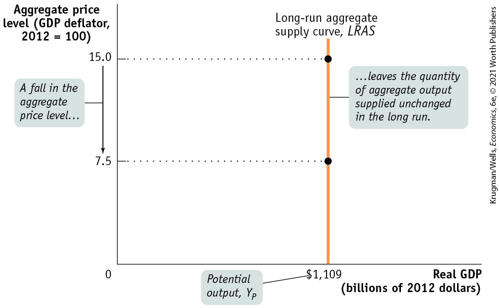
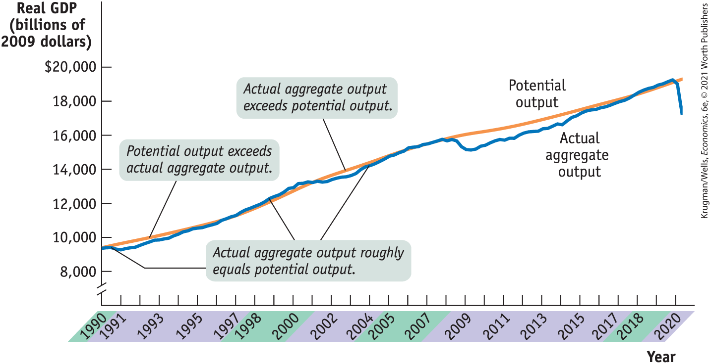
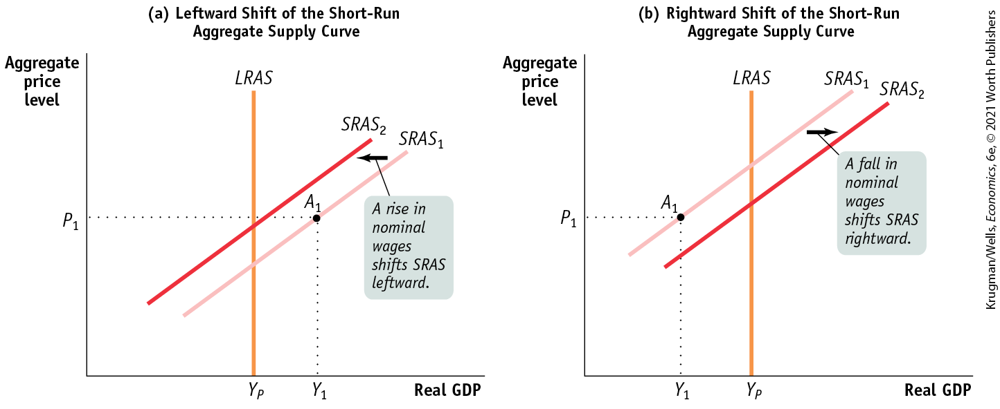
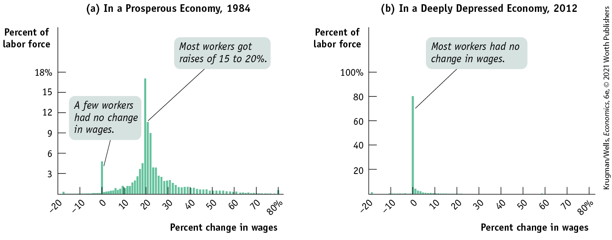
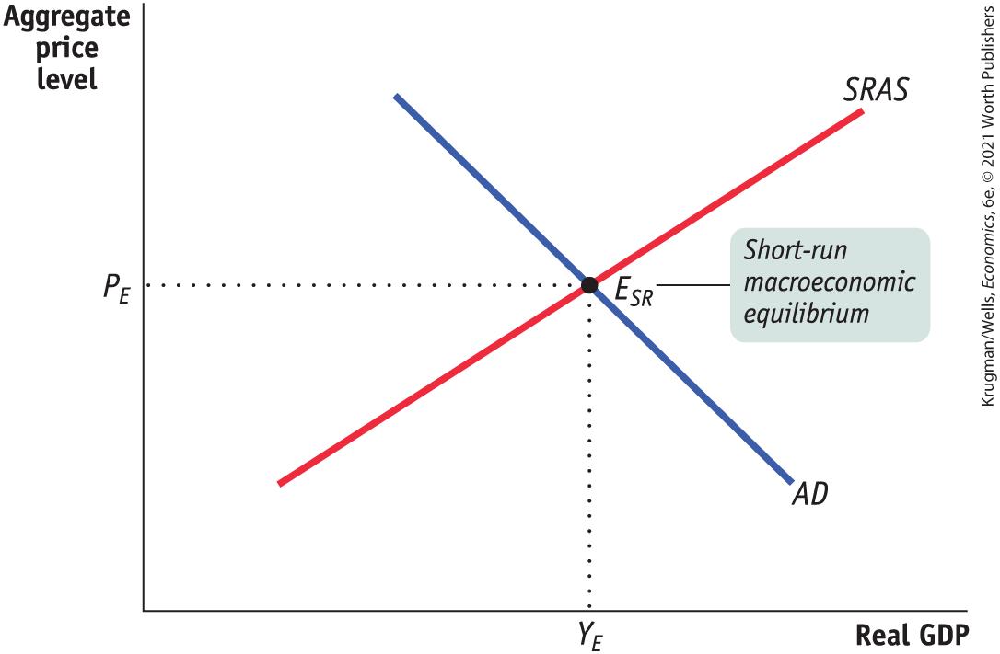

### The Long-Run Aggregate Supply Curve

We’ve just seen that in the short run a fall in the aggregate price level leads to a decline in the quantity of aggregate output supplied because nominal wages are sticky in the short run. But, as mentioned earlier, contracts and informal agreements are renegotiated in the long run. So in the long run, nominal wages will fully adjust to changes in the aggregate price level (they are flexible, not sticky). This fact greatly alters the long-run relationship between the aggregate price level and aggregate supply. In fact, in the long run, the aggregate price level has *no* effect on the quantity of aggregate output supplied.

To see why, let’s conduct a thought experiment. Imagine that you could wave a magic wand — or maybe a magic bar-code scanner — and cut *all prices* in the economy in half at the same time. By “all prices” we mean the prices of all inputs, including nominal wages, as well as the prices of final goods and services. What would happen to aggregate output, given that the aggregate price level has been halved and all input prices, including nominal wages, have been halved?

The answer is: nothing. Consider <a href="#kru_9781319245269_ch12_03.xhtml#pau_9781319320164_CQF8JIEaS0" id="kru_9781319245269_ch12_03.xhtml#pau_9781319320164_VzboccUVAE" class="crossref">Equation 12-2</a> again: each producer would receive a lower price for its product, but costs would fall by the same proportion. As a result, every unit of output profitable to produce before the change in prices would still be profitable to produce after the change in prices. So a halving of *all* prices in the economy has no effect on the economy’s aggregate output. In other words, changes in the aggregate price level now have no effect on the quantity of aggregate output supplied.

In reality, of course, no one can change all prices by the same proportion at the same time. But now, we’ll consider the *long run, the period of time in which all prices, including production costs such as nominal wages, are fully flexible.* In the long run, inflation or deflation has the same effect as someone changing all prices by the same proportion. *As a result, changes in the aggregate price level do not change the quantity of aggregate output supplied in the long run.* That’s because changes in the aggregate price level, which is composed of prices of final goods and services, will be accompanied by equal proportional changes in *all* input prices, including nominal wages.

The <a href="#kru_9781319245269_EM_glossary.xhtml#pau_9781319320164_WGZAtXuqGb" id="kru_9781319245269_ch12_03.xhtml#pau_9781319320164_Cc8LMbW85j" class="glossref" role="doc-glossref">long-run aggregate supply curve</a>, illustrated in <a href="#kru_9781319245269_ch12_03.xhtml#pau_9781319320164_XDD13VoXSq" id="kru_9781319245269_ch12_03.xhtml#pau_9781319320164_CPisxYfWkg" class="crossref">Figure 12-7</a> by the curve *LRAS,* shows the relationship between the aggregate price level and the quantity of aggregate output supplied that holds when all prices, including nominal wages, are fully flexible. The long-run aggregate supply curve is vertical because changes in the aggregate price level have *no* effect on aggregate output in the long run. At an aggregate price level of 15.0, the quantity of aggregate output supplied is \$1,109 billion in 2012 dollars. If the aggregate price level falls by 50% to 7.5, the quantity of aggregate output supplied is unchanged in the long run at \$1,109 billion in 2012 dollars.

<aside aria-label="title 5" class="glossary c3 main-flow v1" epub:type="glossary" id="pau_9781319320164_kvLz1yQcwX">

**long-run aggregate supply curve**  
The **long-run aggregate supply curve** shows the relationship between the aggregate price level and the quantity of aggregate output supplied that would exist if all prices, including nominal wages, were fully flexible.

</aside>

<figure id="pau_9781319320164_XDD13VoXSq" class="figure lm_img_lightbox num c3 main-flow">

<figcaption>
FIGURE 12-7 The Long-Run Aggregate Supply Curve

The long-run aggregate supply curve shows the quantity of aggregate output supplied when all prices, including nominal wages, are flexible. It is vertical at potential output, <strong><em>Y</em><em>P</em></strong>, because in the long run a change in the aggregate price level has no effect on the quantity of aggregate output supplied.
</figcaption>
</figure>

<aside class="hidden" id="pau_9781319320164_OaKS9o463r" title="hidden">

The vertical axis, labeled Aggregate price level (G D P deflator, 2012 equals 100) ranges from 0 to 15, in increments of 7.5. The horizontal axis, labeled Real G D P (billions of 2012 dollars) shows markings at 0 and 1,109 dollars, from left to right. A straight vertical line, representing Long-run aggregate supply curve L R A S, starts at (1,109, 0) and passes through the points (1,109, 7.5) and (1,109, 15). The line is labeled, “ellipsis leaves the quantity of aggregate output supplied unchanged in the long run.” The marking 1,109 dollars on the horizontal axis is labeled, “Potential output, Y subscript P.” An arrow pointing from 15 to 7.5 on the vertical axis is labeled, “A fall in the aggregate price level ellipsis.”

</aside>

It’s important to understand not only that the *LRAS* curve is vertical but also that its position along the horizontal axis represents a significant measure. The horizontal intercept in <a href="#kru_9781319245269_ch12_03.xhtml#pau_9781319320164_XDD13VoXSq" id="kru_9781319245269_ch12_03.xhtml#pau_9781319320164_nxmv2jXscQ" class="crossref">Figure 12-7</a>, where *LRAS* touches the horizontal axis (\$1,109 billion in 2009 dollars), is the economy’s <a href="#kru_9781319245269_EM_glossary.xhtml#pau_9781319320164_LhuzPhswJk" id="kru_9781319245269_ch12_03.xhtml#pau_9781319320164_Y2iF8wAprT" class="glossref" role="doc-glossref">potential output</a>, *YP*; the level of real GDP the economy would produce if all prices, including nominal wages, were fully flexible.

<aside aria-label="title 6" class="glossary c3 main-flow v1" epub:type="glossary" id="pau_9781319320164_3QcEriYVTL">

**potential output**  
**Potential output** is the level of real GDP the economy would produce if all prices, including nominal wages, were fully flexible.

</aside>

In reality, the actual level of real GDP is almost always either above or below potential output. We’ll see why later in this chapter, when we discuss the *AD–AS* model. Still, an economy’s potential output is an important number because it defines the trend around which actual aggregate output fluctuates from year to year.

In the United States, the Congressional Budget Office, or CBO, estimates annual potential output for the purpose of federal budget analysis. In <a href="#kru_9781319245269_ch12_03.xhtml#pau_9781319320164_7EjGgEx8t4" id="kru_9781319245269_ch12_03.xhtml#pau_9781319320164_9RCOxcV9E5" class="crossref">Figure 12-8</a>, the CBO’s estimates of U.S. potential output from 1990 to 2020 are represented by the orange line and the actual values of U.S. real GDP over the same period are represented by the blue line. Years shaded purple on the horizontal axis correspond to periods in which actual aggregate output fell short of potential output; years shaded green correspond to periods in which actual aggregate output exceeded potential output.

<!--
[AU: Update figure 12-8 in pages if real recession occurs.]
-->

<figure id="pau_9781319320164_7EjGgEx8t4" class="figure lm_img_lightbox num c3 main-flow">

<figcaption>
FIGURE 12-8 Actual and Potential Output, 1990 to 2020

This figure shows the performance of actual and potential output in the United States from 1990 to 2020. The orange line shows estimates of U.S. potential output, produced by the Congressional Budget Office, and the blue line shows actual aggregate output. The purple-shaded years are periods in which actual aggregate output fell below potential output, and the years shaded green are periods in which actual aggregate output exceeded potential output. As shown, significant shortfalls occurred in the recessions of the early 1990s and after 2000. Actual aggregate output was significantly above potential output in the boom of the late 1990s, and a huge shortfall occurred after the recession of 2007–2009. Another shortfall occurred in the second quarter of 2020, when the coronavirus pandemic caused economic activity to decline at an annualized rate in excess of 30%.

<em>Data from:</em> Congressional Budget Office; Bureau of Economic Analysis; Federal Reserve Bank of St. Louis.
</figcaption>
</figure>

<aside class="hidden" id="pau_9781319320164_fDzKD8j8DX" title="hidden">

The vertical axis, labeled Real G D P (billions of 2009 dollars) is truncated and ranges from 8,000 dollars to 20,000 dollars in increments of 2,000 dollars. The horizontal axis, labeled Year ranges from 1990 to 2020, in increments of 1 year. Two positive sloping curves labeled Potential output and Actual aggregate output. The data are as follows, A curve representing actual aggregate output starts at (1990, 9500) and passes through the approximate points (1992, 9200), (1997, 11000), (2000, 13000), (2002, 12500), (2008, 15500), (2009, 14500), (2012, 15000), (2015, 16000), and (2020, 18000). A curve representing potential output starts at (1990, 9500) and passes through the approximate points (1992, 10000), (1997, 11000), (2001, 12500), (2003, 13500), (2009, 16000), (2012, 16300), (2016, 17000), and (2020, 18000). In 1993, the curve for potential output is labeled, “Potential output exceeds actual aggregate output.” In 1999 and 2004, the curve for actual aggregate output is labeled, “Actual aggregate output roughly equals potential output.” In 2003, curve is labeled, “Actual aggregate output exceeds potential output.” The following years, 1990, 1998 to 2000, 2005 to 2007, and 2018 to 2020, are shaded in a color. The following years, 1991 to 1997, 2001 to 2004, and 2008 to 2017, are shaded in another color.

</aside>

As you can see, U.S. potential output has risen steadily over time — implying a series of rightward shifts of the *LRAS* curve. What has caused these rightward shifts? The answer lies in the factors related to long-run growth that we discussed in <a href="#kru_9781319245269_ch09_01.xhtml#pau_9781319320164_iTpnzadcyz" id="kru_9781319245269_ch12_03.xhtml#pau_9781319320164_rvxeOLIv1T" class="crossref">Chapter 9</a>, such as increases in physical capital and human capital as well as technological progress. Over the long run, as the size of the labor force and the productivity of labor both rise, the level of real GDP that the economy is capable of producing also rises. Indeed, one way to think about long-run economic growth is that it is the growth in the economy’s potential output. We generally think of the long-run aggregate supply curve as shifting to the right over time as an economy experiences long-run growth.

### From the Short Run to the Long Run

As you can see in <a href="#kru_9781319245269_ch12_03.xhtml#pau_9781319320164_7EjGgEx8t4" id="kru_9781319245269_ch12_03.xhtml#pau_9781319320164_ydlHWUqWjw" class="crossref">Figure 12-8</a>, the economy normally produces more or less than potential output: actual aggregate output was below potential output in the early 1990s, above potential output in the late 1990s, below potential output for most of the 2000s, and significantly below potential output after the recession of 2007–2009 and during the coronavirus pandemic. So the economy is normally on its short-run aggregate supply curve — but not on its long-run aggregate supply curve. So why is the long-run curve relevant? Does the economy ever move from the short run to the long run? And if so, how?

<!--
<strong class="important">[Start Pitfalls Box]</strong>
-->
<aside class="case-study c3 main-flow v5" epub:type="case-study" id="pau_9781319320164_CKP5c6P3Ao" title="Pitfalls">

#### *Pitfalls*

WHAT THE LONG RUN REALLY MEANS

We’ve used the term *long run* in two different contexts. In an earlier chapter we focused on *long-run economic growth:* growth that takes place over decades. In this chapter we introduced the *long-run aggregate supply curve,* which depicts the economy’s potential output: the level of aggregate output that the economy would produce if all prices, including nominal wages, were fully flexible. It might seem that we’re using the same term, *long run,* for two different concepts. But we aren’t: these two concepts are really the same thing.

Because the economy always tends to return to potential output in the long run, actual aggregate output *fluctuates around* potential output, rarely getting too far from it. As a result, the economy’s rate of growth over long periods of time — say, decades — is very close to the rate of growth of potential output. And potential output growth is determined by the factors we analyzed in the chapter on long-run economic growth. So that means that the “long run” of long-run growth and the “long run” of the long-run aggregate supply curve coincide.

</aside>
<!--
<strong class="important">[End Pitfalls Box]</strong>
-->

The first step to answering these questions is to understand that the economy is always in one of only two states with respect to the short-run and long-run aggregate supply curves. It can be on both curves simultaneously by being at a point where the curves cross (as in the few years in <a href="#kru_9781319245269_ch12_03.xhtml#pau_9781319320164_7EjGgEx8t4" id="kru_9781319245269_ch12_03.xhtml#pau_9781319320164_s1WksRJlPp" class="crossref">Figure 12-8</a> in which actual aggregate output and potential output roughly coincided). Or it can be on the short-run aggregate supply curve but not the long-run aggregate supply curve (as in the years in which actual aggregate output and potential output *did not* coincide).

But that is not the end of the story. If the economy is on the short-run but not the long-run aggregate supply curve, the short-run aggregate supply curve will shift over time until the economy is at a point where both curves cross — a point where actual aggregate output is equal to potential output.

<a href="#kru_9781319245269_ch12_03.xhtml#pau_9781319320164_krJkmzUnKw" id="kru_9781319245269_ch12_03.xhtml#pau_9781319320164_avPIh99ILL" class="crossref">Figure 12-9</a> illustrates how this process works. In both panels *LRAS* is the long-run aggregate supply curve, $SRAS_{1}$ is the initial short-run aggregate supply curve, and the aggregate price level is at $P_{1}$. In panel (a) the economy starts at the initial production point, $A_{1}$, which corresponds to a quantity of aggregate output supplied, $Y_{1}$, that is higher than potential output, $Y_{P}$. Producing an aggregate output level (such as $Y_{1}$) that is higher than potential output $\text{(}Y_{P}\text{)}$ is possible only because nominal wages haven’t yet fully adjusted upward. Until this upward adjustment in nominal wages occurs, producers are earning high profits and producing a high level of output. But a level of aggregate output higher than potential output means a low level of unemployment. Because jobs are abundant and workers are scarce, nominal wages will rise over time, gradually shifting the short-run aggregate supply curve leftward. Eventually it will be in a new position, such as $SRAS_{2}$. (Later in this chapter, we’ll show where the short-run aggregate supply curve ends up. As we’ll see, that depends on the aggregate demand curve as well.)

<figure id="pau_9781319320164_krJkmzUnKw" class="figure lm_img_lightbox num c4 main-flow">

<figcaption>
FIGURE 12-9 From the Short Run to the Long Run

In panel (a), the initial short-run aggregate supply curve is <em>S</em><em>R</em><em>A</em><em>S</em>1. At the aggregate price level, <em>P</em>1, the quantity of aggregate output supplied, <em>Y</em>1 , exceeds potential output, <em>Y</em><em>P</em>. Eventually, low unemployment will cause nominal wages to rise, leading to a leftward shift of the short-run aggregate supply curve from <em>S</em><em>R</em><em>A</em><em>S</em>1 to <em>S</em><em>R</em><em>A</em><em>S</em>2. In panel (b), the reverse happens: at the aggregate price level, <em>P</em>1, the quantity of aggregate output supplied is less than potential output. High unemployment eventually leads to a fall in nominal wages over time and a rightward shift of the short-run aggregate supply curve.
</figcaption>
</figure>

<aside class="hidden" id="pau_9781319320164_e7AklIalnt" title="hidden">

Graph (a) Leftward Shift of the Short-Run Aggregate Supply Curve: The vertical axis, labeled Aggregate price level shows a marking at P subscript 1. The horizontal axis, labeled Real G D P shows markings at Y subscript P and Y subscript 1, from left to right. A straight vertical line, parallel to the vertical axis, starts from Y subscript P, and is labeled L R A S. Two positive sloping parallel straight lines, labeled S R A S subscript 2 and S R A S subscript 1, intersect L R A S. S R A S subscript 2 is on the left of S R A S subscript 1, and an arrow pointing from S R A S subscript 1 to S R A S subscript 2 is labeled, “A rise in nominal wages shifts S R A S leftward. A point on S R A S subscript 1 corresponding to Y subscript 1 and P subscript 1 is labeled A subscript 1, which is to the right of L R A S. Graph (b) Rightward Shift of the Short-Run Aggregate Supply Curve: The vertical axis, labeled Aggregate price level shows a marking at P subscript 1. The horizontal axis, labeled Real G D P shows markings at Y subscript 1 and Y subscript p from left to right. A straight vertical line parallel to the vertical axis starts from Y subscript P, and is labeled L R A S. Two positive sloping parallel straight lines, labeled S R A S subscript 2 and S R A S subscript 1, intersect L R A S. S R A S subscript 2 is on the right of S R A S subscript 1, and an arrow pointing from S R A S subscript 1 to S R A S subscript 2 is labeled, “A fall in nominal wages shifts S R A S rightward.” A point on S R A S subscript 1 corresponding to Y subscript 1 and P subscript 1 is labeled A subscript 1, which is to the left of L R A S.

</aside>

In panel (b), the initial production point, $A_{1}$, corresponds to an aggregate output level, $Y_{1}$, that is lower than potential output, $Y_{P}$. Producing an aggregate output level (such as $Y_{1}$) that is lower than potential output $\text{(}Y_{P}\text{)}$ is possible only because nominal wages haven’t yet fully adjusted downward. Until this downward adjustment occurs, producers are earning low (or negative) profits and producing a low level of output. An aggregate output level lower than potential output means high unemployment. Because workers are abundant and jobs are scarce, nominal wages will fall over time, shifting the short-run aggregate supply curve gradually to the right. Eventually it will be in a new position, such as $SRAS_{2}$.

We’ll see shortly that these shifts of the short-run aggregate supply curve will return the economy to potential output in the long run.

<!--
<strong class="important">[Start EIA]</strong>
--> <!--
<strong class="important">[Comp: insert globe icon.]</strong>
-->

### ECONOMICS \>\> *in Action*

Sticky Wages in the Great Recession

We’ve asserted that the aggregate supply curve is upward sloping in the short run mainly because of *sticky wages* — in particular, because employers are reluctant to cut nominal wages (and workers are unwilling to accept wage cuts) even when labor is in excess supply. But what is the evidence for wage stickiness?

The answer is that we can look at what happens to wages at times when we might have expected to see many workers facing wage cuts because similar workers are unemployed and would be willing to work for less. If wages are sticky, what we would expect to find at such times is that many workers’ wages don’t change at all: there’s no reason for employers to give them a raise, but because wages are sticky, they don’t face cuts either.

And that is exactly what you find during and after the Great Recession of 2007–2009. <a href="#kru_9781319245269_ch12_03.xhtml#pau_9781319320164_jIg6JO7ErH" id="kru_9781319245269_ch12_03.xhtml#pau_9781319320164_IILScQdCys" class="crossref">Figure 12-10</a> shows an especially striking illustration: the case of Portugal, which suffered a severe, prolonged slump starting in 2008, with the unemployment rate peaking at more than 17% in early 2013.

<figure id="pau_9781319320164_jIg6JO7ErH" class="figure lm_img_lightbox num c4 main-flow">

<figcaption>
FIGURE 12-10 Distribution Wage Changes in Portugal

<em>Data from:</em> Olivier Blanchard; Portugal, P. (2015). <em>The Portuguese Economic Crisis: Policies and Outcomes</em>. Bertelsmann Policy Brief, 19.02. 2015.
</figcaption>
</figure>

<aside class="hidden" id="pau_9781319320164_lb8csEgGhs" title="hidden">

Graph (a) In a Prosperous Economy, 1984: The vertical axis, labeled Percent of labor force ranges from 0 to 18 percent in increments of 3 percent. The horizontal axis, labeled Percent change in wages ranges from negative 20 to 80 percent in increments of 10 percent. The approximate data from the graph are as follows, negative 18, 0.5; negative 14, 0.01; negative 10, 0.05; negative 4, 0.1; 0, 5; 10, 1.5; 19, 4.5; 20, 17; 21, 11; 22, 8.8; 30, 2.5; 40, 1; 50, 0.5; 60, 0.4; 70, 0.2; 75, 0.1; and 80, 1. The bar at 0 percent in wages is labeled, “A few workers had no change in wages,” and the bar at 20 percent in wages is labeled, “Most workers got raises of 15 to 20 percent.” Graph (b) In a Deeply Depressed Economy, 2012: The vertical axis, labeled Percent of labor force ranges from 0 to 100 percent in increments of 20 percent. The horizontal axis, labeled Percent change in wages ranges from negative 20 to 80 percent in increments of 10 percent. The approximate data from the graph are as follows: negative 20, 2; negative 10, 0.5; negative 5, 0.3; 0, 80; 5, 1; 10, 0.5; 20, 0.1; 30, 0; 40, 0; and 58, 0.1. The bar at 0 percent in wages is labeled, “Most workers had no change in wages.”

</aside>

Panel (a) shows the distribution of Portuguese wage changes — the percentage of all workers whose wages went up by a given amount — in prosperous times, namely 1984, when the economy was doing fairly well and there was also significant inflation. As you can see, most workers were getting raises of between 15% and 20%, but they were spread over a significant range. Panel (b), by contrast, shows the distribution of wage changes in 2012, when the Portuguese economy was deeply depressed and inflation was near zero. Under those circumstances you might have expected to see widespread wage cuts. But employers are reluctant to cut wages. So what we saw instead was that most workers’ wages, nearly 80%, were completely flat, as shown by the spike you see at zero. That is, because wages were sticky, most wages were neither rising nor falling.

<!--
<strong class="important">[End EIA]</strong>
-->

### \>\> *Quick Review*

- The **aggregate supply curve** illustrates the relationship between the aggregate price level and the quantity of aggregate output supplied.
- The **short-run aggregate supply curve** is upward sloping: a higher aggregate price level leads to higher aggregate output given that **nominal wages** are **sticky.**
- Changes in commodity prices, nominal wages, and productivity shift the short-run aggregate supply curve.
- In the long run, all prices are flexible, and changes in the aggregate price level have no effect on aggregate output. The **long-run aggregate supply curve** is vertical at **potential output.**
- If actual aggregate output exceeds potential output, nominal wages eventually rise and the short-run aggregate supply curve shifts leftward. If potential output exceeds actual aggregate output, nominal wages eventually fall and the short-run aggregate supply curve shifts rightward.

### \>\> *Check Your Understanding* 12-2

1.  Determine the effect on short-run aggregate supply for each of the following events. Explain whether it represents a movement along the *SRAS* curve or a shift of the *SRAS* curve.
    1.  A rise in the consumer price index (CPI) leads producers to increase output.
    2.  A fall in the price of oil leads producers to increase output.
    3.  A rise in legally mandated retirement benefits paid to workers leads producers to reduce output.
2.  Suppose the economy is initially at potential output and the quantity of aggregate output supplied increases. What information would you need to determine whether this was due to a movement along the *SRAS* curve or a shift of the *LRAS* curve?

## The *AD–AS* Model

From 1929 to 1933, the U.S. economy moved down the short-run aggregate supply curve as the aggregate price level fell. In contrast, from 1979 to 1980 the U.S. economy moved up the aggregate demand curve as the aggregate price level rose. In each case, the cause of the movement along the curve was a shift of the other curve. In 1929–1933, it was a leftward shift of the aggregate demand curve — a major fall in consumer spending. In 1979–1980, it was a leftward shift of the short-run aggregate supply curve — a dramatic fall in short-run aggregate supply caused by the surging price of oil. Although the aggregate price level did not fall during the Great Recession, economists agree that it was caused by a leftward shift of the aggregate demand curve, similar to the 1929–1933 episode.

So to understand the behavior of the economy, we must put the aggregate supply curve and the aggregate demand curve together. The result is the <a href="#kru_9781319245269_EM_glossary.xhtml#pau_9781319320164_OeRwvAtl9z" id="kru_9781319245269_ch12_04.xhtml#pau_9781319320164_nQfTfPGwR6" class="glossref" role="doc-glossref"><em>AD–AS</em> model</a>, the basic model we use to understand economic fluctuations.

<aside aria-label="title 1" class="glossary c3 main-flow v1" epub:type="glossary" id="pau_9781319320164_sn7kInE0C3">

***AD–AS* model**  
In the ***AD–AS* model**, the aggregate supply curve and the aggregate demand curve are used together to analyze economic fluctuations.

</aside>

### Short-Run Macroeconomic Equilibrium

We’ll begin our analysis by focusing on the short run. <a href="#kru_9781319245269_ch12_04.xhtml#pau_9781319320164_5G1KwEni0l" id="kru_9781319245269_ch12_04.xhtml#pau_9781319320164_v4XudKuC49" class="crossref">Figure 12-11</a> shows the aggregate demand curve and the short-run aggregate supply curve on the same diagram. The point at which the *AD* and *SRAS* curves intersect, $E_{SR}$, is the <a href="#kru_9781319245269_EM_glossary.xhtml#pau_9781319320164_ntua5ATT8d" id="kru_9781319245269_ch12_04.xhtml#pau_9781319320164_aLsVWSt4mK" class="glossref" role="doc-glossref">short-run macroeconomic equilibrium</a>: the point at which the quantity of aggregate output supplied is equal to the quantity demanded by domestic households, businesses, the government, and the rest of the world. The aggregate price level at $E_{SR}$, $P_{E}$, is the <a href="#kru_9781319245269_EM_glossary.xhtml#pau_9781319320164_wp6z7lgYVO" id="kru_9781319245269_ch12_04.xhtml#pau_9781319320164_AgOIHpQ4wM" class="glossref" role="doc-glossref">short-run equilibrium aggregate price level</a>. The level of aggregate output at $E_{SR}$, $Y_{E}$, is the <a href="#kru_9781319245269_EM_glossary.xhtml#pau_9781319320164_lYSyKhJi0U" id="kru_9781319245269_ch12_04.xhtml#pau_9781319320164_8wCYqBqVl0" class="glossref" role="doc-glossref">short-run equilibrium aggregate output</a>.

<figure id="pau_9781319320164_5G1KwEni0l" class="figure lm_img_lightbox num c3 main-flow">

<figcaption>
FIGURE 12-11 The <em>AD–AS</em> Model

The <em>AD</em>–<em>AS</em> model combines the aggregate demand curve and the short-run aggregate supply curve. Their point of intersection, <em>E</em><em>S</em><em>R</em>, is the point of short-run macroeconomic equilibrium where the quantity of aggregate output demanded is equal to the quantity of aggregate output supplied. <em>P</em><em>E</em> is the short-run equilibrium aggregate price level, and <em>Y</em><em>E</em> is the short-run equilibrium level of aggregate output.
</figcaption>
</figure>

<aside class="hidden" id="pau_9781319320164_e0jAJiwruw" title="hidden">

The vertical axis, labeled Aggregate price level shows a marking at P subscript E, and the horizontal axis, labeled Real G D P shows a marking at Y subscript E. A positive sloping straight line labeled S R A S intersects a negative sloping straight line labeled A D, at a point (Y subscript E, P subscript E) labeled E subscript (S R). E subscript (S R) is labeled Short-run macroeconomic equilibrium.

</aside>
<aside aria-label="title 2" class="glossary c3 main-flow v1" epub:type="glossary" id="pau_9781319320164_Xt98TrcVmB">

**short-run macroeconomic equilibrium**  
The economy is in **short-run macroeconomic equilibrium** when the quantity of aggregate output supplied is equal to the quantity demanded.

</aside>
<aside aria-label="title 3" class="glossary c3 main-flow v1" epub:type="glossary" id="pau_9781319320164_oGYn9bVQVM">

**short-run equilibrium aggregate price level**  
The **short-run equilibrium aggregate price level** is the aggregate price level in the short-run macroeconomic equilibrium.

</aside>
<aside aria-label="title 4" class="glossary c3 main-flow v1" epub:type="glossary" id="pau_9781319320164_x4rIb7eg9p">

**short-run equilibrium aggregate output**  
**Short-run equilibrium aggregate output** is the quantity of aggregate output produced in the short-run macroeconomic equilibrium.

</aside>

We saw in the supply and demand model that a shortage of any individual good causes its market price to rise but a surplus of the good causes its market price to fall. These forces ensure that the market reaches equilibrium. The same logic applies to short-run macroeconomic equilibrium. If the aggregate price level is above its equilibrium level, the quantity of aggregate output supplied exceeds the quantity of aggregate output demanded. This leads to a fall in the aggregate price level and pushes it toward its equilibrium level.

If the aggregate price level is below its equilibrium level, the quantity of aggregate output supplied is less than the quantity of aggregate output demanded. This leads to a rise in the aggregate price level, again pushing it toward its equilibrium level. In the discussion that follows, we’ll assume that the economy is always in short-run macroeconomic equilibrium.

We’ll also make another important simplification based on the observation that in reality there is a long-term upward trend in both aggregate output and the aggregate price level. We’ll assume that a fall in either variable really means a fall compared to the long-run trend. For example, if the aggregate price level normally rises 4% per year, a year in which the aggregate price level rises only 3% would count, for our purposes, as a 1% decline. In fact, since the Great Depression there have been very few years in which the aggregate price level of any major nation actually declined — Japan’s period of deflation since 1995 is one of the few exceptions. There have, however, been many cases in which the aggregate price level fell relative to the long-run trend.

Short-run equilibrium aggregate output and the short-run equilibrium aggregate price level can change either because of shifts of the *AD* curve or because of shifts of the *SRAS* curve. Let’s look at each case in turn.
