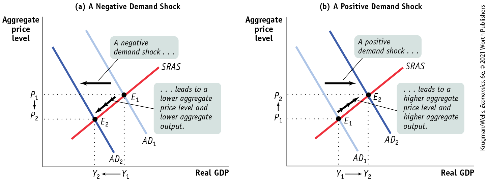
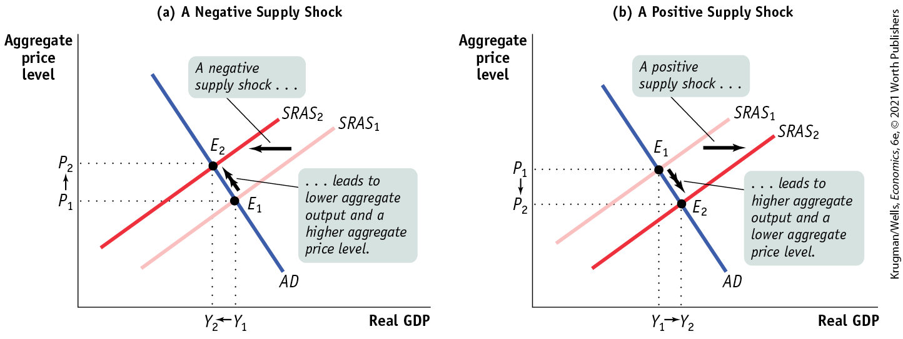
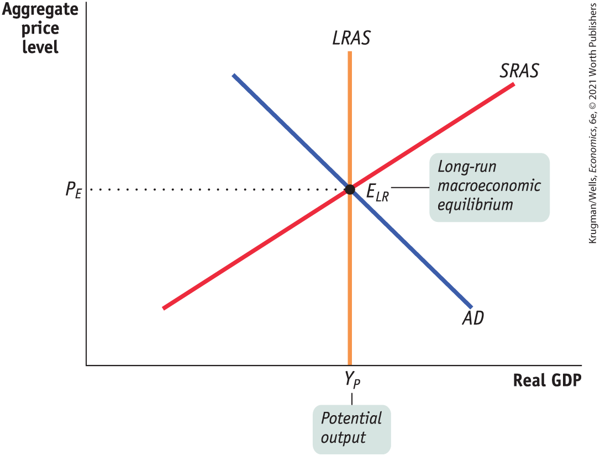
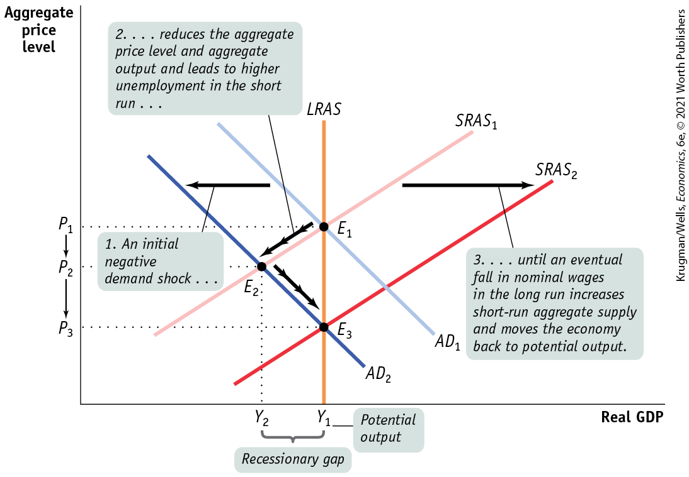
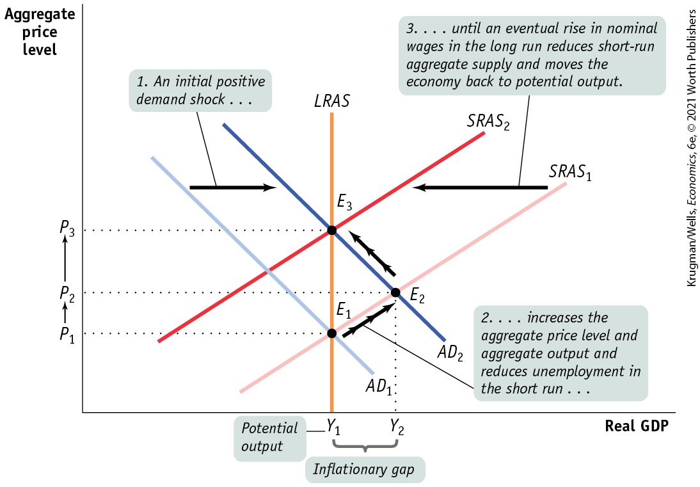
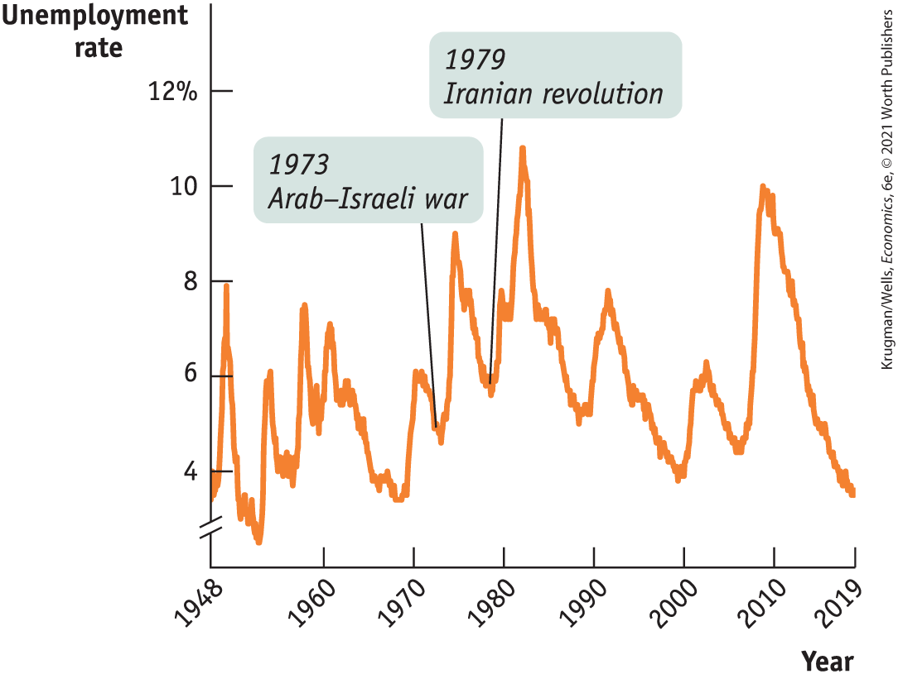

### Shifts of Aggregate Demand: Short-Run Effects

An event that shifts the aggregate demand curve, such as a change in expectations or wealth, the effect of the size of the existing stock of physical capital, or the use of fiscal or monetary policy, is known as a <a href="#kru_9781319245269_EM_glossary.xhtml#pau_9781319320164_a5OcRI8ikO" id="kru_9781319245269_ch12_04.xhtml#pau_9781319320164_dLTBbPQt2t" class="glossref" role="doc-glossref">demand shock</a>. The Great Depression was caused by a negative demand shock, the collapse of wealth and of business and consumer confidence that followed the stock market crash of 1929 and the banking crisis of 1930–1931.

<aside aria-label="title 5" class="glossary c3 main-flow v1" epub:type="glossary" id="pau_9781319320164_D2CKKfxnn2">

**demand shock**  
An event that shifts the aggregate demand curve is a **demand shock.**

</aside>

The Depression was ended by a positive demand shock — the huge increase in government purchases during World War II. In 2008 the U.S. economy experienced another significant negative demand shock as the housing market turned from boom to bust, leading consumers and firms to scale back their spending.

<a href="#kru_9781319245269_ch12_04.xhtml#pau_9781319320164_TTRIdKsC5A" id="kru_9781319245269_ch12_04.xhtml#pau_9781319320164_OzrlHtXP86" class="crossref">Figure 12-12</a> shows the short-run effects of negative and positive demand shocks. A negative demand shock shifts the aggregate demand curve, *AD,* to the left, from $AD_{1}$ to $AD_{2}$, as shown in panel (a). The economy moves down along the *SRAS* curve from $E_{1}$ to $E_{2}$, leading to lower short-run equilibrium aggregate output and a lower short-run equilibrium aggregate price level. A positive demand shock shifts the aggregate demand curve, *AD,* to the right, as shown in panel (b). Here, the economy moves up along the *SRAS* curve, from $E_{1}$ to $E_{2}$. This leads to higher short-run equilibrium aggregate output and a higher short-run equilibrium aggregate price level. Demand shocks cause aggregate output and the aggregate price level to move in the same direction.

<figure id="pau_9781319320164_TTRIdKsC5A" class="figure lm_img_lightbox num c4 main-flow">

<figcaption>
FIGURE 12-12 Demand Shocks

A demand shock shifts the aggregate demand curve, moving the aggregate price level and aggregate output in the same direction. In panel (a), a negative demand shock shifts the aggregate demand curve leftward from <em>A</em><em>D</em>1 to <em>A</em><em>D</em>2, reducing the aggregate price level from <em>P</em>1 to <em>P</em>2 and aggregate output from <em>Y</em>1 to <em>Y</em>2. In panel (b), a positive demand shock shifts the aggregate demand curve rightward, increasing the aggregate price level from <em>P</em>1 to <em>P</em>2 and aggregate output from <em>Y</em>1 to <em>Y</em>2.
</figcaption>
</figure>

<aside class="hidden" id="pau_9781319320164_80aZXrOEhc" title="hidden">

Graph (a) A Negative Demand Shock: The vertical axis, labeled Aggregate price level shows the markings at P subscript 2 and P subscript 1 from bottom to top. The horizontal axis, labeled Real G D P shows the markings at Y subscript 2 and Y subscript 1 from left to right. A positive sloping straight line labeled S R A S intersects two negative sloping straight parallel lines labeled A D subscript 2 and A D subscript 1 at points E subscript 2 (Y subscript 2, P subscript 2) and E subscript 1 (Y subscript 1, P subscript 1), respectively. A D subscript 2 is on the left of A D subscript 1. An arrow pointing from E subscript 1 to E subscript 2 is labeled, “ellipsis leads to a lower aggregate price level and lower aggregate output,” and another arrow pointing from A D subscript 1 to A D subscript 2 is labeled, “A negative demand shock ellipsis.” Graph (b) A Positive Demand Shock: The vertical axis, labeled Aggregate price level shows the markings at P subscript 1 and P subscript 2 from bottom to top. The horizontal axis, labeled Real G D P shows the markings at Y subscript 1 and Y subscript 2 from left to right. A positive sloping straight line labeled S R A S intersects two negative sloping straight parallel lines labeled A D subscript 1 and A D subscript 2 at points E subscript 1 (Y subscript 1, P subscript 1) and E subscript 2 (Y subscript 2, P subscript 2), respectively. A D subscript 2 is on the right of A D subscript 1. An arrow pointing from E subscript 1 to E subscript 2 is labeled “ellipsis leads to a higher aggregate price level and higher aggregate output,” and another arrow pointing from A D subscript 1 to A D subscript 2 is labeled “A positive demand shock ellipsis.”

</aside>

### Shifts of the *SRAS* Curve

An event that shifts the short-run aggregate supply curve, such as a change in commodity prices, nominal wages, or productivity, is known as a <a href="#kru_9781319245269_EM_glossary.xhtml#pau_9781319320164_hkeTqWimrr" id="kru_9781319245269_ch12_04.xhtml#pau_9781319320164_Xvj5NpqDoj" class="glossref" role="doc-glossref">supply shock</a>. A *negative* supply shock raises production costs and reduces the quantity producers are willing to supply at any given aggregate price level, leading to a leftward shift of the short-run aggregate supply curve. The U.S. economy experienced severe negative supply shocks following disruptions to world oil supplies in 1973 and 1979.

<aside aria-label="title 6" class="glossary c3 main-flow v1" epub:type="glossary" id="pau_9781319320164_7xNWj5EiAf">

**supply shock**  
An event that shifts the short-run aggregate supply curve is a **supply shock.**

</aside>

In contrast, a *positive* supply shock reduces production costs and increases the quantity supplied at any given aggregate price level, leading to a rightward shift of the short-run aggregate supply curve. The United States experienced a positive supply shock between 1995 and 2000, when the increasing use of the internet and other information technologies caused productivity growth to surge.

The effects of a negative supply shock are shown in panel (a) of <a href="#kru_9781319245269_ch12_04.xhtml#pau_9781319320164_ViwNgojCYs" id="kru_9781319245269_ch12_04.xhtml#pau_9781319320164_JyOVPiidL8" class="crossref">Figure 12-13</a>. The initial equilibrium is at $E_{1}$, with aggregate price level $P_{1}$ and aggregate output $Y_{1}$. The disruption in the oil supply causes the short-run aggregate supply curve to shift to the left, from $SRAS_{1}$ to $SRAS_{2}$. As a consequence, aggregate output falls and the aggregate price level rises, an upward movement along the *AD* curve. At the new equilibrium, $E_{2}$, the short-run equilibrium aggregate price level, $P_{2}$, is higher, and the short-run equilibrium aggregate output level, $Y_{2}$, is lower than before.

<figure id="pau_9781319320164_ViwNgojCYs" class="figure lm_img_lightbox num c4 main-flow">

<figcaption>
FIGURE 12-13 Supply Shocks

A supply shock shifts the short-run aggregate supply curve, moving the aggregate price level and aggregate output in opposite directions. Panel (a) shows a negative supply shock, which shifts the short-run aggregate supply curve leftward and causes <em>stagflation</em> — lower aggregate output and a higher aggregate price level. Here the short-run aggregate supply curve shifts from <em>S</em><em>R</em><em>A</em><em>S</em>1 to <em>S</em><em>R</em><em>A</em><em>S</em>2, and the economy moves from <em>E</em>1 to <em>E</em>2. The aggregate price level rises from <em>P</em>1 to <em>P</em>2, and aggregate output falls from <em>Y</em>1 to <em>Y</em>2. Panel (b) shows a positive supply shock, which shifts the short-run aggregate supply curve rightward, generating higher aggregate output and a lower aggregate price level. The short-run aggregate supply curve shifts from <em>S</em><em>R</em><em>A</em><em>S</em>1 to <em>S</em><em>R</em><em>A</em><em>S</em>2, and the economy moves from <em>E</em>1 to <em>E</em>2. The aggregate price level falls from <em>P</em>1 to <em>P</em>2, and aggregate output rises from <em>Y</em>1 to <em>Y</em>2.
</figcaption>
</figure>

<aside class="hidden" id="pau_9781319320164_y14tKeXKym" title="hidden">

Graph (a) A Negative Supply Shock: The vertical axis, labeled Aggregate price level shows markings at P subscript 1 and P subscript 2 from bottom to top. The horizontal axis, labeled Real G D P shows markings at Y subscript 2 and Y subscript 1 from left to right. A negative sloping straight line labeled A D intersects two positive sloping straight parallel lines labeled S R A S subscript 2 and S R A S subscript 1 at points E subscript 2 (Y subscript 2, P subscript 2) and E subscript 1 (Y subscript 1, P subscript 1), respectively. S R A S subscript 2 is on the left of S R A S subscript 1. An arrow pointing from E subscript 1 to E subscript 2 is labeled, “ellipsis leads to lower aggregate output and a higher aggregate price level,” and another arrow pointing from S R A S subscript 1 to S R A S subscript 2 is labeled, “A negative supply shock ellipsis.” Graph (b) A Positive Supply Shock: The vertical axis, labeled Aggregate price level shows the markings at P subscript 2 and P subscript 1 from bottom to top. The horizontal axis, labeled Real G D P shows the markings at Y subscript 1 and Y subscript 2 from left to right. A negative sloping straight line labeled A D intersects two positive sloping straight parallel lines labeled S R A S subscript 1 and S R A S subscript 2 at points E subscript 1 (Y subscript 1, P subscript 1) and E subscript 2 (Y subscript 2, P subscript 2), respectively. S R A S subscript 2 is on the right of S R A S subscript 1. An arrow pointing from E subscript 1 to E subscript 2 is labeled, “ellipsis leads to higher aggregate output and a lower aggregate price level,” and an arrow pointing from S R A S subscript 1 to S R A S subscript 2 is labeled, “A positive supply shock ellipsis.”

</aside>
<!--
[AU: Note might have edit last sentence of this paragraph is CO is edited.]
-->

The combination of inflation and falling aggregate output shown in panel (a) has a special name: <a href="#kru_9781319245269_EM_glossary.xhtml#pau_9781319320164_3IYlPBpJUP" id="kru_9781319245269_ch12_04.xhtml#pau_9781319320164_Sj7q9pTmMk" class="glossref" role="doc-glossref">stagflation</a>, for “stagnation plus inflation.” Stagflation is unpleasant: falling aggregate output leads to rising unemployment, while the purchasing power of consumers is squeezed by rising prices. Stagflation in the 1970s created a mood of economic pessimism and deeply affected those who lived through it, like Jean-Claude Trichet. It also, as we’ll see, poses a dilemma for policy makers.

<aside aria-label="title 7" class="glossary c3 main-flow v1" epub:type="glossary" id="pau_9781319320164_kaF0TCSexe">

**stagflation**  
**Stagflation** is the combination of inflation and falling aggregate output.

</aside>

A positive supply shock, shown in panel (b), has exactly the opposite effects. A rightward shift of the *SRAS* curve from $SRAS_{1}$ to $SRAS_{2}$ results in a rise in aggregate output and a fall in the aggregate price level, a downward movement along the *AD* curve. The favorable supply shocks of the late 1990s led to a combination of full employment and declining inflation. That is, the aggregate price level fell compared with the long-run trend. This combination produced, for a time, a great wave of national optimism.

The distinctive feature of supply shocks, both negative and positive, is that, unlike demand shocks, they cause the aggregate price level and aggregate output to move in *opposite* directions.

There’s another important contrast between supply shocks and demand shocks. As we’ve seen, monetary policy and fiscal policy enable the government to shift the *AD* curve, meaning that governments are in a position to create the kinds of shocks shown in <a href="#kru_9781319245269_ch12_04.xhtml#pau_9781319320164_TTRIdKsC5A" id="kru_9781319245269_ch12_04.xhtml#pau_9781319320164_gq5a0wvNHy" class="crossref">Figure 12-12</a>. It’s much harder for governments to shift the *AS* curve. Are there good policy reasons to shift the *AD* curve? We’ll turn to that question soon. First, however, let’s look at the difference between short-run macroeconomic equilibrium and *long-run macroeconomic equilibrium.*

### Long-Run Macroeconomic Equilibrium

<a href="#kru_9781319245269_ch12_04.xhtml#pau_9781319320164_GFowJvUpxk" id="kru_9781319245269_ch12_04.xhtml#pau_9781319320164_Skso3kq3NN" class="crossref">Figure 12-14</a> combines the aggregate demand curve with both the short-run and long-run aggregate supply curves. The aggregate demand curve, *AD,* crosses the short-run aggregate supply curve, *SRAS,* at $E_{LR}$. Here we assume that enough time has elapsed that the economy is also on the long-run aggregate supply curve, *LRAS.* As a result, $E_{LR}$ is at the intersection of all three curves — *SRAS, LRAS,* and *AD.* So short-run equilibrium aggregate output is equal to potential output, $Y_{P}$. Such a situation, in which the point of short-run macroeconomic equilibrium is on the long-run aggregate supply curve, is known as <a href="#kru_9781319245269_EM_glossary.xhtml#pau_9781319320164_mMGtnBUlrj" id="kru_9781319245269_ch12_04.xhtml#pau_9781319320164_Fwl6Rlkf92" class="glossref" role="doc-glossref">long-run macroeconomic equilibrium</a>.

<figure id="pau_9781319320164_GFowJvUpxk" class="figure lm_img_lightbox num c3 main-flow">

<figcaption>
FIGURE 12-14 Long-Run Macroeconomic Equilibrium

Here the point of short-run macroeconomic equilibrium also lies on the long-run aggregate supply curve, <em>LRAS</em>. As a result, short-run equilibrium aggregate output is equal to potential output, <em>Y</em><em>P</em>. The economy is in long-run macroeconomic equilibrium at <em>E</em><em>L</em><em>R</em>.
</figcaption>
</figure>

<aside class="hidden" id="pau_9781319320164_UfCRc4sK3x" title="hidden">

The vertical axis, labeled Aggregate price level shows a marking at P subscript E, and the horizontal axis, labeled Real G D P shows a marking at Y subscript P. A straight vertical line from Y subscript P is parallel to the vertical axis, and is labeled L R A S. A positive sloping straight line labeled S R A S intersects a negative sloping straight line labeled A D and also the vertical line labeled L R A S at an equilibrium point E subscript (L R). This point is at (Y subscript P, P subscript E), and is labeled “Long-run macroeconomic equilibrium.” The marking, Y subscript P, on the horizontal axis is labeled “Potential output.”

</aside>
<aside aria-label="title 8" class="glossary c3 main-flow v1" epub:type="glossary" id="pau_9781319320164_b05hIxhqTc">

**long-run macroeconomic equilibrium**  
The economy is in **long-run macroeconomic equilibrium** when the point of short-run macroeconomic equilibrium is on the long-run aggregate supply curve.

</aside>

To see the significance of long-run macroeconomic equilibrium, let’s consider what happens if a demand shock moves the economy away from long-run macroeconomic equilibrium. In <a href="#kru_9781319245269_ch12_04.xhtml#pau_9781319320164_j507qvLTWk" id="kru_9781319245269_ch12_04.xhtml#pau_9781319320164_39sH3r6hs7" class="crossref">Figure 12-15</a>, we assume that the initial aggregate demand curve is $AD_{1}$ and the initial short-run aggregate supply curve is $SRAS_{1}$. So the initial macroeconomic equilibrium is at $E_{1}$, which lies on the long-run aggregate supply curve, *LRAS.* The economy, then, starts from a point of short-run and long-run macroeconomic equilibrium, and short-run equilibrium aggregate output equals potential output at $Y_{1}$.

<figure id="pau_9781319320164_j507qvLTWk" class="figure lm_img_lightbox num c3 main-flow">

<figcaption>
FIGURE 12-15 Short-Run versus Long-Run Effects of a Negative Demand Shock

In the long run the economy is self-correcting: demand shocks have only a short-run effect on aggregate output. Starting at <em>E</em>1, a negative demand shock shifts <em>A</em><em>D</em>1 leftward to <em>A</em><em>D</em>2. In the short run the economy moves to <em>E</em>2 and a recessionary gap arises: the aggregate price level declines from <em>P</em>1 to <em>P</em>2, aggregate output declines from <em>Y</em>1 to <em>Y</em>2, and unemployment rises. But in the long run nominal wages fall in response to high unemployment at <em>Y</em>2, and <em>S</em><em>R</em><em>A</em><em>S</em>1 shifts rightward to <em>S</em><em>R</em><em>A</em><em>S</em>2. Aggregate output rises from <em>Y</em>2 to <em>Y</em>1, and the aggregate price level declines again, from <em>P</em>2 to <em>P</em>3. Long-run macroeconomic equilibrium is eventually restored at <em>E</em>3.
</figcaption>
</figure>

<aside class="hidden" id="pau_9781319320164_SgoaQNcLc3" title="hidden">

The vertical axis, labeled Aggregate price level shows the markings at P subscript 3, P subscript 2, and P subscript 1 from bottom to top. The horizontal axis, labeled Real G D P shows markings at Y subscript 2 and Y subscript 1 from left to right. A straight vertical line from Y subscript 1 is parallel to the vertical axis, and is labeled L R A S. Two positive sloping straight parallel lines are labeled S R A S subscript 1 and S R A S subscript 2 and two negative sloping straight parallel lines are labeled A D subscript 1 and A D subscript 2. S R A S subscript 2 is on the right of S R A S subscript 1, and A D subscript 2 is on the left of A D subscript 1. L R A S, S R A S subscript 1, and A D subscript 1 intersect each other at a point labeled E subscript 1. L R A S, S R A S subscript 2, and A D subscript 2 intersect each other at a point E labeled subscript 3. The point at which S R A S subscript 1 intersects A D subscript 2 is E subscript 2. E subscript 3 is vertically below E subscript 1, and E subscript 2 is to the left of E subscript 1 and E subscript 3. An arrow pointing from A D subscript 1 to A D subscript 2 is labeled, “1. An initial negative demand shock ellipsis.” An arrow pointing from E subscript 1 to E subscript 2 is labeled, “2. ellipsis reduces the aggregate price level and aggregate output and leads to higher unemployment in the short run ellipsis.” An arrow pointing from S R A S subscript 1 to S R A S subscript 2 is labeled, “3. ellipsis until an eventual fall in nominal wages in the long run increases short-run aggregate supply and moves the economy back to potential output.” The marking, Y subscript 1, on the horizontal axis is labeled Potential output, and the gap between Y subscript 2 and Y subscript 1 is labeled Recessionary gap.

</aside>

Now suppose that for some reason — such as a sudden worsening of business and consumer expectations — aggregate demand falls and the aggregate demand curve shifts leftward to $AD_{2}$. This results in a lower equilibrium aggregate price level at $P_{2}$ and a lower equilibrium aggregate output level at $Y_{2}$ as the economy settles in the short run at $E_{2}$. The short-run effect of such a fall in aggregate demand is what the U.S. economy experienced in 1929–1933: a falling aggregate price level and falling aggregate output.

Aggregate output in this new short-run equilibrium, $E_{2}$, is below potential output. When this happens, the economy faces a <a href="#kru_9781319245269_EM_glossary.xhtml#pau_9781319320164_17V1ok2qGu" id="kru_9781319245269_ch12_04.xhtml#pau_9781319320164_mVqaQlVT30" class="glossref" role="doc-glossref">recessionary gap</a>. A recessionary gap inflicts a great deal of pain because it corresponds to high unemployment. The large recessionary gap that had opened up in the United States by 1933 caused intense social and political turmoil. And the devastating recessionary gap that opened up in Germany at the same time played an important role in Hitler’s rise to power.

<aside aria-label="title 9" class="glossary c3 main-flow v1" epub:type="glossary" id="pau_9781319320164_p5Y6mw1Man">

**recessionary gap**  
There is a **recessionary gap** when aggregate output is below potential output.

</aside>

But this isn’t the end of the story. In the face of high unemployment, nominal wages eventually fall, as do any other sticky prices, ultimately leading producers to increase output. As a result, a recessionary gap causes the short-run aggregate supply curve to gradually shift to the right over time. This process continues until $SRAS_{1}$ reaches its new position at $SRAS_{2}$, bringing the economy to equilibrium at $E_{3}$, where $AD_{2}$, $SRAS_{2}$, and *LRAS* all intersect. At $E_{3}$, the economy is back in long-run macroeconomic equilibrium; it is back at potential output $Y_{1}$ but at a lower aggregate price level, $P_{3}$, reflecting a long-run fall in the aggregate price level. In the end, the economy is *self-correcting* in the long run.

What if, instead, there was an increase in aggregate demand? The results are shown in <a href="#kru_9781319245269_ch12_04.xhtml#pau_9781319320164_5d5hPsFVNp" id="kru_9781319245269_ch12_04.xhtml#pau_9781319320164_Yrj33Kedla" class="crossref">Figure 12-16</a>, where we again assume that the initial aggregate demand curve is $AD_{1}$ and the initial short-run aggregate supply curve is $SRAS_{1}$, so that the initial macroeconomic equilibrium, at $E_{1}$, lies on the long-run aggregate supply curve, *LRAS.* Initially, then, the economy is in long-run macroeconomic equilibrium.

<figure id="pau_9781319320164_5d5hPsFVNp" class="figure lm_img_lightbox num c3 main-flow">

<figcaption>
FIGURE 12-16 Short-Run versus Long-Run Effects of a Positive Demand Shock

Starting at <em>E</em>1, a positive demand shock shifts <em>A</em><em>D</em>1 rightward to <em>A</em><em>D</em>2, and the economy moves to <em>E</em>2 in the short run. This results in an inflationary gap as aggregate output rises from <em>Y</em>1 to <em>Y</em>2, the aggregate price level rises from <em>P</em>1 to <em>P</em>2, and unemployment falls to a low level. In the long run, <em>S</em><em>R</em><em>A</em><em>S</em>1 shifts leftward to <em>S</em><em>R</em><em>A</em><em>S</em>2 as nominal wages rise in response to low unemployment at <em>Y</em>2. Aggregate output falls back to <em>Y</em>1, the aggregate price level rises again to <em>P</em>3, and the economy self-corrects as it returns to long-run macroeconomic equilibrium at <em>E</em>3.
</figcaption>
</figure>

<aside class="hidden" id="pau_9781319320164_Hq4KeiNMjZ" title="hidden">

The vertical axis, labeled Aggregate price level shows the markings at P subscript 1, P subscript 2, and P subscript 3 from bottom to top. The horizontal axis, labeled Real G D P shows the markings at Y subscript 1 and Y subscript 2 from left to right. A straight vertical line from Y subscript 1 is parallel to the vertical axis, and is labeled L R A S. Two positive sloping straight parallel lines are labeled S R A S subscript 2 and S R A S subscript 1, and two negative sloping straight parallel lines are labeled A D subscript 1 and A D subscript 2. S R A S subscript 2 is on the left of S R A S subscript 1, and A D subscript 2 is on the right of A D subscript 1. L R A S, S R A S subscript 1, and A D subscript 1 intersect each other at a point labeled E subscript 1. L R A S, S R A S subscript 2, and A D subscript 2 intersect each other at a point labeled E subscript 3. S R A S subscript 1 intersects A D subscript 2 at a point labeled E subscript 2. E subscript 1 is vertically below E subscript 3, and E subscript 2 is to the right of E subscript 1 and E subscript 3. An arrow pointing from A D subscript 1 to A D subscript 2 is labeled, “1. An initial positive demand shock ellipsis.” An arrow pointing from E subscript 1 to E subscript 2 is labeled, “2. ellipsis increases the aggregate price level and aggregate output and reduces unemployment in the short run ellipsis.” An arrow pointing from S R A S subscript 1 to S R A S subscript 2 is labeled, “3. ellipsis until an eventual rise in nominal wages in the long run reduces short-run aggregate supply and moves the economy back to potential output.” The marking, Y subscript 1, on the horizontal axis is labeled Potential output, and the gap between Y subscript 1 and Y subscript 2 is labeled, “Inflationary gap.”

</aside>
<!--
<strong class="important">[Start FIM Box]</strong>
--> <!--
<strong class="important">[Comp: insert globe icon.]</strong>
-->
<aside class="case-study c3 main-flow v1" epub:type="case-study" id="pau_9781319320164_3GxNfxdvU7" title="For Inquiring Minds">

#### For inquiring minds

Where’s the Deflation?

The *AD–AS* model says that either a negative demand shock or a positive supply shock should lead to a fall in the aggregate price level — that is, deflation. However, since 1949, an actual fall in the aggregate price level has been a rare occurrence in the United States. Similarly, most other countries have had little or no experience with deflation. Japan, which experienced sustained mild deflation in the late 1990s and the early part of the next decade, is the big (and much discussed) exception. What happened to deflation?

The answer is that since World War II economic fluctuations have largely taken place around a long-run inflationary trend. Before the war, it was common for prices to fall during recessions, but since then negative demand shocks have largely been reflected in a *decline in the rate of inflation* rather than an actual fall in prices. For example, the rate of consumer price inflation fell from more than 3% at the beginning of the 2001 recession to 1.1% a year later, but it never went below zero.

All of this changed during the recession of 2007–2009. The negative demand shock that followed the 2008 financial crisis was so severe that, for most of 2009, consumer prices in the United States indeed fell. But the deflationary period didn’t last long: beginning in 2010, prices again rose, at a rate of between 1% and 4% per year.

</aside>
<!--
<strong class="important">[End FIM Box]</strong>
-->

Now suppose that aggregate demand rises, and the *AD* curve shifts rightward to $AD_{2}$. This results in a higher aggregate price level, at $P_{2}$, and a higher aggregate output level, at $Y_{2}$, as the economy settles in the short run at $E_{2}$. Aggregate output in this new short-run equilibrium is above potential output, and unemployment is low in order to produce this higher level of aggregate output. When this happens, the economy experiences an <a href="#kru_9781319245269_EM_glossary.xhtml#pau_9781319320164_Ad2fPrvjrI" id="kru_9781319245269_ch12_04.xhtml#pau_9781319320164_jzjOiVO6bd" class="glossref" role="doc-glossref">inflationary gap</a>.

<aside aria-label="title 10" class="glossary c3 main-flow v1" epub:type="glossary" id="pau_9781319320164_cYESccqiHN">

**inflationary gap**  
There is an **inflationary gap** when aggregate output is above potential output.

</aside>

As in the case of a recessionary gap, the story doesn’t end here. In the face of low unemployment, nominal wages will rise, as will other sticky prices. An inflationary gap causes the short-run aggregate supply curve to shift gradually to the left as producers reduce output in the face of rising nominal wages. This process continues until $SRAS_{1}$ reaches its new position at $SRAS_{2}$, bringing the economy to equilibrium at $E_{3}$, where $AD_{2}$, $SRAS_{2}$, and *LRAS* all intersect. At $E_{3}$, the economy is back in long-run macroeconomic equilibrium. It is back at potential output, but at a higher price level, $P_{3}$, reflecting a long-run rise in the aggregate price level. Again, the economy is self-correcting in the long run.

To summarize the analysis of how the economy responds to recessionary and inflationary gaps, we can focus on the <a href="#kru_9781319245269_EM_glossary.xhtml#pau_9781319320164_FNMMEaZrDy" id="kru_9781319245269_ch12_04.xhtml#pau_9781319320164_OaMHhGSFee" class="glossref" role="doc-glossref">output gap</a>, the percentage difference between actual aggregate output and potential output. The output gap is calculated as follows:

<aside aria-label="title 11" class="glossary c3 main-flow v1" epub:type="glossary" id="pau_9781319320164_2vxBK7ncFe">

**output gap**  
The **output gap** is the percentage difference between actual aggregate output and potential output.

</aside>

$$\text{Output~gap} = \frac{\text{Actual~aggregate~output}\operatorname{~-~}\text{Potential~output}}{\text{Potential~output}} \times 100$$

**(12-3)**

Our analysis says that the output gap always tends toward zero.

If there is a recessionary gap, so that the output gap is negative, nominal wages eventually fall, moving the economy back to potential output and bringing the output gap back to zero. If there is an inflationary gap, so that the output gap is positive, nominal wages eventually rise, also moving the economy back to potential output and again bringing the output gap back to zero. So in the long run the economy is <a href="#kru_9781319245269_EM_glossary.xhtml#pau_9781319320164_QdvSN6cjrw" id="kru_9781319245269_ch12_04.xhtml#pau_9781319320164_TluN10Ulus" class="glossref" role="doc-glossref">self-correcting</a>: shocks to aggregate demand affect aggregate output in the short run but not in the long run.

<aside aria-label="title 12" class="glossary c3 main-flow v1" epub:type="glossary" id="pau_9781319320164_bLpB3Uo1tA">

**self-correcting**  
The economy is **self-correcting** when shocks to aggregate demand affect aggregate output in the short run, but not the long run.

</aside>
<!--
<strong class="important">[Start EIA]</strong>
--> <!--
<strong class="important">[Comp: insert globe icon.]</strong>
-->

### ECONOMICS \>\> *in Action*

Supply Shocks versus Demand Shocks in Practice

How often do supply shocks and demand shocks, respectively, cause recessions? The verdict of most, though not all, macroeconomists is that recessions are mainly caused by demand shocks. But when a negative supply shock does happen, the resulting recession tends to be particularly severe.

Let’s get specific. Between World War II and the coronavirus recession of 2020, which was really in a class of its own, there were twelve recessions in the United States. However, two of these, in 1980 and 1981–1982, are often treated as a single *double-dip recession* (that is, a recession followed by a temporary recovery, then followed by another recession), bringing the total number down to eleven. Of these eleven recessions, only two — the recession of 1973–1975 and the double-dip recession of 1980–1982 — showed the distinctive combination of falling aggregate output and a surge in the price level that we call stagflation. In each case, the cause of the supply shock was political turmoil in the Middle East — the Arab–Israeli war of 1973 and the Iranian revolution of 1979 — that disrupted world oil supplies and sent oil prices skyrocketing. In fact, economists sometimes refer to the two slumps as “OPEC I” and “OPEC II,” after the Organization of the Petroleum Exporting Countries, the world oil cartel. The Great Recession that began in 2007 and lasted until 2009 was at least partially exacerbated, if not partially caused, by a spike in oil prices.

So eight of eleven postwar recessions were purely the result of demand shocks, not supply shocks. The few supply-shock recessions, however, were the worst as measured by the unemployment rate. <a href="#kru_9781319245269_ch12_04.xhtml#pau_9781319320164_fBqamf8nIn" id="kru_9781319245269_ch12_04.xhtml#pau_9781319320164_vSJohteNed" class="crossref">Figure 12-17</a> shows the U.S. unemployment rate since 1948, with the dates of the 1973 Arab–Israeli war and the 1979 Iranian revolution marked on the figure. Some of the highest unemployment rates since World War II came after these big negative supply shocks.

<figure id="pau_9781319320164_fBqamf8nIn" class="figure lm_img_lightbox num c3 main-flow">

<figcaption>
FIGURE 12-17 Negative Supply Shocks Are Relatively Rare But Nasty

<em>Data from:</em> Bureau of Labor Statistics; Federal Reserve Bank of St. Louis.
</figcaption>
</figure>

<aside class="hidden" id="pau_9781319320164_vTdHZhKU0l" title="hidden">

The vertical axis, labeled Unemployment rate is truncated and ranges from 4 to 12 percent in increments of 2 percent. The horizontal axis, labeled Year shows markings at 1948, 1960, 1970, 1980, 1990, 2000, 2010, and 2019 from left to right. The curve passes through the following approximate points, (1948, 3.5); (1960, 5); (1970, 3.5); (1973, 4.5); (1979, 6); (1983, 11); (1990, 5); (2000, 4); (2010, 10); and (2019, 3). A point on the curve corresponding to the year 1973 is labeled Arab–Israeli war. Another point on the curve corresponding to the year 1979 is labeled Iranian revolution.

</aside>

There’s a reason the aftermath of a supply shock tends to be particularly severe for the economy: macroeconomic policy has a much harder time dealing with supply shocks than with demand shocks. We’ll see in a moment why supply shocks present such a problem.

### \>\> *Quick Review*

- The ***AD–AS* model** is used to study economic fluctuations.
- **Short-run macroeconomic equilibrium** occurs at the intersection of the short-run aggregate supply and aggregate demand curves. This determines the **short-run equilibrium aggregate price level** and the level of **short-run equilibrium aggregate output.**
- A **demand shock**, a shift of the *AD* curve, causes the aggregate price level and aggregate output to move in the same direction. A **supply shock**, a shift of the *SRAS* curve, causes them to move in opposite directions. **Stagflation** is the consequence of a negative supply shock.
- A fall in nominal wages occurs in response to a **recessionary gap**, and a rise in nominal wages occurs in response to an **inflationary gap.** Both move the economy to **long-run macroeconomic equilibrium**, where the *AD, SRAS,* and *LRAS* curves intersect.
- The **output gap** always tends toward zero because the economy is **self-correcting** in the long run.
