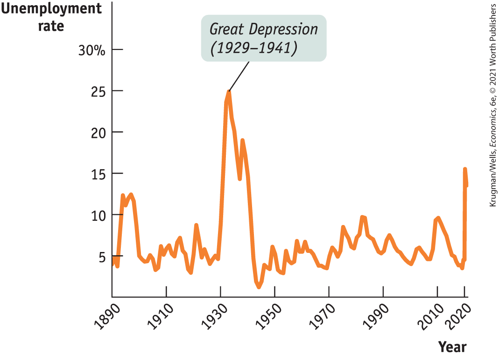
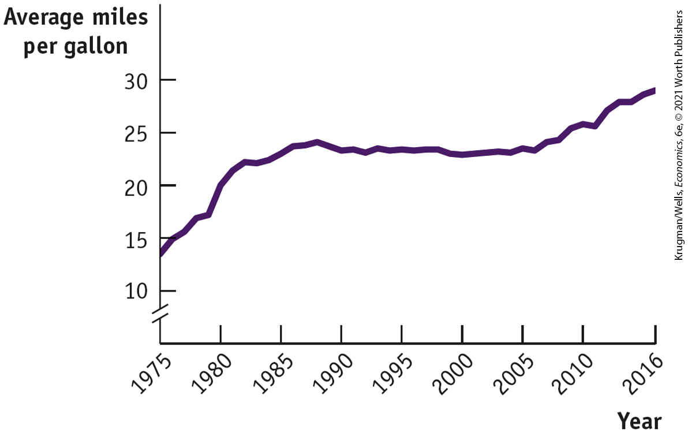

### \>\> *Check Your Understanding* 12-3

1.  Describe the short-run effects of each of the following shocks on the aggregate price level and on aggregate output.
    1.  The government sharply increases the minimum wage, raising the wages of many workers.
    2.  Solar energy firms launch a major program of investment spending.
    3.  Congress raises taxes and cuts spending.
    4.  Severe weather destroys crops around the world.
2.  A rise in productivity increases potential output, but some worry that demand for the additional output will be insufficient even in the long run. How would you respond?

## Macroeconomic Policy

We’ve just seen that the economy is self-correcting in the long run: it will eventually trend back to potential output. Most macroeconomists believe, however, that the process of self-correction typically takes a decade or more. In particular, if aggregate output is below potential output, the economy can suffer an extended period of depressed aggregate output and high unemployment before it returns to normal.

This belief is the background to one of the most famous quotations in economics: John Maynard Keynes’s declaration, “In the long run we are all dead.” We explain the context in which he made this remark in the upcoming For Inquiring Minds.

Economists usually interpret Keynes as having recommended that governments not wait for the economy to correct itself. Instead, it is argued by many economists, but not all, that the government should use monetary and fiscal policy to get the economy back to potential output in the aftermath of a shift of the aggregate demand curve. This is the rationale for an active <a href="#kru_9781319245269_EM_glossary.xhtml#pau_9781319320164_TfQvtVmkKL" id="kru_9781319245269_ch12_05.xhtml#pau_9781319320164_2mhUAcG3FH" class="glossref" role="doc-glossref">stabilization policy</a>, which is the use of government policy to reduce the severity of recessions and rein in excessively strong expansions.

<aside aria-label="title 1" class="glossary c3 main-flow v1" epub:type="glossary" id="pau_9781319320164_9KmTzRbI9C">

**stabilization policy**  
**Stabilization policy** is the use of government policy to reduce the severity of recessions and rein in excessively strong expansions.

</aside>

Can stabilization policy improve the economy’s performance? If we reexamine <a href="#kru_9781319245269_ch12_03.xhtml#pau_9781319320164_7EjGgEx8t4" id="kru_9781319245269_ch12_05.xhtml#pau_9781319320164_IoHrMw90tg" class="crossref">Figure 12-8</a>, the answer certainly appears to be yes. Under active stabilization policy, the U.S. economy returned to potential output in 1996 after an approximately five-year recessionary gap. Likewise, in 2001 it also returned to potential output after an approximately four-year inflationary gap. These periods are much shorter than the decade or more that economists believe it would take for the economy to self-correct in the absence of active stabilization policy. In fact, recovery from the Great Recession took longer — seven years — partly because of political constraints on fiscal policy. And recovery would have taken even longer if Ben Bernanke had not undertaken strongly expansionary monetary policy, as recounted in the opening story. However, as we’ll see shortly, the ability to improve the economy’s performance is not always guaranteed. It depends on the kinds of shocks the economy faces.

<!--
[AU: Edit sentence about Bernanke if CO changes.]
--> <!--
<strong class="important">[Start FIM Box; position near here]</strong>
-->
<aside class="case-study c3 main-flow v1" epub:type="case-study" id="pau_9781319320164_rvEHTLsa0u" title="For Inquiring Minds">

### For inquiring minds

Keynes and the Long Run

The British economist Sir John Maynard Keynes (1883–1946), probably more than any other single economist, created the modern field of macroeconomics. We’ll look at his role, and the controversies that still swirl around some aspects of his thought, in a later chapter on macroeconomic events and ideas. But for now let’s just look at his most famous quote.

<figure id="pau_9781319320164_T5GkYc52c7" class="figure lm_img_lightbox unnum c2 right">

<figcaption>
Keynes focused the attention of economists of his day on the short run.
</figcaption>
</figure>

In 1923 Keynes published *A Tract on Monetary Reform,* a small book on the economic problems of Europe after World War I. In it he decried the tendency of many of his colleagues to focus on how things work out in the long run — as in the long-run macroeconomic equilibrium we have just analyzed — while ignoring the often very painful and possibly disastrous things that can happen along the way. Here’s a fuller version of the quote:

> *This long run is a misleading guide to current affairs. In the long run we are all dead. Economists set themselves too easy, too useless a task if in tempestuous seasons they can only tell us that when the storm is long past the sea is flat again.*

<!--
[Macro-12UN03]
--> <!--
[Macro-12UN03]
-->
</aside>
<!--
<strong class="important">[End FIM Box]</strong>
-->

### Policy in the Face of Demand Shocks

Imagine that the economy experiences a negative demand shock, like the one shown in <a href="#kru_9781319245269_ch12_04.xhtml#pau_9781319320164_j507qvLTWk" id="kru_9781319245269_ch12_05.xhtml#pau_9781319320164_aTmZCtU0Oc" class="crossref">Figure 12-15</a>. As we’ve discussed in this chapter, monetary and fiscal policy shift the aggregate demand curve. If policy makers react quickly to the fall in aggregate demand, they can use monetary or fiscal policy to shift the aggregate demand curve back to the right. And if policy were able to perfectly anticipate shifts of the aggregate demand curve, it could short-circuit the whole process shown in <a href="#kru_9781319245269_ch12_04.xhtml#pau_9781319320164_j507qvLTWk" id="kru_9781319245269_ch12_05.xhtml#pau_9781319320164_XrAgqANjmq" class="crossref">Figure 12-15</a>. Instead of going through a period of low aggregate output and falling prices, the government could manage the economy so that it would stay at $E_{1}$.

Why might a policy that short-circuits the adjustment shown in <a href="#kru_9781319245269_ch12_04.xhtml#pau_9781319320164_j507qvLTWk" id="kru_9781319245269_ch12_05.xhtml#pau_9781319320164_Y9JJ59ugbp" class="crossref">Figure 12-15</a> and maintains the economy at its original equilibrium be desirable? For two reasons.

1.  The temporary fall in aggregate output that would happen without policy intervention is a bad thing, particularly because such a decline is associated with high unemployment.
2.  As explained in <a href="#kru_9781319245269_ch08_01.xhtml#pau_9781319320164_6AH2l2uZnD" id="kru_9781319245269_ch12_05.xhtml#pau_9781319320164_ga8LaSmnOv" class="crossref">Chapter 8</a>, price stability is generally regarded as a desirable goal. So preventing deflation — a fall in the aggregate price level — is a good thing.

Does this mean that policy makers should always act to offset declines in aggregate demand? Not necessarily. As we’ll see in later chapters, some policy measures to increase aggregate demand, especially those that increase budget deficits, may have long-term costs in terms of lower long-run growth. Furthermore, in the real world policy makers aren’t perfectly informed, and the effects of their policies aren’t perfectly predictable. This creates the danger that stabilization policy will do more harm than good; that is, attempts to stabilize the economy may end up creating more instability. We’ll describe the long-running debate over macroeconomic policy in <a href="#kru_9781319245269_ch17_01.xhtml#pau_9781319320164_BiQPlLMEHW" id="kru_9781319245269_ch12_05.xhtml#pau_9781319320164_GZ58SsJYIC" class="crossref">Chapter 17</a>. Despite these qualifications, most economists believe that a good case can be made for using macroeconomic policy to offset major negative shocks to the *AD* curve.

Should policy makers also try to offset positive shocks to aggregate demand? It may not seem obvious that they should. After all, even though inflation may be a bad thing, isn’t more output and lower unemployment a good thing? Not necessarily.

Most economists now believe that any short-run gains from an inflationary gap must be paid back later. So policy makers today usually try to offset positive as well as negative demand shocks. For reasons we’ll explain in <a href="#kru_9781319245269_ch15_01.xhtml#pau_9781319320164_4oAIkgdXHI" id="kru_9781319245269_ch12_05.xhtml#pau_9781319320164_JYeLMG2FWx" class="crossref">Chapter 15</a>, attempts to eliminate recessionary gaps and inflationary gaps usually rely on monetary rather than fiscal policy. In 2007 and 2008 the Fed sharply cut interest rates in an attempt to head off a rising recessionary gap; earlier in the decade, when the U.S. economy seemed headed for an inflationary gap, it raised interest rates to generate the opposite effect.

But how should macroeconomic policy respond to supply shocks?

### Responding to Supply Shocks

Back in panel (a) of <a href="#kru_9781319245269_ch12_04.xhtml#pau_9781319320164_ViwNgojCYs" id="kru_9781319245269_ch12_05.xhtml#pau_9781319320164_YNLsByeLy3" class="crossref">Figure 12-13</a> we showed the effects of a negative supply shock: in the short run such a shock leads to lower aggregate output but a higher aggregate price level. As we’ve noted, policy makers can respond to a negative *demand* shock by using monetary and fiscal policy to return aggregate demand to its original level. But what can or should they do about a negative *supply* shock?

In contrast to the aggregate demand curve, there are no easy policies that shift the short-run aggregate supply curve. That is, there is no government policy that can easily affect producers’ profitability and so compensate for shifts of the short-run aggregate supply curve. So the policy response to a negative supply shock cannot aim to simply push the curve that shifted back to its original position.

And if you consider using monetary or fiscal policy to shift the aggregate demand curve in response to a supply shock, the right response isn’t obvious. Two bad things are happening simultaneously: a fall in aggregate output, leading to a rise in unemployment, *and* a rise in the aggregate price level. Any policy that shifts the aggregate demand curve helps one problem only by making the other worse. If the government acts to increase aggregate demand and limit the rise in unemployment, it reduces the decline in output but causes even more inflation. If it acts to reduce aggregate demand, it curbs inflation but causes a further rise in unemployment.

It’s a trade-off with no good answer. In the end, the United States and other economically advanced nations suffering from the supply shocks of the 1970s eventually chose to stabilize prices even at the cost of higher unemployment. This was the same policy that Jean-Claude Trichet adopted in 2011, when he chose to forgo expansionary monetary policy after he mistook a temporary blip in oil prices as a supply shock.

<!--
<strong class="important">[Start EIA]</strong>
-->

### ECONOMICS \>\> *in Action*

Is Stabilization Policy Stabilizing?

We’ve described the theoretical rationale for stabilization policy as a way of responding to demand shocks. But does stabilization policy actually stabilize the economy? We can try to answer this question by looking at the long-term historical record.

Before World War II, the U.S. government didn’t really have a stabilization policy, largely because macroeconomics as we know it didn’t exist, and there was no consensus about what to do. Since World War II, and especially since 1960, active stabilization policy has become standard practice.

So, has the economy actually become more stable since the government began trying to stabilize it? The answer is a qualified yes. It’s qualified for two reasons. One is that data from the pre–World War II era are less reliable than modern data. The other is that the severe and protracted slump that began in 2007 has shaken confidence in the effectiveness of government policy. Still, there seems to have been a reduction in the size of fluctuations.

<a href="#kru_9781319245269_ch12_05.xhtml#pau_9781319320164_aKO0YEFLJI" id="kru_9781319245269_ch12_05.xhtml#pau_9781319320164_lGEWG3qz24" class="crossref">Figure 12-18</a> shows the number of unemployed as a percentage of the nonfarm labor force since 1890. (We focus on nonfarm workers because farmers, though they often suffer economic hardship, are rarely reported as unemployed.) Even ignoring the huge spike in unemployment during the Great Depression, unemployment seems to have varied a lot more before World War II than after. It’s also worth noticing that the peaks in postwar unemployment, in 1975, 1982, and to some extent in 2010, corresponded to major supply shocks — the kind of shock for which stabilization policy has no good answer.

<figure id="pau_9781319320164_aKO0YEFLJI" class="figure lm_img_lightbox num c3 main-flow">

<figcaption>
FIGURE 12-18 Has Stabilization Policy Been Stabilizing?

<em>Data from:</em> Christina Romer, “Spurious Volatility in Historical Unemployment Data.” <em>Journal of Political Economy</em> 94, no. 1 (1986): 1–37 (years 1890–1928); Bureau of Labor Statistics (years 1929–2020).
</figcaption>
</figure>

<aside class="hidden" id="pau_9781319320164_u8d0f1gyzX" title="hidden">

The vertical axis, labeled Unemployment rate ranges from 0 to 30 percent in increments of 5 percent. The horizontal axis, labeled Year ranges from 1890 to 2010 in increments of 20 years, with an additional marking at 2020. The graph plots a fluctuating curve that passes through the following approximate points, (1890, 4); (1910, 6); (1930, 5); (1935, 25); (1950, 5); (1970, 4); (1990, 6); (2010, 10); and (2020, 3.6). The unemployment rate starts to rise in the first half of 2020. The highest point on the curve is labeled Great Depression (1929 to 1941).

</aside>

It’s possible that the greater stability of the economy reflects good luck rather than policy. But on the face of it, the evidence suggests that stabilization policy is indeed stabilizing.

<!--
<strong class="important">[End EIA]</strong>
-->

### \>\> *Quick Review*

- **Stabilization policy** is the use of fiscal or monetary policy to offset demand shocks. There can be drawbacks, however. Such policies may lead to a long-term rise in the budget deficit and lower long-run growth because of crowding out. And, due to incorrect predictions, a misguided policy can increase economic instability.
- Negative supply shocks pose a policy dilemma because fighting the slump in aggregate output worsens inflation and fighting inflation worsens the slump.

### \>\> *Check Your Understanding* 12-4

1.  Suppose someone says, “Using monetary or fiscal policy to pump up the economy is counterproductive — you get a brief high, but then you have the pain of inflation.”
    1.  Explain what this means in terms of the *AD–AS* model.
    2.  Is this a valid argument against stabilization policy? Why or why not?
2.  In 2008, in the aftermath of the collapse of the housing bubble and a sharp rise in the price of commodities, particularly oil, there was much internal disagreement within the Fed about how to respond, with some advocating lowering interest rates and others contending that this would set off a rise in inflation. Explain the reasoning behind each one of these views in terms of the *AD–AS* model.

<!--
<strong class="important">[Comp: chapter&#x2019;s business case follows and begins on a new page.]</strong><strong class="important">[Start Business Case]</strong>
--> <!--
<strong class="important">[Comp: insert globe icon]</strong>
-->

## Business case

Toyota Makes Its Move

 <!--
[Macro-12UN04]
--> <!--
[Macro-12UN04 Business case photo NO CAPTION]
-->

If you or someone you know bought a new car recently, the odds are pretty good that it was manufactured by one of two Japanese companies, Toyota or Honda. Together, these companies account for about a quarter of total passenger car sales. But this was not always the case. In 1973, the two companies accounted for a mere 2.6% of U.S. auto sales. Over the course of the 1970s and early 1980s, the Japanese share quadrupled. Why?

<figure id="pau_9781319320164_cK6FauAQer" class="figure lm_img_lightbox unnum c2 right">

</figure>

Toyota did a lot of things right: during the 1960s it had perfected the technique of so-called *just-in-time production* or *lean manufacturing,* a production system that yielded lower costs, higher productivity, and higher quality compared to American production techniques. (You may recall our discussion of lean production in the <a href="#kru_9781319245269_ch02_07.xhtml#pau_9781319320164_yn84hKjGfi" id="kru_9781319245269_ch12_06.xhtml#pau_9781319320164_4WfRnGsaCA" class="crossref">Chapter 2 Business Case</a>.)

But Toyota was lucky as well. During the 1970s, Americans began to switch from enormous sedans to smaller cars, a market that U.S. car companies had neglected. The few choices they did offer were of poor quality, and included the AMC Gremlin and Ford Pinto, among others. In contrast, Toyota, having long produced small, reliable, fuel-efficient cars for Japan, its home market, was ready to fill the gap.

But why the shift to smaller, fuel-efficient cars? One answer is that the United States experienced a series of severe recessions, which could have induced consumers to seek cheaper alternatives to traditional big cars. As it turns out, however, other recessions have not led to major downsizing in car purchases. <a href="#kru_9781319245269_ch12_06.xhtml#pau_9781319320164_1Clu03RlgQ" id="kru_9781319245269_ch12_06.xhtml#pau_9781319320164_fGf7dBbtil" class="crossref">Figure 12-19</a> shows the average number of miles per gallon for new passenger cars since 1975, which has generally trended upward, but increased at a much faster rate in the mid to late 1970s and early 1980s, before stabilizing in the early 1990s — this despite the fact that many consumers were buying more fuel-efficient cars at that time. And, as you can see, there was only a slight increase in average mileage after 2007, even though the Great Recession that began that year was deeper and more prolonged than any slump since the 1930s.

<figure id="pau_9781319320164_1Clu03RlgQ" class="figure lm_img_lightbox num c3 main-flow">

<figcaption>
FIGURE 12-19 Average Miles per Gallon for New Cars, 1975–2016

<em>Data from:</em> Environmental Protection Agency.
</figcaption>
</figure>

<aside class="hidden" id="pau_9781319320164_iIumuYJuY4" title="hidden">

The vertical axis, labeled Average miles per gallon is truncated and ranges from 10 to 30 in increments of 5. The horizontal axis, labeled Year ranges from 1975 to 2010 in increments of 5 years, with an additional marking at 2016. The curve passes through the following approximate points, (1975, 14); (1980, 20); (1985, 23); (1990, 24); (2000, 23); (2010, 25); and (2016, 28).

</aside>

So what was different in the 1970s? At that time, two bad things were happening: unemployment was rising sharply, but so was the price of gasoline. After 2007, as unemployment soared, gas prices fluctuated but eventually came down to levels well below those before the recession. So people bought fewer cars, but not, by and large, smaller cars.

The point is that Toyota got its big break not just by producing good cars, but also by producing the particular kind of good car that suited consumers during the economic troubles of the 1970s.

<aside class="assessments c3 main-flow v1" epub:type="assessments" id="pau_9781319320164_xN41cIPWkJ">

### QUESTIONS FOR THOUGHT

1.  Why do you think gas prices rose in the recessions of the 1970s but fell after the Great Recession?
2.  What does this say about the causes of the recessions in each case?
3.  In the 1970s, Toyota was able to increase its U.S. sales despite interest rates on auto loans surging as high as 17.5%. In contrast, after 2007, U.S. auto loan rates fell to their lowest levels in history; car sales also declined. Explain why. (*Hint:* Examine the connection between inflation and interest rates on loans.)

</aside>

<!--
<strong class="important">[End Business Case]</strong>
--> <!--

-->

### SUMMARY

1.  The **aggregate demand curve** shows the relationship between the aggregate price level and the quantity of aggregate output demanded.
2.  The aggregate demand curve is downward sloping for two reasons. The first is the **wealth effect of a change in the aggregate price level** — a higher aggregate price level reduces the purchasing power of households’ wealth and reduces consumer spending. The second is the **interest rate effect of a change in the aggregate price level** — a higher aggregate price level reduces the purchasing power of households’ and firms’ money holdings, leading to a rise in interest rates and a fall in investment spending and consumer spending.
3.  The aggregate demand curve shifts because of changes in expectations, changes in wealth not due to changes in the aggregate price level, and the effect of the size of the existing stock of physical capital. Policy makers can use fiscal policy and monetary policy to shift the aggregate demand curve.
4.  The **aggregate supply curve** shows the relationship between the aggregate price level and the quantity of aggregate output supplied.
5.  The **short-run aggregate supply curve** is upward sloping because **nominal wages** are **sticky** in the short run: a higher aggregate price level leads to higher profit per unit of output and increased aggregate output in the short run.
6.  Changes in commodity prices, nominal wages, and productivity lead to changes in producers’ profits and shift the short-run aggregate supply curve.
7.  In the long run, all prices, including nominal wages, are flexible and the economy produces at its **potential output.** If actual aggregate output exceeds potential output, nominal wages will eventually rise in response to low unemployment and aggregate output will fall. If potential output exceeds actual aggregate output, nominal wages will eventually fall in response to high unemployment and aggregate output will rise. So the **long-run aggregate supply curve** is vertical at potential output.
8.  In the ***AD–AS* model**, the intersection of the short-run aggregate supply curve and the aggregate demand curve is the point of **short-run macroeconomic equilibrium.** It determines the **short-run equilibrium aggregate price level** and the level of **short-run equilibrium aggregate output.**
9.  Economic fluctuations occur because of a shift of the aggregate demand curve (a *demand shock*) or the short-run aggregate supply curve (a *supply shock*). A **demand shock** causes the aggregate price level and aggregate output to move in the same direction as the economy moves along the short-run aggregate supply curve. A **supply shock** causes them to move in opposite directions as the economy moves along the aggregate demand curve. A particularly nasty occurrence is **stagflation** — inflation and falling aggregate output — which is caused by a negative supply shock.
10. Demand shocks have only short-run effects on aggregate output because the economy is **self-correcting** in the long run. In a **recessionary gap**, an eventual fall in nominal wages moves the economy to **long-run macroeconomic equilibrium**, where aggregate output is equal to potential output. In an **inflationary gap**, an eventual rise in nominal wages moves the economy to long-run macroeconomic equilibrium. We can use the **output gap**, the percent difference between actual aggregate output and potential output, to summarize how the economy responds to recessionary and inflationary gaps. Because the economy tends to be self-correcting in the long run, the output gap always tends toward zero.
11. The high cost — in terms of unemployment — of a recessionary gap and the future adverse consequences of an inflationary gap lead many economists to advocate active **stabilization policy:** using fiscal or monetary policy to offset demand shocks. There can be drawbacks, however, because such policies may contribute to a long-term rise in the budget deficit and crowding out of private investment, leading to lower long-run growth. Also, poorly timed policies can increase economic instability.
12. Negative supply shocks pose a policy dilemma: a policy that counteracts the fall in aggregate output by increasing aggregate demand will lead to higher inflation, but a policy that counteracts inflation by reducing aggregate demand will deepen the output slump.

### Key Terms

- <a href="#kru_9781319245269_ch12_02.xhtml#pau_9781319320164_7IVUx5Gpjr" id="kru_9781319245269_ch12_07.xhtml#pau_9781319320164_BdD9nmisAb" class="crossref">Aggregate demand curve</a>
- <a href="#kru_9781319245269_ch12_02.xhtml#pau_9781319320164_SspoHv3r70" id="kru_9781319245269_ch12_07.xhtml#pau_9781319320164_v8Ge1xkvtZ" class="crossref">Wealth effect of a change in the aggregate price level</a>
- <a href="#kru_9781319245269_ch12_02.xhtml#pau_9781319320164_VSao4MccVI" id="kru_9781319245269_ch12_07.xhtml#pau_9781319320164_Uzrt8Zg6xy" class="crossref">Interest rate effect of a change in the aggregate price level</a>
- <a href="#kru_9781319245269_ch12_03.xhtml#pau_9781319320164_KFD6lMp1bI" id="kru_9781319245269_ch12_07.xhtml#pau_9781319320164_CmybBUjKFA" class="crossref">Aggregate supply curve</a>
- <a href="#kru_9781319245269_ch12_03.xhtml#pau_9781319320164_K7uHNEk4o8" id="kru_9781319245269_ch12_07.xhtml#pau_9781319320164_QOyvuPXt6q" class="crossref">Nominal wage</a>
- <a href="#kru_9781319245269_ch12_03.xhtml#pau_9781319320164_BZlmxcltQC" id="kru_9781319245269_ch12_07.xhtml#pau_9781319320164_g50wflVi2R" class="crossref">Sticky wages</a>
- <a href="#kru_9781319245269_ch12_03.xhtml#pau_9781319320164_o970ITha8U" id="kru_9781319245269_ch12_07.xhtml#pau_9781319320164_xqePmzn4Rk" class="crossref">Short-run aggregate supply curve</a>
- <a href="#kru_9781319245269_ch12_03.xhtml#pau_9781319320164_Cc8LMbW85j" id="kru_9781319245269_ch12_07.xhtml#pau_9781319320164_uf0PFtBqtn" class="crossref">Long-run aggregate supply curve</a>
- <a href="#kru_9781319245269_ch12_03.xhtml#pau_9781319320164_Y2iF8wAprT" id="kru_9781319245269_ch12_07.xhtml#pau_9781319320164_yq0iWTzZjo" class="crossref">Potential output</a>
- <a href="#kru_9781319245269_ch12_04.xhtml#pau_9781319320164_nQfTfPGwR6" id="kru_9781319245269_ch12_07.xhtml#pau_9781319320164_xwa4AxtNc6" class="crossref"><em>AD–AS</em> model</a>
- <a href="#kru_9781319245269_ch12_04.xhtml#pau_9781319320164_aLsVWSt4mK" id="kru_9781319245269_ch12_07.xhtml#pau_9781319320164_03zShBPvhY" class="crossref">Short-run macroeconomic equilibrium</a>
- <a href="#kru_9781319245269_ch12_04.xhtml#pau_9781319320164_AgOIHpQ4wM" id="kru_9781319245269_ch12_07.xhtml#pau_9781319320164_Dg4YyVp5fE" class="crossref">Short-run equilibrium aggregate price level</a>
- <a href="#kru_9781319245269_ch12_04.xhtml#pau_9781319320164_8wCYqBqVl0" id="kru_9781319245269_ch12_07.xhtml#pau_9781319320164_nTB5WIquL4" class="crossref">Short-run equilibrium aggregate output</a>
- <a href="#kru_9781319245269_ch12_04.xhtml#pau_9781319320164_dLTBbPQt2t" id="kru_9781319245269_ch12_07.xhtml#pau_9781319320164_MkQcb6nHH3" class="crossref">Demand shock</a>
- <a href="#kru_9781319245269_ch12_04.xhtml#pau_9781319320164_Xvj5NpqDoj" id="kru_9781319245269_ch12_07.xhtml#pau_9781319320164_5vULEqT6kV" class="crossref">Supply shock</a>
- <a href="#kru_9781319245269_ch12_04.xhtml#pau_9781319320164_Sj7q9pTmMk" id="kru_9781319245269_ch12_07.xhtml#pau_9781319320164_VimhpccT1K" class="crossref">Stagflation</a>
- <a href="#kru_9781319245269_ch12_04.xhtml#pau_9781319320164_Fwl6Rlkf92" id="kru_9781319245269_ch12_07.xhtml#pau_9781319320164_MQWlCaIoVx" class="crossref">Long-run macroeconomic equilibrium</a>
- <a href="#kru_9781319245269_ch12_04.xhtml#pau_9781319320164_mVqaQlVT30" id="kru_9781319245269_ch12_07.xhtml#pau_9781319320164_NzF9R26jff" class="crossref">Recessionary gap</a>
- <a href="#kru_9781319245269_ch12_04.xhtml#pau_9781319320164_jzjOiVO6bd" id="kru_9781319245269_ch12_07.xhtml#pau_9781319320164_3oy34ntVAE" class="crossref">Inflationary gap</a>
- <a href="#kru_9781319245269_ch12_04.xhtml#pau_9781319320164_OaMHhGSFee" id="kru_9781319245269_ch12_07.xhtml#pau_9781319320164_EYIfUhZx9Y" class="crossref">Output gap</a>
- <a href="#kru_9781319245269_ch12_04.xhtml#pau_9781319320164_TluN10Ulus" id="kru_9781319245269_ch12_07.xhtml#pau_9781319320164_8Lia7pPma0" class="crossref">Self-correcting</a>
- <a href="#kru_9781319245269_ch12_05.xhtml#pau_9781319320164_2mhUAcG3FH" id="kru_9781319245269_ch12_07.xhtml#pau_9781319320164_XvlceAoaGI" class="crossref">Stabilization policy</a>

### Practice questions

1.  Your study partner is confused by the upward-sloping short-run aggregate supply curve and the vertical long-run aggregate supply curve. How would you explain the differences?
2.  Suppose that in Wageland all workers sign annual wage contracts each year on January 1. No matter what happens to prices of final goods and services during the year, all workers earn the wage specified in their annual contract. This year, prices of final goods and services fall unexpectedly after the contracts are signed. Answer the following questions using a diagram and assume that the economy starts at potential output.
    1.  In the short run, how will the quantity of aggregate output supplied respond to the fall in prices?
    2.  What will happen when firms and workers renegotiate their wages?
3.  The Conference Board publishes the Consumer Confidence Index (CCI) every month based on a survey of 5,000 representative U.S. households. It is used by many economists to track the state of the economy. A press release by the Board on March 31, 2020, stated: “The Conference Board Consumer Confidence Index declined sharply in March, following an increase in February. The Index now stands at 120.0 $\text{(}1985 = 100\text{)}$, down from 132.6 in February.”
    1.  As an economist, is this news encouraging for economic growth?
    2.  Explain your answer to part a with the help of the *AD–AS* model. Draw a typical diagram showing two equilibrium points $\text{(}E_{1}\text{)}$ and $\text{(}E_{2}\text{)}$. Label the vertical axis “Aggregate price level” and the horizontal axis “Real GDP.” Assume that all other major macroeconomic factors remain unchanged.
    3.  How should the government respond to this news if the economy is below potential output? If it is above potential output?
