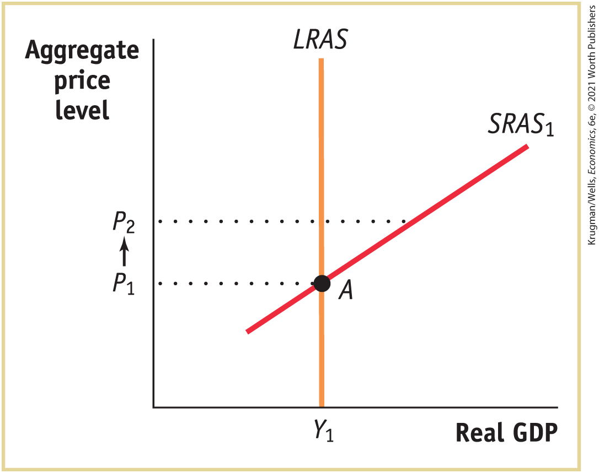
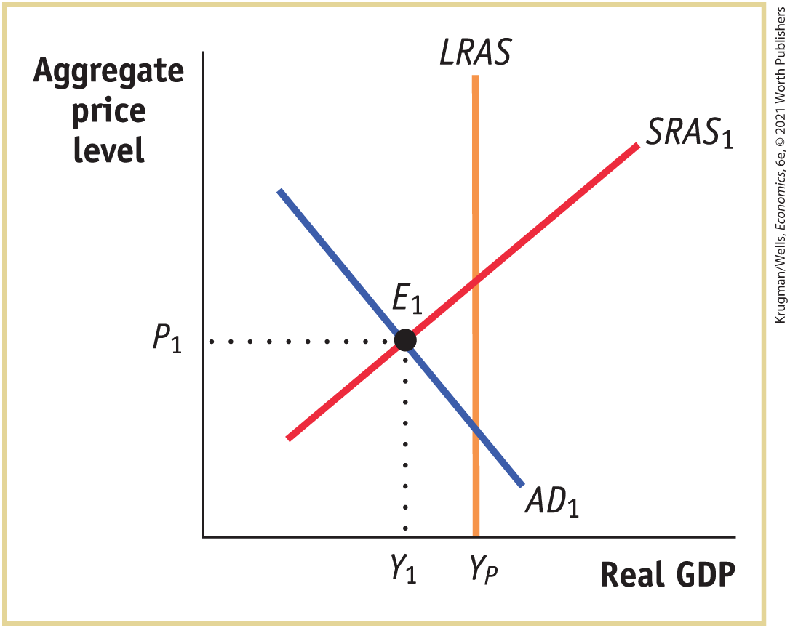
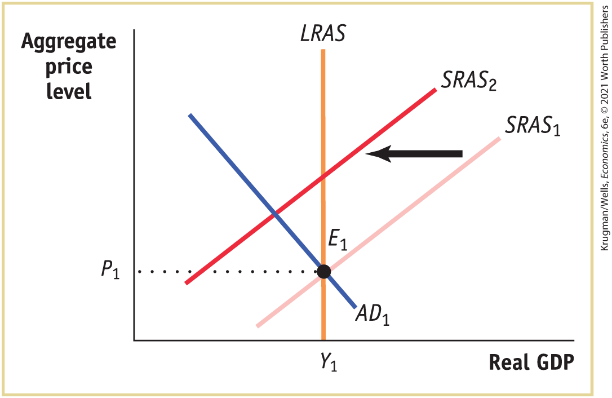

### Problems

1.  A fall in the value of the dollar against other currencies makes U.S. final goods and services cheaper to foreigners even though the U.S. aggregate price level stays the same. As a result, foreigners demand more U.S. aggregate output. Your study partner says that this represents a movement down the aggregate demand curve because foreigners are demanding more in response to a lower price. You, however, insist that this represents a rightward shift of the aggregate demand curve. Who is right? Explain.

2.  The economy is at point *A* in the accompanying diagram. Suppose that the aggregate price level rises from $P_{1}$ to $P_{2}$. How will aggregate supply adjust in the short run and in the long run to the increase in the aggregate price level? Illustrate with a diagram.<!--
<strong class="important">[Macro-12UN06</strong>]
-->

    <figure id="pau_9781319320164_9Kuy6VLvq8" class="figure lm_img_lightbox unnum c5 center">
    
    </figure>

    <aside class="hidden" id="pau_9781319320164_Ockxdw1nnS" title="hidden">

    The vertical axis, labeled Aggregate price level shows the markings at P subscript 1 and P subscript 2 from bottom to top. The horizontal axis, labeled Real G D P shows a marking at Y subscript 1. A vertical line, labeled L R A S, starts from Y subscript 1, and is parallel to the vertical axis. A positive sloping straight line, labeled S R A S subscript 1, intersects L R A S at A (Y subscript 1, P subscript1). An upward arrow points from P subscript 1 to P subscript 2 on the vertical axis. A dotted horizontal line runs from P subscript 1 to A, and another dotted horizontal line runs from P subscript 2 to a point on S R A S subscript 1.

    </aside>

3.  Suppose that all households hold all their wealth in assets that automatically rise in value when the aggregate price level rises (an example of this is what is called an “inflation-indexed bond” — a bond whose interest rate, among other things, changes one-for-one with the inflation rate). What happens to the wealth effect of a change in the aggregate price level as a result of this allocation of assets? What happens to the slope of the aggregate demand curve? Will it still slope downward? Explain.

4.  Suppose that the economy is currently at potential output. Also suppose that you are an economic policy maker and that a college economics student asks you to rank, if possible, your most preferred to least preferred type of shock: positive demand shock, negative demand shock, positive supply shock, negative supply shock. How would you rank them and why?

5.  Explain whether the following government policies affect the aggregate demand curve or the short-run aggregate supply curve and how.
    1.  The government reduces the minimum nominal wage.
    2.  The government increases Temporary Assistance for Needy Families (TANF) payments, government transfers to families with dependent children.
    3.  To reduce the budget deficit, the government announces that households will pay much higher taxes beginning next year.
    4.  The government reduces military spending.

6.  In Wageland, all workers sign annual wage contracts each year on January 1. In late January, a new computer operating system is introduced that increases labor productivity dramatically. Explain how Wageland will move from one short-run macroeconomic equilibrium to another. Illustrate with a diagram.

7.  There were two major shocks to the U.S. economy in 2007, leading to the severe recession of 2007–2009. One shock was related to oil prices; the other was the slump in the housing market. This question analyzes the effect of these two shocks on GDP using the *AD–AS* framework.
    1.  Draw typical aggregate demand and short-run aggregate supply curves. Label the horizontal axis “Real GDP” and the vertical axis “Aggregate price level.” Label the equilibrium point $E_{1}$, the equilibrium quantity $Y_{1}$, and equilibrium price $P_{1}$.
    2.  Data taken from the Department of Energy indicate that the average price of crude oil in the world increased from \$54.63 per barrel on January 5, 2007, to \$92.93 on December 28, 2007. Would an increase in oil prices cause a demand shock or a supply shock? Redraw the diagram from part a to illustrate the effect of this shock by shifting the appropriate curve.
    3.  The Housing Price Index, published by the Office of Federal Housing Enterprise Oversight, calculates that U.S. home prices fell by an average of 3.0% in the 12 months between January 2007 and January 2008. Would the fall in home prices cause a supply shock or demand shock? Redraw the diagram from part b to illustrate the effect of this shock by shifting the appropriate curve. Label the new equilibrium point $E_{3}$, the equilibrium quantity $Y_{3}$, and equilibrium price $P_{3}$.
    4.  Compare the equilibrium points $E_{1}$ and $E_{3}$ in your diagram for part c. What was the effect of the two shocks on real GDP and the aggregate price level (increase, decrease, or indeterminate)?

8.  Using aggregate demand, short-run aggregate supply, and long-run aggregate supply curves, explain the process by which each of the following economic events will move the economy from one long-run macroeconomic equilibrium to another. Illustrate with diagrams. In each case, what are the short-run and long-run effects on the aggregate price level and aggregate output?
    1.  There is a decrease in households’ wealth due to a decline in the stock market.
    2.  The government lowers taxes, leaving households with more disposable income, with no corresponding reduction in government purchases.

9.  Using aggregate demand, short-run aggregate supply, and long-run aggregate supply curves, explain the process by which each of the following government policies will move the economy from one long-run macroeconomic equilibrium to another. Illustrate with diagrams. In each case, what are the short-run and long-run effects on the aggregate price level and aggregate output?
    1.  There is an increase in taxes on households.
    2.  There is an increase in the quantity of money.
    3.  There is an increase in government spending.

10. The economy is in short-run macroeconomic equilibrium at point $E_{1}$ in the accompanying diagram. Based on the diagram, answer the following questions.<!--
<strong class="important">[Macro-12UN07</strong>]
-->

    <figure id="pau_9781319320164_fgYqwIuzP9" class="figure lm_img_lightbox unnum c5 center">
    
    </figure>

    <aside class="hidden" id="pau_9781319320164_lEtZL1LvC0" title="hidden">

    The vertical axis, labeled Aggregate price level shows a marking at P subscript 1. The horizontal axis, labeled Real G D P shows markings at Y subscript 1 and Y subscript P from left to right. A vertical straight line labeled L R A S starts from Y subscript P and is parallel to the vertical axis. A positive sloping straight line labeled S R A S subscript 1 and a negative sloping straight line labeled A D subscript 1 intersect each other at a point labeled E subscript 1 corresponding to Y subscript 1 and P subscript 1. Point E subscript 1 lies to the left of L R A S line.

    </aside>

    1.  Is the economy facing an inflationary or a recessionary gap?
    2.  What policies can the government implement that might bring the economy back to long-run macroeconomic equilibrium? Illustrate with a diagram.
    3.  If the government did not intervene to close this gap, would the economy return to long-run macroeconomic equilibrium? Explain and illustrate with a diagram.
    4.  What are the advantages and disadvantages of the government implementing policies to close the gap?

11. In the accompanying diagram, the economy is in long-run macroeconomic equilibrium at point $E_{1}$ when an oil shock shifts the short-run aggregate supply curve to $SRAS_{2}$. Based on the diagram, answer the following questions.<!--
<strong class="important">[Macro-12UN08</strong>]
-->

    <figure id="pau_9781319320164_B7o4BMet2G" class="figure lm_img_lightbox unnum c5 center">
    
    </figure>

    <aside class="hidden" id="pau_9781319320164_RgNKG9VNAg" title="hidden">

    The vertical axis, labeled Aggregate price level shows a marking at P subscript 1. The horizontal axis, labeled Real G D P shows a marking at Y subscript 1. A vertical straight line labeled L R A S starts from Y subscript 1 and is parallel to the vertical axis. Two positive sloping parallel lines are labeled S R A S subscript 1 and S R A S subscript 2. S R A S subscript 2 is on the left of S R A S subscript 1. A negative sloping straight line labeled A D subscript 1 intersects S R A S subscript 1 at E subscript 1 corresponding to Y subscript 1 and P subscript 1. The line labeled L R A S passes through E subscript 1. A leftward arrow points from S R A S subscript 1 to S R A S subscript 2.

    </aside>

    1.  How do the aggregate price level and aggregate output change in the short run as a result of the oil shock? What is this phenomenon known as?
    2.  What fiscal or monetary policies can the government use to address the effects of the supply shock? Use a diagram that shows the effect of policies chosen to address the change in real GDP. Use another diagram to show the effect of policies chosen to address the change in the aggregate price level.
    3.  Why do supply shocks present a dilemma for government policy makers?

12. The late 1990s in the United States were characterized by substantial economic growth with low inflation; that is, real GDP increased with little, if any, increase in the aggregate price level. Explain this experience using aggregate demand and aggregate supply curves. Illustrate with a diagram.

 **Work It Out**

13. In each of the following cases, in the short run, determine whether the events cause a shift of a curve or a movement along a curve. Determine which curve is involved and the direction of the change.
    1.  As a result of an increase in the value of the dollar in relation to other currencies, U.S. producers now pay less in dollar terms for foreign steel, a major commodity used in production.
    2.  An increase in the quantity of money by the Fed increases the quantity of money that people wish to lend, lowering interest rates.
    3.  Greater union activity leads to higher nominal wages.
    4.  A fall in the aggregate price level increases the purchasing power of households’ and firms’ money holdings. As a result, they borrow less and lend more. 
