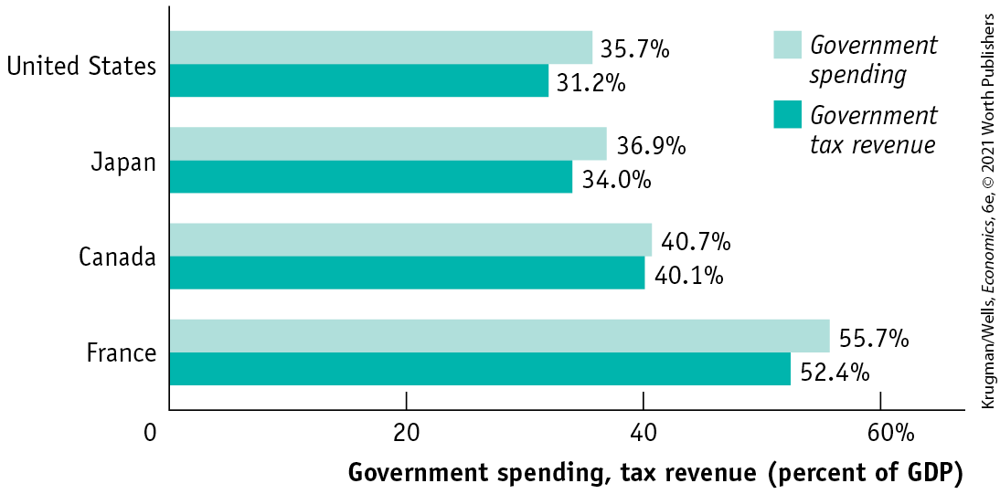
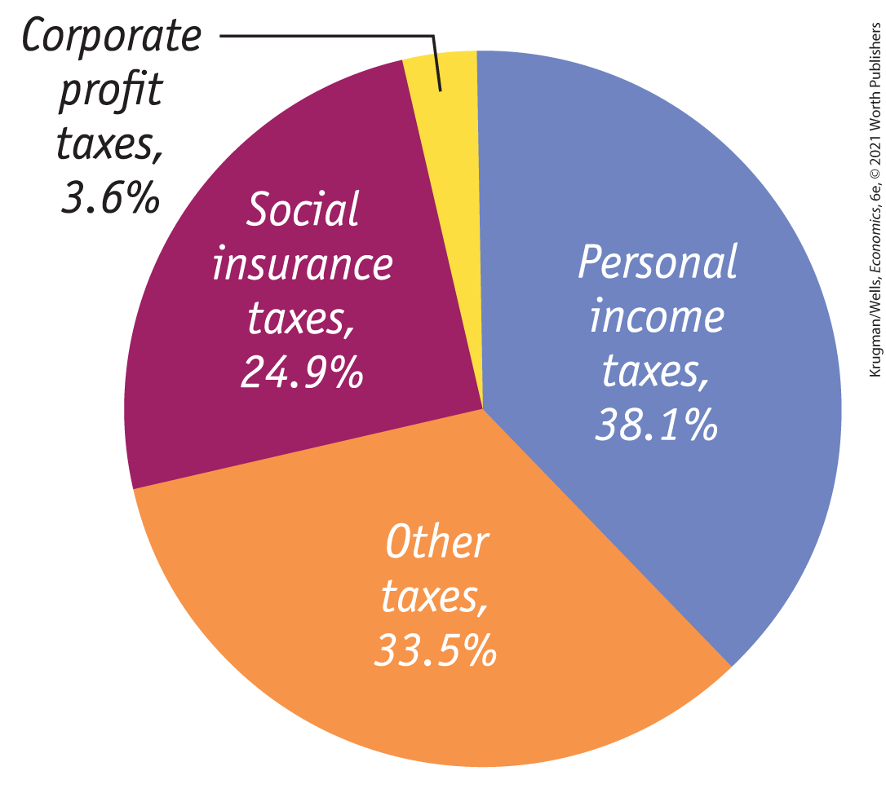
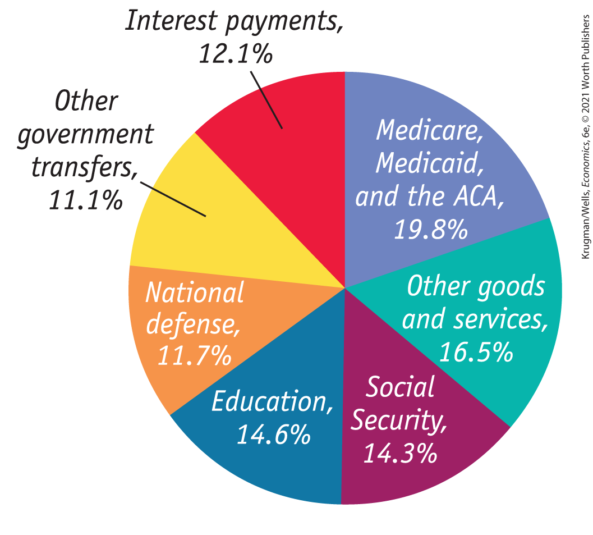
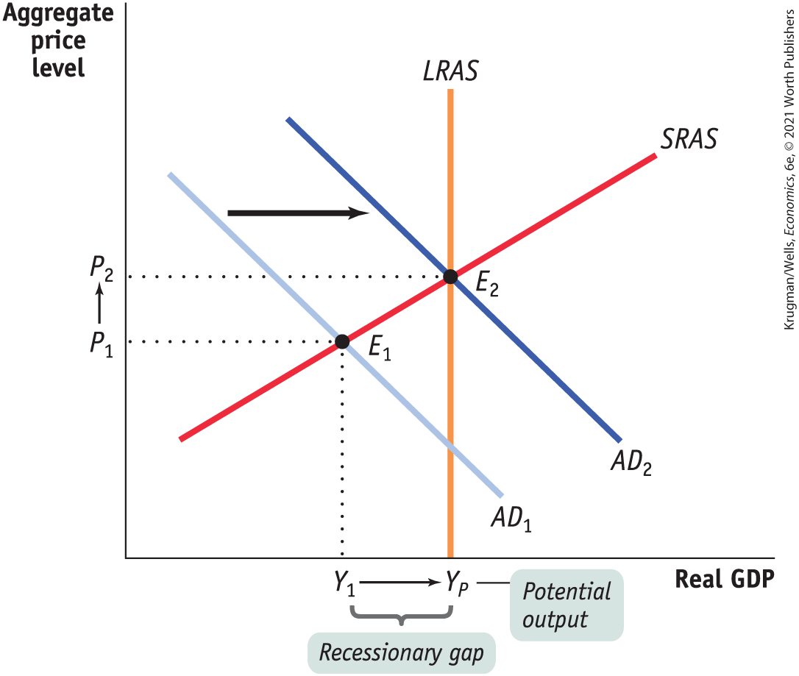
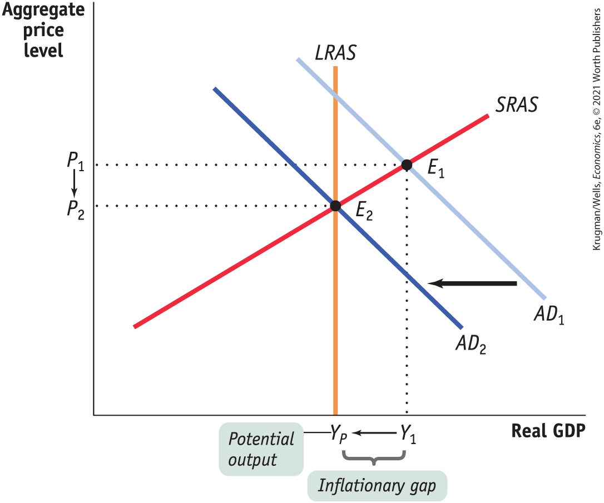

# Chapter 13 Fiscal Policy

<!--
<strong class="important">Krugman/Wells 6E Macro Chapter 13 [will also be Econ Ch 28]</strong>
--> <!--
<strong class="important">General Information: Comp will find Econ 5/e to be an excellent resource for preferences and desired layout of 6/e pages.</strong>
--> <!--
<strong class="important">[Comp: New RIGHT page.</strong>
--> <!--
<strong class="important">Verso running head: PART 6 STABILIZATION POLICY</strong>
--> <!--
<strong class="important">Recto running head: CHAPTER 13 FISCAL POLICY]</strong>
--> <!--
<strong class="important">[Macro-CO13]</strong>
--> <!--
[Macro CO13]
--> <!--
<strong class="important">[CAPTION TO COME.</strong>][Comp: Assume a two-line caption.]
--> <!--
[ED/AU: Please provide figure caption.]
-->

## SPENDING TO FIGHT A RECESSION

<figure id="pau_9781319320164_1dfdEGfD2A" class="figure lm_img_lightbox unnum c2 right">

<figcaption>
<strong>The restaurant closure caused unemployment claims to spike. By late June 2020, almost 33 million unemployed workers were receiving unemployment compensation.</strong>
</figcaption>
</figure>

<!--
<strong class="important">[Comp: set opener in 3-column format as in Econ 5e]</strong>
-->

**2020** was the year of the coronavirus — a rapidly spreading virus that quickly infected millions around the world, in many cases requiring weeks of intensive care and in all too many cases proving fatal. The pandemic also had devastating effects on the economy, leading to the steepest decline in employment and output ever recorded.

In response, in late March Congress enacted the CARES (Coronavirus Aid, Relief, and Economic Security) Act, a \$2 trillion package giving cash and loans to individuals, businesses, hospitals, and more. One main purpose of the act was to provide temporary relief to Americans who were laid off as new rules enforcing “social distancing” effectively shut down countless businesses. Across the country, restaurants were closed to limit the spread of the virus, leaving millions of food service workers unemployed.

<!--
<strong class="important">[COMP: Please carry all blue AU: notes to pages.]</strong>
--> <!--
<strong class="important"> [AU: Please review edits at the end of this paragraph. ]</strong>
-->

But the act had a secondary purpose: to sustain those parts of the economy that continued to function. There was good reason to fear that laid-off workers would cut spending on a wide variety of goods and services, leading to unnecessary unemployment in the nation as a whole. So the act gave adults making up to \$75,000 per year a \$1,200 check and an additional \$500 per child. Additionally, the act also greatly increased payments to unemployed workers. Both measures were designed to aid households harmed by stay at-home orders and the closure of nonessential businesses.

While the CARES Act was in part about disaster relief, it was also an example of *fiscal policy:* changes in taxes and government spending to stabilize the economy by shifting the aggregate demand curve. In this case the fiscal policy was *expansionary,* designed to shift the aggregate demand curve *out;* fiscal policies that shift the aggregate demand curve *in* are *contractionary.*

Fiscal policy is often controversial. When in 2009 the government engaged in expansionary fiscal policy — the so-called Obama stimulus — to fight the recession that followed the 2008 financial crisis, some believed it was a mistake to increase government spending at a time of widespread distress. One member of Congress spoke for many when he declared that the government should spend *less* in hard times: “American families are tightening their belts, but they don’t see government tightening its belt.” There were also concerns that the new spending would widen the budget deficit. But most economists believe that expansionary fiscal policy is appropriate when the economy is depressed.

<!--
<strong class="important"> [AU: Do we still need this paragraph?]</strong>
-->

The qualification — “when the economy is depressed” — is important. In 2017, eight years after the Obama stimulus, the newly elected Trump administration passed new tax cuts. In some respects these measures looked similar to the Obama stimulus, but while some economists supported the Trump stimulus, most did not — including many who had supported the Obama stimulus. Were they being inconsistent? In reality, no: in early 2009 the U.S. economy was deeply depressed and was heading further downward. By contrast, in early 2017 the economy was growing and was close to full employment. The economists who declined to support the Trump stimulus knew that stimulus, delivered at the wrong time, was likely to be counterproductive to the economy. They understood that, in making fiscal policy, timing is crucial.

In this chapter we’ll see how fiscal policy fits into the models of economic fluctuation we studied in <a href="#kru_9781319245269_ch11_01.xhtml#pau_9781319320164_qvzco1ppmg" id="kru_9781319245269_ch13_01.xhtml#pau_9781319320164_OZU0Tczm27" class="crossref">Chapters 11</a> and <a href="#kru_9781319245269_ch12_01.xhtml#pau_9781319320164_EQQUECcZyk" id="kru_9781319245269_ch13_01.xhtml#pau_9781319320164_1ZkCvoujrx" class="crossref">12</a>. We will also see why budget deficits and government debt can be problems, and why short-run and long-run considerations can pull fiscal policy in opposite directions. 

<!--
<strong class="important">[End Opening Story]</strong>
--> <!--
<strong class="important">[End of Chapter Opening Page]</strong>
-->
<aside class="learning-objectives c3 main-flow v3" epub:type="learning-objectives" id="pau_9781319320164_hKCO3v7s1S">

### WHAT YOU WILL LEARN

- What is fiscal policy and why is it an essential tool in managing economic fluctuations?
- Which policies constitute **expansionary fiscal policy** and which constitute **contractionary fiscal policy?**
- Why does fiscal policy have a multiplier effect and how is this effect influenced by **automatic stabilizers?**
- Why do governments calculate the **cyclically adjusted budget balance?**
- Why can a large **public debt** and **implicit liabilities** of the government be a cause for concern?

</aside>

## Fiscal Policy: The Basics

Modern governments in economically advanced countries spend a great deal of money and collect a lot in taxes. <a href="#kru_9781319245269_ch13_02.xhtml#pau_9781319320164_qrxMBbrC67" id="kru_9781319245269_ch13_02.xhtml#pau_9781319320164_0KTqGpCrAD" class="crossref">Figure 13-1</a> shows government spending and tax revenue as percentages of GDP for a selection of high-income countries in 2019. As you can see, the French government sector is relatively large, accounting for more than half of the French economy. The government of the United States plays a smaller role in the economy than those of Canada, Japan, and most European countries. But that role is still sizable, with the government playing a major role in the U.S. economy. As a result, changes in the federal budget — changes in government spending or in taxation — can have large effects on the American economy.

<!--
[Macro <xref rid="figure_BK_1">FIGURE 13-1</xref>]
--> <!--
[<xref rid="figure_BK_1">Figure 13-1</xref>]
-->

<figure id="pau_9781319320164_qrxMBbrC67" class="figure lm_img_lightbox num c3 main-flow">

<figcaption>
FIGURE 13-1 Government Spending and Tax Revenue for Selected High-Income Countries in 2019

Government spending and tax revenue are represented as a percentage of GDP. France has a particularly large government sector, representing more than half of its GDP. The U.S. government sector, although sizable, is smaller than those of Canada, Japan, and most European countries.

<em>Data from:</em> IMF World Economic Outlook.
</figcaption>
</figure>

<aside class="hidden" id="pau_9781319320164_UIkavHifLP" title="hidden">

The vertical axis plots the following countries from bottom to top, France, Canada, Japan, and United States. The horizontal axis labeled Government spending, tax revenue (percent of G D P) ranges from 0 to 60 percent in increments of 20 percent. The data from the graph are as follows, France: Government spending, 55.7 percent; Government tax revenue, 52.4 percent. Canada: Government spending, 40.7 percent; Government tax revenue, 40.1 percent. Japan: Government spending, 36.9 percent; Government tax revenue, 34.0 percent. United States: Government spending, 35.7 percent; Government tax revenue, 31.2 percent.

</aside>

To analyze these effects, we begin by showing how taxes and government spending affect the economy’s flow of income. Then we can see how changes in spending and tax policy affect aggregate demand.

### Taxes, Purchases of Goods and Services, Government Transfers, and Borrowing

In <a href="#kru_9781319245269_ch07_02.xhtml#pau_9781319320164_TafrofvMlE" id="kru_9781319245269_ch13_02.xhtml#pau_9781319320164_gYjveplKSc" class="crossref">Figure 7-1</a> we showed the circular flow of income and spending in the economy as a whole. One of the sectors represented in that figure was the government. Funds flow *into* the government in the form of taxes and government borrowing; funds flow *out* in the form of government purchases of goods and services and government transfers to households.

What kinds of taxes do Americans pay, and where does the money go? <a href="#kru_9781319245269_ch13_02.xhtml#pau_9781319320164_POZa8Dn49A" id="kru_9781319245269_ch13_02.xhtml#pau_9781319320164_kJztRyfmWn" class="crossref">Figure 13-2</a> shows the composition of U.S. tax revenue in 2019. Taxes, of course, are required payments to the government. In the United States, taxes are collected at the national level by the federal government; at the state level by each state government; and at local levels by counties, cities, and towns. At the federal level, the taxes that generate the greatest revenue are income taxes on both personal income and corporate profits as well as *social insurance* taxes, which we’ll explain shortly. At the state and local levels, the picture is more complex: these governments rely on a mix of sales taxes, property taxes, income taxes, and fees of various kinds.

<!--
[Macro <xref rid="figure_BK_2">Figure 13-2</xref>]
--> <!--
[<xref rid="figure_BK_2">Figure 13-2</xref>]
-->

<figure id="pau_9781319320164_POZa8Dn49A" class="figure lm_img_lightbox num c3 main-flow">

<figcaption>
FIGURE 13-2 Sources of Tax Revenue in the United States, 2019

Personal income taxes, taxes on corporate profits, and social insurance taxes account for most government tax revenue. The rest is a mix of property taxes, sales taxes, and other sources of revenue. (Percentages may not add to 100 due to rounding.)

<em>Data from:</em> Bureau of Economic Analysis.
</figcaption>
</figure>

<aside class="hidden" id="pau_9781319320164_pPdkfcQVtJ" title="hidden">

The data from the chart are as follows, Corporate profit taxes, 3.6 percent; Social insurance taxes, 24.9 percent; Other taxes, 33.5 percent; and Personal income taxes, 38.1 percent.

</aside>

Overall, taxes on personal income and corporate profits accounted for 41.2% of total government revenue in 2019; social insurance taxes accounted for 24.6%; and a variety of other taxes, collected mainly at the state and local levels, accounted for the rest.

<!--
<strong class="important">[AU/RH: Update </strong><xref rid="figure_BK_3"><strong class="important">Figure 13-3</strong></xref><strong class="important"> in pages.]</strong>
-->

<a href="#kru_9781319245269_ch13_02.xhtml#pau_9781319320164_9rQD7m0JOq" id="kru_9781319245269_ch13_02.xhtml#pau_9781319320164_rGerszsxZc" class="crossref">Figure 13-3</a> shows the composition of total U.S. government spending in 2018, which takes two broad forms. One form is purchases of goods and services. This includes everything from ammunition for the military to the salaries of public school teachers (who are treated in the national accounts as providers of a service — education). The big items here are national defense and education. The category “Other goods and services” consists mainly of state and local spending on a variety of services, from police and firefighters to highway construction and maintenance.

<!--
[Macro <xref rid="figure_BK_3">Figure 13-3</xref>]
--> <!--
[<xref rid="figure_BK_3">Figure 13-3</xref>]
-->

<figure id="pau_9781319320164_9rQD7m0JOq" class="figure lm_img_lightbox num c3 main-flow">

<figcaption>
FIGURE 13-3 Government Spending in the United States, 2018

The two types of government spending are purchases of goods and services and government transfers. The biggest items in government purchases are national defense and education. The biggest items in government transfers are Social Security, Medicare, Medicaid, and the Affordable Care Act. (Percentages do not add to 100 due to rounding.)

<em>Data from:</em> Bureau of Economic Analysis.
</figcaption>
</figure>

<aside class="hidden" id="pau_9781319320164_JYK9ePekLd" title="hidden">

The data from the chart are as follows, Other government transfers, 11.1 percent; National defense, 11.7 percent; Interest payments, 12.1 percent; Social Security, 14.3 percent; Education, 14.6 percent; Other goods and services, 16.5 percent; and Medicare, Medicaid, and the A C A, 19.8 percent.

</aside>

The other form of government spending is government transfers, which are payments by the government to households for which no good or service is provided in return. In the United States, as well as in Canada and Europe, government transfers represent a very large proportion of the budget. Most U.S. government spending on transfer payments is accounted for by the following four programs:

- Social Security, which provides guaranteed income to older Americans, disabled Americans, and the surviving spouses and dependent children of deceased or retired beneficiaries
- Medicare, which covers much of the cost of health care for Americans aged 65 or older
- Medicaid, which covers much of the cost of health care for Americans with low incomes
- The Affordable Care Act (ACA), which seeks to make health insurance available and affordable to all Americans

The term <a href="#kru_9781319245269_EM_glossary.xhtml#pau_9781319320164_gbLV6Yh1i6" id="kru_9781319245269_ch13_02.xhtml#pau_9781319320164_e0dmosxK28" class="glossref" role="doc-glossref">social insurance</a> is used to describe government programs that are intended to protect families against economic hardship. These include Social Security, Medicare, Medicaid, and the ACA, as well as smaller programs such as unemployment insurance and food stamps. The ACA works through a system of regulated private insurance markets, subsidies, and an expansion of Medicaid eligibility and is much smaller than the other three large programs. Social insurance programs in the United States are largely paid for with special, dedicated taxes on wages — the social insurance taxes mentioned earlier. The ACA is an exception: it is funded mainly by special taxes on high incomes.

<aside aria-label="title 1" class="glossary c3 main-flow v1" epub:type="glossary" id="pau_9781319320164_K8e8K5H2wW">

**social insurance**  
**Social insurance** programs are government programs intended to protect families against economic hardship.

</aside>
<!--
<strong class="important">[Comp: For Key Terms, bold punctuation follows bold word (with the exception of em dashes). See end of chapter for corresponding Margin Definition copy.]</strong>
-->

How do tax policy and government spending affect the economy? The answer is that taxation and government spending have a strong effect on total aggregate spending in the economy.

### The Government Budget and Total Spending

Let’s revisit the basic equation of national income accounting:

$$\text{GDP} = C + I + G + X - IM$$<!---->--\>

**(13-1)**

The left-hand side of this equation is GDP, the value of all final goods and services produced in the economy. The right-hand side is aggregate spending, total spending on final goods and services produced in the economy. It is the sum of consumer spending (*C*), investment spending (*I*), government purchases of goods and services (*G*), and the value of exports (*X*) minus the value of imports (*IM*). It includes all the sources of aggregate demand.

The government directly controls one of the variables on the right-hand side of <a href="#kru_9781319245269_ch13_02.xhtml#pau_9781319320164_JQlKrzcnW6" id="kru_9781319245269_ch13_02.xhtml#pau_9781319320164_qdIaPl4jj4" class="crossref">Equation 13-1</a>: government purchases of goods and services (*G*). But that’s not the only effect fiscal policy has on aggregate spending in the economy. Through changes in taxes and transfers, it also influences consumer spending (*C*) and, in some cases, investment spending (*I*).

To see why the budget affects consumer spending, recall that *disposable income,* the total income households have available to spend, is equal to the total income they receive from wages, dividends, interest, and rent, *minus* taxes, *plus* government transfers. So either an increase in taxes or a reduction in government transfers *reduces* disposable income. And a fall in disposable income, other things equal, leads to a fall in consumer spending. Conversely, either a decrease in taxes or an increase in government transfers *increases* disposable income. And a rise in disposable income, other things equal, leads to a rise in consumer spending.

The government’s ability to affect investment spending is a more complex story, which we won’t discuss in detail. The important point is that the government taxes profits, and changes in the rules that determine how much a business owes can increase or reduce the incentive to spend on investment goods.

Because the government itself is one source of spending in the economy, and because taxes and transfers can affect spending by consumers and firms, the government can use changes in taxes or government spending to *shift the aggregate demand curve.* And as we saw in <a href="#kru_9781319245269_ch12_01.xhtml#pau_9781319320164_EQQUECcZyk" id="kru_9781319245269_ch13_02.xhtml#pau_9781319320164_vEXAGZQgiO" class="crossref">Chapter 12</a>, there are sometimes good reasons to shift the aggregate demand curve.

### Expansionary and Contractionary Fiscal Policy

Why would the government want to shift the aggregate demand curve? Because it wants to close either a recessionary gap, created when aggregate output falls below potential output, or an inflationary gap, created when aggregate output exceeds potential output.

<a href="#kru_9781319245269_ch13_02.xhtml#pau_9781319320164_4qpcMnQtnY" id="kru_9781319245269_ch13_02.xhtml#pau_9781319320164_AXhzU7cjAS" class="crossref">Figure 13-4</a> shows the case of an economy facing a recessionary gap. *SRAS* is the short-run aggregate supply curve, *LRAS* is the long-run aggregate supply curve, and <!--&#x003C;&amp;lt;-->$AD_{1}$<!---->--\> is the initial aggregate demand curve. At the initial short-run macroeconomic equilibrium, <!--&#x003C;&amp;lt;-->$E_{1}$<!---->--\>, aggregate output is <!--&#x003C;&amp;lt;-->$Y_{1}$<!---->--\>, below potential output, <!--&#x003C;&amp;lt;-->$Y_{P}$<!---->--\>. What the government would like to do is increase aggregate demand, shifting the aggregate demand curve rightward to <!--&#x003C;&amp;lt;-->$AD_{2}$<!---->--\>. This would increase aggregate output, making it equal to potential output. Fiscal policy that increases aggregate demand, called <a href="#kru_9781319245269_EM_glossary.xhtml#pau_9781319320164_2QTERiZuAk" id="kru_9781319245269_ch13_02.xhtml#pau_9781319320164_H12538ajOg" class="glossref" role="doc-glossref">expansionary fiscal policy</a>, normally takes one of three forms:

<aside aria-label="title 2" class="glossary c3 main-flow v1" epub:type="glossary" id="pau_9781319320164_axMxa6JBNF">

**expansionary fiscal policy**  
**Expansionary fiscal policy** is fiscal policy that increases aggregate demand.

</aside>
<!--
[Macro <xref rid="figure_BK_4">Figure 13-4</xref>]
--> <!--
[<xref rid="figure_BK_4">Figure 13-4</xref>]
-->

<figure id="pau_9781319320164_4qpcMnQtnY" class="figure lm_img_lightbox num c3 main-flow">

<figcaption>
FIGURE 13-4 Expansionary Fiscal Policy Can Close a Recessionary Gap

The economy is in short-run macroeconomic equilibrium at <!--&#x003C;&amp;lt;--><em>E</em>1<!---->--&gt;, where the aggregate demand curve, <!--&#x003C;&amp;lt;--><em>A</em><em>D</em>1<!---->--&gt;, intersects the <em>SRAS</em> curve. However, it is not in long-run macroeconomic equilibrium. At <!--&#x003C;&amp;lt;--><em>E</em>1<!---->--&gt;, there is a recessionary gap of <!--&#x003C;&amp;lt;--><em>Y</em><em>P</em> − <em>Y</em>1<!---->--&gt;. An expansionary fiscal policy—an increase in government purchases of goods and services, a reduction in taxes, or an increase in government transfers—shifts the aggregate demand curve rightward. It can close the recessionary gap by shifting <!--&#x003C;&amp;lt;--><em>A</em><em>D</em>1<!---->--&gt; to <!--&#x003C;&amp;lt;--><em>A</em><em>D</em>2<!---->--&gt;, moving the economy to a new short-run macroeconomic equilibrium, <!--&#x003C;&amp;lt;--><em>E</em>2<!---->--&gt;, which is also a long-run macroeconomic equilibrium.
</figcaption>
</figure>

<aside class="hidden" id="pau_9781319320164_uaPsyxfH3a" title="hidden">

The vertical axis, labeled Aggregate price level shows markings at P subscript 1 and P subscript 2, from bottom to top. The horizontal axis, labeled Real G D P shows markings at Y subscript 1 and Y subscript P, from left to right. Two negative sloping straight parallel lines labeled A D subscript 1 and A D subscript 2 intersect a positive sloping straight line labeled S R A S at E subscript 1 (Y subscript 1, P subscript 1) and E subscript 2 (Y subscript P, P subscript 2), respectively. A D subscript 2 is on the right of A D subscript 1. A straight vertical line labeled L R A S starts from Y subscript P and intersects the A D subscript 2 and S R A S at E subscript 2. A rightward arrow points from A D subscript 1 to A D subscript 2. An upward arrow points from P subscript 1 to P subscript 2. A rightward arrow points from Y subscript 1 to Y subscript P. The gap between Y subscript 1 and Y subscript P is labeled Recessionary gap, and the marking, Y subscript P, is labeled Potential output.

</aside>

1.  An increase in government purchases of goods and services
2.  A cut in taxes
3.  An increase in government transfers

The 2009 stimulus (or the Recovery Act) was a combination of all three: a direct increase in federal spending and aid to state governments to help them maintain spending, tax cuts for most families, and increased aid to the unemployed. The CARES Act consisted mainly of transfers: a one-time check for \$1,200 for every American, expanded unemployment benefits, and subsidized loans to businesses. It also included some increase in spending on health care and aid to state governments.

<a href="#kru_9781319245269_ch13_02.xhtml#pau_9781319320164_aELAaVKmGH" id="kru_9781319245269_ch13_02.xhtml#pau_9781319320164_zh8oGTFSLy" class="crossref">Figure 13-5</a> shows the opposite case — an economy facing an inflationary gap. Again, *SRAS* is the short-run aggregate supply curve, *LRAS* is the long-run aggregate supply curve, and <!--&#x003C;&amp;lt;-->$AD_{1}$<!---->--\> is the initial aggregate demand curve. At the initial equilibrium, <!--&#x003C;&amp;lt;-->$E_{1}$<!---->--\>, aggregate output is <!--&#x003C;&amp;lt;-->$Y_{1}$<!---->--\>, above potential output, <!--&#x003C;&amp;lt;-->$Y_{P}$<!---->--\>. As we’ll explain in later chapters, policy makers often try to head off inflation by eliminating inflationary gaps. To eliminate the inflationary gap shown in <a href="#kru_9781319245269_ch13_02.xhtml#pau_9781319320164_aELAaVKmGH" id="kru_9781319245269_ch13_02.xhtml#pau_9781319320164_la3ccNSyPl" class="crossref">Figure 13-5</a>, fiscal policy must reduce aggregate demand and shift the aggregate demand curve leftward to <!--&#x003C;&amp;lt;-->$AD_{2}$<!---->--\>. This reduces aggregate output and makes it equal to potential output. Fiscal policy that reduces aggregate demand, called <a href="#kru_9781319245269_EM_glossary.xhtml#pau_9781319320164_fxAh6eb5ic" id="kru_9781319245269_ch13_02.xhtml#pau_9781319320164_NsOhIhcDLC" class="glossref" role="doc-glossref">contractionary fiscal policy</a>, is the opposite of expansionary fiscal policy. It is implemented in three possible ways:

<aside aria-label="title 3" class="glossary c3 main-flow v1" epub:type="glossary" id="pau_9781319320164_P7a0vcv4Pr">

**contractionary fiscal policy**  
**Contractionary fiscal policy** is fiscal policy that reduces aggregate demand.

</aside>
<!--
[Macro <xref rid="figure_BK_5">Figure 13-5</xref>]
--> <!--
[<xref rid="figure_BK_5">Figure 13-5</xref>]
-->

<figure id="pau_9781319320164_aELAaVKmGH" class="figure lm_img_lightbox num c3 main-flow">

<figcaption>
FIGURE 13-5 Contractionary Fiscal Policy Can Close an Inflationary Gap

The economy is in short-run macroeconomic equilibrium at <!--&#x003C;&amp;lt;--><em>E</em>1<!---->--&gt;, where the aggregate demand curve, <!--&#x003C;&amp;lt;--><em>A</em><em>D</em>1<!---->--&gt;, intersects the <em>SRAS</em> curve. But it is not in long-run macroeconomic equilibrium. At <!--&#x003C;&amp;lt;--><em>E</em>1<!---->--&gt;, there is an inflationary gap of <!--&#x003C;&amp;lt;--><em>Y</em>1 − <em>Y</em><em>P</em><!---->--&gt;. A contractionary fiscal policy—such as reduced government purchases of goods and services, an increase in taxes, or a reduction in government transfers—shifts the aggregate demand curve leftward. It closes the inflationary gap by shifting <!--&#x003C;&amp;lt;--><em>A</em><em>D</em>1<!---->--&gt; to <!--&#x003C;&amp;lt;--><em>A</em><em>D</em>2<!---->--&gt;, moving the economy to a new short-run macroeconomic equilibrium, <!--&#x003C;&amp;lt;--><em>E</em>2<!---->--&gt;, which is also a long-run macroeconomic equilibrium.
</figcaption>
</figure>

<aside class="hidden" id="pau_9781319320164_0cGeuqo3AG" title="hidden">

The vertical axis, labeled Aggregate price level shows markings at P subscript 2 and P subscript 1, from bottom to top. The horizontal axis, labeled Real G D P shows markings at Y subscript P and Y subscript 1, from left to right. Two negative sloping straight parallel lines labeled A D subscript 2 and A D subscript 1 intersect a positive sloping straight line labeled S R A S at E subscript 2 (Y subscript P, P subscript 2) and E subscript 1 (Y subscript 1, P subscript 1), respectively. A D subscript 2 is on the left of A D subscript 1. A straight vertical line labeled L R A S starts from Y subscript P and intersects the A D subscript 2 and S R A S at E subscript 2. A leftward arrow points from A D subscript 1 to A D subscript 2. A downward arrow points from P subscript 1 to P subscript 2. A leftward arrow points from Y subscript 1 to Y subscript P. The gap between Y subscript P and Y subscript 1 is labeled Inflationary gap, and the marking, Y subscript P, is labeled Potential output.

</aside>

1.  A reduction in government purchases of goods and services
2.  An increase in taxes
3.  A reduction in government transfers

A classic example of contractionary fiscal policy occurred in 1968, when U.S. policy makers grew worried about rising inflation. President Lyndon Johnson imposed a temporary 10% surcharge on taxable income — everyone’s income taxes were increased by 10%. He also tried to scale back government purchases of goods and services, which had risen dramatically because of the cost of the Vietnam War.

### Can Expansionary Fiscal Policy Actually Work?

In practice, the use of fiscal policy — in particular, the use of expansionary fiscal policy in the face of a recessionary gap — is often controversial. We’ll examine the origins of these controversies in detail in <a href="#kru_9781319245269_ch17_01.xhtml#pau_9781319320164_BiQPlLMEHW" id="kru_9781319245269_ch13_02.xhtml#pau_9781319320164_cwEGdmrbQp" class="crossref">Chapter 17</a>. But for now, let’s quickly summarize the major points of the debate over expansionary fiscal policy, so we can understand when the critiques are justified and when they are not.

There are three main arguments against the use of expansionary fiscal policy.

1.  Government spending always crowds out private spending.
2.  Government borrowing always crowds out private investment spending.
3.  Government budget deficits lead to reduced private spending.

The first of these claims is wrong in principle, but it has nonetheless played a prominent role in public debates. The second is valid under some, but not all, circumstances. The third argument, although it raises some important issues, isn’t a good reason to believe that expansionary fiscal policy doesn’t work.

#### Claim 1: “Government Spending Always Crowds Out Private Spending.”

Some claim that expansionary fiscal policy can never raise aggregate spending and therefore can never raise aggregate income, with reasons that go something like this: “Every dollar that the government spends is a dollar taken away from the private sector. So any rise in government spending must be offset by an equal fall in private spending.” In other words, every dollar spent by the government *crowds out,* or displaces, a dollar of private spending.

But the statement is wrong because it assumes that resources in the economy are always fully employed and, as a result, the aggregate income earned in the economy is always a fixed sum — which isn’t true. In reality, whether or not government spending crowds out private spending depends upon the state of the economy. In particular, when the economy is suffering from a recessionary gap, there are unemployed resources in the economy, and output (and therefore income) is below its potential level. Expansionary fiscal policy during these periods puts unemployed resources to work and generates higher spending and higher income. Government spending crowds out private spending only when the economy is operating at full employment. So the argument that expansionary fiscal policy always crowds out private spending is wrong in principle.

#### Claim 2: “Government Borrowing Always Crowds Out Private Investment Spending.”

In <a href="#kru_9781319245269_ch10_01.xhtml#pau_9781319320164_GbPAtnS6LO" id="kru_9781319245269_ch13_02.xhtml#pau_9781319320164_lIuE0jDC5O" class="crossref">Chapter 10</a>, we discussed the possibility that government borrowing uses funds that would have otherwise been used for private investment spending — that is, it crowds out private investment spending. So how valid is the argument that government borrowing always reduces private investment spending?

Much like Claim 1, Claim 2 is wrong because whether crowding out occurs depends upon whether the economy is depressed or not. If the economy is not depressed, then increased government borrowing, by increasing the demand for loanable funds, can raise interest rates and crowd out private investment spending. However, if the economy is depressed, crowding out is much less likely to occur. When the economy is at far less than full employment, a fiscal expansion will lead to higher incomes, which in turn leads to increased savings at any given interest rate. This larger pool of savings allows the government to borrow without driving up interest rates. The 2009 stimulus was a case in point: despite high levels of government borrowing, U.S. interest rates stayed near historic lows. In the end, government borrowing crowds out private investment spending only when the economy is operating at full employment (which is why most economists declined to endorse the Trump administration’s 2017 tax cuts).

#### Claim 3: “Government Budget Deficits Lead to Reduced Private Spending.”

Other things equal, expansionary fiscal policy leads to a larger budget deficit and greater government debt. And higher debt will eventually require the government to raise taxes to pay it off. So, according to the third argument against expansionary fiscal policy, consumers, anticipating that they must pay higher taxes in the future to pay off today’s government debt, will cut their spending today in order to save money. This argument, first made by nineteenth-century economist David Ricardo, is known as *Ricardian equivalence.* It is an argument often taken to imply that expansionary fiscal policy will have no effect on the economy because far-sighted consumers will undo any attempts at expansion by the government. (And will also undo any contractionary fiscal policy, for that matter.)

In reality, however, it’s doubtful that consumers behave with such foresight and budgeting discipline. Most people, when provided with extra cash (generated by fiscal expansion), will spend at least some of it. So even fiscal policy that takes the form of temporary tax cuts or transfers of cash to consumers probably does have an expansionary effect.

Moreover, it’s possible to show that even with Ricardian equivalence, a temporary rise in government spending that involves direct purchases of goods and services — such as a program of road construction — would still lead to a boost in total spending in the near term. That’s because even if consumers cut back their current spending in anticipation of higher future taxes, their reduced spending will take place over an extended period as consumers save over time to pay the future tax bill. Meanwhile, the additional government spending will be concentrated in the near future, when the economy needs it.

So although the effects emphasized by Ricardian equivalence may reduce the impact of fiscal expansion, the claim that it makes fiscal expansion completely ineffective is neither consistent with how consumers actually behave nor a reason to believe that increases in government spending have no effect. So, in the end, it’s not a valid argument against expansionary fiscal policy.

#### In Sum

The extent to which we should expect expansionary fiscal policy to work depends upon the circumstances. When the economy has a recessionary gap — as it did when the 2009 stimulus was passed — economics tells us that this is just the kind of situation in which expansionary fiscal policy helps the economy. However, when the economy is already at full employment, as it seemed to be in 2017, when the Trump tax cuts went into effect, expansionary fiscal policy is the wrong policy and will lead to crowding out, an overheated economy, and higher inflation. (As it turned out, the economy was probably further from full employment in 2017 than most economists believed, so that the adverse effects of the stimulus weren’t obvious.)
