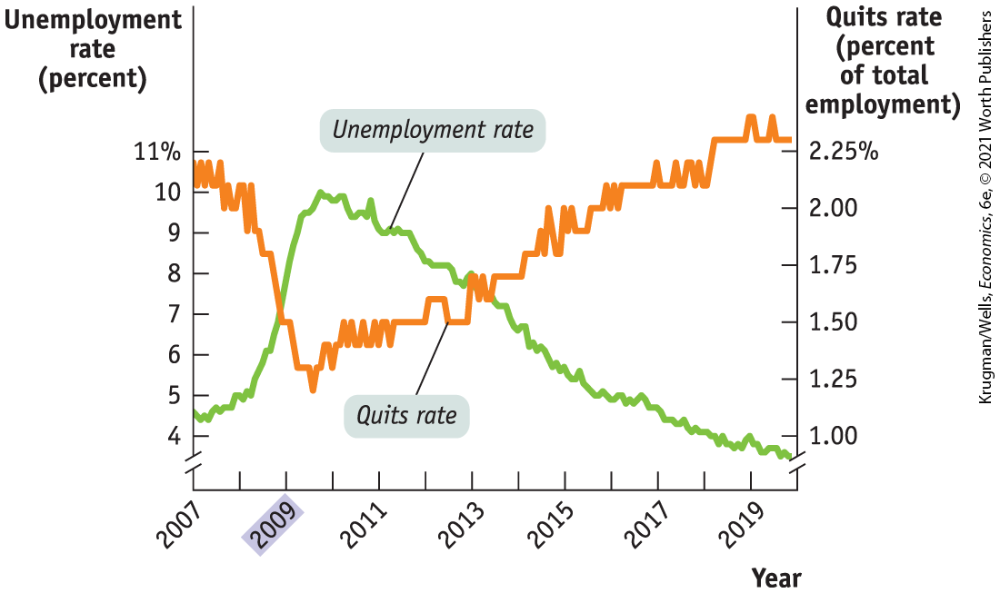
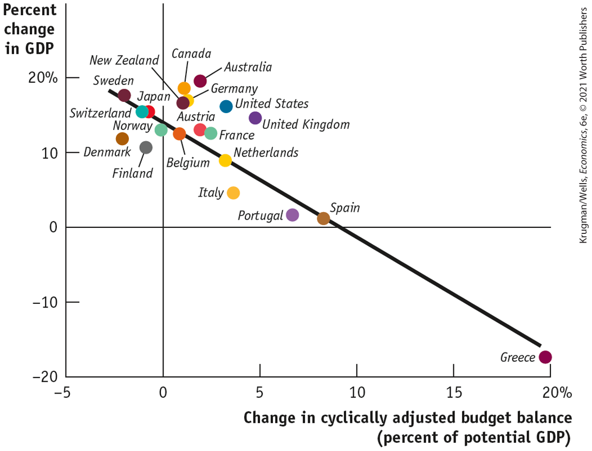

### A Cautionary Note: Lags in Fiscal Policy

Looking back at <a href="#kru_9781319245269_ch13_02.xhtml#pau_9781319320164_4qpcMnQtnY" id="kru_9781319245269_ch13_02.xhtml#pau_9781319320164_YqPLzKLaxX" class="crossref">Figures 13-4</a> and <a href="#kru_9781319245269_ch13_02.xhtml#pau_9781319320164_aELAaVKmGH" id="kru_9781319245269_ch13_02.xhtml#pau_9781319320164_tFXaMAn8aE" class="crossref">13-5</a>, it may seem obvious that the government should actively use fiscal policy — always adopting an expansionary fiscal policy when the economy faces a recessionary gap and always adopting a contractionary fiscal policy when the economy faces an inflationary gap. But many economists caution against an extremely active stabilization policy, arguing that a government that tries too hard to stabilize the economy — through either fiscal policy or monetary policy — can end up making the economy less stable.

We’ll leave discussion of the warnings associated with monetary policy to <a href="#kru_9781319245269_ch15_01.xhtml#pau_9781319320164_4oAIkgdXHI" id="kru_9781319245269_ch13_02.xhtml#pau_9781319320164_1s62FpNtf3" class="crossref">Chapter 15</a>. In the case of fiscal policy, one key reason for caution is that there are important *time lags* between when the policy is decided upon and when it is implemented. To understand the nature of these lags, consider the three things that have to happen before the government increases spending to fight a recessionary gap.

1.  The government has to realize that the recessionary gap exists: economic data take time to collect and analyze, and recessions are often recognized only months after they have begun. Although the Great Recession is generally considered to have begun in December 2007, as late as September 2008 some economists were still questioning whether the recession was real.
2.  The government has to develop a spending plan, which can itself take months, particularly if politicians take time debating how the money should be spent and passing legislation.
3.  It takes time to spend money. For example, a road construction project begins with activities such as surveying that don’t involve spending large sums. It may be quite some time before the big spending begins. The Recovery Act was passed in the first quarter of 2009, but much of its effect on federal spending, especially purchases of goods and services, didn’t come until 2011.

Because of these lags, an attempt to increase spending to fight a recessionary gap may take so long to get going that the economy has already recovered on its own. In fact, the recessionary gap may have turned into an inflationary gap by the time expansionary fiscal policy takes effect. In that case, expansionary fiscal policy will make things worse instead of better.

<!--
[INSERT PHOTO Macro-13UN01: PU Macro5e p. 381, Bottom/Construction project]
--> <!--
[Macro-13UN01]
-->

<figure id="pau_9781319320164_tNLA2gCHCA" class="figure lm_img_lightbox unnum c2 right">

<figcaption>
In making fiscal policy, timing is crucial.
</figcaption>
</figure>

This doesn’t mean that fiscal policy should never be actively used. In early 2009 there was good reason to believe that the slump facing the U.S. economy would be both deep and long and that a fiscal stimulus designed to arrive over the next year or two would almost surely push aggregate demand in the right direction. In fact, as we’ll see later in this chapter, the 2009 stimulus arguably faded out too soon, leaving the economy still deeply depressed when it ended. But the problem of lags makes the actual use of both fiscal and monetary policy harder than you might think from a simple analysis like the one we have just given.

<!--
<strong class="important">[Start EIA] [NOTE: EIA runs in exactly as shown in MS. It DOES NOT float. ALL SUCH.]</strong>
-->

### ECONOMICS \>\> *in Action*

A Tale of Two Stimuli

There were some broad similarities between the Obama stimulus of 2009 and proposals that were floated by the Trump administration soon after it took office in early 2017, including the passage of new tax cuts that started in 2018 and proposed new infrastructure spending. Yet many economists who supported the Obama stimulus were dubious about the Trump plan, because the state of the economy had changed.

<a href="#kru_9781319245269_ch13_02.xhtml#pau_9781319320164_5sXBe189dO" id="kru_9781319245269_ch13_02.xhtml#pau_9781319320164_XvIdW8lLUB" class="crossref">Figure 13-6</a> shows two indicators that played an important role in policy discussions at both times. One is the unemployment rate. The other is the *quits rate,* the fraction of workers voluntarily leaving their jobs each month. This rate is widely viewed as an indication of how good the labor market is: workers are reluctant to quit if they believe new jobs are very hard to find. For this reason, the quits rate is a useful backup to the unemployment rate: if you’re unsure whether the unemployment rate is giving an accurate read on the situation, you can check whether the quits rate is telling the same story.

<!--
<strong class="important">[AU/RH: Update </strong><xref rid="figure_BK_6"><strong class="important">Figure 13-6</strong></xref><strong class="important"> in pages.]</strong>
--> <!--
[Macro <xref rid="figure_BK_6">Figure 13-6</xref>]
--> <!--
[<xref rid="figure_BK_6">Figure 13-6</xref>]
-->

<figure id="pau_9781319320164_5sXBe189dO" class="figure lm_img_lightbox num c3 main-flow">

<figcaption>
FIGURE 13-6 Comparing the State of the U.S. Economy in 2009 and 2017

<em>Data from:</em> Federal Reserve Bank of St. Louis.
</figcaption>
</figure>

<aside class="hidden" id="pau_9781319320164_50ZxWaGJ4l" title="hidden">

The left vertical axis, labeled Unemployment rate (percent) is truncated and ranges from 4 to 11 percent in increments of 1 percent. The right vertical axis, labeled Quits rate (percent of total employment) is truncated and ranges from 1 to 2.25 percent in increments of 0.25 percent. The horizontal axis, labeled Year ranges from 2007 to 2020 in increments of 1 year. A curve representing Unemployment rate passes through the approximate points as follows, (2007, 4.5), (2009, 7), (2010, 10), (2011, 9), (2013, 7.5), (2015, 6), (2017, 4.5), and (2020, 3). The curve representing Quits rate passes through the approximate points as follows, (2007, 2.15), (2009, 1.35), (2010, 1.25), (2011, 1.50), (2013, 1.70), (2015, 2.00), (2017, 2.15), and (2020, 2.30).

</aside>

What you can see from <a href="#kru_9781319245269_ch13_02.xhtml#pau_9781319320164_5sXBe189dO" id="kru_9781319245269_ch13_02.xhtml#pau_9781319320164_vLvwUSpf9n" class="crossref">Figure 13-6</a> is that in early 2009 the United States showed all the signs of a deeply depressed economy, in the grip of an accelerating plunge, with unemployment high and rising and the quits rate low and falling. By late 2017, when the tax cuts took effect, however, the data were telling the opposite story: a low unemployment rate and a high quits rate indicated that jobs were relatively plentiful.

This difference meant that the case for expansionary fiscal policy was much weaker in 2017 than it had been in 2009: under 2017 conditions it seemed likely that increased government spending would crowd out private spending and that increased government borrowing would crowd out private investment. It was possible to favor the Trump administration’s proposals for a variety of reasons. But the macroeconomics of fiscal policy made the potential downside much higher than it had been in 2009.

<!--
<strong class="important">[End EIA]</strong>
--> <!--
<strong class="important">[Quick Review and Check Your Understanding position exactly where shown in MS. They do not float. ALL SUCH. See layouts for recto/verso design differences.]</strong>
-->

### \>\> *Quick Review*

- The main channels of fiscal policy are taxes and government spending. Government spending takes the form of purchases of goods and services as well as transfers.
- In the United States, most government transfers are accounted for by **social insurance** programs designed to alleviate economic hardship — principally Social Security, Medicare, Medicaid, and the Affordable Care Act (ACA).
- The government controls *G* directly and influences *C* and *I* through taxes and transfers.
- **Expansionary fiscal policy** is implemented by an increase in government spending, a cut in taxes, or an increase in government transfers. **Contractionary fiscal policy** is implemented by a reduction in government spending, an increase in taxes, or a reduction in government transfers.
- Arguments against the effectiveness of expansionary fiscal policy based upon crowding out are valid only when the economy is at or close to full employment. The argument that expansionary fiscal policy won’t work because of Ricardian equivalence — that consumers will cut back spending today to offset expected future tax increases — appears to be untrue in practice. What is clearly true is that time lags can reduce the effectiveness of fiscal policy and potentially render it counterproductive.

### \>\> *Check Your Understanding* 13-1

1.  In each of the following cases, determine whether the policy is expansionary or contractionary fiscal policy.
    1.  Several military bases around the country, which together employ tens of thousands of people, are closed.
    2.  The number of weeks an unemployed person is eligible for unemployment benefits is increased.
    3.  The federal tax on gasoline is increased.
2.  Explain why federal disaster relief, which quickly disburses funds to victims of natural disasters such as hurricanes, floods, and large-scale crop failures, will stabilize the economy more effectively after a disaster than relief that must be legislated.
3.  Is the following statement true or false? Explain. “When the government expands, the private sector shrinks; when the government shrinks, the private sector expands.”

## Fiscal Policy and the Multiplier

An expansionary fiscal policy, like the 2009 stimulus, pushes the aggregate demand curve to the right. A contractionary fiscal policy pushes the aggregate demand curve to the left. For policy makers, however, knowing the direction of the shift isn’t enough: they need estimates of *how much* a given policy will shift the aggregate demand curve. To get these estimates, they use the concept of the multiplier, which we learned about in <a href="#kru_9781319245269_ch11_01.xhtml#pau_9781319320164_qvzco1ppmg" id="kru_9781319245269_ch13_03.xhtml#pau_9781319320164_AqxHHlx751" class="crossref">Chapter 11</a>.

### Multiplier Effects of an Increase in Government Purchases of Goods and Services

<!--
<strong class="important">[Macro-13UN02]</strong>
--> <!--
[Macro-13UN02][Comp: Please use silhouette version used in 5/e]
-->

Suppose that a government decides to spend \$50 billion building bridges and roads. The government’s purchases of goods and services will directly increase total spending on final goods and services by \$50 billion. But as we learned in <a href="#kru_9781319245269_ch11_01.xhtml#pau_9781319320164_qvzco1ppmg" id="kru_9781319245269_ch13_03.xhtml#pau_9781319320164_qEa31g2eCV" class="crossref">Chapter 11</a>, there will also be an indirect effect: the government’s purchases will start a chain reaction throughout the economy. The firms that produce the goods and services purchased by the government earn revenues that flow to households in the form of wages, profits, interest, and rent. This increase in disposable income leads to a rise in consumer spending. The rise in consumer spending, in turn, induces firms to increase output, leading to a further rise in disposable income, which leads to another round of consumer spending increases, and so on.

<figure id="pau_9781319320164_zybmy9wy8f" class="figure lm_img_lightbox unnum c2 right">

<figcaption>
Expansionary or contractionary fiscal policy will start a chain reaction throughout the economy.
</figcaption>
</figure>

As we know, the *multiplier* is the ratio of the change in real GDP caused by an autonomous change in aggregate spending to the size of that autonomous change. An increase in government purchases of goods and services is a prime example of such an autonomous increase in aggregate spending.

In <a href="#kru_9781319245269_ch11_01.xhtml#pau_9781319320164_qvzco1ppmg" id="kru_9781319245269_ch13_03.xhtml#pau_9781319320164_rtYkG2bqJr" class="crossref">Chapter 11</a> we considered a simple case in which there are no taxes or international trade, so that any change in GDP accrues entirely to households. We also assumed that the aggregate price level is fixed, so that any increase in nominal GDP is also a rise in real GDP, and that the interest rate is fixed. In that case the multiplier is <!--&#x003C;&amp;lt;-->$1\text{/(}1 - MPC\text{)}$<!---->--\>. Recall that *MPC* is the *marginal propensity to consume,* the fraction of an additional dollar in disposable income that is spent. For example, if the marginal propensity to consume is 0.5, the multiplier is <!--&#x003C;&amp;lt;-->$1\text{/(}1 - 0.5\text{)} = 1\text{/}0.5 = 2$<!---->--\>. Given a multiplier of 2, a \$50 billion increase in government purchases of goods and services would increase real GDP by \$100 billion. Of that \$100 billion, \$50 billion is the initial effect from the increase in *G,* and the remaining \$50 billion is the subsequent effect arising from the increase in consumer spending.

What happens if government purchases of goods and services are instead reduced? The math is exactly the same, except that there’s a minus sign in front: if government purchases of goods and services fall by \$50 billion and the marginal propensity to consume is 0.5, real GDP falls by \$100 billion.

### Multiplier Effects of Changes in Government Transfers and Taxes

Expansionary or contractionary fiscal policy need not take the form of changes in government purchases of goods and services. Governments can also change transfer payments or taxes. In general, however, a change in government transfers or taxes shifts the aggregate demand curve by *less* than an equal-sized change in government purchases, resulting in a smaller effect on real GDP.

To see why, imagine that instead of spending \$50 billion on building bridges, the government simply hands out \$50 billion in the form of government transfers. In this case, there is no direct effect on aggregate demand, as there was with government purchases of goods and services. Real GDP goes up because households spend some of that \$50 billion — but they won’t spend it all.

<a href="#kru_9781319245269_ch13_03.xhtml#pau_9781319320164_hF4eVqstkx" id="kru_9781319245269_ch13_03.xhtml#pau_9781319320164_Y9dSfxBNSI" class="crossref">Table 13-1</a> shows a hypothetical comparison of two expansionary fiscal policies assuming an *MPC* equal to 0.5: one in which the government directly purchases \$50 billion in goods and services and one in which the government makes transfer payments instead, sending out \$50 billion in checks to consumers. In each case there is a first-round effect on real GDP, either from purchases by the government or from purchases by the consumers who received the checks, followed by a series of additional rounds as rising real GDP raises disposable income.

<!--
[<xref rid="table_BK_1">Table 13-1</xref> is from Macro p. 390]
-->

| Effect on real GDP                      | \$50 billion rise in government purchases of goods and services                                                                                                                                                                                                                                         | \$50 billion rise in government transfer payments                                                                                                                                                                                                                                                                                                                  |
|-----------------------------------------|---------------------------------------------------------------------------------------------------------------------------------------------------------------------------------------------------------------------------------------------------------------------------------------------------------|--------------------------------------------------------------------------------------------------------------------------------------------------------------------------------------------------------------------------------------------------------------------------------------------------------------------------------------------------------------------|
| First round                             | \$50 billion                                                                                                                                                                                                                                                                                            | \$25 billion                                                                                                                                                                                                                                                                                                                                                       |
| Second round                            | \$25 billion                                                                                                                                                                                                                                                                                            | \$12.5 billion                                                                                                                                                                                                                                                                                                                                                     |
| Third round                             | \$12.5 billion                                                                                                                                                                                                                                                                                          | \$6.25 billion                                                                                                                                                                                                                                                                                                                                                     |
| •                                       | •                                                                                                                                                                                                                                                                                                       | •                                                                                                                                                                                                                                                                                                                                                                  |
| •                                       | •                                                                                                                                                                                                                                                                                                       | •                                                                                                                                                                                                                                                                                                                                                                  |
| •                                       | •                                                                                                                                                                                                                                                                                                       | •                                                                                                                                                                                                                                                                                                                                                                  |
| Total effect                            | \$100 billion                                                                                                                                                                                                                                                                                           | \$50 billion                                                                                                                                                                                                                                                                                                                                                       |
| **Total effect in terms of multiplier** | <!--&#x003C;&amp;lt;-->$\mathbf{\Delta}\mathbf{Y} = \mathbf{\Delta}\mathbf{G}\,\mathbf{\times}\,\mathbf{1}\mathbf{/(}\mathbf{1} - \mathbf{M}\mathbf{P}\mathbf{C}\mathbf{)}$<!---->--\> | <!--&#x003C;&amp;lt;-->$\mathbf{\Delta}\mathbf{Y} = \mathbf{\Delta}\mathbf{T}\mathbf{R}\,\mathbf{\times}\,\mathbf{M}\mathbf{P}\mathbf{C}\,\mathbf{\times}\,\mathbf{1}\mathbf{/(}\mathbf{1} - \mathbf{M}\mathbf{P}\mathbf{C}\mathbf{)}$<!---->--\> |

TABLE 13-1 Hypothetical Effects of a Fiscal Policy When <!--&#x003C;&amp;lt;-->$\mathbf{M}\mathbf{P}\mathbf{C}\mathbf{~=~}\mathbf{0.5}$<!---->--\>

However, the first-round effect of the transfer program is smaller. Because we have assumed that the *MPC* is 0.5, only \$25 billion of the \$50 billion is spent, with the other \$25 billion saved. And as a result, all the further rounds are smaller, too. In the end, the transfer payment increases real GDP by only \$50 billion, equal to <!--&#x003C;&amp;lt;-->$MPC \times 1\text{/(}1 - MPC\text{)}$<!---->--\>. In comparison, a \$50 billion increase in government purchases produces a \$100 billion increase in real GDP, equal to <!--&#x003C;&amp;lt;-->$1\text{/(}1 - MPC\text{)}$<!---->--\>.

Overall, when expansionary fiscal policy takes the form of a rise in transfer payments, real GDP may rise by either more or less than the initial government outlay — that is, the multiplier may be either more or less than 1 depending upon the size of the *MPC.* In <a href="#kru_9781319245269_ch13_03.xhtml#pau_9781319320164_hF4eVqstkx" id="kru_9781319245269_ch13_03.xhtml#pau_9781319320164_hcYOxwLvKU" class="crossref">Table 13-1</a>, with an *MPC* equal to 0.5, the multiplier is exactly 1: a \$50 billion rise in transfer payments increases real GDP by \$50 billion. If the *MPC* is less than 0.5, so that a smaller share of the initial transfer is spent, the multiplier on that transfer is *less* than 1. If a larger share of the initial transfer is spent, the multiplier is *more* than 1.

A tax cut has an effect similar to the effect of a transfer. It increases disposable income, leading to a series of increases in consumer spending. But the overall effect is smaller than that of an equal-sized increase in government purchases of goods and services: the autonomous increase in aggregate spending is smaller because households save part of the amount of the tax cut.

We should also note that taxes introduce a further complication — they typically change the size of the multiplier. That’s because in the real world governments rarely impose <a href="#kru_9781319245269_EM_glossary.xhtml#pau_9781319320164_TSLVtetpmw" id="kru_9781319245269_ch13_03.xhtml#pau_9781319320164_0JNGjEpOqS" class="glossref" role="doc-glossref">lump-sum taxes</a>, in which the amount of tax a household owes is independent of its income. With lump-sum taxes there is no change in the multiplier. Instead, the great majority of tax revenue is raised via taxes that are not lump-sum, and so tax revenue depends upon the level of real GDP. As we’ll discuss shortly, and analyze in detail in this chapter’s appendix, non-lump-sum taxes reduce the size of the multiplier.

<aside aria-label="title 1" class="glossary c3 main-flow v1" epub:type="glossary" id="pau_9781319320164_49o9uPi3bE">

**lump-sum taxes**  
**Lump-sum taxes** are taxes that don’t depend on the taxpayer’s income.

</aside>

In practice, economists often argue that the size of the multiplier determines *who* among the population should get tax cuts or increases in government transfers. For example, compare the effects of an increase in unemployment benefits to a cut in taxes on profits distributed to shareholders as dividends. Consumer surveys suggest that the average unemployed worker will spend a higher share of any increase in their disposable income than would the average recipient of dividend income. That is, people who are unemployed tend to have a higher *MPC* than people who own a lot of stocks because the latter tend to be wealthier and tend to save more of any increase in disposable income. If that’s true, a dollar spent on unemployment benefits increases aggregate demand more than a dollar’s worth of dividend tax cuts.

### How Taxes Affect the Multiplier

When we introduced the analysis of the multiplier in <a href="#kru_9781319245269_ch11_01.xhtml#pau_9781319320164_qvzco1ppmg" id="kru_9781319245269_ch13_03.xhtml#pau_9781319320164_2xeK11NCUJ" class="crossref">Chapter 11</a>, we simplified matters by assuming that a \$1 increase in real GDP raises disposable income by \$1. In fact, however, government taxes capture some part of the increase in real GDP that occurs in each round of the multiplier process, since most government taxes depend positively on real GDP. As a result, disposable income increases by considerably less than \$1 once we include taxes in the model.

The increase in government tax revenue when real GDP rises isn’t the result of a deliberate decision or action by the government. It’s a consequence of the way the tax laws are written, which causes most sources of government revenue to increase *automatically* when real GDP goes up. For example, income tax receipts increase when real GDP rises because the amount each individual owes in taxes depends positively on their income, and households’ taxable incomes rise when real GDP rises. Sales tax receipts increase when real GDP rises because people with more income spend more on goods and services. And corporate profit tax receipts increase when real GDP rises because profits increase when the economy expands.

The effect of these automatic increases in tax revenue is to reduce the size of the multiplier. Remember, the multiplier is the result of a chain reaction in which higher real GDP leads to higher disposable income, which leads to higher consumer spending, which leads to further increases in real GDP. The fact that the government siphons off some of any increase in real GDP means that at each stage of this process, the increase in consumer spending is smaller than it would be if taxes weren’t part of the picture. The result is to reduce the multiplier.

In fact, the effect of taxes on the multiplier is very similar to the effect of international trade, which also reduces the multiplier. In one case the multiplier process is weakened because at each stage some spending “leaks” into imports; in the other case, income “leaks” into taxes. The appendix to this chapter shows how to derive the multiplier when taxes that depend positively on real GDP are taken into account.

Many macroeconomists believe it’s a good thing that taxes reduce the multiplier. In the previous chapter we argued that most, though not all, recessions are the result of negative demand shocks. The same mechanism that makes tax revenue increase when the economy expands makes tax revenue decrease when the economy contracts. Since tax receipts decrease when real GDP falls, the effects of these negative demand shocks are smaller than they would be in a world in which there were no taxes. The decrease in tax revenue reduces the adverse effect of the initial fall in aggregate demand.

The automatic decrease in government tax revenue generated by a fall in real GDP — caused by a decrease in the amount of taxes households pay — acts like an automatic expansionary fiscal policy implemented in the face of a recession. Similarly, when the economy expands, the government finds itself automatically pursuing contractionary fiscal policy — a tax increase. Government spending and taxation rules that cause fiscal policy to be automatically expansionary when the economy contracts and automatically contractionary when the economy expands, without requiring any deliberate action by policy makers, are called <a href="#kru_9781319245269_EM_glossary.xhtml#pau_9781319320164_SE9DfpkY8h" id="kru_9781319245269_ch13_03.xhtml#pau_9781319320164_AmdblVCjJc" class="glossref" role="doc-glossref">automatic stabilizers</a>.

<aside aria-label="title 2" class="glossary c3 main-flow v1" epub:type="glossary" id="pau_9781319320164_JoPpF11Ixw">

**automatic stabilizers**  
**Automatic stabilizers** are government spending and taxation rules that cause fiscal policy to be automatically expansionary when the economy contracts and automatically contractionary when the economy expands.

</aside>

The rules that govern tax collection aren’t the only automatic stabilizers, although they are the most important ones. Some types of government transfers also play a stabilizing role. For example, more people receive unemployment insurance when the economy is depressed than when it is booming. The same is true of Medicaid and food stamps. So transfer payments tend to rise when the economy is contracting and fall when the economy is expanding. Like changes in tax revenue, these automatic changes in transfers tend to reduce the size of the multiplier because the total change in disposable income that results from a given rise or fall in real GDP is smaller.

As in the case of government tax revenue, many macroeconomists believe that it’s a good thing that government transfers reduce the multiplier. Expansionary and contractionary fiscal policies that are the result of automatic stabilizers are widely considered helpful to macroeconomic stabilization because they blunt the extremes of the business cycle.

<!--
<strong class="important">[Macro-13UN03]</strong>
--> <!--
[Macro-13UN03]
-->

<figure id="pau_9781319320164_tzBQMeA0sr" class="figure lm_img_lightbox unnum c2 right">

<figcaption>
During the Great Depression, the Works Progress Administration (WPA), an example of discretionary fiscal policy, put millions of unemployed Americans to work constructing bridges, roads, buildings, dams, and parks.
</figcaption>
</figure>

But what about fiscal policy that *isn’t* the result of automatic stabilizers? <a href="#kru_9781319245269_EM_glossary.xhtml#pau_9781319320164_VpXv4BmS2R" id="kru_9781319245269_ch13_03.xhtml#pau_9781319320164_kdRfubS5M1" class="glossref" role="doc-glossref">Discretionary fiscal policy</a> is the direct result of deliberate actions by policy makers rather than automatic adjustment. For example, during a recession, the government may pass legislation that cuts taxes and increases government spending in order to stimulate the economy. In general, economists tend to support the use of discretionary fiscal policy only in the case of a severe recession or sustained economic weakness.

<aside aria-label="title 3" class="glossary c3 main-flow v1" epub:type="glossary" id="pau_9781319320164_oqbcCL4rF2">

**discretionary fiscal policy**  
**Discretionary fiscal policy** is fiscal policy that is the result of deliberate actions by policy makers rather than rules.

</aside>
<!--
<strong class="important">[Start EIA]</strong>
--> <!--
<strong class="important">[Comp: insert globe icon.]</strong>
-->

### ECONOMICS \>\> *in Action*

Austerity and the Multiplier

We’ve explained the logic of the fiscal multiplier, but what empirical evidence do economists have about multiplier effects in practice? Until a few years ago, the answer would have been that we didn’t have nearly as much evidence as we’d like.

The problem was that large changes in fiscal policy are fairly rare, and usually happen at the same time other things are taking place, making it hard to separate the effects of spending and taxes from those of other factors. For example, the U.S. government drastically increased spending during World War II. But it also instituted rationing of many consumer goods and restricted construction of new homes in order to conserve resources for the war effort. So it is hard to distinguish the effects of the increase in government spending from the transformation of a peacetime economy to a war economy.

However, more recent events offer considerable new evidence. In the wake of the Global Financial Crisis of 2009, several European governments found themselves facing debt crises. As loans they had taken out came due, these governments were either unable to raise new funds or were forced to pay extremely high interest rates. As a result, they had to turn to the rest of Europe for aid. In an attempt to reduce budget deficits, a condition of this aid was *austerity* — sharp cuts in spending plus tax increases. Austerity is a form of contractionary fiscal policy. So by comparing the economic performance of countries forced into austerity with the performance of countries that weren’t, we get a relatively clear view of the effects of changes in spending and taxes.

<a href="#kru_9781319245269_ch13_03.xhtml#pau_9781319320164_X0DvOuPhw8" id="kru_9781319245269_ch13_03.xhtml#pau_9781319320164_bLhARQtRGH" class="crossref">Figure 13-7</a> compares the amount of austerity imposed in a number of countries between 2009 and 2013 to the growth in their GDP over the same period. (We end the analysis in 2013 because European debt markets calmed down in late 2012, and the pressure for harsh austerity was greatly reduced.) Austerity is measured on the horizontal axis by the change in the *cyclically adjusted budget balance,* defined later in this chapter. As you can see, Greece stands out. It was forced to impose severe spending cuts and suffered a huge fall in output. But even without Greece there is a clear negative relationship. A line fitted through the scatterplot has a slope of <!--&#x003C;&amp;lt;-->$- 1.5$. That is, the figure suggests that spending cuts and tax increases had an average multiplier of 1.5. Put another way, a contractionary fiscal policy that took \$1 out of the economy resulted in a \$1.50 fall in GDP.

<!--
[Macro-<xref rid="figure_BK_7">Figure 13-7</xref>]
--> <!--
[<xref rid="figure_BK_7">Figure 13-7</xref>]
-->

<figure id="pau_9781319320164_X0DvOuPhw8" class="figure lm_img_lightbox num c3 main-flow">

<figcaption>
FIGURE 13-7 The Fiscal Multiplier, 2009–2013

<em>Data from:</em> International Monetary Fund.
</figcaption>
</figure>

<aside class="hidden" id="pau_9781319320164_dzyPg8KXcr" title="hidden">

The vertical axis, labeled Percent change in G D P ranges from negative 20 to 20 percent in increments of 10 percent. The horizontal axis, labeled Change in cyclically adjusted budget balance (percent of potential G D P) ranges from negative 5 to 20 percent in increments of 5 percent. The approximate data from the graph are as follows, Sweden (negative 2, 18), Japan (negative 1, 15), Switzerland (negative 1.5, 15), Denmark (negative 2, 11), Belgium (1, 12), Netherlands (4, 10), Spain (8, 1), Finland (negative 1, 10), New Zealand (1, 16), Canada (1, 19), Australia (2, 20), Germany (1, 17), United States (4, 16), United Kingdom (5, 15), Austria (2, 12), France (3, 12), Italy (4, 4), Portugal (7, 2), and Greece (20, negative 18). A negative sloping line touches the points representing Sweden, Switzerland, Japan, Belgium, Netherlands, and Spain.

</aside>

Economists have offered a number of qualifications and caveats to this result, given that this wasn’t truly a controlled experiment. Yet recent experience strongly supports the proposition that fiscal policy does indeed move GDP in the predicted direction, with a multiplier of more than 1.

<!--
<strong class="important">[End Box]</strong>
-->

### \>\> *Quick Review*

- The amount by which changes in government purchases raise real GDP is determined by the multiplier.
- Changes in taxes and government transfers also move real GDP, but by less than equal-sized changes in government purchases.
- Taxes reduce the size of the multiplier unless they are **lump-sum taxes.**
- Taxes and some government transfers act as **automatic stabilizers** as tax revenue responds positively to changes in real GDP and some government transfers respond negatively to changes in real GDP. Many economists believe that it is a good thing that they reduce the size of the multiplier. In contrast, economists tend to support the use of **discretionary fiscal policy** only during severe recessions or periods of sustained economic weakness.

### \>\> *Check Your Understanding* 13-2

1.  Explain why a \$500 million increase in government purchases of goods and services will generate a larger rise in real GDP than a \$500 million increase in government transfers.
2.  Explain why a \$500 million reduction in government purchases of goods and services will generate a larger fall in real GDP than a \$500 million reduction in government transfers.
3.  The country of Boldovia has no unemployment insurance benefits and a tax system using only lump-sum taxes. The neighboring country of Moldovia has generous unemployment benefits and a tax system in which residents must pay a percentage of their income. Which country will experience greater variation in real GDP in response to positive and negative demand shocks? Explain.

## The Budget Balance

Headlines about the government’s budget tend to focus on just one point: whether the government is running a surplus or a deficit and, in either case, how big. People usually think of surpluses as good: when the federal government ran a record surplus in 2000, many people regarded it as a cause for celebration. Conversely, people usually think of deficits as bad: when the U.S. federal government ran record deficits from 2009 to 2011, many people regarded it as a cause for concern.

How do surpluses and deficits fit into the analysis of fiscal policy? Are deficits ever a good thing and surpluses a bad thing? To answer those questions, let’s look at the causes and consequences of surpluses and deficits.

### The Budget Balance as a Measure of Fiscal Policy

What do we mean by surpluses and deficits? The budget balance, which was defined in <a href="#kru_9781319245269_ch10_01.xhtml#pau_9781319320164_GbPAtnS6LO" id="kru_9781319245269_ch13_04.xhtml#pau_9781319320164_iwd3S3iAvt" class="crossref">Chapter 10</a>, is the difference between the government’s revenue, in the form of tax revenue, and its spending, both on goods and services and on government transfers, in a given year. That is, the budget balance — savings by government — is defined by <a href="#kru_9781319245269_ch13_04.xhtml#pau_9781319320164_iYSCZvs5sH" id="kru_9781319245269_ch13_04.xhtml#pau_9781319320164_CUFKJoveh3" class="crossref">Equation 13-2</a> (which is the same as <a href="#kru_9781319245269_ch10_02.xhtml#pau_9781319320164_hAGJ2QCo6p" id="kru_9781319245269_ch13_04.xhtml#pau_9781319320164_XFfynnGK95" class="crossref">Equation 10-7</a>):

$$S_{Government} = T - G - TR$$<!---->--\>

**(13-2)**

where *T* is the value of tax revenues, *G* is government purchases of goods and services, and *TR* is the value of government transfers. As we’ve learned, a budget surplus is a positive budget balance and a budget deficit is a negative budget balance.

Other things equal, expansionary fiscal policies — increased government purchases of goods and services, higher government transfers, or lower taxes — reduce the budget balance for that year. That is, expansionary fiscal policies make a budget surplus smaller or a budget deficit bigger. Conversely, contractionary fiscal policies — reduced government purchases of goods and services, lower government transfers, or higher taxes — increase the budget balance for that year, making a budget surplus bigger or a budget deficit smaller.

You might think this means that changes in the budget balance can be used to measure fiscal policy. In fact, economists often do just that: they use changes in the budget balance as a “quick-and-dirty” way to assess whether current fiscal policy is expansionary or contractionary. But they always keep in mind two reasons this quick-and-dirty approach is sometimes misleading:

1.  Two different changes in fiscal policy that have equal-sized effects on the budget balance may have quite unequal effects on the economy. As we have already seen, changes in government purchases of goods and services have a larger effect on real GDP than equal-sized changes in taxes and government transfers.
2.  Often, changes in the budget balance are themselves the result, not the cause, of fluctuations in the economy.

To understand the second point, we need to examine the effects of the business cycle on the budget.
