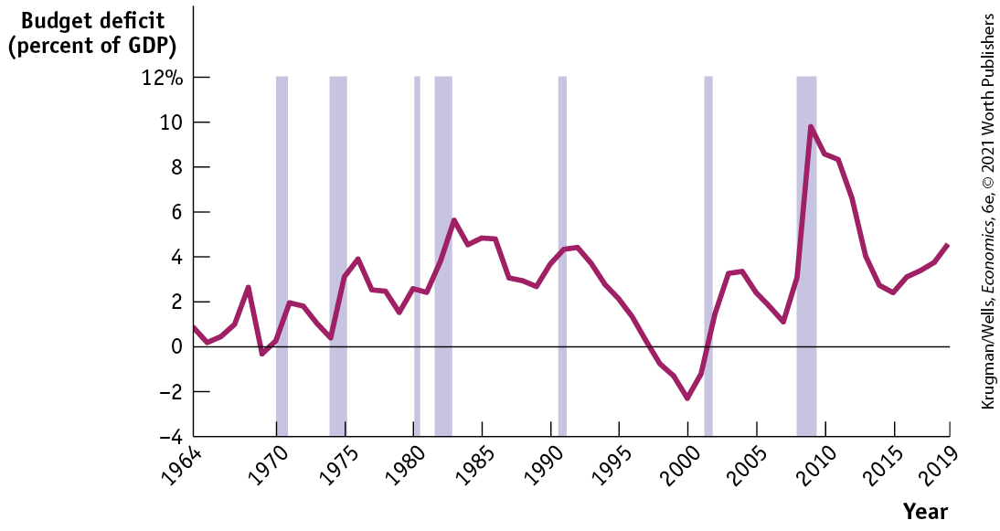
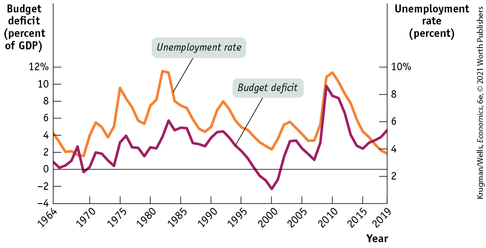
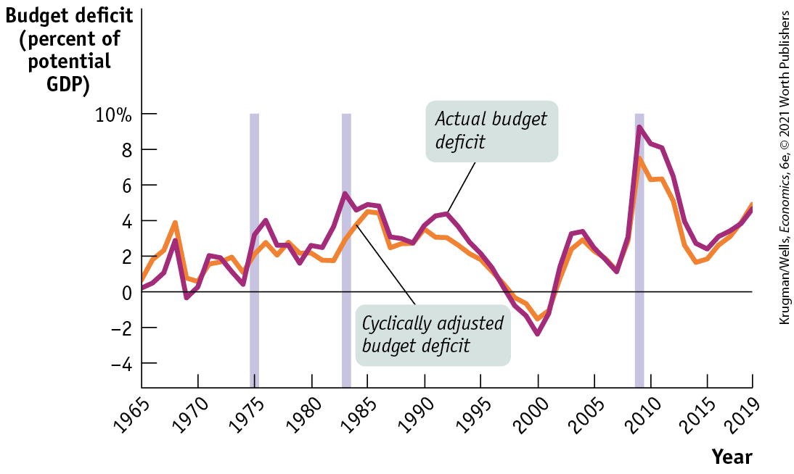
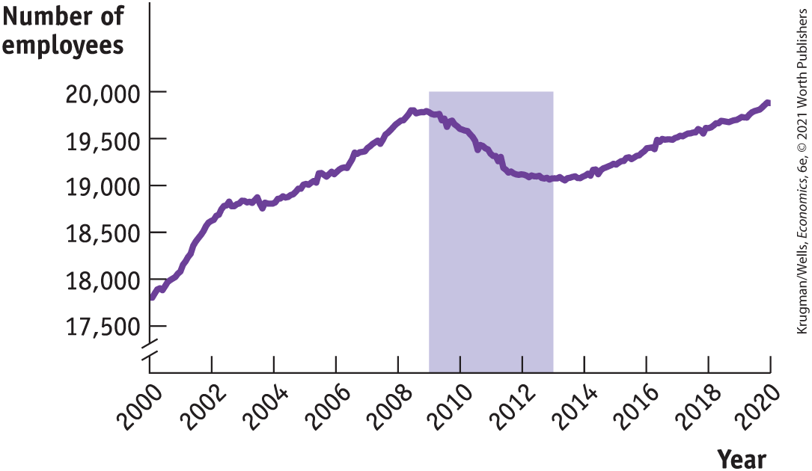
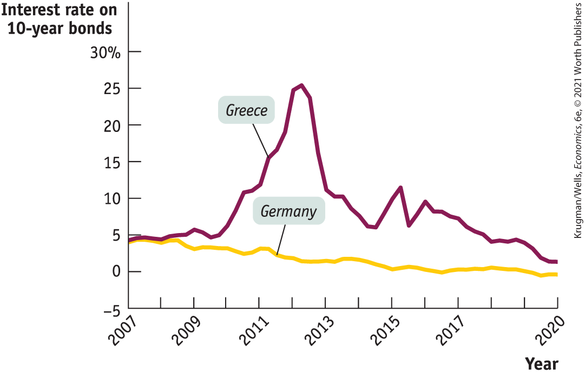
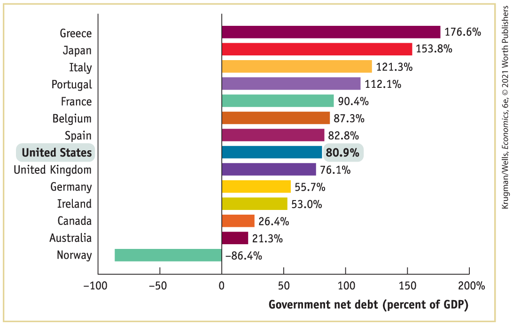
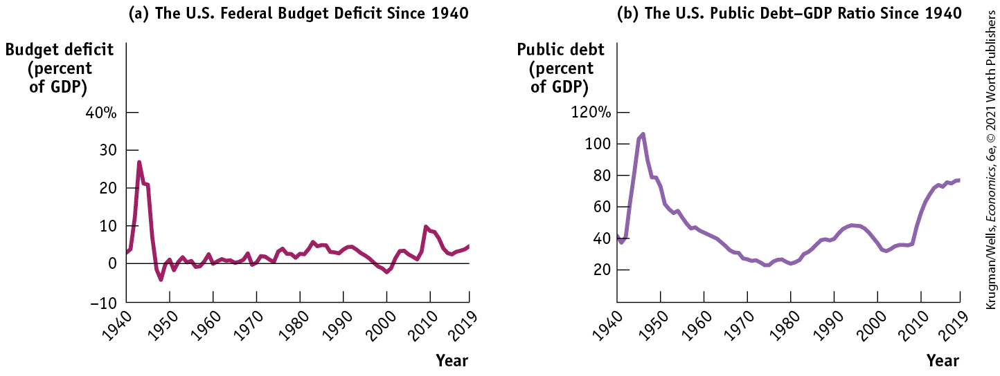

### The Business Cycle and the Cyclically Adjusted Budget Balance

Historically there has been a strong relationship between the federal government’s budget balance and the business cycle. The budget tends to move into deficit when the economy experiences a recession, but deficits tend to get smaller or even turn into surpluses when the economy is expanding. <a href="#kru_9781319245269_ch13_04.xhtml#pau_9781319320164_Q7IW6ohBlt" id="kru_9781319245269_ch13_04.xhtml#pau_9781319320164_29zOaw9AQR" class="crossref">Figure 13-8</a> shows the federal budget deficit as a percentage of GDP from 1964 to 2019. Shaded areas indicate recessions; unshaded areas indicate expansions. As you can see, the federal budget deficit increased around the time of each recession and usually declined during expansions. In fact, in the late stages of the long expansion from 1991 to through early 2001, the deficit actually became negative — the budget deficit became a budget surplus.

<!--
[Macro <xref rid="figure_BK_8">Figure 13-8</xref>]
--> <!--
[<xref rid="figure_BK_8">Figure 13-8</xref>]
-->

<figure id="pau_9781319320164_Q7IW6ohBlt" class="figure lm_img_lightbox num c3 main-flow">

<figcaption>
FIGURE 13-8 The U.S. Federal Budget Deficit and the Business Cycle, 1964–2019

The budget deficit as a percentage of GDP tends to rise during recessions (indicated by shaded areas) and fall during expansions.

<em>Data from:</em> Federal Reserve Bank of St. Louis.
</figcaption>
</figure>

<aside class="hidden" id="pau_9781319320164_RVEGbXcN4Q" title="hidden">

The vertical axis, labeled Budget deficit (percent of G D P) ranges from negative 4 to 12 percent in increments of 2 percent. The horizontal axis, labeled Year shows a marking at 1964 and then ranges from 1970 to 2015 in increments of 5 years with an additional marking at 2019. The curve representing Budget deficit passes through the approximate points as follows, (1964, 1), (1968, 3), (1969, negative 0.5), (1971, 2), (1974, 0.5), (1977, 4), (1979, 2), (1983, 6), (1989, 3), (1991, 4), (2000, negative 2.5), (2004, 3), (2007, 1), (2009, 10), (2015, 3), and (2019, 4). The following shaded areas indicate recessions, 1971, 1974, 1981, 1983, 1991, 2002, and 2009, and the remaining unshaded areas indicate expansions.

</aside>

The relationship between the business cycle and the budget balance is even clearer if we compare the budget deficit as a percentage of GDP with the unemployment rate, as we do in <a href="#kru_9781319245269_ch13_04.xhtml#pau_9781319320164_0COC3xUW1O" id="kru_9781319245269_ch13_04.xhtml#pau_9781319320164_rNYCqNx1y6" class="crossref">Figure 13-9</a>. The budget deficit almost always rises when the unemployment rate rises and falls when the unemployment rate falls.

<!--
[Macro <xref rid="figure_BK_9">Figure 13-9</xref>]
--> <!--
[<xref rid="figure_BK_9">Figure 13-9</xref>]
-->

<figure id="pau_9781319320164_0COC3xUW1O" class="figure lm_img_lightbox num c3 main-flow">

<figcaption>
FIGURE 13-9 The U.S. Federal Budget Deficit and the Unemployment Rate, 1964–2019

There is a close relationship between the budget balance and the business cycle: a recession moves the budget balance toward deficit, but an expansion moves it toward surplus. Here, the unemployment rate serves as an indicator of the business cycle, and we should expect to see a higher unemployment rate associated with a higher budget deficit. This is confirmed by the figure: the budget deficit as a percentage of GDP moves closely in tandem with the unemployment rate.

<em>Data from:</em> Federal Reserve Bank of St. Louis.
</figcaption>
</figure>

<aside class="hidden" id="pau_9781319320164_lWxcHpeKtc" title="hidden">

The left vertical axis, labeled Budget deficit (percent of G D P) ranges from negative 4 to 12 percent in increments of 2 percent. The right vertical axis, labeled Unemployment rate (percent) ranges from negative 2 to 10 percent in increments of 2 percent. The horizontal axis, labeled Year shows a marking at 1964 and then ranges from 1970 to 2015 in increments of 5 years with an additional marking at 2019. The curve representing Budget deficit passes through the approximate points as follows, (1964, 1), (1967, 2.5), (1970, 0), (1975, 0.5), (1977, 4), (1980, 2), (1985, 5), (1990, 4), (1995, 2), (2000, negative 2), (2005, 3), (2007, 1),(2010, 10), (2015, 3), and (2019, 4). The curve representing Unemployment rate passes through the approximate points as follows, (1964, 5), (1969, 3), (1972, 6), (1974, 5), (1975, 9), (1980, 6), (1982, 9.5), (1985, 6), (1989, 5), (1992, 7), (2000, 4), (2003, 6), (2007, 4.5), (2010, 9.8), and (2019, 3.8).

</aside>

Is this relationship between the business cycle and the budget balance evidence that policy makers engage in discretionary fiscal policy, using expansionary fiscal policy during recessions and contractionary fiscal policy during expansions? Not necessarily. To a large extent the relationship in <a href="#kru_9781319245269_ch13_04.xhtml#pau_9781319320164_0COC3xUW1O" id="kru_9781319245269_ch13_04.xhtml#pau_9781319320164_pKmPlZamG1" class="crossref">Figure 13-9</a> reflects automatic stabilizers at work. As we saw earlier in the discussion of automatic stabilizers, government tax revenue tends to rise and some government transfers, like unemployment benefit payments, tend to fall when the economy expands. Conversely, government tax revenue tends to fall and some government transfers tend to rise when the economy contracts. So the budget tends to move toward surplus during expansions and toward deficit during recessions even without any deliberate action on the part of policy makers.

<!--
<strong class="important">[AU: Ryan&#x2019;s question: Should we point out the divide that is occurring between the two (government tax revenue and govt transfers)?]</strong>
-->

In assessing budget policy, it’s often useful to separate movements in the budget balance due to the business cycle from movements due to discretionary fiscal policy changes. The former are affected by automatic stabilizers and the latter by deliberate changes in government purchases, government transfers, or taxes. It’s important to realize that business-cycle effects on the budget balance are temporary: both recessionary gaps (in which real GDP is below potential output) and inflationary gaps (in which real GDP is above potential output) tend to be eliminated in the long run. Removing their effects on the budget balance sheds light on whether the government’s taxing and spending policies are sustainable in the long run.

In other words, do the government’s tax policies yield enough revenue to fund its spending in the long run? As we’ll learn shortly, this is a fundamentally more important question than whether the government runs a budget surplus or deficit in the current year.

To separate the effect of the business cycle from the effects of other factors, many governments produce an estimate of what the budget balance would be if there were neither a recessionary nor an inflationary gap. The <a href="#kru_9781319245269_EM_glossary.xhtml#pau_9781319320164_n2nminDy33" id="kru_9781319245269_ch13_04.xhtml#pau_9781319320164_jQ7H7wCICe" class="glossref" role="doc-glossref">cyclically adjusted budget balance</a> is an estimate of what the budget balance would be if real GDP were exactly equal to potential output. It takes into account the extra tax revenue the government would collect and the transfers it would save if a recessionary gap were eliminated — or the revenue the government would lose and the extra transfers it would make if an inflationary gap were eliminated.

<aside aria-label="title 1" class="glossary c3 main-flow v1" epub:type="glossary" id="pau_9781319320164_pEqEDHZmaH">

**cyclically adjusted budget balance**  
The **cyclically adjusted budget balance** is an estimate of what the budget balance would be if real GDP were exactly equal to potential output.

</aside>

<a href="#kru_9781319245269_ch13_04.xhtml#pau_9781319320164_0zpunUlDDe" id="kru_9781319245269_ch13_04.xhtml#pau_9781319320164_n3EPIo3tbH" class="crossref">Figure 13-10</a> shows the actual budget deficit and the Congressional Budget Office estimate of the cyclically adjusted budget deficit, both as a percentage of potential GDP, from 1965 to 2019. As you can see, the cyclically adjusted budget deficit doesn’t fluctuate as much as the actual budget deficit. In particular, large actual deficits, such as those of 1975, 1983, and 2009 (indicated by the purple bars), are mostly due to a depressed economy.

<!--
[Macro <xref rid="figure_BK_10">Figure 13-10</xref>]
--> <!--
[<xref rid="figure_BK_10">Figure 13-10</xref>]
-->

<figure id="pau_9781319320164_0zpunUlDDe" class="figure lm_img_lightbox num c3 main-flow">

<figcaption>
FIGURE 13-10 The Actual Budget Deficit versus the Cyclically Adjusted Budget Deficit, 1965–2019

The cyclically adjusted budget deficit is an estimate of what the budget deficit would be if the economy was at potential output. It fluctuates less than the actual budget deficit because years of large budget deficits also tend to be years when the economy has a large recessionary gap. The large actual deficits in 1975, 1983, and 2009 (which are reported in the following year) are indicated by the vertical purple bars. These deficits were mostly due to a depressed economy.

<em>Data from:</em> Congressional Budget Office.
</figcaption>
</figure>

<aside class="hidden" id="pau_9781319320164_uAaYhUmvHd" title="hidden">

The vertical axis, labeled Budget deficit ranges from negative 4 to 10 percent in increments of 2 percent. The horizontal axis, labeled Year ranges from 1965 to 2015 in increments of 5 years with an additional marking at 2019. The curve representing actual budget deficit passes through the approximate points as follows, (1965, 0), (1968, 3), (1969, negative 0.5), (1975, 3), (1983, 5), (1990, 3), (2000, negative 3), (2004, 4), (2007, 1), (2009, 9), (2010, 8), (2015, 3), and (2019, 5). The cyclically adjusted budget deficit passes through the approximate points as follows, (1965, 1), (1968, 4), (1974, 1), (1982, 2), (1986, 5), (2000, negative 1), (2005, 3), (2007, 1), (2010, 7), (2014, 2), and (2019, 5). The years, 1975, 1983, and 2009, are indicated by shaded vertical bars.

</aside>

### Should the Budget Be Balanced?

Persistent budget deficits can cause problems for both the government and the economy. Yet politicians are often tempted to run deficits because this allows them to cater to voters by cutting taxes without cutting spending or by increasing spending without increasing taxes. As a result, there are occasional attempts by policy makers to force fiscal discipline by introducing legislation — even a constitutional amendment — forbidding the government from running budget deficits. This is usually stated as a requirement that the budget be balanced — that revenues at least equal spending each fiscal year. Would it be a good idea to require a balanced budget annually?

Most economists don’t think so. They believe that the government should only balance its budget on average — that it should be allowed to run deficits in bad years, offset by surpluses in good years. They don’t believe the government should be forced to run a balanced budget *every year* because this would undermine the role of taxes and transfers as automatic stabilizers.

As we’ve learned, the tendency of tax revenue to fall and transfers to rise when the economy contracts helps to limit the size of recessions. But falling tax revenue and rising transfer payments generated by a downturn in the economy push the budget toward deficit. If constrained by a balanced-budget rule, the government would have to respond to this deficit with contractionary fiscal policies that would tend to deepen a recession.

Yet policy makers concerned about excessive deficits sometimes feel that rigid rules prohibiting — or at least setting an upper limit on — deficits are necessary. In fact, as the following Economics in Action explains, state and local governments do have such rules, which had a major impact on fiscal policy during the Great Recession and in its aftermath.

<!--
<strong class="important">[Start EIA]</strong>
-->

### ECONOMICS \>\> *in Action*

Trying to Balance Budgets in a Recession

When the Great Recession struck, the U.S. federal government’s budget deficit increased from just \$160 billion to \$1.4 trillion, partly because of stimulus measures but mainly because of automatic stabilizers: revenue fell sharply, while some expenditures, especially unemployment benefits, rose. Many observers worried about this deficit, but most economists thought that trying to balance the budget in the face of a recession would actually make that recession worse.

When it comes to government spending in America, however, the federal government isn’t the only player. State and local governments account for about 40% of total government spending, and most government employment. (Most government employees are in positions that deliver essential services, such as schoolteachers, police officers, and firefighters.) And almost all of these state and local governments have rules requiring that they balance their budgets all the time.

There are a number of reasons for these rules, which make sense for each individual state or city. Taken together, however, the rules mean that for a large part of government in the United States, automatic stabilizers don’t work. In fact, state and local governments cut back sharply in the face of a depressed economy, especially after 2010, when federal aid from the 2009 stimulus ended. <a href="#kru_9781319245269_ch13_04.xhtml#pau_9781319320164_6YdibgzGuG" id="kru_9781319245269_ch13_04.xhtml#pau_9781319320164_VUZQq0K0sC" class="crossref">Figure 13-11</a> shows the number of state and local employees from 2000 to 2020; as you can see, from 2009 until 2013 (the period shaded in purple), there were large cuts, mainly layoffs of teachers, in the face of falling revenues.

<!--
[Macro <xref rid="figure_BK_11">Figure 13-11</xref>]
--> <!--
[<xref rid="figure_BK_11">Figure 13-11</xref>]
-->

<figure id="pau_9781319320164_6YdibgzGuG" class="figure lm_img_lightbox num c3 main-flow">

<figcaption>
FIGURE 13-11 State and Local Government Employment, 2000–2020

<em>Data from:</em> Bureau of Labor Statistics; Federal Reserve Bank of St. Louis.
</figcaption>
</figure>

<aside class="hidden" id="pau_9781319320164_9gjnevXKDe" title="hidden">

The vertical axis, labeled Number of employees is truncated and ranges from 17,500 to 20,000 in increments of 500. The horizontal axis, labeled Year ranges from 2000 to 2020 in increments of 2 years. The graph plots a curve that passes through the approximate points as follows, (2000, 17,750), (2003, 18,750), (2009, 19,750), (2013, 19,000), and (2020, 19,800). Years between 2009 and 2013 are indicated by a shaded vertical bar.

</aside>

These actions at the state and local levels didn’t fully offset the effects of automatic stabilizers at the federal level, but they still probably caused the recession to be deeper and the recovery slower than it would have been if we didn’t have multiple levels of government, with the lower levels required to run balanced budgets.

<!--
<strong class="important">[End EIA]</strong>
-->

### \>\> *Quick Review*

- The budget deficit tends to rise during recessions and fall during expansions. This reflects the effect of the business cycle on the budget balance.
- The **cyclically adjusted budget balance** is an estimate of what the budget balance would be if the economy were at potential output. It varies less than the actual budget deficit.
- Most economists believe that governments should run budget deficits in bad years and budget surpluses in good years. A rule requiring a balanced budget would undermine the role of automatic stabilizers.

### \>\> *Check Your Understanding* 13-3

1.  Why is the cyclically adjusted budget balance a better measure of whether government policies are sustainable in the long run than the actual budget balance is?
2.  Explain why states required by their constitutions to balance their budgets are likely to experience more severe economic fluctuations than states not held to that requirement.

## Long-Run Implications of Fiscal Policy

At the end of 2009, the government of Greece ran into a financial wall. Like most other governments in Europe (and the U.S. government, too), the Greek government was running a large budget deficit, which meant that it needed to keep borrowing more funds, both to cover its expenses and to pay off existing loans as they came due. But governments, like countries or individuals, can only borrow if lenders believe it’s likely that they will eventually be willing or able to repay their debts. By 2009 many lenders had lost faith in Greece’s financial future, and they were no longer willing to lend to the Greek government. Those few who were willing to lend demanded very high interest rates to compensate them for the risk of loss.

<a href="#kru_9781319245269_ch13_05.xhtml#pau_9781319320164_AuBfUcHNZk" id="kru_9781319245269_ch13_05.xhtml#pau_9781319320164_eLkPf9N88S" class="crossref">Figure 13-12</a> compares interest rates on 10-year bonds issued by the governments of Greece and Germany. At the beginning of 2007, Greece could borrow at almost the same rate as Germany, widely considered a very safe borrower. In 2009 its borrowing costs started to climb, and by the end of 2011 Greece had to pay an interest rate around 10 times the rate Germany paid.

<!--
[Macro <xref rid="figure_BK_12">Figure 13-12</xref>]
--> <!--
[<xref rid="figure_BK_12">Figure 13-12</xref>]
-->

<figure id="pau_9781319320164_AuBfUcHNZk" class="figure lm_img_lightbox num c3 main-flow">

<figcaption>
FIGURE 13-12 Greek and German Long-Term Interest Rates

As late as 2008, the government of Greece could borrow at interest rates only slightly higher than those facing Germany, widely considered a very safe borrower. But in early 2009, as it became clear that both Greek debt and deficits were larger than previously reported, lenders lost confidence in the government’s ability to repay its debts and sent Greek borrowing costs skyrocketing.

<em>Data from:</em> Federal Reserve Bank of St. Louis; OECD “Main Economic Indicators Complete Database.”
</figcaption>
</figure>

<aside class="hidden" id="pau_9781319320164_x2CtNQNRGC" title="hidden">

The vertical axis, labeled Interest rate on 10-year bonds ranges from negative 5 to 30 percent in increments of 5 percent. The horizontal axis, labeled Year ranges from 2007 to 2017 in increments of 1 year. The curve for Germany starts at (2007, 4) and ends at (2020, 0) maintaining the average between 0 and 5 percent. The curve for Greece passes through the approximate points as follows, (2007, 4), (2010, 5), (2012, 26), (2014, 7.5), (2015, 12.5), and (2020, 3).

</aside>

What precipitated the crisis? In 2009 it became clear that the Greek government had used creative accounting to hide just how much debt it had already taken on. Government debt is, after all, a promise to make future payments to lenders. By 2010 it seemed likely that the Greek government had already promised more than it could possibly deliver.

Lenders became deeply worried that the level of Greek government debt was unsustainable — that is, it was unlikely to repay what was owed. As a result, Greece found itself largely shut out of private debt markets. In order to prevent a government collapse, it received emergency loans from other European nations and the International Monetary Fund. But these loans came with the requirement that the Greek government undertake austerity, by making severe spending cuts and sharply raising taxes. Austerity in Greece wreaked havoc with the economy, imposed severe economic hardship on citizens, and led to massive social unrest.

The 2009 crisis in Greece shows why no discussion of fiscal policy is complete without taking into account the long-run implications of government budget surpluses and deficits, especially the implications for government debt. We now turn to those long-run implications.

### Deficits, Surpluses, and Debt

When a family spends more than it earns over the course of a year, it has to raise the extra funds either by selling assets or by borrowing. And if a family borrows year after year, it will eventually end up with a lot of debt.

The same is true for governments. With a few exceptions, governments don’t raise large sums by selling assets such as national parkland. Instead, when a government spends more than the tax revenue it receives — when it runs a budget deficit — it almost always borrows the extra funds. And governments that run persistent budget deficits end up with substantial debts.

<!--
<strong class="important">[Start Pitfalls Box; position near here]</strong>
-->
<aside class="case-study c3 main-flow v5" epub:type="case-study" id="pau_9781319320164_J53MZBTmVh" title="Pitfalls">

#### *Pitfalls*

DEFICITS VERSUS DEBT

*Deficits* and *debt* aren’t the same thing.

A *deficit* is the difference between the amount of money a government spends and the amount it receives in taxes over a given period — usually, though not always, a year. Deficit numbers always come with a statement about the time period to which they apply, as in “the U.S. budget deficit *in fiscal 2019* was \$984 billion.”

A *debt* is the sum of money a government owes at a particular point in time. Debt numbers usually come with a specific date, as in “U.S. public debt *at the end of fiscal 2019* was \$16.8 trillion.”

Deficits and debt are linked, because government debt grows when governments run deficits. But they are different concepts that can even tell different stories. For example, Italy had a fairly small deficit by historical standards in 2019, but had a very high debt, a legacy of past policies.

<!--
<strong class="important">[End Pitfalls Box]</strong>
-->
</aside>

To interpret the numbers that follow, you need to know a slightly peculiar feature of federal government accounting. For historical reasons, the U.S. government does not keep books by calendar years. Instead, budget totals are kept by <a href="#kru_9781319245269_EM_glossary.xhtml#pau_9781319320164_UptmgW8pTB" id="kru_9781319245269_ch13_05.xhtml#pau_9781319320164_wfgu48HzS6" class="glossref" role="doc-glossref">fiscal years</a>, which run from October 1 to September 30 and are labeled by the calendar year in which they end. For example, fiscal 2019 began on October 1, 2018, and ended on September 30, 2019.

<aside aria-label="title 1" class="glossary c3 main-flow v1" epub:type="glossary" id="pau_9781319320164_31Kr3PAQSG">

**fiscal year**  
A **fiscal year** runs from October 1 to September 30 and is labeled according to the calendar year in which it ends.

</aside>

At the end of fiscal 2019, the U.S. federal government had total debt equal to \$21.2 trillion. However, part of that debt represented special accounting rules specifying that the federal government as a whole owes funds to certain government programs, especially Social Security. We’ll explain those rules shortly. For now, however, let’s focus on <a href="#kru_9781319245269_EM_glossary.xhtml#pau_9781319320164_LZlcIP8ZpR" id="kru_9781319245269_ch13_05.xhtml#pau_9781319320164_pOKcBbBt6i" class="glossref" role="doc-glossref">public debt</a>: federal government debt held by individuals and institutions outside the government. At the end of fiscal 2019, the federal government’s public debt was “only” \$16.8 trillion, or 79% of GDP. Federal public debt at the end of 2019 was larger than at the end of 2018 because the government ran a deficit in 2019: a government that runs persistent budget deficits will experience a rising level of public debt. Why is this a problem?

<aside aria-label="title 2" class="glossary c3 main-flow v1" epub:type="glossary" id="pau_9781319320164_NUAWYJWZpp">

**public debt**  
**Public debt** is government debt held by individuals and institutions outside the government.

</aside>

### Potential Dangers Posed by Rising Government Debt

There are two reasons to be concerned when a government runs persistent budget deficits that result in government debt that rises over time.

#### 1. Crowding Out

When the economy is at full employment and the government borrows funds in the financial markets, it is competing with firms that plan to borrow funds for investment spending. As a result, the government’s borrowing may crowd out private investment spending, increasing interest rates and reducing the economy’s long-run rate of growth.

#### 2. Financial Pressure and Default

Today’s deficits, by increasing the government’s debt, place financial pressure on future budgets. The impact of current deficits on future budgets is straightforward. Like individuals, governments must pay their bills, including interest payments on their accumulated debt. When a government is deeply in debt, those interest payments can be substantial. In fiscal 2019, the U.S. federal government paid 1.8% of GDP, or \$347 billion, in interest on its debt. The more heavily indebted government of Italy paid interest of 3.7% of its GDP in 2019, according to estimates.

Other things equal, a government paying large sums in interest must raise more revenue from taxes or spend less than it would otherwise be able to afford — or it must borrow even more to cover the gap. And a government that borrows to pay interest on its outstanding debt may push itself even deeper into debt — a process known as a <a href="#kru_9781319245269_EM_glossary.xhtml#pau_9781319320164_AbWgsIMr7r" id="kru_9781319245269_ch13_05.xhtml#pau_9781319320164_RS9KtVYGSH" class="glossref" role="doc-glossref">debt spiral</a>. This process can eventually push a government to the point where lenders question its ability to repay. Like a consumer who has maxed out their credit cards, it will find that lenders are unwilling to lend any more funds. The result can be that the government defaults on its debt — it stops paying what it owes. Default is often followed by deep financial and economic turmoil.

<aside aria-label="title 3" class="glossary c3 main-flow v1" epub:type="glossary" id="pau_9781319320164_D6wm4X2ML8">

**debt spiral**  
A **debt spiral** takes place when the interest on government debt drives that debt even higher.

</aside>

Americans aren’t used to the idea of government default, but it does happen. In the 1990s Argentina, a relatively high-income developing country, was widely praised for its economic policies — and it was able to borrow large sums from foreign lenders. By 2001, however, Argentina’s interest payments were spiraling out of control, and the country defaulted. It eventually reached a settlement with most of its lenders under which it paid less than a third of the amount originally due.

Default creates havoc in a country’s financial markets and badly shakes public confidence in both the government and the economy. Argentina’s debt default was accompanied by a crisis in the country’s banking system and a very severe recession. And even if a highly indebted government avoids default, a heavy debt burden typically forces it to slash spending or raise taxes, politically unpopular measures that can also damage the economy. In some cases, austerity measures intended to reassure lenders that the government can indeed pay end up depressing the economy so much that lender confidence continues to fall.

<!--
<strong class="important">[Start CG Box; position near here]</strong>
--> <!--
<strong class="important">[COMP: INSERT GLOBE ICON]</strong>
-->
<aside class="case-study c3 main-flow v5" epub:type="case-study" id="pau_9781319320164_ISPjI6ovt3" title="GLOBAL COMPARISON">

##### Global comparison

THE AMERICAN WAY OF DEBT

How does the public debt of the United States stack up internationally? In dollar terms, we’re number one — but this isn’t very informative, since the U.S. economy and so the government’s tax base are much larger than those of all but a few other nations. A more informative comparison is the ratio of public debt to GDP.

The figure shows the *net public debt* of a number of rich countries as a percentage of GDP at the end of 2019. Net public debt is government debt minus any assets governments may have — an adjustment that can make a big difference. What you see here is that the United States is more or less in the middle of the pack.

It may not surprise you that Greece heads the list, and most of the other high net debt countries are European nations that made headlines for their debt problems. Interestingly, however, Japan is also high on the list because it has used massive public spending to prop up its economy ever since the 1990s. Investors, however, still consider Japan a reliable government, so its borrowing costs remain low despite high net debt.

In contrast to the other countries, Norway has a large *negative* net public debt thanks to oil. Norway is one of the world’s largest oil exporters. Instead of spending its oil revenues immediately, the government of Norway has used them to build up an investment fund for future needs following the lead of traditional oil producers like Saudi Arabia. As a result, Norway has a huge stock of government assets rather than a large government debt.

<figure id="pau_9781319320164_pjx5mtLaVu" class="figure lm_img_lightbox unnum c5 center">

<figcaption>
<em>Data from:</em> International Monetary Fund; World Economic Outlook, January 2020.

<!--
<strong class="important">[End GC Box]</strong>
--></figcaption>
</figure>

<aside class="hidden" id="pau_9781319320164_HERk9sr4m3" title="hidden">

The vertical axis plots the following countries from bottom to top, Norway, Australia, Canada, Ireland, Germany, United Kingdom, United States, Spain, Belgium, France, Portugal, Italy, Japan, and Greece. The horizontal axis, labeled Government net debt (percent of G D P) ranges from negative 100 to 200 percent in increments of 50 percent. The data from the graph are as follows, Norway, negative 86.4 percent; Australia, 21.3 percent; Canada, 26.4 percent; Ireland, 53.0 percent; Germany, 55.7 percent; United Kingdom, 76.1 percent; United States, 80.9 percent; Spain, 82.8 percent; Belgium, 87.3 percent; France, 90.4 percent; Portugal, 112.1 percent; Italy, 121.3 percent; Japan, 153.8 percent; and Greece, 176.6 percent. The value of United States is highlighted.

</aside>
</aside>

If it has its own currency, a government that has trouble borrowing can print money to pay its bills. But doing so can lead to another problem: inflation. In fact, budget problems are the main cause of very severe inflation. Governments do not want to find themselves in a position where the choice is between defaulting on their debts and inflating those debts away by printing money.

Concerns about the long-run effects of deficits need not rule out the use of expansionary fiscal policy to stimulate the economy when it is depressed. However, these concerns do mean that governments should try to offset budget deficits in bad years with budget surpluses in good years. In other words, governments should run a budget that is approximately balanced over time. Have they actually done so?

### Deficits and Debt in Practice

<a href="#kru_9781319245269_ch13_05.xhtml#pau_9781319320164_vB3FACKfUV" id="kru_9781319245269_ch13_05.xhtml#pau_9781319320164_RVP9Q1r9lv" class="crossref">Figure 13-13</a> shows the U.S. federal government’s budget deficit and how its debt changed from 1940 to 2019. Panel (a) shows the federal deficit as a percentage of GDP. As you can see, the federal government ran huge deficits during World War II. It briefly ran surpluses after the war, but it has normally run deficits ever since, especially after 1980. This seems inconsistent with the advice that governments should offset deficits in bad times with surpluses in good times.

However, panel (b) of <a href="#kru_9781319245269_ch13_05.xhtml#pau_9781319320164_vB3FACKfUV" id="kru_9781319245269_ch13_05.xhtml#pau_9781319320164_3AsHJ3AbCz" class="crossref">Figure 13-13</a> shows that for most of the period these persistent deficits didn’t lead to runaway debt. To assess the ability of governments to pay their debt, we use the <a href="#kru_9781319245269_EM_glossary.xhtml#pau_9781319320164_BZSGPRGANv" id="kru_9781319245269_ch13_05.xhtml#pau_9781319320164_baGag8MZ6f" class="glossref" role="doc-glossref">debt–GDP ratio</a>, the government’s debt as a percentage of GDP. We use this measure, rather than simply looking at the size of the debt, because GDP, which measures the size of the economy as a whole, is a good indicator of the potential taxes the government can collect. If the government’s debt grows more slowly than GDP, the burden of paying that debt is actually falling compared with the government’s potential tax revenue. Under these conditions the underlying economy is strong enough to generate future surpluses, allowing the government to pay off its debt, at a time of its own choosing, and avoid the potential dangers of financial pressure and default.

<aside aria-label="title 4" class="glossary c3 main-flow v1" epub:type="glossary" id="pau_9781319320164_bCbqZQ2I0n">

**debt–GDP ratio**  
The **debt–GDP ratio** is the government’s debt as a percentage of GDP.

</aside>
<!--
[Macro <xref rid="figure_BK_13">Figure 13-13</xref>]
--> <!--
[<xref rid="figure_BK_13">Figure 13-13</xref>]
-->

<figure id="pau_9781319320164_vB3FACKfUV" class="figure lm_img_lightbox num c4 main-flow">

<figcaption>
FIGURE 13-13 U.S. Federal Deficits and Debt

Panel (a) shows the U.S. federal budget deficit as a percentage of GDP from 1940 to 2019. The U.S. government ran huge deficits during World War II and has run smaller deficits ever since. Panel (b) shows the U.S. debt–GDP ratio. Comparing panels (a) and (b), you can see that in many years the debt–GDP ratio has declined in spite of government deficits. This seeming paradox reflects the fact that the debt–GDP ratio can fall, even when debt is rising, as long as GDP grows faster than debt.

<em>Data from:</em> Office of Management and Budget; Federal Reserve Bank of St. Louis.
</figcaption>
</figure>

<aside class="hidden" id="pau_9781319320164_EZXl4rpf0N" title="hidden">

Graph (a) The U S Federal Budget Deficit Since 1940: the vertical axis, labeled Budget deficit (percent of G D P) ranges from negative 10 to 40 percent in increments of 10 percent. The horizontal axis, labeled Year ranges from 1940 to 2010 in increments of 10 years, with an additional marking at 2019. A curve for budget deficit passes through the approximate points (1940, 2), (1942, 28), (1948, negative 4), (1950, 0.5), (1960, 1), (1970, 0), (1980, 2), (1990, 5), (2000, negative 2), (2010, 10), and (2019, 2). Graph (b) The U S Public Debt–G D P Ratio Since 1940: the vertical axis, labeled Public debt (percent of G D P) ranges from 0 to 120 percent in increments of 20 percent. The horizontal axis, labeled Year ranges from 1940 to 2010 in increments of 10 years, with an additional marking at 2019. A curve for public debt passes through the approximate points (1940, 40), (1947, 110), (1955, 50), (1980, 25), (1995, 50), (2000, 35), (2010, 40), and (2019, 75).

</aside>

What we see from panel (b) is that although the federal debt grew in almost every year, the debt–GDP ratio fell for 30 years after the end of World War II. This shows that the debt–GDP ratio can fall, even when debt is rising, as long as GDP grows faster than debt. The accompanying For Inquiring Minds explains how sufficiently high levels of growth and/or inflation can allow a government that runs persistent budget deficits to nevertheless have a declining debt–GDP ratio.

<!--
<strong class="important">[Start FIM Box; position near here]</strong>
-->
<aside class="case-study c3 main-flow v1" epub:type="case-study" id="pau_9781319320164_ZpW0hhUt1D" title="For Inquiring Minds">
