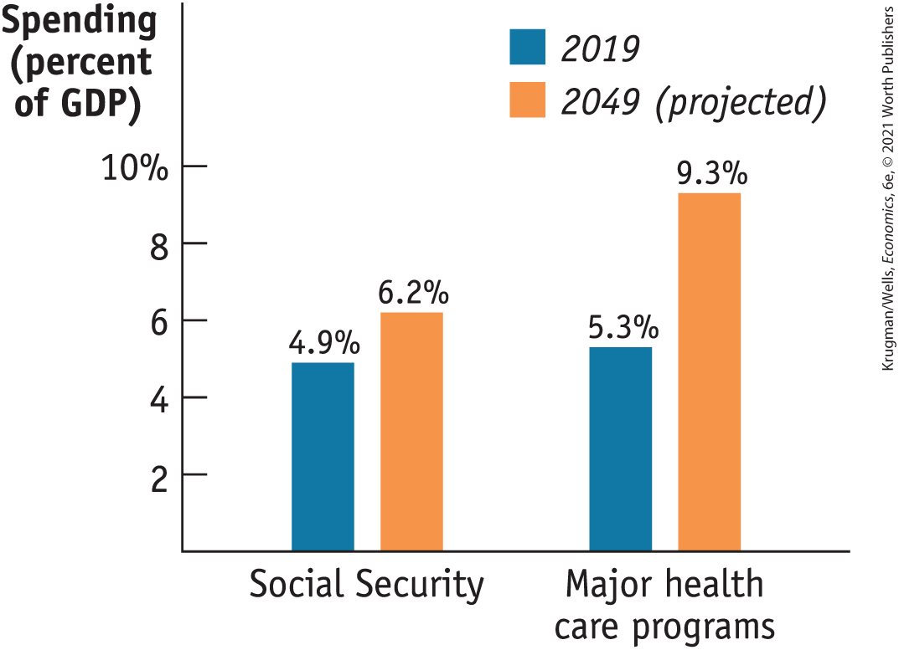
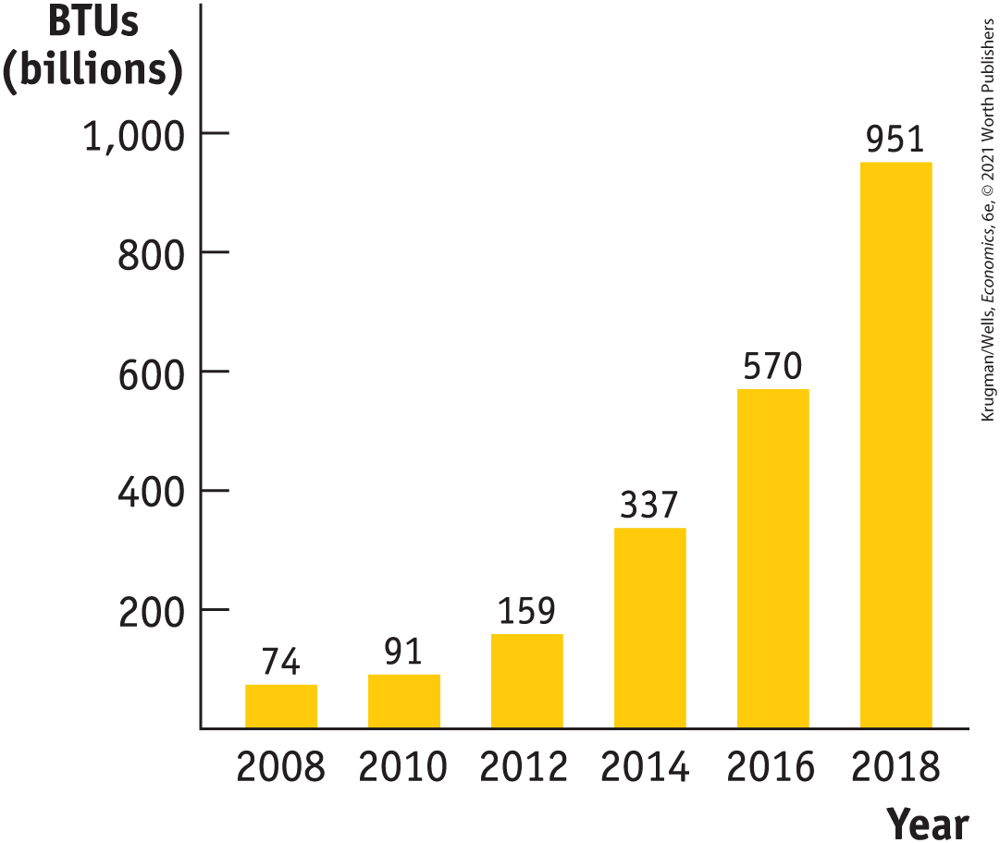

#### For inquiring minds

What Happened to the Debt from World War II?

As you can see from <a href="#kru_9781319245269_ch13_05.xhtml#pau_9781319320164_vB3FACKfUV" id="kru_9781319245269_ch13_05.xhtml#pau_9781319320164_S3vCckhL7b" class="crossref">Figure 13-13</a>, the U.S. government paid for World War II by borrowing on a huge scale. By the war’s end, the public debt was more than 100% of GDP, and many people worried about how it could ever be paid off.

The truth is that it never was paid off. In 1946 public debt was \$242 billion; that number dipped slightly in the next few years, as the United States ran postwar budget surpluses, but the government budget went back into deficit in 1950 with the start of the Korean War. By 1962 the public debt was back up to \$248 billion.

But by that time nobody was worried about the fiscal health of the U.S. government because the debt–GDP ratio had fallen by more than half. The reason? Vigorous economic growth, plus mild inflation, led to a rapid rise in GDP. The experience was a clear lesson in the peculiar fact that modern governments can run deficits forever, as long as they aren’t too large.

<!--
<strong class="important">[End FIM Box]</strong>
-->
</aside>

Still, a government that runs persistent *large* deficits will have a rising debt–GDP ratio when debt grows faster than GDP. In the aftermath of the financial crisis of 2008, the U.S. government began running deficits much larger than anything seen since World War II, and the debt–GDP ratio began rising sharply. Similar surges in the debt–GDP ratio could be seen in a number of other countries after 2008. Economists and policy makers agreed that this was not a sustainable trend, and that governments would need to get their spending and revenues back in line.

### Implicit Liabilities

Looking at <a href="#kru_9781319245269_ch13_05.xhtml#pau_9781319320164_vB3FACKfUV" id="kru_9781319245269_ch13_05.xhtml#pau_9781319320164_KRqhtGBGy5" class="crossref">Figure 13-13</a>, you might be tempted to conclude that until the 2008 crisis struck, the U.S. federal budget was in fairly decent shape: the return to budget deficits after 2001 caused the debt–GDP ratio to rise a bit, but that ratio was still low compared with both historical experience and some other wealthy countries. In fact, however, experts on long-run budget issues view the situation of the United States (and other countries such as Japan and Italy) with some alarm. The reason is the problem of *implicit liabilities.* <a href="#kru_9781319245269_EM_glossary.xhtml#pau_9781319320164_HDEi4kUZhh" id="kru_9781319245269_ch13_05.xhtml#pau_9781319320164_nsO1V25Q46" class="glossref" role="doc-glossref">Implicit liabilities</a> are spending promises made by governments that are effectively a debt despite the fact that they are not included in the usual debt statistics.

<aside aria-label="title 5" class="glossary c3 main-flow v1" epub:type="glossary" id="pau_9781319320164_xY2ftt9PVd">

**implicit liabilities**  
**Implicit liabilities** are spending promises made by governments that are effectively a debt despite the fact that they are not included in the usual debt statistics.

</aside>

The implicit liabilities of the U.S. government arise mainly from transfer programs that are aimed at providing security in retirement and protection from large health care bills:

- Social Security is the main source of retirement income for most older Americans.
- Medicare pays most of older Americans’ medical costs.
- Medicaid provides health care to lower-income families.
- The Affordable Care Act subsidizes health insurance premiums for many low-to moderate-income families who are ineligible for Medicaid.

In each of these cases, the government has promised to provide transfer payments to future as well as current beneficiaries. So these programs represent a future debt that must be honored, even though the debt does not currently show up in the usual statistics. Together, these programs currently account for approximately half of federal spending.

The implicit liabilities created by these transfer programs worry fiscal experts. <a href="#kru_9781319245269_ch13_05.xhtml#pau_9781319320164_Y5okKRnkg8" id="kru_9781319245269_ch13_05.xhtml#pau_9781319320164_Jo57YHIOSK" class="crossref">Figure 13-14</a> shows why. It shows actual 2019 spending on Social Security and major health care programs, measured as a percentage of GDP, together with Congressional Budget Office projections for average spending in the 2040s. According to these projections, spending on Social Security will rise substantially over the next few decades and spending on the major health care programs will soar. Why?

<!--
[Macro <xref rid="figure_BK_14">Figure 13-14</xref>]
--> <!--
[<xref rid="figure_BK_14">Figure 13-14</xref>]
-->

<figure id="pau_9781319320164_Y5okKRnkg8" class="figure lm_img_lightbox num c3 main-flow">

<figcaption>
FIGURE 13-14 Future Demands on the Federal Budget

This figure shows actual spending on social insurance programs as a percentage of GDP in 2019 and Congressional Budget Office projections for these same programs in the 2040s. Partly as a result of an aging population, these programs will become much more expensive over time. But, it is the significant increases in health care spending that will pose the most serious problem for the federal budget in the future.

<em>Data from:</em> Congressional Budget Office.
</figcaption>
</figure>

<aside class="hidden" id="pau_9781319320164_1vMQXwJSvr" title="hidden">

The vertical axis, labeled Spending (percent of G D P) ranges from 0 to 10 percent in increments of 2 percent. The horizontal axis plots the following spending from left to right, Social Security and Major health care programs. The data from the graph are as follows, Social security: 2019, 4.9 percent; 2049, 6.2 percent. Major health care programs: 2019, 5.3 percent; 2049, 9.3 percent.

</aside>

In the case of Social Security, the answer is demography. Social Security is a pay-as-you-go system: current workers pay payroll taxes that fund the benefits of current retirees. So the ratio of the number of retirees drawing benefits to the number of workers paying into Social Security has a major impact on the system’s finances.

There was a huge surge in the U.S. birth rate between 1946 and 1964, the years of what is commonly called the *baby boom.* Many baby boomers are still of working age — which means they are paying taxes, not collecting benefits. But many are starting to retire, and as more and more of them do so, they will stop earning taxable income and start collecting benefits.

As a result, the ratio of retirees receiving benefits to workers paying into the Social Security system will rise. In 2018 there were 36 retirees receiving benefits for every 100 workers paying into the system. But, by 2050, according to the Social Security Administration, that number will rise to 45. So as baby boomers move into retirement, benefit payments will continue to rise relative to the size of the economy.

The aging of the baby boomers, by itself, poses only a moderately sized long-run fiscal problem. The projected rise in health care spending is a much more serious concern. These projections also reflect the aging of the population, both because more people will be eligible for Medicare and because older people tend to have higher medical costs. But the main story behind projections of higher health care spending is the long-run tendency of such spending to rise faster than overall spending, for both government-funded and privately funded health care.

To some extent, the implicit liabilities of the U.S. government are already reflected in debt statistics. We mentioned earlier that the government had a total debt of \$21.2 trillion at the end of fiscal 2019 but that only \$16.8 trillion of that total was owed to the public. The main explanation for that discrepancy is that both Social Security and part of Medicare (the hospital insurance program) are supported by *dedicated taxes:* their expenses are paid out of special taxes on wages. At times, these dedicated taxes yield more revenue than is needed to pay current benefits.

In particular, since the mid-1980s the Social Security system has been taking in more revenue than it currently needs in order to prepare for the retirement of the baby boomers. This surplus in the Social Security system has been used to accumulate a *Social Security trust fund,* which was \$2.8 trillion at the end of fiscal 2019.

The money in the trust fund is held in the form of U.S. government bonds, which are included in the \$21.2 trillion in total debt. You could say that there’s something funny about counting bonds in the Social Security trust fund as part of government debt. After all, these bonds are owed by one part of the government (the government outside the Social Security system) to another part of the government (the Social Security system itself). But the debt corresponds to a real, if implicit, liability: promises by the government to pay future retirement benefits. So many economists argue that the gross debt of \$21.2 trillion, the sum of public debt and government debt held by Social Security and other trust funds, is a more accurate indication of the government’s fiscal health than the smaller amount owed to the public alone.

<!--
<strong class="important">[Start EIA]</strong>
-->

### ECONOMICS \>\> *in Action*

Who’s Afraid of a Debt Spiral?

As we explained in the text, one concern about the long-run effects of budget deficits is that they may start to feed on themselves, via a debt spiral. Deficits lead to higher debt; higher debt leads to higher interest payments, which increases the deficit, which leads to even higher debt, and so on. So debt can snowball.

But how worried should we be about debt spirals? In January 2019 Olivier Blanchard, the former chief economist of the International Monetary Fund and one of the world’s most respected macroeconomists, startled his colleagues at the annual meeting of the American Economic Association, where he gave the presidential address. Blanchard argued that fears of a debt spiral, and concerns about government debt in general, are greatly exaggerated.

Blanchard’s argument emphasized a point we also made in the text, about the effects of growth and inflation on the debt–GDP ratio, which is a much better indicator of a government’s fiscal health than the simple dollar value of debt. As we noted, rising nominal GDP, which reflects both inflation and real growth, causes the debt–GDP ratio to “melt” away unless the budget deficit is large.

What Blanchard pointed out was that while a rise in debt increases the government’s interest payments, it also accelerates the rate of melting, basically because there is more debt to melt. You only get a debt spiral if the higher interest payments caused by higher debt exceed this melting effect. The key question is whether the interest rate the government has to pay is more or less than the rate of growth in nominal GDP.

And as Blanchard noted, the experience of the United States and other advanced economies over the past 30 years, and especially over the past decade, is that interest rates are generally less than nominal growth rates. This point is illustrated in <a href="#kru_9781319245269_ch13_05.xhtml#pau_9781319320164_jSYdW9eio1" id="kru_9781319245269_ch13_05.xhtml#pau_9781319320164_M8PvNqPEmv" class="crossref">Table 13-2</a>, which compares the average 10-year interest rate on U.S. government bonds with nominal GDP growth over time. Furthermore, the gap between growth and interest rates is even larger in many other advanced countries.

<!--
[<xref rid="table_BK_2">Table 13-2</xref>]
-->

|           |                               |                         |
|-----------|-------------------------------|-------------------------|
|           | Average 10-year interest rate | Nominal GDP growth rate |
| 1990–2019 | 4.41                          | 4.51                    |
| 2010–2019 | 2.40                          | 3.97                    |

TABLE 13-2 Interest Rates versus Growth

Blanchard also argued that even this comparison overstates the risk of a debt spiral, because some of the money the government pays out in interest comes back to it in tax payments from bondholders.

While Blanchard’s speech came as something of a bombshell, many other economists have recently made similar arguments. Nobody is arguing that we should completely ignore debt. But there doesn’t seem to be much reason to fear a runaway debt spiral.

<!--
<strong class="important">[End EIA]</strong>
-->

### \>\> *Quick Review*

- Large and persistent budget deficits lead to increases in **public debt.**
- Public debt that rises year after year can lead to financial pressure and government default. In less extreme cases, it can crowd out investment spending, reducing long-run growth. This suggests that budget deficits in bad **fiscal years** should be offset with budget surpluses in good fiscal years.
- A **debt spiral** occurs when a government must borrow to pay for past interest expenses, causing overall debt to increase. However, if a country has rising GDP, economists believe it may safely run annual deficits as long as the **debt–GDP ratio** is stable or falling because GDP is growing faster than the debt.
- In addition to their official public debt, modern governments have implicit liabilities. The U.S. government has large **implicit liabilities** in the form of Social Security, Medicare, Medicaid, and the Affordable Care Act (ACA). With large implicit liabilities, a stable debt–GDP ratio may give a misleading sense of security.

### \>\> *Check Your Understanding* 13-4

1.  Explain how each of the following events would affect the public debt or implicit liabilities of the U.S. government, other things equal. Would the public debt or implicit liabilities be greater or smaller?
    1.  A higher growth rate of real GDP
    2.  Retirees living longer
    3.  A decrease in tax revenue
    4.  Government borrowing to pay interest on its current public debt
2.  Suppose the economy is in a slump and the current public debt is quite large. Explain the trade-off of short-run versus long-run objectives that policy makers face when deciding whether or not to engage in deficit spending.
3.  Explain how a contractionary fiscal policy like austerity can make it more likely that a government is unable to pay its debts.

<!--
<strong class="important">[Comp: chapter&#x2019;s business case follows. Insert it on a new page. Run it 2-column and for one page only.]</strong>
--> <!--
<strong class="important">[Start Business Case]</strong>
--> <!--
<strong class="important">Comp: insert globe icon. Note that case includes both a photo and a figure.</strong>
-->

## Business case

Here Comes the Sun

 <!--
<strong class="important">[Macro 13UN05]</strong>
--> <!--
[Macro-13UN05: BC photo no caption]
-->

The Solana power plant covers three square miles of the Sonoran Desert in Gila Bend, Arizona, about 70 miles from Phoenix. Whereas most solar installations rely on photovoltaic panels that convert light directly into electricity, Solana uses a system of mirrors to concentrate the sun’s heat on black pipes, which convey that heat to tanks of molten salt. The heat in the salt is, in turn, used to generate electricity. The advantage of this arrangement is that the plant can keep generating power long after the sun has gone down, greatly enhancing its efficiency.

<figure id="pau_9781319320164_t27vO5kOg7" class="figure lm_img_lightbox unnum c2 right">

</figure>

Solana is one of only a small number of concentrated thermal solar plants operating or under construction, and as <a href="#kru_9781319245269_ch13_06.xhtml#pau_9781319320164_gE3uvdYhHQ" id="kru_9781319245269_ch13_06.xhtml#pau_9781319320164_dpIaMqeHvp" class="crossref">Figure 13-15</a> shows, solar power has been rapidly rising in importance, with the amount of solar-generated electricity increasing over 10,000% between 2008 and 2018. There are a number of reasons for this sudden rise, but the 2009 stimulus — which put substantial sums into the promotion of green energy — was a major factor. Solana, in particular, was built by the Spanish company Abengoa with the aid of a \$1.45 billion federal loan guarantee. Abengoa also received \$1.2 billion for a similar plant in the Mojave Desert.

<!--
[Macro <xref rid="figure_BK_15">Figure 13-15</xref>]
--> <!--
[<xref rid="figure_BK_15">Figure 13-15</xref>]
-->

<figure id="pau_9781319320164_gE3uvdYhHQ" class="figure lm_img_lightbox num c3 main-flow">

<figcaption>
FIGURE 13-15 The Solar Sunrise, 2008–2018

<em>Data from:</em> U.S. Energy Information Administration.
</figcaption>
</figure>

<aside class="hidden" id="pau_9781319320164_vLD5PvNci6" title="hidden">

The vertical axis, labeled B T U’s (billions) ranges from 0 to 1,000 in increments of 200. The horizontal axis, labeled Year ranges from 2008 to 2018 in increments of 2 years. The data from the graph are as follows, 2008, 74; 2010, 91; 2012, 159; 2014, 337; 2016, 570; and 2018, 951.

</aside>

While Solana is a good example of stimulus spending at work, it is also a good example of why such spending tends to be politically difficult. There were many protests over federal loans to a non-U.S. firm, although Abengoa had the necessary technology, and the construction jobs created by the project were, of course, in the United States. Also, the long-term financial viability of solar power projects depends in part on whether government subsidies and other policies favoring renewable energy will continue, which isn’t certain.

In terms of the goals of the stimulus, however, Solana seems to have done what it was supposed to: it generated jobs at a time when borrowing was cheap and many construction workers were unemployed.

<aside class="assessments c3 main-flow v1" epub:type="assessments" id="pau_9781319320164_CJl4uAPOD6">

### Questions for Thought

1.  How did the political reaction to government funding for the Solana project differ from the reaction to more conventional government spending projects such as roads and schools? What does the case tell us about how to assess the value of a fiscal stimulus project?
2.  In the chapter we talked about the problem of lags in discretionary fiscal policy. What does the Solana case tell us about this issue?
3.  Is the depth of a recession a good or a bad time to undertake an energy project? Why or why not?

<!--
<strong class="important">[End Business Case]</strong>
-->
</aside>

### SUMMARY

1.  The government plays a large role in the economy, collecting a large share of GDP in taxes and spending a large share both to purchase goods and services and to make transfer payments, largely for **social insurance.** *Fiscal policy* is the use of taxes, government transfers, or government purchases of goods and services to shift the aggregate demand curve.
2.  Government purchases of goods and services directly affect aggregate demand, and changes in taxes and government transfers affect aggregate demand indirectly by changing households’ disposable incomes. **Expansionary fiscal policy** shifts the aggregate demand curve rightward; **contractionary fiscal policy** shifts the aggregate demand curve leftward.
3.  Only when the economy is at full employment is there potential for crowding out of private spending and private investment spending by expansionary fiscal policy. The argument that expansionary fiscal policy won’t work because of Ricardian equivalence — that consumers will cut back spending today to offset expected future tax increases — appears to be untrue in practice. What is clearly true is that very active fiscal policy may make the economy less stable due to time lags in policy formulation and implementation.
4.  Fiscal policy has a multiplier effect on the economy, the size of which depends on the fiscal policy. Except in the case of lump-sum taxes, taxes reduce the size of the multiplier. Expansionary fiscal policy leads to an increase in real GDP, and contractionary fiscal policy leads to a reduction in real GDP. Because part of any change in taxes or transfers is absorbed by savings in the first round of spending, changes in government purchases of goods and services have a more powerful effect on the economy than equal-sized changes in taxes or transfers.
5.  Rules governing taxes — with the exception of **lump-sum taxes** — and some transfers act as **automatic stabilizers**, reducing the size of the multiplier and automatically reducing the size of fluctuations in the business cycle. In contrast, **discretionary fiscal policy** arises from deliberate actions by policy makers rather than from the business cycle.
6.  Some of the fluctuations in the budget balance are due to the effects of the business cycle. In order to separate the effects of the business cycle from the effects of discretionary fiscal policy, governments determine the **cyclically adjusted budget balance**, an estimate of the budget balance if the economy were at potential output.
7.  U.S. government budget accounting is calculated on the basis of **fiscal years.** Persistently large budget deficits have long-run consequences because they lead to an increase in **public debt.** As a result, two potential dangers may arise: crowding out, which reduces long-run economic growth, and financial pressure leading to default, which brings economic and financial turmoil. A **debt spiral** will increase public debt if countries need to take on additional debt to pay past interest expenses.
8.  A widely used measure of fiscal health is the **debt–GDP ratio.** This number can remain stable or fall even in the face of persistent budget deficits if GDP rises over time. With large **implicit liabilities**, a stable debt–GDP ratio may give a misleading sense of security. The largest implicit liabilities of the U.S. government come from Social Security, Medicare, Medicaid, and the Affordable Care Act (ACA), the costs of which are increasing due to the aging of the population and rising medical costs.

### Key Terms

- <a href="#kru_9781319245269_ch13_02.xhtml#pau_9781319320164_e0dmosxK28" id="kru_9781319245269_ch13_07.xhtml#pau_9781319320164_vp5HuRz6xn" class="crossref">Social insurance</a>
- <a href="#kru_9781319245269_ch13_02.xhtml#pau_9781319320164_H12538ajOg" id="kru_9781319245269_ch13_07.xhtml#pau_9781319320164_YBdyY4Kvzx" class="crossref">Expansionary fiscal policy</a>
- <a href="#kru_9781319245269_ch13_02.xhtml#pau_9781319320164_NsOhIhcDLC" id="kru_9781319245269_ch13_07.xhtml#pau_9781319320164_f2sCQd1KHZ" class="crossref">Contractionary fiscal policy</a>
- <a href="#kru_9781319245269_ch13_03.xhtml#pau_9781319320164_0JNGjEpOqS" id="kru_9781319245269_ch13_07.xhtml#pau_9781319320164_GD7zArvlsM" class="crossref">Lump-sum taxes</a>
- <a href="#kru_9781319245269_ch13_03.xhtml#pau_9781319320164_AmdblVCjJc" id="kru_9781319245269_ch13_07.xhtml#pau_9781319320164_Dzo9KAsIjS" class="crossref">Automatic stabilizers</a>
- <a href="#kru_9781319245269_ch13_03.xhtml#pau_9781319320164_kdRfubS5M1" id="kru_9781319245269_ch13_07.xhtml#pau_9781319320164_hfSvYZIuit" class="crossref">Discretionary fiscal policy</a>
- <a href="#kru_9781319245269_ch13_04.xhtml#pau_9781319320164_jQ7H7wCICe" id="kru_9781319245269_ch13_07.xhtml#pau_9781319320164_znCahwXv6O" class="crossref">Cyclically adjusted budget balance</a>
- <a href="#kru_9781319245269_ch13_05.xhtml#pau_9781319320164_wfgu48HzS6" id="kru_9781319245269_ch13_07.xhtml#pau_9781319320164_sxZp5sPBX7" class="crossref">Fiscal year</a>
- <a href="#kru_9781319245269_ch13_05.xhtml#pau_9781319320164_pOKcBbBt6i" id="kru_9781319245269_ch13_07.xhtml#pau_9781319320164_BMX4s6D5vy" class="crossref">Public debt</a>
- <a href="#kru_9781319245269_ch13_05.xhtml#pau_9781319320164_RS9KtVYGSH" id="kru_9781319245269_ch13_07.xhtml#pau_9781319320164_gW7zrDL5uI" class="crossref">Debt spiral</a>
- <a href="#kru_9781319245269_ch13_05.xhtml#pau_9781319320164_baGag8MZ6f" id="kru_9781319245269_ch13_07.xhtml#pau_9781319320164_pkGZFBJAuX" class="crossref">Debt–GDP ratio</a>
- <a href="#kru_9781319245269_ch13_05.xhtml#pau_9781319320164_nsO1V25Q46" id="kru_9781319245269_ch13_07.xhtml#pau_9781319320164_U7bmM3fFS2" class="crossref">Implicit liabilities</a>

### Practice questions

1.  The CARES Act was the largest in both nominal and real measures of fiscal relief/stimulus passed in U.S. history. The package will cost more than \$2 trillion as it stabilizes consumer spending during a period of unprecedented unemployment. Simultaneously, the global pandemic caused a supply side shock as supply chains experienced delays as households stocked up on basic necessities. In terms of aggregate demand and aggregate supply, explain if the CARES Act would cause a significant rise in the price level?
2.  With the CARES Act costing over \$2 trillion and the federal government facing a significant decline in tax revenue, explain the effectiveness of fiscal policy using the three claims outlined in the chapter.
3.  The government’s budget surplus in Macroland has risen consistently over the past five years. Two government policy makers disagree as to why this has happened. One argues that a rising budget surplus indicates a growing economy; the other argues that it shows that the government is using contractionary fiscal policy. Can you determine which policy maker is correct? If not, why not?
