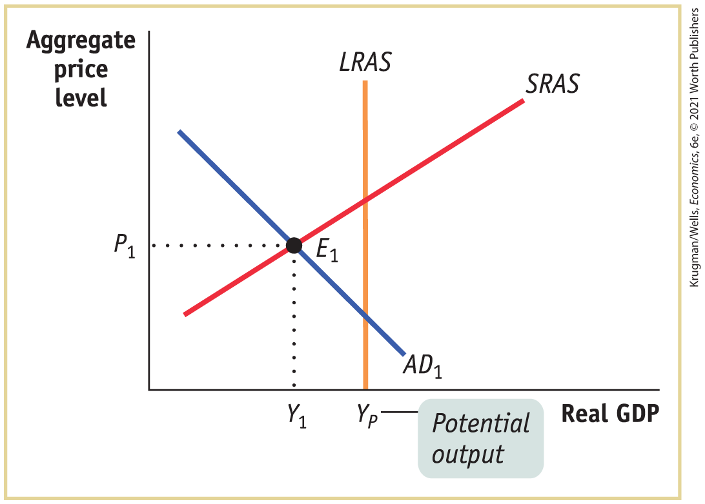
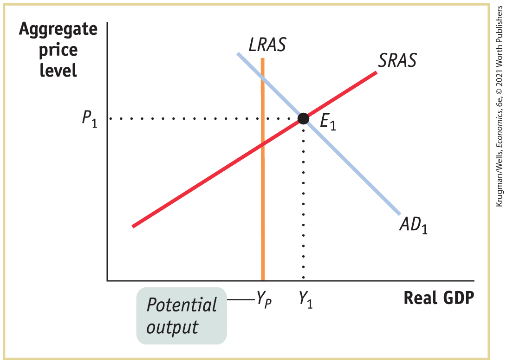
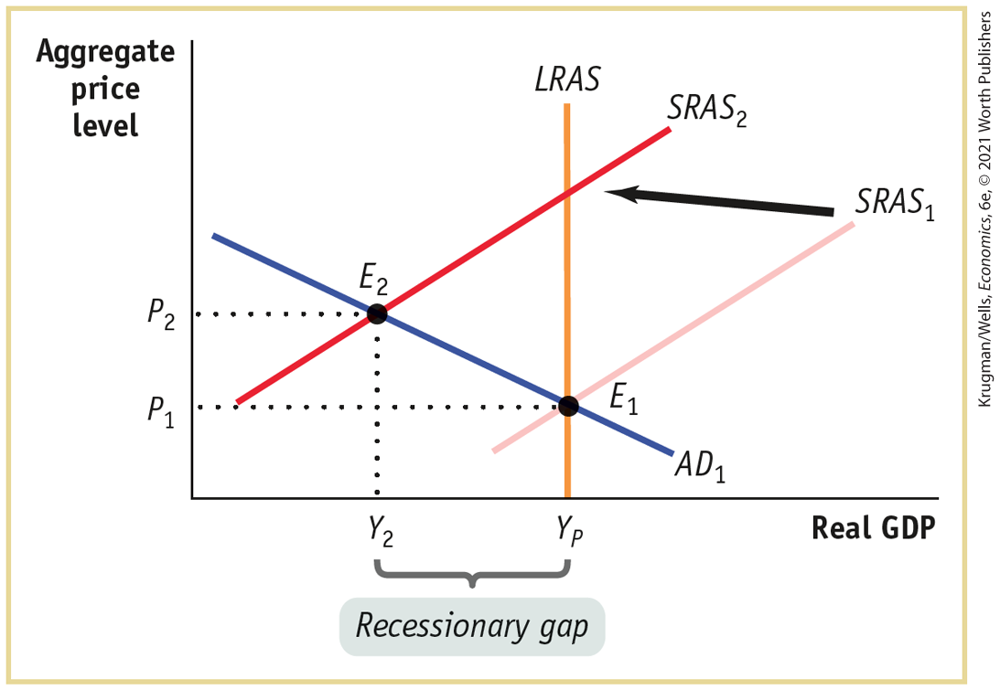
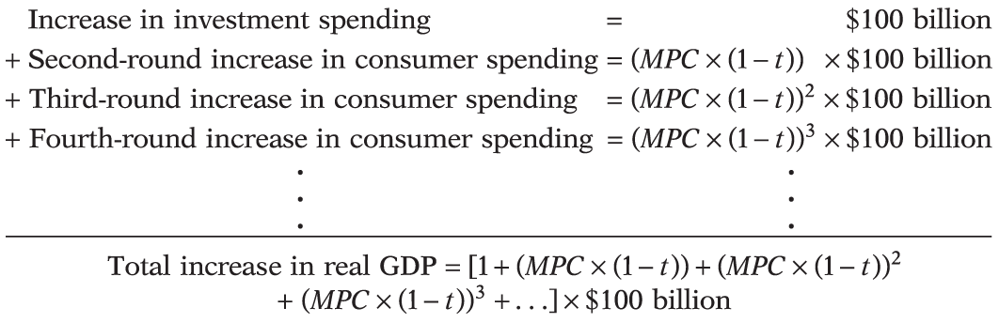

### Problems

1.  The accompanying diagram shows the current macroeconomic situation for the economy of Albernia. You have been hired as an economic consultant to help the economy move to potential output, <!--&#x003C;&amp;lt;-->$Y_{P}$<!---->--\>.<!--
<strong class="important">[Macro 13UN06</strong>]
--> <!--
[Macro-13UN06: unnumbered line art no caption]
-->

    <figure id="pau_9781319320164_5vxALRFOQW" class="figure lm_img_lightbox unnum c5 center">
    
    </figure>

    <aside class="hidden" id="pau_9781319320164_nNwTGA4nEp" title="hidden">

    The vertical axis, labeled Aggregate price level shows a marking at P subscript 1. The horizontal axis, labeled Real G D P shows markings at Y subscript 1 and Y subscript P, from left to right. A negative sloping straight line labeled A D subscript 1 intersects a positive sloping straight line labeled S R A S at E subscript 1 (Y subscript 1, P subscript 1). A straight vertical line, labeled L R A S, starts from Y subscript P and intersects the A D subscript 1 and S R A S. The marking, Y subscript P, is labeled Potential output. E subscript 1 is on the left of L R A S.

    </aside>

    1.  Is Albernia facing a recessionary or inflationary gap?
    2.  Which type of fiscal policy — expansionary or contractionary — would move the economy of Albernia to potential output, <!--&#x003C;&amp;lt;-->$Y_{P}$<!---->--\>*?* What are some examples of such policies?
    3.  Illustrate the macroeconomic situation in Albernia with a diagram after the successful fiscal policy has been implemented.

2.  The accompanying diagram shows the current macroeconomic situation for the economy of Brittania; real GDP is <!--&#x003C;&amp;lt;-->$Y_{1}$<!---->--\>, and the aggregate price level is <!--&#x003C;&amp;lt;-->$P_{1}$<!---->--\>. You have been hired as an economic consultant to help the economy move to potential output, <!--&#x003C;&amp;lt;-->$Y_{P}$<!---->--\>.<!--
<strong class="important">[Macro 13UN07</strong>]
--> <!--
[Macro-13UN07: unnumbered line art no caption]
-->

    <figure id="pau_9781319320164_vOidcL6fOs" class="figure lm_img_lightbox unnum c5 center">
    
    </figure>

    <aside class="hidden" id="pau_9781319320164_YmUTb1yJws" title="hidden">

    The vertical axis, labeled Aggregate price level shows a marking at P subscript 1. The horizontal axis, labeled Real G D P shows markings at Y subscript P and Y subscript 1, from left to right. A negative sloping straight line labeled A D subscript 1 intersects a positive sloping straight line labeled S R A S at E subscript 1 (Y subscript 1, P subscript 1). A straight vertical line, labeled L R A S, starts from Y subscript P and intersects the A D subscript 1 and S R A S. The marking, Y subscript P, is labeled Potential output. E subscript 1 is on the right of L R A S.

    </aside>

    1.  Is Brittania facing a recessionary or inflationary gap?
    2.  Which type of fiscal policy — expansionary or contractionary — would move the economy of Brittania to potential output, <!--&#x003C;&amp;lt;-->$Y_{P}$<!---->--\>*?* What are some examples of such policies?
    3.  Illustrate the macroeconomic situation in Brittania with a diagram after the successful fiscal policy has been implemented.

3.  An economy is in long-run macroeconomic equilibrium when each of the following aggregate demand shocks occurs. What kind of gap — inflationary or recessionary — will the economy face after the shock, and what type of fiscal policies would help move the economy back to potential output? How would your recommended fiscal policy shift the aggregate demand curve?
    1.  A stock market boom increases the value of stocks held by households.
    2.  Firms come to believe that a recession in the near future is likely.
    3.  Anticipating the possibility of war, the government increases its purchases of military equipment.
    4.  The quantity of money in the economy declines and interest rates increase.

4.  During a 2008 interview, then German Finance Minister Peer Steinbruck said, “We have to watch out that in Europe and beyond, nothing like a combination of downward economic \[growth\] and high inflation rates emerges — something that experts call stagflation.” Such a situation can be depicted by the movement of the short-run aggregate supply curve from its original position, <!--&#x003C;&amp;lt;-->$SRAS_{1}$<!---->--\>, to its new position, <!--&#x003C;&amp;lt;-->$SRAS_{2}$<!---->--\>, with the new equilibrium point <!--&#x003C;&amp;lt;-->$E_{2}$<!---->--\> in the accompanying figure. In this question, we try to understand why stagflation is particularly hard to fix using fiscal policy.<!--
<strong class="important">[Macro 13UN08</strong>]
--> <!--
[Macro-13UN08: unnumbered line art no caption]
-->

    <figure id="pau_9781319320164_tGEZx4nBgM" class="figure lm_img_lightbox unnum c5 center">
    
    </figure>

    <aside class="hidden" id="pau_9781319320164_s9MtDOl9rC" title="hidden">

    The vertical axis, labeled Aggregate price level shows markings at P subscript 1, and P subscript 2 from bottom to top. The horizontal axis, labeled Real G D P shows markings at Y subscript 2 and Y subscript P from left to right. A straight vertical line, labeled L R A S, starts from Y subscript P. Two positive sloping straight parallel lines are labeled S R A S subscript 2 and S R A S subscript 1. S R A S subscript 2 is on the left of S R A S subscript 1. A negative sloping straight line, labeled A D subscript 1, intersects S R A S subscript 2 and S R A S subscript 1 at points E subscript 2 and E subscript 2, respectively. L R A S intersects S R A S subscript 1 at E subscript 1. A leftward arrow points from S R A S subscript 1 to S R A S subscript 2, and the gap between Y subscript 2 and Y subscript 1 is labeled Recessionary gap.

    </aside>

    1.  What would be the appropriate fiscal policy response to this situation if the primary concern of the government was to maintain economic growth? Illustrate the effect of the policy on the equilibrium point and the aggregate price level using the diagram.
    2.  What would be the appropriate fiscal policy response to this situation if the primary concern of the government was to maintain price stability? Illustrate the effect of the policy on the equilibrium point and the aggregate price level using the diagram.
    3.  Discuss the effectiveness of the policies in parts a and b in fighting stagflation.

5.  Show why a \$10 billion reduction in government purchases of goods and services will have a larger effect on real GDP than a \$10 billion reduction in government transfers by completing the accompanying table for an economy with a marginal propensity to consume (*MPC*) of 0.6. The first and second rows of the table are filled in for you: on the left side of the table, in the first row, the \$10 billion reduction in government purchases decreases real GDP and disposable income, *YD,* by \$10 billion, leading to a reduction in consumer spending of \$6 billion <!--&#x003C;&amp;lt;-->$\text{(}MPC \times \text{change}\,\text{in}\,\text{disposable}\,\text{income)}$<!---->--\> in row 2. However, on the right side of the table, the \$10 billion reduction in transfers has no effect on real GDP in round 1 but does lower *YD* by \$10 billion, resulting in a decrease in consumer spending of \$6 billion in round 2.
    1.  When government purchases decrease by \$10 billion, what is the sum of the changes in real GDP after the 10 rounds?
    2.  When the government reduces transfers by \$10 billion, what is the sum of the changes in real GDP after the 10 rounds?
    3.  Using the formula for the multiplier for changes in government purchases and for changes in transfers, calculate the total change in real GDP due to the \$10 billion decrease in government purchases and the \$10 billion reduction in transfers. What explains the difference? \[*Hint:* The multiplier for government purchases of goods and services is <!--&#x003C;&amp;lt;-->$1\text{/(}1 - MPC\text{)}$<!---->--\>. But since each \$1 change in government transfers only leads to an initial change in real GDP of <!--&#x003C;&amp;lt;-->$MPC \times \$ 1$<!---->--\>, the multiplier for government transfers is <!--&#x003C;&amp;lt;-->$MPC\text{/(}1 - MPC\text{)}$<!---->--\>.\]

<!--
[Table is from Macro5e p. 408 problem 5]
-->

|        |                                                                                                                                                                                            |                                                                                                                                                                 |                                                                                                                                                                 |                                                                                                                                                                                                |                                                                                                                                                              |                                                                                                                                                                 |
|--------|--------------------------------------------------------------------------------------------------------------------------------------------------------------------------------------------|-----------------------------------------------------------------------------------------------------------------------------------------------------------------|-----------------------------------------------------------------------------------------------------------------------------------------------------------------|------------------------------------------------------------------------------------------------------------------------------------------------------------------------------------------------|--------------------------------------------------------------------------------------------------------------------------------------------------------------|-----------------------------------------------------------------------------------------------------------------------------------------------------------------|
|        | Decrease in $\mathbf{G}\text{~=~−\$10~billion}$ (billions of dollars)     |                                                                                                                                                                 |                                                                                                                                                                 | Decrease in $\mathbf{TR}\text{~=~−\$10~billion}$ (billions of dollars)        |                                                                                                                                                              |                                                                                                                                                                 |
| Rounds | Change in *G* or *C*                                                                                                                                                                       | Change in real GDP                                                                                                                                              | Change in ***YD***                                                                                                                                              | Change in *TR* or *C*                                                                                                                                                                          | Change in real GDP                                                                                                                                           | Change in ***YD***                                                                                                                                              |
| 1      | <!--&#x003C;&amp;lt;-->$\text{Δ}G = - \$ 10.00$<!---->--\>                | <!--&#x003C;&amp;lt;-->$- \$ 10.00$<!---->--\> | <!--&#x003C;&amp;lt;-->$- \$ 10.00$<!---->--\> | <!--&#x003C;&amp;lt;-->$\text{Δ}TR = - \$ 10.00$<!---->--\>                   | <!--&#x003C;&amp;lt;-->$\$ 0.00$<!---->--\> | <!--&#x003C;&amp;lt;-->$- \$ 10.00$<!---->--\> |
| 2      | <!--&#x003C;&amp;lt;-->$\text{Δ}C = \quad - \mspace{2mu} 6.00$<!---->--\> | <!--&#x003C;&amp;lt;-->$- 6.00$<!---->--\>     | <!--&#x003C;&amp;lt;-->$- 6.00$<!---->--\>     | <!--&#x003C;&amp;lt;-->$\text{Δ}C = \quad\,\, - \mspace{2mu} 6.00$<!---->--\> | <!--&#x003C;&amp;lt;-->$- 6.00$<!---->--\>  | <!--&#x003C;&amp;lt;-->$- 6.00$<!---->--\>     |
| 3      | <!--&#x003C;&amp;lt;-->$\text{Δ}C = \quad\,\,\,\,?$<!---->--\>            | ?                                                                                                                                                               | ?                                                                                                                                                               | <!--&#x003C;&amp;lt;-->$\text{Δ}C = \quad\,\,\,?$<!---->--\>                  | ?                                                                                                                                                            | ?                                                                                                                                                               |
| 4      | <!--&#x003C;&amp;lt;-->$\text{Δ}C = \quad\,\,\,\,?$<!---->--\>            | ?                                                                                                                                                               | ?                                                                                                                                                               | <!--&#x003C;&amp;lt;-->$\text{Δ}C = \quad\,\,\,?$<!---->--\>                  | ?                                                                                                                                                            | ?                                                                                                                                                               |
| 5      | <!--&#x003C;&amp;lt;-->$\text{Δ}C = \quad\,\,\,\,?$<!---->--\>            | ?                                                                                                                                                               | ?                                                                                                                                                               | <!--&#x003C;&amp;lt;-->$\text{Δ}C = \quad\,\,\,?$<!---->--\>                  | ?                                                                                                                                                            | ?                                                                                                                                                               |
| 6      | <!--&#x003C;&amp;lt;-->$\text{Δ}C = \quad\,\,\,\,?$<!---->--\>            | ?                                                                                                                                                               | ?                                                                                                                                                               | <!--&#x003C;&amp;lt;-->$\text{Δ}C = \quad\,\,\,?$<!---->--\>                  | ?                                                                                                                                                            | ?                                                                                                                                                               |
| 7      | <!--&#x003C;&amp;lt;-->$\text{Δ}C = \quad\,\,\,\,?$<!---->--\>            | ?                                                                                                                                                               | ?                                                                                                                                                               | <!--&#x003C;&amp;lt;-->$\text{Δ}C = \quad\,\,\,?$<!---->--\>                  | ?                                                                                                                                                            | ?                                                                                                                                                               |
| 8      | <!--&#x003C;&amp;lt;-->$\text{Δ}C = \quad\,\,\,\,?$<!---->--\>            | ?                                                                                                                                                               | ?                                                                                                                                                               | <!--&#x003C;&amp;lt;-->$\text{Δ}C = \quad\,\,\,?$<!---->--\>                  | ?                                                                                                                                                            | ?                                                                                                                                                               |
| 9      | <!--&#x003C;&amp;lt;-->$\text{Δ}C = \quad\,\,\,\,?$<!---->--\>            | ?                                                                                                                                                               | ?                                                                                                                                                               | <!--&#x003C;&amp;lt;-->$\text{Δ}C = \quad\,\,\,?$<!---->--\>                  | ?                                                                                                                                                            | ?                                                                                                                                                               |
| 10     | <!--&#x003C;&amp;lt;-->$\text{Δ}C = \quad\,\,\,\,?$<!---->--\>            | ?                                                                                                                                                               | ?                                                                                                                                                               | <!--&#x003C;&amp;lt;-->$\text{Δ}C = \quad\,\,\,?$<!---->--\>                  | ?                                                                                                                                                            | ?                                                                                                                                                               |

6.  In each of the following cases, either a recessionary or inflationary gap exists. Assume that the aggregate supply curve is horizontal, so that the change in real GDP arising from a shift of the aggregate demand curve equals the size of the shift of the curve. Calculate both the change in government purchases of goods and services and the change in government transfers necessary to close the gap.
    1.  Real GDP equals \$100 billion, potential output equals \$160 billion, and the *MPC* is 0.75.
    2.  Real GDP equals \$250 billion, potential output equals \$200 billion, and the *MPC* is 0.5.
    3.  Real GDP equals \$180 billion, potential output equals \$100 billion, and the *MPC* is 0.8.
7.  Most macroeconomists believe it is a good thing that taxes act as automatic stabilizers and lower the size of the multiplier. However, a smaller multiplier means that the change in government purchases of goods and services, government transfers, or taxes needed to close an inflationary or recessionary gap is larger. How can you explain this apparent inconsistency?
8.  <a href="#kru_9781319245269_ch13_04.xhtml#pau_9781319320164_0zpunUlDDe" id="kru_9781319245269_ch13_07.xhtml#pau_9781319320164_tRcTKUD5Jn" class="crossref">Figure 13-10</a> shows the actual budget deficit and the cyclically adjusted budget deficit as a percentage of GDP in the United States from 1965 to 2019. Assuming that potential output was unchanged, use this figure to determine which of the years from 1990 to 2019 the government used expansionary fiscal policy and in which years it used contractionary fiscal policy.
9.  You are an economic adviser to a candidate for national office. She asks you for a summary of the economic consequences of a balanced-budget rule for the federal government and for your recommendation on whether she should support such a rule. How do you respond?
10. In 2020, the policy makers of the economy of Eastlandia projected the debt–GDP ratio and the ratio of the budget deficit to GDP for the economy for the next 10 years under different scenarios for growth in the government’s deficit. Real GDP is currently \$1,000 billion per year and is expected to grow by 3% per year, the public debt is \$300 billion at the beginning of the year, and the deficit is \$30 billion in 2020.
    | Year | Real GDP (billions of dollars) | Debt (billions of dollars) | Budget deficit (billions of dollars) | Debt (percent of real GDP) | Budget deficit (percent of real GDP) |
    |------|--------------------------------|----------------------------|--------------------------------------|----------------------------|--------------------------------------|
    | 2020 | \$1,000                        | \$300                      | \$30                                 | ?                          | ?                                    |
    | 2021 | 1,030                          | ?                          | ?                                    | ?                          | ?                                    |
    | 2022 | 1,061                          | ?                          | ?                                    | ?                          | ?                                    |
    | 2023 | 1,093                          | ?                          | ?                                    | ?                          | ?                                    |
    | 2024 | 1,126                          | ?                          | ?                                    | ?                          | ?                                    |
    | 2025 | 1,159                          | ?                          | ?                                    | ?                          | ?                                    |
    | 2026 | 1,194                          | ?                          | ?                                    | ?                          | ?                                    |
    | 2027 | 1,230                          | ?                          | ?                                    | ?                          | ?                                    |
    | 2028 | 1,267                          | ?                          | ?                                    | ?                          | ?                                    |
    | 2029 | 1,305                          | ?                          | ?                                    | ?                          | ?                                    |
    | 2030 | 1,344                          | ?                          | ?                                    | ?                          | ?                                    |

    1.  Complete the accompanying table to show the debt–GDP ratio and the ratio of the budget deficit to GDP for the economy if the government’s budget deficit remains constant at \$30 billion over the next 10 years. (Remember that the government’s debt will grow by the previous year’s deficit.)
    2.  Redo the table to show the debt–GDP ratio and the ratio of the budget deficit to GDP for the economy if the government’s budget deficit grows by 3% per year over the next 10 years.
    3.  Redo the table again to show the debt–GDP ratio and the ratio of the budget deficit to GDP for the economy if the government’s budget deficit grows by 20% per year over the next 10 years.
    4.  What happens to the debt–GDP ratio and the ratio of the budget deficit to GDP for the economy over time under the three different scenarios?
11. Your study partner argues that the distinction between the government’s budget deficit and debt is similar to the distinction between consumer savings and wealth. Your study partner also argues that if you have large budget deficits, you must have a large debt. In what ways is your study partner correct and in what ways incorrect?
12.  Access the Discovering Data exercise for <!--<a class="crossref" href="kru_9781319245269_ch13_01.xhtml#ch13_sec_1" id="ch13-ext12">-->Chapter 13<!--</a>--> online to answer these questions.
    1.  Which of these six countries — United States, France, Italy, Greece, Germany, and the United Kingdom — had the largest amount of government debt as a percent of GDP as of 2015? Which had the smallest?
    2.  Calculate the percent change in government debt from 2007 through 2015 for the same six countries. Which country experienced the largest percent increase in government debt from 2007 through 2015? Which experienced the smallest?
    3.  Using the six countries as a reference point, what conclusions can you draw about the relationship between government debt and economic growth?
13. In which of the following cases does the size of the government’s debt and the size of the budget deficit indicate potential problems for the economy?
    1.  The government’s debt is relatively low, but the government is running a large budget deficit as it builds a high-speed rail system to connect the major cities of the nation.
    2.  The government’s debt is relatively high due to a recently ended deficit-financed war, but the government is now running only a small budget deficit.
    3.  The government’s debt is relatively low, but the government is running a budget deficit to finance the interest payments on the debt.
    4.  The government’s debt is relatively high and the government is running a budget deficit to finance new infrastructure spending.
14. How did or would the following affect the current public debt and implicit liabilities of the U.S. government?
    1.  In 2003, Congress passed and President George W. Bush signed the Medicare Modernization Act, which provides seniors and individuals with disabilities with a prescription drug benefit. Some of the benefits under this law took effect immediately, but other benefits will not begin until sometime in the future.
    2.  The age at which retired persons can receive full Social Security benefits is raised to age 70 for future retirees.
    3.  Social Security benefits for future retirees are limited to those with low incomes.
    4.  Because the cost of health care is increasing faster than the overall inflation rate, annual increases in Social Security benefits are increased by the annual increase in health care costs rather than the overall inflation rate.
    5.  The Affordable Care Act (ACA), which went into effect in 2014, created incentives for hospitals to find ways to save the government money.
15. Unlike households, governments are often able to sustain large debts. For example, in 2019, the U.S. government’s total debt reached \$21.2 trillion, approximately equal to 105.3% of GDP. At the time, according to the U.S. Treasury, the average interest rate paid by the government on its debt was 1.3%. However, running budget deficits becomes hard when very large debts are outstanding.
    1.  Calculate the dollar cost of the annual interest on the government’s total debt assuming the interest rate and debt figures cited above.
    2.  If the government operates on a balanced budget before interest payments are taken into account, at what rate must GDP grow in order for the debt–GDP ratio to remain unchanged?
    3.  Calculate the total increase in national debt if the government incurs a deficit of \$600 billion in 2020.
    4.  At what rate would nominal GDP have to grow in order for the debt–GDP ratio to remain unchanged when the deficit in 2020 is \$600 billion?
    5.  Why is the debt–GDP ratio the preferred measure of a country’s debt rather than the dollar value of the debt? Why is it important for a government to keep this number under control?

**Work It Out**

16. The accompanying table shows how consumers’ marginal propensities to consume in a particular economy are related to their level of income.<!--
[Table is from Macro5e p. 410 problem 17]
-->
    | Income range      | Marginal propensity to consume |
    |-------------------|--------------------------------|
    | \$0–\$20,000      | 0.9                            |
    | \$20,001–\$40,000 | 0.8                            |
    | \$40,001–\$60,000 | 0.7                            |
    | \$60,001–\$80,000 | 0.6                            |
    | Above \$80,000    | 0.5                            |

    1.  Suppose the government engages in increased purchases of goods and services. For each of the income groups in the table, what is the value of the multiplier — that is, what is the “bang for the buck” from each dollar the government spends on government purchases of goods and services in each income group?
    2.  If the government needed to close a recessionary or inflationary gap, at which group should it primarily aim its fiscal policy of changes in government purchases of goods and services? 

## Chapter 13 Appendix Taxes and the Multiplier

In the chapter, we described how taxes that depend positively on real GDP reduce the size of the multiplier and act as an automatic stabilizer for the economy. Let’s look a little more closely at the mathematics of how this works.

Specifically, let’s assume that the government “captures” a fraction *t* of any increase in real GDP in the form of taxes, where *t*, the tax rate, is a fraction between 0 and 1. And let’s repeat the exercise we carried out in <a href="#kru_9781319245269_ch11_01.xhtml#pau_9781319320164_qvzco1ppmg" id="kru_9781319245269_ch13_app.xhtml#pau_9781319320164_DRvKYdYNdl" class="crossref">Chapter 11</a>, where we consider the effects of a \$100 billion increase in investment spending. The same analysis holds for *any* autonomous increase in aggregate spending — in particular, it is also true for increases in government purchases of goods and services.

The \$100 billion increase in investment spending initially raises real GDP by \$100 billion (the first round). In the absence of taxes, disposable income would rise by \$100 billion. But because part of the rise in real GDP is collected in the form of taxes, disposable income only rises by <!--&#x003C;&amp;lt;-->$\text{(}1 - t\text{)} \times \$ 100\,\text{billion}$<!---->--\>. The second-round increase in consumer spending, which is equal to the marginal propensity to consume (*MPC*) multiplied by the rise in disposable income, is <!--&#x003C;&amp;lt;-->$\text{(}MPC \times \text{(}1 - t\text{))} \times$<!---->--\>$\$ 100\,\text{billion}$. This leads to a third-round increase in consumer spending of <!--&#x003C;&amp;lt;-->$\text{(}MPC \times$<!---->--\>$\text{(}1 - t\text{))} \times \text{(}MPC \times \text{(}1 - t\text{))} \times \$ 100\,\text{billion}$, and so on. So the total effect on real GDP is

<figure id="pau_9781319320164_tstZkVQ6K1" class="figure lm_img_lightbox unnum c3 main-flow">

</figure>

<aside class="hidden" id="pau_9781319320164_R8lSmrgsWa" title="hidden">

Four lines of equations are added above a horizontal line, and their addition is given below the horizontal line. Line 1: Increase in investment spending equals 100 billion dollars. Line 2: Second round increase in consumer spending equals (M P C times (1 minus t)) times 100 billion dollars. Line 3: Third round increase in consumer spending equals (M P C times (1 minus t)) squared times 100 billion dollars. Line 3: Fourth round increase in consumer spending equals (M P C times (1 minus t)) cubed times 100 billion dollars. Below these lines are vertical ellipsis and then a horizontal line. Below the horizontal line, total increase in real G D P equals (1 plus (M P C times (1 minus t)) plus (M P C times (1 minus t)) squared plus (M P C times (1 minus t)) cubed plus ellipsis) times 100 billion dollars.

</aside>

As explained in <a href="#kru_9781319245269_ch11_01.xhtml#pau_9781319320164_qvzco1ppmg" id="kru_9781319245269_ch13_app.xhtml#pau_9781319320164_75T9mUHacs" class="crossref">Chapter 11</a>, an infinite series of the form <!--&#x003C;&amp;lt;-->$1 + x + x^{2} + .\,.\,.\mspace{2mu}\text{,}$<!---->--\> with <!--&#x003C;&amp;lt;-->$0 < x < 1\text{,}$<!---->--\> is equal to <!--&#x003C;&amp;lt;-->$1\text{/(}1 - x\text{)}$<!---->--\>. In this example, <!--&#x003C;&amp;lt;-->$x = \text{(}MPC \times \text{(}1 - t\text{))}$<!---->--\>. So the total effect of a \$100 billion increase in investment spending, taking into account all the subsequent increases in consumer spending, is to raise real GDP by:

$$\frac{1}{1 - \text{(}MPC \times \text{(}1 - t\text{))}} \times \text{\$}100\,\text{billion}$$<!---->--\>

When we calculated the multiplier assuming away the effect of taxes, we found that it was <!--&#x003C;&amp;lt;-->$1\text{/(}1 - MPC\text{)}$<!---->--\>. But when we assume that a fraction *t* of any change in real GDP is collected in the form of taxes, the multiplier is:

$$\text{Multiplier} = \frac{1}{1 - \text{(}MPC \times \text{(}1 - t\text{))}}$$<!---->--\>

This is always a smaller number than <!--&#x003C;&amp;lt;-->$1\text{/(}1 - MPC\text{),}$<!---->--\> and its size diminishes as *t* grows. Suppose, for example, that <!--&#x003C;&amp;lt;-->$MPC = 0.6$<!---->--\>. In the absence of taxes, this implies a multiplier of <!--&#x003C;&amp;lt;-->$1\text{/(}1 - 0.6\text{)} = 1\text{/}0.4 = 2.5$<!---->--\>. But now let’s assume that <!--&#x003C;&amp;lt;-->$t = 1\text{/}3\text{,}$<!---->--\> that is, that 1/3 of any increase in real GDP is collected by the government. Then the multiplier is:

$$\frac{1}{1 - \text{(}0.6 \times \text{(}1 - 1\text{/}3\text{))}} = \frac{1}{1 - \text{(}0.6 \times 2\text{/}3\text{)}} = \frac{1}{1 - 0.4} = \frac{1}{0.6} = 1.667$$<!---->--\>

### PROBLEMS

1.  An economy has a marginal propensity to consume of 0.6, real GDP equals \$500 billion, and the government collects 20% of GDP in taxes. If government purchases increase by \$10 billion, show the rounds of increased spending that take place by completing the accompanying table. The first and second rows are filled in for you. In the first row, the increase in government purchases of \$10 billion raises real GDP by \$10 billion, taxes increase by \$2 billion, and *YD* increases by \$8 billion; in the second row, the increase in *YD* of \$8 billion increases consumer spending by \$4.80 billion <!--&#x003C;&amp;lt;-->$\text{(}MPC \times \text{change}\,\text{in}\,\text{disposable}\,\text{income)}$<!---->--\>.
    | Rounds                | Change in *G* or *C*                                                                                                                                                          | Change in real GDP | Change in taxes | Change in *YD* |
    |-----------------------|-------------------------------------------------------------------------------------------------------------------------------------------------------------------------------|--------------------|-----------------|----------------|
    | (billions of dollars) |                                                                                                                                                                               |                    |                 |                |
    | 1                     | <!--&#x003C;&amp;lt;-->$\text{Δ}G = \$ 10.00$<!---->--\>   | \$10.00            | \$2.00          | \$8.00         |
    | 2                     | <!--&#x003C;&amp;lt;-->$\text{Δ}C = \quad 4.80$<!---->--\> | 4.80               | 0.96            | 3.84           |
    | 3                     | <!--&#x003C;&amp;lt;-->$\text{Δ}C = \quad?$<!---->--\>     | ?                  | ?               | ?              |
    | 4                     | <!--&#x003C;&amp;lt;-->$\text{Δ}C = \quad?$<!---->--\>     | ?                  | ?               | ?              |
    | 5                     | <!--&#x003C;&amp;lt;-->$\text{Δ}C = \quad?$<!---->--\>     | ?                  | ?               | ?              |
    | 6                     | <!--&#x003C;&amp;lt;-->$\text{Δ}C = \quad?$<!---->--\>     | ?                  | ?               | ?              |
    | 7                     | <!--&#x003C;&amp;lt;-->$\text{Δ}C = \quad?$<!---->--\>     | ?                  | ?               | ?              |
    | 8                     | <!--&#x003C;&amp;lt;-->$\text{Δ}C = \quad?$<!---->--\>     | ?                  | ?               | ?              |
    | 9                     | <!--&#x003C;&amp;lt;-->$\text{Δ}C = \quad?$<!---->--\>     | ?                  | ?               | ?              |
    | 10                    | <!--&#x003C;&amp;lt;-->$\text{Δ}C = \quad?$<!---->--\>     | ?                  | ?               | ?              |

    1.  What is the total change in real GDP after the 10 rounds? What is the value of the multiplier? What would you expect the total change in real GDP to be, based on the multiplier formula? How do your two answers compare?
    2.  Redo the accompanying table, assuming the marginal propensity to consume is 0.75 and the government collects 10% of the rise in real GDP in taxes. What is the total change in real GDP after 10 rounds? What is the value of the multiplier? How do your two answers compare?

 **Work It Out**

2.  Calculate the change in government purchases of goods and services necessary to close the recessionary or inflationary gaps in the following cases. Assume that the short-run aggregate supply curve is horizontal, so that the change in real GDP arising from a shift of the aggregate demand curve equals the size of the shift of the curve.
    1.  Real GDP equals \$100 billion, potential output equals \$160 billion, the government collects 20% of any change in real GDP in the form of taxes, and the marginal propensity to consume is 0.75.
    2.  Real GDP equals \$250 billion, potential output equals \$200 billion, the government collects 10% of any change in real GDP in the form of taxes, and the marginal propensity to consume is 0.5.
    3.  Real GDP equals \$180 billion, potential output equals \$100 billion, the government collects 25% of any change in real GDP in the form of taxes, and the marginal propensity to consume is 0.8.
