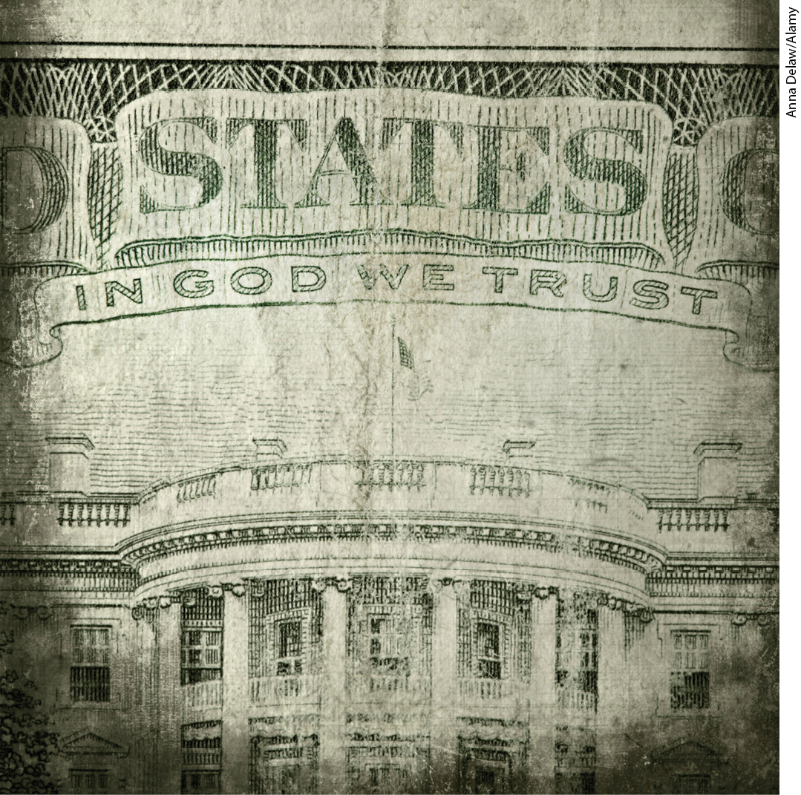
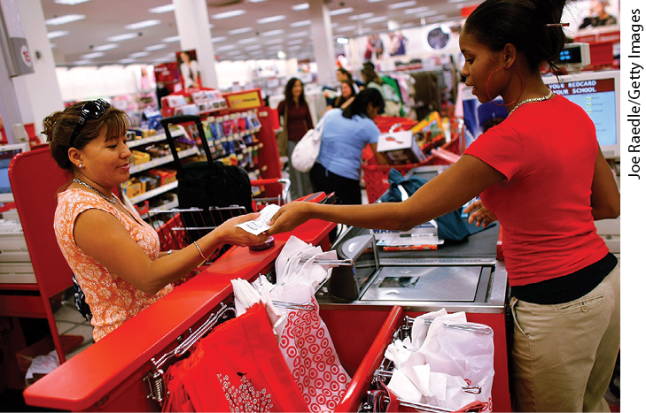
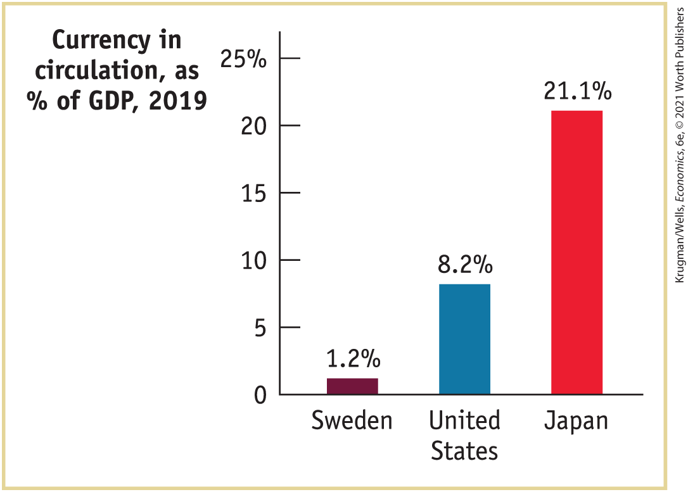
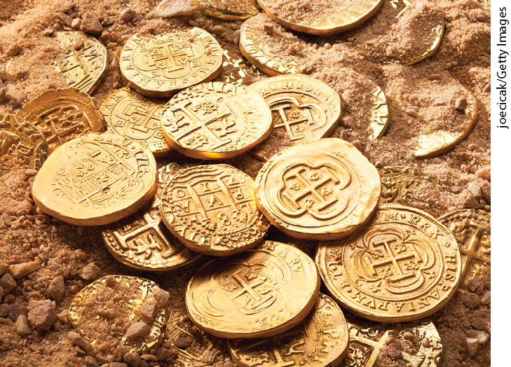
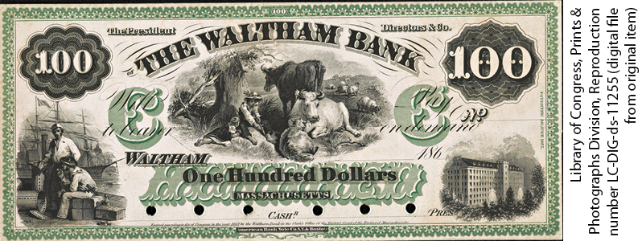
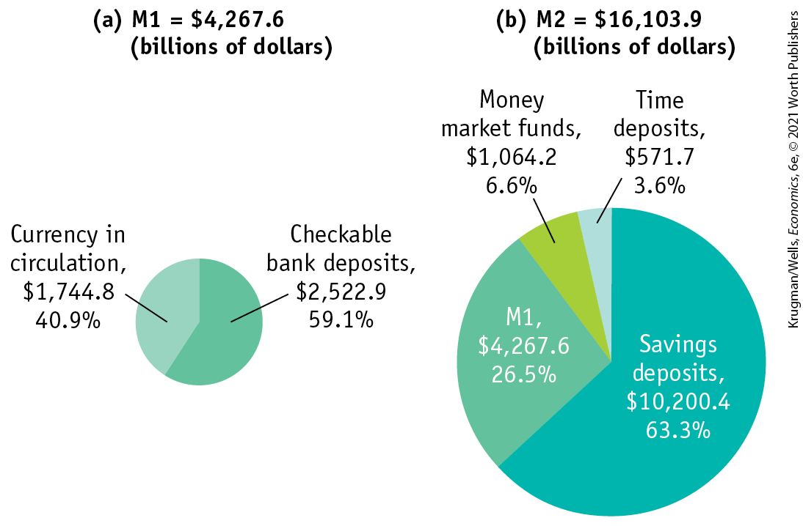

# Chapter 14 Money, Banking, and the Federal Reserve System

<!--
<strong class="important">Krugman/Wells, Macro 6E Chapter 14 [will also be Econ Ch 29]</strong>
--> <!--
<strong class="important">General Information: Comp will find Econ 5/e to be an excellent resource for preferences and desired layout of 6/e pages.</strong>
--> <!--
<strong class="important">[Comp: New RIGHT page.</strong>
--> <!--
<strong class="important">Verso running head: PART 6 STABILIZATION POLICY</strong>
--> <!--
<strong class="important">Recto running head: CHAPTER 14 MONEY, BANKING, AND THE FEDERAL RESERVE SYSTEM]</strong>
--> <!--
<strong class="important">[Macro CO14]</strong>
--> <!--
<strong class="important">[MACRO CO14]</strong>
--> <!--
<strong class="important">Comp: insert globe icon.</strong>
-->

## NOT SO FUNNY MONEY

<figure id="pau_9781319320164_iE5tMUHvNu" class="figure lm_img_lightbox unnum c2 right">

<figcaption>
<strong>Money is the essential channel that links the various parts of the modern economy.</strong>
</figcaption>
</figure>

**“THE PRODUCT IS CAREFULLY CREATED** in rural facilities throughout the Peruvian countryside using cheap labor, then hoarded in stash houses controlled by violent gangs in Lima. Once there, the goods are packed into parcels, loaded onto planes or hidden inside luggage, pottery, hollowed-out Bibles, sneakers, children’s toys or massive shipping containers bound for major U.S. ports of entry, such as Miami.” So began a *Washington Post* report on Operation Sunset, a huge raid carried out by Peruvian authorities in cooperation with the U.S. Secret Service in 2016. But what was the target of this raid? It wasn’t a drug bust; it was a fake money bust.

In recent years, Peru has become a major source for the production of counterfeit U.S. currency; the so-called “Peruvian note” is considered to be the best counterfeit in the business. Workers employed by criminal syndicates meticulously add decorative details to printed bills by hand, creating high-quality fakes that are very hard to detect.

The funny thing is that elaborately decorated pieces of paper have little or no intrinsic value. Indeed, a \$100 bill printed with blue or orange ink wouldn’t be worth the paper it was printed on.

But if the ink on that piece of paper is just the right shade of green, people will think that it’s *money* and will accept it as payment for very real goods and services, because they believe, correctly, that they can do the same thing: exchange that piece of green paper for real goods and services.

In fact, here’s a riddle: If a fake \$100 bill from Peru enters the United States and is successfully exchanged for a good or service with nobody ever realizing it’s a fake, who gets hurt? Accepting a fake \$100 bill isn’t like buying a car that turns out to be a lemon or a meal that turns out to be inedible. As long as the bill’s counterfeit nature remains undiscovered, it will pass from hand to hand just like a real \$100 bill.

The answer to the riddle is that the actual victims of the counterfeiting are U.S. taxpayers, because counterfeit dollars reduce the revenues available to pay for the operations of the U.S. government. The Treasury Department believes that only around 0.01% of the currency in circulation, about \$200 million, is fake, but that could still mean that taxpayers have been defrauded of hundreds of millions of dollars. Accordingly, the Secret Service diligently monitors the integrity of U.S. currency, promptly investigating any reports of counterfeit dollars. The efforts of the Secret Service attest to the fact that money isn’t like ordinary goods and services, and it certainly is not like pieces of colored paper.

In this chapter we’ll look at what money is, the role that it plays, the workings of a modern monetary system, and the institutions that sustain and regulate it, including the *Federal Reserve.* 

<!--
<strong class="important">[End Opening Story]</strong>
-->
<aside class="learning-objectives c3 main-flow v3" epub:type="learning-objectives" id="pau_9781319320164_Neakn1WCCN">

### WHAT YOU WILL LEARN

- What are the various roles that **money** plays and what forms does it take?
- Why is the level of the **money supply** so important to the state of the economy?
- How do the actions of private banks and the Federal Reserve determine the money supply?
- How does the Federal Reserve use **open-market operations** to change the **monetary base?**

<!--
<strong class="important">[End Chapter Opener Page]</strong>
-->
</aside>

## The Meaning of Money

In everyday conversation, we often use the word *money* to mean wealth. If you ask, “How much money does Jeff Bezos, the founder of Amazon, have?” the answer will be something like, “Oh, \$172 billion or so, but who’s counting?” That is, the number will include the value of the stocks, bonds, real estate, and other assets he owns.

<!--
<strong class="important">[Macro-14UN01]</strong>
--> <!--
<strong class="important">[MACRO 14UN01]</strong>
-->

But the economist’s definition of money doesn’t include all forms of wealth. The dollar bills in your wallet are money; other forms of wealth — such as stocks, bonds, and real estate — aren’t money. What, according to economists, distinguishes money from other forms of wealth?

### What Is Money?

Money is defined in terms of what it does: <a href="#kru_9781319245269_EM_glossary.xhtml#pau_9781319320164_3Mg0b8lPDU" id="kru_9781319245269_ch14_02.xhtml#pau_9781319320164_AxibMjOgIq" class="glossref" role="doc-glossref">money</a> is any asset that can easily be used to purchase goods and services. In <a href="#kru_9781319245269_ch10_01.xhtml#pau_9781319320164_GbPAtnS6LO" id="kru_9781319245269_ch14_02.xhtml#pau_9781319320164_uzPCMRIomU" class="crossref">Chapter 10</a> we defined an asset as *liquid* if it can easily be converted into cash. Money consists of cash itself, which is liquid by definition, as well as other assets that are highly liquid.

<aside aria-label="title 1" class="glossary c3 main-flow v1" epub:type="glossary" id="pau_9781319320164_iwfog5m53P">

**money**  
**Money** is any asset that can easily be used to purchase goods and services.

</aside>
<!--
<strong class="important">[Comp: For Key Terms, bold punctuation follows bold word (with the exception of em dashes). See end of chapter for corresponding Margin Definition copy.]</strong>
-->

You can see the distinction between money and other assets by asking yourself how you pay for your morning jolt of java. The cashier will accept dollar bills in return for a double mocha latte — but they won’t accept stock certificates or a collection of vintage baseball cards. If you want to convert stock certificates or vintage baseball cards into a latte, you have to sell them — trade them for money — and then use the money to buy your drink.

<figure id="pau_9781319320164_QNDwFOmHxB" class="figure lm_img_lightbox unnum c2 right">

<figcaption>
Without a liquid asset like money, making purchases would be much harder.
</figcaption>
</figure>

Of course, the vast majority of stores allow you to buy goods with a debit card linked to your bank account, and many of us pay larger bills (like tuition) with checks written on our accounts. Does that make your bank account money, even if you haven’t converted it into cash? Yes. <a href="#kru_9781319245269_EM_glossary.xhtml#pau_9781319320164_j9qTfVaTfQ" id="kru_9781319245269_ch14_02.xhtml#pau_9781319320164_fypiMglgOH" class="glossref" role="doc-glossref">Currency in circulation</a> — actual cash in the hands of the public — is considered money. So are <a href="#kru_9781319245269_EM_glossary.xhtml#pau_9781319320164_bb2NAKGuoJ" id="kru_9781319245269_ch14_02.xhtml#pau_9781319320164_zZ7PYfQl31" class="glossref" role="doc-glossref">checkable bank deposits</a> — bank accounts that can be accessed using debit cards, digital payments, and checks.

<aside aria-label="title 2" class="glossary c3 main-flow v1" epub:type="glossary" id="pau_9781319320164_yUsqNkLldt">

**currency in circulation**  
**Currency in circulation** is cash held by the public.

</aside>
<aside aria-label="title 3" class="glossary c3 main-flow v1" epub:type="glossary" id="pau_9781319320164_hAu9Lbxug1">

**checkable bank deposits**  
**Checkable bank deposits** are bank accounts that can be accessed using checks, debit cards, and digital payments.

</aside>
<!--
<strong class="important">[COMP: Please carry blue AU: notes to pages.]</strong>
--> <!--
<strong class="important">[AU: We dropped traveler&#x2019;s checks since the Fed is no longer publishing data on them and includes them in demand deposits.</strong> ]
-->

Some definitions of money include assets other than currency and checkable bank deposits. There are two widely used definitions of the <a href="#kru_9781319245269_EM_glossary.xhtml#pau_9781319320164_wBRGsLlMIO" id="kru_9781319245269_ch14_02.xhtml#pau_9781319320164_I8iSLzIHal" class="glossref" role="doc-glossref">money supply</a>, the total value of financial assets in the economy that are considered money.

<aside aria-label="title 4" class="glossary c3 main-flow v1" epub:type="glossary" id="pau_9781319320164_DrXBGGLERB">

**money supply**  
The **money supply** is the total value of financial assets in the economy that are considered money.

</aside>

1.  The narrower definition of money considers only the most liquid assets to be money: currency in circulation and checkable bank deposits.
2.  The broader definition includes the three categories just noted plus other assets that are “almost” checkable, such as savings account deposits that can easily be transferred into a checking account with a phone call or a few taps on a smartphone. Both definitions of the money supply, however, make a distinction between those assets that can easily be used to purchase goods and services and those that can’t.

Money plays a crucial role in generating *gains from trade* because it makes indirect exchange possible. Think of what happens when a cardiac surgeon buys a new refrigerator. The surgeon has valuable services to offer — namely, heart operations. The owner of the store has valuable goods to offer — refrigerators and other appliances. It would be extremely difficult for both parties if, instead of using money, they had to directly barter the goods and services they sell. In a barter system, a cardiac surgeon and an appliance store owner could trade only if the store owner happened to want a heart operation and the surgeon happened to want a new refrigerator.

This is known as the problem of finding a *double coincidence of wants:* in a barter system, two parties can trade only when each wants what the other has to offer. Money solves this problem: individuals can trade what they have to offer for money and trade money for what they want.

Because the ability to make transactions with money rather than relying on bartering makes it easier to achieve gains from trade, the existence of money increases welfare, even though money does not directly produce anything.

Let’s take a closer look at the roles money plays in the economy.

### Roles of Money

Money plays three main roles in any modern economy: it is a *medium of exchange,* a *store of value,* and a *unit of account*.

#### 1. Medium of Exchange

Our cardiac surgeon/refrigerator example illustrates the role of money as a <a href="#kru_9781319245269_EM_glossary.xhtml#pau_9781319320164_jRWpwbbDlU" id="kru_9781319245269_ch14_02.xhtml#pau_9781319320164_ZAz7OvLIJD" class="glossref" role="doc-glossref">medium of exchange</a> — an asset that individuals use to trade for goods and services rather than for consumption. People can’t eat dollar bills; rather, they use dollar bills to trade for goods and services.

<aside aria-label="title 5" class="glossary c3 main-flow v1" epub:type="glossary" id="pau_9781319320164_8wc0ZU4fTl">

**medium of exchange**  
A **medium of exchange** is an asset that individuals acquire for the purpose of trading goods and services rather than for their own consumption.

</aside>

In normal times, the official money of a given country — the dollar in the United States, the peso in Mexico, and so on — is also the medium of exchange in virtually all transactions in that country. During troubled economic times, however, other goods or assets often play that role instead. For example, during economic turmoil people often turn to other countries’ moneys as the medium of exchange: U.S. dollars have played this role in troubled Latin American countries, as have euros in troubled Eastern European countries. In a famous example, cigarettes functioned as the medium of exchange in World War II prisoner-of-war camps: even nonsmokers traded goods and services for cigarettes because the cigarettes could in turn be easily traded for other items. Inmates at federal penitentiaries, where smoking is now banned, reportedly use packages of ramen noodles for many transactions. During the extreme German inflation of 1923, goods such as eggs and lumps of coal became, briefly, mediums of exchange.

#### 2. Store of Value

To act as a medium of exchange, money must also be a <a href="#kru_9781319245269_EM_glossary.xhtml#pau_9781319320164_kBIx4rfkVS" id="kru_9781319245269_ch14_02.xhtml#pau_9781319320164_YSpuKKWXAc" class="glossref" role="doc-glossref">store of value</a> — a means of holding purchasing power over time. To see why this is necessary, imagine trying to operate an economy in which ice cream cones were the medium of exchange. Such an economy would quickly suffer from, well, monetary meltdown: your medium of exchange would likely turn into a sticky puddle before you could use it to buy something else. (As we’ll see in <a href="#kru_9781319245269_ch16_01.xhtml#pau_9781319320164_Upw2yOhAsg" id="kru_9781319245269_ch14_02.xhtml#pau_9781319320164_50X6orm5Y9" class="crossref">Chapter 16</a>, one of the problems caused by high inflation is that, in effect, it causes the value of money to “melt.”) Of course, money is by no means the only store of value. Any asset that holds its purchasing power over time is a store of value. So the store-of-value role is a necessary but not distinctive feature of money.

<aside aria-label="title 6" class="glossary c3 main-flow v1" epub:type="glossary" id="pau_9781319320164_2re0OD3to4">

**store of value**  
A **store of value** is a means of holding purchasing power over time.

</aside>
<!--
<strong class="important">[Start Box]</strong>
-->
<aside class="case-study c3 main-flow v5" epub:type="case-study" id="pau_9781319320164_c3wE43JcmF" title="GLOBAL COMPARISON">

##### Global comparison

THE CASH OF NATIONS

When did you last pay for something using cash — that is, literally hand over green pieces of paper bearing portraits of historical figures? For many of us, the answer may be that it was days, weeks, and, for some, months ago. These days, many of our day-to-day purchases are made using some form of digital payment, whether it involves a card or a smartphone.

So is cash on its way out? The answer, somewhat surprisingly, is that it depends on what country you live in. One simple measure of the prevalence of cash transactions is the ratio of the value of currency in circulation to GDP, the value of goods and services produced in a nation. The accompanying figure shows this ratio for three countries, Sweden, the United States, and Japan.

<!--
<strong class="important">[Macro-14UN02]</strong>
--> <!--
<strong class="important">[MACRO 14UN02]</strong>
-->

<figure id="pau_9781319320164_A8KQuiKfd6" class="figure lm_img_lightbox unnum c5 center">

<figcaption>
<em>Data from:</em> Bank for International Settlements, International Monetary Fund.
</figcaption>
</figure>

<aside class="hidden" id="pau_9781319320164_rFx3zrEI6k" title="hidden">

The vertical axis, labeled Currency in circulation, as percentage of G D P, 2019 ranges from 0 to 25 percent in increments of 5 percent. The horizontal axis represents the following countries from left to right, Sweden, United States, Japan. The data from the graph are as follows, Sweden, 1.2 percent; United States, 8.2 percent; and Japan, 21.1 percent.

</aside>

At one extreme, Sweden is very nearly a cashless society: most shops don’t accept cash, and half of the country’s bank branches don’t even handle cash. At the other extreme, Japanese still carry around a lot of cash. The United States is somewhere in the middle.

What’s odd about this is that all three countries are technologically sophisticated, to about the same degree. Why are they so different when it comes to cash?

In the case of Japan, the answer seems to be mainly cultural: for a variety of reasons, Japanese citizens are still accustomed to using currency and are reluctant to go digital even though their society is every bit as addicted to smartphones as ours.

The U.S. case is different: as For Inquiring Minds on <a href="#kru_9781319245269_ch14_02.xhtml#page422" id="kru_9781319245269_ch14_02.xhtml#pau_9781319320164_Pbg3oN4dT6" class="crossref">p. 422</a> explains, a majority of U.S. currency is actually held outside the country, mainly in the form of \$100 bills.

Sweden, arguably, is what the monetary future will look like; it is, in fact, considering eliminating cash altogether. And even in the United States a growing number of businesses have stopped accepting cash. But not everyone is happy with that future. Recently, New York City passed a law requiring that stores continue to accept cash as payment, arguing that cashless stores effectively discriminate against people too poor to have a card linked to a bank account.

</aside>
<!--
<strong class="important">[End Box]</strong>
-->

#### 3. Unit of Account

Finally, money normally serves as the <a href="#kru_9781319245269_EM_glossary.xhtml#pau_9781319320164_B33EQPbfac" id="kru_9781319245269_ch14_02.xhtml#pau_9781319320164_m3K4C8rIFV" class="glossref" role="doc-glossref">unit of account</a> — the commonly accepted measure individuals use to set prices and make economic calculations. To understand the importance of this role, consider a historical fact: during the Middle Ages, peasants typically were required to provide landowners with goods and labor rather than money. A peasant might, for example, be required to work on the landowner’s land one day a week and hand over one-fifth of their harvest.

<aside aria-label="title 7" class="glossary c3 main-flow v1" epub:type="glossary" id="pau_9781319320164_GMPZe7bsmI">

**unit of account**  
A **unit of account** is a measure used to set prices and make economic calculations.

</aside>

Today, rents, like other prices, are almost always specified in money terms. That makes things much clearer: imagine how hard it would be to decide which apartment to rent if landlords today followed medieval practice. Suppose, for example, that one landlord says he’ll let you have a place if you clean his house twice a week and bring him a pound of steak every day, whereas a second landlord wants you to clean her house just once a week but wants four pounds of chicken every day. Who’s offering the better deal? It’s hard to say. If, instead, the first landlord wants \$600 a month and the other wants \$700, the comparison is easy. In other words, without a commonly accepted measure, the terms of a transaction are harder to determine, making it more difficult to make transactions and achieve gains from trade.

### Types of Money

<!--
<strong class="important">[ Macro-14UN03]</strong>
--> <!--
<strong class="important">[MACRO 14UN03]</strong>
-->

<figure id="pau_9781319320164_vwW3eQy0Hj" class="figure lm_img_lightbox unnum c2 right">

<figcaption>
Goods with value, like gold and silver, were used as a medium of exchange for centuries.
</figcaption>
</figure>

In some form or another, money has been in use for thousands of years. For most of that time, people used <a href="#kru_9781319245269_EM_glossary.xhtml#pau_9781319320164_DOmJepcha1" id="kru_9781319245269_ch14_02.xhtml#pau_9781319320164_djgwjKZ2rU" class="glossref" role="doc-glossref">commodity money</a>**:** the medium of exchange was a good, normally gold or silver, that had intrinsic value in other uses. These alternative uses gave commodity money value independent of its role as a medium of exchange. For example, cigarettes, which served as money in World War II prisoner-of-war camps, were also valuable because many prisoners smoked. Gold was valuable because it was used for jewelry and ornamentation, aside from the fact that it was minted into coins.

<aside aria-label="title 8" class="glossary c3 main-flow v1" epub:type="glossary" id="pau_9781319320164_BYBJEaOLAq">

**commodity money**  
**Commodity money** is a good used as a medium of exchange that has intrinsic value in other uses.

</aside>

By 1776, the year in which the United States declared independence and Adam Smith published *The Wealth of Nations,* there was widespread use of paper money in addition to gold or silver coins. Unlike modern dollar bills, however, this paper money consisted of notes issued by private banks, which promised to exchange their notes for gold or silver coins on demand. So the paper currency that initially replaced commodity money was <a href="#kru_9781319245269_EM_glossary.xhtml#pau_9781319320164_zMApsLYU0S" id="kru_9781319245269_ch14_02.xhtml#pau_9781319320164_i1UPYu5gx3" class="glossref" role="doc-glossref">commodity-backed money</a>, a medium of exchange with no intrinsic value whose ultimate value was guaranteed by a promise that it could always be converted into valuable goods on demand.

<aside aria-label="title 9" class="glossary c3 main-flow v1" epub:type="glossary" id="pau_9781319320164_fVkrJhlg07">

**commodity-backed money**  
**Commodity-backed money** is a medium of exchange with no intrinsic value whose ultimate value is guaranteed by a promise that it can be converted into valuable goods.

</aside>
<!--
<strong class="important">[Macro-14UN04]</strong>
--> <!--
<strong class="important">[MACRO 14UN04]</strong>
-->

<figure id="pau_9781319320164_MeRzS83Q0r" class="figure lm_img_lightbox unnum c2 right">

<figcaption>
By issuing paper notes to function as money instead of gold and silver coins, banks were able to free up valuable resources.
</figcaption>
</figure>

The big advantage of commodity-backed money over simple commodity money, like gold and silver coins, was that it tied up fewer valuable resources. Although a note-issuing bank still had to keep some gold and silver on hand, it had to keep only enough to satisfy demands for redemption of its notes. And it could rely on the fact that on a normal day only a fraction of its paper notes would be redeemed. So the bank needed to keep only a portion of the total value of its notes in circulation in the form of gold and silver in its vaults. It could then lend out the remaining gold and silver to those who wished to use it. This allowed society to use the remaining gold and silver for other purposes, all with no loss in the ability to achieve gains from trade.

In a famous passage in *The Wealth of Nations,* Adam Smith described paper money as a “waggon-way through the air.” Smith was making an analogy between money and an imaginary highway that did not absorb valuable land beneath it. An actual highway provides a useful service but at a cost: land that could be used to grow crops is instead paved over. If the highway could be built through the air, it wouldn’t destroy useful land. As Smith understood, when banks replaced gold and silver money with paper notes, they accomplished a similar feat: they reduced the amount of real resources used by society to provide the functions of money.

At this point you may ask: why make any use at all of gold and silver in the monetary system, even to back paper money? In fact, today’s monetary system goes even further than the system Smith admired, having eliminated any role for gold and silver. A U.S. dollar bill isn’t commodity money, and it isn’t even commodity-backed. Rather, its value arises entirely from the fact that it is generally accepted as a means of payment, a role that is ultimately decreed by the U.S. government. Money whose value derives entirely from its official status as a means of exchange is known as <a href="#kru_9781319245269_EM_glossary.xhtml#pau_9781319320164_fOGMBOQ0dO" id="kru_9781319245269_ch14_02.xhtml#pau_9781319320164_jsc7Vga06Y" class="glossref" role="doc-glossref">fiat money</a> because it exists by government fiat, a historical term for a policy declared by a ruler.

<aside aria-label="title 10" class="glossary c3 main-flow v1" epub:type="glossary" id="pau_9781319320164_f9TCVWjMen">

**fiat money**  
**Fiat money** is a medium of exchange whose value derives entirely from its official status as a means of payment.

</aside>

Fiat money has two major advantages over commodity-backed money. First, it is even more of a “waggon-way through the air” — creating it doesn’t use up any real resources beyond the paper it’s printed on. Second, the supply of money can be adjusted based on the needs of the economy, instead of being determined by the amount of gold and silver that prospectors happen to discover.

Fiat money, though, poses some risks. In the opening story, we described one such risk — counterfeiting. Counterfeiters usurp a privilege of the U.S. government, which has the sole legal right to print dollar bills. And the benefit that counterfeiters get by exchanging fake bills for real goods and services comes at the expense of the U.S. federal government, which covers a small but nontrivial part of its own expenses by issuing new currency to meet a growing demand for money.

Another large risk is that governments that can create money whenever they feel like it will be tempted to abuse the privilege. In <a href="#kru_9781319245269_ch16_01.xhtml#pau_9781319320164_Upw2yOhAsg" id="kru_9781319245269_ch14_02.xhtml#pau_9781319320164_zT7WO0QYO7" class="crossref">Chapter 16</a> we’ll learn how governments sometimes rely too heavily on printing money to pay their bills, leading to high inflation. In this chapter, however, we’ll stay focused on the question of what money is and how it is managed.

### Measuring the Money Supply

The Federal Reserve calculates the size of two <a href="#kru_9781319245269_EM_glossary.xhtml#pau_9781319320164_YFYnUKkMU1" id="kru_9781319245269_ch14_02.xhtml#pau_9781319320164_DGWU4Al9q4" class="glossref" role="doc-glossref">monetary aggregates</a>, overall measures of the money supply, which differ in how strictly money is defined. The two aggregates are known, rather cryptically, as M1 and M2. (There used to be a third aggregate named — you guessed it — M3, but in 2006 the Federal Reserve stopped measuring it, having determined that it was no longer useful.)

<aside aria-label="title 11" class="glossary c3 main-flow v1" epub:type="glossary" id="pau_9781319320164_1qR2XN0Nhm">

**monetary aggregate**  
A **monetary aggregate** is an overall measure of the money supply.

</aside>

M1, the narrowest definition, contains only currency in circulation (also known as cash) and checkable bank deposits. M2 adds several other kinds of assets, often referred to as <a href="#kru_9781319245269_EM_glossary.xhtml#pau_9781319320164_ZYqaFk82X2" id="kru_9781319245269_ch14_02.xhtml#pau_9781319320164_Buy1gVagyp" class="glossref" role="doc-glossref">near-moneys</a> — financial assets that aren’t directly usable as a medium of exchange but can be readily converted into cash or checkable bank deposits, such as savings accounts. Examples are time deposits such as small-denomination *certificates of deposit (CDs)*, which aren’t checkable but can be withdrawn at any time before their maturity date by paying a penalty. Because currency and checkable deposits are directly usable as a medium of exchange, M1 is the most liquid measure of money.

<aside aria-label="title 12" class="glossary c3 main-flow v1" epub:type="glossary" id="pau_9781319320164_A9WjwF0GT8">

**near-moneys**  
**Near-moneys** are financial assets that can’t be directly used as a medium of exchange but can be readily converted into cash or checkable bank deposits.

</aside>
<!--
<strong class="important">[Start Pitfalls]</strong>
--> <!--
<strong class="important">[Comp: Pitfalls should ally with text discussion of M1 and not precede it. First mention of M1 is in the 2 paras above.]</strong>
-->
<aside class="case-study c3 main-flow v5" epub:type="case-study" id="pau_9781319320164_HazrlgNMcK" title="Pitfalls">

#### *Pitfalls*

WHAT’S NOT IN THE MONEY SUPPLY

Financial assets like stocks and bonds are not part of the money supply under any definition because they’re not liquid enough.

M1 consists, roughly speaking, of assets you can use to buy groceries or a cup of coffee: currency and checkable deposits. M2 is broader, because it includes things like savings accounts that can easily and quickly be converted into M1. For example, you can switch funds between your savings and checking accounts at an ATM or using your smartphone.

By contrast, converting a stock or a bond into cash requires selling the stock or bond — something that usually takes some time and involves paying a broker’s fee. That makes these assets much less liquid than bank deposits. So stocks and bonds, unlike bank deposits, aren’t considered money.

</aside>
<!--
<strong class="important">[End Pitfalls]</strong>
-->

<a href="#kru_9781319245269_ch14_02.xhtml#pau_9781319320164_Tn7ssTR7IY" id="kru_9781319245269_ch14_02.xhtml#pau_9781319320164_BfTPnDgl1e" class="crossref">Figure 14-1</a> shows the actual composition of M1 and M2 as of March 2020, in billions of dollars. M1 was valued at \$4,267.6 billion, with about 41% accounted for by currency in circulation and the rest accounted for by checkable bank deposits. In turn, M1 made up 27% of M2, valued at \$16,103.9 billion. M2 consists of M1 plus other types of assets: two types of bank deposits, known as savings deposits and time deposits, both of which are considered noncheckable, plus money market funds, which are mutual funds that invest only in liquid assets and bear a close resemblance to bank deposits. These near-moneys pay interest — cash (currency in circulation) does not — and they typically pay higher interest rates than any offered on checkable bank deposits.

<!--
<strong class="important">[Macro-</strong><xref rid="figure_BK_2"><strong class="important">Figure 14-1</strong></a><strong class="important">]</strong>
--> <!--
<strong class="important">[</strong><xref rid="figure_BK_2"><strong class="important">Figure 14-1</strong></a><strong class="important">]</strong>
-->

<figure id="pau_9781319320164_Tn7ssTR7IY" class="figure lm_img_lightbox num c4 main-flow">

<figcaption>
FIGURE 14-1 Monetary Aggregates, March 2020

The Federal Reserve uses two definitions of the money supply, M1 and M2. As panel (a) shows, more than half of M1 consists of checkable bank deposits with currency in circulation making up all of the rest. M2, as panel (b) shows, has a much broader definition: it includes M1 plus a range of other deposits and deposit-like assets, making it almost four times as large. (Numbers may not add to 100% due to rounding.)

<em>Data from:</em> Federal Reserve Bank of St. Louis.
</figcaption>
</figure>

<aside class="hidden" id="pau_9781319320164_4CToNBoV2P" title="hidden">

Graph (a) M 1 equals 4,267.6 (billions of dollars): The data from pie chart a are as follows, Currency in circulation, 1,744.8 dollars, 40.9 percent; and Checkable bank deposits, 2,522.9 dollars, 59.1 percent. Graph (b) M 2 equals 16,103.9 (billions of dollars): The data from pie chart b are as follows, Time deposits, 571.7 dollars, 3.6 percent; Money market funds, 1,064.2 dollars, 6.6 percent; M 1, 4,267.6 dollars, 26.5 percent; and Savings deposits, 10,200.4 dollars, 63.3 percent.

</aside>
<!--
<strong class="important">[Start FIM Box; position near here]</strong>
-->
<aside class="case-study c3 main-flow v1" epub:type="case-study" id="pau_9781319320164_BZFDK5BnMD" title="For Inquiring Minds">

#### For inquiring minds

All About the Benjamins

There is nearly \$1.8 trillion of U.S. currency in circulation in the United States, almost \$5,500 for every man, woman, and child. Most individuals don’t carry this amount in their wallets — the average American holds only about \$60 in cash, probably because people increasingly make purchases using debit cards and smartphone apps. So where is all that cash sitting?

Some of it can be found in cash registers. Businesses as well as individuals need to hold cash. However, the largest proportion of these huge currency holdings — approximately 60% — is in the hands of foreign residents who so distrust their own national currencies that the U.S. dollar has become a widely accepted medium of exchange and store of value.

Cash is also widely used to keep transactions hidden — by criminals such as drug dealers, or businesspeople looking to avoid paying taxes on their income. The prevalence of illegal transactions may explain why around <!--&#x003C;&amp;lt;-->$\frac{3}{4}$three-quarters of the value of U.S. currency in circulation takes the form of \$100 bills — sometimes called “Benjamins,” because they bear the portrait of Benjamin Franklin — which many legitimate businesses won’t even accept.

The desire to shield transactions from the eyes of authorities helps to explain the growth of Bitcoin, a virtual currency created in 2009. It is basically a computing algorithm that creates electronic tokens that are accepted by some as currency.

But what leads people to place faith in a virtual currency — to accept it in place of “real” money? As with the dollar, faith in Bitcoin arose from the belief that someone else, at a later date, would accept it in exchange for something real. As long as there are people who want to hide transactions, that’s not an unreasonable belief. One drawback to Bitcoin is its susceptibility to hacking. Despite that, the attractions of Bitcoin, and another new virtual currency, Ethereum, are so great that their combined value in April 2020 was approximately \$150 billion.

</aside>
<!--
<strong class="important">[End FIM Box]</strong>
--> <!--
<strong class="important">[Start EIA] [NOTE: EIA runs in exactly as shown in MS. It DOES NOT float. ALL SUCH.]</strong>
-->
