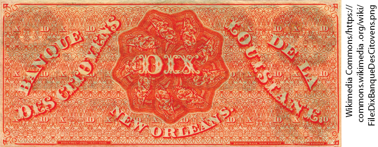
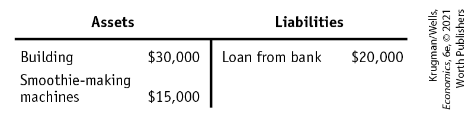
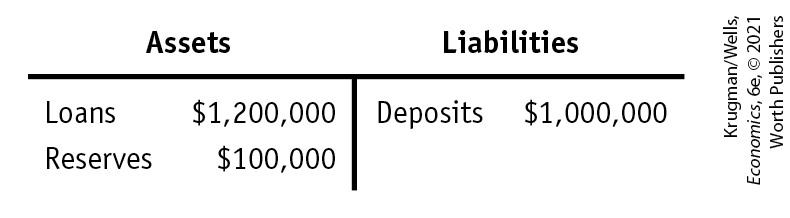

### ECONOMICS \>\> *in Action*

The History of the Dollar

U.S. dollar bills are pure fiat money: they have no intrinsic value, and they are not backed by anything that does. But U.S. money wasn’t always like that. In the early days of European settlement, the colonies that would become the United States used commodity money, partly consisting of gold and silver coins minted in Europe. But because such coins were scarce on this side of the Atlantic, the colonists relied on a variety of other forms of commodity money. For example, settlers in Virginia used tobacco as money and settlers in the Northeast used *wampum,* made from a clamshell.

Later in U.S. history, commodity-backed paper money came into widespread use. But this wasn’t paper money as we now know it, issued by the U.S. government and bearing the signature of the Secretary of the Treasury. Before the Civil War, the U.S. government didn’t issue any paper money. Instead, dollar bills were issued by private banks, which promised that their bills could be redeemed for gold or silver coins on demand. These promises weren’t always credible because banks sometimes failed, leaving holders of their bills with worthless pieces of paper. Understandably, people were reluctant to accept currency from any bank rumored to be in financial trouble. In this private money system, some dollars were less valuable than others.

<!--
<strong class="important">[Macro-14UN05]</strong>
--> <!--
<strong class="important">[MACRO 14UN05]</strong>
--> <!--
[No caption.]
-->

<figure id="pau_9781319320164_fZB52xoMqW" class="figure lm_img_lightbox unnum c2 right">

</figure>

A curious legacy of that time was notes issued by the Citizens’ Bank of Louisiana, based in New Orleans, that became among the most widely used bank notes in the southern states. These notes were printed in English on one side and French on the other. (At the time, many people in New Orleans, originally a colony of France, spoke French.) Thus, the \$10 bill read *Ten* on one side and *Dix,* the French word for *ten,* on the other. These \$10 bills became known as *dixies,* probably the source of the nickname of the U.S. South.

The U.S. government began issuing official paper money, called *greenbacks,* in 1862 as a way to pay for the ongoing Civil War. At first greenbacks had no fixed value in terms of commodities. After 1873, the U.S. government guaranteed the value of a dollar in terms of gold, effectively turning dollars into commodity-backed money.

In 1933, when President Franklin D. Roosevelt broke the link between dollars and gold, his own federal budget director — who feared that the public would lose confidence in the dollar if it wasn’t ultimately backed by gold — declared ominously, “This will be the end of Western civilization.” It wasn’t. The link between the dollar and gold was restored a few years later, then dropped again — seemingly for good — in August 1971. Despite the warnings of doom, the U.S. dollar went on to become the world’s most widely used currency.

<!--
<strong class="important">[End EIA]</strong>
--> <!--
<strong class="important">[Quick Review and Check Your Understanding position exactly where shown in MS. They do not float. ALL SUCH. See layouts for recto/verso design differences.]</strong>
-->

### \>\> *Quick Review*

- **Money** is any asset that can easily be used to purchase goods and services. **Currency in circulation** and **checkable bank deposits** are both part of the **money supply.**
- Money plays three roles: a **medium of exchange**, a **store of value**, and a **unit of account.**
- Historically, money took the form first of **commodity money**, then of **commodity-backed money.** Today the dollar is pure **fiat money.**
- The money supply is measured by two **monetary aggregates:** M1 and M2. M1 consists of currency in circulation, and checkable deposits. M2 consists of M1 plus various kinds of **near-moneys.**

### \>\> *Check Your Understanding* 14-1

1.  Suppose you have a gift card, good for certain products at participating stores. Is this gift card money? Why or why not?
2.  Although most bank accounts pay some interest, depositors can get a higher interest rate by buying a certificate of deposit, or CD. The difference between a CD and a checking account is that the depositor pays a penalty for withdrawing the money before the CD comes due — a period of months or even years. Small CDs are counted in M2 but not in M1. Explain why they are not part of M1.
3.  Explain why a system of commodity-backed money uses resources more efficiently than a system of commodity money.

## The Monetary Role of Banks

Roughly 41% of M1, the narrowest definition of the money supply, consists of currency in circulation — \$1 bills, \$5 bills, and so on. It’s obvious where currency comes from: it’s printed by the U.S. Treasury. But the rest of M1 consists of checkable bank deposits; savings deposits account for the great bulk of M2, the broader definition of the money supply. By either measure, then, bank deposits are a major component of the money supply. And this fact brings us to our next topic: the monetary role of banks.

### What Banks Do

As we learned in <a href="#kru_9781319245269_ch10_01.xhtml#pau_9781319320164_GbPAtnS6LO" id="kru_9781319245269_ch14_03.xhtml#pau_9781319320164_fOIDquNP0p" class="crossref">Chapter 10</a>, a bank is a *financial intermediary* that uses liquid assets in the form of bank deposits to finance the illiquid investments of borrowers. Banks can create liquidity because it isn’t necessary for a bank to keep all of the funds deposited with it in the form of highly liquid assets. Except in the case of a *bank run* — which we’ll get to shortly — all of a bank’s depositors won’t want to withdraw their funds at the same time. So a bank can provide its depositors with liquid assets yet still invest much of the depositors’ funds in illiquid assets, such as mortgages and business loans.

Banks can’t, however, lend out all the funds placed in their hands by depositors because they have to satisfy any depositor who wants to withdraw their funds. In order to meet these demands, a bank must keep substantial quantities of liquid assets on hand. In the modern U.S. banking system, these assets take the form either of currency in the bank’s vault or deposits held in the bank’s own account at the Federal Reserve. As we’ll see shortly, the latter can be converted into currency more or less instantly. Currency in bank vaults and bank deposits held at the Federal Reserve are called <a href="#kru_9781319245269_EM_glossary.xhtml#pau_9781319320164_S4A8A15xSu" id="kru_9781319245269_ch14_03.xhtml#pau_9781319320164_X9ItvDNLRS" class="glossref" role="doc-glossref">bank reserves</a>. Because bank reserves are in bank vaults and at the Federal Reserve, not held by the public, they are not part of currency in circulation.

<aside aria-label="title 1" class="glossary c3 main-flow v1" epub:type="glossary" id="pau_9781319320164_iqpjehkcI9">

**bank reserves**  
**Bank reserves** are the currency banks hold in their vaults plus their deposits at the Federal Reserve.

</aside>

To understand the role of banks in determining the money supply, we start by introducing a simple tool for analyzing the financial position of a bank or business: a <a href="#kru_9781319245269_EM_glossary.xhtml#pau_9781319320164_1ZyEMELwJJ" id="kru_9781319245269_ch14_03.xhtml#pau_9781319320164_KqdHZ2P1Hm" class="glossref" role="doc-glossref">T-account</a>. A T-account summarizes the financial position of a bank or business in a single table by showing assets on the left and liabilities on the right.

<aside aria-label="title 2" class="glossary c3 main-flow v1" epub:type="glossary" id="pau_9781319320164_K1NAx5zkwQ">

**T-account**  
A **T-account** is a tool for analyzing a business’s financial position by showing, in a single table, the business’s assets (on the left) and liabilities (on the right).

</aside>

<a href="#kru_9781319245269_ch14_03.xhtml#pau_9781319320164_4hHktp7aXC" id="kru_9781319245269_ch14_03.xhtml#pau_9781319320164_la7Co0Zmu4" class="crossref">Figure 14-2</a> shows the T-account for a hypothetical business that *isn’t* a bank — Samantha’s Smoothies. According to <a href="#kru_9781319245269_ch14_03.xhtml#pau_9781319320164_4hHktp7aXC" id="kru_9781319245269_ch14_03.xhtml#pau_9781319320164_qt43MVV8fq" class="crossref">Figure 14-2</a>, Samantha’s Smoothies owns a building worth \$30,000 and has \$15,000 worth of smoothie-making equipment. These are assets, so they’re on the left side of the table. To finance its opening, the business borrowed \$20,000 from a local bank. That’s a liability, so the loan is on the right side of the table. By looking at the T-account, you can immediately see what Samantha’s Smoothies owns and what it owes. Oh, and it’s called a T-account because the lines in the table make a T-shape.

<!--
<strong class="important">[Macro-</strong><xref rid="figure_BK_3"><strong class="important">Figure 14-2</strong></a><strong class="important">]</strong>
--> <!--
<strong class="important">[</strong><xref rid="figure_BK_3"><strong class="important">Figure 14-2</strong></a><strong class="important">]</strong>
-->

<figure id="pau_9781319320164_4hHktp7aXC" class="figure lm_img_lightbox num c3 main-flow">

<figcaption>
FIGURE 14-2 A T-Account for Samantha’s Smoothies

A T-account summarizes a business’s financial position. Its assets, in this case consisting of a building and some smoothie-making machinery, are on the left side. Its liabilities, consisting of the money it owes to a local bank, are on the right side.
</figcaption>
</figure>

<aside class="hidden" id="pau_9781319320164_iIQCa8hIl2" title="hidden">

The table has two columns, Assets and Liabilities. The assets column has the following data, Building, 30,000 dollars; Smoothie-making machines, 15,000 dollars. The liabilities column has the following data, Loan from Bank, 20,000 dollars.

</aside>

Samantha’s Smoothies is an ordinary, nonbank business. Now let’s look at the T-account for a hypothetical bank, First Street Bank, which is the repository of \$1 million in bank deposits.

<a href="#kru_9781319245269_ch14_03.xhtml#pau_9781319320164_eMwdqMgfSp" id="kru_9781319245269_ch14_03.xhtml#pau_9781319320164_QOsEnQQOfw" class="crossref">Figure 14-3</a> shows First Street Bank’s financial position. The loans First Street Bank has made are on the left side because they’re assets: they represent funds that those who have borrowed from the bank are expected to repay. The bank’s only other assets, in this simplified example, are its reserves, which, as we’ve learned, can take the form either of cash in the bank’s vault or deposits at the Federal Reserve. On the right side are the bank’s liabilities, which in this example consist entirely of deposits made by customers at First Street Bank. These are liabilities because they represent funds that must ultimately be repaid to depositors.

<!--
<strong class="important">[Macro-</strong><xref rid="figure_BK_4"><strong class="important">Figure 14-3</strong></a><strong class="important">]</strong>
--> <!--
<strong class="important">[</strong><xref rid="figure_BK_4"><strong class="important">Figure 14-3</strong></a><strong class="important">]</strong>
-->

<figure id="pau_9781319320164_eMwdqMgfSp" class="figure lm_img_lightbox num c3 main-flow">

<figcaption>
FIGURE 14-3 Assets and Liabilities of First Street Bank

First Street Bank’s assets consist of $1,200,000 in loans and $100,000 in reserves. Its liabilities consist of $1,000,000 in deposits—money owed to people who have placed funds in First Street’s hands.
</figcaption>
</figure>

<aside class="hidden" id="pau_9781319320164_l6Vt6rxHGL" title="hidden">

The table has two columns, Assets and Liabilities. The assets column has the following data, Loans, 1,200,000 dollars; Reserves, 100,000 dollars. The liabilities column has the following data, Deposits, 1,000,000 dollars.

</aside>

Notice that in this example First Street Bank’s assets are larger than its liabilities. And that’s the way it is supposed to be. Banks are required by law to maintain assets that are larger than their liabilities by a specific percentage.

We will assume that First Street Bank holds reserves equal to 10% of its customers’ bank deposits. The fraction of bank deposits that a bank holds as reserves is its <a href="#kru_9781319245269_EM_glossary.xhtml#pau_9781319320164_rMBZoWRHly" id="kru_9781319245269_ch14_03.xhtml#pau_9781319320164_TrRcMwG9Vw" class="glossref" role="doc-glossref">reserve ratio</a>. In the modern U.S. system, the Federal Reserve — which, among other things, regulates banks operating in the United States — sets a minimum required reserve ratio that banks must maintain. To understand why banks are regulated, let’s consider a problem banks can face: bank runs.

<aside aria-label="title 3" class="glossary c3 main-flow v1" epub:type="glossary" id="pau_9781319320164_NYzF9z7HMI">

**reserve ratio**  
The **reserve ratio** is the fraction of bank deposits that a bank holds as reserves.

</aside>

### The Problem of Bank Runs

A bank can lend out most of the funds deposited in its care because in normal times only a small fraction of its depositors want to withdraw their funds on any given day. But what would happen if, for some reason, all or at least a large fraction of its depositors tried to withdraw their funds during a short period of time, such as over a couple of days?

If a significant share of its depositors demanded their money back at the same time, the bank wouldn’t be able to raise enough cash to meet those demands. The reason for this cash shortfall is that banks convert most of their depositors’ funds into loans made to borrowers. That’s how banks earn revenue — by charging interest on loans.

Bank loans, however, are illiquid: they can’t easily be converted into cash on short notice. To see why, imagine that First Street Bank has lent \$100,000 to Drive-a-Peach Used Cars, a local dealership. To raise cash to meet demands for withdrawals, First Street Bank can sell its loan to Drive-a-Peach to someone else — another bank or an individual investor. But if First Street Bank tries to sell the loan quickly, potential buyers will be wary: they will suspect that First Street Bank wants to sell the loan because there is something wrong and the loan might not be repaid. As a result, First Street Bank can sell the loan quickly only by offering it for sale at a deep discount — say, a discount of 40%, for a sale price of \$60,000.

The upshot is that if a significant number of First Street Bank’s depositors suddenly decided to withdraw their funds, the bank’s efforts to raise the necessary cash quickly would force it to sell off its assets very cheaply. Inevitably, this leads to a *bank failure:* the bank would be unable to pay off its depositors in full.

What might start this whole process? That is, what might lead First Street Bank’s depositors to rush to pull their money out? A plausible answer is a spreading rumor that the bank is in financial trouble. Even if depositors aren’t sure the rumor is true, they are likely to play it safe and get their money out while they still can. And it gets worse: a depositor who simply thinks that *other* depositors are going to panic and try to get their money out will realize that this could “break the bank.” So this depositor joins the rush. In other words, fear about a bank’s financial condition can be a self-fulfilling prophecy: depositors who believe that other depositors will rush to the exit will rush to the exit themselves.

A <a href="#kru_9781319245269_EM_glossary.xhtml#pau_9781319320164_QwiMZV9cZK" id="kru_9781319245269_ch14_03.xhtml#pau_9781319320164_0xYr1XCIS4" class="glossref" role="doc-glossref">bank run</a>, then, is a phenomenon in which many of a bank’s depositors try to withdraw their funds due to fears of a bank failure. Moreover, bank runs aren’t bad only for the bank in question and its depositors. Historically, they have often proved contagious, with a run on one bank leading to a loss of faith in other banks, causing additional bank runs.

<aside aria-label="title 4" class="glossary c3 main-flow v1" epub:type="glossary" id="pau_9781319320164_GdkXTxi60L">

**bank run**  
A **bank run** is a phenomenon in which many of a bank’s depositors try to withdraw their funds due to fears of a bank failure.

</aside>

The upcoming Economics in Action describes an actual case of just such a contagion, the wave of bank runs that swept across the United States in the early 1930s. In response to that experience and similar experiences in other countries, the United States and most other modern governments established a system of bank regulations that protect depositors and prevent most bank runs.

### Bank Regulation

Should you worry about losing money in the United States due to a bank run? As long as it’s a conventional bank, the answer is no. After the banking crises of the 1930s, the United States and most other countries put into place a system designed to protect depositors and the economy as a whole against bank runs. This system has four main features: *deposit insurance, capital requirements, reserve requirements,* and, in addition, banks have access to the *discount window,* a source of cash when it’s needed.

#### 1. Deposit Insurance

Almost all banks in the United States advertise themselves as a “member of the FDIC” — the Federal Deposit Insurance Corporation. The FDIC provides <a href="#kru_9781319245269_EM_glossary.xhtml#pau_9781319320164_GSLRlFnJaF" id="kru_9781319245269_ch14_03.xhtml#pau_9781319320164_2KulYfd4Rv" class="glossref" role="doc-glossref">deposit insurance</a>, a guarantee that depositors will be paid from FDIC funds, even if the bank is unable to satisfy withdrawals, up to a maximum amount per account. The FDIC currently guarantees the first \$250,000 per depositor, per insured bank.

<aside aria-label="title 5" class="glossary c3 main-flow v1" epub:type="glossary" id="pau_9781319320164_xkaNkzEjRZ">

**deposit insurance**  
**Deposit insurance** guarantees that a bank’s depositors will be paid even if the bank can’t come up with the funds, up to a maximum amount per account.

</aside>

It is worth noting that deposit insurance doesn’t just protect depositors if a bank fails. It also greatly reduces the potential for bank failures from bank runs by eliminating the main reason for bank runs: since depositors know their funds are safe even if a bank should fail, they have no incentive to rush to withdraw their accounts because of a rumor that the bank is in trouble.

#### 2. Capital Requirements

Although deposit insurance protects the banking system against bank runs, it creates a well-known incentive problem. Because depositors are protected from loss, they have no incentive to monitor their bank’s financial health, allowing risky behavior by the bank to go undetected. At the same time, the owners of banks have an incentive to engage in overly risky investment behavior, such as making questionable loans at high interest rates. That’s because if all goes well, the owners profit. But if things go badly, the government covers the losses through federal deposit insurance.

To reduce the incentive for excessive risk taking, regulators require that bank owners hold substantially more assets than the value of bank deposits. That way, the bank still has assets larger than its deposits even if some of its loans go bad, and losses will accrue against the bank’s assets, not the government. The excess of a bank’s assets over its bank deposits and other liabilities is called the *bank’s capital.* Bank capital is sometimes referred to as the bank’s *net worth* or *owner’s equity.* For example, First Street Bank has capital of \$300,000, equal to $\text{(}\$ 1\text{,}200\text{,}000 + \$ 100\text{,}000\text{)} - \$ 1\text{,}000\text{,}000$. This is equivalent to $\$ 300\text{,}000\text{/(}\$ 1\text{,}200\text{,}000 + \$ 100\text{,}000\text{)} = 23\%$ of the total value of its assets. In practice, banks’ capital is required to equal at least 7% of the value of their assets.

#### 3. Reserve Requirements

Another regulation used to reduce the risk of bank runs is <a href="#kru_9781319245269_EM_glossary.xhtml#pau_9781319320164_RmlHB91g2C" id="kru_9781319245269_ch14_03.xhtml#pau_9781319320164_8Y54w1eZgr" class="glossref" role="doc-glossref">reserve requirements</a>, rules set by the Federal Reserve that specify the minimum reserve ratio for banks. For example, in the United States, the minimum reserve ratio for checkable bank deposits is 10%.

<aside aria-label="title 6" class="glossary c3 main-flow v1" epub:type="glossary" id="pau_9781319320164_3xXCOomWCX">

**reserve requirements**  
**Reserve requirements** are rules set by the Federal Reserve that determine the minimum reserve ratio for banks.

</aside>

#### 4. The Discount Window

One final protection against bank runs is the fact that the Federal Reserve, which we discuss more thoroughly later in this chapter, stands ready to lend money to banks in trouble, an arrangement known as the <a href="#kru_9781319245269_EM_glossary.xhtml#pau_9781319320164_augoBBysKU" id="kru_9781319245269_ch14_03.xhtml#pau_9781319320164_PKzXJi866M" class="glossref" role="doc-glossref">discount window</a>. The ability to borrow money means a bank can avoid being forced to sell its assets at fire-sale prices in order to satisfy the demands of a sudden rush of depositors demanding cash. Instead, it can turn to the Fed and borrow the funds it needs to pay off depositors.

<aside aria-label="title 7" class="glossary c3 main-flow v1" epub:type="glossary" id="pau_9781319320164_pbaMbT7iyg">

**discount window**  
The **discount window** is an arrangement in which the Federal Reserve stands ready to lend money to banks in trouble.

</aside>

#### Limits to Regulation’s Reach: Shadow Banking

The modern U.S. banking system is well-protected against old-fashioned bank runs. Unfortunately, as many investors learned to their horror in 2008, although old-fashioned bank runs may be a thing of the past, new-fashioned bank runs — which look very different, but have many of the same effects — can still happen.

How is that possible? The answer lies in a variety of financial arrangements that aren’t exactly banking in the traditional sense, but serve more or less the same purposes as conventional banking, and can pose serious risks. These arrangements, referred to as *shadow banking,* are undertaken by nondepository financial firms, including investment banks, insurance companies, hedge fund companies, and money market fund companies. Because they don’t accept deposits, firms in the shadow banking sector aren’t fully covered by the protections or regulations that have made conventional, depository banking so safe. We’ll say more about shadow banking later in the chapter.

<!--
<strong class="important">[Start EIA]</strong>
--> <!--
<strong class="important">Comp: insert globe icon.</strong>
-->

### ECONOMICS \>\> *in Action*

It’s a Wonderful Banking System

 <!--
<strong class="important">AU: Note slight wording changes in first paragraph.</strong>
-->

The classic 1946 film *It’s a Wonderful Life* is a holiday tradition. It stars Jimmy Stewart as George Bailey, a small-town banker whose life is saved by an angel. One pivotal scene depicts a run on Bailey’s bank, as fearful depositors rush to take their funds out.

When the movie was made, such scenes were still fresh memories for Americans who had lived through the Great Depression. There was a wave of bank runs in late 1930, a second wave in the spring of 1931, and a third wave in early 1933. By the end, more than a third of the nation’s banks had failed. To bring the panic to an end, on March 6, 1933, the newly inaugurated president, Franklin D. Roosevelt, declared a national *bank holiday,* closing all banks for a week to give bank regulators time to close unhealthy banks and certify healthy ones.

Since then, regulation has protected the United States and other wealthy countries against most bank runs. In fact, the scene in *It’s a Wonderful Life* was already out of date when the movie was made. But recent decades have seen several waves of bank runs in developing countries. For example, bank runs played a role in an economic crisis that swept Southeast Asia in 1997–1998 and in the severe economic crisis in Argentina that began in late 2001. And a panic with strong resemblance to a wave of bank runs swept world financial markets in 2008.

<figure id="pau_9781319320164_Ui87Q84ssW" class="figure lm_img_lightbox unnum c2 right">

<figcaption>
Panicky IndyMac depositors lined up to pull their money out of the troubled California bank in July 2008.
</figcaption>
</figure>

Notice that we said *most bank runs.* There are some limits on deposit insurance; in particular, as we’ve learned, in the United States currently only the first \$250,000 of an individual depositor’s funds in an insured bank is covered. As a result, there can still be a run on a bank perceived as troubled. In fact, that’s exactly what happened in July 2008 to IndyMac Bank, a Pasadena-based lender that had made a large number of questionable home loans. As questions about IndyMac’s financial soundness were raised, depositors began pulling out funds, forcing federal regulators to step in and close the bank. In Britain the limits on deposit insurance are much lower, which exposed the bank Northern Rock to a classic bank run in September 2007. Unlike the bank runs of the 1930s, however, most depositors at both IndyMac and Northern Rock got all their funds back — and the panics at these banks didn’t spread to other institutions.

<!--
<strong class="important">[Insert Macro-14UN06</strong>]
--> <!--
<strong class="important">[MACRO 14UN06]</strong>
-->

<!--
<strong class="important">[End EIA]</strong>
-->

### \>\> *Quick Review*

- A **T-account** is used to analyze a bank’s financial position. A bank holds **bank reserves** — currency in its vaults plus deposits held in its account at the Federal Reserve. The **reserve ratio** is the ratio of bank reserves to customers’ bank deposits.
- Because bank loans are illiquid, but a bank is obligated to return depositors’ funds on demand, **bank runs** are a potential problem. Although they took place on a massive scale during the 1930s, they have been largely eliminated in the United States through bank regulation in the form of **deposit insurance**, capital requirements, and **reserve requirements**, as well as through the availability of the **discount window.** The emergence of shadow banking, however, has shown the limits of regulation to prevent bank runs in the conventional banking sector.

### \>\> *Check Your Understanding* 14-2

1.  Suppose you are a depositor at First Street Bank. You hear a rumor that the bank has suffered serious losses on its loans. Every depositor knows that the rumor isn’t true, but each thinks that most other depositors believe the rumor. Why, in the absence of deposit insurance, could this lead to a bank run? How does deposit insurance change the situation?
2.  A con artist has a great idea: they’ll open a bank without investing any capital and lend all the deposits at high interest rates to real estate developers. If the real estate market booms, the loans will be repaid and they’ll make high profits. If the real estate market goes bust, the loans won’t be repaid and the bank will fail — but they will not lose any of their own wealth. How would modern bank regulation frustrate this scheme?

## Determining the Money Supply

Without banks, there would be no checkable deposits, so the quantity of currency in circulation would equal the money supply. In that case, the money supply would be solely determined by whoever controls government minting and printing presses. But banks do exist, and through their creation of checkable bank deposits they affect the money supply in two ways.

1.  Banks reduce the money supply by removing some currency from circulation: dollar bills that are sitting in bank vaults, as opposed to sitting in people’s wallets, aren’t part of the money supply.
2.  Much more importantly, banks increase the money supply by making loans, the total value of which is much larger than their reserves. As a result, they make the money supply larger than just the value of currency in circulation.

Our next topic is how banks create money and what determines the amount of money they create.
