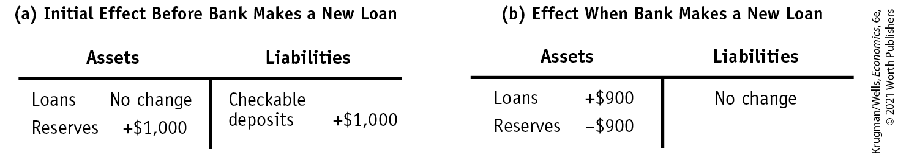
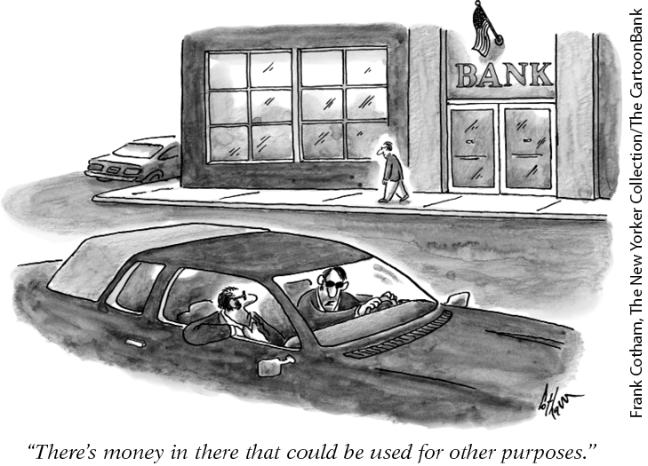
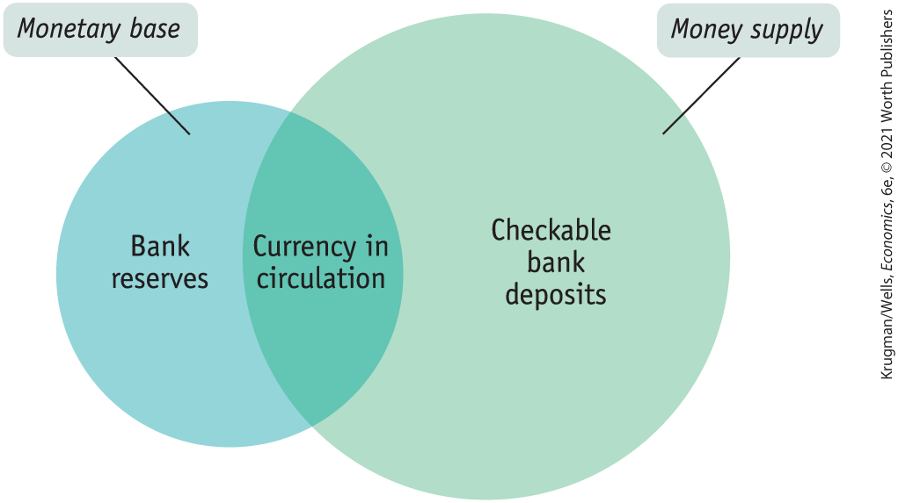
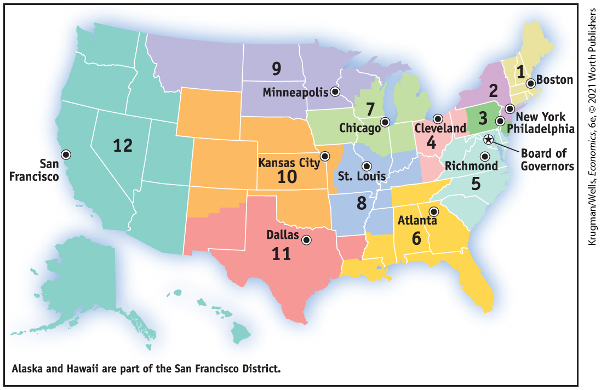

### How Banks Create Money

To see how banks create money, let’s examine what happens when someone decides to deposit currency in a bank. Consider the example of Silas, a miser, who keeps a shoebox full of cash under his bed. Suppose Silas realizes that it would be safer, as well as more convenient, to deposit that cash in the bank and to use his debit card when shopping. Assume that he deposits \$1,000 into a checkable account at First Street Bank. What effect will Silas’s actions have on the money supply?

Panel (a) of <a href="#kru_9781319245269_ch14_04.xhtml#pau_9781319320164_xx6c9W75h5" id="kru_9781319245269_ch14_04.xhtml#pau_9781319320164_yVjG4UJM56" class="crossref">Figure 14-4</a> shows the initial effect of his deposit. First Street Bank credits Silas with \$1,000 in his account, so the economy’s checkable bank deposits rise by \$1,000. Meanwhile, Silas’s cash goes into the vault, raising First Street’s reserves by \$1,000 as well.

<!--
<strong class="important">[Macro-</strong><xref rid="figure_BK_5"><strong class="important">Figure 14-4</strong></a><strong class="important">]</strong>
--> <!--
<strong class="important">[</strong><xref rid="figure_BK_5"><strong class="important">Figure 14-4</strong></a><strong class="important">]</strong>
-->

<figure id="pau_9781319320164_xx6c9W75h5" class="figure lm_img_lightbox num c4 main-flow">

<figcaption>
FIGURE 14-4 Effect on the Money Supply of Turning Cash into a Checkable Deposit at First Street Bank

When Silas deposits $1,000 (which had been stashed under his bed) into a checkable bank account, there is initially no effect on the money supply: currency in circulation falls by $1,000, but checkable bank deposits rise by $1,000. The corresponding entries on the bank’s T-account, depicted in panel (a), show deposits initially rising by $1,000 and the bank’s reserves initially rising by $1,000. In the second stage, depicted in panel (b), the bank holds 10% of Silas’s deposit ($100) as reserves and lends out the rest ($900) to Maya. As a result, its reserves fall by $900 and its loans increase by $900. Its liabilities, including Silas’s $1,000 deposit, are unchanged. The money supply, the sum of checkable bank deposits and currency in circulation, has now increased by $900—the $900 now held by Maya.
</figcaption>
</figure>

<aside class="hidden" id="pau_9781319320164_zZuXrz0Ccq" title="hidden">

Table (a) Initial Effect Before Bank Makes a New Loan: The table has two columns, Assets, and Liabilities. The assets column has the following data, Loans, No change; Reserves, positive 1,000 dollars. The liabilities column has the following data, Checkable deposits, positive 1,000 dollars. Table (b) Effect When Bank Makes a New Loan: The table has two columns, Assets, and Liabilities. The assets column has the following data, Loans, positive 900 dollars; Reserves, negative 900 dollars. The liabilities column has the following data, No change.

</aside>

This initial transaction has no effect on the money supply. Currency in circulation, part of the money supply, falls by \$1,000. Checkable bank deposits, also part of the money supply, rise by the same amount.

But this is not the end of the story, because First Street Bank can now lend out part of Silas’s deposit. Assume that it holds 10% of Silas’s deposit — \$100 — in reserves and lends the rest out in cash to Silas’s neighbor, Maya. The effect of this second stage is shown in panel (b). First Street’s deposits remain unchanged, and so does the value of its assets. But the composition of its assets changes: by making the loan, it reduces its reserves by \$900, so that they are only \$100 larger than they were before Silas made his deposit. In the place of the \$900 reduction in reserves, the bank has acquired an IOU, its \$900 cash loan to Maya.

So by putting \$900 of Silas’s cash back into circulation by lending it to Maya, First Street Bank has, in fact, increased the money supply. That is, the sum of currency in circulation and checkable bank deposits has risen by \$900 compared to what it had been when Silas’s cash was still under his bed. Although Silas is still the owner of \$1,000, now in the form of a checkable deposit, Maya has the use of \$900 in cash from her borrowings.

And this may not be the end of the story. Suppose that Maya uses her cash to buy a television from Acme Merchandise. What does Anne Acme, the store’s owner, do with the cash? If she holds on to it, the money supply doesn’t increase any further. But suppose she deposits the \$900 into a checkable bank deposit — say, at Second Street Bank. Second Street Bank, in turn, will keep only part of that deposit in reserves, lending out the rest, creating still more money.

Assume that Second Street Bank, like First Street Bank, keeps 10% of any bank deposit in reserves and lends out the rest. Then it will keep \$90 in reserves and lend out \$810 of Anne’s deposit to another borrower, further increasing the money supply.

<a href="#kru_9781319245269_ch14_04.xhtml#pau_9781319320164_mD0VJvaYmc" id="kru_9781319245269_ch14_04.xhtml#pau_9781319320164_nxs6vveqdg" class="crossref">Table 14-1</a> shows the process of money creation we have described so far. To simplify the table we will assume that, at first, the money supply consists only of Silas’s \$1,000. After he deposits the cash into a checkable bank deposit and the bank makes a loan, the money supply rises to \$1,900. After the second deposit and the second loan, the money supply rises to \$2,710. And the process will, of course, continue from there. (Although we have considered the case in which Silas places his cash in a checkable bank deposit, the results would be the same if he put it into any type of near-money.)

<!--
<strong class="important">[</strong><xref rid="table_BK_1"><strong class="important">TABLE 14-1</strong></a><strong class="important">] [Table is from 5/e p. 425]</strong>
-->

<table id="pau_9781319320164_mD0VJvaYmc" class="table sectioned c3 main-flow">
<caption>
TABLE 14-1 How Banks Create Money
</caption>
<colgroup>
<col style="width: 25%" />
<col style="width: 25%" />
<col style="width: 25%" />
<col style="width: 25%" />
</colgroup>
<tbody>
<tr id="pau_9781319320164_DZYzeUZSSa" class="odd">
<td id="pau_9781319320164_ciCtxPkxHT" class="left v3"></td>
<td id="pau_9781319320164_Ndo8dYa6eL" class="center v3" scope="col">
Currency in circulation
</td>
<td id="pau_9781319320164_3Ivmp17hAU" class="center v3" scope="col">
Checkable bank deposits
</td>
<td id="pau_9781319320164_jseHwpm4ae" class="center v3" scope="col">
Money supply
</td>
</tr>
<tr id="pau_9781319320164_qt5TlepGQs" class="even">
<td id="pau_9781319320164_hd7PLb3oqz" class="left v4"><ul>
<li><strong>First stage</strong></li>
<li>Silas keeps his cash under his bed.</li>
</ul></td>
<td id="pau_9781319320164_HEGDJI5YpU" class="right v4">
$1,000
</td>
<td id="pau_9781319320164_OUjkcpYXbc" class="right v4">
$0
</td>
<td id="pau_9781319320164_dvXgA10ck9" class="right v4">
$1,000
</td>
</tr>
<tr id="pau_9781319320164_jHmNQBaTYD" class="odd">
<td id="pau_9781319320164_XcpcmSwCkL" class="left v3"><ul>
<li><strong>Second stage</strong></li>
<li>Silas deposits cash in First Street Bank, which lends out $900 to Maya, who then pays it to Anne Acme.</li>
</ul></td>
<td id="pau_9781319320164_7XIC2Ksb7R" class="right v3">
900
</td>
<td id="pau_9781319320164_HWd54Sb4UH" class="right v3">
1,000
</td>
<td id="pau_9781319320164_5w9S5Efqvb" class="right v3">
1,900
</td>
</tr>
<tr id="pau_9781319320164_8XQZRnNmTq" class="even">
<td id="pau_9781319320164_UWgnkKmUzZ" class="left v4"><ul>
<li><strong>Third stage</strong></li>
<li>Anne Acme deposits $900 in Second Street Bank, which lends out $810 to another borrower.</li>
</ul></td>
<td id="pau_9781319320164_Wz0CHzhaUc" class="right v4">
810
</td>
<td id="pau_9781319320164_7ScDtTg78g" class="right v4">
1,900
</td>
<td id="pau_9781319320164_VSoyokFW9m" class="right v4">
2,710
</td>
</tr>
</tbody>
</table>

TABLE 14-1 How Banks Create Money

This process of money creation may sound familiar. In <a href="#kru_9781319245269_ch11_01.xhtml#pau_9781319320164_qvzco1ppmg" id="kru_9781319245269_ch14_04.xhtml#pau_9781319320164_Rk6JUO3dPJ" class="crossref">Chapter 11</a> we described the *multiplier process:* an initial increase in real GDP leads to a rise in consumer spending, which leads to a further rise in real GDP, which leads to a further rise in consumer spending, and so on. What we have here is another kind of multiplier — the *money multiplier.* We’ll now see what determines the size of this multiplier.

### Reserves, Bank Deposits, and the Money Multiplier

In tracing out the effect of Silas’s deposit in <a href="#kru_9781319245269_ch14_04.xhtml#pau_9781319320164_mD0VJvaYmc" id="kru_9781319245269_ch14_04.xhtml#pau_9781319320164_LDikglzUbA" class="crossref">Table 14-1</a>, we assumed that the funds a bank lends out always end up being deposited either in the same bank or in another bank — so funds disbursed as loans come back to the banking system, even if not to the lending bank itself.

In reality, some of these loaned funds may be held by borrowers in their wallets and not deposited in a bank, meaning that some of the loaned amount “leaks” out of the banking system. Such leaks reduce the size of the money multiplier, just as leaks of real income into savings reduce the size of the real GDP multiplier. (Bear in mind, however, that the leak here comes from the fact that borrowers keep some of their funds in currency, rather than the fact that consumers save some of their income.)

But let’s set that complication aside for a moment and consider how the money supply is determined in a checkable-deposits-only monetary system, where funds are always deposited in bank accounts and none are held in wallets as currency. That is, in our checkable-deposits-only monetary system, any and all funds borrowed from a bank are immediately deposited into a checkable bank account. We’ll assume that banks are required to satisfy a minimum reserve ratio of 10% and that every bank lends out all of its <a href="#kru_9781319245269_EM_glossary.xhtml#pau_9781319320164_xmqwDSu7Md" id="kru_9781319245269_ch14_04.xhtml#pau_9781319320164_LEkJMxebgj" class="glossref" role="doc-glossref">excess reserves</a>, reserves over and above the amount needed to satisfy the minimum reserve ratio.

<aside aria-label="title 1" class="glossary c3 main-flow v1" epub:type="glossary" id="pau_9781319320164_zfuWxpyZNo">

**excess reserves**  
**Excess reserves** are a bank’s reserves over and above its required reserves.

</aside>
<!--
<strong class="important">[Macro-14UN07</strong>]
-->

<figure id="pau_9781319320164_LU0yKXlkkk" class="figure lm_img_lightbox unnum c2 right">

</figure>

Now suppose that for some reason a bank suddenly finds itself with \$1,000 in excess reserves. What happens? The answer is that the bank will lend out that \$1,000, which will end up as a checkable bank deposit somewhere in the banking system, launching a money multiplier process very similar to the process shown in <a href="#kru_9781319245269_ch14_04.xhtml#pau_9781319320164_mD0VJvaYmc" id="kru_9781319245269_ch14_04.xhtml#pau_9781319320164_iENIWgMpRY" class="crossref">Table 14-1</a>.

In the first stage, the bank lends out its excess reserves of \$1,000, which becomes a checkable bank deposit somewhere. The bank that receives the \$1,000 deposit keeps 10%, or \$100, as reserves and lends out the remaining 90%, or \$900, which again becomes a checkable bank deposit somewhere. The bank receiving this \$900 deposit again keeps 10%, which is \$90, as reserves and lends out the remaining \$810. The bank receiving this \$810 keeps \$81 in reserves and lends out the remaining \$729, and so on. As a result of this process, the total increase in checkable bank deposits is equal to a sum that looks like:

$$\$ 1\text{,}000 + \$ 900 + \$ 810 + \$ 729 + \ldots$$

We’ll use the symbol *rr* for the reserve ratio. More generally, the total increase in checkable bank deposits that is generated when a bank lends out \$1,000 in excess reserves is:

$$\begin{array}{l}
{\text{Increase~in~checkable~bank~deposits~from~}\$ 1,000\text{~in~excess~reserves~} =} \\
{\$ 1,000 + (\$ 1,000 \times (1 - rr)) + (\$ 1,000 \times {(1 - rr)}^{2}) + (\$ 1,000 \times {(1 - rr)}^{3}) + \ldots}
\end{array}$$

**(14-1)**

As we saw in <a href="#kru_9781319245269_ch11_01.xhtml#pau_9781319320164_qvzco1ppmg" id="kru_9781319245269_ch14_04.xhtml#pau_9781319320164_w6ORpREAMf" class="crossref">Chapter 11</a>, an infinite series of this form can be simplified to:

$$\begin{array}{l}
{\text{Increase~in~checkable~bank~deposits~from~}\$ 1,000\text{~in~excess~reserves~} =} \\
{\$ 1,000/rr}
\end{array}$$

**(14-2)**

Given a reserve ratio of 10%, or 0.1, a \$1,000 increase in excess reserves will increase the total value of checkable bank deposits by <!--&#x003C;&amp;lt;-->$\$ 1\text{,}000\text{/}0.1 = \$ 10\text{,}000$<!---->--\>. In fact, in a checkable-deposits-only monetary system, the total value of checkable bank deposits will be equal to the value of bank reserves divided by the reserve ratio. Or to put it a different way, if the reserve ratio is 10%, each \$1 of reserves held by a bank supports <!--&#x003C;&amp;lt;-->$\$ 1\text{/}rr = \$ 1\text{/}0.1 = \$ 10$<!---->--\> of checkable bank deposits.

### The Money Multiplier in Reality

In reality, the determination of the money supply is more complicated than our simple model suggests because it depends not only on the ratio of reserves to bank deposits but also on the fraction of the money supply that individuals choose to hold in the form of currency. In fact, we already saw this in our example of Silas depositing the cash under his bed: when he chose to hold a checkable bank deposit instead of currency, he set in motion an increase in the money supply.

To define the money multiplier in practice, it’s important to recognize that the Federal Reserve controls the *sum* of bank reserves and currency in circulation, called the *monetary base,* but it does not control the allocation of that sum between bank reserves and currency in circulation. Consider Silas and his deposit one more time: by taking the cash from under his bed and depositing it in a bank, he reduced the quantity of currency in circulation but increased bank reserves by an equal amount — leaving the *monetary base,* on net, unchanged. The <a href="#kru_9781319245269_EM_glossary.xhtml#pau_9781319320164_xpgve7j2Lf" id="kru_9781319245269_ch14_04.xhtml#pau_9781319320164_AFZvqvALHh" class="glossref" role="doc-glossref">monetary base</a>, which is the quantity the monetary authorities control, is the sum of currency in circulation and reserves held by banks.

<aside aria-label="title 2" class="glossary c3 main-flow v1" epub:type="glossary" id="pau_9781319320164_PW6vumD3p0">

**monetary base**  
The **monetary base** is the sum of currency in circulation and bank reserves.

</aside>

The monetary base is different from the money supply in two ways.

1.  Bank reserves, which are part of the monetary base, aren’t considered part of the money supply. A \$1 bill in someone’s wallet is considered money because it’s available for an individual to spend, but a \$1 bill held as bank reserves in a bank vault or deposited at the Federal Reserve isn’t considered part of the money supply because it’s not available for spending.
2.  Checkable bank deposits, which are part of the money supply because they are available for spending, aren’t part of the monetary base.

<a href="#kru_9781319245269_ch14_04.xhtml#pau_9781319320164_V5uIO9QUcw" id="kru_9781319245269_ch14_04.xhtml#pau_9781319320164_a0JyccweDv" class="crossref">Figure 14-5</a> illustrates the two concepts. The circle on the left represents the monetary base, consisting of bank reserves plus currency in circulation. The circle on the right represents the money supply, consisting mainly of currency in circulation plus checkable or near-checkable bank deposits. As the figure indicates, currency in circulation is part of both the monetary base and the money supply. But bank reserves aren’t part of the money supply, and checkable or near-checkable bank deposits aren’t part of the monetary base. In practice, most of the monetary base actually consists of currency in circulation, which also makes up about half of the money supply.

<!--
<strong class="important">[Macro-</strong><xref rid="figure_BK_6"><strong class="important">Figure 14-</strong>5</a>]
--> <!--
<strong class="important">[</strong><xref rid="figure_BK_6"><strong class="important">Figure 14-5</strong></a><strong class="important">]</strong>
-->

<figure id="pau_9781319320164_V5uIO9QUcw" class="figure lm_img_lightbox num c3 main-flow">

<figcaption>
FIGURE 14-5 The Monetary Base and the Money Supply

The monetary base is equal to bank reserves plus currency in circulation. It is different from the money supply, consisting mainly of checkable or near-checkable bank deposits plus currency in circulation. Each dollar of bank reserves backs several dollars of bank deposits. As a result, in normal economic times, the money supply is larger than the monetary base, making the circle at right larger than the circle on the left. However, in extraordinary economic times, as in the aftermath of the 2008 financial crisis, the monetary base grew, overtaking the money supply, making the circle at right smaller than the circle on the left.
</figcaption>
</figure>

Now we can formally define the <a href="#kru_9781319245269_EM_glossary.xhtml#pau_9781319320164_0ukK11zoO0" id="kru_9781319245269_ch14_04.xhtml#pau_9781319320164_Z1DvCE50QZ" class="glossref" role="doc-glossref">money multiplier</a>**:** it’s the ratio of the money supply to the monetary base. Before the financial crisis of 2008, it was about 1.6, as calculated from official Federal Reserve statistics. After the crisis, it fell to about 0.7. Even before the crisis it was a lot smaller than <!--&#x003C;&amp;lt;-->$1\text{/}0.1 = 10$<!---->--\>, which would be the money multiplier in a checkable-deposits-only system with a reserve ratio of 10% (the minimum required ratio for most checkable deposits in the United States).

<aside aria-label="title 3" class="glossary c3 main-flow v1" epub:type="glossary" id="pau_9781319320164_IPGhrNXq8F">

**money multiplier**  
The **money multiplier** is the ratio of the money supply to the monetary base.

</aside>

The reason the actual money multiplier has been smaller than 10 is that people hold significant amounts of cash, and a dollar of currency in circulation, unlike a dollar in reserves, doesn’t support multiple dollars of the money supply. In fact, before the crisis currency in circulation accounted for more than 90% of the monetary base.

<!--
<strong class="important">[Macro-14UN08]</strong>
--> <!--
<strong class="important">[MACRO 14UN08]</strong>
-->

<figure id="pau_9781319320164_9DDpEdtPUw" class="figure lm_img_lightbox unnum c2 right">

<figcaption>
The collapse of Lehman Brothers and the ensuing financial crisis prompted the Federal Reserve to dramatically increase the monetary base in order to stabilize the economy.
</figcaption>
</figure>

At the beginning of 2009, currency in circulation had dropped to only 40% of the monetary base. Over a decade later, in 2019, the percentage had only increased slightly, to 47%. What happened, basically, is that the Federal Reserve dramatically expanded the monetary base in response to the financial crisis. The Fed undertook this action in an effort to stabilize the economy after Lehman Brothers, a key financial institution, failed in September 2008.

However, banks saw few opportunities for safe, profitable lending at the time. So rather than lending out the increase in the monetary base, they parked it at the Federal Reserve in the form of deposits that counted as part of the monetary base. As a result, currency in circulation no longer dominated the monetary base, as the surge in deposits at the Fed made the monetary base larger than M1. As a result, the actual money multiplier fell to less than 1 as banks held much more than the required 10% in reserves at the Fed. It wasn’t until 2019 when the money multiplier was finally back above 1: by March 2020 it stood at 1.01.

<!--
<strong class="important">[Start EIA]</strong>
-->

### ECONOMICS \>\> *in Action*

Multiplying Money Down

|                                                                                       |                                                                                                                                 |                                                                                                                                 |                                                                                                                                 |
|---------------------------------------------------------------------------------------|---------------------------------------------------------------------------------------------------------------------------------|---------------------------------------------------------------------------------------------------------------------------------|---------------------------------------------------------------------------------------------------------------------------------|
|                                                                                       | Currency in circulation                                                                                                         | Checkable bank deposits                                                                                                         | M1                                                                                                                              |
|                                                                                       | (billions of dollars)                                                                                                           |                                                                                                                                 |                                                                                                                                 |
| 1929                                                                                  | \$3.90                                                                                                                          | \$22.74                                                                                                                         | \$26.64                                                                                                                         |
| 1933                                                                                  | 5.09                                                                                                                            | 14.82                                                                                                                           | 19.91                                                                                                                           |
| Percent change                                                                        | $\text{+31\%}$ | $\text{−35\%}$ | $\text{+25\%}$ |
| *Data from:* U.S. Census Bureau (1975), *Historical Statistics of the United States.* |                                                                                                                                 |                                                                                                                                 |                                                                                                                                 |

TABLE 14-2 The Effects of Bank Runs, 1929–1933

In our hypothetical example illustrating how banks create money, we described Silas the miser taking the currency from under his bed and turning it into a checkable bank deposit. This led to an increase in the money supply as banks engaged in successive waves of lending backed by Silas’s funds. It follows that if something happened to make Silas revert to old habits, taking his money out of the bank and putting it back under his bed, the result would be less lending and, ultimately, a decline in the money supply. That’s exactly what happened as a result of the bank runs of the 1930s.

<a href="#kru_9781319245269_ch14_04.xhtml#pau_9781319320164_LcPEFiIpc2" id="kru_9781319245269_ch14_04.xhtml#pau_9781319320164_u8XhavPY7J" class="crossref">Table 14-2</a> shows what happened between 1929 and 1933, as bank failures shook the public’s confidence in the banking system:

<!--
<strong class="important">[</strong><xref rid="table_BK_2"><strong class="important">Table 14-2</strong></a><strong class="important"> is from macro 5e p. 428]</strong>
-->

- The second column shows the public’s holdings of currency. This increased sharply, as many Americans decided that money under the bed was safer than money in the bank after all.
- The third column shows the value of checkable bank deposits. This fell sharply, through the multiplier process, when individuals pulled their cash out of banks. Loans also fell because banks that survived the waves of bank runs increased their excess reserves, just in case another wave began.
- The fourth column shows the value of M1, the first of the monetary aggregates we described earlier. It fell sharply because the total reduction in checkable or near-checkable bank deposits was much larger than the increase in currency in circulation.

<!--
<strong class="important">[End EIA]</strong>
-->

### \>\> *Quick Review*

- Banks create money when they lend out **excess reserves**, generating a multiplier effect on the money supply.
- In a checkable-deposits-only system, \$1 of bank reserves supports <!--&#x003C;&amp;lt;-->$\$ 1/ rr$<!---->--\> checkable deposits. So the money supply would be equal to bank reserves divided by the reserve ratio. In reality, however, the public holds some funds as cash rather than in checkable deposits.
- The Fed controls the **monetary base**, equal to bank reserves plus currency in circulation. The **money multiplier** is equal to the money supply divided by the monetary base. It is smaller than <!--&#x003C;&amp;lt;-->$\$ 1/ rr$<!---->--\> because people hold some funds as cash.

### \>\> *Check Your Understanding* 14-3

1.  Assume that total reserves are equal to \$200 and total checkable bank deposits are equal to \$1,000. Also assume that the public does not hold any currency. Now suppose that the required reserve ratio falls from 20% to 10%. Trace out how this leads to an expansion in bank deposits.
2.  Take the example of Silas depositing his \$1,000 in cash into First Street Bank and assume that the required reserve ratio is 10%. But now assume that each time someone receives a bank loan, they keep half the loan in cash. Explain the resulting expansion in the money supply.

## The Federal Reserve System

Who’s in charge of ensuring that banks maintain enough reserves? Who decides how large the monetary base will be? The answer, in the United States, is an institution known as the Federal Reserve, or the Fed. The Federal Reserve is a <a href="#kru_9781319245269_EM_glossary.xhtml#pau_9781319320164_D0mBw80kWK" id="kru_9781319245269_ch14_05.xhtml#pau_9781319320164_6QKYQ1LTWN" class="glossref" role="doc-glossref">central bank</a> — an institution that oversees and regulates the banking system and controls the monetary base.

<aside aria-label="title 1" class="glossary c3 main-flow v1" epub:type="glossary" id="pau_9781319320164_4fqtUlBksJ">

**central bank**  
A **central bank** is an institution that oversees and regulates the banking system and controls the monetary base.

</aside>

Other central banks include the Bank of England, the People’s Bank of China, the Bank of Japan, and the European Central Bank, or ECB. The ECB acts as a common central bank for 19 European countries: Austria, Belgium, Cyprus, Estonia, Finland, France, Germany, Greece, Ireland, Italy, Latvia, Lithuania, Luxembourg, Malta, the Netherlands, Portugal, Slovakia, Slovenia, and Spain. The world’s oldest central bank is Sweden’s Sveriges Riksbank, which awards the Nobel Prize in economics.

### The Structure of the Fed

The legal status of the Fed, which was created in 1913, is unusual: it is not exactly part of the U.S. government, but it is not really a private institution either. Strictly speaking, the Federal Reserve system consists of two parts: the Board of Governors and the 12 regional Federal Reserve Banks.

The Board of Governors, which oversees the entire system from its offices in Washington, D.C., is constituted like a government agency: its seven members are appointed by the president and must be approved by the Senate. However, they are appointed for 14-year terms, to insulate them from political pressure in their conduct of monetary policy. (Why this is a potential problem will become clear in the next chapter, when we discuss inflation.)

Although the chair is appointed more frequently — every four years — chairs are often reappointed and serve much longer terms. For example, William McChesney Martin was chair of the Fed from 1951 until 1970. Alan Greenspan, appointed in 1987, served as the Fed’s chair until 2006. Ben Bernanke, Greenspan’s successor, served until 2014. Janet Yellen, who followed Bernanke, became the first chair to not be reappointed to a second term. Jerome Powell was her successor at the Fed.

The 12 Federal Reserve Banks each serve a region of the country, providing various banking and supervisory services. One of their jobs, for example, is to audit the books of private-sector banks to ensure their financial health. Each regional bank is run by a board of directors chosen from the local banking and business community. The Federal Reserve Bank of New York plays a special role: it carries out *open-market operations,* usually the main tool of monetary policy. <a href="#kru_9781319245269_ch14_05.xhtml#pau_9781319320164_CcaI8dQJ3S" id="kru_9781319245269_ch14_05.xhtml#pau_9781319320164_rYMwWpGEJB" class="crossref">Figure 14-6</a> shows the 12 Federal Reserve districts and the city in which each regional Federal Reserve Bank is located.

<!--
<strong class="important">[Macro-</strong><xref rid="figure_BK_7"><strong class="important">Figure 14-6</strong></a>]
--> <!--
<strong class="important">[</strong><xref rid="figure_BK_7"><strong class="important">Figure 14-6</strong></a><strong class="important">]</strong>
-->

<figure id="pau_9781319320164_CcaI8dQJ3S" class="figure lm_img_lightbox num c3 main-flow">

<figcaption>
FIGURE 14-6 The Federal Reserve System

The Federal Reserve System consists of the Board of Governors in Washington, D.C., plus 12 regional Federal Reserve Banks. This map shows each of the 12 Federal Reserve districts.

<em>Data from:</em> Board of Governors of the Federal Reserve System.
</figcaption>
</figure>

<aside class="hidden" id="pau_9781319320164_MQPNL6WuII" title="hidden">

The data from right to left of the map are as follows, 1, Boston; 2, New York; 3, Philadelphia; 4, Cleve Land; 5, Richmond; 6, Atlanta; 7, Chicago; 8, St. Louis; 9, Minneapolis; 10, Kansas City; 11, Dallas; 12, San Francisco. Board of Governors is marked between Philadelphia and Richmond. Alaska and Hawaii are part of the San Francisco District.

</aside>

Decisions about monetary policy are made by the Federal Open Market Committee, which consists of the Board of Governors plus five of the regional bank presidents. The president of the Federal Reserve Bank of New York is always on the committee, and the other four seats rotate among the 11 other regional bank presidents. The chair of the Board of Governors normally also serves as the chair of the Open Market Committee.

The effect of this complex structure is to create an institution that is ultimately accountable to the voting public because the Board of Governors is chosen by the president and confirmed by the Senate, all of whom are themselves elected officials. But the long terms served by board members, as well as the indirectness of their appointment process, largely insulate them from short-term political pressures.

### What the Fed Does: Reserve Requirements and the Discount Rate

The Fed has three main policy tools at its disposal: *reserve requirements,* the *discount rate,* and, most importantly, *open-market operations.*

In our discussion of bank runs, we noted that the Fed sets a minimum reserve ratio requirement, currently equal to 10% for checkable bank deposits. Banks that fail to maintain at least the required reserve ratio on average over a two-week period face penalties.

What does a bank do if it looks as if it has insufficient reserves to meet the Fed’s reserve requirement? Normally, it borrows additional reserves from other banks via the <a href="#kru_9781319245269_EM_glossary.xhtml#pau_9781319320164_WOMFggWBex" id="kru_9781319245269_ch14_05.xhtml#pau_9781319320164_Lr9YVckT3q" class="glossref" role="doc-glossref">federal funds market</a>, a financial market that allows banks that fall short of the reserve requirement to borrow reserves (usually just overnight) from banks that are holding excess reserves. The interest rate in this market is determined by supply and demand — but the supply and demand for bank reserves are both strongly affected by Federal Reserve actions. As we’ll see in the next chapter, the <a href="#kru_9781319245269_EM_glossary.xhtml#pau_9781319320164_FPHiyfwkd5" id="kru_9781319245269_ch14_05.xhtml#pau_9781319320164_NfoGAk0qid" class="glossref" role="doc-glossref">federal funds rate</a>, the interest rate at which funds are borrowed and lent in the federal funds market, plays a key role in modern monetary policy.

<aside aria-label="title 2" class="glossary c3 main-flow v1" epub:type="glossary" id="pau_9781319320164_bNo7DRNHs5">

**federal funds market**  
The **federal funds market** allows banks that fall short of the reserve requirement to borrow funds from banks with excess reserves.

</aside>
<aside aria-label="title 3" class="glossary c3 main-flow v1" epub:type="glossary" id="pau_9781319320164_7VxQGnTEht">

**federal funds rate**  
The **federal funds rate** is the interest rate at which funds are borrowed and lent in the federal funds market.

</aside>

Alternatively, banks in need of reserves can borrow from the Fed itself via the *discount window.* The <a href="#kru_9781319245269_EM_glossary.xhtml#pau_9781319320164_AlkKQ80bFC" id="kru_9781319245269_ch14_05.xhtml#pau_9781319320164_1ypnSRf39W" class="glossref" role="doc-glossref">discount rate</a> is the rate of interest the Fed charges on those loans. Normally, the discount rate is set 1 percentage point above the federal funds rate in order to discourage banks from turning to the Fed when they are in need of reserves. Beginning in the fall of 2007, however, the Fed reduced the spread between the federal funds rate and the discount rate as part of its response to an ongoing financial crisis, described in the upcoming Economics in Action. As a result, by the spring of 2008 the discount rate was only 0.25 percentage points above the federal funds rate. And in early 2020, just before the coronavirus crisis struck, the discount rate was still only 0.60 percentage points above the federal funds rate.

<aside aria-label="title 4" class="glossary c3 main-flow v1" epub:type="glossary" id="pau_9781319320164_FzrZQXss7w">

**discount rate**  
The **discount rate** is the rate of interest the Fed charges on loans to banks.

</aside>

In order to alter the money supply, the Fed can change reserve requirements, the discount rate, or both. If the Fed reduces reserve requirements, banks will normally lend a larger percentage of their deposits, leading to more loans and an increase in the money supply via the money multiplier. Alternatively, if the Fed increases reserve requirements, banks are forced to reduce their lending, leading to a fall in the money supply via the money multiplier.

If the Fed reduces the spread between the discount rate and the federal funds rate, the cost to banks of being short of reserves falls. Banks respond by increasing their lending, and the money supply increases via the money multiplier. If the Fed increases the spread between the discount rate and the federal funds rate, bank lending falls — and so will the money supply via the money multiplier.

Under current practice, however, the Fed doesn’t use changes in reserve requirements to actively manage the money supply. The last significant change in reserve requirements was in 1992. The Fed normally doesn’t use the discount rate either, although, as we mentioned earlier, there was a temporary surge in lending through the discount window beginning in 2007 in response to the financial crisis. Ordinarily, monetary policy is conducted almost exclusively using the Fed’s third policy tool: open-market operations.
