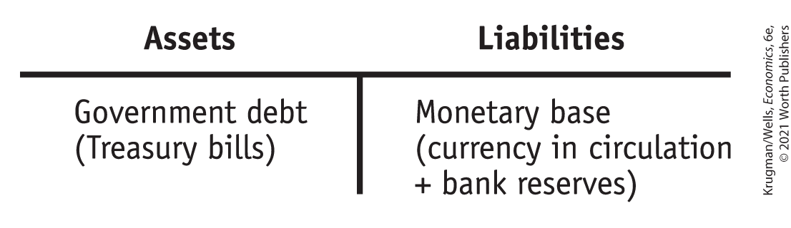
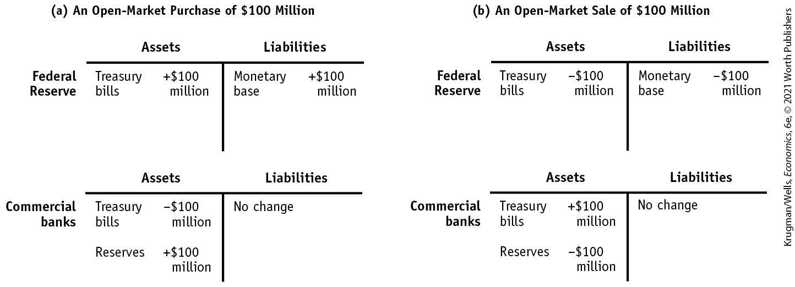
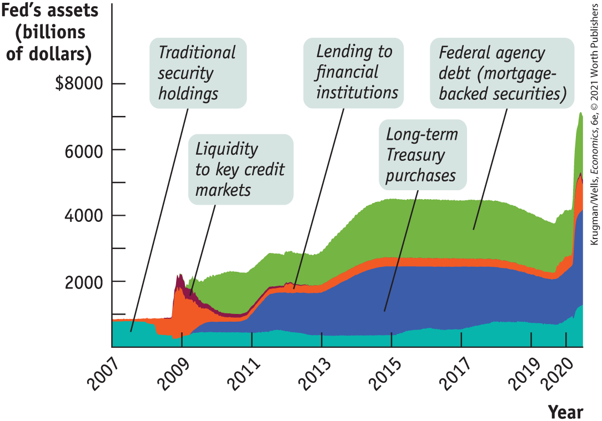
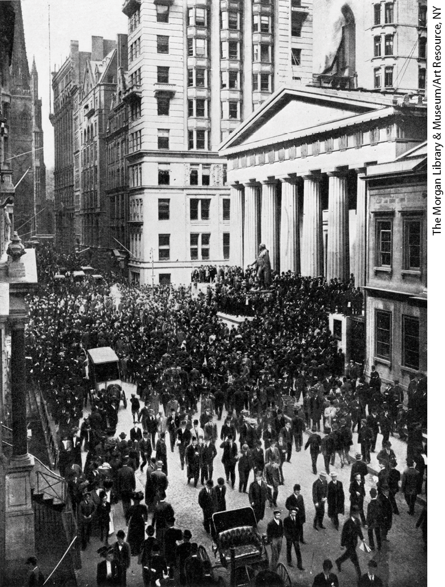

### Open-Market Operations

Like the banks it oversees, the Federal Reserve has assets and liabilities. The Fed’s assets normally consist of holdings of debt issued by the U.S. government, mainly short-term U.S. government bonds with a maturity of less than one year, known as U.S. Treasury bills. Remember, the Fed isn’t exactly part of the U.S. government, so U.S. Treasury bills held by the Fed are a liability of the government but an asset of the Fed. The Fed’s liabilities consist of currency in circulation and bank reserves. <a href="#kru_9781319245269_ch14_05.xhtml#pau_9781319320164_8y9ZHdmjqc" id="kru_9781319245269_ch14_05.xhtml#pau_9781319320164_E9C0RE1aFA" class="crossref">Figure 14-7</a> summarizes the normal assets and liabilities of the Fed in the form of a T-account.

<!--
<strong class="important">[Macro-</strong><xref rid="figure_BK_8"><strong class="important">Figure 14-7</strong></a><strong class="important">]</strong>
--> <!--
<strong class="important">[</strong><xref rid="figure_BK_8"><strong class="important">Figure 14-7</strong></a><strong class="important">]</strong>
-->

<figure id="pau_9781319320164_8y9ZHdmjqc" class="figure lm_img_lightbox num c3 main-flow">

<figcaption>
FIGURE 14-7 The Federal Reserve’s Assets and Liabilities

The Federal Reserve holds its assets mostly in short-term government bonds called U.S. Treasury bills. Its liabilities are the monetary base—currency in circulation plus bank reserves.
</figcaption>
</figure>

<aside class="hidden" id="pau_9781319320164_mK55ibdkCe" title="hidden">

The table has two columns, Assets and Liabilities. The assets column has the following data, Government debt (Treasury bills). The liabilities column has the following data, Monetary base (currency in circulation plus bank reserves).

</aside>

In an <a href="#kru_9781319245269_EM_glossary.xhtml#pau_9781319320164_M8RgANQFQM" id="kru_9781319245269_ch14_05.xhtml#pau_9781319320164_m2zcjX8swF" class="glossref" role="doc-glossref">open-market operation</a> the Federal Reserve buys or sells U.S. Treasury bills, normally through a transaction with *commercial banks* (banks that accept deposits and make loans), and *investment banks* (banks that create and trade assets but don’t accept deposits). The Fed never buys U.S. Treasury bills directly from the federal government. There’s a good reason for this: when a central bank buys government debt directly from the government, it is lending directly to the government — in effect, the central bank is printing money to finance the government’s budget deficit. This has historically been a formula for disastrously high levels of inflation.

<aside aria-label="title 5" class="glossary c3 main-flow v1" epub:type="glossary" id="pau_9781319320164_VS01SdgUPL">

**open-market operation**  
An **open-market operation** is a purchase or sale of government debt by the Fed.

</aside>

The two panels of <a href="#kru_9781319245269_ch14_05.xhtml#pau_9781319320164_MNxnS3R7VG" id="kru_9781319245269_ch14_05.xhtml#pau_9781319320164_eGPaGYCTUq" class="crossref">Figure 14-8</a> show the changes in the financial position of both the Fed and commercial banks that result from open-market operations. When the Fed buys U.S. Treasury bills from a commercial bank, it pays by crediting the bank’s reserve account by an amount equal to the value of the Treasury bills. This is illustrated in panel (a): the Fed buys \$100 million of U.S. Treasury bills from commercial banks, which increases the monetary base by \$100 million because it increases bank reserves by \$100 million. When the Fed sells U.S. Treasury bills to commercial banks, it debits the banks’ accounts, reducing their reserves. This is shown in panel (b), where the Fed sells \$100 million of U.S. Treasury bills. Here, bank reserves and the monetary base decrease.

<!--
<strong class="important">[Macro-</strong><xref rid="figure_BK_9"><strong class="important">Figure 14-8</strong></a><strong class="important">]</strong>
--> <!--
<strong class="important">[</strong><xref rid="figure_BK_9"><strong class="important">Figure 14-8</strong></a><strong class="important">]</strong>
-->

<figure id="pau_9781319320164_MNxnS3R7VG" class="figure lm_img_lightbox num c4 main-flow">

<figcaption>
FIGURE 14-8 Open-Market Operations by the Federal Reserve

In panel (a), the Federal Reserve increases the monetary base by purchasing U.S. Treasury bills from private commercial banks in an open-market operation. Here, a $100 million purchase of U.S. Treasury bills by the Federal Reserve is paid for by a $100 million addition to private bank reserves, generating a $100 million increase in the monetary base. This will ultimately lead to an increase in the money supply via the money multiplier as banks lend out some of these new reserves. In panel (b), the Federal Reserve reduces the monetary base by selling U.S. Treasury bills to private commercial banks in an open-market operation. Here, a $100 million sale of U.S. Treasury bills leads to a $100 million reduction in private bank reserves, resulting in a $100 million decrease in the monetary base. This will ultimately lead to a fall in the money supply via the money multiplier as banks reduce their loans in response to a fall in their reserves.
</figcaption>
</figure>

<aside class="hidden" id="pau_9781319320164_kr09i9jHbJ" title="hidden">

Panel (a) An Open-Market Purchase of 100 Million dollars: Panel a has two T-accounts, each has two columns, Assets and Liabilities. The first account is for Federal Reserve. The assets column has the following data, Treasury bills, positive 100 million dollars. The liabilities column has the following data, Monetary base, positive 100 million dollars. The second account is for Commercial banks. The assets column has the following data, Treasury bills, negative 100 million dollars; Reserves, positive 100 million dollars. The liabilities column has the following data, No change. Panel (b) An Open-Market Sale of 100 Million dollars: Panel b has two T-accounts, each has two columns, Assets and Liabilities. The first account is for Federal Reserve. The assets column has the following data, Treasury bills, negative 100 million dollars. The liabilities column has the following data, Monetary base, negative million dollars. The second account is for Commercial banks. The assets column has the following data, Treasury bills, positive 100 million dollars; Reserves, negative 100 million dollars. The liabilities column has the following data, No change.

</aside>

You might wonder where the Fed gets the funds to purchase U.S. Treasury bills from banks. The answer is that it simply creates them with a mouse click that credits the banks’ accounts with extra reserves. (The Fed prints money to pay for Treasury bills only when banks want the additional reserves in the form of currency.) Remember, the modern dollar is fiat money, which isn’t backed by anything. So the Fed can create additional monetary base at its own discretion.

The change in bank reserves caused by an open-market operation doesn’t directly affect the money supply. Instead, it starts the money multiplier in motion. After the \$100 million increase in reserves shown in panel (a) of <a href="#kru_9781319245269_ch14_05.xhtml#pau_9781319320164_MNxnS3R7VG" id="kru_9781319245269_ch14_05.xhtml#pau_9781319320164_cyFZvvZ3Jo" class="crossref">Figure 14-8</a>, commercial banks will (under normal circumstances) lend out all of their additional reserves, immediately increasing the money supply by \$100 million. Some of those loans would be deposited back into the banking system, increasing reserves again and permitting a further round of loans, and so on, leading to a rise in the money supply. An open-market sale has the reverse effect: bank reserves fall, requiring banks to reduce their loans, leading to a fall in the money supply.

<!--
<strong class="important">[Start EIA]</strong>
--> <!--
<strong class="important">Comp: insert globe icon.</strong>
-->
<aside class="case-study c3 main-flow v1" epub:type="case-study" id="pau_9781319320164_V4DA7mbxLA" title="For Inquiring Minds">

#### For inquiring minds

Who Gets the Interest on the Fed’s Assets?

The Fed owns a lot of assets — Treasury bills — that it bought from commercial banks in exchange for additions to the monetary base in the form of credits to banks’ reserve accounts. These assets pay interest. Yet the Fed’s liabilities consist mainly of the monetary base, liabilities on which the Fed normally *doesn’t* pay interest. So the Fed is, in effect, an institution that has the privilege of borrowing funds at a zero interest rate and lending them out at a positive interest rate. That sounds like a pretty profitable business. And the U.S. taxpayers get the profits.

The Fed keeps some of the interest it receives to finance its operations but turns most of it over to the U.S. Treasury. For example, in 2019 the total income of the Federal Reserve system was \$55.5 billion, almost all in the form of interest on its assets, of which \$54.9 billion was returned to the Treasury. This amount has steadily declined over the last five years; in 2014, the Fed returned over \$100 million to the Treasury.

Let’s consider our opening story again and the impact of those forged dollars printed in Peru. When, say, a fake \$20 bill enters circulation, it has the same economic effect as a real \$20 bill printed by the U.S. government. That is, as long as nobody catches the forgery, the fake bill serves, for all practical purposes, as part of the monetary base.

Meanwhile, the Fed decides on the size of the monetary base based on economic considerations — in particular, the Fed normally doesn’t let the monetary base get too large because that can cause higher inflation. So every fake \$20 bill that enters circulation means that the Fed prints one less real \$20 bill. When the Fed prints a \$20 bill legally, however, it gets Treasury bills in return — and the interest on those bills helps pay U.S. government expenses. So a counterfeit \$20 bill reduces the amount of Treasury bills the Fed can acquire and thereby reduces the interest payments going to the Fed and the U.S. Treasury. Taxpayers, then, bear the real cost of counterfeiting.

</aside>
<!--
<strong class="important">[End EIA]</strong>
-->

Although economists often say, loosely, that the Fed controls the money supply — checkable deposits plus currency in circulation, that statement is not completely accurate. *The Fed literally only controls the monetary base — bank reserves plus currency in circulation. But by increasing or reducing the monetary base, the Fed can exert a powerful influence on both the money supply and interest rates*. This influence is the basis of monetary policy, the subject of the next chapter.

### The European Central Bank

We’ve seen that the Fed is only one of a number of central banks around the world, and it’s much younger than Sweden’s Sveriges Riksbank and Britain’s Bank of England. In general, other central banks operate in much the same way as the Fed. That’s especially true of the only other central bank that rivals the Fed in terms of importance to the world economy: the European Central Bank.

The European Central Bank (ECB) was created in January 1999 when 11 European nations abandoned their national currencies, adopted the euro as their common currency, and placed their joint monetary policy in the ECB’s hands. More countries have joined since then, with Lithuania becoming the nineteenth European nation to adopt the euro in 2015. The ECB instantly became an extremely important institution: although no single European nation has an economy anywhere near as large as that of the United States, the combined economies of the eurozone, the group of countries that have adopted the euro as their currency, are roughly as big as the U.S. economy. As a result, the ECB and the Fed are the two giants of the monetary world.

Like the Fed, the ECB has a special status: it’s not a private institution, but it’s not exactly a government agency either. In fact, it can’t be a government agency because there is no pan-European government! Luckily for puzzled Americans, there are strong analogies between European central banking and the Federal Reserve system.

First of all, the ECB, which is located in Frankfurt, Germany, isn’t really the counterpart of the whole Federal Reserve system: it’s the equivalent of the Board of Governors in Washington, D.C. The European counterparts of the regional Federal Reserve Banks are Europe’s national central banks: the Bank of France, the Bank of Italy, and so on. Until 1999, each of these national banks was its country’s equivalent to the Fed. For example, the Bank of France controlled the French monetary base.

Today these national banks, like regional Feds, provide various financial services to local banks and businesses and conduct open-market operations, but the making of monetary policy has moved upstream to the ECB. Still, the various European national central banks aren’t small institutions: in total, they employ more than 50,000 people.

In the eurozone, each country chooses who runs its own national central bank. The ECB’s Executive Board is the counterpart of the Fed’s Board of Governors; its members are chosen by unanimous consent of the eurozone national governments. The counterpart of the Federal Open Market Committee is the ECB’s Governing Council. Just as the Fed’s Open Market Committee consists of the Board of Governors plus a rotating group of regional Fed presidents, the ECB’s Governing Council consists of the Executive Board plus the heads of the national central banks.

Like the Fed, the ECB is ultimately answerable to voters, and it tries to maintain its independence from short-term political pressures.

<!--
<strong class="important">[Start EIA]</strong>
-->

### ECONOMICS \>\> *in Action*

The Fed’s Balance Sheet, Normal and Abnormal

<a href="#kru_9781319245269_ch14_05.xhtml#pau_9781319320164_8y9ZHdmjqc" id="kru_9781319245269_ch14_05.xhtml#pau_9781319320164_jhSDL3bZLE" class="crossref">Figure 14-7</a> showed a simplified version of the Fed’s balance sheet. Here, liabilities consisted entirely of the monetary base and assets consisted entirely of Treasury bills. This is an oversimplification because the Fed’s operations are more complicated in reality and its balance sheet contains a number of additional things. But, in normal times, <a href="#kru_9781319245269_ch14_05.xhtml#pau_9781319320164_8y9ZHdmjqc" id="kru_9781319245269_ch14_05.xhtml#pau_9781319320164_b0gS3oeipJ" class="crossref">Figure 14-7</a> is a reasonable approximation: the monetary base typically accounts for 90% of the Fed’s liabilities, and 90% of its assets are in the form of claims on the U.S. Treasury (as in Treasury bills).

But in late 2007 it became painfully clear that we were no longer in normal times. The source of the turmoil was the bursting of a huge housing bubble, which led to massive losses for financial institutions that had made mortgage loans or held mortgage-related assets. This led to a widespread loss of confidence in the financial system.

Not only were conventional deposit-taking commercial banks in trouble, but so were nondepository financial institutions like investment banks and insurance companies, which make up the shadow banking sector. Because they carried a lot of debt, faced huge losses from the collapse of the housing bubble, and held illiquid assets, panic hit the shadow banking sector. Within hours the financial system was frozen as financial institutions experienced what were essentially bank runs.

For example, in 2008, many investors became worried about the health of Bear Stearns, a Wall Street investment bank that engaged in complex financial deals, buying and selling financial assets with borrowed funds. When confidence in Bear Stearns dried up, the firm was unable to raise the funds needed to deliver on its end of these deals and it quickly spiraled into collapse. This was followed by the collapse of another investment bank, Lehman Brothers, and set off widespread panic in financial markets.

The Fed sprang into action to contain what was becoming a meltdown across the entire financial sector. It greatly expanded its discount window — making huge loans to deposit-taking banks as well as nondepository financial institutions. This gave financial institutions the liquidity that the financial market had denied them. And as these firms took advantage of the ability to borrow cheaply from the Fed, they pledged their assets on hand as collateral — a motley collection of real estate loans, business loans, and so on.

<!--
<strong class="important">[AU/RH: Update</strong> <xref rid="figure_BK_10"><strong class="important">Figure 14-9</strong></a><strong class="important">.</strong> ]
-->

Examining <a href="#kru_9781319245269_ch14_05.xhtml#pau_9781319320164_u44MuQUEJT" id="kru_9781319245269_ch14_05.xhtml#pau_9781319320164_b9JAUfjXLY" class="crossref">Figure 14-9</a>, we see that starting in mid-2008, the Fed sharply reduced its holdings of traditional securities like Treasury bills, as its “lending to financial institutions” skyrocketed — referring to discount window lending, but also to loans the Fed made directly to firms like Bear Stearns. “Liquidity to key credit markets” covers purchases by the Fed of assets like corporate bonds, which was necessary to keep interest rates on loans to firms from soaring. Finally, “Federal agency debt” is the debt of Fannie Mae and Freddie Mac, the government-sponsored home mortgage agencies, which the Fed was also compelled to buy in order to prevent collapse in the mortgage market.

<!--
<strong class="important">[Macro-</strong><xref rid="figure_BK_10"><strong class="important">Figure 14-9</strong></a><strong class="important">]</strong>
--> <!--
<strong class="important">[</strong><xref rid="figure_BK_10"><strong class="important">Figure 14-9</strong></a><strong class="important">]</strong>
--> <!--
<strong class="important"> [AU: Update data for</strong> <xref rid="figure_BK_10"><strong class="important">Figure 14-9</strong></a><strong class="important"> in pages.]</strong>
-->

<figure id="pau_9781319320164_u44MuQUEJT" class="figure lm_img_lightbox num c3 main-flow">

<figcaption>
FIGURE 14-9 The Federal Reserve’s Assets, 2007–2020

<em>Data from:</em> Federal Reserve Bank of Cleveland.
</figcaption>
</figure>

<aside class="hidden" id="pau_9781319320164_sINtGbt8dV" title="hidden">

The vertical axis, labeled Fed’s assets (billions of dollars) ranges from 0 to 8,000 dollars in increments of 1,000 dollars. The horizontal axis, labeled Year ranges from 2007 to 2019 in increments of 2 years and has a marking at 2020. The graph plots 5 areas under 5 curves, one above the other. The first curve passes through the approximate points (2007, 800), (2009, 400), (2011, 500), (2017, 500), (2019, 700), and (2020, 600), and the area below this curve is shaded and labeled, “Traditional security holdings.” The second curve passes through the approximate points (2009, 400), (2011, 700), (2013, 1500), (2015, 2250), (2019, 2000), and (2020, 2100), and the area below this curve is shaded and labeled, “Long-term treasury purchases.” The third curve passes through the approximate points (2007, 800), (2009, 2,100), (2011, 750), (2015, 2800), (2017, 2600), and (2020, 2250), and the area below this curve is shaded and labeled, “Liquidity to key credit markets.” The fourth curve passes through the approximate points (2009, 2,100), (2011, 800), (2013, 1,750), (2015, 2800), (2017, 2600), and (2020, 2250), and the area below this curve is shaded and labeled, “Lending to financial institutions.” The fifth curve passes through the approximate points (2009, 1800), (2011, 2,100), (2013, 2800), (2015, 4200), (2017, 4,100), and (2020, 3500), and area below this curve is shaded and labeled, “Federal agency debt (mortgage-backed securities).” During mid-2020, the first, second, third, and fourth curves rise to 1000, 4000, 5000, 5000, and 7000, respectively.

</aside>

As the crisis subsided in late 2009, the Fed didn’t return to its traditional asset holdings. Instead, it shifted into long-term Treasury bills and increased its purchases of Federal agency debt. When the coronavirus pandemic struck in March 2020, threatening to cause another financial meltdown, the Fed moved even further away from tradition, buying trillions more in long-term assets and even pushing some corporate bonds.

<!--
<strong class="important">[End EIA]</strong>
-->

### \>\> *Quick Review*

- The Federal Reserve is America’s **central bank**, overseeing banking and making monetary policy.
- The Fed sets the required reserve ratio. Banks borrow and lend reserves in the **federal funds market.** The interest rate determined in this market is the **federal funds rate.** Banks can also borrow from the Fed at the **discount rate.**
- Although the Fed can change reserve requirements or the discount rate, in practice, monetary policy is conducted using **open-market operations.**
- An open-market purchase of Treasury bills increases the monetary base and therefore the money supply. An open-market sale reduces the monetary base and the money supply.

### \>\> *Check Your Understanding* 14-4

1.  Assume that any money lent by a bank is always deposited back in the banking system as a checkable deposit, that the reserve ratio is 10%, and that banks don’t hold excess reserves. Explain the effects of a \$100 million open-market purchase of U.S. Treasury bills by the Fed on the value of checkable bank deposits. What is the size of the money multiplier?

## The Evolution of the U.S. Banking System

Up to this point, we have been describing the U.S. banking system and how it works. To fully understand that system, however, it is helpful to understand how and why it was created — a story that is closely intertwined with the story of how and when things went wrong. The key elements of twenty-first century U.S. banking weren’t created out of thin air: efforts to change both the regulations that govern banking and the Federal Reserve system that resulted from the 2008 crisis have propelled financial reform to the forefront. This reform promises to continue reshaping the financial system well into future years.

### The Crisis in U.S. Banking in the Early Twentieth Century

The creation of the Federal Reserve system in 1913 marked the beginning of the modern era of U.S. banking. From 1864 until 1913, U.S. banking was dominated by a federally regulated system of national banks. They alone were allowed to issue currency, and the currency notes they issued were printed by the federal government with uniform size and design. How much currency a national bank could issue depended on its capital. Although this system was an improvement on the earlier period in which banks issued their own notes with no uniformity and virtually no regulation, the national banking regime still suffered numerous bank failures and major financial crises — at least one and often two per decade.

The main problem afflicting the system was that the money supply was not sufficiently responsive: it was difficult to shift currency around the country to respond quickly to local economic changes. (In particular, there was often a tug-of-war between New York City banks and rural banks for adequate amounts of currency.) Rumors that a bank had insufficient currency to satisfy demands for withdrawals would quickly lead to a bank run. A bank run would then spark a contagion, setting off runs at other nearby banks, sowing widespread panic and devastation in the local economy. In response, bankers in some locations pooled their resources to create local clearinghouses that would jointly guarantee a member’s liabilities in the event of a panic, and some state governments began offering deposit insurance on their banks’ deposits.

Despite these recurrent crises, calls for monetary reform went unheeded until the Panic of 1907, which led to a four-year national recession, drove home just how vulnerable the system had become.

<!--
<strong class="important">[Macro-14UN09]</strong>
--> <!--
<strong class="important">[MACRO 14UN09]</strong>
-->

<figure id="pau_9781319320164_hnmGZNgezL" class="figure lm_img_lightbox unnum c2 right">

<figcaption>
In both the Panic of 1907 and the financial crisis of 2008, large losses from risky speculation destabilized the banking system.
</figcaption>
</figure>

This crisis originated in institutions in New York known as *trusts,* bank-like institutions that accepted deposits but that were originally intended to manage only inheritances and estates for wealthy clients. Because these trusts were supposed to engage only in low-risk activities, they were less regulated, had lower reserve requirements, and had lower cash reserves than national banks, allowing them to pay their depositors higher returns. As a result, trusts grew rapidly: by 1907, the total assets of trusts in New York City were as large as those of national banks. Meanwhile, the trusts declined to join the New York Clearinghouse, a consortium of New York City national banks that guaranteed one anothers’ soundness.

The Panic of 1907 began with the failure of the Knickerbocker Trust, a large New York City trust that failed when it suffered massive losses in unsuccessful stock market speculation. Quickly, other New York trusts came under pressure, and frightened depositors began queuing in long lines to withdraw their funds. The New York Clearinghouse declined to step in and lend to the trusts, and even healthy trusts came under serious assault. Within two days, a dozen major trusts had gone under. Credit markets froze, and the stock market fell dramatically as stock traders were unable to get credit to finance their trades and business confidence evaporated.

Fortunately, New York City’s wealthiest man, the banker J. P. Morgan, quickly stepped in to stop the panic. Understanding that the crisis was spreading and would soon engulf healthy institutions, trusts and banks alike, he worked with other bankers, wealthy men such as John D. Rockefeller, and the U.S. Secretary of the Treasury to shore up the reserves of banks and trusts so they could withstand the onslaught of withdrawals. Once people were assured that they could withdraw their money, the panic ceased. Although the panic itself lasted little more than a week, it and the stock market collapse decimated the economy. A four-year recession ensued, with production falling 11% and unemployment rising from 3% to 8%.

### Responding to Banking Crises: The Creation of the Federal Reserve

Concerns over the frequency of banking crises and the unprecedented role of J. P. Morgan in saving the financial system prompted the federal government to initiate banking reform. In 1913 the national banking system was eliminated and the Federal Reserve system was created as a way to compel all deposit-taking institutions to hold adequate reserves and to open their accounts to inspection by regulators. The Panic of 1907 convinced many that the time for centralized control of bank reserves had come. In addition, the Federal Reserve was given the sole right to issue currency in order to make the money supply sufficiently responsive to satisfy economic conditions around the country.

Although the new regime standardized and centralized the holding of bank reserves, it did not eliminate the potential for bank runs because banks’ reserves were still less than the total value of their deposits. The potential for more bank runs became a reality during the Great Depression. Plunging commodity prices hit U.S. farmers particularly hard, precipitating a series of bank runs in 1930, 1931, and 1933, each of which started at midwestern banks and then spread throughout the country.

After the failure of a particularly large bank in 1930, federal officials realized that the economy-wide effects compelled them to take a less hands-off approach and to intervene more vigorously. In 1932, the Reconstruction Finance Corporation (RFC) was established and given the authority to make loans to banks in order to stabilize the banking sector. Also, the Glass-Steagall Act of 1933, which created federal deposit insurance and increased the ability of banks to borrow from the Federal Reserve system, was passed. However, the beast had not yet been tamed. Banks became fearful of borrowing from the RFC because doing so signaled weakness to the public.

As noted earlier, the new president, Franklin D. Roosevelt, was inaugurated during the catastrophic bank run of 1933. He immediately declared a “bank holiday,” closing all banks until regulators could get a handle on the problem.

In March 1933, emergency measures were adopted that gave the RFC extraordinary powers to stabilize and restructure the banking industry by providing capital to banks through either loans or outright purchases of bank shares. With the new rules, regulators closed nonviable banks and recapitalized viable ones by allowing the RFC to buy preferred shares in banks (shares that gave the U.S. government more rights than regular shareholders) and by greatly expanding banks’ ability to borrow from the Federal Reserve. By 1933, the RFC had invested nearly \$19 billion (2020 dollars) in bank capital — one-third of the total capital of all banks in the United States at that time — and purchased shares in almost one-half of all banks. The RFC loaned more than \$37 billion (2020 dollars) to banks during this period.

Economic historians uniformly agree that the banking crises of the early 1930s greatly exacerbated the severity of the Great Depression, rendering monetary policy ineffective as the banking sector broke down and currency, withdrawn from banks and stashed under beds, reduced the money supply.

Although the powerful actions of the RFC stabilized the banking industry, new legislation was needed to prevent future banking crises. The Glass-Steagall Act of 1933 separated banks into two categories, <a href="#kru_9781319245269_EM_glossary.xhtml#pau_9781319320164_NdmK2b1qRp" id="kru_9781319245269_ch14_06.xhtml#pau_9781319320164_GCoLvEfSPb" class="glossref" role="doc-glossref">commercial banks</a>, depository banks that are covered by deposit insurance, and nondepository <a href="#kru_9781319245269_EM_glossary.xhtml#pau_9781319320164_uYM9ycCbP2" id="kru_9781319245269_ch14_06.xhtml#pau_9781319320164_H2AYkzLhNz" class="glossref" role="doc-glossref">investment banks</a>, which engaged in creating and trading financial assets such as stocks and corporate bonds and were not covered by deposit insurance.

<aside aria-label="title 1" class="glossary c3 main-flow v1" epub:type="glossary" id="pau_9781319320164_BGrmN6ijD6">

**commercial bank**  
A **commercial bank** accepts deposits and is covered by deposit insurance.

</aside>
<aside aria-label="title 2" class="glossary c3 main-flow v1" epub:type="glossary" id="pau_9781319320164_vzfClaBQA2">

**investment bank**  
An **investment bank** trades in financial assets and does not accept deposits, so it is not covered by deposit insurance.

</aside>

Regulation Q prevented commercial banks from paying interest on checking accounts in the belief that this would promote unhealthy competition between banks. In addition, investment banks were much more lightly regulated than commercial banks. The most important measure for the prevention of bank runs, however, was the adoption of federal deposit insurance (with an original limit of \$2,500 per deposit).

These measures were clearly successful, and the United States enjoyed a long period of financial and banking stability. As memories of the bad old days dimmed, Depression-era bank regulations were lifted. In 1980, Regulation Q was eliminated; by 1999, the Glass-Steagall Act had been so weakened that offering services like trading financial assets was no longer off-limits to commercial banks.

### The Savings and Loan Crisis of the 1980s

Along with banks, the banking industry also included <a href="#kru_9781319245269_EM_glossary.xhtml#pau_9781319320164_TAR2TKqlwR" id="kru_9781319245269_ch14_06.xhtml#pau_9781319320164_LOZfzcl8Dd" class="glossref" role="doc-glossref">savings and loans</a> (also called S&Ls or <a href="#kru_9781319245269_EM_glossary.xhtml#pau_9781319320164_TAR2TKqlwR" id="kru_9781319245269_ch14_06.xhtml#pau_9781319320164_dcGqIBiR40" class="glossref" role="doc-glossref">thrifts</a>), institutions designed to accept savings and turn them into long-term mortgages for home-buyers. S&Ls were covered by federal deposit insurance and were tightly regulated for safety. However, trouble hit in the 1970s, as high inflation led savers to withdraw their funds from low-interest-paying S&L accounts and put them into higher-interest-paying money market accounts. In addition, the high inflation rate severely eroded the value of the S&Ls’ assets, the long-term mortgages they held on their books.

<aside aria-label="title 3" class="glossary c3 main-flow v1" epub:type="glossary" id="pau_9781319320164_vbAFOSaWa9">

**savings and loan (thrift)**  
A **savings and loan (thrift)** is another type of deposit-taking bank, usually specialized in issuing home loans.

</aside>

To improve S&Ls’ competitive position vis-à-vis banks, Congress eased regulations to allow S&Ls to undertake much more risky investments in addition to long-term home mortgages. However, the new freedom did not bring with it increased oversight, leaving S&Ls with less oversight than banks. Not surprisingly, during the real estate boom of the 1970s and 1980s, S&Ls engaged in overly risky real estate lending. Also, corruption occurred as some S&L executives used their institutions as private piggy banks.

During the late 1970s and early 1980s, political interference from Congress kept insolvent S&Ls open when a bank in a comparable situation would have been quickly shut down by regulators. By the early 1980s, numerous S&Ls had failed. Because accounts were covered by federal deposit insurance, the liabilities of a failed S&L became liabilities of the federal government, and depositors had to be paid from taxpayer funds. From 1986 through 1995, the federal government closed over 1,000 failed S&Ls, costing U.S. taxpayers over \$124 billion.

In a classic case of shutting the barn door after the horse has escaped, in 1989 Congress put in place comprehensive oversight of S&L activities. It also empowered Fannie Mae and Freddie Mac to take over much of the home mortgage lending previously done by S&Ls. *Fannie Mae* and *Freddie Mac* are quasi-governmental agencies created during the Great Depression to make homeownership more affordable for low- and moderate-income households. The S&L crisis led to a steep slowdown in the finance and real estate industries, leading to the recession of the early 1990s.

### Back to the Future: The Financial Crisis of 2008 and Its Aftermath

The bank regulations introduced in the 1930s led to a long era of relative financial stability. But by the early twenty-first century a new problem had emerged: these regulations didn’t cover <a href="#kru_9781319245269_EM_glossary.xhtml#pau_9781319320164_heUzPgwAX7" id="kru_9781319245269_ch14_06.xhtml#pau_9781319320164_UfAuBky95T" class="glossref" role="doc-glossref">shadow banking</a> — activities, as we explained earlier, that don’t look like traditional banking but serve similar purposes while posing significant risks. In 2008 shadow banking was at the center of a crisis that in important ways resembled the crisis of the 1930s.

<aside aria-label="title 4" class="glossary c3 main-flow v1" epub:type="glossary" id="pau_9781319320164_1oMTV1xk9w">

**shadow banking**  
Bank-like activities undertaken by nondepository financial firms such as investment banks and hedge funds, but without regulatory oversight or protection, are known as **shadow banking.**

</aside>

### Shadow Banking and Its Vulnerabilities

The details of shadow banking can be complex. However, much of the shadow banking system involves financial intermediaries — nondepository financial firms like investment banks, insurance companies, hedge funds, and money market funds. These firms borrow short-term — often taking out loans that must be repaid the next day — and use the borrowed funds to buy relatively illiquid assets to put up as collateral. This looks like banking to those lending funds to intermediaries, because their loans are a lot like bank deposits. For example, a corporation with extra cash on hand might lend that extra cash on an overnight basis to a Wall Street investment bank. That way it can get a higher interest rate than if it parked the funds in ordinary bank deposits, and under normal circumstances it can still count on having access to the money with only one day’s notice.

Meanwhile, the financial intermediary doesn’t have to keep enough cash on hand to repay all of its debts every day. Many of the lenders will simply roll over their loans each day, relending the funds. And when a lender does demand repayment, the borrower will simply raise the cash from another lender. So the shadow banking firm’s relationship to its lenders is a lot like a conventional bank’s relationship with its depositors, except for two significant differences: there is no deposit insurance and there is much less regulation of the intermediary’s actions.

It is a system that can work seamlessly in normal times, but it can also go terribly wrong as it did when the housing bubble it helped to create burst in 2007, leading to the Great Recession.
