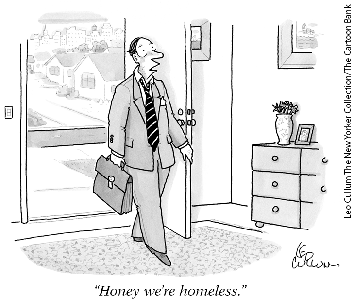
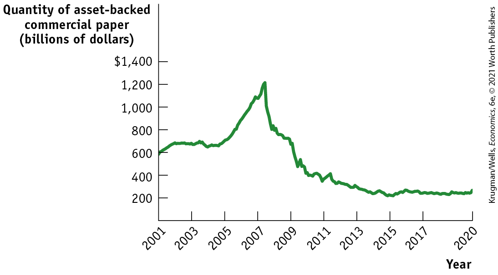
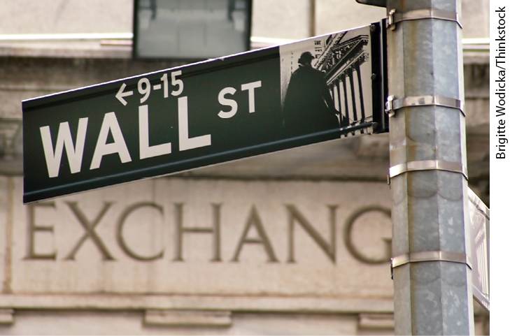
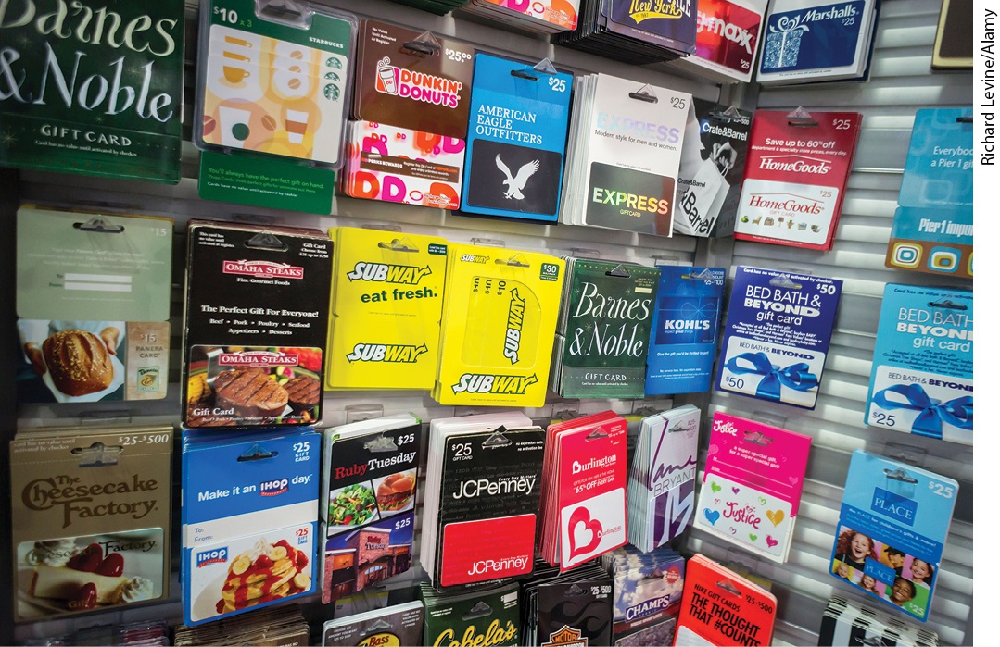

#### Subprime Lending and the Housing Bubble

The story of the 2008 crisis begins with low interest rates: by 2003, U.S. interest rates were at historically low levels, partly because of Federal Reserve policy and partly because of large inflows of capital from other countries, especially China. These low interest rates helped cause a boom in housing, which in turn pulled the U.S. economy out of recession. As housing boomed, however, financial institutions took on greater risks that were not well understood.

Traditionally, people were only able to borrow money to buy homes if they could show that they had sufficient income to meet the mortgage payments. Home loans to people who don’t meet the usual criteria for borrowing, called <a href="#kru_9781319245269_EM_glossary.xhtml#pau_9781319320164_PyTgX34ldL" id="kru_9781319245269_ch14_06.xhtml#pau_9781319320164_JRYjuiJWFk" class="glossref" role="doc-glossref">subprime lending</a>, were only a minor part of overall lending. But in the booming housing market of 2003 to 2006, subprime lending started to seem like a safe bet. According to conventional thinking, since housing prices kept rising, borrowers who were unable to make their mortgage payments could always pay off their mortgages by selling their homes. As a result, subprime lending exploded.

<aside aria-label="title 5" class="glossary c3 main-flow v1" epub:type="glossary" id="pau_9781319320164_XnwMmtvAPU">

**subprime lending**  
**Subprime lending** is lending to home-buyers who don’t meet the usual criteria for qualifying for a loan.

</aside>

<figure id="pau_9781319320164_u6FjN4yQfH" class="figure lm_img_lightbox unnum c2 right">

</figure>

For the most part, these subprime loans were not made by traditional banks that lend out depositors’ money. Instead, most of the loans were made by *loan originators,* companies specializing in making subprime loans and quickly selling them off to other investors in the shadow banking market. Large-scale sales of subprime mortgages were made possible by <a href="#kru_9781319245269_EM_glossary.xhtml#pau_9781319320164_ICXre5MB4U" id="kru_9781319245269_ch14_06.xhtml#pau_9781319320164_uHDfC1NxQ1" class="glossref" role="doc-glossref">securitization</a>**:** the assembly of pools of loans and sale of shares of the income from these pools. Again, according to conventional thinking at the time, these shares were considered relatively safe investments, based on the belief that large numbers of home-buyers were unlikely to default on their payments at the same time.

<aside aria-label="title 6" class="glossary c3 main-flow v1" epub:type="glossary" id="pau_9781319320164_TBKkrDO7SS">

**securitization**  
In **securitization**, a pool of loans is assembled and shares of that pool are sold to investors.

</aside>
<!--
<strong class="important">[Macro-14UN10]</strong>
-->

But that’s exactly what happened. The housing boom turned out to be a bubble, and when home prices started falling in late 2006, significant numbers of subprime borrowers were unable either to meet their mortgage payments or sell their houses for enough to pay off their mortgages. As a result, they defaulted and investors in securities backed by subprime mortgages suffered heavy losses.

These securities were largely held by shadow banking institutions, but also by some traditional, depository banks. Like the trusts that played a key role in the Panic of 1907, these largely unregulated shadow banks offered higher returns to investors but left them extremely vulnerable in a crisis. Without the safety net of deposit insurance, mortgage-related losses led to a collapse of trust in the financial system.

<a href="#kru_9781319245269_ch14_06.xhtml#pau_9781319320164_gX6lSy4ByW" id="kru_9781319245269_ch14_06.xhtml#pau_9781319320164_sP4eWkN0fu" class="crossref">Figure 14-10</a> shows one measure of the severity of the loss of trust: the quantity of *asset-backed commercial paper,* an important asset class in shadow banking. In the mid-2000s this paper — backed by short-term loans taken out using assets often created by securitization of mortgages and other debts — grew rapidly in volume. After the housing bust, it went into rapid decline, a sign of extreme financial stress. Although this was not a 1930s-style crash in the money supply in an official sense, it functioned in much the same way because commercial paper was an essential source of liquidity in the financial system.

<!--
<strong class="important">[Macro-</strong><xref rid="figure_BK_11"><strong class="important">Figure 14-10</strong></a><strong class="important">]</strong>
--> <!--
<strong class="important">[</strong><xref rid="figure_BK_11"><strong class="important">Figure 14-10</strong></a><strong class="important">]</strong>
-->

<figure id="pau_9781319320164_gX6lSy4ByW" class="figure lm_img_lightbox num c3 main-flow">

<figcaption>
FIGURE 14-10 Measuring Lost Trust

In the mid-2000s the use of asset-backed commercial paper, short-term loans created by securitization of mortgages and other debts, and an important component of shadow banking, grew rapidly in volume. But it went into rapid decline after the housing boom went bust, a sign of extreme financial stress as liquidity in the financial system dried up.

<em>Data from:</em> Federal Reserve Bank of St. Louis.
</figcaption>
</figure>

<aside class="hidden" id="pau_9781319320164_z8Kogdvw3T" title="hidden">

The vertical axis, labeled Quantity of asset-backed commercial paper (billions of dollars) ranges from 200 to 1,400 dollars in increments of 200 dollars. The horizontal axis, labeled Year ranges from 2001 to 2017 in increments of 2 years with an additional marking at 2020. A curve passes through the approximate points (2001, 600), (2003, 700), (2005, 700), (2007, 1,000), (2008, 1,200), (2009, 600), (2011, 400), (2015, 200), and (2020, 300).

</aside>

#### Crisis and Response

Starting in 2007, the bursting of the housing bubble, followed by large losses on the part of financial firms and the collapse in trust in the financial system, led to major disruptions for the economy as a whole. All firms — financial and nonfinancial — found it difficult to borrow, even for short-term operations. Individuals found home loans unavailable and credit card limits reduced. Prices of many assets tumbled, severely reducing household wealth.

Overall, the negative economic effect of the financial crisis bore a strong and extremely troubling resemblance to the banking crisis of the early 1930s, which sparked the Great Depression. Policy makers, noticing the resemblance, tried to prevent a repeat performance. Beginning in August 2007, the Federal Reserve provided liquidity to stop a cascade of defaults, by lending funds to a wide range of institutions and buying commercial paper. The Fed and the Treasury Department also stepped in to rescue individual firms that were deemed too crucial to be allowed to fail, such as the investment bank Bear Stearns and the insurance company AIG.

In September 2008, however, under political pressure to punish “irresponsible bankers,” policy makers allowed one major investment bank, Lehman Brothers, to fail. They quickly regretted the decision. Within days of Lehman’s failure, widespread panic gripped the financial markets. In response, the U.S. government intervened further to support the financial system. The U.S. Treasury injected capital directly into banks — supplying them with cash in return for shares. The effect was to partly *nationalize* the financial system (take public ownership). The Federal Reserve engaged in novel forms of open-market operations, such as providing massive liquidity through discount window lending and buying a large quantity of other assets — mainly long-term government debt and the debt of Fannie Mae and Freddie Mac (as shown in <a href="#kru_9781319245269_ch14_05.xhtml#pau_9781319320164_u44MuQUEJT" id="kru_9781319245269_ch14_06.xhtml#pau_9781319320164_LR2YKkjajd" class="crossref">Figure 14-9</a> by the huge surge in Fed assets after September 2008).

#### The Aftermath of the Crisis

After many terrifying months, in the fall of 2010 the financial system stabilized, and major institutions had repaid much of the money the federal government had injected during the crisis. However, the recovery of the banks was not matched by a successful turnaround for the overall economy. Although the recession that began in December 2007 officially ended in June 2009, with unemployment reaching a high of 10% in October 2009, unemployment fell very slowly afterward. It took nearly nine years, until May 2016, for the unemployment rate to fall back to where it had been before the start of the Great Recession.

Like earlier crises, the crisis of 2008 led to changes in banking regulation, most notably the Dodd-Frank financial regulatory reform act discussed in the following Economics in Action.

<!--
<strong class="important">[Start EIA]</strong>
-->

### ECONOMICS \>\> *in Action*

Financial Regulation After the 2008 Crisis

The Wall Street Reform and Consumer Protection Act of 2010 — generally known as Dodd-Frank, after its sponsors in the Senate and House, respectively — was the biggest financial reform enacted since the 1930s. How did it change financial regulation?

For traditional depository banks, the main change was the creation of a new agency, the Consumer Financial Protection Bureau. Its mission was to protect borrowers from being exploited through seemingly attractive financial deals they didn’t understand.

The main thrust of Dodd-Frank, however, was the regulation of shadow banking institutions. Under the law, a financial institution could be designated as “systematically important” — that is, like Lehman Brothers, it was important enough to the financial system that it could trigger a banking crisis, even though it wasn’t a depository bank.

<!--
<strong class="important">[Macro-14UN11]</strong>
--> <!--
<strong class="important">[MACRO 14UN11]</strong>
-->

<figure id="pau_9781319320164_qf4KdURpio" class="figure lm_img_lightbox unnum c2 right">

<figcaption>
The Dodd-Frank Act extended old-fashioned bank regulation to today’s more complex financial system. More recently, the Trump administration has rolled back some of its provisions.
</figcaption>
</figure>

Under Dodd-Frank, these systemically important institutions were subjected to depository bank–style regulation, such as relatively high capital requirements and limits on risk taking. In addition, the federal government asserted *resolution authority,* the right to seize troubled nondepository financial institutions in much the same way that it seized troubled banks.

Dodd-Frank also mandated that most *derivatives,* complex financial instruments that also played a significant role in the 2008 crisis, could be bought and sold on public exchanges in order to make them more transparent and reduce risk.

Overall, the purpose of Dodd-Frank was to extend the spirit of old-fashioned bank regulation to the more complex financial system of the twenty-first century. How well is it working? Relatively well, according to the evidence so far:

- The new rules on systemically important institutions seem to have reduced the incentive to create shadow banks that bypass regulations on conventional banks. An example is the case of GE Capital, an unregulated bank once owned by General Electric. Although it was the main source of profits for its parent company, General Electric sold it off in the wake of Dodd-Frank.
- Resolution authority seems to have led to a reduction in the so-called *too big to fail subsidy:* the lower cost of borrowing enjoyed by big financial institutions compared to smaller ones because it was assumed that only the big ones would be bailed out in a crisis.
- The Consumer Financial Protection Bureau was widely considered to have been quite effective at punishing and deterring financial fraud. Its power and effectiveness were, however, greatly curtailed after 2017, when the newly elected Trump administration moved to reduce the agency’s independence and reduce its role.

That said, we won’t know how effective Dodd-Frank has been until the next period of financial turbulence.

<!--
<strong class="important">[End EIA]</strong>
-->

### \>\> *Quick Review*

- The Federal Reserve system was created in response to the Panic of 1907.
- Widespread bank runs in the early 1930s resulted in greater bank regulation and the creation of federal deposit insurance. Banks were separated into two categories: **commercial** (covered by deposit insurance) and **investment** (not covered).
- In the **savings and loan (thrift)** crisis of the 1970s and 1980s, insufficiently regulated S&Ls incurred huge losses from risky speculation in housing.
- Unregulated **shadow banking** activities created a vulnerability in the financial system. In the mid-2000s, **securitization** spread loans from **subprime lending** throughout the shadow banking sector, and among some traditional banks, leading to a financial crisis when the housing bubble burst. The Federal Reserve and U.S. Treasury undertook extraordinary steps to stabilize financial markets.
- In 2010, Congress passed the Dodd-Frank Act. The law extended both financial regulations — to avoid another financial crisis — and protections against consumer financial fraud.

### \>\> *Check Your Understanding* 14-5

1.  What are the similarities between the Panic of 1907, the S&L crisis, and the crisis of 2008?
2.  Why did the creation of the Federal Reserve fail to prevent the bank runs of the Great Depression? What measures stopped the bank runs?
3.  Why were extraordinary measures needed to deal with the financial crisis of 2008?

<!--
<strong class="important">Comp: the chapter&#x2019;s business case follows. Please start it on a new page and run it for 2 columns on a single page.</strong>
--> <!--
<strong class="important">[Start Business Case]</strong>
-->

## Business case

The Perfect Gift: Cash or a Gift Card?

<!--
<strong class="important">[Macro-14UN12]</strong>
--> <!--
<strong class="important">[MACRO 14UN12]</strong>
--> <!--
[BC photo- no caption]
-->

<figure id="pau_9781319320164_0jTSfKNyjZ" class="figure lm_img_lightbox unnum c2 right">

</figure>

It’s always nice when someone gives you a gift. Over the past few years, more people have been showing their appreciation by giving gift cards, often prepaid plastic cards issued by a retailer that can be redeemed for merchandise in the store or online. The best-selling single item for more than 80% of the top 100 U.S. retailers, according to the website GiftCardUSA, is their gift cards.

What could be more simple and useful than allowing the recipient to choose what they want? And isn’t a gift card more personal than cash or a check?

Yet a number of firms are now making a profit from the fact that gift card recipients are often willing to sell their cards at a discount — sometimes at a fairly sizable discount — to turn them into cold, impersonal dollars and cents. Meanwhile, other people are willing to buy those cards, and turn them into goods they want, at a discount.

CardCash is one such site. At the time of writing, it offers to pay cash to a seller of a Walmart gift card equivalent to 88% of the card’s face value. For example, the seller of a Walmart card with a value of \$100 would receive \$88. <a href="http://Cardcash.com" id="kru_9781319245269_ch14_07.xhtml#pau_9781319320164_a8H4m3aTgT" class="external">Cardcash.com</a> profits by reselling the card at a premium over what it paid. So it would sell a Walmart gift card for more than 88% of its face value. The amount of cash offered to sellers of cards will vary by retailer. CardCash offers cash equal to only 75% of a Gap card’s face value, for example.

Many consumers will sell at a sizable discount to turn gift cards into cash. But retailers promote the use of gift cards over cash because much of the value of gift cards issued never gets used, a phenomenon known as *breakage.*

How does breakage occur? People lose cards. Or they spend only \$47 of a \$50 gift card, and never return to spend that last \$3. Also, retailers have imposed fees on the use of cards or made them subject to expiration dates, which customers forget about. Sometimes they even forget that they have a gift card. And if a retailer goes out of business, the value of outstanding gift cards disappears with it.

In addition to breakage, retailers benefit when customers intent on using up the value of their gift card find that it is too difficult to spend exactly the amount of the card. Instead, they end up spending even more than the card’s face value, sometimes even more than they would have without the gift card.

<!--
<strong class="important">AU: Review Ryan&#x2019;s changes in this paragraph to incorporate gift card buying during the pandemic.</strong>
-->

Gift cards are so beneficial to retailers that instead of rewarding customer loyalty with rebate checks (once a common practice) many have switched loyalty programs to dispensing gift cards. Today retailers are hoping loyal customers reward them with a gift of their own. During the coronavirus shutdown, shuttered restaurants needed cash, quickly, so they turned to selling gift cards. Restaurants were even adding a 20% bonus if you purchased a \$50 or \$100 gift card. Restaurants were hoping that receiving the cash upfront would help cover their expenses and the cards they dispensed would help retain customer loyalty.

<aside class="assessments c3 main-flow v1" epub:type="assessments" id="pau_9781319320164_Q5edQoeu1k">

### Questions for Thought

1.  Why are gift card owners willing to sell their cards for a cash amount less than their face value?
2.  Why do gift cards for Walmart sell for a smaller discount than those for the Gap?
3.  Use your answer from Question 2 to explain why cash never “sells” at a discount.
4.  Explain why retailers prefer to reward loyal customers with gift cards instead of rebate checks.
5.  There are now laws restricting retailers’ ability to impose fees and expiration dates on their gift cards and mandate greater disclosure of their terms. Why do you think Congress enacted this legislation?

</aside>
<!--
<strong class="important">[End Business Case]</strong>
-->

### SUMMARY

1.  **Money** is any asset that can easily be used to purchase goods and services. **Currency in circulation** and **checkable bank deposits** are both considered part of the **money supply.** Money plays three roles: it is a **medium of exchange** used for transactions, a **store of value** that holds purchasing power over time, and a **unit of account** in which prices are stated.
2.  Over time, **commodity money**, which consists of goods possessing value aside from their role as money, such as gold and silver coins, was replaced by **commodity-backed money**, such as paper currency backed by gold. Today the dollar is pure **fiat money**, whose value derives solely from its official role.
3.  The Federal Reserve calculates two measures of the money supply. M1 is the narrowest **monetary aggregate**, containing only currency in circulation, and checkable bank deposits. M2 includes a wider range of assets called **near-moneys**, mainly other forms of bank deposits, that can easily be converted into checkable bank deposits.
4.  Banks allow depositors immediate access to their funds, but they also lend out most of the funds deposited in their care. To meet demands for cash, they maintain **bank reserves** composed of both currency held in vaults and deposits at the Federal Reserve. The **reserve ratio** is the ratio of bank reserves to bank deposits. A **T-account** summarizes a bank’s financial position, with loans and reserves counted as assets and deposits counted as liabilities.
5.  Banks have sometimes been subject to **bank runs**, most notably in the early 1930s. To avert this danger, depositors are now protected by **deposit insurance**, bank owners face capital requirements that reduce the incentive to make overly risky loans with depositors’ funds, and banks must satisfy **reserve requirements.**
6.  When currency is deposited in a bank, it starts a multiplier process in which banks lend out **excess reserves**, leading to an increase in the money supply — so banks create money. If the entire money supply consisted of checkable bank deposits, the money supply would be equal to the value of reserves divided by the reserve ratio. In reality, much of the **monetary base** consists of currency in circulation, and the **money multiplier** is the ratio of the money supply to the monetary base.
7.  The monetary base is controlled by the Federal Reserve, the **central bank** of the United States. The Fed regulates banks and sets reserve requirements. To meet those requirements, banks borrow and lend reserves in the **federal funds market** at the **federal funds rate.** Through the **discount window** facility, banks can borrow from the Fed at the **discount rate.**
8.  **Open-market operations** by the Fed are the principal tool of monetary policy: the Fed can increase or reduce the monetary base by buying U.S. Treasury bills from banks or selling U.S. Treasury bills to banks.
9.  In response to the Panic of 1907, the Fed was created to centralize the holding of reserves, inspect banks’ books, and make the money supply sufficiently responsive to varying economic conditions.
10. The Great Depression sparked widespread bank runs in the early 1930s, which greatly worsened and lengthened it. Federal deposit insurance was created, and the government recapitalized banks by lending to them and by buying shares of banks. By 1933, banks had been separated into two categories: **commercial banks** (which accept deposits and are covered by deposit insurance) and **investment banks** (which don’t accept deposits and are not covered). Public acceptance of deposit insurance finally stopped the bank runs of the Great Depression.
11. The **savings and loan (thrift)** crisis of the 1980s arose because insufficiently regulated S&Ls engaged in overly risky speculation and incurred huge losses. Depositors in failed S&Ls were compensated with taxpayer funds because they were covered by deposit insurance. The crisis caused steep losses in the financial and real estate sectors, resulting in a recession in the early 1990s.
12. The emergence of **shadow banking**, bank-like activities undertaken by nondepository financial firms not subject to regulatory oversight or protection, made the financial system once again vulnerable to bank-run type panics. In the mid-2000s, **securitization** of mortgage loans from **subprime lending** spread through the shadow banking sector and among some traditional depository banks. When the housing bubble burst in 2007, losses by financial institutions led to panic and a widespread collapse of the financial system in 2008. To prevent another Great Depression, the Federal Reserve and U.S. Treasury undertook extraordinary actions to provide support to the financial system, such as injecting capital into banks through the purchase of bank shares, providing massive liquidity through discount window lending, and buying large amounts of long-term government debt and government-sponsored agency debt. By 2010, the financial system had stabilized but the economy did not fully recover until 2016.
13. In 2010, Congress passed a financial regulation reform act, known as Dodd-Frank, in order to prevent another crisis. Its main purpose was to extend old-fashioned bank regulation to today’s more complex financial system. It also extended protection for consumers against financial fraud.

### KEY TERMS

- <a href="#kru_9781319245269_ch14_02.xhtml#pau_9781319320164_AxibMjOgIq" id="kru_9781319245269_ch14_08.xhtml#pau_9781319320164_mrlxeSj44B" class="crossref">Money</a>
- <a href="#kru_9781319245269_ch14_02.xhtml#pau_9781319320164_fypiMglgOH" id="kru_9781319245269_ch14_08.xhtml#pau_9781319320164_gdMZFqGobR" class="crossref">Currency in circulation</a>
- <a href="#kru_9781319245269_ch14_02.xhtml#pau_9781319320164_zZ7PYfQl31" id="kru_9781319245269_ch14_08.xhtml#pau_9781319320164_o3suO6yGop" class="crossref">Checkable bank deposits</a>
- <a href="#kru_9781319245269_ch14_02.xhtml#pau_9781319320164_I8iSLzIHal" id="kru_9781319245269_ch14_08.xhtml#pau_9781319320164_LusM2Jkm2g" class="crossref">Money supply</a>
- <a href="#kru_9781319245269_ch14_02.xhtml#pau_9781319320164_ZAz7OvLIJD" id="kru_9781319245269_ch14_08.xhtml#pau_9781319320164_rAAlXIJHf7" class="crossref">Medium of exchange</a>
- <a href="#kru_9781319245269_ch14_02.xhtml#pau_9781319320164_YSpuKKWXAc" id="kru_9781319245269_ch14_08.xhtml#pau_9781319320164_mMeHtK7ahs" class="crossref">Store of value</a>
- <a href="#kru_9781319245269_ch14_02.xhtml#pau_9781319320164_m3K4C8rIFV" id="kru_9781319245269_ch14_08.xhtml#pau_9781319320164_zdHvOZLpfa" class="crossref">Unit of account</a>
- <a href="#kru_9781319245269_ch14_02.xhtml#pau_9781319320164_djgwjKZ2rU" id="kru_9781319245269_ch14_08.xhtml#pau_9781319320164_a8ZmIEUOG9" class="crossref">Commodity money</a>
- <a href="#kru_9781319245269_ch14_02.xhtml#pau_9781319320164_i1UPYu5gx3" id="kru_9781319245269_ch14_08.xhtml#pau_9781319320164_zhvHPU8G6S" class="crossref">Commodity-backed money</a>
- <a href="#kru_9781319245269_ch14_02.xhtml#pau_9781319320164_jsc7Vga06Y" id="kru_9781319245269_ch14_08.xhtml#pau_9781319320164_FwjFbJNgBd" class="crossref">Fiat money</a>
- <a href="#kru_9781319245269_ch14_02.xhtml#pau_9781319320164_DGWU4Al9q4" id="kru_9781319245269_ch14_08.xhtml#pau_9781319320164_6NinjwOPYd" class="crossref">Monetary aggregate</a>
- <a href="#kru_9781319245269_ch14_02.xhtml#pau_9781319320164_Buy1gVagyp" id="kru_9781319245269_ch14_08.xhtml#pau_9781319320164_HrFtjMCrXr" class="crossref">Near-moneys</a>
- <a href="#kru_9781319245269_ch14_03.xhtml#pau_9781319320164_X9ItvDNLRS" id="kru_9781319245269_ch14_08.xhtml#pau_9781319320164_vxSXhohQzL" class="crossref">Bank reserves</a>
- <a href="#kru_9781319245269_ch14_03.xhtml#pau_9781319320164_KqdHZ2P1Hm" id="kru_9781319245269_ch14_08.xhtml#pau_9781319320164_uWs6qByxF7" class="crossref">T-account</a>
- <a href="#kru_9781319245269_ch14_03.xhtml#pau_9781319320164_TrRcMwG9Vw" id="kru_9781319245269_ch14_08.xhtml#pau_9781319320164_5lsLxAGURy" class="crossref">Reserve ratio</a>
- <a href="#kru_9781319245269_ch14_03.xhtml#pau_9781319320164_0xYr1XCIS4" id="kru_9781319245269_ch14_08.xhtml#pau_9781319320164_qkL1XrTxS6" class="crossref">Bank run</a>
- <a href="#kru_9781319245269_ch14_03.xhtml#pau_9781319320164_2KulYfd4Rv" id="kru_9781319245269_ch14_08.xhtml#pau_9781319320164_vdfHnYKfFa" class="crossref">Deposit insurance</a>
- <a href="#kru_9781319245269_ch14_03.xhtml#pau_9781319320164_8Y54w1eZgr" id="kru_9781319245269_ch14_08.xhtml#pau_9781319320164_gJBlrSmimb" class="crossref">Reserve requirements</a>
- <a href="#kru_9781319245269_ch14_03.xhtml#pau_9781319320164_PKzXJi866M" id="kru_9781319245269_ch14_08.xhtml#pau_9781319320164_heri2TOGER" class="crossref">Discount window</a>
- <a href="#kru_9781319245269_ch14_04.xhtml#pau_9781319320164_LEkJMxebgj" id="kru_9781319245269_ch14_08.xhtml#pau_9781319320164_b2s45fa4lr" class="crossref">Excess reserves</a>
- <a href="#kru_9781319245269_ch14_04.xhtml#pau_9781319320164_AFZvqvALHh" id="kru_9781319245269_ch14_08.xhtml#pau_9781319320164_Dgd5CA6i7z" class="crossref">Monetary base</a>
- <a href="#kru_9781319245269_ch14_04.xhtml#pau_9781319320164_Z1DvCE50QZ" id="kru_9781319245269_ch14_08.xhtml#pau_9781319320164_jkVNbDRDFG" class="crossref">Money multiplier</a>
- <a href="#kru_9781319245269_ch14_05.xhtml#pau_9781319320164_6QKYQ1LTWN" id="kru_9781319245269_ch14_08.xhtml#pau_9781319320164_JrxmQ4id2J" class="crossref">Central bank</a>
- <a href="#kru_9781319245269_ch14_05.xhtml#pau_9781319320164_Lr9YVckT3q" id="kru_9781319245269_ch14_08.xhtml#pau_9781319320164_j3d05S9Fi0" class="crossref">Federal funds market</a>
- <a href="#kru_9781319245269_ch14_05.xhtml#pau_9781319320164_NfoGAk0qid" id="kru_9781319245269_ch14_08.xhtml#pau_9781319320164_Ueavq8LEtH" class="crossref">Federal funds rate</a>
- <a href="#kru_9781319245269_ch14_05.xhtml#pau_9781319320164_1ypnSRf39W" id="kru_9781319245269_ch14_08.xhtml#pau_9781319320164_vcvBjrAZux" class="crossref">Discount rate</a>
- <a href="#kru_9781319245269_ch14_05.xhtml#pau_9781319320164_m2zcjX8swF" id="kru_9781319245269_ch14_08.xhtml#pau_9781319320164_G4MapAx0wv" class="crossref">Open-market operation</a>
- <a href="#kru_9781319245269_ch14_06.xhtml#pau_9781319320164_GCoLvEfSPb" id="kru_9781319245269_ch14_08.xhtml#pau_9781319320164_7mKvaovepf" class="crossref">Commercial bank</a>
- <a href="#kru_9781319245269_ch14_06.xhtml#pau_9781319320164_H2AYkzLhNz" id="kru_9781319245269_ch14_08.xhtml#pau_9781319320164_ta2yVR44cv" class="crossref">Investment bank</a>
- <a href="#kru_9781319245269_ch14_06.xhtml#pau_9781319320164_LOZfzcl8Dd" id="kru_9781319245269_ch14_08.xhtml#pau_9781319320164_FTbQHFSyGl" class="crossref">Savings and loan (thrift)</a>
- <a href="#kru_9781319245269_ch14_06.xhtml#pau_9781319320164_UfAuBky95T" id="kru_9781319245269_ch14_08.xhtml#pau_9781319320164_U1BtT4CWt7" class="crossref">Shadow banking</a>
- <a href="#kru_9781319245269_ch14_06.xhtml#pau_9781319320164_JRYjuiJWFk" id="kru_9781319245269_ch14_08.xhtml#pau_9781319320164_y6YrcxwA52" class="crossref">Subprime lending</a>
- <a href="#kru_9781319245269_ch14_06.xhtml#pau_9781319320164_uHDfC1NxQ1" id="kru_9781319245269_ch14_08.xhtml#pau_9781319320164_CwE8fJFMq4" class="crossref">Securitization</a>

### PRACTICE QUESTIONS

1.  Your roommate is considering purchasing cryptocurrency, as they believe it can be used in place of money. Can cryptocurrency function as money?
2.  During the economic collapse of 2020 many people had concerns about the stability of the financial system. As employment fell, many residents were unable to make mortgage, rent, car, or credit card payments. Many wondered: would we see another financial panic, like what occurred following the housing collapse in 2009? Explain how changes in regulations following the Great Recession helped prevent another bank run.
3.  How did the Federal Reserve respond to the economic crash of 2020? Using <a href="#kru_9781319245269_ch14_05.xhtml#pau_9781319320164_u44MuQUEJT" id="kru_9781319245269_ch14_08.xhtml#pau_9781319320164_IEPbYMrfMM" class="crossref">Figure 14-9</a>, explain how the Federal Reserve’s response was similar to the response following the bursting of the housing bubble.
