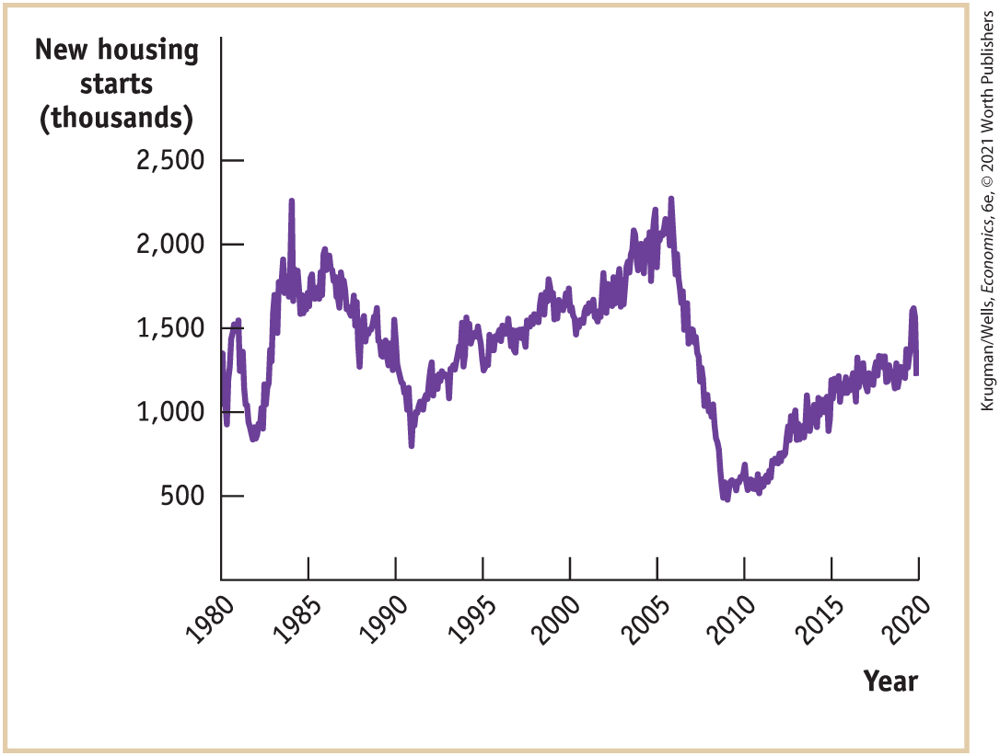

### PROBLEMS

1.  For each of the following transactions, what is the initial effect (increase or decrease) on M1? On M2?
    1.  You sell a few shares of stock and put the proceeds into your savings account.
    2.  You sell a few shares of stock and put the proceeds into your checking account.
    3.  You transfer money from your savings account to your checking account.
    4.  You discover \$0.25 under the floor mat in your car and deposit it in your checking account.
    5.  You discover \$0.25 under the floor mat in your car and deposit it in your savings account.
2.  There are three types of money: commodity money, commodity-backed money, and fiat money. Which type of money is used in each of the following situations?
    1.  Bottles of rum were used to pay for goods in colonial Australia.
    2.  Salt was used in many European countries as a medium of exchange.
    3.  For a brief time, Germany used paper money (the “Rye Mark”) that could be redeemed for a certain amount of rye, a type of grain.
    4.  The town of Ithaca, New York, prints its own currency, the Ithaca HOURS, which can be used to purchase local goods and services.
3.  The following table shows the components of M1 and M2 in billions of dollars for the month of December in the years 2009 to 2019 reported by the Federal Reserve Bank of St. Louis. Complete the table by calculating M1, M2, currency in circulation as a percentage of M1, and currency in circulation as a percentage of M2. What trends or patterns about M1, M2, currency in circulation as a percentage of M1, and currency in circulation as a percentage of M2 do you see? What might account for these trends?<!--
<strong class="important">[INSERT TABLE]</strong>
-->

| Year | Currency in circulation | Checkable deposits | Savings deposits | Time deposits | Money market funds | M1  | M2  | Currency in circulation as a percentage of M1 | Currency in circulation as a percentage of M2 |
|------------------------------------------------------------------------------------------------------------------------|-------------------------|--------------------|------------------|---------------|--------------------|-----|-----|-----------------------------------------------|-----------------------------------------------|
| 2009                                                                                                                   | \$863.7                 | \$829.1            | \$4,812.0        | \$1,187.5     | \$791.1            | ?   | ?   | ?                                             | ?                                             |
| 2010                                                                                                                   | 918.8                   | 917.9              | 5,331.5          | 934.4         | 686.7              | ?   | ?   | ?                                             | ?                                             |
| 2011                                                                                                                   | 1,001.6                 | 1,162.7            | 6,033.6          | 776.9         | 676.3              | ?   | ?   | ?                                             | ?                                             |
| 2012                                                                                                                   | 1,090.7                 | 1,370.4            | 6,683.3          | 645.8         | 655.4              | ?   | ?   | ?                                             | ?                                             |
| 2013                                                                                                                   | 1,160.7                 | 1,503.7            | 7,128.2          | 570.4         | 652.0              | ?   | ?   | ?                                             | ?                                             |
| 2014                                                                                                                   | 1,253.2                 | 1,687.1            | 7,573.0          | 523.4         | 631.3              | ?   | ?   | ?                                             | ?                                             |
| 2015                                                                                                                   | 1,339.5                 | 1,754.4            | 8,169.7          | 413.2         | 653.3              | ?   | ?   | ?                                             | ?                                             |
| 2016                                                                                                                   | 1,420.9                 | 1,919.0            | 8,814.5          | 353.4         | 691.3              | ?   | ?   | ?                                             | ?                                             |
| 2017                                                                                                                   | 1,525.0                 | 2,082.3            | 9,110.3          | 414.2         | 703.8              | ?   | ?   | ?                                             | ?                                             |
| 2018                                                                                                                   | 1,624.8                 | 2,121.7            | 9,260.9          | 532.9         | 811.5              | ?   | ?   | ?                                             | ?                                             |
| 2019                                                                                                                   | 1,710.9                 | 2,266.2            | 9,765.2          | 580.0         | 979.9              | ?   | ?   | ?                                             | ?                                             |
| *Data from:* Federal Reserve Bank of St. Louis.                                                                        |                         |                    |                  |               |                    |     |     |                                               |                                               |

4.  Indicate whether each of the following is part of M1, M2, or neither:
    1.  \$95 on your campus meal card
    2.  \$0.55 in the change cup of your car
    3.  \$1,663 in your savings account
    4.  \$459 in your checking account
    5.  100 shares of stock worth \$4,000
    6.  A \$1,000 line of credit on your Target credit card
5.  Tracy Williams deposits \$500 that was in her sock drawer into a checking account at the local bank. The reserve ratio is 10%.
    1.  How does the deposit initially change the T-account of the local bank? How does it change the money supply?
    2.  If the bank maintains a reserve ratio of 10%, how will it respond to the new deposit?
    3.  If every time the bank makes a loan, the loan results in a new checkable bank deposit in a different bank equal to the amount of the loan, by how much could the total money supply in the economy expand in response to Tracy’s initial cash deposit of \$500?
    4.  If every time the bank makes a loan, the loan results in a new checkable bank deposit in a different bank equal to the amount of the loan and the bank maintains a reserve ratio of 5%, by how much could the money supply expand in response to Tracy’s initial cash deposit of \$500?
6.  Ryan Cozzens withdraws \$400 from his checking account at the local bank and keeps it in his wallet.
    1.  How will the withdrawal change the T-account of the local bank and the money supply?
    2.  If the bank maintains a reserve ratio of 10%, how will it respond to the withdrawal? Assume that the bank responds to insufficient reserves by reducing the amount of deposits it holds until its level of reserves satisfies its required reserve ratio. The bank reduces its deposits by calling in some of its loans, forcing borrowers to pay back these loans by taking cash from their checking deposits (at the same bank) to make repayment.
    3.  If every time the bank decreases its loans, checkable bank deposits fall by the amount of the loan, by how much will the money supply in the economy contract in response to Ryan’s withdrawal of \$400?
    4.  If every time the bank decreases its loans, checkable bank deposits fall by the amount of the loan and the bank maintains a reserve ratio of 20%, by how much will the money supply contract in response to a withdrawal of \$400?
7.  The government of Eastlandia uses measures of monetary aggregates similar to those used by the United States, and the central bank of Eastlandia imposes a required reserve ratio of 10%. Given the following information, answer the questions below.
    - Bank deposits at the <!--&#x003C;&amp;lt;-->$\text{central}\,\text{bank} = \$ 200\,\text{million}$<!---->--\>
    - Currency held by <!--&#x003C;&amp;lt;-->$\text{public} = \$ 150\,\text{million}$<!---->--\>
    - Currency in bank <!--&#x003C;&amp;lt;-->$\text{vaults} = \$ 100\,\text{million}$<!---->--\>
    - Checkable bank <!--&#x003C;&amp;lt;-->$\text{deposits} = \$ 500\,\text{million}$<!---->--\>

    1.  What is M1?
    2.  What is the monetary base?
    3.  Are the commercial banks holding excess reserves?
    4.  Can the commercial banks increase checkable bank deposits? If yes, by how much can checkable bank deposits increase?
8.  In Westlandia, the public holds 50% of M1 in the form of currency, and the required reserve ratio is 20%. Estimate how much the money supply will increase in response to a new cash deposit of \$500 by completing the accompanying table. (*Hint:* The first row shows that the bank must hold \$100 in minimum reserves — 20% of the \$500 deposit — against this deposit, leaving \$400 in excess reserves that can be loaned out. However, since the public wants to hold 50% of the loan in currency, only <!--&#x003C;&amp;lt;-->$\$ 400 \times 0.5 = \$ 200$<!---->--\> of the loan will be deposited in round 2 from the loan granted in round 1.) How does your answer compare to an economy in which the total amount of the loan is deposited in the banking system and the public doesn’t hold any of the loan in currency? What does this imply about the relationship between the public’s desire for holding currency and the money multiplier?<!--
<strong class="important">[Table is from 5/e p. 445 problem 8]</strong>
-->
    | Round                 | Deposits | Required reserves | Excess reserves | Loans    | Held as currency |
    |-----------------------|----------|-------------------|-----------------|----------|------------------|
    | 1                     | \$500.00 | \$100.00          | \$400.00        | \$400.00 | \$200.00         |
    | 2                     | 200.00   | ?                 | ?               | ?        | ?                |
    | 3                     | ?        | ?                 | ?               | ?        | ?                |
    | 4                     | ?        | ?                 | ?               | ?        | ?                |
    | 5                     | ?        | ?                 | ?               | ?        | ?                |
    | 6                     | ?        | ?                 | ?               | ?        | ?                |
    | 7                     | ?        | ?                 | ?               | ?        | ?                |
    | 8                     | ?        | ?                 | ?               | ?        | ?                |
    | 9                     | ?        | ?                 | ?               | ?        | ?                |
    | Total after 10 rounds | ?        | ?                 | ?               | ?        | ?                |
9.  What will happen to the money supply under the following circumstances in a checkable-deposits-only system?
    1.  The required reserve ratio is 25%, and a depositor withdraws \$700 from their checkable bank deposit and holds it as cash.
    2.  The required reserve ratio is 5%, and a depositor withdraws \$700 from their checkable bank deposit and holds it as cash.
    3.  The required reserve ratio is 20%, and a customer deposits \$750 to their checkable bank deposit and holds it as cash.
    4.  The required reserve ratio is 10%, and a customer deposits \$600 to their checkable bank deposit and holds it as cash.
10. Although the U.S. Federal Reserve doesn’t use changes in reserve requirements to manage the money supply, the central bank of Albernia does. The commercial banks of Albernia have \$100 million in reserves and \$1,000 million in checkable deposits; the initial required reserve ratio is 10%. The commercial banks follow a policy of holding no excess reserves. The public holds no currency, only checkable deposits in the banking system.
    1.  How will the money supply change if the required reserve ratio falls to 5%?
    2.  How will the money supply change if the required reserve ratio rises to 25%?
11. Using <a href="#kru_9781319245269_ch14_05.xhtml#pau_9781319320164_CcaI8dQJ3S" id="kru_9781319245269_ch14_08.xhtml#pau_9781319320164_51Z0twbpMm" class="crossref">Figure 14-6</a>, find the Federal Reserve district in which you live. Go to <a href="http://www.federalreserve.gov/fomc/" id="kru_9781319245269_ch14_08.xhtml#pau_9781319320164_tbHNuZ1bRv" class="external">www.federalreserve.gov/fomc/</a> and determine if the president of the regional Federal Reserve bank in your district is currently a voting member of the Federal Open Market Committee (FOMC).
12. Show the changes to the T-accounts for the Federal Reserve and for commercial banks when the Federal Reserve sells \$30 million in U.S. Treasury bills. If the public holds a fixed amount of currency (so that all new loans create an equal amount of checkable bank deposits in the banking system) and the minimum reserve ratio is 5%, by how much will checkable bank deposits in the commercial banks change? By how much will the money supply change? Show the final changes to the T-account for the commercial banks when the money supply changes by this amount.
13. The Congressional Research Service estimates that at least \$45 million of counterfeit U.S. \$100 notes produced by the North Korean government are in circulation.
    1.  Why do U.S. taxpayers lose because of North Korea’s counterfeiting?
    2.  As of December 2016, the interest rate earned on one-year U.S. Treasury bills was 0.87%. At a 0.87% rate of interest, what is the amount of money U.S. taxpayers are losing per year because of these \$45 million in counterfeit notes?
14. As shown in <a href="#kru_9781319245269_ch14_05.xhtml#pau_9781319320164_u44MuQUEJT" id="kru_9781319245269_ch14_08.xhtml#pau_9781319320164_TNMJ7ToDXf" class="crossref">Figure 14-9</a>, the portion of the Federal Reserve’s assets made up of U.S. Treasury bills has declined since 2007. Go to <a href="http://www.federalreserve.gov" id="kru_9781319245269_ch14_08.xhtml#pau_9781319320164_GD5yfDC7Ie" class="external">www.federalreserve.gov</a>. On the top of the page, under “Data” and “Money Stock and Reserve Balances,” select the link “Factors Affecting Reserve <!--&#x003C;&amp;lt;-->$\text{Balances} - \text{H}.4.1$<!---->--\>.” Click on the link for the current release.
    1.  Under “Condition Statement of Federal Reserve Banks,” find the row “Reserve Bank Credit.” What is the total amount of reserve bank credit under “Average of Daily Figures” for the most current week ended? What is the amount displayed for “U.S. Treasury securities”? What percentage of the Federal Reserve’s total reserve bank credit is currently made up of U.S. Treasury bills?
    2.  Do the Federal Reserve’s assets consist primarily of U.S. Treasury securities, as they did in January 2007, the beginning of the graph in <a href="#kru_9781319245269_ch14_05.xhtml#pau_9781319320164_u44MuQUEJT" id="kru_9781319245269_ch14_08.xhtml#pau_9781319320164_yy8EQp8tTR" class="crossref">Figure 14-9</a>, or does the Fed still own a large number of other assets, as it did in early 2020, the end of the graph in <a href="#kru_9781319245269_ch14_05.xhtml#pau_9781319320164_u44MuQUEJT" id="kru_9781319245269_ch14_08.xhtml#pau_9781319320164_vhyxNt2ye6" class="crossref">Figure 14-9</a>?
15. The accompanying figure shows new U.S. housing starts, in thousands of units per month, between January 1980 and March 2020. The figure shows a large drop in new housing starts from 1984–1991 and 2006–2009. New housing starts are related to the availability of mortgages.
    1.  What caused the drop in new housing starts from 1984–1991?

    2.  What caused the drop in new housing starts from 2006–2009?

    3.  How could better regulation of financial institutions have prevented these two instances? <!--
<strong class="important">[Macro-14UN13]</strong>
--> <!--
<strong class="important">[MACRO 14UN14]</strong>
--> <!--
[EOC figure, no caption]
-->

        <figure id="pau_9781319320164_zIBol0S01i" class="figure lm_img_lightbox unnum c5 center">
        
        <figcaption>
<em>Data from:</em> Federal Reserve Bank of St. Louis.
</figcaption>
        </figure>

        <aside class="hidden" id="pau_9781319320164_XFR73CAJ4P" title="hidden">

        The vertical axis, labeled New housing starts (thousands) ranges from 0 to 2,500 in increments of 500. The horizontal axis, labeled Year ranges from 1980 to 2020 in increments of 5 years. A fluctuating curve passes through the approximate points (1980, 1,400), (1982, 800), (1985, 1,750), (1990, 1,250), (1995, 1,400), (2000, 1750), (2005, 2,250), (2010, 500), and (2020, 1,300).

        </aside>

 **Work It Out**

16. Show the changes to the T-accounts for the Federal Reserve and for commercial banks when the Federal Reserve buys \$50 million in U.S. Treasury bills. If the public holds a fixed amount of currency (so that all loans create an equal amount of deposits in the banking system), the minimum reserve ratio is 10%, and banks hold no excess reserves, by how much will deposits in the commercial banks change? By how much will the money supply change? Show the final changes to the T-account for commercial banks when the money supply changes by this amount. 
