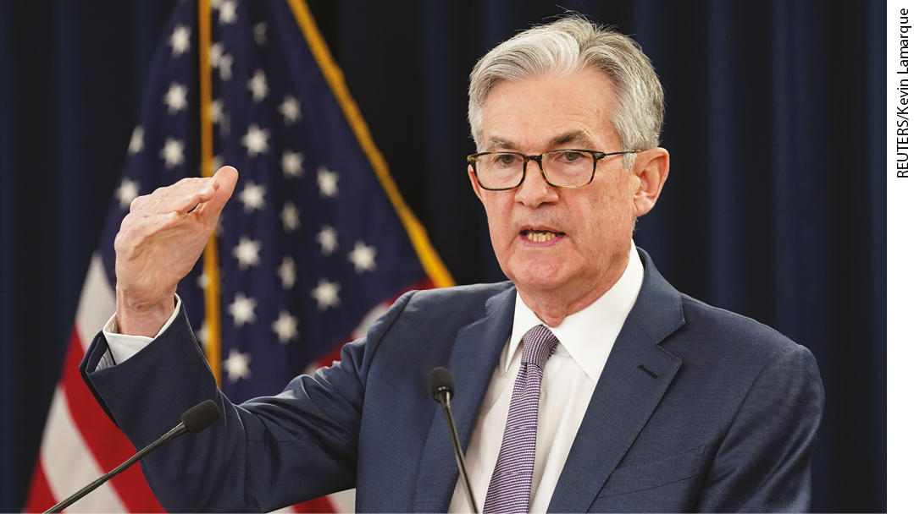
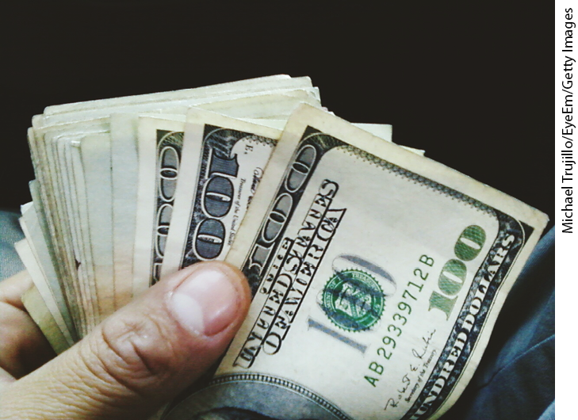
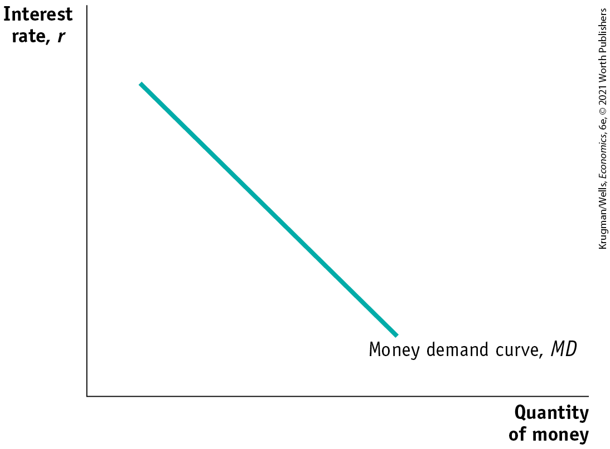
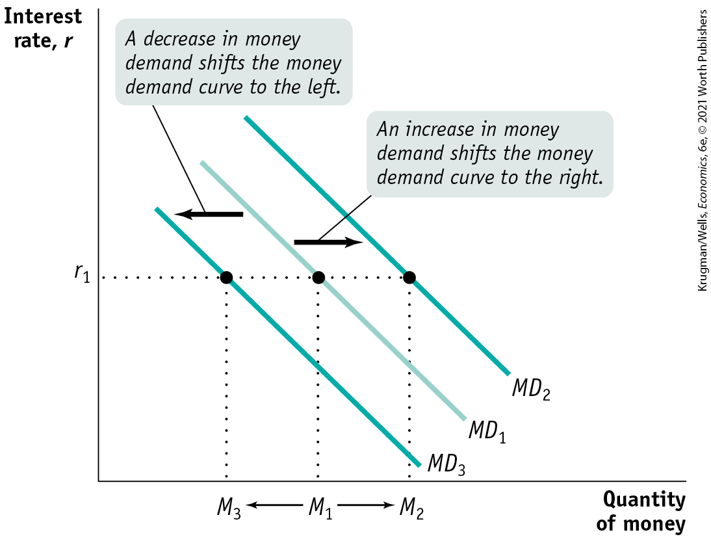

# Chapter 15 Monetary Policy

## THE MOST POWERFUL PERSON IN GOVERNMENT

<figure id="pau_9781319320164_yEf6JHVbHH" class="figure lm_img_lightbox unnum c2 right">

<figcaption>
<strong>The chair of the Federal Reserve is arguably the most powerful position in the U.S. government.</strong>
</figcaption>
</figure>

**“THE FUNDAMENTALS OF THE U.S. ECONOMY** remain strong. However, the coronavirus poses evolving risks to economic activity. In light of these risks and in support of achieving its maximum employment and price stability goals, the Federal Open Market Committee decided today to lower the target range for the federal funds rate by $1\text{/}2$ percentage point, to 1 to $1\text{-}1\text{/}4$ percent. The Committee is closely monitoring developments and their implications for the economic outlook and will use its tools and act as appropriate to support the economy.”

So read a statement issued on March 3, 2020, by the people who set U.S. monetary policy. Just 12 days later they issued another statement, effectively reducing the interest rates they control to zero, while also announcing plans to boost the economy by buying at least \$700 billion in bonds.

These two announcements amounted to a major shift in U.S. economic policy. But who was doing the shifting? Neither Congress nor the president has any direct role in setting interest rates. That role falls, instead, to the Board of Governors of the Federal Reserve, an independent agency that was chaired at the time by Jerome Powell. And there is an old saw to the effect that the Fed chair, not the president, is the most powerful person in government.

Yet, at the Federal Reserve, unlike at the nearby White House, there is no pomp and circumstance: no aides dashing around, no splendidly dressed military guards, no ornate paintings on the walls, and no Secret Service. Instead, workers at the Fed are casually dressed — and often look like graduate students. For example, each day at the New York Federal Reserve Bank, where the Fed’s financial operations are performed, billions of dollars’ worth of long-term U.S. government bonds are bought and sold in a small room with just five employees. Struck by the ordinariness of it all, one journalist wrote, “Can a spectacle so lacking in the indicia of importance — no pageantry, no emotions, not even speaking — really be the beating heart of capitalism?”

The answer is yes. The source of the power of the Fed chair and the Board of Governors comes from their ability to set *monetary policy.* It’s hard to overstate the importance of the Fed’s monetary policy to the U.S. economy — for price stability, for job creation, and for the smooth functioning of the financial system. Roughly half the recessions that have occurred since World War II can be attributed, at least partly, to policies undertaken by the Federal Reserve to fight inflation. And during many other periods, Fed policy played a critical role in fighting slumps and promoting recovery. During the financial crisis of 2008 and the ensuing Great Recession, the Fed was at the very center of the fight to keep the economy from plunging into an abyss.

How does the Fed accomplish all this? Through changes in the money supply and interest rates, which are implemented by its unassuming-looking employees trading billions of dollars daily in U.S. government bonds. (And, as we learned in <a href="#kru_9781319245269_ch14_01.xhtml#pau_9781319320164_kfN9Q68LJR" id="kru_9781319245269_ch15_01.xhtml#pau_9781319320164_H5s7HyBBCz" class="crossref">Chapter 14</a>, to a lesser extent, the Fed can influence the money supply by changing the reserve requirements for banks.)

In this chapter we’ll learn how monetary policy works — how actions by the Federal Reserve can have a powerful effect on the economy. We’ll start by looking at the *demand for money* from households and firms. Then we’ll see how the Fed’s ability to change the *supply of money* allows it to move interest rates in the short run and thereby affect real GDP. We’ll look at U.S. monetary policy in practice and compare it to the monetary policy of other central banks. We’ll conclude by examining monetary policy’s long-run effects. 

<aside class="learning-objectives c3 main-flow v3" epub:type="learning-objectives" id="pau_9781319320164_clmBaH1J2P">

### What you will learn

- What is the **money demand curve?**
- Why does the **liquidity preference model** determine the interest rate in the short run?
- How does the Federal Reserve implement monetary policy?
- Why is monetary policy the main tool for stabilizing the economy?
- Why do economists believe in **monetary neutrality?**

</aside>

## The Demand for Money

In the previous chapter we learned about the various types of monetary aggregates: M1, the most commonly used definition of the money supply, consists of currency in circulation (cash) plus checkable bank deposits; and M2, a broader definition of the money supply, consists of M1 plus deposits that can easily be transferred into checkable deposits. We also learned why people hold money — to make it easier to purchase goods and services. Now we’ll go deeper, examining what determines how much money individuals and firms want to hold at any given time.

### The Opportunity Cost of Holding Money

Most economic decisions involve trade-offs at the margin. That is, individuals decide how much of a good to consume by determining whether the benefit they’d gain from consuming a bit more of any given good is worth the cost. The same decision process is used when deciding how much money to hold.

<figure id="pau_9781319320164_72f0NYUBqg" class="figure lm_img_lightbox unnum c2 right">

<figcaption>
There is a price to be paid for the convenience of holding money.
</figcaption>
</figure>

Individuals and firms find it useful to hold some of their assets in the form of money because of the convenience that cash provides: money can be used to make purchases directly, but other assets can’t. But there is a price to be paid for that convenience: money normally yields no rate of return, or a lower rate of return, than nonmonetary assets.

As an example of how convenience makes it worth incurring some opportunity costs, consider the substantial sums that Americans hold in cash and in zero-interest bank accounts linked to debit cards or money transmitters like PayPal and Venmo. By doing so they forgo the interest that could have been earned by putting those funds into an interest-bearing asset like a certificate of deposit. A <a href="#kru_9781319245269_EM_glossary.xhtml#pau_9781319320164_HSHZm5iccG" id="kru_9781319245269_ch15_02.xhtml#pau_9781319320164_NBEDK6rYJN" class="glossref" role="doc-glossref">certificate of deposit</a>, or <a href="#kru_9781319245269_EM_glossary.xhtml#pau_9781319320164_HSHZm5iccG" id="kru_9781319245269_ch15_02.xhtml#pau_9781319320164_Dp5T342QB4" class="glossref" role="doc-glossref">CD</a>, is a bank-issued asset that allows customers to deposit their funds for a specified amount of time, and, in return, the bank pays a specified interest rate. For example, as of April 2020 the bank Capital One was offering a five-year CD paying 1.4% annually and a one-year CD paying 1.5%. But CDs also carry a penalty if funds are withdrawn before the specified amount of time — whether five years or one year — has elapsed.

<aside aria-label="title 1" class="glossary c3 main-flow v1" epub:type="glossary" id="pau_9781319320164_BmE9zMpHa8">

**certificate of deposit (CD)**  
A **certificate of deposit (CD)** is a bank-issued asset in which customers deposit funds for a specified amount of time and earn a specified interest rate.

</aside>

So making sense of the demand for money is about understanding how individuals and firms trade off the benefit of holding monetary assets that provide convenience but little or no interest (like cash and zero-interest bank accounts) versus the benefit of holding nonmonetary assets — that provide more interest but less convenience (like CDs). And that trade-off is affected by the interest rate. (As before, when we say *the interest rate* it is with the understanding that we mean a nominal interest rate — that is, it’s unadjusted for inflation.) Next, we’ll examine how that trade-off changed dramatically from June 2007 to June 2009, when there was a big fall in interest rates.

<a href="#kru_9781319245269_ch15_02.xhtml#pau_9781319320164_EtzuVVZNfk" id="kru_9781319245269_ch15_02.xhtml#pau_9781319320164_YHDX417TTS" class="crossref">Table 15-1</a> illustrates the opportunity cost of holding money in a specific month, March 2019. The first row shows the interest rate on one-month Treasury bills — that is, the interest rate individuals could get if they were willing to lend funds to the U.S. government for one month.

|                                                 |       |
|-------------------------------------------------|-------|
| One-month Treasury bills                        | 2.45% |
| Interest-bearing demand deposits                | 0.06% |
| Currency                                        | 0     |
| *Data from*: Federal Reserve Bank of St. Louis. |       |

TABLE 15-1 Selected Interest Rates, March 2019

In March 2019, one-month Treasury bills yielded 2.45%. The second row shows the interest rate on interest-bearing demand deposits. Funds in these accounts were more accessible than those in Treasury bills, but the price of that convenience was a much lower interest rate, only 0.06%. Finally, the last row shows the interest rate on currency — cash in your wallet — which was, of course, zero.

<a href="#kru_9781319245269_ch15_02.xhtml#pau_9781319320164_EtzuVVZNfk" id="kru_9781319245269_ch15_02.xhtml#pau_9781319320164_EkizYt9X4E" class="crossref">Table 15-1</a> shows the opportunity cost of holding money at one point in time, but the opportunity cost of holding money changes when the overall level of interest rates changes. Specifically, when the overall level of interest rates falls, the opportunity cost of holding money falls, too.

<a href="#kru_9781319245269_ch15_02.xhtml#pau_9781319320164_uhidcW1qoz" id="kru_9781319245269_ch15_02.xhtml#pau_9781319320164_SAGUZoX5X3" class="crossref">Table 15-2</a> illustrates this point by showing how selected interest rates changed between March 2019 and March 2020; as we’ve already seen, in early 2020 the Fed slashed rates in an effort to fight off a rapidly worsening recession. A comparison between interest rates in those two months illustrates what happens when the opportunity cost of holding money falls sharply. Over the course of a year the federal funds rate, which is the rate the Fed controls most directly, fell by 2.3 percentage points. The interest rate on one-month Treasuries fell by almost the same amount. These interest rates are <a href="#kru_9781319245269_EM_glossary.xhtml#pau_9781319320164_Rb1kaHv3mX" id="kru_9781319245269_ch15_02.xhtml#pau_9781319320164_q4eOWECdsw" class="glossref" role="doc-glossref">short-term interest rates</a> — rates on financial assets that come due, or mature, within less than a year.

<aside aria-label="title 2" class="glossary c3 main-flow v1" epub:type="glossary" id="pau_9781319320164_VeVSoDdYa9">

**short-term interest rates**  
**Short-term interest rates** are the interest rates on financial assets that mature within less than a year.

</aside>

|                                                                           |            |            |
|---------------------------------------------------------------------------|------------|------------|
|                                                                           | March 2019 | March 2020 |
| Federal funds rate                                                        | 2.41%      | 0.08%      |
| One-month Treasury bills                                                  | 2.45%      | 0.12%      |
| Interest-bearing demand deposits                                          | 0.06%      | 0.06%      |
| Currency                                                                  | 0          | 0          |
| Treasury bills minus interest-bearing demand deposits (percentage points) | 2.39       | 0.06       |
| Treasury bills minus currency (percentage points)                         | 2.45       | 0.12       |
| *Data from:* Federal Reserve Bank of St. Louis.                           |            |            |

TABLE 15-2 Interest Rates and the Opportunity Cost of Holding Money

As short-term interest rates fell, the interest rate on money didn’t fall by the same amount. The interest rate on currency, of course, remained at zero. The interest rate paid on demand deposits also remained unchanged, at 0.06%. As a comparison of the two columns of <a href="#kru_9781319245269_ch15_02.xhtml#pau_9781319320164_uhidcW1qoz" id="kru_9781319245269_ch15_02.xhtml#pau_9781319320164_HQzNlVwtwV" class="crossref">Table 15-2</a> shows, the opportunity cost of holding money fell. The last two rows of <a href="#kru_9781319245269_ch15_02.xhtml#pau_9781319320164_uhidcW1qoz" id="kru_9781319245269_ch15_02.xhtml#pau_9781319320164_d9jMM9WuHG" class="crossref">Table 15-2</a> summarize this comparison: they give the differences between the interest rates on Treasuries and demand deposits and between the interest rates on Treasuries and currency.

These differences — the opportunity cost of holding money rather than interest-bearing assets — declined sharply between March 2019 and March 2020. This reflects a general result: *the higher the short-term interest rate, the higher the opportunity cost of holding money; the lower the short-term interest rate, the lower the opportunity cost of holding money.*

The fact that the federal funds rate in <a href="#kru_9781319245269_ch15_02.xhtml#pau_9781319320164_uhidcW1qoz" id="kru_9781319245269_ch15_02.xhtml#pau_9781319320164_zsiMXVAqI5" class="crossref">Table 15-2</a> and the interest rate on Treasuries fell by almost the same percentage is not an accident: all short-term interest rates tend to move together, with rare exceptions. The reason short-term interest rates tend to move together is that short-term assets are in effect competing for the same business. Any short-term asset that offers a lower-than-average interest rate will be sold by investors, who will move their wealth into a higher-yielding short-term asset. The selling of the asset, in turn, forces its interest rate up, because investors must be rewarded with a higher rate in order to induce them to buy it.

Conversely, investors will move their wealth into any short-term financial asset that offers an above-average interest rate. The purchase of the asset drives its interest rate down when sellers find they can lower the rate of return on the asset and still find willing buyers. So, interest rates on short-term financial assets tend to be roughly the same because no asset will consistently offer a higher-than-average or a lower-than-average interest rate.

<a href="#kru_9781319245269_ch15_02.xhtml#pau_9781319320164_uhidcW1qoz" id="kru_9781319245269_ch15_02.xhtml#pau_9781319320164_7Gou6YklS4" class="crossref">Table 15-2</a> contains only short-term interest rates. At any given moment, <a href="#kru_9781319245269_EM_glossary.xhtml#pau_9781319320164_SeTWffACls" id="kru_9781319245269_ch15_02.xhtml#pau_9781319320164_NeuWPJxXk5" class="glossref" role="doc-glossref">long-term interest rates</a> — rates of interest on financial assets that mature, or come due, a number of years into the future — may be different from short-term interest rates. The difference between short-term and long-term interest rates is sometimes important as a practical matter.

<aside aria-label="title 3" class="glossary c3 main-flow v1" epub:type="glossary" id="pau_9781319320164_x9Ztxqqltf">

**long-term interest rates**  
**Long-term interest rates** are interest rates on financial assets that mature a number of years in the future.

</aside>

Moreover, it’s short-term rates rather than long-term rates that affect money demand, because the decision to hold money involves trading off the convenience of holding cash versus the payoff from holding assets that mature in the short term — a year or less. For the moment, however, let’s ignore the distinction between short-term and long-term rates and assume that there is only one interest rate.

### The Money Demand Curve

Because the overall level of interest rates affects the opportunity cost of holding money, the quantity of money individuals and firms want to hold is, other things equal, negatively related to the interest rate. In <a href="#kru_9781319245269_ch15_02.xhtml#pau_9781319320164_zBWsw68Qde" id="kru_9781319245269_ch15_02.xhtml#pau_9781319320164_9KVYvVU5J3" class="crossref">Figure 15-1</a>, the horizontal axis shows the quantity of money demanded and the vertical axis shows the interest rate, *r,* which you can think of as a representative short-term interest rate such as the rate on one-month CDs. (As we discussed in <a href="#kru_9781319245269_ch10_01.xhtml#pau_9781319320164_GbPAtnS6LO" id="kru_9781319245269_ch15_02.xhtml#pau_9781319320164_WCbFlQy3Xp" class="crossref">Chapter 10</a>, it is the nominal interest rate, not the real interest rate, that influences people’s money allocation decisions. Hence, *r* in <a href="#kru_9781319245269_ch15_02.xhtml#pau_9781319320164_zBWsw68Qde" id="kru_9781319245269_ch15_02.xhtml#pau_9781319320164_XERab0bHzw" class="crossref">Figure 15-1</a> and all subsequent figures is the nominal interest rate.)

<figure id="pau_9781319320164_zBWsw68Qde" class="figure lm_img_lightbox num c3 main-flow">

<figcaption>
FIGURE 15-1 The Money Demand Curve

The money demand curve illustrates the relationship between the interest rate and the quantity of money demanded. It slopes downward: a higher interest rate leads to a higher opportunity cost of holding money and reduces the quantity of money demanded. Correspondingly, a lower interest rate reduces the opportunity cost of holding money and increases the quantity of money demanded.
</figcaption>
</figure>

<aside class="hidden" id="pau_9781319320164_Uo05ANpTEF" title="hidden">

The vertical axis is labeled Interest rate r, and the horizontal axis is labeled Quantity of money. A negative sloping straight line is labeled Money demand curve, M D.

</aside>

The relationship between the interest rate and the quantity of money demanded by the public is illustrated by the <a href="#kru_9781319245269_EM_glossary.xhtml#pau_9781319320164_Guio70oJQk" id="kru_9781319245269_ch15_02.xhtml#pau_9781319320164_gEcZm9j9qo" class="glossref" role="doc-glossref">money demand curve</a>, *MD*, in <a href="#kru_9781319245269_ch15_02.xhtml#pau_9781319320164_zBWsw68Qde" id="kru_9781319245269_ch15_02.xhtml#pau_9781319320164_TuMAzOfVcT" class="crossref">Figure 15-1</a>. The money demand curve slopes downward because, other things equal, a higher interest rate increases the opportunity cost of holding money, leading the public to reduce the quantity of money it demands. For example, if the interest rate is very low — say, 1% — the interest forgone by holding money is relatively small. As a result, individuals and firms will tend to hold relatively large amounts of money to avoid the cost and nuisance of converting other assets into money when making purchases.

<aside aria-label="title 4" class="glossary c3 main-flow v1" epub:type="glossary" id="pau_9781319320164_HOB5sDdCPi">

**money demand curve**  
The **money demand curve** shows the relationship between the interest rate and the quantity of money demanded.

</aside>

By contrast, if the interest rate is relatively high — say, 15%, a level it reached in the United States in the early 1980s — the opportunity cost of holding money is high. People will respond by keeping only small amounts in cash and deposits, converting assets into money only when needed.

You might ask why we draw the money demand curve with the interest rate — as opposed to rates of return on other assets, such as stocks or real estate — on the vertical axis. The answer is that for most people the relevant question in deciding how much money to hold is whether to put the funds in the form of other assets that can be turned fairly quickly and easily into money. Many online brokers offer \$0 trades. Stocks don’t fit that definition because converting stocks to cash can take considerable time, incur substantial fees, or both, and also because stock values fluctuate. Real estate doesn’t fit the definition either because selling real estate involves even larger fees and can take a long time as well. So the relevant comparison is with assets that are “close to” money — assets like CDs that are less liquid than money but more liquid than stocks or real estate. And as we’ve already seen, the interest rates on all these assets normally move closely together.

### Shifts of the Money Demand Curve

A number of factors other than the interest rate affect the demand for money. When one of these factors changes, the money demand curve shifts. <a href="#kru_9781319245269_ch15_02.xhtml#pau_9781319320164_F8EFygopg8" id="kru_9781319245269_ch15_02.xhtml#pau_9781319320164_6IpFscft8q" class="crossref">Figure 15-2</a> shows shifts of the money demand curve: an increase in the demand for money corresponds to a rightward shift of the *MD* curve, raising the quantity of money demanded at any given interest rate; a decrease in the demand for money corresponds to a leftward shift of the *MD* curve, reducing the quantity of money demanded at any given interest rate.

<figure id="pau_9781319320164_F8EFygopg8" class="figure lm_img_lightbox num c3 main-flow">

<figcaption>
FIGURE 15-2 Increases and Decreases in the Demand for Money

The demand curve for money shifts when non-interest-rate factors that affect the demand for money change. An increase in money demand shifts the money demand curve to the right, from <em>M</em><em>D</em>1 to <em>M</em><em>D</em>2, and the quantity of money demanded rises at any given interest rate. A decrease in money demand shifts the money demand curve to the left, from <em>M</em><em>D</em>1 to <em>M</em><em>D</em>3, and the quantity of money demanded falls at any given interest rate.
</figcaption>
</figure>

<aside class="hidden" id="pau_9781319320164_MjuEAGe9b9" title="hidden">

The vertical axis, labeled Interest rate r, shows a marking at r subscript 1, and the horizontal axis, labeled Quantity of money, shows markings at M subscript 3, M subscript 1, and M subscript 2 from left to right. Three negative sloping parallel straight lines labeled M D subscript 3, M D subscript 1, and M D subscript 2 from left to right pass through points (M subscript 3, r subscript 1), (M subscript 1, r subscript 1), and (M subscript 2, r subscript 1), respectively. A rightward arrow between M D subscript 1 and M D subscript 2 is labeled, “An increase in money demand shifts the money demand curve to the right.” A leftward arrow between M D subscript 1 and M D subscript 3 is labeled, “A decrease in money demand shifts the money demand curve to the left.” An arrow points from M subscript 1 to M subscript 2 and from M subscript 1 to M subscript 3.

</aside>

The most important factors causing the money demand curve to shift are changes in the aggregate price level, changes in real GDP, changes in credit markets and banking technology, and changes in institutions.

#### Changes in the Aggregate Price Level

Americans keep a lot more cash on hand and funds in their checking accounts today than they did in the 1950s. One reason is that they have to if they want to be able to buy anything: almost everything costs more now than it did when you could get a burger, fries, and a drink at McDonald’s for 45 cents and a gallon of gasoline for 29 cents. So, other things equal, higher prices increase the demand for money (a rightward shift of the *MD* curve), and lower prices decrease the demand for money (a leftward shift of the *MD* curve).

We can actually be more specific than this: other things equal, the demand for money is *proportional* to the price level. That is, if the aggregate price level rises by 20%, the quantity of money demanded at any given interest rate, such as $r_{1}$ in <a href="#kru_9781319245269_ch15_02.xhtml#pau_9781319320164_F8EFygopg8" id="kru_9781319245269_ch15_02.xhtml#pau_9781319320164_tHIKSKg0Ha" class="crossref">Figure 15-2</a>, also rises by 20% — the movement from $M_{1}$ to $M_{2}$. Why? Because if the price of everything rises by 20%, it takes 20% more money to buy the same basket of goods and services. And if the aggregate price level falls by 20%, at any given interest rate the quantity of money demanded falls by 20% — shown by the movement from $M_{1}$ to $M_{3}$ at the interest rate $r_{1}$. As we’ll see later, the fact that money demand is proportional to the price level has important implications for the long-run effects of monetary policy.

#### Changes in Real GDP

Households and firms hold money as a way to facilitate purchases of goods and services. The larger the quantity of goods and services they buy, the larger the quantity of money they will want to hold at any given interest rate. So, an increase in real GDP — the total quantity of goods and services produced and sold in the economy — shifts the money demand curve rightward. A fall in real GDP shifts the money demand curve leftward.

#### Changes in Credit Markets and Banking Technology

<figure id="pau_9781319320164_58wKG4CnDf" class="figure lm_img_lightbox unnum c2 right">

<figcaption>
Since the start of coronavirus pandemic merchants have seen a spike in contactless forms of payment like ApplePay and Google Pay.
</figcaption>
</figure>

As late as the 1960s almost all small purchases — lunch, groceries, and more — were made using cash because alternatives were few. Since then, however, the need for cash has been greatly reduced by a series of innovations, from widely available credit cards to debit cards to apps like PayPal that let you pay with your smartphone (see the Business Case at end of chapter to learn more about money transmitters like PayPal and Venmo). ATMs and then online banking also made it much easier to transfer funds between accounts, so it became less necessary to hold a surplus of funds in checking accounts in order to make payments. During the coronavirus pandemic, consumers have preferred contactless payment and have dumped cash in favor of digital platforms like ApplePay or Google Pay. All of these developments make it easier for people to make purchases and reduce the demand for money, shifting the demand curve for money to the left.

#### Changes in Institutions

Changes in institutions can increase or decrease the demand for money. For example, until Regulation Q was eliminated in 1980, U.S. banks weren’t allowed to offer interest on checking accounts. So the interest you would forgo by holding funds in a checking account instead of an interest-bearing asset made the opportunity cost of holding funds in checking accounts very high. When banking regulations changed, allowing banks to pay interest on checking account funds, the demand for money rose and shifted the money demand curve to the right.

### ECONOMICS \>\> *in Action*

A Yen for Cash

Japan, say financial experts, is still a “cash society.” Visitors from the United States or Europe are surprised at how little use the Japanese make of credit cards or debit cards. They do make many purchases with smartphones, yet they still carry remarkably large amounts of cash around in their wallets. Yet Japan is one of the most economically and technologically advanced countries, and superior to the United States in some areas, such as transportation. So why do the citizens of this economic powerhouse often still do business the way Americans and Europeans did a generation ago? The answer highlights the factors affecting the demand for money.

<figure id="pau_9781319320164_6NGaYM92Zp" class="figure lm_img_lightbox unnum c2 right">

<figcaption>
No matter what they are shopping for, Japanese consumers tend to pay with cash rather than plastic.
</figcaption>
</figure>

One reason the Japanese use cash so much is that their institutions never made the switch to heavy reliance on plastic. For complex reasons, Japan’s retail sector is still dominated by small mom-and-pop stores, which are reluctant to pay the up-front costs that would let them accept credit cards, let alone smartphone apps, as payment. Japan’s banks have also been slow about pushing transaction technology; visitors are often surprised to find that ATMs outside of major metropolitan areas close early in the evening rather than staying open all night.

But there’s another reason the Japanese hold so much cash: there’s little opportunity cost to doing so. Short-term interest rates in Japan have been below 1% since the mid-1990s. It also helps that the Japanese crime rate is quite low, so you are unlikely to have your wallet stolen. So why not hold cash?

### *\>\> Quick Review*

- Money offers a lower rate of return than other financial assets. We usually compare the rate of return on money with **short-term**, not **long-term, interest rates.**
- Holding money provides liquidity but incurs an opportunity cost that rises with the interest rate, leading to the downward slope of the **money demand curve.**
- Changes in the aggregate price level, real GDP, credit markets and banking technology, and institutions shift the money demand curve. An increase in the demand for money shifts the money demand curve rightward; a decrease in the demand for money shifts the money demand curve leftward.

### *\>\> Check Your Understanding* 15-1

1.  Explain how each of the following would affect the quantity of money demanded. Does the change cause a movement along the money demand curve or a shift of the money demand curve?
    1.  Short-term interest rates rise from 5% to 30%.
    2.  All prices fall by 10%.
    3.  New “just walk out technology” automatically charges supermarket purchases to credit cards, eliminating the need to stop at the cash register.
    4.  In order to avoid paying a sharp increase in taxes, residents of Laguria shift their assets into overseas bank accounts. These accounts are harder for tax authorities to trace but also harder for their owners to tap and convert funds into cash.
2.  Which of the following will increase the opportunity cost of holding cash? Which will reduce it? Explain.
    1.  In order to attract new customers, the new electronic payment firm, PayBuddy, announces it will pay 0.5% interest on cash balances in a PayBuddy account.
    2.  To attract more deposits, banks raise the interest paid on six-month CDs.
    3.  In an effort to increase holiday sales, stores offer one-year zero-interest deals on purchases made with store credit cards.

## Money and Interest Rates

We started this chapter by quoting from a Federal Reserve press release announcing a change in the target federal funds rate. We learned about the federal funds rate in <a href="#kru_9781319245269_ch14_01.xhtml#pau_9781319320164_kfN9Q68LJR" id="kru_9781319245269_ch15_03.xhtml#pau_9781319320164_jLWERmgBgJ" class="crossref">Chapter 14</a>: it’s the rate at which banks lend reserves to each other to meet the required reserve ratio. As the statement implies, at each of its eight-times-a-year meetings, and also sometimes on special occasions between meetings, a group called the Federal Open Market Committee sets a target value for the federal funds rate. It’s then up to Fed officials to achieve that target. This is done by the Open Market Desk at the Federal Reserve Bank of New York, which buys and sells short-term U.S. government debt, known as Treasury bills, to achieve that target.

As we’ve already seen, other short-term interest rates move with the federal funds rate. So when the Fed cut its target for the federal funds rate in March 2020, many other short-term interest rates also fell by about the same amount.

How does the Fed go about achieving a *target federal funds rate?* And more to the point, how is the Fed able to affect interest rates at all?
