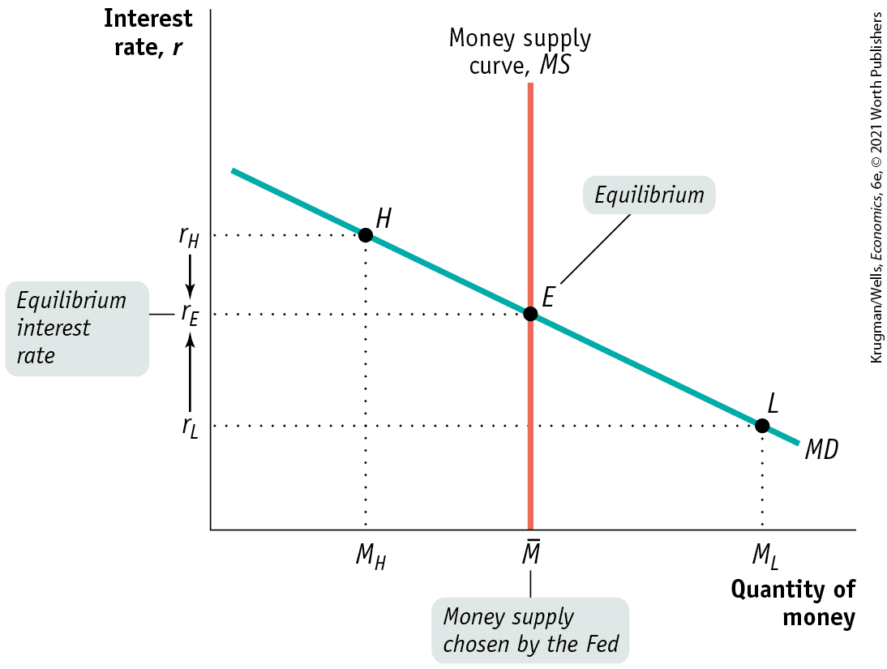
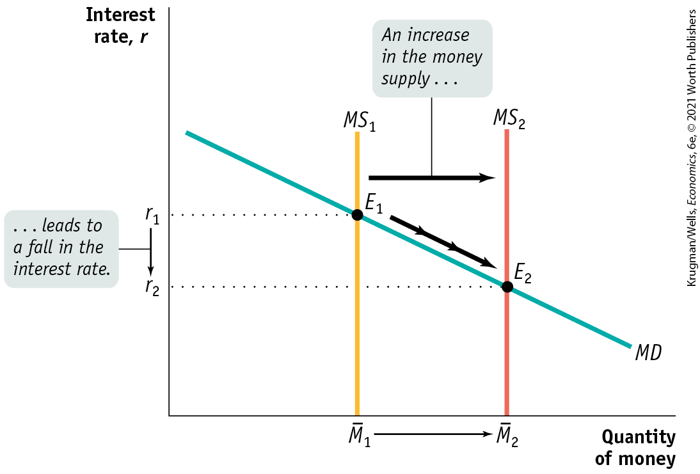
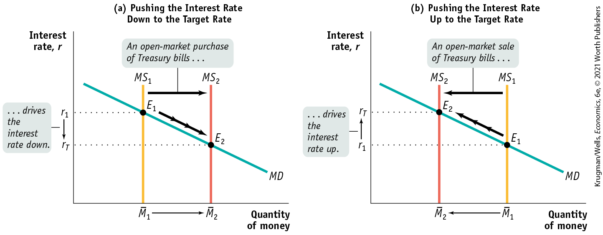
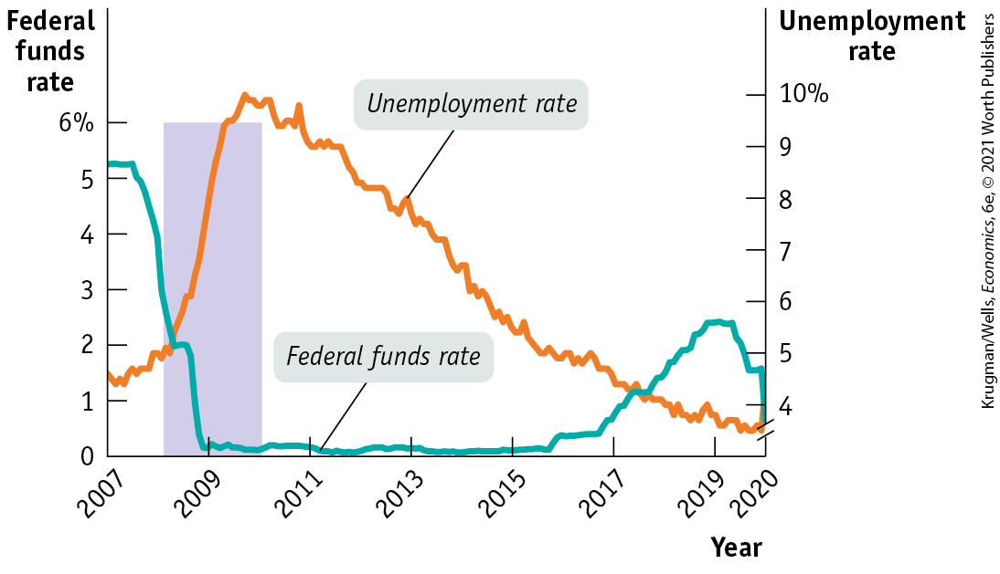
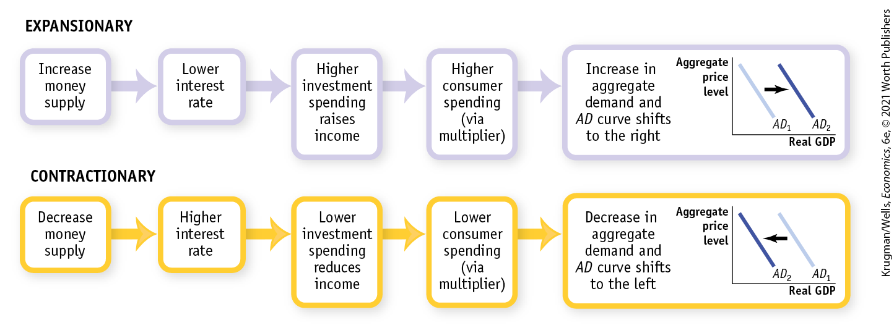
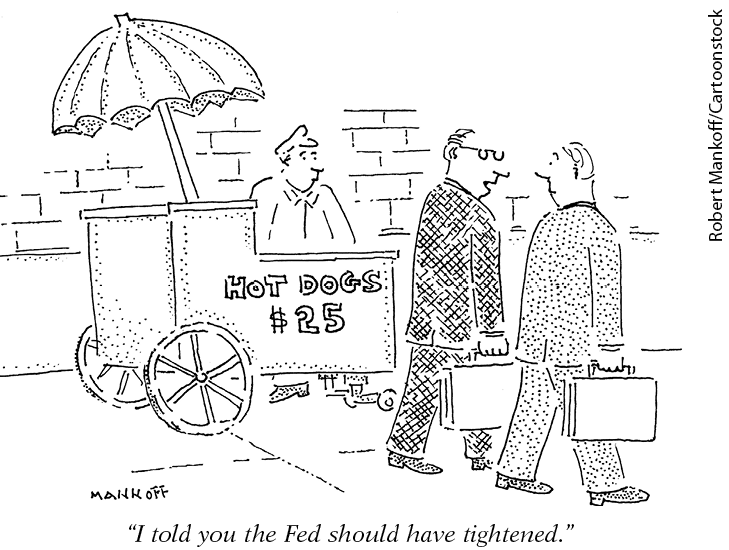

### The Equilibrium Interest Rate

Recall that, for simplicity, we’re assuming there is only one interest rate paid on nonmonetary financial assets, both in the short run and in the long run. To understand how the interest rate is determined, consider <a href="#kru_9781319245269_ch15_03.xhtml#pau_9781319320164_iOcObwsTyz" id="kru_9781319245269_ch15_03.xhtml#pau_9781319320164_CXNHHIolWD" class="crossref">Figure 15-3</a>, which illustrates the <a href="#kru_9781319245269_EM_glossary.xhtml#pau_9781319320164_FTwmTvoNml" id="kru_9781319245269_ch15_03.xhtml#pau_9781319320164_GQkhaIX1Ad" class="glossref" role="doc-glossref">liquidity preference model of the interest rate;</a> this model says that the interest rate is determined by the supply and demand for money in the market for money. <a href="#kru_9781319245269_ch15_03.xhtml#pau_9781319320164_iOcObwsTyz" id="kru_9781319245269_ch15_03.xhtml#pau_9781319320164_LJ0rCozfn0" class="crossref">Figure 15-3</a> combines the money demand curve, *MD,* with the <a href="#kru_9781319245269_EM_glossary.xhtml#pau_9781319320164_WpwPEcGEao" id="kru_9781319245269_ch15_03.xhtml#pau_9781319320164_kXlisRAgan" class="glossref" role="doc-glossref">money supply curve</a>, *MS,* which shows how the quantity of money supplied by the Federal Reserve varies with the interest rate.

<aside aria-label="title 1" class="glossary c3 main-flow v1" epub:type="glossary" id="pau_9781319320164_KynSXF7BtQ">

**liquidity preference model of the interest rate**  
According to the **liquidity preference model of the interest rate**, the interest rate is determined by the supply and demand for money.

</aside>
<aside aria-label="title 2" class="glossary c3 main-flow v1" epub:type="glossary" id="pau_9781319320164_ww3iGF54Ob">

**money supply curve**  
The **money supply curve** shows how the quantity of money supplied varies with the interest rate.

</aside>

<figure id="pau_9781319320164_iOcObwsTyz" class="figure lm_img_lightbox num c3 main-flow">

<figcaption>
FIGURE 15-3 Equilibrium in the Money Market

The money supply curve, <em>MS,</em> is vertical at the money supply chosen by the Federal Reserve, $\overline{M}$. The money market is in equilibrium at the interest rate <em>r</em><em>E</em>: the quantity of money demanded by the public is equal to $\overline{M}$, the quantity of money supplied.

At a point such as <em>L,</em> the interest rate, <em>r</em><em>L</em>, is below <em>r</em><em>E</em> and the corresponding quantity of money demanded, <em>M</em><em>L</em>, exceeds the money supply, $\overline{M}$. In an attempt to shift their wealth out of nonmoney interest-bearing financial assets and raise their money holdings, investors drive the interest rate up to <em>r</em><em>E</em>. At a point such as <em>H,</em> the interest rate <em>r</em><em>H</em> exceeds <em>r</em><em>E</em> and the corresponding quantity of money demanded, <em>M</em><em>H</em>, is less than the money supply, $\overline{M}$. In an attempt to shift out of money holdings into nonmoney interest-bearing financial assets, investors drive the interest rate down to <em>r</em><em>E</em>.
</figcaption>
</figure>

<aside class="hidden" id="pau_9781319320164_Tbfm6MgSJf" title="hidden">

The vertical axis, labeled Interest rate r, shows markings at r subscript L, r subscript E, and r subscript H from bottom to top. The horizontal axis, labeled Quantity of money, shows markings at M subscript H, M bar, M subscript L from left to right. A vertical line, parallel to the vertical axis, starts from M bar, and is labeled Money supply curve, M S. A negative sloping straight line labeled M D passes through points H (M subscript H, r subscript H), E (M bar, r subscript E), and L (M subscript L, r subscript L). Money supply curve, M S intersects M D at point E (M bar, r subscript E) labeled Equilibrium. M bar is labeled, “Money supply chosen by the Fed,” and r subscript E is labeled, “Equilibrium interest rate.” An arrow points from r subscript H to r subscript E and from r subscript L to r subscript E.

</aside>

The Federal Reserve can increase or decrease the money supply: it usually does this through *open-market operations,* buying or selling Treasury bills, but it can also lend via the *discount window* or change *reserve requirements.* Let’s assume for simplicity that the Fed, using one or more of these methods, simply chooses the level of the money supply that it believes will achieve its interest rate target. Then the money supply curve is a vertical line, *MS* in <a href="#kru_9781319245269_ch15_03.xhtml#pau_9781319320164_iOcObwsTyz" id="kru_9781319245269_ch15_03.xhtml#pau_9781319320164_qrq5iH8t5w" class="crossref">Figure 15-3</a>, with a horizontal intercept corresponding to the money supply chosen by the Fed, $\overline{M}$. The money market equilibrium is at *E,* where *MS* and *MD* cross. At this point the quantity of money demanded equals the money supply, $\overline{M}$. leading to an equilibrium interest rate of $r_{E}$.

To understand why $r_{E}$ is the equilibrium interest rate, consider what happens if the money market is at a point like *L,* where the interest rate, $r_{L}$, is below $r_{E}$. At $r_{L}$ the public wants to hold the quantity of money *ML*, an amount larger than the actual money supply, $\overline{M}$. This means that at point *L,* the public wants to shift some of its wealth out of interest-bearing assets such as CDs into money.

This result has two implications.

1.  The quantity of money demanded is *more* than the quantity of money supplied.
2.  The quantity of interest-bearing nonmoney assets demanded is *less* than the quantity supplied.

So those trying to sell nonmoney assets will find that they have to offer a higher interest rate to attract buyers. As a result, the interest rate will be driven up from $r_{L}$ until the public wants to hold the quantity of money that is actually available, $\overline{M}$. That is, the interest rate will rise until it is equal to $r_{E}$.

Now consider what happens if the money market is at a point such as *H* in <a href="#kru_9781319245269_ch15_03.xhtml#pau_9781319320164_iOcObwsTyz" id="kru_9781319245269_ch15_03.xhtml#pau_9781319320164_Ap6zJckao5" class="crossref">Figure 15-3</a>, where the interest rate $r_{H}$ is above $r_{E}$. In that case the quantity of money demanded, $M_{H}$, is less than the quantity of money supplied, $\overline{M}$. Correspondingly, the quantity of interest-bearing nonmoney assets demanded is greater than the quantity supplied. Those trying to sell interest-bearing nonmoney assets will find that they can offer a lower interest rate and still find willing buyers. This leads to a fall in the interest rate from $r_{H}$. It falls until the public wants to hold the quantity of money that is actually available, $\overline{M}$. Again, the interest rate will end up at $r_{E}$.

### Two Models of Interest Rates?

You might have noticed that this is the second time we have discussed the determination of the interest rate. In <a href="#kru_9781319245269_ch10_01.xhtml#pau_9781319320164_GbPAtnS6LO" id="kru_9781319245269_ch15_03.xhtml#pau_9781319320164_fTryPrkhHx" class="crossref">Chapter 10</a> we studied the *loanable funds model* of the interest rate; according to that model, the interest rate is determined by the equalization of the supply of funds from lenders and the demand for funds by borrowers in the market for loanable funds. But here we have described a seemingly different model in which the interest rate is determined by the equalization of the supply and demand for money in the money market. Which of these models is correct?

The answer is both. We explain how the models are consistent with each other in the appendix to this chapter. For now, let’s put the loanable funds model to one side and concentrate on the liquidity preference model of the interest rate. The most important insight from this model is that it shows us how monetary policy — actions by the Federal Reserve and other central banks — works.

### Monetary Policy and the Interest Rate

Let’s examine how the Federal Reserve can use changes in the money supply to change the interest rate. <a href="#kru_9781319245269_ch15_03.xhtml#pau_9781319320164_6XsLEqiDEO" id="kru_9781319245269_ch15_03.xhtml#pau_9781319320164_mfY9Ixc5C8" class="crossref">Figure 15-4</a> shows what happens when the Fed increases the money supply from ${\overline{M}}_{1}$ to ${\overline{M}}_{2}$. The economy is originally in equilibrium at $E_{1}$, with an equilibrium interest rate of $r_{1}$ and money supply, ${\overline{M}}_{1}$. An increase in the money supply by the Fed to ${\overline{M}}_{2}$ shifts the money supply curve to the right, from $MS_{1}$ to $MS_{2}$, and leads to a fall in the equilibrium interest rate to $r_{2}$. Why? Because $r_{2}$ is the only interest rate at which the public is willing to hold the quantity of money actually supplied, ${\overline{M}}_{2}$.

<figure id="pau_9781319320164_6XsLEqiDEO" class="figure lm_img_lightbox num c3 main-flow">

<figcaption>
FIGURE 15-4 The Effect of an Increase in the Money Supply on the Interest Rate

The Federal Reserve can lower the interest rate by increasing the money supply. Here, the equilibrium interest rate falls from <em>r</em>1 to <em>r</em>2 in response to an increase in the money supply from ${\overline{M}}_{1}$ to ${\overline{M}}_{2}$. In order to induce people to hold the larger quantity of money, the interest rate must fall from <em>r</em>1 to <em>r</em>2.
</figcaption>
</figure>

<aside class="hidden" id="pau_9781319320164_PXX3d34GF9" title="hidden">

The vertical axis, labeled Interest rate r, shows markings at r subscript 2 and r subscript 1 from bottom to top. The horizontal axis, labeled Quantity of money, shows markings at M bar subscript 1 and M bar subscript 2 from left to right. Two parallel vertical lines, parallel to the vertical axis, start from M bar subscript 1 and M bar subscript 2, and are labeled M S subscript 1 and M S subscript 2, respectively. A negative sloping straight line labeled M D intersects M S subscript 1 and M S subscript 2 at E subscript 1 (M bar subscript 1, r subscript 1) and E subscript 2 (M bar subscript 2, r subscript 2), respectively. A rightward arrow pointing from M S subscript 1 to M S subscript 2 is labeled, “An increase in the money supply ellipsis.” An arrow pointing from r subscript 1 to r subscript 2 is labeled, “ellipsis leads to a fall in the interest rate.” An arrow pointing from E subscript 1 to E subscript 2 and from M bar subscript 1 to M bar subscript 2.

</aside>

So an increase in the money supply drives the interest rate down. Conversely, a reduction in the money supply drives the interest rate up. By adjusting the money supply up or down, the Fed can set the interest rate.

In practice, at each meeting the Federal Open Market Committee decides on the interest rate to prevail for the next six weeks, until its next meeting. The Fed sets a <a href="#kru_9781319245269_EM_glossary.xhtml#pau_9781319320164_M3nzp3aIrz" id="kru_9781319245269_ch15_03.xhtml#pau_9781319320164_rlTfkjAEFx" class="glossref" role="doc-glossref">target federal funds rate</a>, a desired level for the federal funds rate. This target is then enforced by the Open Market Desk of the Federal Reserve Bank of New York — in those small rooms we mentioned in the opening story — which adjusts the money supply through the purchase and sale of Treasury bills until the actual federal funds rate equals the target rate. The other tools of monetary policy, lending through the discount window and changes in reserve requirements, aren’t used on a regular basis (although the Fed used discount window lending in its efforts to address the 2008 financial crisis).

<aside aria-label="title 3" class="glossary c3 main-flow v1" epub:type="glossary" id="pau_9781319320164_0T3e0mCqGY">

**target federal funds rate**  
The **target federal funds rate** is the Federal Reserve’s desired federal funds rate.

</aside>
<aside class="case-study c3 main-flow v5" epub:type="case-study" id="pau_9781319320164_7RoehDHuW7" title="Pitfalls">

#### *Pitfalls*

SETTING INTEREST RATES OR THE MONEY SUPPLY: DIFFERENT LOOK, SAME STORY

Over the years, the Federal Reserve has changed the way in which monetary policy is implemented. In the late 1970s and early 1980s, it set a target level for the money supply and altered the monetary base to achieve that target. Under this operating procedure, the federal funds rate fluctuated freely. Today the Fed does the opposite: setting a target for the federal funds rate, allowing the money supply to fluctuate as it pursues that target.

A common mistake is to assume that these changes in the way the Fed operates alter the way the money market works. You may have heard the claim that the interest rate no longer reflects the supply and demand for money because the Fed sets the interest rate.

In fact, the money market works as it always has: the interest rate is determined by the supply and demand for money. The only difference is that now the Fed adjusts the supply of money to achieve its target interest rate. It’s important not to confuse a change in the Fed’s operating procedure with a change in the way the economy works.

</aside>

<a href="#kru_9781319245269_ch15_03.xhtml#pau_9781319320164_EZewGcpVCz" id="kru_9781319245269_ch15_03.xhtml#pau_9781319320164_o4GYoSvyaU" class="crossref">Figure 15-5</a> shows how this works. In both panels, $r_{T}$ is the target federal funds rate. In panel (a), the initial money supply curve is $MS_{1}$ with money supply ${\overline{M}}_{1}$, and the equilibrium interest rate, $r_{1}$, is above the target rate. To lower the interest rate to $r_{T}$, the Fed makes an open-market purchase of Treasury bills that leads to an increase in the money supply via the money multiplier. This is illustrated in panel (a) by the rightward shift of the money supply curve from $MS_{1}$ to $MS_{2}$ and an increase in the money supply to ${\overline{M}}_{2}$. This drives the equilibrium interest rate down to the target rate, $r_{T}$.

<figure id="pau_9781319320164_EZewGcpVCz" class="figure lm_img_lightbox num c4 center">

<figcaption>
FIGURE 15-5 Setting the Federal Funds Rate

The Federal Reserve sets a target for the federal funds rate and uses open-market operations to achieve that target. In both panels the target rate is <em>r</em><em>T</em>. In panel (a) the initial equilibrium interest rate, <em>r</em>1, is above the target rate. The Fed increases the money supply by making an open-market purchase of Treasury bills, pushing the money supply curve rightward, from <em>M</em><em>S</em>1 to <em>M</em><em>S</em>2, and driving the interest rate down to <em>r</em><em>T</em>. In panel (b) the initial equilibrium interest rate, <em>r</em>1, is below the target rate. The Fed reduces the money supply by making an open-market sale of Treasury bills, pushing the money supply curve leftward, from <em>M</em><em>S</em>1 to <em>M</em><em>S</em>2, and driving the interest rate up to <em>r</em><em>T</em>.
</figcaption>
</figure>

<aside class="hidden" id="pau_9781319320164_WFUmtd8KvV" title="hidden">

Graph (a) Pushing the Interest Rate Down to the Target Rate: The vertical axis, labeled Interest rate r, shows markings at r subscript T and r subscript 1 from bottom to top. The horizontal axis, labeled Quantity of money, shows markings at M bar subscript 1 and M bar subscript 2 from left to right. Two parallel vertical lines, parallel to the vertical axis, start from M bar subscript 1 and M bar subscript 2, and are labeled M S subscript 1 and M S subscript 2, respectively. A negative sloping straight line labeled M D intersects M S subscript 1 and M S subscript 2 at E subscript 1 (M bar subscript 1, r subscript 1) and E subscript 2 (M bar subscript 2, r subscript T). A rightward arrow pointing from M S subscript 1 to M S subscript 2 is labeled, “An open-market purchase of Treasury bills ellipsis.” An arrow pointing from r subscript 1 to r subscript T is labeled, “ellipsis drives the interest rate down.” An arrow points from E subscript 1 to E subscript 2, and another arrow points from M bar subscript 1 to M bar subscript 2. Graph (b) Pushing the Interest Rate Up to the Target Rate: The vertical axis, labeled Interest rate r, shows markings at r subscript 1 and r subscript T from bottom to top. The horizontal axis, labeled Quantity of money, shows markings at M bar subscript 2 and M bar subscript 1 from left to right. Two parallel vertical lines, parallel to the vertical axis, start from M bar subscript 2 and M bar subscript 1, and are labeled M S subscript 2 and M S subscript 1, respectively. A negative sloping straight line labeled M D intersects M S subscript 2 and M S subscript 1 at E subscript 2 (M bar subscript 2, r subscript 2) and E subscript 1 (M bar subscript 1, r subscript 1), respectively. A leftward arrow pointing from M S subscript 1 to M S subscript 2 is labeled, “An open-market sale of Treasury bills ellipsis.” An arrow pointing from r subscript 1 to r subscript T is labeled, “ellipsis drives the interest rate up.” An arrow points from E subscript 1 to E subscript 2, and another arrow points from M bar subscript 1 to M bar subscript 2.

</aside>

Panel (b) shows the opposite case. Again, the initial money supply curve is $MS_{1}$ with money supply ${\overline{M}}_{1}$. But this time the equilibrium interest rate, $r_{1}$, is below the target federal funds rate, $r_{T}$. In this case, the Fed will make an open-market sale of Treasury bills, leading to a fall in the money supply to *${\overline{M}}_{2}$* via the money multiplier. The money supply curve shifts leftward from $MS_{1}$ to $MS_{2}$, driving the equilibrium interest rate up to the target federal funds rate, $r_{T}$.

### Long-Term Interest Rates

In early 2015, short-term interest rates were quite similar in the world’s wealthy economies, because they were all close to zero. For example, in Germany the short-term interest rate was 0.05%, while in the United States it was 0.15%. But long-term interest rates — rates on bonds or loans that mature in several years — were quite different. The interest rate on 10-year German government bonds was 0.35%, but the corresponding rate for the United States was 1.97%.

<figure id="pau_9781319320164_tAWxgipT20" class="figure lm_img_lightbox unnum c2 right">

<figcaption>
Advertising during the two world wars increased the demand for government long-term bonds from savers who might have been otherwise reluctant to tie up their funds for several years.
</figcaption>
</figure>

Why were these long-term rates so different? Because long-term rates reflect expected future monetary policy, which in turn largely depend on the future economic outlook.

Consider the case of Min, who has already decided to place \$10,000 in U.S. government bonds for the next two years. However, she hasn’t decided whether to put the money in one-year bonds, at a 4% rate of interest, or two-year bonds, at a 5% rate of interest. If she buys the one-year bond, then in one year, Min will receive the \$10,000 she paid for the bond (the *principal*) plus interest earned. If instead she buys the two-year bond, Min will have to wait until the end of the second year to receive her principal and her interest.

You might think that the two-year bonds are a clearly better deal — but they may not be. Suppose that Min expects the rate of interest on one-year bonds to rise sharply next year. If she puts her funds in one-year bonds this year, she will be able to reinvest the money at a much higher rate next year. And this could give her a two-year rate of return that is higher than if she put her funds into the two-year bonds today.

For example, if the rate of interest on one-year bonds rises from 4% this year to 8% next year, putting her funds in a one-year bond today and in another one-year bond a year from now will give her an annual rate of return over the next two years of about 6%, better than the 5% rate on two-year bonds.

The same considerations apply to all investors deciding between short-term and long-term bonds. If they expect short-term interest rates to rise, investors may buy short-term bonds even if long-term bonds bought today offer a higher interest rate today. If they expect short-term interest rates to fall, investors may buy long-term bonds even if short-term bonds bought today offer a higher interest rate today.

As the example suggests, long-term interest rates largely reflect the average expectation in the market about what’s going to happen to short-term rates in the future. What happened in 2015 was that investors expected the U.S. economy to continue growing in the near future, which led to the expectation that the Fed would raise short-term interest rates.

Expected monetary policy is not, however, the whole story: risk is also a factor. Let’s return to Min’s decision: whether to buy one-year or two-year bonds. Suppose that there is some chance she will need to cash in her investment after just one year — say, to meet an emergency medical bill. If she buys two-year bonds, she would have to sell those bonds to meet the unexpected expense. But what price will she get for those bonds? It depends on what has happened to interest rates in the rest of the economy. As we’ve learned, bond prices and interest rates move in opposite directions: if interest rates rise, bond prices fall, and vice versa.

This means that Min will face extra risk if she buys two-year rather than one-year bonds, because if a year from now bond prices fall and she must sell her bonds in order to raise cash, she will lose money on the bonds. Owing to this risk factor, long-term interest rates are, on average, higher than short-term rates in order to compensate long-term bond purchasers for the higher risk they face (although this relationship is reversed when short-term rates are unusually high).

As we will soon see, the fact that long-term rates don’t necessarily move with short-term rates is sometimes an important consideration for monetary policy.

### ECONOMICS \>\> *in Action*

Up the Down Staircase

We began this chapter with the Fed’s March 2020 announcement that it was cutting its target interest rate. By historical standards, however, the target rate was already very low even before that cut. As <a href="#kru_9781319245269_ch15_03.xhtml#pau_9781319320164_w1AyqNVMAQ" id="kru_9781319245269_ch15_03.xhtml#pau_9781319320164_762TYzgged" class="crossref">Figure 15-6</a> shows, in early 2007, before the financial crisis, the target rate was 5.25%. But when the financial crisis hit in 2008, the Fed drastically cut rates in an effort to fight the Great Recession, and kept them close to zero for seven years.

<figure id="pau_9781319320164_w1AyqNVMAQ" class="figure lm_img_lightbox num c3 main-flow">

<figcaption>
FIGURE 15-6 The Fed’s Target, 2007–2020

<em>Data from:</em> Federal Reserve Bank of St. Louis.
</figcaption>
</figure>

<aside class="hidden" id="pau_9781319320164_kf3qDfkXmD" title="hidden">

The left vertical axis, labeled Federal fund rate ranges from 0 to 6 percent in increments of 1 percent. The right vertical axis, labeled Unemployment rate is truncated and ranges from 4 to 10 percent in increments of 1 percent. The horizontal axis, labeled Year ranges 2007 to 2019 in increments of 2 years with an additional marking at 2020. The curve representing Federal fund rate passes through the approximate points, (2007, 5.25), (2009, 0.1), (2011, 0.2), (2015, 0.1), (2017, 0.5), (2019, 2.5), and (2020, 0.5). The curve representing Unemployment rate passes through the approximate points, (2007, 4.5), (2009, 7.5), (2010, 10), (2011, 9), (2013, 7.5), (2015, 5.5), (2017, 4.5), and (2020, 3.50).

</aside>

Why did the Fed keep rates so low? Because a severe recession followed by a slow recovery kept unemployment — also shown in the figure — very high, while inflation stayed low, for a very long time. In effect, the Fed believed that it needed to keep the pedal to the metal.

By late 2015, however, the economy had clearly improved, with unemployment, in particular, down roughly to its pre-crisis level. And in December 2015 the Federal Open Market Committee began inching back toward a more historically normal monetary policy, before reversing course in 2019. But “inching” is the word: even at its 2019 peak, the federal funds rate was still well below what it had been in 2007.

Why was the Fed moving so slowly? For one thing, while the economy had clearly recovered from the worst of the Great Recession, it was hardly experiencing an inflationary boom. In fact, the Fed’s preferred measure of inflation was still a bit below its target.

Also, a significant number of economists worried that changes in the economic environment, in particular an aging population and slowing productivity growth, meant that maintaining full employment would require keeping interest rates more or less permanently low by historical standards. Investors seemed to agree: in fact, after rising briefly, by early 2020 — that is, before the coronavirus hit — long-term interest rates were only about 1.50%, which implied that, for the foreseeable future, investors didn’t expect the Fed to return to the kind of interest rates it used to target.

### *\>\> Quick Review*

- According to the **liquidity preference model of the interest rate**, the equilibrium interest rate is determined by the money demand curve and the **money supply curve.**
- The Federal Reserve can move the interest rate through open-market operations that shift the money supply curve. In practice, the Fed sets a **target federal funds rate** and uses open-market operations to achieve that target.
- Long-term interest rates reflect expectations about what’s going to happen to short-term rates in the future. Because of risk, long-term interest rates tend to be higher than short-term rates.

### *\>\> Check Your Understanding* 15-2

1.  There is an increase in the demand for money at every interest rate. Draw a diagram showing the effect of this on the equilibrium interest rate for a given money supply.
2.  Now assume that the Fed is following a policy of targeting the federal funds rate. What will the Fed do in the situation described in Question 1 to keep the federal funds rate unchanged? Illustrate with a diagram.
3.  Malia must decide whether to buy a one-year bond today and another one a year from now, or to buy a two-year bond today. In which of the following scenarios is she better off taking the first action? The second action?
    1.  This year, the interest on a one-year bond is 4%; next year, it will be 10%. The interest rate on a two-year bond is 5%.
    2.  This year, the interest rate on a one-year bond is 4%; next year, it will be 1%. The interest rate on a two-year bond is 3%.

## Monetary Policy and Aggregate Demand

We saw how fiscal policy can be used to stabilize the economy in <a href="#kru_9781319245269_ch13_01.xhtml#pau_9781319320164_zdnoTrYOS8" id="kru_9781319245269_ch15_04.xhtml#pau_9781319320164_ekO1zVPEXQ" class="crossref">Chapter 13</a>. Now we will see how monetary policy, which we defined earlier as changes in the money supply, and the interest rate, together, can play the same role.

### Expansionary and Contractionary Monetary Policy

In <a href="#kru_9781319245269_ch12_01.xhtml#pau_9781319320164_EQQUECcZyk" id="kru_9781319245269_ch15_04.xhtml#pau_9781319320164_ZVO0PefcN8" class="crossref">Chapter 12</a> we learned that monetary policy shifts the aggregate demand curve. We can now explain how that works: through the effect of monetary policy on the interest rate.

<a href="#kru_9781319245269_ch15_04.xhtml#pau_9781319320164_I2QxFX3KG4" id="kru_9781319245269_ch15_04.xhtml#pau_9781319320164_OV6X9ecQwB" class="crossref">Figure 15-7</a> illustrates the process. Suppose, first, that the Federal Reserve wants to reduce interest rates, so it expands the money supply. As you can see in the top portion of the figure, a lower interest rate will lead, other things equal, to more investment spending. This will in turn lead to higher consumer spending, through the multiplier process, and to an increase in aggregate output demanded. In the end, the total quantity of goods and services demanded at any given aggregate price level rises when the quantity of money increases, and the *AD* curve shifts to the right. Monetary policy that increases the demand for goods and services is known as <a href="#kru_9781319245269_EM_glossary.xhtml#pau_9781319320164_ZOZTIGnM5f" id="kru_9781319245269_ch15_04.xhtml#pau_9781319320164_UTPq7Epqra" class="glossref" role="doc-glossref">expansionary monetary policy</a>. (It is also commonly called *loose monetary policy.*)

<aside aria-label="title 1" class="glossary c3 main-flow v1" epub:type="glossary" id="pau_9781319320164_wIzzmK25RJ">

**expansionary monetary policy**  
**Expansionary monetary policy** is monetary policy that increases aggregate demand.

</aside>

<figure id="pau_9781319320164_I2QxFX3KG4" class="figure lm_img_lightbox num c4 center">

<figcaption>
FIGURE 15-7 Expansionary and Contractionary Monetary Policy

The top portion of the diagram shows what happens when the Fed adopts an expansionary monetary policy and increases the money supply. Interest rates fall, leading to higher investment spending, which raises income, which, in turn, raises consumer spending and shifts the <em>AD</em> curve to the right. The bottom portion shows what happens when the Fed adopts a contractionary monetary policy and reduces the money supply. Interest rates rise, leading to lower investment spending and a reduction in income. This lowers consumer spending and shifts the <em>AD</em> curve to the left.
</figcaption>
</figure>

<aside class="hidden" id="pau_9781319320164_XVkhBw4Ocj" title="hidden">

The flow chart, titled Expansionary, shows the following from left to right, Increase in money supply; Lower interest rate; Higher investment spending raises income; Higher consumer spending (via multiplier); and Increase in aggregate demand and A D curve shifts to the right, with a graph: the vertical axis is labeled Aggregate price level, and the horizontal axis is labeled Real G D P. Two negative sloping straight lines parallel to each other are labeled A D subscript 1 and A D subscript 2. A D subscript 2 is on the right of A D subscript 1. A rightward arrow points from A D subscript 1 to A D subscript 2. The flow chart, titled Contractionary, shows the following from left to right, Decrease in money supply; Higher interest rate; Lower investment spending raises income; Lower consumer spending (via multiplier); Decrease in aggregate demand and AD curve shifts to the left, with a graph: the vertical axis is labeled Aggregate price level, and the horizontal axis is labeled Real G D P. Two negative sloping straight lines parallel to each other are labeled A D subscript 2 and A D subscript 1. A D subscript 2 is on the left of A D subscript 1. A leftward arrow points from A D subscript 1 to A D subscript 2.

</aside>

<figure id="pau_9781319320164_VYo6EstrKT" class="figure lm_img_lightbox unnum c2 right">

</figure>

Suppose, alternatively, that the Federal Reserve wants to increase interest rates, so it contracts the money supply. You can see this process illustrated in the bottom portion of the diagram. Contraction of the money supply leads to a higher interest rate. The higher interest rate leads to lower investment spending, then to lower consumer spending, and then to a decrease in aggregate output demanded. So, the total quantity of goods and services demanded falls when the money supply is reduced, and the *AD* curve shifts to the left. Monetary policy that decreases the demand for goods and services is called <a href="#kru_9781319245269_EM_glossary.xhtml#pau_9781319320164_5636220bHk" id="kru_9781319245269_ch15_04.xhtml#pau_9781319320164_vNomBEtI26" class="glossref" role="doc-glossref">contractionary monetary policy</a>. (It is also commonly called *tight monetary policy.*)

<aside aria-label="title 2" class="glossary c3 main-flow v1" epub:type="glossary" id="pau_9781319320164_Xc29LwMMyy">

**contractionary monetary policy**  
**Contractionary monetary policy** is monetary policy that decreases aggregate demand.

</aside>
