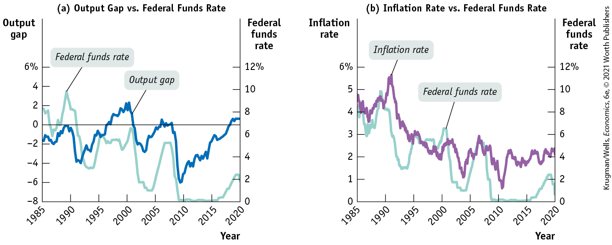
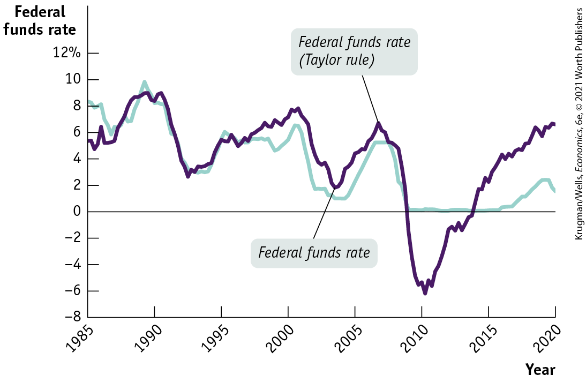
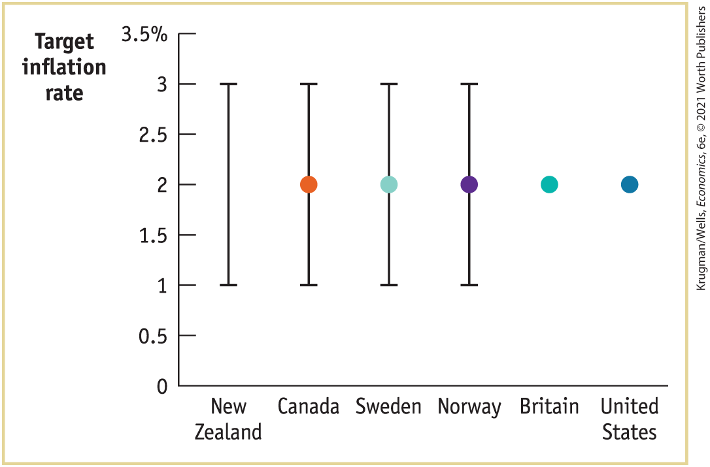
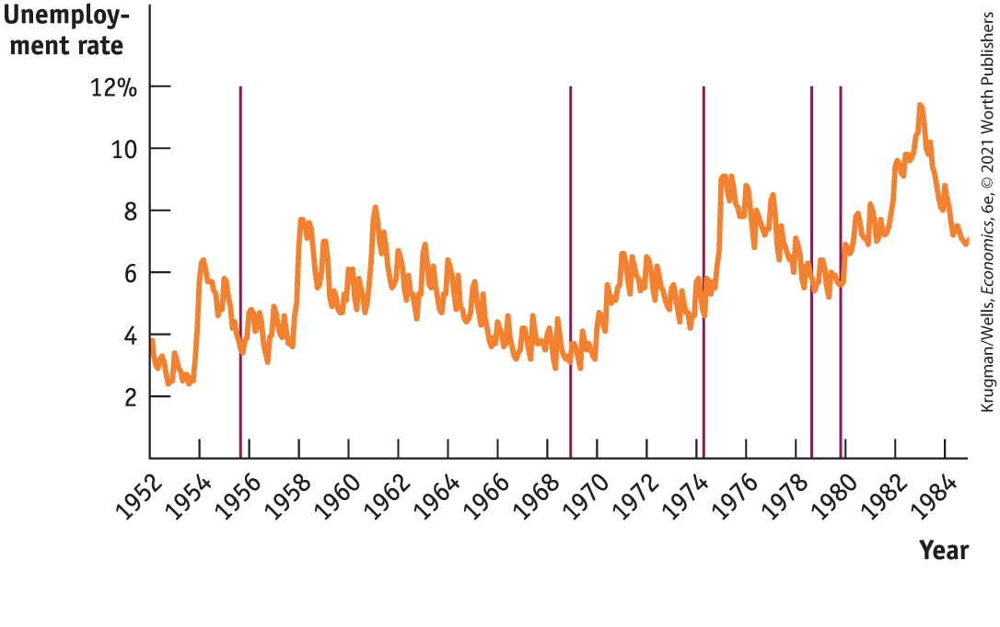
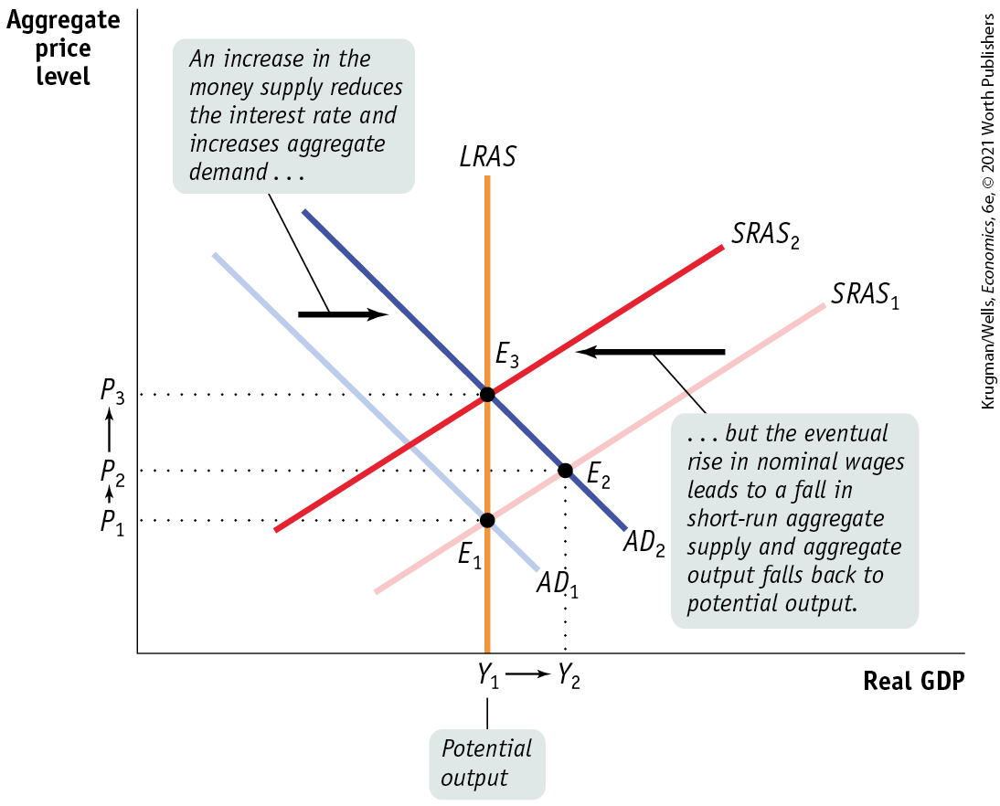

### Monetary Policy in Practice

How does the Fed decide whether to use expansionary or contractionary monetary policy? And how does it decide how much is enough? As we’ve learned, policy makers try to both fight recessions and ensure *price stability:* low (though usually not zero) inflation. Actual monetary policy reflects a combination of these goals.

In general, the Fed and other central banks tend to engage in expansionary monetary policy when actual real GDP is below potential output. Panel (a) of <a href="#kru_9781319245269_ch15_04.xhtml#pau_9781319320164_GbyFtdoq0v" id="kru_9781319245269_ch15_04.xhtml#pau_9781319320164_xGkZlFf5gd" class="crossref">Figure 15-8</a> shows the U.S. output gap, defined in <a href="#kru_9781319245269_ch12_01.xhtml#pau_9781319320164_EQQUECcZyk" id="kru_9781319245269_ch15_04.xhtml#pau_9781319320164_m9KqytKEoe" class="crossref">Chapter 12</a> as the percentage difference between actual real GDP and potential output, versus the federal funds rate since 1985. (Recall that the output gap is positive when actual real GDP exceeds potential output.) As you can see, the Fed tends to raise interest rates when the output gap is rising (when the economy is developing an inflationary gap) and cut rates when the output gap is falling. (The exception is the period from 2009 to 2016, and again in 2020, when the federal funds rate was stuck near zero, a phenomenon, called the *zero lower bound on interest rates.*)

<figure id="pau_9781319320164_GbyFtdoq0v" class="figure lm_img_lightbox num c4 center">

<figcaption>
FIGURE 15-8 Tracking Monetary Policy Using the Output Gap and Inflation

Panel (a) shows that the federal funds rate usually rises when the output gap is rising, and falls when the output gap is falling. Panel (b) illustrates that the federal funds rate tends to be high when inflation is high and low when inflation is low.

<em>Data from:</em> Federal Reserve Bank of St. Louis.
</figcaption>
</figure>

<aside class="hidden" id="pau_9781319320164_Ac2BRJZP7S" title="hidden">

Graph (a) Output Gap versus Federal Funds Rate: The left vertical axis, labeled Output gap ranges from negative 8 to 6 percent in increments of 2 percent. The right vertical axis, labeled Federal funds rate ranges from 0 to 12 percent in increments of 2 percent. The horizontal axis, labeled Year ranges 1985 to 2020 in increments of 5 years. The curve representing Output gap passes through the approximate points, (1985, negative 1.5), (1989, 0), (1990, negative 4), (1995, negative 0.5), (2000, 2), (2004, negative 3), (2007, 0), (2010, negative 6), and (2020, 1). The curve representing Federal Funds Rate passes through the approximate points, (1985, 9), (1987, 6), (1990, 10), (1995, 3), (2000, 7), (2004, 1), (2007, 5), (2010, 0), (2015, 0), and (2020, 2.5). Graph (b) Inflation rate versus Federal Funds Rate: The left vertical axis, labeled Inflation rate ranges from 0 to 6 percent in increments of 1 percent. The right vertical axis, labeled Federal funds rate ranges from 2 to 12 percent in increments of 2 percent. The horizontal axis, labeled Year ranges 1985 to 2020 in increments of 5 years. The curve representing Inflation rate passes through the approximate points, (1985, 4.75), (1987, 3.5), (1990, 4.5), (1991, 5.75), (1995, 3), (2000, 2), (2004, 1.25), (2007, 3), (2010, 0.5), (2015, 2), and (2020, 2.5). The curve representing Federal Funds Rate passes through the approximate points, (1985, 9), (1987, 6), (1990, 10), (1995, 3), (2000, 7), (2004, 1), (2010, 0), (2015, 0), and (2020, 1.5).

</aside>

The big exception was the late 1990s, when the Fed left rates steady for several years even as the economy developed a positive output gap (which went along with a low unemployment rate). One reason the Fed was willing to keep interest rates low in the late 1990s was that inflation was low.

Panel (b) of <a href="#kru_9781319245269_ch15_04.xhtml#pau_9781319320164_GbyFtdoq0v" id="kru_9781319245269_ch15_04.xhtml#pau_9781319320164_tD9ZmglG1y" class="crossref">Figure 15-8</a> compares the inflation rate, measured as the rate of change in consumer prices excluding food and energy, with the federal funds rate. You can see how low inflation during the mid-1990s, the early 2000s, and the late 2000s helped encourage loose monetary policy in the late 1990s, in 2002–2003, and again beginning in 2008.

### The Taylor Rule Method of Setting Monetary Policy

In 1993 Stanford economist John Taylor suggested that monetary policy should follow a simple rule that takes into account concerns about both the business cycle and inflation. He also suggested that actual monetary policy often looks as if the Federal Reserve was, in fact, more or less following the proposed rule. A <a href="#kru_9781319245269_EM_glossary.xhtml#pau_9781319320164_ZsLVPoX29q" id="kru_9781319245269_ch15_04.xhtml#pau_9781319320164_KI8yDY70fM" class="glossref" role="doc-glossref">Taylor rule for monetary policy</a> is a rule for setting interest rates that takes into account the inflation rate and the output gap or, in some cases, the unemployment rate.

<aside aria-label="title 3" class="glossary c3 main-flow v1" epub:type="glossary" id="pau_9781319320164_WXL4tnfEkb">

**Taylor rule for monetary policy**  
A **Taylor rule for monetary policy** is a rule that sets the federal funds rate according to the level of the inflation rate and either the output gap or the unemployment rate.

</aside>

A widely cited example of a Taylor rule is a relationship among Fed policy, inflation, and unemployment estimated by economists at the Federal Reserve Bank of San Francisco. These economists found that between 1988 and 2008 the Fed’s behavior was well summarized by the following Taylor rule:

$$\text{Federal}\,\text{funds}\,\text{rate} = 2.07 + 1.28 \times \text{inflation}\,\text{rate}\operatorname{~–~}1.95 \times \text{unemployment}\,\text{gap}$$

where the inflation rate was measured by the change over the previous year in consumer prices excluding food and energy, and the unemployment gap was the difference between the actual unemployment rate and Congressional Budget Office estimates of the natural rate of unemployment.

<a href="#kru_9781319245269_ch15_04.xhtml#pau_9781319320164_uICw7OdRq4" id="kru_9781319245269_ch15_04.xhtml#pau_9781319320164_bp2rVC1Zg8" class="crossref">Figure 15-9</a> compares the federal funds rate predicted by this rule with the actual federal funds rate from 1985 to 2020. As you can see, the Fed’s decisions were quite close to those predicted by this particular Taylor rule from 1985 through the end of 2008. We’ll talk about what happened after 2008 shortly.

<figure id="pau_9781319320164_uICw7OdRq4" class="figure lm_img_lightbox num c3 main-flow">

<figcaption>
FIGURE 15-9 The Taylor Rule and the Federal Funds Rate

The purple line shows the federal funds rate predicted by the San Francisco Fed’s version of the Taylor rule, which relates the interest rate to the inflation rate and the unemployment rate. The green line shows the actual federal funds rate. The actual rate tracked the predicted rate quite closely through the end of 2008. After that, however, the Taylor rule called for negative interest rates, which is a difficult and problematic goal to achieve.

<em>Data from:</em> Bureau of Labor Statistics; Congressional Budget Office; Federal Reserve Bank of St. Louis; Glenn D. Rudebusch, “The Fed’s Monetary Policy Response to the Current Crisis,” <em>FRBSF Economic Letter</em> #2009–17 (May 22, 2009).
</figcaption>
</figure>

<aside class="hidden" id="pau_9781319320164_k6ubZxeHGv" title="hidden">

The vertical axis, labeled Federal funds rate ranges from negative 8 to 12 percent in increments of 2 percent. The horizontal axis, labeled Year ranges from 1985 to 2020 in increments of 5 years. Federal funds rate curve passes through the approximate points, (1985, 8), (1990, 10), (1995, 4), (2001, 7), (2005, 1), (2007, 5), (2010, 0), (2015, 0), and (2020, 2). Federal funds rate (Taylor rule) curve passes through the approximate points, (1985, 5), (1990, 9), (1992, 3), (1995, 5), (2000, 7), (2003, 3), (2007, 6), (2010, negative 6), (2015, 2), and (2020, 6).

</aside>

### Inflation Targeting

Until January 2012, the Fed did not explicitly commit itself to achieving a particular inflation rate. However, in January 2012, the Fed announced that it would set its policy to maintain an approximately 2% inflation rate per year. With that statement, the Fed joined a number of other central banks that have explicit inflation targets. So, rather than using a Taylor rule to set monetary policy, they instead announce the inflation rate that they want to achieve — the *inflation target* — and set policy in an attempt to hit that target. This method of setting monetary policy, called <a href="#kru_9781319245269_EM_glossary.xhtml#pau_9781319320164_wHmR2ZOczD" id="kru_9781319245269_ch15_04.xhtml#pau_9781319320164_vdxSYV1kn2" class="glossref" role="doc-glossref">inflation targeting</a>, involves having the central bank announce the inflation rate it is trying to achieve and set policy in an attempt to hit that target. The central bank of New Zealand, which was the first country to adopt inflation targeting, specified a range for that target of 1% to 3%.

<aside aria-label="title 4" class="glossary c3 main-flow v1" epub:type="glossary" id="pau_9781319320164_tmPUHGtAkq">

**inflation targeting**  
**Inflation targeting** occurs when the central bank sets an explicit target for the inflation rate and sets monetary policy in order to hit that target.

</aside>

Other central banks commit themselves to achieving a specific number. For example, the Bank of England has committed to keeping inflation at 2%. In practice, there doesn’t seem to be much difference between these versions: central banks with a target range for inflation seem to aim for the middle of that range, and central banks with a fixed target tend to give themselves considerable wiggle room.

One major difference between inflation targeting and the Taylor rule method is that inflation targeting is forward-looking rather than backward-looking. That is, the Taylor rule method adjusts monetary policy in response to *past* inflation, but inflation targeting is based on a forecast of future inflation.

Advocates of inflation targeting argue that it has two key advantages over the Taylor rule: *transparency* and *accountability.* First, economic uncertainty is reduced because the central bank’s plan is transparent: the public knows the objective of an inflation-targeting central bank. Second, the central bank’s success can be judged by seeing how closely actual inflation rates have matched the inflation target, making central bankers accountable.

Critics of inflation targeting argue that it’s too restrictive because there are times when other concerns — like the stability of the financial system — should take priority over achieving any particular inflation rate. Indeed, starting in late 2013 the Taylor rule rate and the federal funds rate diverged significantly, as the Fed kept the interest rate close to zero while the Taylor rule rate climbed. The Fed’s actions were motivated by the fear that an interest rate rise could push the persistently weak economy back into turmoil and recession.

Many American macroeconomists have had positive things to say about inflation targeting — including Ben Bernanke (the Fed chair from 2006 through early 2014). And in January 2012 the Fed declared that what it means by the “price stability” it seeks is 2% inflation, although there was no explicit commitment about when this inflation rate would be achieved.

<aside class="case-study c3 main-flow v5" epub:type="case-study" id="pau_9781319320164_vgMpz1N9cc" title="GLOBAL COMPARISON INFLATION TARGETS">

#### \>\> Global comparison

INFLATION TARGETS

This figure shows the target inflation rates of six central banks that have adopted inflation targeting. The central bank of New Zealand introduced inflation targeting in 1990. Today it has an inflation target range of 1% to 3%. The central banks of Canada, Sweden, and Norway have the same target range but also specify 2% as the precise target. The Bank of England, Britain’s central bank, specifies an inflation target of 2%. Since 2012, the U.S. Federal Reserve also targets inflation at 2%.

In practice, these differences in detail don’t seem to lead to significantly different results. New Zealand aims for the middle of its range, at 2% inflation; Britain, Norway, and the United States allow considerable wiggle room around their target inflation rates.

<figure id="pau_9781319320164_at5SMxF81E" class="figure lm_img_lightbox unnum c5 center">

<figcaption>
<em>Data from:</em> IMF, Reserve Bank of New Zealand, Bank of Canada, Riksbank, Bank of England, Norges Bank, and Federal Reserve System.
</figcaption>
</figure>

<aside class="hidden" id="pau_9781319320164_liinGuVyvD" title="hidden">

The vertical axis, labeled Target inflation rate ranges from 0 to 3.5 percent in increments of 0.5 percent. The horizontal axis plots the following countries from left to right, New Zealand, Canada, Sweden, Norway, Britain, and United States. The range of the inflation target rate for New Zealand, Canada, Sweden, and Britain, is from 1 percent to 3 percent, represented by a vertical line. The precise targets, represented by a dot in the graph, are as follows, Canada, 2; Sweden, 2; Norway, 2; Britain, 2; and United States, 2.

</aside>
</aside>

### The Zero Lower Bound Problem

As <a href="#kru_9781319245269_ch15_04.xhtml#pau_9781319320164_uICw7OdRq4" id="kru_9781319245269_ch15_04.xhtml#pau_9781319320164_On6rCvqudk" class="crossref">Figure 15-9</a> shows, a Taylor rule based on inflation and the unemployment rate does a good job of predicting Federal Reserve policy from 1985 through 2008. After that, however, things go awry, and for a simple reason: with very high unemployment and low inflation, the same Taylor rule called for an interest rate significantly less than zero, which is a difficult and problematic goal to achieve.

Negative interest rates are a problem because people always have the alternative of holding cash, which offers a zero interest rate. Why, then, would they ever buy a bond yielding an interest rate less than zero?

Until 2014 most economists believed that it was basically impossible for interest rates to go below zero. That year, however, the central bank of Switzerland did the previously unthinkable, setting rates slightly below zero. It turns out that even at a slightly negative interest rate, there are limits to how much cash the public is willing to hold, because storing cash is expensive: you need vaults that are secure against loss, both from potential theft and from threats like money-eating mice. (Yes, rodent control turns out to play some role in monetary policy.) By 2016, the Swiss equivalent of the federal funds rate was $- 0.75\%$, and both the European Central Bank and the Bank of Japan also had slightly negative rates. (Japan’s situation, which economists refer to as being *up against the zero bound,* is addressed in <a href="#kru_9781319245269_ch16_01.xhtml#pau_9781319320164_Upw2yOhAsg" id="kru_9781319245269_ch15_04.xhtml#pau_9781319320164_oPb4EpDhsG" class="crossref">Chapter 16</a>.)

So, the zero lower bound isn’t an absolute limit. Still, no central bank has tried to push rates significantly below zero, say down to $- 3\%$ or $- 6\%$, which is what the Taylor rule suggested for the United States in 2009 and 2010. This is explained partly because rates that low would lead to the hoarding of cash. Also, negative interest rates are widely believed to cause big problems for the banking system, with adverse effects on the economy as a whole. This set of circumstances leads to what is called the <a href="#kru_9781319245269_EM_glossary.xhtml#pau_9781319320164_CPJG6bIONW" id="kru_9781319245269_ch15_04.xhtml#pau_9781319320164_JM8qBQFPv7" class="glossref" role="doc-glossref">zero lower bound for interest rates</a>: interest rates cannot fall much below zero without causing significant problems.

<aside aria-label="title 5" class="glossary c3 main-flow v1" epub:type="glossary" id="pau_9781319320164_FXNr1cdFlM">

**zero lower bound for interest rates**  
The **zero lower bound for interest rates** means that interest rates cannot fall much below zero without causing significant problems.

</aside>

As a result, the Fed has never been willing to push rates below zero. This in turn means that when inflation is low and the economy is operating far below potential, normal monetary policy — open-market purchases of short-term government debt to expand the money supply — runs out of room to operate because short-term interest rates are already at or near zero. Economists refer to this situation as *running up against the zero lower bound.*

In November 2010 the Fed began an attempt to circumvent the problem caused by its inability to reduce interest rates further despite economic weakness. This attempt went by the somewhat obscure name *quantitative easing.* Instead of purchasing only short-term government debt, it began buying longer-term government debt — five-year or six-year bonds, rather than three-month Treasury bills. And, as we know, long-term interest rates don’t exactly follow short-term rates. At the time the Fed began this program, short-term rates were near zero, but rates on longer-term bonds were between 2% and 3%. The Fed hoped that direct purchases of these longer-term bonds would drive down interest rates on long-term debt, exerting an expansionary effect on the economy.

Later the Fed expanded the program further, also purchasing mortgage-backed securities, which normally offer somewhat higher rates than U.S. government debt. Here, too, the hope was that these rates could be driven down, with an expansionary effect on the economy. As with ordinary open-market operations, quantitative easing was undertaken by the Federal Reserve Bank of New York.

Was this policy effective? The Federal Reserve believes that it helped the economy. However, the pace of recovery remained disappointingly slow. Starting in 2016, the Fed began to slowly raise rates by an amount less than a Taylor rule would have predicted, reflecting the sluggish pace of the recovery. And it reversed course in 2019, even before the coronavirus pandemic sent the economy reeling.

### ECONOMICS \>\> *in Action*

What the Fed Wants, the Fed Gets

What’s the evidence that the Fed can actually cause an economic contraction or expansion? You might think that finding such evidence is just a matter of looking at what happens to the economy when interest rates go up or down. But it turns out that there’s a big problem with that approach: the Fed usually changes interest rates in an attempt to tame the business cycle, raising rates if the economy is expanding and reducing rates if the economy is slumping. So in the actual data, it often looks as if low interest rates go along with a weak economy and high rates go along with a strong economy.

In a famous paper titled “Does Monetary Policy Matter?”, macroeconomists Christina Romer and David Romer solved this problem by focusing on episodes in which monetary policy wasn’t a reaction to the business cycle. Specifically, they used minutes from the Federal Open Market Committee and other sources to identify episodes “in which the Federal Reserve in effect decided to attempt to create a recession to reduce inflation.” As we’ll learn in <a href="#kru_9781319245269_ch16_01.xhtml#pau_9781319320164_Upw2yOhAsg" id="kru_9781319245269_ch15_04.xhtml#pau_9781319320164_FhsyltTr0G" class="crossref">Chapter 16</a>, rather than just using monetary policy as a tool of macroeconomic stabilization, sometimes it is used to eliminate *embedded inflation* — inflation that people believe will persist into the future. In such a case, the Fed needs to create a recessionary gap — not just eliminate an inflationary gap — to wring embedded inflation out of the economy.

<a href="#kru_9781319245269_ch15_04.xhtml#pau_9781319320164_W74wQLb6gy" id="kru_9781319245269_ch15_04.xhtml#pau_9781319320164_FqiF75W1vF" class="crossref">Figure 15-10</a> shows the unemployment rate between 1952 and 1984 and also identifies five dates on which, according to Romer and Romer, the Fed decided that it wanted a recession (the vertical lines). In four out of the five cases, the decision to contract the economy was followed, after a modest lag, by a rise in the unemployment rate. On average, Romer and Romer found the unemployment rate rises by 2 percentage points after the Fed decides that unemployment needs to go up.

<figure id="pau_9781319320164_W74wQLb6gy" class="figure lm_img_lightbox num c3 main-flow">

<figcaption>
FIGURE 15-10 When the Fed Wants a Recession

<em>Data from:</em> Bureau of Labor Statistics; Christina D. Romer and David H. Romer, “Monetary Policy Matters,” <em>Journal of Monetary Economics</em> 34 (August 1994): 75–88.
</figcaption>
</figure>

<aside class="hidden" id="pau_9781319320164_7rFQAV7QnT" title="hidden">

The vertical axis, labeled Unemployment rate ranges from 0 to 12 percent in increments of 2 percent. The horizontal axis, labeled Year ranges from 1952 to 1984 in increments of 2 years. The unemployment curve passes through the approximate points, (1952, 3.9), (1954, 6.5), (1958, 4), (1960, 5), (1962, 6), (1964, 5), (1968, 4.5), (1970, 4), (1972, 6), (1974, 5), (1975, 9), (1980, 6), (1983, 11), and (1984, 8). Five vertical lines are drawn at years, between 1955 and 1956, 1969, between 1974 and 1975, between 1978 and 1979, between 1979 and 1980.

</aside>

So yes, the Fed gets what it wants.

### *\>\> Quick Review*

- The Federal Reserve can use **expansionary monetary policy** to increase aggregate demand and **contractionary monetary policy** to reduce aggregate demand. The Federal Reserve and other central banks generally try to tame the business cycle while keeping the inflation rate low but positive.
- Under a **Taylor rule for monetary policy**, the target federal funds rate rises when there is high inflation and either a positive output gap or very low unemployment; it falls when there is low or negative inflation and either a negative output gap or high unemployment.
- In contrast, some central banks set monetary policy by **inflation targeting**, a forward-looking policy rule, rather than by using the Taylor rule, a backward-looking policy rule. Although inflation targeting has the benefits of transparency and accountability, some think it is too restrictive. Until 2008, the Fed followed a loosely defined Taylor rule. Starting in early 2012, it began inflation targeting with a target of 2% per year.
- There is a **zero lower bound for interest rates** — they cannot fall much below zero without causing significant problems — that limits the effectiveness of monetary policy.
- Because it is subject to fewer lags than fiscal policy, monetary policy is the main tool for macroeconomic stabilization.

### *\>\> Check Your Understanding* 15-3

1.  Suppose the economy is currently suffering from an output gap and the Federal Reserve uses an expansionary monetary policy to close that gap. Describe the short-run effect of this policy on the following.
    1.  The money supply curve
    2.  The equilibrium interest rate
    3.  Investment spending
    4.  Consumer spending
    5.  Aggregate output
2.  In setting monetary policy, which central bank — one that operates according to a Taylor rule or one that operates by inflation targeting — is likely to respond more directly to a financial crisis? Explain.

## Money, Output, and Prices in the Long Run

Through its expansionary and contractionary effects, monetary policy is generally the policy tool of choice to help stabilize the economy. However, not all actions by central banks are productive. In particular, central banks sometimes print money, not to fight a recessionary gap but to help the government pay its bills, an action that typically destabilizes the economy.

What happens when a change in the money supply pushes the economy away from, rather than toward, long-run equilibrium? As we’ve learned, the economy is self-correcting in the long run: a demand shock has only a temporary effect on aggregate output. If the demand shock is the result of a change in the money supply, we can make a stronger statement: in the long run, changes in the quantity of money affect the aggregate price level, but they do not change real aggregate output or the interest rate. To see why, let’s look at what happens if the central bank permanently increases the money supply.

### Short-Run and Long-Run Effects of an Increase in the Money Supply

To analyze the long-run effects of monetary policy, it’s helpful to think of the central bank as choosing a target for the money supply rather than the interest rate. In assessing the effects of an increase in the money supply, we return to the analysis of the long-run effects of an increase in aggregate demand, first introduced in <a href="#kru_9781319245269_ch12_01.xhtml#pau_9781319320164_EQQUECcZyk" id="kru_9781319245269_ch15_05.xhtml#pau_9781319320164_pl9uD4ubBr" class="crossref">Chapter 12</a>.

<a href="#kru_9781319245269_ch15_05.xhtml#pau_9781319320164_9LckQTuch5" id="kru_9781319245269_ch15_05.xhtml#pau_9781319320164_0h8MfKWbLP" class="crossref">Figure 15-11</a> shows the short-run and long-run effects of an increase in the money supply when the economy begins at potential output, $Y_{1}$. The initial short-run aggregate supply curve is $SRAS_{1}$, the long-run aggregate supply curve is *LRAS*, and the initial aggregate demand curve is $AD_{1}$. The economy’s initial equilibrium is at $E_{1}$, a point of both short-run and long-run macroeconomic equilibrium because it is on both the short-run and the long-run aggregate supply curves. Real GDP is at potential output, $Y_{1}$.

<figure id="pau_9781319320164_9LckQTuch5" class="figure lm_img_lightbox num c3 main-flow">

<figcaption>
FIGURE 15-11 The Short-Run and Long-Run Effects of an Increase in the Money Supply

When the economy is already at potential output, an increase in the money supply generates a positive short-run effect, but no long-run effect, on real GDP.

Here, the economy begins at <em>E</em>1, a point of short-run and long-run macroeconomic equilibrium. An increase in the money supply shifts the <em>AD</em> curve rightward, and the economy moves to a new short-run macroeconomic equilibrium at <em>E</em>2 and a new real GDP of <em>Y</em>2. But <em>E</em>2 is not a long-run equilibrium: <em>Y</em>2 exceeds potential output, <em>Y</em>1, leading to an increase in nominal wages over time. In the long run, the increase in nominal wages shifts the short-run aggregate supply curve leftward, to a new position at <em>S</em><em>R</em><em>A</em><em>S</em>2.

The economy reaches a new short-run and long-run macroeconomic equilibrium at <em>E</em>3 on the <em>LRAS</em> curve, and output falls back to potential output, <em>Y</em>1. When the economy is already at potential output, the only long-run effect of an increase in the money supply is an increase in the aggregate price level from <em>P</em>1 to <em>P</em>3.
</figcaption>
</figure>

<aside class="hidden" id="pau_9781319320164_wv6cLprCff" title="hidden">

The vertical axis, labeled Aggregate price level shows markings at P subscript 1, P subscript 2, and P subscript 3 from bottom to top. The horizontal axis, labeled Real G D P shows markings at Y subscript 1 and Y subscript 2 from left to right. A straight vertical line labeled L R A S starts from Y subscript 1. Two positive sloping straight lines parallel to each other are labeled S R A S subscript 2 and S R A S subscript 1, and two negative sloping straight lines parallel to each other are labeled A D subscript 1 and A D subscript 2. S R A S subscript 2 is on the left of S R A S subscript 1, and A D subscript 2 is on the right of A D subscript 1. L R A S, S R A S subscript 1, and A D subscript 1 intersect each other at point E subscript 1 (Y subscript 1, P subscript 1). L R A S, S R A S subscript 2, and A D subscript 2 intersect each other at point E subscript 3 (Y subscript 1, P subscript 3). S R A S subscript 1 intersects A D subscript 2 at point E subscript 2 (Y subscript 2, P subscript 2). A rightward arrow points from A D subscript 1 to A D subscript 2 and is labeled, “An increase in the money supply reduces the interest rate and increases aggregate demand ellipsis.” A leftward arrow points from S R A S subscript 1 to S R A S subscript 2 and is labeled, “ellipsis but the eventual rise in nominal wages leads to a fall in short-run aggregate supply and aggregate output falls back to potential output.” The marking, Y subscript 1, is labeled Potential output. An arrow points from Y subscript 1 to Y subscript 2. Another arrow points from P subscript 1 to P subscript 2 and from P subscript 2 to P subscript 3.

</aside>

Now suppose there is an increase in the money supply. Other things equal, an increase in the money supply reduces the interest rate, which increases investment spending, which leads to a further rise in consumer spending, and so on. So an increase in the money supply increases the quantity of goods and services demanded, shifting the *AD* curve rightward, to $AD_{2}$. In the short run, the economy moves to a new short-run macroeconomic equilibrium at $E_{2}$. The price level rises from $P_{1}$ to $P_{2}$, and real GDP rises from $Y_{1}$ to $Y_{2}$. That is, both the aggregate price level and aggregate output increase in the short run.

But the aggregate output level, $Y_{2}$, is above potential output. As a result, nominal wages will rise over time, causing the short-run aggregate supply curve to shift leftward. This process stops only when the *SRAS* curve ends up at $SRAS_{2}$ and the economy ends up at point $E_{3}$, a point of both short-run and long-run macroeconomic equilibrium. The long-run effect of an increase in the money supply, then, is that the aggregate price level has increased from $P_{1}$ to $P_{3}$, but aggregate output is back at potential output, $Y_{1}$. In the long run, a monetary expansion raises the aggregate price level but has no effect on real GDP.

We won’t describe the effects of a monetary contraction in detail, but the same logic applies. In the short run, a fall in the money supply leads to a fall in aggregate output as the economy moves down the short-run aggregate supply curve. In the long run, however, the monetary contraction reduces only the aggregate price level, and real GDP returns to potential output.

### Monetary Neutrality

How much does a change in the money supply change the aggregate price level in the long run? The answer is that a change in the money supply leads to an equal proportional change in the aggregate price level in the long run. For example, if the money supply falls 25%, the aggregate price level falls 25% in the long run; if the money supply rises 50%, the aggregate price level rises 50% in the long run.

How do we know this? Consider the following thought experiment: suppose all prices in the economy — prices of final goods and services and also factor prices, such as nominal wage rates — double. And suppose the money supply doubles at the same time. What difference does this make to the economy in real terms? The answer is none. All real variables in the economy — such as real GDP and the real value of the money supply (the amount of goods and services it can buy) — are unchanged. So there is no reason for anyone to behave any differently.

We can state this argument in reverse: if the economy starts out in long-run macroeconomic equilibrium and the money supply changes, restoring long-run macroeconomic equilibrium requires restoring all real values to their original values. This includes restoring the real value of the money supply to its original level. So if the money supply falls 25%, the aggregate price level must fall 25%; if the money supply rises 50%, the aggregate price level must rise 50%; and so on.

This analysis demonstrates the concept known as <a href="#kru_9781319245269_EM_glossary.xhtml#pau_9781319320164_DuV6HHwULX" id="kru_9781319245269_ch15_05.xhtml#pau_9781319320164_d8WcS58WxC" class="glossref" role="doc-glossref">monetary neutrality</a>, in which changes in the money supply have no real effects on the economy. In the long run, the only effect of an increase in the money supply is to raise the aggregate price level by an equal percentage. Economists argue that *money is neutral in the long run.*

<aside aria-label="title 1" class="glossary c3 main-flow v1" epub:type="glossary" id="pau_9781319320164_BbMU5sih7M">

**monetary neutrality**  
According to the concept of **monetary neutrality**, changes in the money supply have no real effects on the economy.

</aside>

This is, however, a good time to recall the dictum of John Maynard Keynes: “In the long run we are all dead.” In the long run, changes in the money supply don’t have any effect on real GDP, interest rates, or anything else except the price level. But it would be foolish to conclude from this statement that the Fed is irrelevant. Monetary policy does have powerful real effects on the economy in the short run, often making the difference between recession and expansion. And that matters a lot for society’s welfare.
