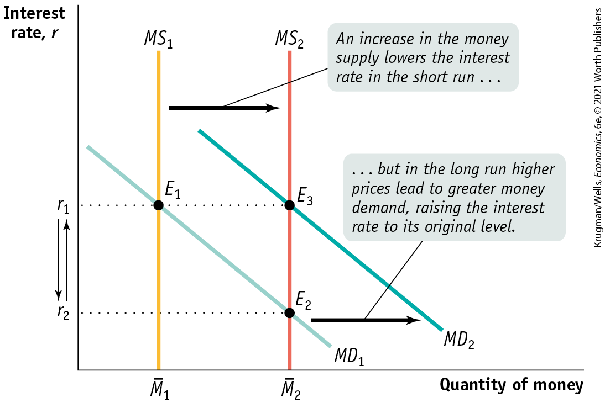
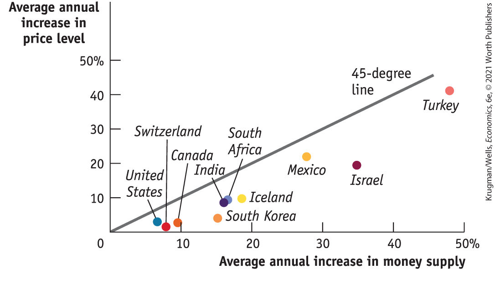
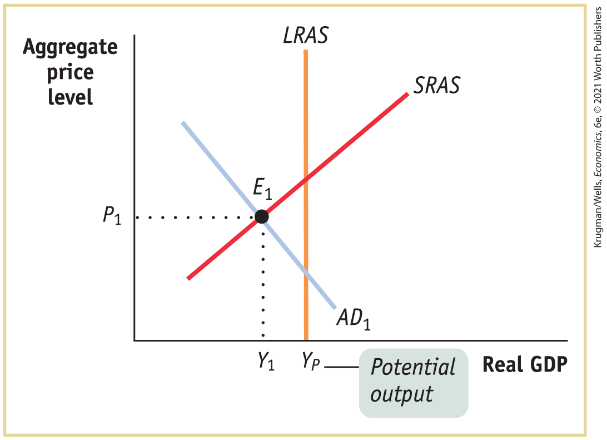
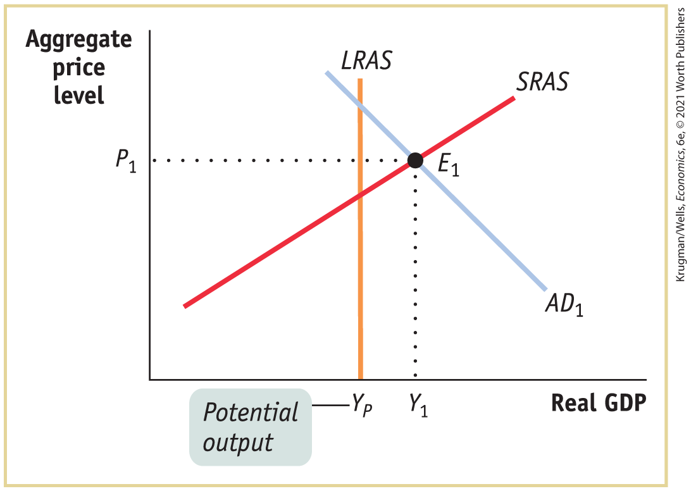
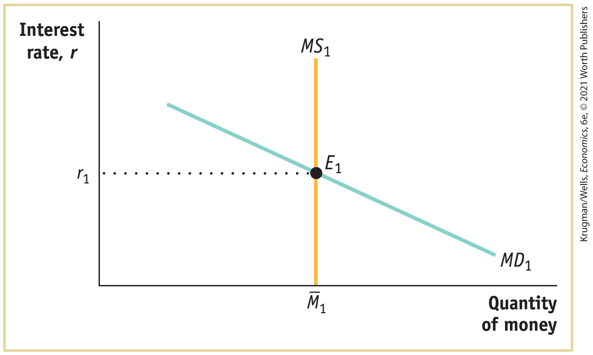
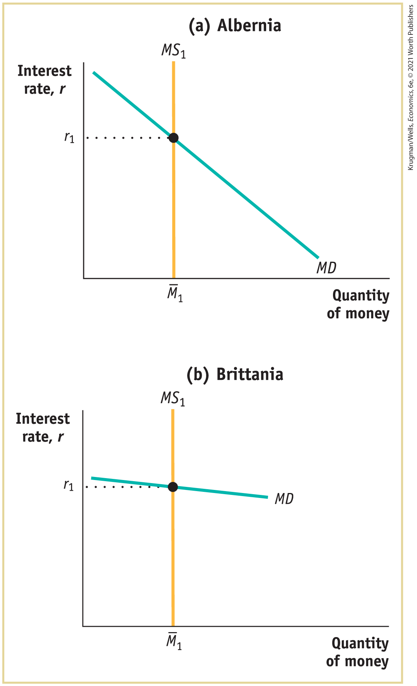

### Changes in the Money Supply and the Interest Rate in the Long Run

In the short run, an increase in the money supply leads to a fall in the interest rate, and a decrease in the money supply leads to a rise in the interest rate. In the long run, however, changes in the money supply don’t affect the interest rate.

<a href="#kru_9781319245269_ch15_05.xhtml#pau_9781319320164_ch3vPBtPKx" id="kru_9781319245269_ch15_05.xhtml#pau_9781319320164_k6Sb2WdNg3" class="crossref">Figure 15-12</a> shows why. It shows the money supply curve and the money demand curve before and after the Fed increases the money supply. We assume that the economy is initially at $E_{1}$, in long-run macroeconomic equilibrium at potential output, and with money supply ${\overline{M}}_{1}$. The initial equilibrium interest rate, determined by the intersection of the money demand curve $MD_{1}$ and the money supply curve $MS_{1}$, is $r_{1}$.

<figure id="pau_9781319320164_ch3vPBtPKx" class="figure lm_img_lightbox num c3 main-flow">

<figcaption>
FIGURE 15-12 The Long-Run Determination of the Interest Rate

The economy is initially at <em>E</em>1, a long-run macroeconomic equilibrium. In the short run, an increase in the money supply, from ${\overline{M}}_{1}$ to ${\overline{M}}_{2}$ pushes the interest rate down from <em>r</em>1 to <em>r</em>2. The economy moves to <em>E</em>2, a short-run equilibrium. In the long run, however, the aggregate price level rises in proportion to the increase in the money supply, leading to an increase in money demand at any given interest rate in proportion to the increase in the aggregate price level, as shown by the shift from <em>M</em><em>D</em>1 to <em>M</em><em>D</em>2. The result is that the quantity of money demanded at any given interest rate rises by the same amount as the quantity of money supplied. The economy moves to long-run equilibrium at <em>E</em>3 and the interest rate returns to <em>r</em>1.
</figcaption>
</figure>

<aside class="hidden" id="pau_9781319320164_3q7R3JQGAy" title="hidden">

The vertical axis, labeled Interest rate r, shows markings at r subscript 2 and r subscript 1 from bottom to top. The horizontal axis, labeled Quantity of money, shows markings at M bar subscript 1 and M bar subscript 2, from left to right. Two vertical lines parallel to the vertical axis are labeled M S subscript 1 and M S subscript 2, which start from M bar subscript 1 and M bar subscript 2, respectively. M S subscript 2 is on the right of M S subscript 1. Two negative sloping lines parallel to each other are labeled M D subscript 1 and M D subscript 2. M D subscript 2 is on the right of M D subscript 1. M D subscript 1 intersects M S subscript 1 at E subscript 1 (M bar subscript 1, r subscript 1), and it intersects M S subscript 2 at E subscript 2 (M bar subscript 2, r subscript 2). M D subscript 2 intersects M S subscript 2 at E subscript 3 (M bar subscript 2, r subscript 1). A rightward arrow pointing from M D subscript 1 to M D subscript 2 is labeled, “ellipsis but in the long run higher prices lead to greater money demand, raising the interest rate to its original level.” A rightward arrow pointing from M S subscript 1 to M S subscript 2 is labeled, “An increase in the money supply lowers the interest rate in the short run ellipsis.” An arrow points from r subscript 1 to r subscript 2, and another arrow points from r subscript 2 to r subscript 1.

</aside>

Now suppose the money supply increases from ${\overline{M}}_{1}$ to ${\overline{M}}_{2}$. In the short run, the economy moves from $E_{1}$ to $E_{2}$ and the interest rate falls from $r_{1}$ to $r_{2}$. Over time, however, the aggregate price level rises, and this raises money demand, shifting the money demand curve rightward from $MD_{1}$ to $MD_{2}$. The economy moves to a new long-run equilibrium at $E_{3}$, and the interest rate rises to its original level at $r_{1}$.

And it turns out that the long-run equilibrium interest rate is the original interest rate, $r_{1}$. We know this for two reasons. First, due to monetary neutrality, in the long run the aggregate price level rises by the same proportion as the money supply; so if the money supply rises by, say, 50%, the aggregate price level will also rise by 50%. Second, the demand for money is, other things equal, proportional to the aggregate price level.

So a 50% increase in the money supply raises the aggregate price level by 50%, which increases the quantity of money demanded at any given interest rate by 50%. As a result, the quantity of money demanded at the initial interest rate, $r_{1}$, rises exactly as much as the money supply — so that $r_{1}$ is still the equilibrium interest rate. In the long run, then, changes in the money supply do not affect the interest rate.

### ECONOMICS \>\> *in Action*

International Evidence of Monetary Neutrality

These days monetary policy is quite similar among developed countries. Each major nation (or, in the case of the euro, the euro area) has a central bank that is insulated from political pressure. All of these central banks try to keep the aggregate price level roughly stable, which usually means inflation of at most 2% to 3% per year.

But if we look at a longer period and a wider group of countries, we see large differences in the growth of the money supply. Between 1970 and the present, the money supply rose only a few percent per year in some countries, such as Switzerland and the United States, but rose much more rapidly in some poorer countries, such as South Africa and Mexico. These differences allow us to see whether it is really true that increases in the money supply lead, in the long run, to equal percent rises in the aggregate price level.

<a href="#kru_9781319245269_ch15_05.xhtml#pau_9781319320164_PVjWpHURzi" id="kru_9781319245269_ch15_05.xhtml#pau_9781319320164_i0cFmgBfmk" class="crossref">Figure 15-13</a> shows the annual percentage increases in the money supply and average annual increases in the aggregate price level — that is, the average rate of inflation — for a sample of countries during the period 1983–2018, with each point representing a country. If the relationship between increases in the money supply and changes in the aggregate price level were exact, the points would lie precisely on a 45-degree line.

<figure id="pau_9781319320164_PVjWpHURzi" class="figure lm_img_lightbox num c3 main-flow">

<figcaption>
FIGURE 15-13 The Long-Run Relationship Between Money and Inflation
</figcaption>
</figure>

<aside class="hidden" id="pau_9781319320164_eCI09XwIv7" title="hidden">

The vertical axis, labeled Average annual increase in price level ranges from 0 to 50 percent in increments of 10 percent. The horizontal axis, labeled Average annual increase in money supply ranges from 0 to 50 percent in increments of 10 percent. A positive sloping 45-degree straight line starts at the origin (0, 0) and extends up to (48, 48). The approximate points from the graph are as follows, United States (8, 3); Switzerland (9, 1); Canada (10, 3); South Korea (15, 5); India (16, 8); South Africa (16, 10); Iceland (19, 10); Mexico (28, 22); Israel (35, 20); and Turkey (49, 40).

</aside>

In fact, the relationship isn’t exact, because other factors besides money affect the aggregate price level. But the scatter of points clearly lies close to a 45-degree line, showing a more or less proportional relationship between money and the aggregate price level. That is, the data support the concept of monetary neutrality in the long run.

### *\>\> Quick Review*

- According to the concept of **monetary neutrality**, changes in the money supply do not affect real GDP, they only affect the aggregate price level. Economists believe that money is neutral in the long run.
- In the long run, the equilibrium interest rate in the economy is unaffected by changes in the money supply.

### *\>\> Check Your Understanding* 15-4

1.  Assume the central bank increases the quantity of money by 25%, even though the economy is initially in both short-run and long-run macroeconomic equilibrium. Describe the effects, in the short run and in the long run (giving numbers where possible), on the following.
    1.  Aggregate output
    2.  Aggregate price level
    3.  Interest rate
2.  Why does monetary policy affect the economy in the short run but not in the long run?

## Business Case 

Parking Your Money at PayPal

<figure id="pau_9781319320164_Oo8FaZOGPY" class="figure lm_img_lightbox unnum c2 right">

</figure>

Officially, PayPal, the electronic funds-transfer firm — which is also the owner of the popular mobile-phone payment service Venmo — isn’t considered a bank. Instead, regulators consider it a *money transmitter,* an entity that sends your money someplace rather than holding it and keeping it safe.

However, as users accumulate substantial sums in their PayPal accounts, that distinction has started to look questionable. Venmo users, in particular, often seem willing to let incoming payments sit in their accounts until the funds are spent, the way people once kept cash in their wallets. As a result, PayPal’s accounts were estimated to total more than \$22.5 billion in 2019. If those billions were considered bank deposits, PayPal would be considered among the 70 largest banks in the United States.

At first glance, leaving significant sums in PayPal accounts seems counterintuitive for two reasons. First, these accounts aren’t protected by federal deposit insurance. Second, they pay no interest. But upon closer examination, this behavior makes good economic sense. People will typically hold only a tiny fraction of their wealth in their PayPal account, thereby making the lack of federal deposit insurance an acceptable risk. And interest rates on bank accounts are so low at the time of this writing (around 0.06% in July 2020) that losing that interest is a reasonable price to pay to avoid the hassle of moving funds back and forth between a bank account and a PayPal or Venmo account.

The result is that many people are behaving like one user quoted by the *Wall Street Journal,* who now waits a while before transferring funds out of her Venmo account to her regular bank account: “I’m starting to intentionally keep my money in there a little bit longer.”

But will PayPal/Venmo or something like it begin to make major inroads into traditional banking? Some analysts think so. Others suggest, however, that payment systems like Zelle, developed by conventional banks, and eventually rising interest rates will lure customers back to conventional bank deposits. Time will tell.

<aside class="assessments c3 main-flow v1" epub:type="assessments" id="pau_9781319320164_EY43YGunAM">

### Questions for thought

1.  PayPal accounts aren’t counted as part of the money supply. Should they be? Why or why not?
2.  In 2010, only around 25% of mobile phones in the United States were smartphones. By 2020, almost everyone had a smartphone. How does this situation play into the PayPal story, and how does it fit into the broader pattern of monetary history?
3.  How might future actions by the Federal Open Market Committee affect the future of PayPal and similar services?

</aside>

### Summary

1.  The **money demand curve** arises from a trade-off between the opportunity cost of holding money and the liquidity that money provides. Americans hold substantial sums in cash and in zero-interest bank accounts linked to debit cards or money transmitters like PayPal and Venmo. By doing so they forgo the interest that could have been earned by putting those funds into an interest-bearing asset like a **certificate of deposit (CD).** The opportunity cost of holding money depends on **short-term interest rates**, not **long-term interest rates.** Changes in the aggregate price level, real GDP, technology, and institutions shift the money demand curve.
2.  According to the **liquidity preference model of the interest rate**, the interest rate is determined in the money market by the money demand curve and the **money supply curve.** The Federal Reserve can change the interest rate in the short run by shifting the money supply curve. In practice, the Fed uses open-market operations to achieve a **target federal funds rate**, which other short-term interest rates generally track. Although long-term interest rates don’t necessarily move with short-term interest rates, they reflect expectations about what’s going to happen to short-term rates in the future.
3.  **Expansionary monetary policy** reduces the interest rate by increasing the money supply. This increases investment spending and consumer spending, which in turn increases aggregate demand and real GDP in the short run. **Contractionary monetary policy** raises the interest rate by reducing the money supply. This reduces investment spending and consumer spending, which in turn reduces aggregate demand and real GDP in the short run.
4.  The Federal Reserve and other central banks try to stabilize the economy, limiting fluctuations of actual output around potential output, while also keeping inflation low but positive. Under a **Taylor rule for monetary policy**, the target federal funds rate rises when there is high inflation and either a positive output gap or very low unemployment; it falls when there is low or negative inflation and either a negative output gap or high unemployment. Some central banks, including the Fed, engage in **inflation targeting**, which is a forward-looking policy rule, whereas the Taylor rule method is a backward-looking policy rule. Because monetary policy is subject to fewer implementation lags than fiscal policy, it is the preferred policy tool for stabilizing the economy. However, because interest rates cannot fall much below zero without causing significant problems, there is a **zero lower bound for interest rates.** As a result, the effectiveness of monetary policy is limited.
5.  In the long run, changes in the money supply affect the aggregate price level but not real GDP or the interest rate. Data show that the concept of **monetary neutrality** holds: changes in the money supply have no real effect on the economy in the long run.

### Key Terms

- <a href="#kru_9781319245269_ch15_02.xhtml#pau_9781319320164_lh3UeMe4BZ" id="kru_9781319245269_ch15_07.xhtml#pau_9781319320164_IFty9DFsZR" class="crossref">Certificate of deposit (CD)</a>
- <a href="#kru_9781319245269_ch15_02.xhtml#pau_9781319320164_0cS9gNdofb" id="kru_9781319245269_ch15_07.xhtml#pau_9781319320164_gREDPNSbKA" class="crossref">Short-term interest rates</a>
- <a href="#kru_9781319245269_ch15_02.xhtml#pau_9781319320164_FgX3qA6yl7" id="kru_9781319245269_ch15_07.xhtml#pau_9781319320164_XKDLbU1yD3" class="crossref">Long-term interest rates</a>
- <a href="#kru_9781319245269_ch15_02.xhtml#pau_9781319320164_G71MUwHQSl" id="kru_9781319245269_ch15_07.xhtml#pau_9781319320164_k4hYbDMCfF" class="crossref">Money demand curve</a>
- <a href="#kru_9781319245269_ch15_03.xhtml#pau_9781319320164_007dcQS4kn" id="kru_9781319245269_ch15_07.xhtml#pau_9781319320164_lT7hx4asnc" class="crossref">Liquidity preference model of the interest rate</a>
- <a href="#kru_9781319245269_ch15_03.xhtml#pau_9781319320164_QFbYymc66y" id="kru_9781319245269_ch15_07.xhtml#pau_9781319320164_IZSyLfRHhC" class="crossref">Money supply curve</a>
- <a href="#kru_9781319245269_ch15_03.xhtml#pau_9781319320164_RnwzNrOBUJ" id="kru_9781319245269_ch15_07.xhtml#pau_9781319320164_2UOD4nxOnU" class="crossref">Target federal funds rate</a>
- <a href="#kru_9781319245269_ch15_04.xhtml#pau_9781319320164_MEsAG0iK1p" id="kru_9781319245269_ch15_07.xhtml#pau_9781319320164_M3LlA2FaEe" class="crossref">Expansionary monetary policy</a>
- <a href="#kru_9781319245269_ch15_04.xhtml#pau_9781319320164_DcEShFEcSE" id="kru_9781319245269_ch15_07.xhtml#pau_9781319320164_hDTWyDp4CO" class="crossref">Contractionary monetary policy</a>
- <a href="#kru_9781319245269_ch15_04.xhtml#pau_9781319320164_aUH5vEXBd4" id="kru_9781319245269_ch15_07.xhtml#pau_9781319320164_hXJJXbUqoy" class="crossref">Taylor rule for monetary policy</a>
- <a href="#kru_9781319245269_ch15_04.xhtml#pau_9781319320164_nWq5ZeSpKq" id="kru_9781319245269_ch15_07.xhtml#pau_9781319320164_cb8qO8xE7G" class="crossref">Inflation targeting</a>
- <a href="#kru_9781319245269_ch15_04.xhtml#pau_9781319320164_zRHaKVWWhT" id="kru_9781319245269_ch15_07.xhtml#pau_9781319320164_izgECfRVal" class="crossref">Zero lower bound for interest rates</a>
- <a href="#kru_9781319245269_ch15_05.xhtml#pau_9781319320164_sHYR6li5J2" id="kru_9781319245269_ch15_07.xhtml#pau_9781319320164_dQShT47e2P" class="crossref">Monetary neutrality</a>

### Practice questions

1.  The rise of electronic payment systems has encouraged more peer-to-peer lending programs. These programs connect lenders and borrowers outside the traditional banking system. As the Federal Reserve relies on changes to the money supply through open-market operations and ultimately bank lending, how will a rise of peer-to-peer lending networks affect the Federal Reserve’s ability to conduct effective monetary policy?
2.  John Maynard Keynes said, “In the long run we are all dead.” How is this quote consistent with the concept of money neutrality? How is it inconsistent?
3.  According to the European Central Bank website, the treaty establishing the European Community “makes clear that ensuring price stability is the most important contribution that monetary policy can make to achieve a favourable economic environment and a high level of employment.” If price stability is the only goal of monetary policy, explain how monetary policy would be conducted during recessions. Analyze both the case of a recession that is the result of a demand shock and the case of a recession that is the result of a supply shock.

### Problems

1.   Access the Discovering Data exercise for <!--<a class="crossref" href="kru_9781319245269_ch15_01.xhtml#ch15_sec_1" id="unid_29">-->Chapter 15<!--</a>--> Problem 1 online to answer the following questions.
    1.  What is the target federal funds rate?
    2.  Is the target federal funds rate different from the target federal funds rate in the previous FOMC statement? If yes, by how much does it differ?
    3.  Does the statement comment on current macroeconomic conditions in the United States? How does it describe the U.S. economy?
2.  How will the following events affect the demand for money? In each case, specify whether there is a shift of the demand curve or a movement along the demand curve and its direction.
    1.  There is a fall in the interest rate from 12% to 10%.
    2.  Thanksgiving arrives and, with it, the beginning of the holiday shopping season.
    3.  Increasingly, merchants are adopting electronic payment systems that allow more consumers to use PayPal and Apple Pay to make purchases.
    4.  The Fed engages in an open-market purchase of U.S. Treasury bills.

<!-- -->

3.  

    1.  Go to <a href="http://www.treasurydirect.gov" id="kru_9781319245269_ch15_07.xhtml#pau_9781319320164_DQQYPYGYCs" class="external">www.treasurydirect.gov</a>. Under “Individuals,” go to “Treasury Securities & Programs.” Click on “Treasury bills.” Under “at a glance,” click on “rates in recent auctions.” What is the investment rate for the most recently issued 52-week T-bills?
    2.  Go to the website of your favorite bank. What is the interest rate for one-year CDs?
    3.  Why are the rates for one-year CDs higher than for 52-week Treasury bills?

4.  Go to <a href="http://www.treasurydirect.gov" id="kru_9781319245269_ch15_07.xhtml#pau_9781319320164_VL0pteR3L6" class="external">www.treasurydirect.gov</a>. Under “Individuals,” go to “Treasury Securities & Programs.” Click on “Treasury notes.” Under “at a glance,” click on “rates in recent auctions.” Use the list of Recent Note, Bond, and TIPS Auction Results to answer the following questions.
    1.  What are the interest rates on 2-year and 10-year notes?
    2.  How do the interest rates on the 2-year and 10-year notes relate to each other? Why is the interest rate on the 10-year note higher (or lower) than the interest rate on the 2-year note?

5.  An economy is facing the recessionary gap shown in the accompanying diagram. To eliminate the gap, should the central bank use expansionary or contractionary monetary policy? How will the interest rate, investment spending, consumer spending, real GDP, and the aggregate price level change as monetary policy closes the recessionary gap?

    <figure id="pau_9781319320164_KlPM24GFH1" class="figure lm_img_lightbox unnum c5 center">
    
    </figure>

    <aside class="hidden" id="pau_9781319320164_uiEWCqnRyI" title="hidden">

    The vertical axis, labeled Aggregate price level shows a marking at P subscript 1, and the horizontal axis, labeled Real G D P shows markings at Y subscript 1 and Y subscript P, from left to right. A straight vertical line, labeled L R A S, starts from Y subscript P. A negative sloping straight line labeled A D subscript 1 and a positive sloping straight line labeled S R A S intersect each other at E subscript 1 (Y subscript 1, P subscript 1). The marking, Y subscript P, is labeled Potential output.

    </aside>

6.  An economy is facing the inflationary gap shown in the accompanying diagram. To eliminate the gap, should the central bank use expansionary or contractionary monetary policy? How will the interest rate, investment spending, consumer spending, real GDP, and the aggregate price level change as monetary policy closes the inflationary gap?

    <figure id="pau_9781319320164_jC3zz2hsJc" class="figure lm_img_lightbox unnum c5 center">
    
    </figure>

    <aside class="hidden" id="pau_9781319320164_tNNtIezW6K" title="hidden">

    The vertical axis, labeled Aggregate price level shows a marking at P subscript 1, and the horizontal axis, labeled Real G D P shows markings at Y subscript P and Y subscript 1 from left to right. A straight vertical line, labeled L R A S, starts from Y subscript P. A negative sloping straight line labeled A D subscript 1 and a positive sloping straight line labeled S R A S intersect each other at E subscript 1 (Y subscript 1, P subscript 1). The marking, Y subscript P, is labeled Potential output.

    </aside>

7.  In the economy of Eastlandia, the money market is initially in equilibrium when the economy begins to slide into a recession.
    1.  Using the accompanying diagram, explain what will happen to the interest rate if the central bank of Eastlandia keeps the money supply constant at ${\overline{M}}_{1}$.

        <figure id="pau_9781319320164_4OW8PCr1Ft" class="figure lm_img_lightbox unnum c5 center">
        
        </figure>

        <aside class="hidden" id="pau_9781319320164_ddKycb3VHn" title="hidden">

        The vertical axis, labeled Interest rate r, shows a marking at r subscript 1. The horizontal axis, labeled Quantity of money shows a marking at M bar subscript 1. A straight vertical line, labeled M S subscript 1, starts from M bar subscript 1. A downward sloping straight line labeled M D subscript 1 intersects M S subscript 1 at E subscript 1 (M bar subscript 1, r subscript 1).

        </aside>

    2.  If the central bank is instead committed to maintaining an interest rate target of $r_{1}$, then as the economy slides into a recession, how should the central bank react? Using your diagram from part a, demonstrate the central bank’s reaction.

8.  Suppose that the money market in Westlandia is initially in equilibrium and the central bank decides to decrease the money supply.
    1.  Using a diagram like the one in Problem 7, explain what will happen to the interest rate in the short run.
    2.  What will happen to the interest rate in the long run?

9.  An economy is in long-run macroeconomic equilibrium with an unemployment rate of 5% when the government passes a law requiring the central bank to use monetary policy to lower the unemployment rate to 3% and keep it there. How could the central bank achieve this goal in the short run? What would happen in the long run? Illustrate with a diagram.

10. The effectiveness of monetary policy depends on how easy it is for changes in the money supply to change interest rates. By changing interest rates, monetary policy affects investment spending and the aggregate demand curve. The economies of Albernia and Brittania have very different money demand curves, as shown in the accompanying diagram. In which economy will changes in the money supply be a more effective policy tool? Why?

    <figure id="pau_9781319320164_SicwHSKaup" class="figure lm_img_lightbox unnum c5 center">
    
    </figure>

    <aside class="hidden" id="pau_9781319320164_owq9SaBI9h" title="hidden">

    Graph (a) Albernia: The vertical axis, labeled Interest rate r, shows a marking at r subscript 1. The horizontal axis, labeled Quantity of money shows a marking at M bar subscript 1. A straight vertical line, labeled M S subscript 1, starts from M bar subscript 1. A downward sloping steeper line labeled M D intersects M S subscript 1 at (M bar subscript 1, r subscript 1). Graph (b) Brittania: The vertical axis, labeled Interest rate, r shows a marking at r subscript 1. The horizontal axis, labeled Quantity of money shows a marking at M bar subscript 1. A straight vertical line, labeled M S subscript 1, starts from M bar subscript 1. A downward sloping flatter line labeled M D intersects M S subscript 1 at (M bar subscript 1, r subscript 1).

    </aside>

11. During the Great Depression, businesspeople in the United States were very pessimistic about the future of economic growth and reluctant to increase investment spending even when interest rates fell. How did this limit the potential for monetary policy to help alleviate the Depression?

12.  Access the Discovering Data exercise for <!--<a class="crossref" href="kru_9781319245269_ch15_01.xhtml#ch15_sec_1" id="unid_31">-->Chapter 15<!--</a>--> Problem 12 online to answer the following questions.
    1.  How does the relationship between the effective federal funds rate and the Taylor rule change throughout the Great Recession?
    2.  Compare the long-term and short-term interest rate before and after the Great Recession.

 **Work It Out**

13. Because of the economic slowdown associated with the 2007–2009 recession, the Federal Open Market Committee of the Federal Reserve, between September 18, 2007, and December 16, 2008, lowered the federal funds rate in a series of steps from a high of 5.25% to a rate between zero and 0.25%. The idea was to provide a boost to the economy by increasing aggregate demand.
    1.  Use the liquidity preference model to explain how the Federal Open Market Committee lowers the interest rate in the short run. Draw a typical graph that illustrates the mechanism. Label the vertical axis “Interest rate” and the horizontal axis “Quantity of money.” Your graph should show two interest rates, $r_{1}$ and $r_{2}$.
    2.  Explain why the reduction in the interest rate causes aggregate demand to increase in the short run.
    3.  Suppose that in 2022 the economy is at potential output but that this is somehow overlooked by the Fed, which continues its monetary expansion. Demonstrate the effect of the policy measure on the *AD* curve. Use the *LRAS* curve to show that the effect of this policy measure on the *AD* curve, other things equal, causes the aggregate price level to rise in the long run. Label the vertical axis “Aggregate price level” and the horizontal axis “Real GDP.” 

## Chapter 15 Appendix Reconciling the Two Models of the Interest Rate

In the liquidity preference model of the interest rate developed in <a href="#kru_9781319245269_ch15_01.xhtml#pau_9781319320164_4oAIkgdXHI" id="kru_9781319245269_ch15_app.xhtml#pau_9781319320164_58PBLCROOb" class="crossref">Chapter 15</a>, at the equilibrium interest rate the quantity of money demanded equals the quantity of money supplied. Yet, in the loanable funds model of the interest rate developed in <a href="#kru_9781319245269_ch10_01.xhtml#pau_9781319320164_GbPAtnS6LO" id="kru_9781319245269_ch15_app.xhtml#pau_9781319320164_O8fPfBC2y5" class="crossref">Chapter 10</a>, the equilibrium interest rate matches the quantity of loanable funds supplied by savers with the quantity of loanable funds demanded for investment spending. Can these two models of the interest rate be reconciled? Yes, they can. We will do this in two steps, focusing first on the short run and then on the long run.
