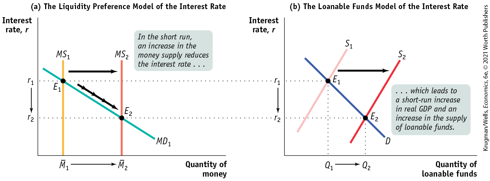
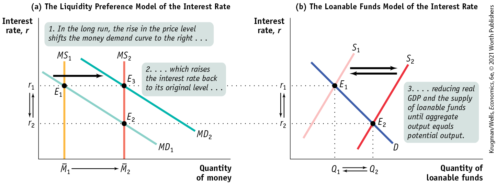

### The Interest Rate in the Short Run

As explained in the chapter, a fall in the interest rate leads to a rise in investment spending, *I,* which then leads to a rise in both real GDP and consumer spending, *C.* The rise in real GDP doesn’t lead only to a rise in consumer spending, however. It also leads to a rise in savings: at each stage of the multiplier process, part of the increase in disposable income is saved. How much do savings rise?

In <a href="#kru_9781319245269_ch10_01.xhtml#pau_9781319320164_GbPAtnS6LO" id="kru_9781319245269_ch15_app.xhtml#pau_9781319320164_RWt4JApMQZ" class="crossref">Chapter 10</a> we introduced the *savings–investment spending identity:* total savings in the economy is always equal to investment spending. *This tells us that when a fall in the interest rate leads to higher investment spending, the resulting increase in real GDP generates exactly enough additional savings to match the rise in investment spending.* To put it another way, after a fall in the interest rate, the quantity of savings supplied rises exactly enough to match the quantity of savings demanded. Understanding this relationship is the key to reconciling the two models of the interest rate.

<a href="#kru_9781319245269_ch15_app.xhtml#pau_9781319320164_qE4SnWBdZI" id="kru_9781319245269_ch15_app.xhtml#pau_9781319320164_YSYxvO3sW7" class="crossref">Figure 15A-1</a> illustrates how the two models of the interest rate are reconciled in the short run. Panel (a) shows the liquidity preference model of the interest rate where $MS_{1}$ and $MD_{1}$ are the initial supply and demand curves for money, and $r_{1}$, the initial equilibrium interest rate, equalizes the quantity of money supplied to the quantity of money demanded in the money market. Panel (b) shows the loanable funds model of the interest rate where $S_{1}$ is the initial supply curve, *D* is the demand curve for loanable funds, and $r_{1}$, the initial equilibrium interest rate, equalizes the quantity of loanable funds supplied to the quantity of loanable funds demanded in the market for loanable funds.

<figure id="pau_9781319320164_qE4SnWBdZI" class="figure lm_img_lightbox num c4 center">

<figcaption>
FIGURE 15A-1 The Short-Run Determination of the Interest Rate

Panel (a) shows the liquidity preference model of the interest rate: the equilibrium interest rate matches the money supply to the quantity of money demanded. In the short run, the interest rate is determined in the money market, where an increase in the money supply, from ${\overline{M}}_{1}$ to ${\overline{M}}_{2}$, pushes the equilibrium interest rates down, from <em>r</em>1 to <em>r</em>2. Panel (b) shows the loanable funds model of the interest rate. The fall in the interest rate in the money market leads, through the multiplier effect, to an increase in real GDP and savings; to a rightward shift of the supply curve of loanable funds, from <em>S</em>1 to <em>S</em>2; and to a fall in the interest rate, from <em>r</em>1 to <em>r</em>2. As a result, the new equilibrium interest rate in the loanable funds market matches the new equilibrium interest rate in the money market at <em>r</em>2.
</figcaption>
</figure>

<aside class="hidden" id="pau_9781319320164_vBO0Ek8YHa" title="hidden">

Graph (a) The Liquidity Preference Model of the Interest Rate: The vertical axis, labeled Interest rate r, shows markings at r subscript 2 and r subscript 1 from bottom to top. The horizontal axis, labeled Quantity of money shows markings at M bar subscript 1 and M bar subscript 2 from left to right. Two vertical straight lines, labeled M S subscript 1 and M S subscript 2, start from M bar subscript 1 and M bar subscript 2, respectively. A negative sloping straight line labeled M D subscript 1 intersects M S subscript 1 at E subscript 1 (M bar subscript 1, r subscript 1), and it intersects M S subscript 2 at E subscript 2 (M bar subscript 2, r subscript 2). A rightward arrow pointing from M S subscript 1 to M S subscript 2 is labeled, “In the short run, an increase in the money supply reduces the interest rate ellipsis.” An inclined arrow points from E subscript 1 to E subscript 2. An arrow points from M bar subscript 1 to M bar subscript 2, and another arrow points from r subscript 1 to r subscript 2. Graph (b) The Loanable Funds Model of the Interest Rate: The vertical axis, labeled Interest rate r, shows markings at r subscript 2 and r subscript 1 from bottom to top. The horizontal axis, labeled Quantity of loanable funds shows markings at Q subscript 1 and Q subscript 2 from left to right. Two positive sloping straight lines parallel to each other are labeled S subscript 1 and S subscript 2. A negative sloping straight line intersects S subscript 1 at E subscript 1 (Q subscript 1, r subscript 1), and it intersects S subscript 2 at E subscript 2 (Q subscript 2, r subscript 2). A rightward arrow pointing from S subscript 1 to S subscript 2 is labeled, “ellipsis which leads to a short-run increase in real G D P and an increase in the supply of loanable funds.” An arrow points from Q subscript 1 to Q subscript 2, and another arrow points from r subscript 1 to r subscript 2. The points, E subscript 1, in both graphs a and b are in the same line, and the points, E subscript 2, in both graphs a and b are in the same line.

</aside>

In <a href="#kru_9781319245269_ch15_app.xhtml#pau_9781319320164_qE4SnWBdZI" id="kru_9781319245269_ch15_app.xhtml#pau_9781319320164_3mSQnCpCTA" class="crossref">Figure 15A-1</a> both the money market and the market for loanable funds are initially in equilibrium at $E_{1}$ with the same interest rate, $r_{1}$. You might think that this would only happen by accident, but in fact it will always be true. To see why, consider what happens in panel (a), the money market, when the Fed increases the money supply from ${\overline{M}}_{1}$ to ${\overline{M}}_{2}$, pushing the money supply curve rightward, to $MS_{2}$, reducing the equilibrium interest rate in the market to $r_{2}$, and moving the economy to a short-run equilibrium at $E_{2}$.

What happens in panel (b), the market for loanable funds? In the short run, the fall in the interest rate due to the increase in the money supply leads to a rise in real GDP, which generates a rise in savings through the multiplier process. This rise in savings shifts the supply curve for loanable funds rightward, from $S_{1}$ to $S_{2}$, moving the equilibrium in the loanable funds market from $E_{1}$ to $E_{2}$ and reducing the equilibrium interest rate in the loanable funds market. Since the rise in savings must exactly match the rise in investment spending, the equilibrium rate in the loanable funds market must fall to $r_{2}$, the same as the new equilibrium interest rate in the money market.

In the short run, then, the supply and demand for money determine the interest rate, and the loanable funds market follows the lead of the money market until the equilibrium interest rate in the loanable funds market is the same as the equilibrium interest rate in the money market.

Notice our use of the phrase *in the short run*. Changes in aggregate demand affect aggregate output only in the short run. In the long run, aggregate output is equal to potential output. So our story about how a fall in the interest rate leads to a rise in aggregate output, which leads to a rise in savings, applies only to the short run.

In the long run, as we’ll see next, the determination of the interest rate is quite different, because the roles of the two markets are reversed. In the long run, the loanable funds market determines the equilibrium interest rate, and it is the market for money that follows the lead of the loanable funds market.

### The Interest Rate in the Long Run

In the short run an increase in the money supply leads to a fall in the interest rate, and a decrease in the money supply leads to a rise in the interest rate. In the long run, however, changes in the money supply don’t affect the interest rate.

<a href="#kru_9781319245269_ch15_app.xhtml#pau_9781319320164_7qI4wunO9N" id="kru_9781319245269_ch15_app.xhtml#pau_9781319320164_9wjrMfSRN4" class="crossref">Figure 15A-2</a> shows why. As in <a href="#kru_9781319245269_ch15_app.xhtml#pau_9781319320164_qE4SnWBdZI" id="kru_9781319245269_ch15_app.xhtml#pau_9781319320164_dwPpHj3tgW" class="crossref">Figure 15A-1</a>, panel (a) shows the liquidity preference model of the interest rate and panel (b) shows the supply and demand for loanable funds. We assume that in both panels the economy is initially at $E_{1}$, in long-run macroeconomic equilibrium at potential output with the money supply equal to ${\overline{M}}_{1}$. The demand curve for loanable funds is *D,* and the initial supply curve for loanable funds is $S_{1}$. The initial equilibrium interest rate in both markets is $r_{1}$.

<figure id="pau_9781319320164_7qI4wunO9N" class="figure lm_img_lightbox num c4 center">

<figcaption>
FIGURE 15A-2 The Long-Run Determination of the Interest Rate

Panel (a) shows the liquidity preference model long-run adjustment to an increase in the money supply from ${\overline{M}}_{1}$ to ${\overline{M}}_{2}$; panel (b) shows the corresponding long-run adjustment in the loanable funds market. Both panels start from <em>E</em>1, a long-run macroeconomic equilibrium at potential output and with interest rate <em>r</em>1. As we discussed in <a href="#kru_9781319245269_ch15_app.xhtml#pau_9781319320164_qE4SnWBdZI" id="kru_9781319245269_ch15_app.xhtml#pau_9781319320164_1vyM4gfps4" class="crossref">Figure 15A-1</a>, the increase in the money supply reduces the interest rate from <em>r</em>1 to <em>r</em>2, increases real GDP, and increases savings in the short run. This is shown in panels (a) and (b) as the movement from <em>E</em>1 to <em>E</em>2. In the long run, however, the increase in the money supply raises wages and other nominal prices. This shifts the money demand curve in panel (a) from <em>M</em><em>D</em>1 to <em>M</em><em>D</em>2, leading to an increase in the interest rate from <em>r</em>2 to <em>r</em>1 as the economy moves from <em>E</em>2 to <em>E</em>3. The rise in the interest rate causes a fall in real GDP and a fall in savings, shifting the loanable funds supply curve back to <em>S</em>1 from <em>S</em>2 and moving the loanable funds market from <em>E</em>2 back to <em>E</em>1. In the long run, the equilibrium interest rate is determined by matching the supply of loanable funds to the demand for loanable funds that results when real GDP equals potential output.
</figcaption>
</figure>

<aside class="hidden" id="pau_9781319320164_KqNhgQlwwi" title="hidden">

Graph (a) The Liquidity Preference Model of the Interest Rate: the vertical axis, labeled Interest rate r, shows markings at r subscript 2 and r subscript 1 from bottom to top. The horizontal axis, labeled Quantity of money shows markings at M bar subscript 1 and M bar subscript 2 from left to right. Two vertical straight lines are labeled M S subscript 1 and M S subscript 2, which start from M bar subscript 1 and M bar subscript 2, respectively. Two negative sloping parallel lines are labeled M D subscript 1 and M D subscript 2. M D subscript 1 intersects M S subscript 1 at E subscript 1 (M bar subscript 1, r subscript 1), and it intersects M S subscript 2 at E subscript 2 (M bar subscript 2, r subscript 2). M D subscript 2 intersects M S subscript 2 at E subscript 3 (M bar subscript 2, r subscript 1). Two labels read, “1. In the long run, the rise in the price level shifts the money demand curve to the right, ellipsis,” and “2. ellipsis, which raises the interest rate back to its original level, ellipsis.” A rightward arrow points from M S subscript 1 to M S subscript 2. Graph (b) The Loanable Funds Model of the Interest Rate: The vertical axis, labeled Interest rate r, shows markings at r subscript 2 and r subscript 1 from bottom to top. The horizontal axis, labeled Quantity of loanable funds shows markings at Q subscript 1 and Q subscript 2, from left to right. Two positive sloping straight lines parallel to each other are labeled S subscript 1 and S subscript 2. A negative sloping straight line intersects S subscript 1 at E subscript 1 (Q subscript 1, r subscript 1), and it intersects S subscript 2 at E subscript 2 (Q subscript 2, r subscript 2). Two arrows, one pointing from S subscript 1 to S subscript 2 and another pointing from S subscript 2 to S subscript 1, are labeled, “3. ellipsis, reducing real G D P and the supply of loanable funds until aggregate output equals potential output.” The points, E subscript 1, in both graphs a and b are in the same line, and the points, E subscript 2, in both graphs a and b are in the same line.

</aside>

Now suppose the money supply rises from ${\overline{M}}_{1}$ to ${\overline{M}}_{2}$. As in <a href="#kru_9781319245269_ch15_app.xhtml#pau_9781319320164_qE4SnWBdZI" id="kru_9781319245269_ch15_app.xhtml#pau_9781319320164_X9r2aoFvJy" class="crossref">Figure 15A-1</a>, this initially reduces the interest rate to $r_{2}$. According to the neutrality of money, in the long run the aggregate price level rises by the same proportion as the increase in the money supply. And we also know that a rise in the aggregate price level increases money demand by the same proportion. So in the long run the money demand curve shifts out to $MD_{2}$ as money demand responds to higher prices, and moves the equilibrium interest rate back to its original level, $r_{1}$.

Panel (b) of <a href="#kru_9781319245269_ch15_app.xhtml#pau_9781319320164_7qI4wunO9N" id="kru_9781319245269_ch15_app.xhtml#pau_9781319320164_AZr1sgbdsT" class="crossref">Figure 15A-2</a> shows what happens in the market for loanable funds. As before, an increase in the money supply leads to a short-run rise in real GDP, and this shifts the supply of loanable funds rightward from $S_{1}$ to $S_{2}$. In the long run, however, real GDP falls back to its original level as wages and other nominal prices rise. As a result, the supply of loanable funds, *S,* which initially shifted from $S_{1}$ to $S_{2}$, shifts back to $S_{1}$.

In the long run, then, changes in the money supply do not affect the interest rate. So what determines the interest rate in the long run, $r_{1}$, in <a href="#kru_9781319245269_ch15_app.xhtml#pau_9781319320164_7qI4wunO9N" id="kru_9781319245269_ch15_app.xhtml#pau_9781319320164_e1Zkyv4zhU" class="crossref">Figure 15A-2</a>? The answer is the supply and demand for loanable funds. More specifically, in the long run the equilibrium interest rate matches the supply and demand for loanable funds that arise at potential output.

### Problems

1.  Using a figure similar to <a href="#kru_9781319245269_ch15_app.xhtml#pau_9781319320164_qE4SnWBdZI" id="kru_9781319245269_ch15_app.xhtml#pau_9781319320164_l7fY4kqRHs" class="crossref">Figure 15A-1</a>, explain how the money market and the loanable funds market react to a reduction in the money supply in the short run.

 **Work It Out**

2.  Contrast the short-run effects of an increase in the money supply on the interest rate to the long-run effects of an increase in the money supply on the interest rate. Which market determines the interest rate in the short run? Which market does so in the long run? What are the implications of your answers for the effectiveness of monetary policy in influencing real GDP in the short run and the long run? 
