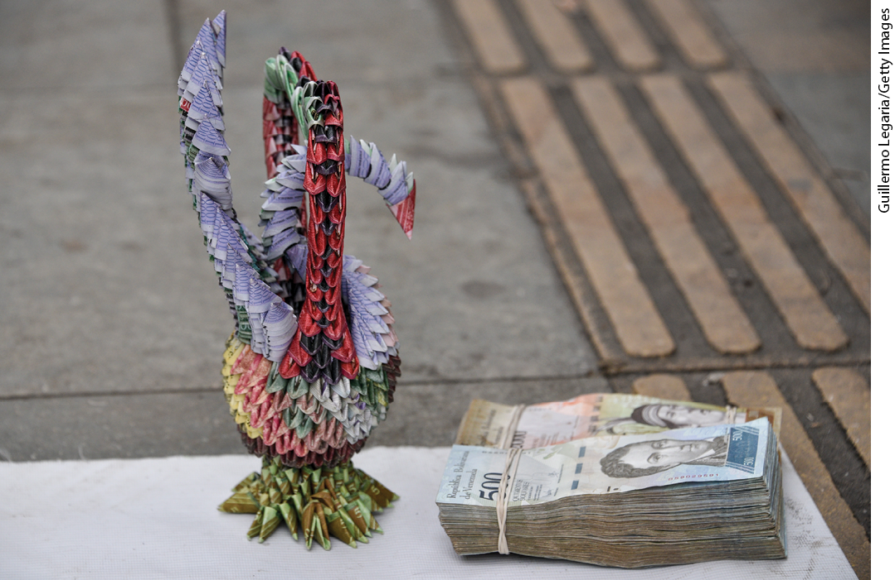
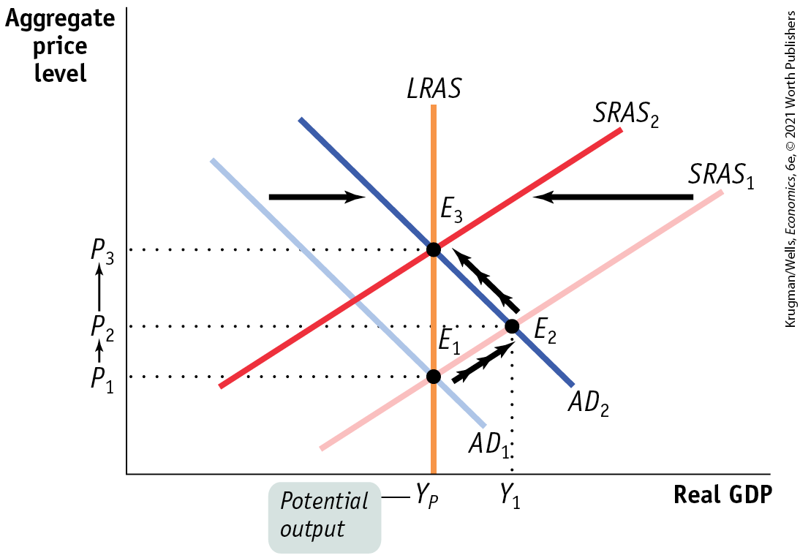
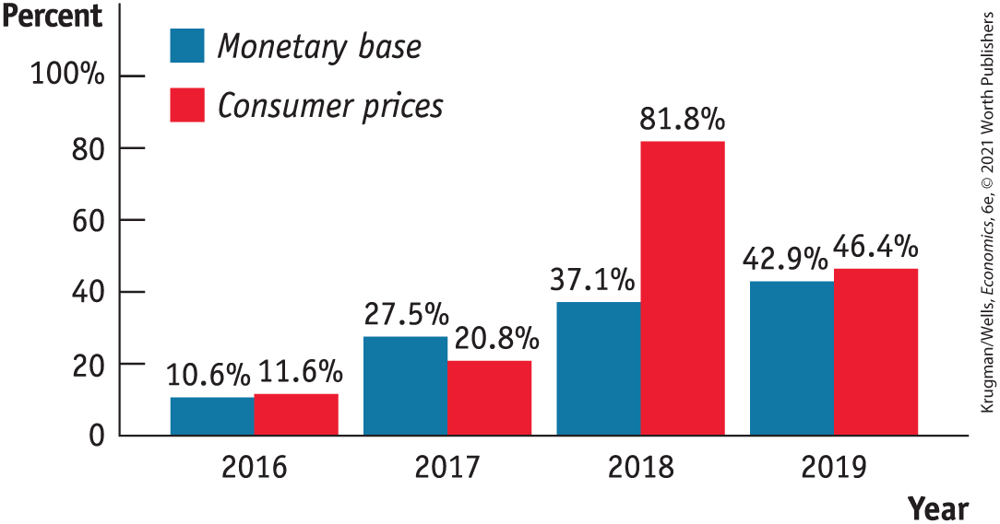
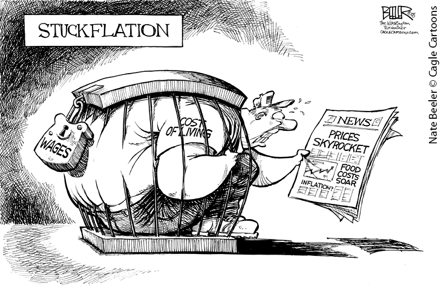
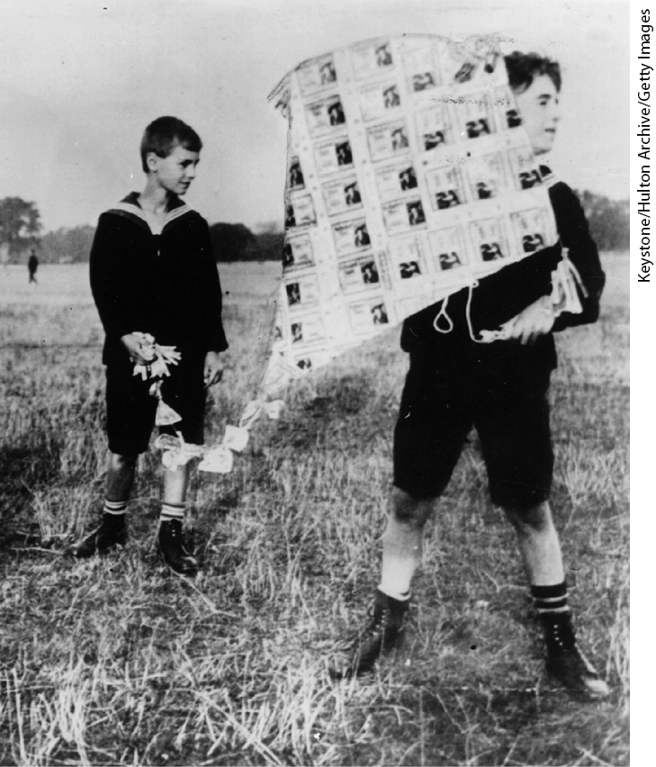
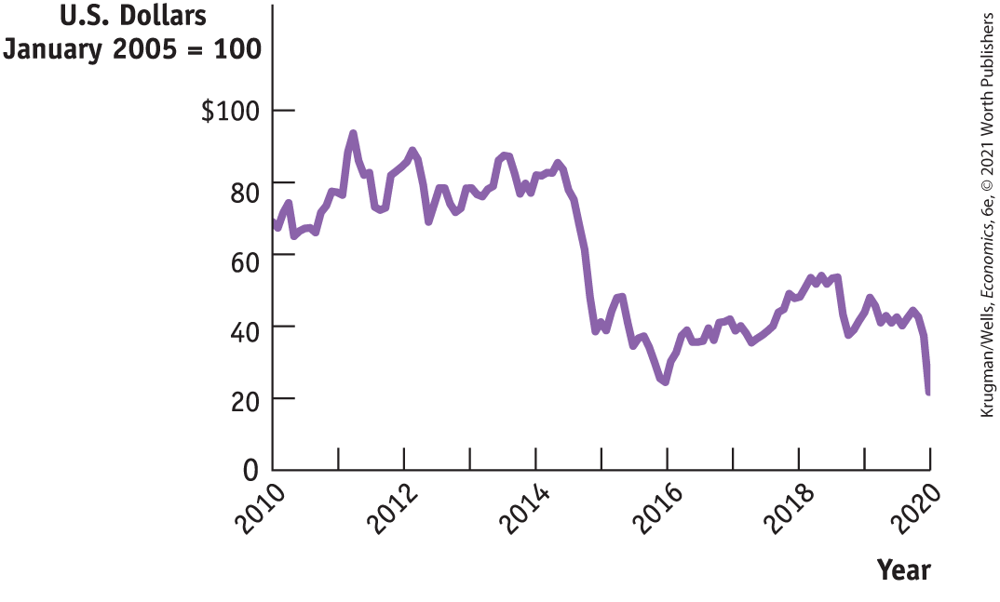

# Chapter 16 Inflation, Disinflation, and Deflation

## THAT AND 900,000 BOLIVARS WILL GET YOU A CUP OF COFFEE

<figure id="pau_9781319320164_38SLZFI4h9" class="figure lm_img_lightbox unnum c2 right">

<figcaption>
Stacks of currency, worth a lot less than they were even a month earlier.
</figcaption>
</figure>

**IN 2015 THE SOUTH AMERICAN NATION** of Venezuela essentially stopped releasing economic statistics, probably in an attempt to hide how badly things were going — and in particular, to avoid admitting the extent of the country’s runaway inflation. But it’s unlikely that anyone was fooled.

Independent observers came up with their own measures of inflation; for example, Bloomberg News began releasing a “café con leche index” based on the price of Venezuela’s favorite drink. And private citizens, well aware that the value of bolivars, the nation’s currency, was plunging, made every effort to get rid of the currency as soon as it came into their hands. Shopkeepers wouldn’t put money in the cash register, they would run out to spend it on new supplies. Enterprising individuals would buy goods subject to price controls and smuggle them out to sell in neighboring countries. And everyone tried to exchange bolivars for U.S. dollars on the black market.

In 2019 Venezuela’s central bank, the equivalent of the Federal Reserve, finally relented and released inflation numbers, which confirmed what everyone already knew. In 2016 the inflation rate was “only” 274%; by 2018 it had reached 130,000%. (Inflation fell slightly in 2019, but few expected the reprieve to last.)

Venezuela’s experience was shocking, but not unprecedented. In 2008 Zimbabwe briefly reached 500 billion percent inflation before abandoning its currency altogether. In 1994 the inflation rate in Armenia hit 27,000%. In 1991 Nicaraguan inflation exceeded 60,000%. And Zimbabwe’s experience was more or less matched by history’s most famous example of extreme inflation, which took place in Germany in 1922–1923. Toward the end of the German hyperinflation, prices were rising 16% a *day,* which — through compounding — meant an increase of approximately 500 billion percent over the course of five months.

<!--
[AU: Please provide caption for photo.]
--> <!--
<strong class="important">[AU: Replace extreme inflation with hyperinflation to be consistent with rest of chapter? Also move sentence about Armenia to precede Zimbabwe? It feels out of place as is.]</strong>
-->

Germans became so reluctant to hold paper money, which lost value by the hour, that eggs and lumps of coal began to circulate as currency. Firms would pay their workers several times a day so that they could spend their earnings before they lost value (lending new meaning to the term *hourly wage*). Legend has it that customers sitting down at a bar would order two beers at a time, out of fear that the price of a beer would rise before they could order a second round!

The United States has never experienced that kind of inflation. The worst U.S. inflation in modern times took place at the end of the 1970s. From 1978 to 1980 the U.S. inflation rate more than doubled, from 6.4% to 14.5%. Yet inflation at even that rate was profoundly troubling to the American public, and the policies the Federal Reserve pursued in order to get U.S. inflation back down to an acceptable rate led to a severe recession.

What causes inflation to rise and fall? In this chapter, we’ll look at the underlying reasons for inflation. We’ll see that the underlying causes of very high inflation, the type of inflation suffered by Venezuela, are quite different from the causes of more moderate inflation. We’ll also learn why *disinflation,* a reduction in the inflation rate, is often very difficult. Finally, we’ll discuss the special problems associated with a falling price level, or deflation. 

<!--
<strong class="important">[End Opening
Story]</strong>
--> <!--
<strong class="important">Krugman/Wells, Macro 6E Chapter 16 [will also be Econ Chapter 31]</strong>
--> <!--
<strong class="important">General Information: Comp will find Econ 5/e to be an excellent resource for preferences and desired layout of 6/e pages.</strong>
--> <!--
<strong class="important">[Comp: New RIGHT page.</strong>
--> <!--
<strong class="important">Verso running head: PART 6 STABILIZATION POLICY</strong>
--> <!--
<strong class="important">Recto running head: CHAPTER 16 INFLATION, DISINFLATION, AND DEFLATION]</strong>
--> <!--
<strong class="important">[COMP: Please carry all blue AU: notes to pages]</strong>
--> <!--
<strong class="important">[Comp: insert globe icon]</strong>
-->
<aside class="learning-objectives c3 main-flow v3" epub:type="learning-objectives" id="pau_9781319320164_zlFCSWFE0C">

### What you will learn

- Why can printing money lead to high rates of inflation and hyperinflation?
- How does the **Phillips curve** describe the short-run trade-off between inflation and unemployment?
- Why does the trade-off between inflation and unemployment cease in the long run?
- Why can even moderate levels of inflation be hard to end?
- Why is deflation a problem for economic policy makers?

<!--
<strong class="important">[End of chapter opener]</strong>
-->
</aside>

## Money and Inflation

Moderate levels of inflation such as those experienced in the United States — even the double-digit inflation of the late 1970s — can have complex causes. But very high inflation is always associated with rapid increases in the money supply.

To understand why, we need to revisit the effect of changes in the money supply on the overall price level. Then we’ll turn to the reasons governments sometimes increase the money supply very rapidly.

### The Classical Model of Money and Prices

In the previous chapter we learned that in the short run, an increase in the money supply increases real GDP by lowering the interest rate and stimulating investment spending and consumer spending. However, in the long run, as nominal wages and other sticky prices rise, real GDP falls back to its original level. So in the long run, an increase in the money supply does not change real GDP. Instead, other things equal, it leads to an equal percent rise in the overall price level. That is, the prices of all goods and services in the economy, including nominal wages and the prices of intermediate goods, rise by the same percentage as the money supply. And when the overall price level rises, the aggregate price level — the prices of all final goods and services — rises as well.

As a result, a change in the *nominal* money supply, *M,* leads in the long run to a change in the aggregate price level that leaves the *real* quantity of money, $M\text{/}P$, at its original level, with no long-run effect on aggregate demand or real GDP. For example, when Turkey dropped six zeros from its currency, the Turkish lira, in January 2005, Turkish real GDP did not change. The only thing that changed was the number of zeros in prices: instead of something costing 2,000,000 lira, it cost 2 lira.

This is, to repeat, what happens in the long run. When analyzing large changes in the aggregate price level, however, macroeconomists often find it useful to ignore the distinction between the short run and the long run. Instead, they work with a simplified model in which the effect of a change in the money supply on the aggregate price level takes place instantaneously rather than over a long period of time. You might be concerned about this assumption, given that in previous chapters we’ve emphasized the difference between the short run and the long run. However, for reasons we’ll explain shortly, this is a reasonable assumption to make in the case of high inflation.

A simplified model in which the real quantity of money, $M\text{/}P$, is always at its long-run equilibrium level is known as the <a href="#kru_9781319245269_EM_glossary.xhtml#pau_9781319320164_Z9G4kHm6Ns" id="kru_9781319245269_ch16_02.xhtml#pau_9781319320164_o3m2mnb6Ca" class="glossref" role="doc-glossref">classical model of the price level</a> because it was commonly used by “classical” economists who wrote before the work of John Maynard Keynes. To understand the classical model and why it is useful in the context of high inflation, let’s revisit the *AD–AS* model and what it says about the effects of an increase in the money supply. (Unless otherwise noted, we will always be referring to changes in the *nominal* supply of money.)

<aside aria-label="title 1" class="glossary c3 main-flow v1" epub:type="glossary" id="pau_9781319320164_UNdtmLAOGl">

**classical model of the price level**  
According to the **classical model of the price level**, the real quantity of money is always at its long-run equilibrium level.

</aside>
<!--
<strong class="important">[Comp: For Key Terms, bold punctuation follows bold word (with the exception of em dashes). See end of chapter for corresponding Margin Definition copy.]</strong>
-->

<a href="#kru_9781319245269_ch16_02.xhtml#pau_9781319320164_CE5bIaJ0GD" id="kru_9781319245269_ch16_02.xhtml#pau_9781319320164_Cu50zjDWUu" class="crossref">Figure 16-1</a> reviews the effects of an increase in the money supply according to the *AD–AS* model. The economy starts at $E_{1}$, a point of short-run and long-run macroeconomic equilibrium. It lies at the intersection of the aggregate demand curve, $AD_{1}$, and the short-run aggregate supply curve, $SRAS_{1}$. It also lies on the long-run aggregate supply curve, *LRAS.* At $E_{1}$, the equilibrium aggregate price level is $P_{1}$.

<figure id="pau_9781319320164_CE5bIaJ0GD" class="figure lm_img_lightbox num c3 main-flow">

<figcaption>
FIGURE 16-1 The Classical Model of the Price Level

Starting at <em>E</em>1, an increase in the money supply shifts the aggregate demand curve rightward, as shown by the movement from <em>A</em><em>D</em>1 to <em>A</em><em>D</em>2. There is a new short-run macroeconomic equilibrium at <em>E</em>2 and a higher price level at <em>P</em>2. In the long run, nominal wages adjust upward and push the <em>SRAS</em> curve leftward to <em>S</em><em>R</em><em>A</em><em>S</em>2. The total percent increase in the price level from <em>P</em>1 to <em>P</em>3 is equal to the percent increase in the money supply. In the <em>classical model of the price level,</em> we ignore the transition period and think of the price level as rising to <em>P</em>3 immediately. This is a good approximation under conditions of high inflation.
</figcaption>
</figure>

<aside class="hidden" id="pau_9781319320164_DfqaxvtngI" title="hidden">

The vertical axis, labeled Aggregate price level shows markings at P subscript 1, P subscript 2, and P subscript 3, from bottom to top. The horizontal axis, labeled Real G D P shows markings at Y subscript P and Y subscript 1, from left to right. A straight vertical line parallel to the vertical axis starts from Y subscript P, and is labeled L R A S. Two positive sloping straight lines parallel to each other are labeled S R A S subscript 2 and S R A S subscript 1, and two negative sloping straight lines parallel to each other are labeled A D subscript 1 and A D subscript 2. S R A S subscript 2 is on the left of S R A S subscript 1, and A D subscript 2 is on the right of A D subscript 1. L R A S, S R A S subscript 1, and A D subscript 1 intersect each other at a point labeled E subscript 1. L R A S, S R A S subscript 2, and A D subscript 2 intersect each other at a point labeled E subscript 3. S R A S subscript 1 intersects A D subscript 2 at a point labeled E subscript 2. An arrow points from A D subscript 1 to A D subscript 2. An arrow points from E subscript 1 to E subscript 2. An arrow points from E subscript 2 to E subscript 3. An arrow points from S R A S subscript 1 to S R A S subscript 2. The marking, Y subscript P, is labeled Potential output.

</aside>

Now suppose there is an increase in the money supply. This is an expansionary monetary policy, which shifts the aggregate demand curve to the right, to $AD_{2}$, and moves the economy to a new short-run macroeconomic equilibrium at $E_{2}$. Over time, however, nominal wages adjust upward in response to the rise in the aggregate price level, and the *SRAS* curve shifts to the left, to $SRAS_{2}$. The new long-run macroeconomic equilibrium is at $E_{3}$, and real GDP returns to its initial level. As we learned in <a href="#kru_9781319245269_ch15_01.xhtml#pau_9781319320164_4oAIkgdXHI" id="kru_9781319245269_ch16_02.xhtml#pau_9781319320164_jWxTzjXqxR" class="crossref">Chapter 15</a>, the long-run increase in the aggregate price level from $P_{1}$ to $P_{3}$ is proportional to the increase in the money supply. As a result, in the long run changes in the money supply have no effect on the real quantity of money, $M\text{/}P$, or on real GDP. In the long run, money — as we learned — is *neutral.*

The classical model of the price level ignores the short-run movement from $E_{1}$ to $E_{2}$, assuming that the economy moves directly from one long-run equilibrium to another long-run equilibrium. In other words, it assumes that the economy moves directly from $E_{1}$ to $E_{3}$ and that real GDP never changes in response to a change in the money supply. In effect, in the classical model the effects of money supply changes are analyzed as if the short-run as well as the long-run aggregate supply curves were vertical.

This is a poor assumption during periods of low inflation, because it may take a while for workers and firms to react to a monetary expansion by raising wages and prices. As a result, under low inflation there is an upward-sloping *SRAS* curve, and changes in the money supply can indeed change real GDP in the short run.

In the face of high inflation, however, economists have observed that the short-run stickiness of nominal wages and prices tends to vanish. Workers and businesses, sensitized to inflation, are quick to raise their wages and prices in response to changes in the money supply. This implies that under high inflation, there is a quicker adjustment of wages and prices of intermediate goods than occurs in the case of low inflation. So the short-run aggregate supply curve shifts leftward more quickly, and there is a more rapid return to long-run equilibrium under high inflation. As a result, the classical model of the price level is much more likely to be a good approximation of reality for economies experiencing persistently high inflation.

The consequence of this rapid adjustment of all prices in the economy is that in countries with persistently high inflation, changes in the money supply are quickly translated into changes in the inflation rate. Let’s look at Venezuela. <a href="#kru_9781319245269_ch16_02.xhtml#pau_9781319320164_ecXv55JNuZ" id="kru_9781319245269_ch16_02.xhtml#pau_9781319320164_TTzPf6v2Pg" class="crossref">Figure 16-2</a> shows the *monthly* rate of growth in the money supply (as measured by the monetary base) and the monthly rate of change of consumer prices from 2016 through 2019. We use monthly rates of change partly because that is how people in very-high-inflation economies tend to think about inflation, partly because otherwise inflation at “only” a few hundred percent per year would be invisible. As you can see, the surge in the growth rate of the money supply coincided with a surge in the inflation rate.

<figure id="pau_9781319320164_ecXv55JNuZ" class="figure lm_img_lightbox num c3 main-flow">

<figcaption>
FIGURE 16-2 Money Supply Growth and Inflation in Venezuela

This figure shows <em>monthly</em> rates of change in Venezuela’s monetary base and consumer prices as the country spiraled into hyperinflation. Surges in the monetary base were quickly reflected in surges in the price level.

<em>Data from:</em> Central Bank of Venezuela.
</figcaption>
</figure>

<aside class="hidden" id="pau_9781319320164_Jg5AiFrPgt" title="hidden">

The vertical axis, labeled Percent ranges from 0 to 100 percent in increments of 20 percent. The horizontal axis, labeled Year ranges from 2016 to 2019, in increments of 1 year. The data from the graph are as follows, 2016: Monetary base, 10.6 percent; Consumer prices, 11.6 percent. 2017: Monetary base, 27.5 percent; Consumer prices, 20.8 percent. 2018: Monetary base, 37.1 percent; Consumer prices, 81.8 percent. 2019: Monetary base, 42.9 percent; Consumer prices, 46.4 percent.

</aside>

What leads a country to increase its money supply so much that the result is an inflation rate in the thousands of percent per year?

### The Inflation Tax

Modern economies use fiat money — pieces of paper that have no intrinsic value but are accepted as a medium of exchange. In the United States and most other wealthy countries, the decision about how many pieces of paper to issue is placed in the hands of a central bank that is somewhat independent of the political process. However, this independence can always be taken away if politicians decide to seize control of monetary policy.

So what is to prevent a government from paying for some of its expenses not by raising taxes or borrowing but simply by printing money? Nothing. In fact, governments, including the U.S. government, do it all the time. How can the U.S. government do this, given that the Federal Reserve issues money, not the U.S. Treasury? The answer is that the Treasury and the Federal Reserve work in concert. The Treasury issues debt to finance the government’s purchases of goods and services, and the Fed *monetizes* the debt by creating money and buying the debt back from the public through open-market purchases of Treasury bills. In effect, the U.S. government can and does raise revenue by printing money.

<!--
[Stuckflation cartoon- no caption]
-->

<figure id="pau_9781319320164_A8otnYOOoq" class="figure lm_img_lightbox unnum c2 right">

</figure>

For example, in August 2008, the U.S. monetary base — bank reserves plus currency in circulation — was \$18 billion larger than it had been a year earlier. This occurred because, over the course of that year, the Federal Reserve had issued \$20 billion in money or its electronic equivalent and put it into circulation through open-market operations. To put it another way, the Fed created money out of thin air and used it to buy valuable government securities from the private sector. It’s true that the U.S. government pays interest on debt owned by the Federal Reserve — but the Fed, by law, hands the interest payments it receives on government debt back to the Treasury, keeping only enough to fund its own operations. In effect, then, the Federal Reserve’s actions enabled the government to pay off \$18 billion in outstanding government debt by printing money.

An alternative way to look at this is to say that the right to print money is itself a source of revenue. Economists refer to the revenue generated by the government’s right to print money as *seigniorage,* an archaic term that goes back to the Middle Ages. It refers to the right to stamp gold and silver into coins, and charge a fee for doing so, that medieval lords — *seigniors,* in Medieval France — reserved for themselves.

Seigniorage normally accounts for only a tiny fraction (less than 1%) of the U.S. government’s budget. Furthermore, concerns about seigniorage don’t have any influence on the Federal Reserve’s decisions about how much money to print; the Fed is worried about inflation and unemployment, not revenue. But this hasn’t always been true, even in the United States: both the North and the South relied on seigniorage to help cover budget deficits during the Civil War. And there have been many occasions in history when governments turned to their printing presses as a crucial source of revenue.

According to the usual scenario, a government finds itself running a large budget deficit, but lacks either the competence or the political will to eliminate this deficit by raising taxes or cutting spending. Furthermore, the government can’t borrow to cover the gap because potential lenders won’t extend loans given the fear that the government’s weakness will continue and leave it unable to repay its debts.

In such a situation, governments end up printing money to cover the budget deficit. But by printing money to pay its bills, a government increases the quantity of money in circulation. And as we’ve just seen, increases in the money supply sooner or later translate into equally large increases in the aggregate price level. So printing money to cover a budget deficit leads to inflation.

Who ends up paying for the goods and services the government purchases with newly printed money? The people who currently hold money pay. They pay because inflation erodes the purchasing power of their money holdings. In other words, a government imposes an <a href="#kru_9781319245269_EM_glossary.xhtml#pau_9781319320164_NHla9E3VWP" id="kru_9781319245269_ch16_02.xhtml#pau_9781319320164_huYb6icwVm" class="glossref" role="doc-glossref">inflation tax</a>, the reduction in the value of the money held by the public, by printing money to cover its budget deficit and creating inflation.

<aside aria-label="title 1" class="glossary c3 main-flow v1" epub:type="glossary" id="pau_9781319320164_xJHy7tYOQB">

**inflation tax**  
The **inflation tax** is the reduction in the value of money held by the public as a result of inflation.

</aside>

It’s helpful to think about what this tax represents. If the inflation rate is 5%, then a year from now \$1 will buy goods and services worth only \$0.95 today. So a 5% inflation rate in effect imposes a tax rate of 5% on the value of all money held by the public.

But why would any government push the inflation tax to rates of hundreds or thousands of percent? We turn next to the logic of hyperinflation.

### The Logic of Hyperinflation

Inflation imposes a tax on individuals who hold money. And, like most taxes, it will lead people to change their behavior. In particular, when inflation is high, people will try to avoid holding money and will instead substitute real goods as well as interest-bearing assets for money. In the opening story we described how, during the German hyperinflation, people began using eggs or lumps of coal as a medium of exchange. They did this because lumps of coal maintained their real value over time, but money didn’t. Indeed, during the peak of German hyperinflation, people often burned paper money, which was less valuable than wood.

<figure id="pau_9781319320164_78sb4tfgkH" class="figure lm_img_lightbox unnum c2 right">

<figcaption>
In the 1920s, hyperinflation made German currency worth so little that children made kites from banknotes.
</figcaption>
</figure>

Moreover, people don’t just reduce their nominal money holdings — they reduce their *real* money holdings, cutting the amount of money they hold so much that it actually has less purchasing power than the amount of money they would hold if inflation were low. They do this by using the money to buy goods that last over time or assets that hold their value, like gold. Why? Because the more real money holdings they have, the greater the real amount of resources the government captures from them through the inflation tax.

We are now ready to understand how countries can get themselves into situations of extreme inflation. High inflation arises when the government must print a large quantity of money, imposing a large inflation tax, to cover a large budget deficit.

Now, the seigniorage collected by the government over a short period — say, one month — is equal to the change in the money supply over that period. Let’s use *M* to represent the money supply and use the symbol ∆ to mean “monthly change in.” Then:

$$\text{Seigniorage} = \text{Δ}M$$

**(16-1)**

The money value of seigniorage, however, isn’t very informative by itself. After all, the whole point of inflation is that a given amount of money buys less and less over time. So it’s more useful to look at *real* seigniorage, the revenue created by printing money divided by the price level, *P:*

$$\text{Real}\,\text{seigniorage} = \text{Δ}M\text{/}P$$

**(16-2)**

<a href="#kru_9781319245269_ch16_02.xhtml#pau_9781319320164_dZcjYqLXoU" id="kru_9781319245269_ch16_02.xhtml#pau_9781319320164_BGMGRvW0NB" class="crossref">Equation 16-2</a> can be rewritten by dividing and multiplying by the current level of the money supply, *M*, giving us:

$$\text{Real}\,\text{seigniorage} = \text{(}\text{Δ}M\text{/}M\text{)} \times \text{(}M\text{/}P\text{)}$$

**(16-3)**

or

$$\text{Real}\,\text{seigniorage} = \text{Rate}\,\text{of}\,\text{growth}\,\text{of}\,\text{the}\,\text{money}\,\text{supply} \times \text{Real}\,\text{money}\,\text{supply}$$

But as we’ve just explained, in the face of high inflation the public reduces the real amount of money it holds, so the far right-hand term in <a href="#kru_9781319245269_ch16_02.xhtml#pau_9781319320164_dzQixdYeiK" id="kru_9781319245269_ch16_02.xhtml#pau_9781319320164_imz22awQaB" class="crossref">Equation 16-3</a>, $M\text{/}P$, gets smaller. Suppose that the government needs to print enough money to pay for a given quantity of goods and services — that is, it needs to collect a given *real* amount of seigniorage. Then, as the real money supply, $M\text{/}P$, falls as people hold smaller amounts of real money, the government has to respond by accelerating the rate of growth of the money supply, $\text{Δ}M\text{/}M$. This will lead to an even higher rate of inflation. And people will respond to this new higher rate of inflation by reducing their real money holdings, $M\text{/}P$, yet again.

As the process becomes self-reinforcing, it can easily spiral out of control. Although the amount of real seigniorage that the government must ultimately collect to pay off its deficit does not change, the inflation rate the government needs to impose to collect that amount rises. So the government is forced to increase the money supply more rapidly, leading to an even higher rate of inflation, and so on.

Here’s an analogy: imagine a city government that tries to raise a lot of money with a special fee on parking. The fee will raise the cost of parking in the city, and this will cause people to turn to easily available substitutes, such as walking or taking the bus. As the number of parked cars declines, the government finds that its tax revenue declines, and it must impose a higher fee to raise the same amount of revenue as before. You can imagine the ensuing vicious circle: the government imposes fees on parking, which leads to less parking, which causes the government to raise the fee on parking, which leads to even less parking, and so on.

Substitute the real money supply for parking and the inflation rate for the fee on parking, and you have the story of hyperinflation. A race develops between the government printing presses and the public: the presses churn out money at a faster and faster rate to try to compensate for the fact that the public is reducing its real money holdings. At some point the inflation rate explodes into hyperinflation, and people are unwilling to hold any money at all (and resort to trading in eggs and lumps of coal). The government is then forced to abandon its use of the inflation tax and shut down the printing presses.

<!--
<strong class="important">[Start EIA] [NOTE: EIA runs in exactly as shown in MS. It DOES NOT float. ALL SUCH.]</strong>
--> <!--
<strong class="important">[Comp: insert globe icon]</strong>
-->

### ECONOMICS \>\> *in Action*

Behind Venezuela’s Inflation

 <!--
<strong class="important">[AU: Should we change the title and first sentence &#x201C;very high inflation&#x201D; to hyperinflation? Or does this not qualify as hyperinflation?]</strong>
-->

Venezuela offers the most recent example of a country experiencing very high inflation. <a href="#kru_9781319245269_ch16_02.xhtml#pau_9781319320164_ecXv55JNuZ" id="kru_9781319245269_ch16_02.xhtml#pau_9781319320164_UmHjTbPTn7" class="crossref">Figure 16-2</a> showed that surges in Venezuela’s money supply growth were matched by almost simultaneous surges in its inflation rate. But why did Venezuela’s government pursue policies that led to runaway inflation?

Venezuela used to be relatively rich compared with other major Latin American nations. This wealth, however, rested on a very narrow base: the Venezuelan economy was almost completely reliant on oil exports. And many Venezuelans felt that they weren’t getting their fair share of the country’s income, that it was being siphoned off for the benefit of a small, wealthy minority.

In 1999 Hugo Chavez, a left-wing populist, took power with the promise to use Venezuela’s oil wealth to help the poor and working class. For a number of years he delivered at least partly on that promise, increasing spending on social programs and presiding over what appears to have been a substantial reduction in poverty. However, he did nothing to diversify Venezuela away from its dependence on oil.

Chavez died in 2013, and his successor, Nicolas Maduro, soon found himself in trouble, largely because of a collapse in global oil prices. <a href="#kru_9781319245269_ch16_02.xhtml#pau_9781319320164_9Q1epEZSNf" id="kru_9781319245269_ch16_02.xhtml#pau_9781319320164_DGDTUESR1n" class="crossref">Figure 16-3</a> shows the real price of oil — that is, the price adjusted for inflation — in the United States since 2010. Prices plunged in 2013, largely because fracking led to a surge in the supply of oil and other hydrocarbons, mainly natural gas. And Venezuela’s government, deeply dependent on oil revenue, no longer had the money to pay for Chavez’s programs.

<!--
<strong class="important">[AU/Ryan: Update data in pages.]</strong>
-->

<figure id="pau_9781319320164_9Q1epEZSNf" class="figure lm_img_lightbox num c3 main-flow">

<figcaption>
FIGURE 16-3 Real Oil Prices, 2010–2020

<em>Data from:</em> U.S. Energy Information Administration.
</figcaption>
</figure>

<aside class="hidden" id="pau_9781319320164_GDTzKmepsi" title="hidden">

The vertical axis, labeled U S Dollars January 2005 equals 100 ranges from 0 to 100 dollars in increment of 20 dollars. The horizontal axis, labeled Year ranges from 2010 to 2020 in increments of 1 year. The graph plots s curve that passes through the following approximate points, (2010, 70), (2011, 78), (2012, 90), (2013, 80), (2014, 78), (2015, 40), (2016, 30), (2017, 40), (2018, 50), (2019, 50), and (2020, 25).

</aside>

Instead of cutting back or seeking new revenue sources, however, the Maduro government tried to close the budget gap by printing money. When this, predictably, led to inflation, the Venezuelan government tried to suppress the inflation with price controls, leading to widespread shortages that probably made the inflation worse.

While there are many unique details to the Venezuela story, overall it fits the classic pattern, in which a government that can’t or won’t pay for its operations turns to the printing press, and stumbles its way into hyperinflation.

<!--
<strong class="important">[End EIA]</strong>

<strong class="important">Quick Reviewand Check Your Understanding position exactly where shown in MS. They do not float. ALL SUCH. See layouts for recto/verso design differences.]</strong>
-->

### \>\> *Quick Review*

- The **classical model of the price level** does not distinguish between the short and the long run. It explains how increases in the money supply feed directly into inflation. It is a good description of reality only for countries with persistently high inflation or hyperinflation.
- Governments sometimes print money to cover a budget deficit. The resulting loss in the value of money is called the **inflation tax.**
- A high inflation rate causes people to reduce their real money holdings, leading to the printing of more money and higher inflation in order to collect the inflation tax. This can cause a self-reinforcing spiral into hyperinflation.

### \>\> *Check Your Understanding* 16-1

1.  Suppose there is a large increase in the money supply in an economy that previously had low inflation. As a consequence, aggregate output expands in the short run. What does this say about situations in which the classical model of the price level applies?
2.  Suppose that all wages and prices in an economy are indexed to inflation — that is, wages and prices are automatically adjusted to incorporate the latest inflation figures. Can there still be an inflation tax?

## Moderate Inflation and Disinflation

The governments of wealthy, politically stable countries, like the United States and Britain, don’t find themselves forced to print money to pay their bills. Yet over the past 40 years, both countries, along with a number of other nations, have experienced uncomfortable episodes of inflation. In the United States, the inflation rate peaked at 14% at the beginning of the 1980s. In Britain, the inflation rate reached 26% in 1975. Why did policy makers allow this to happen?

The answer, in brief, is that in the short run, policies that produce a booming economy also tend to lead to higher inflation, and policies that reduce inflation tend to depress the economy. This creates both temptations and dilemmas for governments.

First, imagine yourself as a politician facing an election in a year or two, and suppose that inflation is fairly low at the moment. You might well be tempted to pursue expansionary policies that will push the unemployment rate down as a way to please voters, even if your economic advisers warn that this will eventually lead to higher inflation. You might also be tempted to find different economic advisers who will tell you not to worry: in politics, as in ordinary life, wishful thinking often prevails over realistic analysis.

Conversely, imagine yourself as a politician in an economy suffering from inflation. Your economic advisers will probably tell you that the only way to bring inflation down is to push the economy into a recession, which will lead to temporarily higher unemployment. Are you willing to pay that price? Maybe not.

This political dilemma — inflationary policies often produce short-term political gains, but disinflationary policies to bring inflation down carry short-term political costs — explains how countries with no need to impose an inflation tax can end up with serious inflation problems. For example, that 26% rate of inflation in Britain was largely the result of the British government’s decision in 1971 to pursue highly expansionary monetary and fiscal policies in order to gain a political advantage. British politicians disregarded warnings that these policies would be inflationary and were extremely reluctant to reverse course when it became clear that the warnings had been accurate.

But why do expansionary policies lead to inflation? To answer that question, we need to look first at the relationship between output and unemployment.
