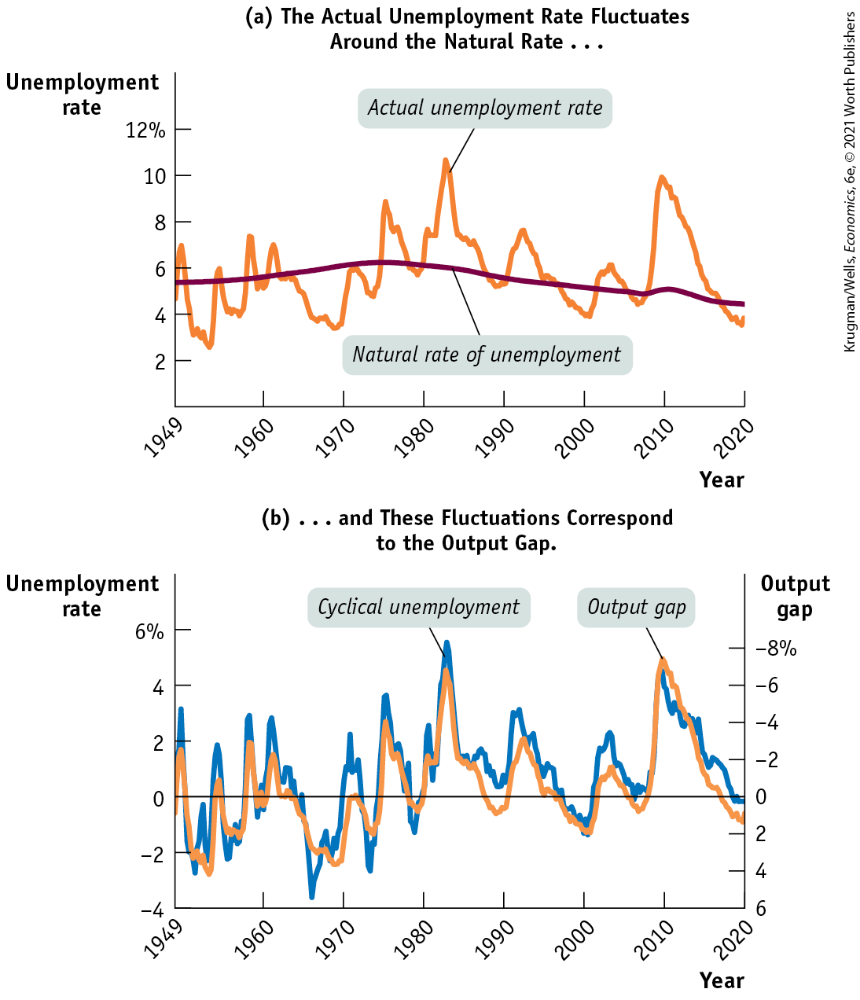
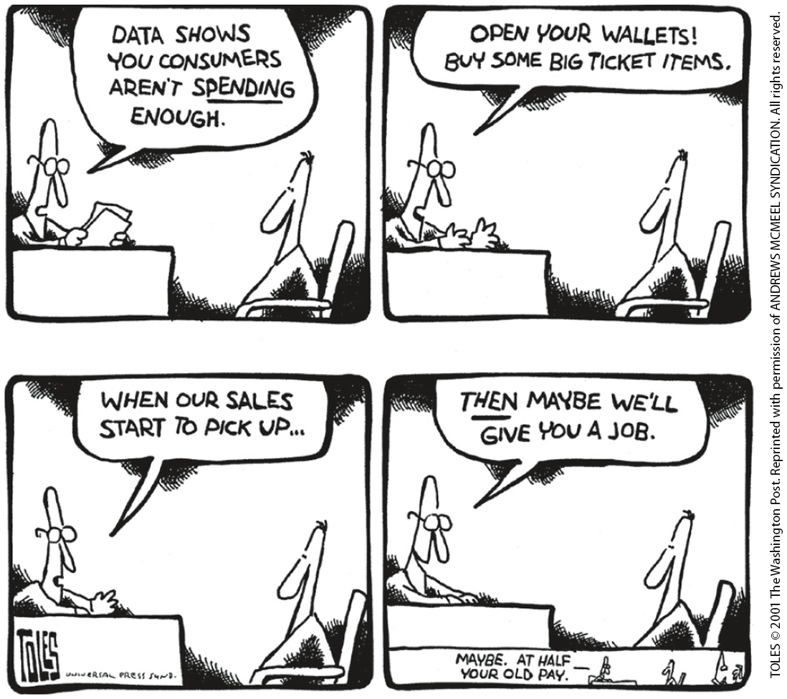
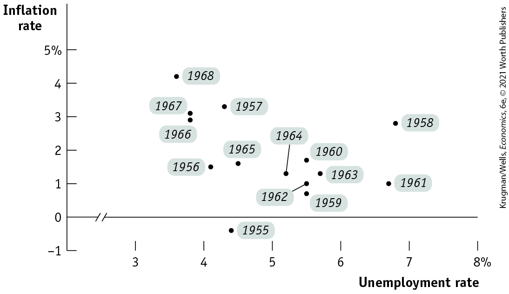
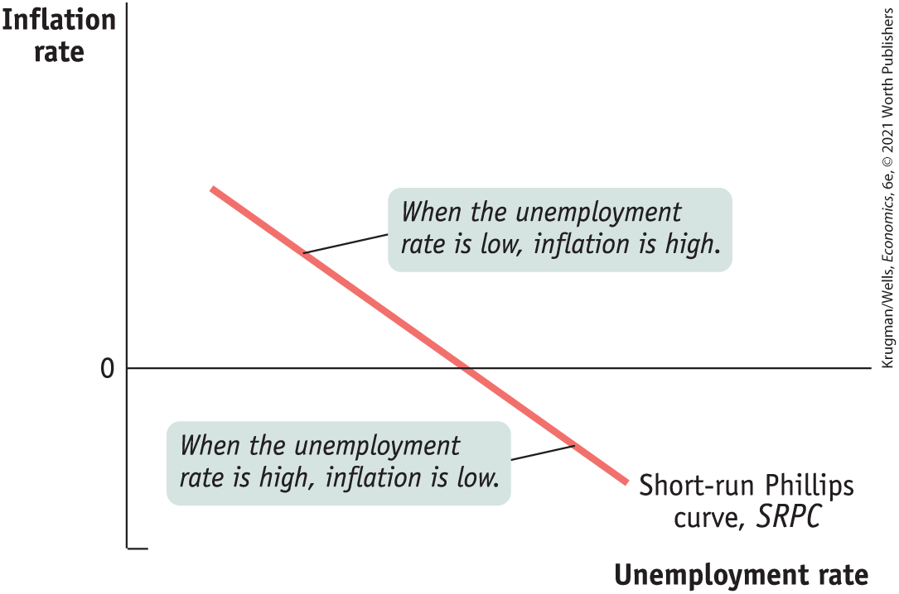
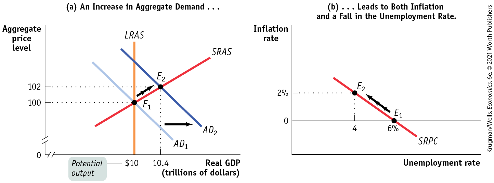
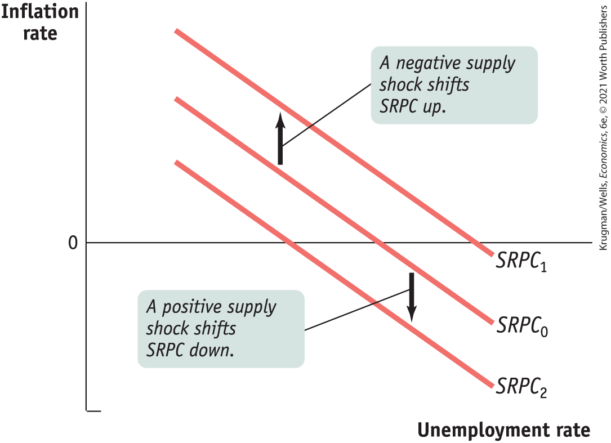
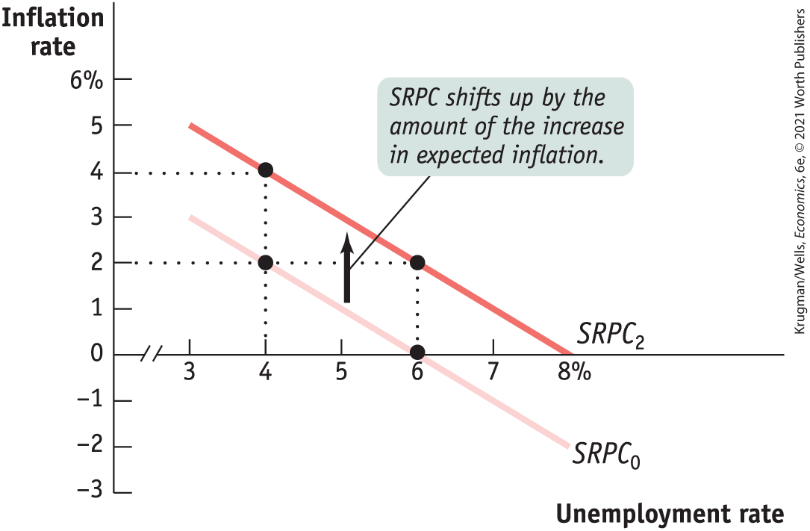
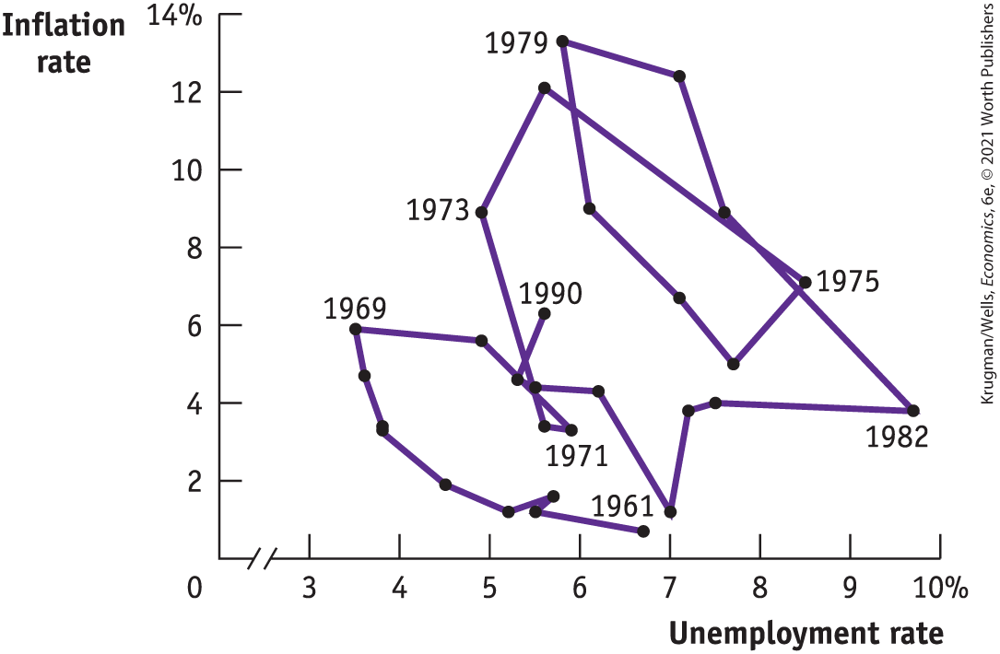

### The Output Gap and the Unemployment Rate

In <a href="#kru_9781319245269_ch12_01.xhtml#pau_9781319320164_EQQUECcZyk" id="kru_9781319245269_ch16_03.xhtml#pau_9781319320164_BpR6WbKE8H" class="crossref">Chapter 12</a> we introduced the concept of *potential output,* the level of real GDP that the economy would produce once all prices had fully adjusted. Potential output typically grows steadily over time, reflecting long-run growth. However, as we learned from the *AD–AS* model, actual aggregate output fluctuates around potential output in the short run: a recessionary gap arises when actual aggregate output falls short of potential output. An inflationary gap arises when actual aggregate output exceeds potential output.

Recall that the percentage difference between the actual level of real GDP and potential output is called the *output gap*. A positive or negative output gap occurs when an economy is producing more than or less than what would be “expected” because all prices, including wages in the labor market, have not yet adjusted. And wages, as we’ve learned, are the prices in the labor market.

Meanwhile, we learned in <a href="#kru_9781319245269_ch08_01.xhtml#pau_9781319320164_6AH2l2uZnD" id="kru_9781319245269_ch16_03.xhtml#pau_9781319320164_3dde0S1t3x" class="crossref">Chapter 8</a> that the unemployment rate is composed of both cyclical unemployment and natural unemployment (natural unemployment is the portion of the unemployment rate unaffected by the business cycle). So there is a relationship between the unemployment rate and the output gap. This relationship is defined by two rules:

1.  When actual aggregate output is equal to potential output, the actual unemployment rate is equal to the natural rate of unemployment.
2.  When the output gap is positive (an inflationary gap), the unemployment rate is *below* the natural rate. When the output gap is negative (a recessionary gap), the unemployment rate is *above* the natural rate.

*In other words, fluctuations of aggregate output around the long-run trend of potential output correspond to fluctuations of the unemployment rate around the natural rate.*

This makes sense. When the economy is producing less than potential output — when the output gap is negative — it is not making full use of its productive resources. Among the resources that are not fully utilized is labor, the economy’s most important resource. So we would expect a negative output gap to be associated with unusually high unemployment. Conversely, when the economy is producing more than potential output, it is temporarily using resources at higher-than-normal rates. With this positive output gap, we would expect to see lower-than-normal unemployment.

<a href="#kru_9781319245269_ch16_03.xhtml#pau_9781319320164_hp8XXZw0SA" id="kru_9781319245269_ch16_03.xhtml#pau_9781319320164_BFccWEdmP0" class="crossref">Figure 16-4</a> confirms this rule. Panel (a) shows the actual and natural rates of unemployment, as estimated by the Congressional Budget Office (CBO). Panel (b) shows two series. One is cyclical unemployment: the difference between the actual unemployment rate and the CBO estimate of the natural rate of unemployment, measured on the left. The other is the CBO estimate of the output gap, measured on the right. To make the relationship clearer, the output gap series is inverted — shown upside down — so that the line goes down if actual output rises above potential output and up if actual output falls below potential output.

<figure id="pau_9781319320164_hp8XXZw0SA" class="figure lm_img_lightbox num c3 main-flow">

<figcaption>
FIGURE 16-4 Cyclical Unemployment and the Output Gap

Panel (a) shows the actual U.S. unemployment rate from 1949 through February 2020, together with the Congressional Budget Office estimate of the natural rate of unemployment. The actual rate fluctuates around the natural rate, often for extended periods. Panel (b) shows cyclical unemployment — the difference between the actual unemployment and the natural rate of unemployment — and the output gap, also estimated by the CBO. The unemployment rate is measured on the left vertical axis, and the output gap is measured with an inverted scale on the right vertical axis. With an inverted scale, it moves in the same direction as the unemployment rate: when the output gap is positive, the actual unemployment rate is below its natural rate. And when the output gap is negative, the actual unemployment rate is above its natural rate. The two series track one another closely, showing the strong relationship between the output gap and cyclical unemployment.

<em>Data from:</em> Federal Reserve Bank of St. Louis.
</figcaption>
</figure>

<aside class="hidden" id="pau_9781319320164_YHbdrOSYfR" title="hidden">

Graph (a) The Actual Unemployment Rate Fluctuates Around the Natural Rate, ellipsis: The vertical axis, labeled Unemployment rate ranges from 0 to 12 percent in increments of 2 percent. The horizontal axis, labeled Year shows a marking at 1949 and after that ranges from 1960 to 2020 in increments of 10 years. The Actual unemployment rate curve passes through the approximate points, (1949, 5), (1955, 2.1), (1960, 5), (1970, 3), (1975, 9), (1980, 6), (1985, 10), (1990, 5), (1995, 7), (2000, 4), (2010, 9.5), and (2020, 3). The Natural rate of unemployment curve passes through approximate points, (1949, 5.5), (1960, 5.8), (1970, 6), (1980, 6), (1990, 5.5), (2000, 5.3), (2010, 4.5), and (2020, 4). Graph (b), ellipsis and These Fluctuations Correspond to the Output Gap: The left vertical axis, labeled Unemployment rate ranges negative 4 to 6 percent in increments of 2 percent. The right vertical axis, labeled Output gap ranges from 6 to negative 8 in increments of 2 percent, from bottom to top. The horizontal axis, labeled Year shows a marking at 1949 and after that ranges from 1960 to 2020 in increments of 10 years. The cyclical unemployment curve passes through the approximate points, (1950, 3), (1955, negative 2), (1956, 2), (1960, 0.5), (1965, negative 3.8), (1970, 2), (1975, negative 3), (1978, 4), (1980, negative 1), (1985, 6), (1990, 0.5), (1992, 3), (2000, negative 1.75), (2010, 4.25), and (2020, 0). The output gap curve passes through the approximate points, (1949, negative 2), (1955, 4), (1960, 0.5), (1970, 3), (1975, negative 4), (1980, 0.50), (1985, negative 6), (1990, 1), (1992, negative 3), (2000, 2), (2005, negative 2), (2010, negative 7.5), and (2020, 1).

</aside>

As you can see, the two series move together quite closely, showing the strong relationship between the output gap and cyclical unemployment. Years of high cyclical unemployment, like 1982, 1992, or 2009, were also years of a strongly negative output gap. Years of low cyclical unemployment, like the late 1960s or late 1990s into the early 2000s, were also years of a strongly positive output gap.

<!--
<strong class="important">[Start FIM Box; position near here]</strong>
-->
<aside class="case-study c3 main-flow v1" epub:type="case-study" id="pau_9781319320164_lNhY6o8NK7" title="For Inquiring Minds">

#### For inquiring minds

Okun’s Law

Although cyclical unemployment and the output gap move together, cyclical unemployment seems to move *less* than the output gap. For example, the output gap reached $- 8\%$ in 1982, but the cyclical unemployment rate reached only 4%. This observation is the basis of an important relationship originally discovered by the economist Arthur Okun.

Modern estimates of <a href="#kru_9781319245269_EM_glossary.xhtml#pau_9781319320164_2SvIvroKYp" id="kru_9781319245269_ch16_03.xhtml#pau_9781319320164_W1TPc0he7y" class="glossref" role="doc-glossref">Okun’s law</a> — the negative relationship between the output gap and the cyclical unemployment rate — typically find that a rise in the output gap of 1 percentage point reduces the unemployment rate by about $\frac{1}{2}$ of a percentage point.

<aside aria-label="title 1" class="glossary c3 main-flow v1" epub:type="glossary" id="pau_9781319320164_ZlmiNne2H7">

**Okun’s law**  
**Okun’s law** is the negative relationship between the output gap and cyclical unemployment.

</aside>

For example, suppose that the natural rate of unemployment is 5.2% and that the economy is currently producing at only 98% of potential output. In that case, the output gap is $- 2\%$, and Okun’s law predicts an unemployment rate of $5.2\% - \frac{1}{2} \times ( - 2\%\text{)} = 6.2\%$.

The fact that a 1% rise in output reduces the unemployment rate by only $\frac{1}{2}$ of 1% may seem puzzling: you might have expected to see a one-to-one relationship between the output gap and unemployment. Doesn’t a 1% rise in aggregate output require a 1% increase in employment? And shouldn’t that take 1% off the unemployment rate?

The answer is no: there are several well-understood reasons why the relationship isn’t one-to-one. For one thing, companies often meet changes in demand in part by changing the number of hours their existing employees work. For example, a company that experiences a sudden increase in demand for its products may cope by asking (or requiring) its workers to put in longer hours, rather than by hiring more workers. Conversely, a company that sees sales drop will often reduce workers’ hours rather than lay off employees. This behavior dampens the effect of output fluctuations on the number of workers employed.

<!--
[Data shows you consumers aren&#x2019;t spending enough cartoon- no caption]
-->

<figure id="pau_9781319320164_TMYTxEucWA" class="figure lm_img_lightbox unnum c4 center">

</figure>

Also, the number of workers looking for jobs is affected by the availability of jobs. Suppose that the number of jobs falls by 1 million. Measured unemployment will rise by less than 1 million because some unemployed workers become discouraged and give up actively looking for work. (Recall that workers aren’t counted as unemployed unless they are actively seeking work.) Conversely, if the economy adds 1 million jobs, some people who haven’t been actively looking for work will begin doing so. As a result, measured unemployment will fall by less than 1 million.

Finally, the rate of growth of labor productivity generally accelerates during booms and slows down or even turns negative during busts. The reasons for this phenomenon are the subject of some dispute among economists. The consequence, however, is that the effects of booms and busts on the unemployment rate are dampened.

<!--
<strong class="important">[End FIM Box]</strong>
-->
</aside>

### The Short-Run Phillips Curve

We’ve just seen that expansionary policies lead to a lower unemployment rate. Our next step in understanding the temptations and dilemmas facing governments is to show that there is a short-run trade-off between unemployment and inflation — lower unemployment tends to lead to higher inflation, and vice versa. The key concept is that of the *Phillips curve.*

The origins of this concept lie in a famous 1958 paper by the New Zealand–born economist A. W. H. Phillips. Looking at historical data for Britain, he found that when the unemployment rate was high, the wage rate tended to fall, and when the unemployment rate was low, the wage rate tended to rise. Using data from Britain, the United States, and elsewhere, other economists soon found a similar apparent relationship between the unemployment rate and the rate of inflation — that is, the rate of change in the aggregate price level. For example, <a href="#kru_9781319245269_ch16_03.xhtml#pau_9781319320164_dGg4XSMQgf" id="kru_9781319245269_ch16_03.xhtml#pau_9781319320164_ymmpK9q4fj" class="crossref">Figure 16-5</a> shows the U.S. unemployment rate and the rate of consumer price inflation over each subsequent year from 1955 to 1968, with each dot representing one year’s data.

<figure id="pau_9781319320164_dGg4XSMQgf" class="figure lm_img_lightbox num c3 main-flow">

<figcaption>
FIGURE 16-5 Unemployment and Inflation, 1955–1968

Each dot shows the average U.S. unemployment rate for one year and the percentage increase in the consumer price index over the subsequent year. Data like this lay behind the initial concept of the Phillips curve.

<em>Data from:</em> Bureau of Labor Statistics.
</figcaption>
</figure>

<aside class="hidden" id="pau_9781319320164_vwimvcXlSA" title="hidden">

The vertical axis, labeled Inflation rate ranges from negative 1 to 5 percent in increments of 1 percent. The horizontal axis, labeled Unemployment rate is truncated and ranges from 3 to 8 percent in increments of 1 percent. The approximate data from the graph are as follows, 1955, (4.3, negative 0.5); 1956 (4.1, 1.5); 1957 (4.2, 3.5); 1958 (6.9, 2.8) 1959 (5.5, 0.5); 1960 (5.5, 1.8); 1961 (6.8, 1); 1962 (5.5, 1); 1963 (5.6, 1.5); 1964 (5.2, 1.2); 1965 (4.5, 1.8); 1966 (3.8, 2.8); 1967 (3.8, 3); and 1968 (3.5, 4.5).

</aside>

Looking at evidence like <a href="#kru_9781319245269_ch16_03.xhtml#pau_9781319320164_dGg4XSMQgf" id="kru_9781319245269_ch16_03.xhtml#pau_9781319320164_ifYJBzdq0G" class="crossref">Figure 16-5</a>, many economists concluded that there is a negative short-run relationship between the unemployment rate and the inflation rate, which is called the <a href="#kru_9781319245269_EM_glossary.xhtml#pau_9781319320164_Q5qzT1b2Pd" id="kru_9781319245269_ch16_03.xhtml#pau_9781319320164_TV6azxMCQK" class="glossref" role="doc-glossref">short-run Phillips curve</a>, or *SRPC.* (We’ll explain the difference between the short-run and the long-run Phillips curve soon.) <a href="#kru_9781319245269_ch16_03.xhtml#pau_9781319320164_e9Ge3xMZmf" id="kru_9781319245269_ch16_03.xhtml#pau_9781319320164_YS7c9ynq8V" class="crossref">Figure 16-6</a> shows a hypothetical short-run Phillips curve.

<aside aria-label="title 1" class="glossary c3 main-flow v1" epub:type="glossary" id="pau_9781319320164_PF7qSXInKE">

**short-run Phillips curve**  
The **short-run Phillips curve** is the negative short-run relationship between the unemployment rate and the inflation rate.

</aside>

<figure id="pau_9781319320164_e9Ge3xMZmf" class="figure lm_img_lightbox num c3 main-flow">

<figcaption>
FIGURE 16-6 The Short-Run Phillips Curve

The short-run Phillips curve, <em>SRPC,</em> slopes downward because the relationship between the unemployment rate and the inflation rate is negative.
</figcaption>
</figure>

<aside class="hidden" id="pau_9781319320164_rLVte4wmhl" title="hidden">

The vertical axis is labeled Inflation rate, and the horizontal axis is labeled Unemployment rate. A negative sloping straight line labeled Short-run Phillips curve, S R P C, passes from the first quadrant to the fourth quadrant. The part of the S R P C above the horizontal axis is labeled, “When the unemployment rate is low, inflation is high.” The part of S R P C below the horizontal axis is labeled, “When the unemployment rate is high, inflation is low.”

</aside>

Early estimates of the short-run Phillips curve for the United States were very simple: they showed a negative relationship between the unemployment rate and the inflation rate, without taking account of any other variables. During the 1950s and 1960s, this simple approach seemed, for a while, to be adequate. And this simple relationship is clear in the data in <a href="#kru_9781319245269_ch16_03.xhtml#pau_9781319320164_dGg4XSMQgf" id="kru_9781319245269_ch16_03.xhtml#pau_9781319320164_FDglY4FZuf" class="crossref">Figure 16-5</a>.

<!--
<strong class="important">[Start FIM Box; position near here]</strong>
-->
<aside class="case-study c3 main-flow v1" epub:type="case-study" id="pau_9781319320164_FN0UsNY8SP" title="For Inquiring Minds">

#### For inquiring minds

The Aggregate Supply Curve and the Short-Run Phillips Curve

In earlier chapters we made extensive use of the *AD–AS* model, in which the short-run aggregate supply curve — a relationship between real GDP and the aggregate price level — plays a central role. Now we’ve introduced the concept of the short-run Phillips curve, a relationship between the unemployment rate and the rate of inflation. How do these two concepts fit together?

We can get a partial answer to this question by looking at panel (a) of <a href="#kru_9781319245269_ch16_03.xhtml#pau_9781319320164_4bV22aLO1E" id="kru_9781319245269_ch16_03.xhtml#pau_9781319320164_EfUfMhznCX" class="crossref">Figure 16-7</a>, which shows how changes in the aggregate price level and the output gap depend on changes in aggregate demand. Assume that in year 1 the aggregate demand curve is $AD_{1}$, the long-run aggregate supply curve is *LRAS,* and the short-run aggregate supply curve is *SRAS*. The initial macroeconomic equilibrium is at $E_{1}$, where the price level is 100 and real GDP is \$10 trillion. Notice that at $E_{1}$ real GDP is equal to potential output, so the output gap is zero.

<figure id="pau_9781319320164_4bV22aLO1E" class="figure lm_img_lightbox num c5 center">

<figcaption>
FIGURE 16-7 The <em>AD–AS</em> Model and the Short-Run Phillips Curve
</figcaption>
</figure>

<aside class="hidden" id="pau_9781319320164_y9CdQm9SWA" title="hidden">

Graph (a) An Increase in Aggregate Demand, ellipsis: The vertical axis, labeled Aggregate price level is truncated and shows markings at 100 and 102, from bottom to top. The horizontal axis, labeled Real G D P (trillions of dollars) is truncated and shows markings at 10 dollars and 10.4 dollars, from left to right. A straight vertical line labeled L R A S starts from (10, 0). A positive sloping straight line is labeled S R A S, and two negative sloping straight lines parallel to each other are labeled A D subscript 1 and A D subscript 2. A D subscript 2 is on the right of A D subscript 1. L R A S, S R A S, and A D subscript 1 intersect each other at (10, 100) labeled E subscript 1. S R A S intersects A D subscript 2 at (10.4, 102) labeled E subscript 2. An arrow points from A D subscript 1 to A D subscript 2, and another arrow points from E subscript 1 to E subscript 2. The marking, 10 dollars, is labeled Potential output. Graph (b) ellipsis Leads to Both Inflation and a Fall in the Unemployment Rate: The vertical axis, labeled Inflation rate shows markings at 0 and 2 percent, from bottom to top. The horizontal axis, labeled Unemployment rate shows markings at 4 and 6 percent, from left to right. A negative sloping line labeled S R P C passes through points E subscript 2 (4, 2) and E subscript 1 (6, 0). An arrow points from E subscript 1 to E subscript 2.

</aside>
<!--
[figure inside FIM box- no caption]
-->

Now consider two possible paths for the economy over the next year. One is that aggregate demand remains unchanged and the economy stays at $E_{1}$. The other is that aggregate demand shifts rightward to $AD_{2}$ and the economy moves to $E_{2}$.

At $E_{2}$, real GDP is \$10.4 trillion, \$0.4 trillion more than potential output — a 4% output gap. Meanwhile, at $E_{2}$ the aggregate price level is 102 — a 2% increase. So panel (a) tells us that in this example, a zero output gap is associated with zero inflation and a 4% output gap is associated with 2% inflation.

Panel (b) shows what this implies for the relationship between unemployment and inflation. Assume that the natural rate of unemployment is 6% and that a rise of 1 percentage point in the output gap causes a fall of $\frac{1}{2}$ percentage point in the unemployment rate per Okun’s law, described in the previous For Inquiring Minds. In that case, the two cases shown in panel (a) — aggregate demand either unchanged or rising — correspond to the two points in panel (b). At $E_{1}$, the unemployment rate is 6% and the inflation rate is 0%. At $E_{2}$, the unemployment rate is 4% — because an output gap of 4% reduces the unemployment rate by $4\% \times 0.5 = 2\%$ below its natural rate of 6% — and the inflation rate is 2%. So there is a negative relationship between unemployment and inflation.

So does the short-run aggregate supply curve say exactly the same thing as the short-run Phillips curve? Not quite. The short-run aggregate supply curve seems to imply a relationship between the *change* in the unemployment rate and the inflation rate, but the short-run Phillips curve shows a relationship between the *level* of the unemployment rate and the inflation rate. Reconciling these views completely would go beyond the scope of this book. The important point is that the short-run Phillips curve is a concept that is closely related, though not identical, to the short-run aggregate supply curve.

<!--
<strong class="important">[End FIM Box]</strong>
-->
</aside>

Even at the time, however, some economists argued that a more accurate short-run Phillips curve would include other factors. In <a href="#kru_9781319245269_ch12_01.xhtml#pau_9781319320164_EQQUECcZyk" id="kru_9781319245269_ch16_03.xhtml#pau_9781319320164_KTE2qNwB4k" class="crossref">Chapter 12</a> we discussed the effect of *supply shocks,* such as sudden changes in the price of oil, which shift the short-run aggregate supply curve. Such shocks also shift the short-run Phillips curve: surging oil prices were an important factor in the inflation of the 1970s and also played an important role in the acceleration of inflation in 2007–2008. In general, a negative supply shock shifts *SRPC* up as the inflation rate increases for every level of the unemployment rate, and a positive supply shock shifts it down as the inflation rate falls for every level of the unemployment rate. Both outcomes are shown in <a href="#kru_9781319245269_ch16_03.xhtml#pau_9781319320164_oNoqUr7ycC" id="kru_9781319245269_ch16_03.xhtml#pau_9781319320164_cyVQv3HixH" class="crossref">Figure 16-8</a>.

<figure id="pau_9781319320164_oNoqUr7ycC" class="figure lm_img_lightbox num c3 main-flow">

<figcaption>
FIGURE 16-8 The Short-Run Phillips Curve and Supply Shocks

A negative supply shock shifts the <em>SRPC</em> up, and a positive supply shock shifts the <em>SRPC</em> down.
</figcaption>
</figure>

<aside class="hidden" id="pau_9781319320164_7QG6TuSfiH" title="hidden">

Three negative sloping parallel lines are labeled S R P C subscript 2, S R P C subscript 0, and S R P C subscript 1, from bottom to top. These lines pass from the first quadrant to the second quadrant. An arrow pointing from S R P C subscript 0 to S R P C subscript 1 is labeled, “A negative supply shock shifts S R P C up,” and another arrow pointing from S R P C subscript 0 to S R P C subscript 2 is labeled, “A positive supply shock shifts S R P C down.”

</aside>

But supply shocks are not the only factors that can change the inflation rate. In the early 1960s, Americans had little experience with inflation because inflation rates had been low for decades. But by the late 1960s, after inflation had been steadily increasing for a number of years, Americans had come to expect future inflation. In 1968, two economists — Milton Friedman of the University of Chicago and Edmund Phelps of Columbia University — independently set forth a crucial hypothesis: that expectations about future inflation directly affect the present inflation rate. Today most economists accept that the *expected inflation rate* — the rate of inflation that employers and workers expect in the near future — is the most important factor, other than the unemployment rate, affecting inflation.

### Inflation Expectations and the Short-Run Phillips Curve

The <a href="#kru_9781319245269_EM_glossary.xhtml#pau_9781319320164_dgmotD9k3b" id="kru_9781319245269_ch16_03.xhtml#pau_9781319320164_VhAiNPgtPB" class="glossref" role="doc-glossref">expected rate of inflation</a> is the rate of inflation that employers and workers expect in the near future. One of the crucial discoveries of modern macroeconomics is that changes in the expected rate of inflation affect the short-run trade-off between unemployment and inflation and shift the short-run Phillips curve.

<aside aria-label="title 1" class="glossary c3 main-flow v1" epub:type="glossary" id="pau_9781319320164_6SQI47RV0g">

**expected rate of inflation**  
The **expected rate of inflation** is the inflation rate that businesses and workers are expecting in the near future.

</aside>

Why do changes in expected inflation affect the short-run Phillips curve? Put yourself in the position of a worker and employer about to sign a contract setting the worker’s wages over the next year. For a number of reasons, the wage rate they agree to will be higher if everyone expects high inflation (including rising wages) than if everyone expects prices to be stable. The worker will want a wage rate that takes into account future declines in the purchasing power of earnings. They will also want a wage rate that won’t fall behind the wages of other workers. And the employer will be more willing to agree to a wage increase now if hiring workers later will be even more expensive. Also, rising prices will make paying a higher wage rate more affordable for the employer because the employer’s output will sell for more.

For these reasons, an increase in expected inflation shifts the short-run Phillips curve upward: the actual rate of inflation at any given unemployment rate is higher when the expected inflation rate is higher. In fact, macroeconomists believe that the relationship between changes in expected inflation and changes in actual inflation is one-to-one. That is, when the expected inflation rate increases, the actual inflation rate at any given unemployment rate will increase by the same amount. When the expected inflation rate falls, the actual inflation rate at any given level of unemployment will fall by the same amount.

<a href="#kru_9781319245269_ch16_03.xhtml#pau_9781319320164_3x1ssfdopT" id="kru_9781319245269_ch16_03.xhtml#pau_9781319320164_SUQGo8PXTi" class="crossref">Figure 16-9</a> shows how the expected rate of inflation affects the short-run Phillips curve. First, suppose that the expected rate of inflation is 0%. $SRPC_{0}$ is the short-run Phillips curve when the public expects 0% inflation. According to $SRPC_{0}$, the actual inflation rate will be 0% if the unemployment rate is 6%; it will be 2% if the unemployment rate is 4%.

<figure id="pau_9781319320164_3x1ssfdopT" class="figure lm_img_lightbox num c3 main-flow">

<figcaption>
FIGURE 16-9 Expected Inflation and the Short-Run Phillips Curve

An increase in expected inflation shifts the short-run Phillips curve up. <em>S</em><em>R</em><em>P</em><em>C</em>0 is the initial short-run Phillips curve with an expected inflation rate of 0%; <em>S</em><em>R</em><em>P</em><em>C</em>2 is the short-run Phillips curve with an expected inflation rate of 2%. Each additional percentage point of expected inflation raises the actual inflation rate at any given unemployment rate by 1 percentage point.
</figcaption>
</figure>

<aside class="hidden" id="pau_9781319320164_PzFjeIqSTe" title="hidden">

The vertical axis, labeled Inflation rate ranges from negative 3 to 6 percent in increments of 1 percent. The horizontal axis, labeled Unemployment rate is truncated and ranges from 3 to 8 percent in increments of 1 percent. Two negative sloping straight parallel lines are labeled S R P C subscript 0 and S R P C subscript 2, S R P C subscript 2 is on the right of S R P C subscript 0. S R P C subscript 0 passes through (4, 2) and (6, 0). S R P C subscript 2 passes through (4, 4) and (6, 2). An arrow pointing from S R P C subscript 0 to S R P C subscript 2 is labeled, “S R P C shifts up by the amount of the increase in expected inflation.”

</aside>

Alternatively, suppose the expected rate of inflation is 2%. In that case, employers and workers will build this expectation into wages and prices: at any given unemployment rate, the actual inflation rate will be 2 percentage points higher than it would be if people expected 0% inflation. $SRPC_{2}$, which shows the Phillips curve when the expected inflation rate is 2%, is $SRPC_{0}$ shifted upward by 2 percentage points at every level of unemployment. According to $SRPC_{2}$, the actual inflation rate will be 2% if the unemployment rate is 6%; it will be 4% if the unemployment rate is 4%.

What determines the expected rate of inflation? In general, people base their expectations about inflation on experience. If the inflation rate has hovered around 0% in the last few years, people will expect it to be around 0% in the near future. But if the inflation rate has averaged around 5% lately, people will expect inflation to be around 5% in the near future.

Since expected inflation is an important part of the modern discussion about the short-run Phillips curve, you might wonder why it was not in the original formulation of the Phillips curve. The answer lies in history. Think back to what we said about the early 1960s: at that time, people were accustomed to low inflation rates and reasonably expected that future inflation rates would also be low. It was only after 1965 that persistent inflation became a fact of life. So only then did economists begin to argue that expected inflation should play an important role in price setting.

Sure enough, the seemingly clear relationship between inflation and unemployment fell apart after 1969. <a href="#kru_9781319245269_ch16_03.xhtml#pau_9781319320164_9Pk9gNBxZE" id="kru_9781319245269_ch16_03.xhtml#pau_9781319320164_dAAI2deAn1" class="crossref">Figure 16-10</a> plots the track of U.S. unemployment and inflation rates from 1961 to 1990. As you can see, the track looks more like a tangled piece of yarn than like a smooth curve.

<figure id="pau_9781319320164_9Pk9gNBxZE" class="figure lm_img_lightbox num c3 main-flow">

<figcaption>
FIGURE 16-10 Unemployment and Inflation, 1961–1990

In the 1970s, the short-run Phillips curve relationship that seemed to hold during the 1950s and 1960s broke down as the U.S. economy experienced a combination of high unemployment and high inflation. Economists believe this was the result of both negative supply shocks and the cumulative effect of several years of higher than expected inflation. Inflation came down during the 1980s, and the 1990s were a time of both low unemployment and low inflation.

<em>Data from:</em> Bureau of Labor Statistics.
</figcaption>
</figure>

<aside class="hidden" id="pau_9781319320164_FAiB1N6MS6" title="hidden">

The vertical axis, labeled inflation rate ranges from 0 to 14 percent, in increments of 2 percent. The horizontal axis, labeled unemployment rate is truncated and ranges from 3 to 10 percent in increments of 1 percent. The graph plots 28 points connected by line segments. The approximate data points from the graph are as follows, 1961 (6.8, 1); (5.5, 1.5); (5.7, 2); (5.2, 1.5); (4.5, 2.2); (3.9, 3.5); (3.5, 5); 1969, (3.45, 6); (5, 6); 1971, (6, 3.5); (5.5, 3.5); 1973, (5, 9);(5.7, 12); 1975, (8.5, 8); (7.7, 5); (7.2, 7); (6, 9); 1979, (6, 13.5); (7.3, 13); (7.7, 9.5); 1982, (9.7, 4.2); (7.5, 4.2); (7.2, 4); (7, 1); (6.3, 4.3); (5.5, 4.3); (5.2, 4.3); and 1990, (5.5, 6.5).

</aside>

Through much of the 1970s and early 1980s, the economy suffered from a combination of above-average unemployment rates coupled with inflation rates unprecedented in modern American history. This condition came to be known as *stagflation* — for stagnation combined with high inflation. In the late 1990s, by contrast, the economy was experiencing a blissful combination of low unemployment and low inflation. What explains these developments?

Part of the answer can be attributed to a series of negative supply shocks that the U.S. economy suffered during the 1970s. The price of oil, in particular, soared as wars and revolutions in the Middle East led to a reduction in oil supplies and as oil-exporting countries deliberately curbed production to drive up prices. Compounding the oil price shocks, there was also a slowdown in labor productivity growth. Both of these factors shifted the short-run Phillips curve upward. During the 1990s, by contrast, supply shocks were positive. Prices of oil and other raw materials were generally falling, and productivity growth accelerated. As a result, the short-run Phillips curve shifted downward.

Equally important, however, was the role of expected inflation. As mentioned earlier in the chapter, inflation accelerated during the 1960s. During the 1970s, the public came to expect high inflation, and this also shifted the short-run Phillips curve up. It took a sustained and costly effort during the 1980s to get inflation back down. The result, however, was that expected inflation was very low by the late 1990s, allowing actual inflation to be low even with low rates of unemployment.

In fact, most macroeconomists believe that since the 1990s we have recreated conditions somewhat similar to those that prevailed in the 1950s and 1960s: people expect inflation to remain low and stable. As some analysts put it, inflation expectations are now “anchored” at an annual rate of around 2%. As a result, the modern relationship between unemployment and inflation looks a lot like the original Phillips curve.

<!--
<strong class="important">[Start EIA]</strong>
--> <!--
<strong class="important">[Comp: insert globe icon]</strong>
-->
