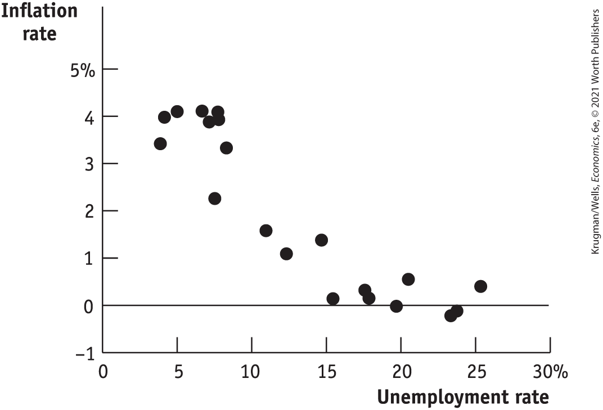
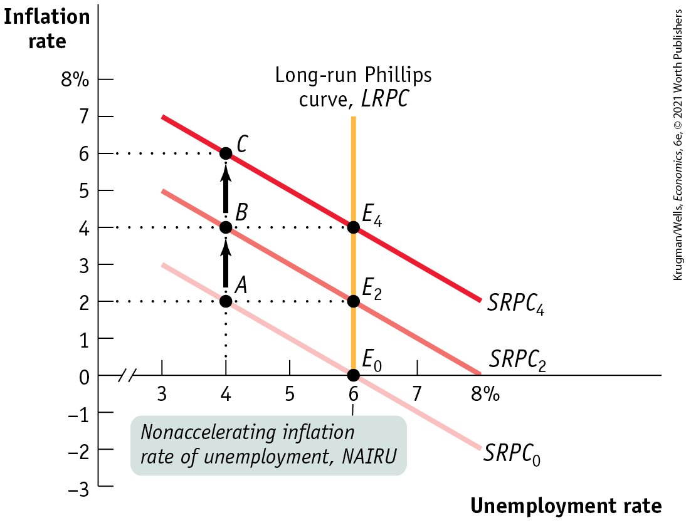
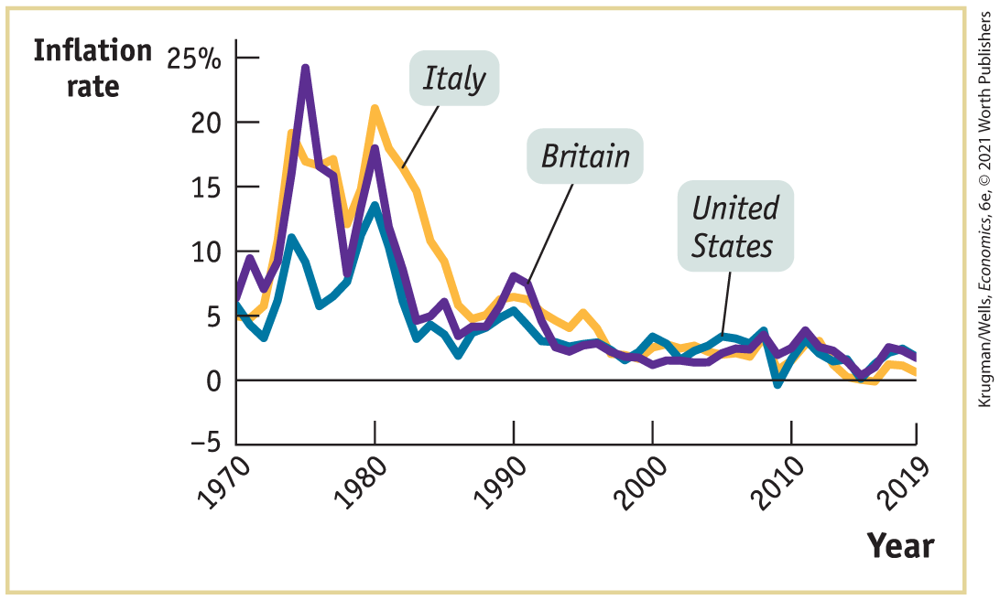
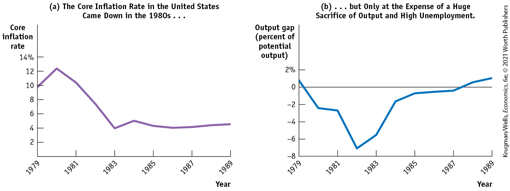

### ECONOMICS \>\> *in Action*

The Spanish Squeeze

The relationship between unemployment and inflation isn’t exact; few relationships in economics are. By February 2020 the U.S. unemployment rate had dropped to just 3.5%, well below its level before the 2008 financial crisis, yet inflation remained low. Economists weren’t sure why, although some suggested that the unemployment rate wasn’t as good an indicator of labor market tightness as it used to be.

We would still expect, however, to see really big moves in the unemployment rate reflected in the inflation rate. And this is in fact what we see looking at countries that experienced very high unemployment after the crisis.

Spain is an example of a country that has experienced dramatic ups and downs since the start of the twenty-first century. From 2000 to 2007 it experienced a huge boom, driven by an enormous housing bubble, bigger than the one experienced in the United States. When this bubble burst, Spain fell into a deep slump, made worse by large cuts in government spending intended to reassure investors worried about Spain’s government debt. As a result, the unemployment rate shot up, reaching an amazing 26% in 2013. Since then Spain has been achieving a gradual recovery.

Did the big swings in Spain’s unemployment rate lead to changes in the inflation rate? Yes. <a href="#kru_9781319245269_ch16_03.xhtml#pau_9781319320164_5OFGfY2aqZ" id="kru_9781319245269_ch16_03.xhtml#pau_9781319320164_lsv7CUsqhv" class="crossref">Figure 16-11</a> shows Spanish unemployment versus inflation (as measured by the GDP deflator) from 2000 to 2019. The low-unemployment-rate years were marked by relatively high inflation, the ultra-high-unemployment-rate years by very low inflation.

<figure id="pau_9781319320164_5OFGfY2aqZ" class="figure lm_img_lightbox num c3 main-flow">

<figcaption>
FIGURE 16-11 The Phillips Curve in Spain, 2000–2019

<em>Data from:</em> Organization for Economic Co-operation and Development.
</figcaption>
</figure>

<aside class="hidden" id="pau_9781319320164_VKQoluvYu9" title="hidden">

The vertical axis, labeled Inflation rate ranges from negative 1 to 5 percent in increments of 1 percent. The horizontal axis, labeled Unemployment rate ranges from 0 to 30 percent in increments of 5 percent. The graph plots dots at the approximate points as follows, (4, 3.5), (4.5, 4), (5, 4), (7, 2), (9, 3.5), (6, 4), (7, 4), (8, 3.8), (8, 4), (11, 1.5), (12, 1), (15, 1.5), (16, 0), (18, 0.25), (18, 0), (20, 0), (21, 0.5), (23, negative 0.25), (24, negative 0.2), and (26, 0.5).

</aside>
<!--
[Figure inside EIA- no caption]
-->

You may have noticed that for Spain, “low unemployment” still meant unemployment rates of 8% to 10%, high by U.S. standards. Indeed, Spain seems to have high measured unemployment even when the economy appears to be booming. One reason is that quite a few “unemployed” Spaniards actually do have jobs, but are working off the books to avoid taxes and regulations.

<!--
<strong class="important">[End EIA]</strong>
-->

### \>\> *Quick Review*

- **Okun’s law** describes the relationship between the output gap and cyclical unemployment.
- The **short-run Phillips curve** illustrates the negative relationship between unemployment and inflation.
- A negative supply shock shifts the short-run Phillips curve upward; a positive supply shock shifts it downward.
- An increase in the **expected rate of inflation** pushes the short-run Phillips curve upward: each additional percentage point of expected inflation pushes the actual inflation rate at any given unemployment rate up by 1 percentage point.
- In the 1970s, a series of negative supply shocks and a slowdown in labor productivity growth led to *stagflation* and an upward shift in the short-run Phillips curve.

### \>\> *Check Your Understanding* 16-2

1.  Explain how the short-run Phillips curve illustrates the negative relationship between cyclical unemployment and the actual inflation rate for a given level of the expected inflation rate.
2.  Which way does the short-run Phillips curve move in response to a fall in commodities prices? To a surge in commodities prices? Explain.

## Inflation and Unemployment in the Long Run

The short-run Phillips curve says that at any given point in time, there is a trade-off between unemployment and inflation. According to this view, policy makers have a choice: they can choose whether or not to accept the price of high inflation in order to achieve low unemployment. In fact, during the 1960s, many economists believed that this trade-off represented a real choice.

However, this view was greatly altered by the later recognition that expected inflation affects the short-run Phillips curve. In the short run, expectations often diverge from reality. In the long run, however, any consistent rate of inflation will be reflected in expectations. If inflation is consistently high, as it was in the 1970s, people will come to expect more of the same; if inflation is consistently low, as it has been in recent years, that, too, will become part of expectations.

So what does the trade-off between inflation and unemployment look like in the long run, when actual inflation is incorporated into expectations? Most macroeconomists believe that there is, in fact, no long-run trade-off. That is, it is not possible to achieve lower unemployment in the long run by accepting higher inflation. To see why, we need to introduce another concept: the *long-run Phillips curve.*

### The Long-Run Phillips Curve

<a href="#kru_9781319245269_ch16_04.xhtml#pau_9781319320164_qmaBfDOzus" id="kru_9781319245269_ch16_04.xhtml#pau_9781319320164_6VYYBgvh05" class="crossref">Figure 16-12</a> reproduces the two short-run Phillips curves from <a href="#kru_9781319245269_ch16_03.xhtml#pau_9781319320164_3x1ssfdopT" id="kru_9781319245269_ch16_04.xhtml#pau_9781319320164_dAbTMjO0ZH" class="crossref">Figure 16-9</a>, $SRPC_{0}$ and $SRPC_{2}$. It also adds an additional short-run Phillips curve, $SRPC_{4}$, representing a 4% expected rate of inflation. In a moment, we’ll explain the significance of the vertical long-run Phillips curve, *LRPC.*

<figure id="pau_9781319320164_qmaBfDOzus" class="figure lm_img_lightbox num c3 main-flow">

<figcaption>
FIGURE 16-12 The NAIRU and the Long-Run Phillips Curve

<em>S</em><em>R</em><em>P</em><em>C</em>0 is the short-run Phillips curve when the expected inflation rate is 0%. At a 4% unemployment rate, the economy is at point <em>A</em> with an actual inflation rate of 2%. The higher inflation rate will be incorporated into expectations, and the <em>SRPC</em> will shift upward to <em>S</em><em>R</em><em>P</em><em>C</em>2. If policy makers act to keep the unemployment rate at 4%, the economy will be at point <em>B</em> and the actual inflation rate will rise to 4%. Inflationary expectations will be revised upward again, and <em>SRPC</em> will shift to <em>S</em><em>R</em><em>P</em><em>C</em>4. At a 4% unemployment rate, the economy will be at point <em>C</em> and the actual inflation rate will rise to 6%. Here, an unemployment rate of 6% is the NAIRU, or nonaccelerating inflation rate of unemployment. As long as unemployment is at the NAIRU, the actual inflation rate will match expectations and remain constant. An unemployment rate below 6% requires ever-accelerating inflation. The long-run Phillips curve, <em>LRPC,</em> which passes through <em>E</em>0, <em>E</em>2, and <em>E</em>4, is vertical: no long-run trade-off between unemployment and inflation exists.
</figcaption>
</figure>

<aside class="hidden" id="pau_9781319320164_qBEvo25paf" title="hidden">

The vertical axis, labeled Inflation rate ranges from negative 3 to 8 percent in increments of 1 percent. The horizontal axis, labeled Unemployment rate is truncated and ranges from 3 to 8 percent in increments of 1 percent. A straight vertical line parallel to vertical axis labeled Long-run Phillips curve, L R P C starts from 6 percent on the horizontal axis. Three negative sloping straight lines parallel to each other labeled S R P C subscript 0, S R P C subscript 2, and S R P C subscript 4. S R P C subscript 4 is on the right of S R P C subscript 2 and S R P C subscript 0 is on the left of S R P C subscript 2. S R P C subscript 0 intersects the horizontal axis at E subscript 0 (6, 0), S R P C subscript 2 intersects L R P C at E subscript 2 (6, 2), and S R P C subscript 4 intersects L R P C at E subscript 4 (6, 4). An arrow is pointing from point A on S R P C subscript 0 to point B on S R P C subscript 2 and from point B on S R P C subscript 2 to point C on S R P C subscript 4. On the horizontal axis, 6 percent is labeled “Nonaccelerating inflation rate of unemployment, N A I R U.”

</aside>

Suppose that the economy has, in the past, had a 0% inflation rate. In that case, the current short-run Phillips curve will be $SRPC_{0}$, reflecting a 0% expected inflation rate. If the unemployment rate is 6%, the actual inflation rate will be 0%.

Also suppose that policy makers decide to trade off lower unemployment for a higher rate of inflation. They use monetary policy, fiscal policy, or both to drive the unemployment rate down to 4%. This puts the economy at point *A* on $SRPC_{0}$, leading to an actual inflation rate of 2%.

Over time, the public will come to expect a 2% inflation rate. *This increase in inflationary expectations will shift the short-run Phillips curve upward* to $SRPC_{2}$. Now, when the unemployment rate is 6%, the actual inflation rate will be 2%. Given this new short-run Phillips curve, policies adopted to keep the unemployment rate at 4% will lead to a 4% actual inflation rate — point *B* on $SRPC_{2}$ — rather than point *A* with a 2% actual inflation rate.

Eventually, the 4% actual inflation rate gets built into expectations about the future inflation rate, and the short-run Phillips curve shifts upward yet again to $SRPC_{4}$. To keep the unemployment rate at 4% would now require accepting a 6% actual inflation rate, point *C* on $SRPC_{4}$, and so on. In short, a persistent attempt to trade off lower unemployment for higher inflation leads to *accelerating* inflation over time.

*To avoid accelerating inflation over time, the unemployment rate must be high enough that the actual rate of inflation matches the expected rate of inflation.*

This is the situation at $E_{0}$ on $SRPC_{0}$: when the expected inflation rate is 0% and the unemployment rate is 6%, the actual inflation rate is 0%. It is also the situation at $E_{2}$ on $SRPC_{2}$: when the expected inflation rate is 2% and the unemployment rate is 6%, the actual inflation rate is 2%. And it is the situation at $E_{4}$ on $SRPC_{4}$: when the expected inflation rate is 4% and the unemployment rate is 6%, the actual inflation rate is 4%. This relationship between accelerating inflation and the unemployment rate is known as the *natural rate hypothesis.*

The unemployment rate at which inflation does not change over time — 6% in <a href="#kru_9781319245269_ch16_04.xhtml#pau_9781319320164_qmaBfDOzus" id="kru_9781319245269_ch16_04.xhtml#pau_9781319320164_XP2FKzzO2m" class="crossref">Figure 16-12</a> — is known as the <a href="#kru_9781319245269_EM_glossary.xhtml#pau_9781319320164_2usrZz8mHs" id="kru_9781319245269_ch16_04.xhtml#pau_9781319320164_yISSDEvXHx" class="glossref" role="doc-glossref">nonaccelerating inflation rate of unemployment</a>, or <a href="#kru_9781319245269_EM_glossary.xhtml#pau_9781319320164_2usrZz8mHs" id="kru_9781319245269_ch16_04.xhtml#pau_9781319320164_cukOvlw6HZ" class="glossref" role="doc-glossref">NAIRU</a> for short. Keeping the unemployment rate below the NAIRU leads to ever-accelerating inflation and cannot be maintained. Most macroeconomists believe that there is a NAIRU and that there is no long-run trade-off between unemployment and inflation.

<aside aria-label="title 1" class="glossary c3 main-flow v1" epub:type="glossary" id="pau_9781319320164_V2lyhOxJCF">

**nonaccelerating inflation rate of unemployment**  
The **nonaccelerating inflation rate of unemployment**, or **NAIRU**, is the unemployment rate at which inflation does not change over time.

</aside>

We can now explain the significance of the vertical line *LRPC.* It is the <a href="#kru_9781319245269_EM_glossary.xhtml#pau_9781319320164_fqoVOZP7hO" id="kru_9781319245269_ch16_04.xhtml#pau_9781319320164_T3LoVfA7iJ" class="glossref" role="doc-glossref">long-run Phillips curve</a>, the relationship between unemployment and inflation in the long run, after expectations of inflation have had time to adjust to experience. It is vertical because any unemployment rate below the NAIRU leads to ever-accelerating inflation. In other words, the long-run Phillips curve shows that there are limits to expansionary policies, because an unemployment rate below the NAIRU cannot be maintained in the long run. Moreover, there is a corresponding point we have not yet emphasized: any unemployment rate above the NAIRU leads to decelerating inflation.

<aside aria-label="title 1" class="glossary c3 main-flow v1" epub:type="glossary" id="pau_9781319320164_iX9qyIr0dd">

**long-run Phillips curve**  
The **long-run Phillips curve** shows the relationship between unemployment and inflation after expectations of inflation have had time to adjust to experience.

</aside>

### The Natural Rate of Unemployment, Revisited

Recall that the natural rate of unemployment is the portion of the unemployment rate unaffected by the swings of the business cycle. Now we have introduced the concept of the *NAIRU.* How do these two concepts relate to each other?

The answer is that the NAIRU is another name for the natural rate. The level of unemployment the economy needs in order to avoid accelerating inflation is equal to the natural rate of unemployment.

In fact, economists estimate the natural rate of unemployment by looking for evidence about the NAIRU from the behavior of the inflation rate and the unemployment rate over the course of the business cycle. For example, the way major European countries learned, to their dismay, that their natural rates of unemployment had risen 9% or more by around 1990, was through unpleasant experience. In the late 1980s, and again in the late 1990s, European inflation began to accelerate as European unemployment rates, which had been above 9%, began to fall, approaching 8%.

In <a href="#kru_9781319245269_ch16_03.xhtml#pau_9781319320164_hp8XXZw0SA" id="kru_9781319245269_ch16_04.xhtml#pau_9781319320164_mhf49AhLrh" class="crossref">Figure 16-4</a> we cited Congressional Budget Office estimates of the U.S. natural rate of unemployment. The CBO has a model that predicts changes in the inflation rate based on the deviation of the actual unemployment rate from the natural rate. Given data on actual unemployment and inflation, this model can be used to deduce estimates of the natural rate — and that’s where the CBO numbers come from. In 2017, the CBO estimate of the U.S. natural rate was 4.7%.

<!--
[<strong class="important">Comp: the following Global box should fall close to or within the H2 section on the costs of disinflation that follows it.]</strong>
--> <!--
<strong class="important">[Start GC Box]</strong>
-->
<aside class="case-study c3 main-flow v5" epub:type="case-study" id="pau_9781319320164_7wHWKJ85rN" title="GLOBAL COMPARISON">

#### Global comparison

DISINFLATION AROUND THE WORLD

The disinflation of the 1980s wasn’t unique to the United States. A number of other advanced countries also experienced high inflation during the 1970s, then brought inflation down during the 1980s at the cost of a severe recession. This figure shows the annual rate of inflation in Britain, Italy, and the United States from 1970 to 2019. All three nations experienced high inflation rates following the two oil price shocks of 1973 and 1979, with the U.S. inflation rate the least severe of the three. All three nations then weathered severe recessions in order to bring inflation down. Since the 1980s, inflation has remained low and stable in all wealthy nations.

<figure id="pau_9781319320164_C74a9hXrK8" class="figure lm_img_lightbox unnum c4 center">

<figcaption>
<em>Data from:</em> World Development Indicators, World Bank.
</figcaption>
</figure>

<aside class="hidden" id="pau_9781319320164_JZLKTw3qJi" title="hidden">

The vertical axis, labeled Inflation rate ranges from negative 5 to 25 percent in increments of 5 percent. The horizontal axis, labeled Year ranges from 1970 to 2010 in increments of 10 years with an additional marking at 2019. The curve representing Italy passes through the approximate points, (1970, 5), (1975, 19), (1978, 10), (1980, 21), (1990, 5), (2000, 4), (2010, 3), (2012, 0), (2015, 0), and (2019, 1). The curve representing Britain passes through the approximate points, (1970, 6), (1975, 25), (1979, 8), (1980, 18), (1990, 7), (2000, 1), (2010, 2), and (2019, 2). The curve representing United States passes through the approximate points, (1970, 5), (1975, 10), (1980, 14), (1985, 3), (1990, 5), (2000, 4), (2010, 0), and (2012, 4).

</aside>
<!--
[figure inside global comparison box- no caption]
--> <!--
<strong class="important">[End GC Box]</strong>
-->
</aside>

### The Costs of Disinflation

Through experience, policy makers have found that bringing inflation down is a much harder task than increasing it. The reason is that once the public has come to expect continuing inflation, bringing inflation down is painful.

A persistent attempt to keep unemployment below the natural rate leads to accelerating inflation that becomes incorporated into expectations. To reduce inflationary expectations, policy makers need to run the process in reverse, adopting contractionary policies that keep the unemployment rate above the natural rate for an extended period of time. The process of bringing down inflation that has become embedded in expectations is known as *disinflation,* a concept discussed in <a href="#kru_9781319245269_ch08_01.xhtml#pau_9781319320164_6AH2l2uZnD" id="kru_9781319245269_ch16_04.xhtml#pau_9781319320164_SYRjjl3cL3" class="crossref">Chapter 8</a>.

Disinflation can be very expensive. As the following Economics in Action documents, the U.S. retreat from high inflation at the beginning of the 1980s appears to have cost the equivalent of about 18% of a year’s real GDP, the equivalent of roughly \$3.7 trillion today. The justification for paying these costs is that they lead to a permanent gain. Although the economy does not recover the short-term production losses caused by disinflation, it no longer suffers from the costs associated with persistently high inflation. In fact, the United States, Britain, and other wealthy countries that experienced inflation in the 1970s eventually decided that the benefit of bringing inflation down was worth the required suffering — the large reduction in real GDP in the short term.

Some economists argue that the costs of disinflation can be reduced if policy makers explicitly state their determination to reduce inflation. A clearly announced, credible policy of disinflation, they contend, can reduce expectations of future inflation and so shift the short-run Phillips curve downward. Some economists believe that the clear determination of the Federal Reserve to combat the inflation of the 1970s was credible enough that the costs of disinflation, huge though they were, were lower than they might otherwise have been.

<!--
<strong class="important">[Start EIA]</strong>
-->

### ECONOMICS \>\> *in Action*

The Great Disinflation of the 1980s

As we’ve mentioned, the United States ended the 1970s with a high rate of inflation, at least by its own peacetime historical standards — 14% in 1980. Part of this inflation was the result of one-time events, especially a world oil crisis. But expectations of future inflation at 10% or more per year appeared to be firmly embedded in the economy.

By the mid-1980s, however, inflation was running at about 4% per year. Panel (a) of <a href="#kru_9781319245269_ch16_04.xhtml#pau_9781319320164_8m6sr8Gmse" id="kru_9781319245269_ch16_04.xhtml#pau_9781319320164_YMQxb6DRNY" class="crossref">Figure 16-13</a> shows the annual rate of change in the “core” consumer price index (CPI) — also called the *core inflation rate.* This index, which excludes volatile energy and food prices, is widely regarded as a better indicator of underlying inflation trends than the overall CPI. By this measure, inflation fell from about 12% at the end of the 1970s to about 4% by the mid-1980s.

<figure id="pau_9781319320164_8m6sr8Gmse" class="figure lm_img_lightbox num c4 main-flow">

<figcaption>
FIGURE 16-13 The Great Disinflation

<em>Data from:</em> Bureau of Labor Statistics; Congressional Budget Office.
</figcaption>
</figure>

<aside class="hidden" id="pau_9781319320164_UZnguLZqHe" title="hidden">

Graph a, The core inflation rate in the United States came down in the 1980s ellipsis: The vertical axis, labeled core inflation rate ranges from 0 to 14 percent in increments of 2 percent. The horizontal axis, labeled Year ranges from 1979 to 1989 in increments of 2 years. The graph plots a curve that passes through the following approximate points, (1979, 10), (1980, 12.5), (1981, 10), (1983, 4), (1984, 5), (1985, 4.5), (1986, 4), (1987, 4.5), (1988, 5), and (1989, 5.5). Graph b, ellipsis, but only at the expense of a huge sacrifice of output and high unemployment: The vertical axis, labeled Output gap (percent of potential output) ranges from negative 8 to 2 percent in increments of 2 percent. The horizontal axis, labeled Year ranges from 1979 to 1989 in increments of 2 years. The graph plots a curve that passes through the following approximate points, (1979, 0.7), (1980, negative 2.4), (1981, negative 2.5), (1982, negative 7), (1983, negative 6.5), (1984, negative 1.5), (1985, negative 1), (1987, negative 0.5), (1988, 1), and (1989, 1.5).

</aside>

How was this disinflation achieved? At great cost. Beginning in late 1979, the Federal Reserve imposed strongly contractionary monetary policies, which pushed the economy into a severe recession — at that point the worst since the Great Depression, although it would later be surpassed by the Great Recession of 2007–2009. Panel (b) shows the Congressional Budget Office estimate of the U.S. output gap from 1979 to 1989: by 1982, actual output was 7% below potential output, corresponding to an unemployment rate of more than 9%. Aggregate output didn’t get back to potential output until 1987.

Our analysis of the Phillips curve tells us that a temporary rise in unemployment, like that of the 1980s, is needed to break the cycle of inflationary expectations. Once expectations of inflation are reduced, the economy can return to the natural rate of unemployment at a lower inflation rate. And that’s just what happened.

But the cost was huge. If you add up the output gap over 1980–1987, you find that the economy sacrificed approximately 18% of an average year’s output over the period. If we had to do the same thing today, that would mean giving up roughly \$4 trillion worth of goods and services.

<!--
<strong class="important">[End EIA]</strong>
-->

### \>\> *Quick Review*

- Policies that keep the unemployment rate below the **NAIRU, the nonaccelerating rate of inflation**, will lead to accelerating inflation as inflationary expectations adjust to higher levels of actual inflation. The NAIRU is equal to the natural rate of unemployment.
- The **long-run Phillips curve** is vertical and shows that an unemployment rate below the NAIRU cannot be maintained in the long run. As a result, there are limits to expansionary policies.
- *Disinflation* imposes high costs — unemployment and lost output — on an economy. Governments adopt it to avoid the costs of persistently high inflation.

### \>\> *Check Your Understanding* 16-3

1.  Why is there no long-run trade-off between unemployment and inflation?
2.  British economists believe that the natural rate of unemployment in their country rose sharply during the 1970s, from around 3% to as much as 10%. During that period, Britain experienced a sharp acceleration of inflation, which for a time went above 20%. How might these facts be related?
3.  Why is disinflation so costly for an economy? Are there ways to reduce these costs?

## Deflation

Before World War II, *deflation* — a falling aggregate price level — was almost as common as inflation. (We introduced deflation in <a href="#kru_9781319245269_ch06_01.xhtml#pau_9781319320164_pwjl1z83pa" id="kru_9781319245269_ch16_05.xhtml#pau_9781319320164_nnbj3hsYhe" class="crossref">Chapter 6</a>.) In fact, the U.S. consumer price index on the eve of World War II was 30% lower than it had been in 1920. After World War II, inflation became the norm in all countries. But in the 1990s, deflation reappeared in Japan and proved difficult to reverse. Concerns about potential deflation played a crucial role in U.S. monetary policy in the early 2000s and again in the aftermath of the 2008 financial crisis.

Why is deflation a problem? And why is it hard to end?

### Debt Deflation

Deflation, like inflation, produces both winners and losers — but in the opposite direction. Due to the falling price level, a dollar in the future has a higher real value than a dollar today. So lenders, who are owed money, gain under deflation because the real value of borrowers’ payments increases. Borrowers lose because the real burden of their debt rises.

In a famous analysis at the beginning of the Great Depression, Irving Fisher (who first analyzed the *Fisher effect* of expected inflation on interest rates, described in <a href="#kru_9781319245269_ch10_01.xhtml#pau_9781319320164_GbPAtnS6LO" id="kru_9781319245269_ch16_05.xhtml#pau_9781319320164_TLwaEkrbR6" class="crossref">Chapter 10</a>) claimed that the effects of deflation on borrowers and lenders can worsen an economic slump. Deflation, in effect, takes real resources away from borrowers and redistributes them to lenders.

Fisher argued that borrowers, who lose from deflation, are typically short of cash and will be forced to cut their spending sharply when their debt burden rises. Lenders, however, are unlikely to increase spending sharply when the values of the loans they own rise. The overall effect, said Fisher, is that deflation reduces aggregate demand, deepening an economic slump, which, in a vicious circle, may lead to further deflation. The effect of deflation in reducing aggregate demand, known as <a href="#kru_9781319245269_EM_glossary.xhtml#pau_9781319320164_a5m4aIUPQs" id="kru_9781319245269_ch16_05.xhtml#pau_9781319320164_ojnex8NsGt" class="glossref" role="doc-glossref">debt deflation</a>, probably played a significant role in the Great Depression.

<aside aria-label="title 1" class="glossary c3 main-flow v1" epub:type="glossary" id="pau_9781319320164_slF1ggdSfB">

**debt deflation**  
**Debt deflation** is the reduction in aggregate demand arising from the increase in the real burden of outstanding debt caused by deflation.

</aside>
