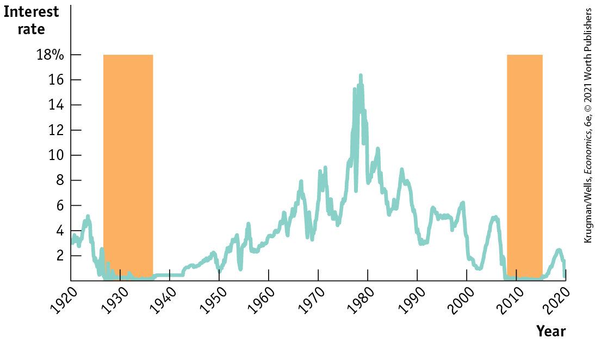
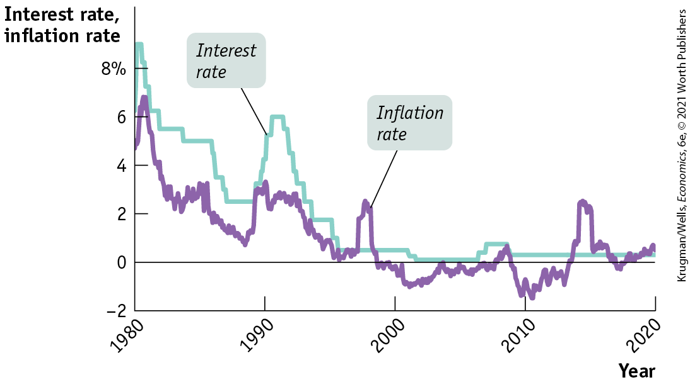
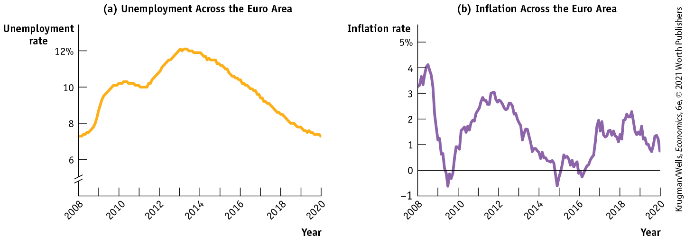
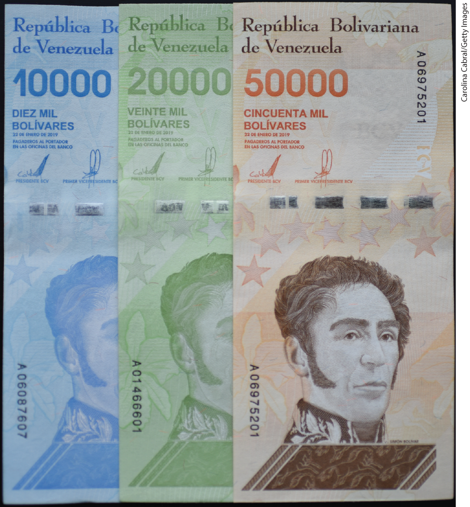
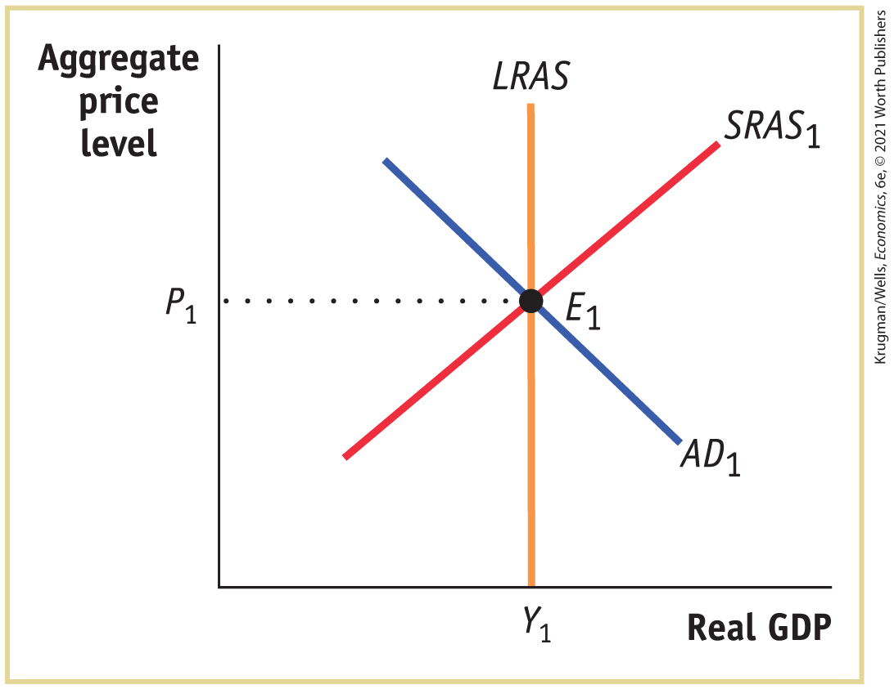
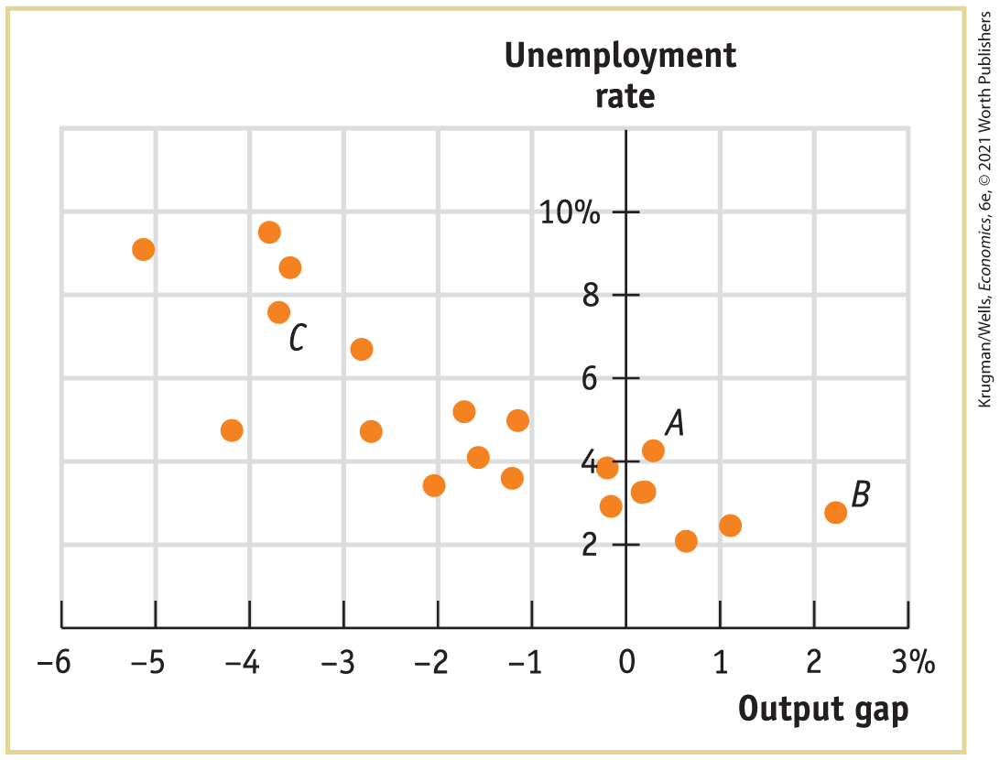

### Effects of Expected Deflation

<!--
<strong class="important">[AU: Confirm that Figure 10-9 reference is correct. ]</strong>
-->

Like expected inflation, expected deflation affects the nominal interest rate. Look back at <a href="#kru_9781319245269_ch10_02.xhtml#pau_9781319320164_P72TPZZINi" id="kru_9781319245269_ch16_05.xhtml#pau_9781319320164_GAH6CmB68E" class="crossref">Figure 10-9</a>, which demonstrated how expected inflation affects the equilibrium interest rate. In <a href="#kru_9781319245269_ch10_02.xhtml#pau_9781319320164_P72TPZZINi" id="kru_9781319245269_ch16_05.xhtml#pau_9781319320164_yGMdITViDY" class="crossref">Figure 10-9</a>, the equilibrium nominal interest rate is 4% if the expected inflation rate is 0%. But, if the expected inflation rate is $- 3\%$ — if the public expects deflation at 3% per year — the equilibrium nominal interest rate would fall to 1%.

But what would happen if the expected rate of inflation is $- 6\%$? Would the nominal interest rate fall to $- 2\%$, in which lenders are paying borrowers 2% on their debt? Probably not, because they could do better by simply holding cash. As explained in <a href="#kru_9781319245269_ch15_01.xhtml#pau_9781319320164_4oAIkgdXHI" id="kru_9781319245269_ch16_05.xhtml#pau_9781319320164_WHCmasT5SM" class="crossref">Chapter 15</a>, we now know that there isn’t a strict zero lower bound because holding lots of cash is inconvenient. But the nominal rate clearly can’t go more than a small amount below zero.

This restriction — called the *zero lower bound problem* — can limit the effectiveness of monetary policy. Suppose the economy is depressed, with output below potential output and the unemployment rate above the natural rate. Normally the central bank can respond by cutting interest rates to increase aggregate demand. If the nominal interest rate is already zero, however, the central bank cannot push it down any further. The central bank is up against the zero lower bound for the nominal interest rate. Banks refuse to lend and consumers and firms refuse to spend because, with a negative inflation rate and a 0% nominal interest rate, holding cash yields a positive real return: with falling prices, a given amount of cash buys more over time. Any further increases in the monetary base will either be held in bank vaults or held as cash by individuals and firms, without being spent.

A situation in which conventional monetary policy to fight a slump — cutting interest rates — can’t be used because nominal interest rates can’t be cut further is known as a <a href="#kru_9781319245269_EM_glossary.xhtml#pau_9781319320164_cCK0WvzBBD" id="kru_9781319245269_ch16_05.xhtml#pau_9781319320164_YhX6XTUBr2" class="glossref" role="doc-glossref">liquidity trap</a>. A liquidity trap can occur whenever there is a sharp reduction in demand for loanable funds — which is exactly what happened during the Great Depression. <a href="#kru_9781319245269_ch16_05.xhtml#pau_9781319320164_BXmGfBgSZE" id="kru_9781319245269_ch16_05.xhtml#pau_9781319320164_pawy18b5Bj" class="crossref">Figure 16-14</a> shows the interest rate on short-term U.S. government debt from 1920 to 2020. As you can see, during the period from 1933 to the post–World War II recovery, the U.S. economy was either close to or up against the zero lower bound. After World War II, when inflation became the norm around the world, the zero lower bound largely vanished as a problem, as the public came to expect inflation rather than deflation. As a result, economists largely lost interest in the issue.

<aside aria-label="glossary_2" class="glossary c3 main-flow v1" epub:type="glossary" id="pau_9781319320164_qvfUM7yttT">

**liquidity trap**  
The economy is in a **liquidity trap** when conventional monetary policy is ineffective because the nominal interest rate is up against the zero lower bound.

</aside>

<figure id="pau_9781319320164_BXmGfBgSZE" class="figure lm_img_lightbox num c3 main-flow">

<figcaption>
FIGURE 16-14 The Zero Lower Bound in the U.S. Economy

This figure shows U.S. short-term interest rates, specifically the interest rate on three-month Treasury bills, from 1920 to 2020. As shown by the shaded bar at left, for much of the 1930s, interest rates were very close to zero, leaving little room for expansionary monetary policy. After World War II, persistent inflation generally kept interest rates well above zero. However, in late 2008, in the wake of the housing bubble bursting and the financial crisis, the interest rate on three-month Treasury bills was again virtually zero and stayed there for almost eight years — shown by the shaded bar at right.

<em>Data from:</em> National Bureau of Economic Research; Federal Reserve Bank of St. Louis.
</figcaption>
</figure>

<aside class="hidden" id="pau_9781319320164_745ua1AdaX" title="hidden">

The vertical axis, labeled interest rate ranges from 0 to 18 percent in increments of 2 percent. The horizontal axis, labeled year ranges from 1920 to 2020 in increments of 10 years. The graph plots a fluctuating curve that passes through the following approximate points, (1920, 3.3), (1923, 5), (1928, 0.2), (1936, 0.2), (1940, 0.5), (1950, 1), (1960, 3), (1965, 6), (1970, 9), (1980, 17), (1985, 6), (1990, 4), (2000, 2), (2005, 5), (2008, 0), (2015, 0), (2018, 3), and (2020, 0.2). Two vertical bars indicate recessions, one is between 1928 and 1936, and another is between 2008 and 2015.

</aside>

But, as you can see, the zero lower bound emerged again as a result of the financial crisis of 2008, and again during the coronavirus pandemic. Once more, the interest rate on three-month U.S. Treasury bills was virtually zero. Yet for reasons not entirely clear, the United States did not experience deflation during the Great Recession. Sticky wages may have been the cause, since the United States did not experience a significant fall in nominal wages although unemployment shot up.

The recent history of the Japanese economy, shown in <a href="#kru_9781319245269_ch16_05.xhtml#pau_9781319320164_7VNKLh7pIu" id="kru_9781319245269_ch16_05.xhtml#pau_9781319320164_1EVEJD3DJ0" class="crossref">Figure 16-15</a>, provides the best modern illustration of the problem of deflation and the liquidity trap. In the 1990s, after the bursting of a huge housing and stock bubble, the Japanese economy entered a period of sustained weakness in which wages and prices fell. In an effort to fight the economic weakness, the Bank of Japan — the equivalent of the Federal Reserve — repeatedly cut interest rates. Eventually, it arrived at the ZIRP: the *zero interest rate policy.* The call money rate, the equivalent of the U.S. federal funds rate, was literally set equal to zero. Because the economy was still depressed, it would have been desirable to cut interest rates even further. But that wasn’t possible: Japan was up against the zero lower bound. And it was still there in 2020, nearly 25 years later!

<figure id="pau_9781319320164_7VNKLh7pIu" class="figure lm_img_lightbox num c3 main-flow">

<figcaption>
FIGURE 16-15 Deflation and the Liquidity Trap in the Japanese Economy

A prolonged economic slump in Japan led to deflation from the late 1990s on. The Bank of Japan responded by cutting interest rates — but eventually ran up against the zero lower bound where it remained in 2020, over 20 years later.

<em>Data from:</em> Federal Reserve Bank of St. Louis.
</figcaption>
</figure>

<aside class="hidden" id="pau_9781319320164_m8nU6Tp6ef" title="hidden">

The vertical axis, labeled Interest rate, Inflation rate ranges from negative 2 to 8 percent in increments of 2 percent. The horizontal axis, labeled year ranges from 1980 to 2020 in increments of 10 years. The curve for interest rate passes through the following approximate points, (1980, 6.2), (1981, 9), (1985, 5), (1987, 2.5), (1990, 2.5), (1992, 6), (1995, 2), (1996, 0.5), (2000, 0.5), (2002, 0.1), (2007, 0.2), (2008, 1), (2009, 1), (2010, 0.5), and (2020, 0.5). The curve for inflation rate passes through the following approximate points, (1980, 5), (1981, 7), (1985, 3), (1989, 1), (1990, 3), (1995, 0.1), (1998, 3), (2000, negative 0.1), (2002, negative 1), (2005, 0), (2008, 1), (2010, negative 1.5), (2015, 3), (2017, 0), and (2020, 1).

</aside>

In the aftermath of the 2008 financial crisis, the world’s most important central banks — the U.S. Federal Reserve and the European Central Bank — found themselves facing much of the same problems as the Bank of Japan had faced since the 1990s: their economies remained depressed despite policy interest rates close to zero and inflation persistently below target. In 2014, neither the United States nor the euro area was experiencing actual deflation, but as the following Economics in Action describes, Europe did get alarmingly close.

<!--
<strong class="important">[Start EIA]</strong>
--> <!--
<strong class="important">[Comp: insert globe icon]</strong>
-->

### ECONOMICS \>\> *in Action*

Is Europe Turning Japanese?

In the aftermath of the 2008 financial crisis, officials at the Federal Reserve were deeply worried about the possibility of *Japanification* — that is, they worried that, like Japan since the 1990s, the United States might find itself stuck in a deflationary trap. To avoid this possibility, they took some extraordinary measures, notably the large-scale purchases of assets — so-called *quantitative easing* — described in <a href="#kru_9781319245269_ch15_01.xhtml#pau_9781319320164_4oAIkgdXHI" id="kru_9781319245269_ch16_05.xhtml#pau_9781319320164_jLfSySP9pP" class="crossref">Chapter 15</a>. By 2017, the danger of deflation in the United States seemed to have receded, and the Fed began to normalize its policy.

But Europe was a different story. Where the U.S. recovery from the recession of 2007–2009 was steady, if disappointingly slow, the euro area, held back by debt crises, slid back into recession in late 2011. Growth resumed in 2013, but as you can see from panel (a) of <a href="#kru_9781319245269_ch16_05.xhtml#pau_9781319320164_qlyTEFNIPF" id="kru_9781319245269_ch16_05.xhtml#pau_9781319320164_L49dfLic90" class="crossref">Figure 16-16</a>, it only led to a modest decline in high unemployment. And as panel (b) of <a href="#kru_9781319245269_ch16_05.xhtml#pau_9781319320164_qlyTEFNIPF" id="kru_9781319245269_ch16_05.xhtml#pau_9781319320164_Gg4IrzxDC6" class="crossref">Figure 16-16</a> shows, in 2013–2017 inflation began sliding below 1%, leading to worries that Europe was on track to replicate Japan’s economic situation.

<figure id="pau_9781319320164_qlyTEFNIPF" class="figure lm_img_lightbox num c4 main-flow">

<figcaption>
FIGURE 16-16 Trouble in Europe, 2008–2020

<em>Data from:</em> Eurostat.
</figcaption>
</figure>

<aside class="hidden" id="pau_9781319320164_EuxVuC2WZv" title="hidden">

Graph a, Unemployment across the Euro area: The vertical axis, labeled unemployment rate is truncated and ranges from 6 to 12 percent in increments of 2 percent. The horizontal axis, labeled Year ranges from 2008 to 2020 in increments of 1 year. The graph plots a curve that passes through the following approximate points, (2008, 7.2), (2009, 8), (2010, 10), (2012, 10), (2015, 12), (2016, 10), and (2020, 8). Graph b, Inflation across the Euro area: The vertical axis, labeled inflation rate ranges from negative 1 to 5 percent in increments of 1 percent. The horizontal axis, labeled Year ranges from 2008 to 2020 in increments of 1 year. The graph plots a curve that passes through the following approximate points, (2008, 3.3), (2009, 1), (2010, 1), (2012, 3), (2015, negative 0.6), (2016, negative 0.2), (2017, 2), (2018, 1.5), (2019, 1.5), and (2020, 1). The curve also has a minimum point of negative 0.6 between years 2009 and 2010.

</aside>

While Europe was not yet experiencing sustained deflation as of 2017, it was, as the International Monetary Fund put it, suffering from *lowflation* — inflation persistently below target — and this created many of the same problems. In particular, lower-than-expected inflation was worsening the problems of highly indebted nations, like Portugal, Spain, and Greece.

And like the Bank of Japan a number of years earlier, the European Central Bank was finding it hard to devise an effective answer to the problem. Beginning in June 2014, the ECB took the extraordinary step of reducing one of its key policy rates, the interest rate it pays on deposits of private banks, to *minus* 0.1% — that is, it began actually charging banks a fee for holding their money. But below-target inflation persisted.

<!--
<strong class="important">[End EIA]</strong>
-->

### \>\> *Quick Review*

- Unexpected deflation helps lenders and hurts borrowers. This can lead to **debt deflation**, which has a contractionary effect on aggregate demand.
- Deflation makes it more likely that interest rates will end up against the zero lower bound. When this happens, the economy is in a **liquidity trap**, and monetary policy is ineffective.

### \>\> *Check Your Understanding* 16-4

1.  Why won’t anyone lend money at a negative nominal rate of interest? How can this pose problems for monetary policy?

<!--
<strong class="important">[Comp: chapter&#x2019;s business case follows on a new page and runs 2-column on a single page]</strong>
--> <!--
<strong class="important">[Start Business Case]</strong>
--> <!--
<strong class="important">[Comp: insert globe icon]</strong>
-->

## Business Case 

Hyperinflation as a Business Opportunity

 <!--
[BC photo NO CAPTION]
-->

We often say that modern governments with fiat currencies simply print their own currencies. But sometimes that’s not literally true — what they actually do is hire private companies to print money for them. That’s what happened in November 2019, when Venezuela signed a contract with Goznak, a Russian money-printing company, to churn out 300 million bolivar bills, in denominations running from 10,000 to 50,000 bolivars.

<figure id="pau_9781319320164_H1DHQgr44d" class="figure lm_img_lightbox unnum c2 right">

</figure>

Venezuela’s use of a foreign money-printer isn’t actually that unusual. Printing currency that isn’t easy to counterfeit requires a fair bit of technical expertise and specialized equipment, so many countries contract the work out. Even Britain subcontracts the printing of pound banknotes to De La Rue, a 200-year-old company that, for example, supplied currency for the pre-Communist government of China.

Indeed, Venezuela has relied on De La Rue in the past. But as of 2019 it still owed the company money for past work, and none of De La Rue’s usual competitors were willing to take the business. Hence the choice of Goznak, which happens to be owned by the Russian government.

There were two unusual things about the Goznak contract. One was the fact that the order was quite small — just \$143 million in face value, which isn’t much even for a country the size of Venezuela. Yet this amounted to about one-fifth of the value of Venezuelan currency in circulation at the time. The other was the unusually high fee — about 5% of the value of the notes. This high fee partly reflected the low purchasing power of the notes: the cost of printing a 10,000 bolivar note is presumably not very different from the cost of printing, say, a \$20 bill, but even at the time the Venezuelan note was worth only around \$0.14.

Still, business is business, and Goznak’s contract showed that even bad times offer opportunities.

<aside class="assessments c3 main-flow v1" epub:type="assessments" id="pau_9781319320164_aD7PyTFl22">

### Questions for thought

1.  Why was Venezuela so desperate to hire someone to print more money?
2.  Why did such a small order for new currency account for such a large fraction of the existing money supply?
3.  How would you classify the fees paid to Goznak under the general category of costs of inflation?

</aside>

### Summary

1.  In analyzing high inflation, economists use the **classical model of the price level**, which says that changes in the money supply lead to proportional changes in the aggregate price level even in the short run.
2.  Governments sometimes print money in order to finance budget deficits. When they do, they impose an **inflation tax**, generating tax revenue equal to the inflation rate times the money supply, on those who hold money. Revenue from the real inflation tax, the inflation rate times the real money supply, is the real value of resources captured by the government. In order to avoid paying the inflation tax, people reduce their real money holdings and force the government to increase inflation to capture the same amount of real inflation tax revenue. In some cases, this leads to a vicious circle of a shrinking real money supply and a rising rate of inflation, leading to hyperinflation and a fiscal crisis.
3.  The output gap is the percentage difference between the actual level of real GDP and potential output. A positive output gap is associated with lower-than-normal unemployment; a negative output gap is associated with higher-than-normal unemployment. The relationship between the output gap and cyclical unemployment is described by **Okun’s law.**
4.  Countries that don’t need to print money to cover government deficits can still stumble into moderate inflation, either because of political opportunism or because of wishful thinking.
5.  At a given point in time, there is a downward-sloping relationship between unemployment and inflation known as the **short-run Phillips curve.** This curve is shifted by changes in the **expected rate of inflation.** The **long-run Phillips curve**, which shows the relationship between unemployment and inflation once expectations have had time to adjust, is vertical. It defines the **nonaccelerating inflation rate of unemployment**, or **NAIRU**, which is equal to the natural rate of unemployment. *Stagflation,* a combination of high unemployment and high inflation, reflects an upward shift of the short-run Phillips curve.
6.  Once inflation has become embedded in expectations, getting inflation back down can be difficult because *disinflation* can be very costly, requiring the sacrifice of large amounts of aggregate output and imposing high levels of unemployment. However, policy makers in the United States and other wealthy countries were willing to pay that price of bringing down the high inflation of the 1970s.
7.  Deflation poses several problems. It can lead to **debt deflation**, in which a rising real burden of outstanding debt intensifies an economic downturn. Also, nominal interest rates are more likely to run up against the zero lower bound in an economy experiencing deflation. When this happens, the economy enters a **liquidity trap**, rendering conventional monetary policy ineffective.

### Key Terms

- <a href="#kru_9781319245269_ch16_02.xhtml#pau_9781319320164_o3m2mnb6Ca" id="kru_9781319245269_ch16_07.xhtml#pau_9781319320164_VhoFxn99aT" class="crossref">Classical model of the price level</a>
- <a href="#kru_9781319245269_ch16_02.xhtml#pau_9781319320164_huYb6icwVm" id="kru_9781319245269_ch16_07.xhtml#pau_9781319320164_K24zgOotNe" class="crossref">Inflation tax</a>
- <a href="#kru_9781319245269_ch16_03.xhtml#pau_9781319320164_W1TPc0he7y" id="kru_9781319245269_ch16_07.xhtml#pau_9781319320164_8XMn2PyU6h" class="crossref">Okun’s law</a>
- <a href="#kru_9781319245269_ch16_03.xhtml#pau_9781319320164_TV6azxMCQK" id="kru_9781319245269_ch16_07.xhtml#pau_9781319320164_zgWv9WY7YY" class="crossref">Short-run Phillips curve</a>
- <a href="#kru_9781319245269_ch16_03.xhtml#pau_9781319320164_VhAiNPgtPB" id="kru_9781319245269_ch16_07.xhtml#pau_9781319320164_Q3W5JbZw2k" class="crossref">Expected rate of inflation</a>
- <a href="#kru_9781319245269_ch16_04.xhtml#pau_9781319320164_yISSDEvXHx" id="kru_9781319245269_ch16_07.xhtml#pau_9781319320164_q0wHYxJd0B" class="crossref">Nonaccelerating inflation rate of unemployment (NAIRU)</a>
- <a href="#kru_9781319245269_ch16_04.xhtml#pau_9781319320164_T3LoVfA7iJ" id="kru_9781319245269_ch16_07.xhtml#pau_9781319320164_w2FeGTMBab" class="crossref">Long-run Phillips curve</a>
- <a href="#kru_9781319245269_ch16_05.xhtml#pau_9781319320164_VsxGeP0Wng" id="kru_9781319245269_ch16_07.xhtml#pau_9781319320164_2m50GmhY5P" class="crossref">Debt deflation</a>
- <a href="#kru_9781319245269_ch16_05.xhtml#pau_9781319320164_YhX6XTUBr2" id="kru_9781319245269_ch16_07.xhtml#pau_9781319320164_lHCpPeCtVd" class="crossref">Liquidity trap</a>

### Practice questions

1.  Throughout the textbook, we relied on a traditional upward-sloping short-run aggregate supply curve. But across the profession there is a large debate around the actual slope of the short-run aggregate supply curve. Many economists believe the *SRAS* curve is much “flatter” than depicted in the book. Explain how a flatter *SRAS* curve affects the Phillips curve and the short-run trade-off between inflation and unemployment following expansionary monetary and fiscal policy.

2.  During the onset of the economic shutdown tied to COVID-19, many economists were debating the effects the economic shutdown and subsequent policy efforts would have on future inflation. Explain how each of the following events will affect the short-run Phillips curve. Treat each part as a unique event.
    1.  A decline in consumer spending in expectation of a slowdown in future economic activity.
    2.  An increase in expansionary fiscal and monetary policy.
    3.  A shutdown of global production has made it difficult for producers to maintain production for essential goods, causing production costs to increase.

3.  You recently read two quotes, one from an article in *National Review:* “Then there are the costs of shortening the global supply chains and perhaps re-domesticating some production. Entirely without economic theory, simply from observing how the world economy.” The author came to an inevitable conclusion, “There will be inflation. How much inflation? … I’d say low double digits in the United States by the first months of 2022.”

    And the other from Olivier Blanchard, past chief economist for the International Monetary Fund, “Will falling commodity prices, stumbling oil prices, and a depressed labour market bring low inflation and perhaps even deflation, or will very large increases in fiscal deficits and central bank balance sheets bring inflation?” Blanchard went on to conclude, “The challenge for monetary and fiscal policy is thus likely to be to sustain demand and avoid deflation rather than the reverse.”

    Given the extreme range of opinions, how would you assess each statement over the next one to two years?

### Problems

1.  In the economy of Scottopia, policy makers want to lower the unemployment rate and raise real GDP by using monetary policy. Using the accompanying diagram, show why this policy will ultimately result in a higher aggregate price level but no change in real GDP.

    <figure id="pau_9781319320164_AZtnHQvGH7" class="figure lm_img_lightbox unnum c5 center">
    
    </figure>

    <aside class="hidden" id="pau_9781319320164_ejGSQcsEQg" title="hidden">

    The vertical axis, labeled aggregate price level shows a marking at P subscript 1. The horizontal axis, labeled real G D P shows a marking at Y subscript 1. A vertical line labeled L R A S starts from Y subscript 1. A positive sloping line labeled S R A S subscript 1 intersects L R A S line at E subscript 1. A negative sloping line labeled A D subscript 1 intersects L R A S line at E subscript 1. The intersection point E subscript 1 is at (Y subscript 1, P subscript 1).

    </aside>

2.  In the following examples, would the classical model of the price level be a useful model for analyzing how the economy behaves?
    1.  The economy has high unemployment and no history of inflation.
    2.  The economy has just experienced five years of hyperinflation.
    3.  Although the economy experienced inflation in the 10% to 20% range three years ago, prices have recently been stable and the unemployment rate has approximated the natural rate of unemployment.

3.   Access the Discovering Data exercise for <!--<a class="crossref" href="kru_9781319245269_ch16_01.xhtml#ch16_sec_1" id="unid_28">-->Chapter 16<!--</a>--> online to answer the following questions.
    1.  How much did the monetary base change in the last year?
    2.  How did the change in the monetary base help in the government’s efforts to finance its deficit?
    3.  Why is it important for the central bank to be independent of government policy makers?

4.  Answer the following questions about the (real) inflation tax, assuming that the price level starts at 1.
    1.  Maria keeps \$1,000 in her sock drawer for a year. Over the year, the inflation rate is 10%. What is the real inflation tax paid by Maria for this year?
    2.  Maria continues to keep the \$1,000 in her drawer for a second year. What is the real value of this \$1,000 at the beginning of the second year? Over the year, the inflation rate is again 10%. What is the real inflation tax paid by Maria for the second year?
    3.  For a third year, Maria keeps the \$1,000 in the drawer. What is the real value of this \$1,000 at the beginning of the third year? Over the year, the inflation rate is again 10%. What is the real inflation tax paid by Maria for the third year?
    4.  After three years, what is the cumulative real inflation tax paid?
    5.  Redo parts a through d with an inflation rate of 25%. Why is hyperinflation such a problem?

5.  The inflation tax is often used as a significant source of revenue in developing countries where the tax collection and reporting system is not well developed and tax evasion may be high.
    1.  Use the numbers in the accompanying table to calculate the inflation tax in the United States and India $\text{(Rp}\operatorname{~=~}\text{rupees)}$.
        |                                                                                                                                                                                                                                                          |                   |                                 |                                                |
        |----------------------------------------------------------------------------------------------------------------------------------------------------------------------------------------------------------------------------------------------------------|-------------------|---------------------------------|------------------------------------------------|
        |                                                                                                                                                                                                                                                          | Inflation in 2019 | Money supply in 2019 (billions) | Central government receipts in 2019 (billions) |
        | India                                                                                                                                                                                                                                                    | 7.66%             | Rp36,883                        | Rp12,828                                       |
        | United States                                                                                                                                                                                                                                            | 1.81%             | \$3,981                         | \$3,331                                        |
        | *Data from:* Bureau of Economic Analysis; Controller General of Accounts (India); Reserve Bank of India; International Monetary Fund; The World Bank. |                   |                                 |                                                |
    2.  How large is the inflation tax for the two countries when calculated as a percentage of government receipts?

6.  Concerned about the crowding-out effects of government borrowing on private investment spending, a candidate for president argues that the United States should just print money to cover the government’s budget deficit. What are the advantages and disadvantages of such a plan?

7.  The accompanying scatter diagram shows the relationship between the unemployment rate and the output gap in the United States from 1996 to 2019. Draw a straight line through the scatter of dots in the figure. Assume that this line represents Okun’s law:

    $$\text{Unemployment}\,\text{rate} = b - \text{(}m \times \text{Output}\,\text{gap)}$$

    where *b* is the vertical intercept and $- m$ is the slope.

    <figure id="pau_9781319320164_pfQPkginRw" class="figure lm_img_lightbox unnum c5 center">
    
    <figcaption>
<em>Data from:</em> Federal Reserve Bank of St. Louis.
</figcaption>
    </figure>

    <aside class="hidden" id="pau_9781319320164_yx3f9qW2ux" title="hidden">

    The vertical axis, labeled unemployment rate ranges from 0 to 10 percent in increments of 2 percent. The horizontal axis, labeled output gap ranges from negative 6 to 3 percent in increments of 1 percent. The approximate data points are as follows, (negative 5.1, 9), (negative 4.2, 5), (negative 3.9, 9.5), (negative 3.6, 8.5), (negative 3.7, 7.5), (negative 2.8, 6.5), (negative 2.7, 4.5), (negative 2, 3.5), (negative 1.7, 5.5), (negative 1.6, 4), (negative 1.2, 3.5), (negative 1.1, 5), (negative 0.2, 3), (negative 0.2, 4), (0.2, 3.2), (0.4, 4.1), (0.7, 2), (1.1, 2.3), and (2.2, 3). The points, (0.4, 4.1) and (2.2, 3), are labeled A and B, respectively.

    </aside>

    What is the unemployment rate when aggregate output equals potential output? What would the unemployment rate be if the output gap were 2%? What if the output gap were $–3\%$? What do these results tell us about the coefficient *m* in Okun’s law?

8.  After experiencing a recession for the past two years, the residents of Albernia were looking forward to a decrease in the unemployment rate. Yet after six months of strong positive economic growth, the unemployment rate has fallen only slightly below what it was at the end of the recession. How can you explain why the unemployment rate did not fall as much although the economy was experiencing strong economic growth? (*Hint:* Reread the For Inquiring Minds box on Okun’s law for help with answering this question.)

9.  

    1.  Go to <a href="http://www.bls.gov" id="kru_9781319245269_ch16_07.xhtml#pau_9781319320164_wbkXjmFug3" class="external">www.bls.gov</a>. Click on link “Subjects”; on the left, under “Inflation & Prices,” click on the link “Consumer Price Index,” then under the heading “CPI Data,” select “Tables” and then “Archived CPI Detailed Report.” Download the file for “2009 Detailed Reports” and open file cpid09av.pdf. What is the value of the percent change in the CPI from 2008 to 2009?
    2.  Now go to <a href="http://www.treasury.gov" id="kru_9781319245269_ch16_07.xhtml#pau_9781319320164_X9O9as4z0L" class="external">www.treasury.gov</a> and under the tab “Data” and “Interest Rates” select “Daily Treasury Bill Rates” and select “2009” under “Select Time Period.” Examine the data in “4 Weeks Bank Discount.” What is the maximum? The minimum? Then do the same for 2007. How do the data for 2009 and 2007 compare? How would you relate this to your answer in part a? From the data on Treasury bill interest rates, what would you infer about the level of the inflation rate in 2007 compared to 2009? (You can check your answer by going back to the <a href="http://www.bls.gov" id="kru_9781319245269_ch16_07.xhtml#pau_9781319320164_jO2xyicxNd" class="external">www.bls.gov</a> website to find the percent change in the CPI from 2006 to 2007.)
    3.  How would you characterize the change in the U.S. economy from 2007 to 2009? What were the implications for the effectiveness of monetary policy?

10. The economy of Brittania has been suffering from high inflation with an unemployment rate equal to its natural rate. Policy makers would like to disinflate the economy with the lowest economic cost possible. Assume that the state of the economy is not the result of a negative supply shock. How can they try to minimize the unemployment cost of disinflation? Is it possible for there to be no cost of disinflation?

11. Who are the winners and losers when a mortgage company lends \$100,000 to the Miller family to buy a house worth \$105,000 and during the first year prices unexpectedly fall by 10%? What would you expect to happen if the deflation continued over the next few years? How would continuing deflation affect borrowers and lenders throughout the economy as a whole?

 **Work It Out**

12. Due to historical differences, countries often differ in how quickly a change in actual inflation is incorporated into a change in expected inflation. In a country such as Japan, which has had very little inflation in recent memory, it will take longer for a change in the actual inflation rate to be reflected in a corresponding change in the expected inflation rate. In contrast, in a country such as Zimbabwe, which has recently had very high inflation, a change in the actual inflation rate will immediately be reflected in a corresponding change in the expected inflation rate. What does this imply about the short-run and long-run Phillips curves in these two types of countries? What does this imply about the effectiveness of monetary and fiscal policy to reduce the unemployment rate? 
