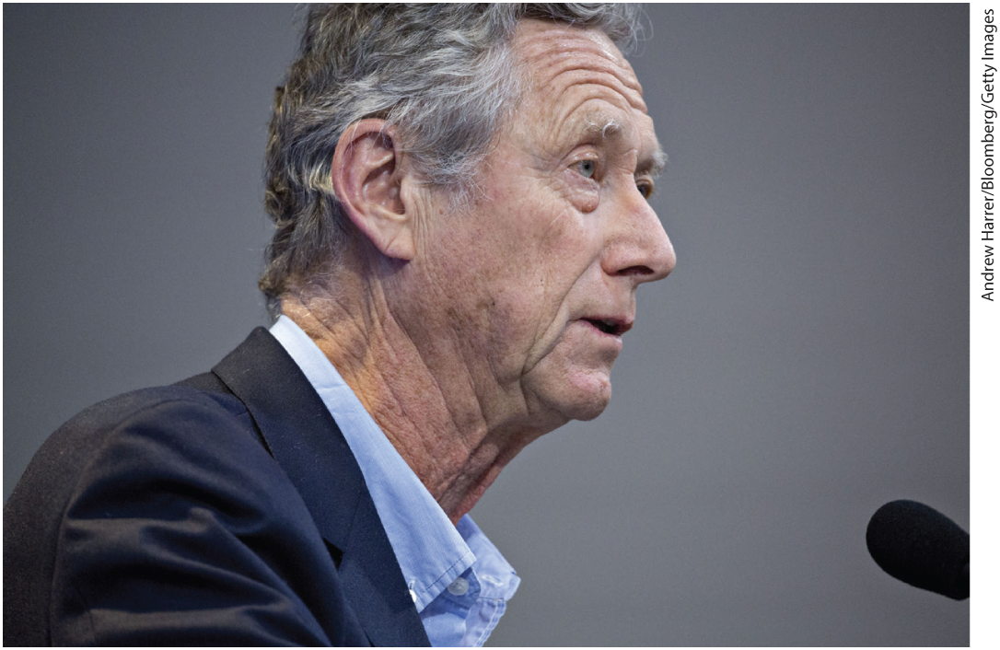
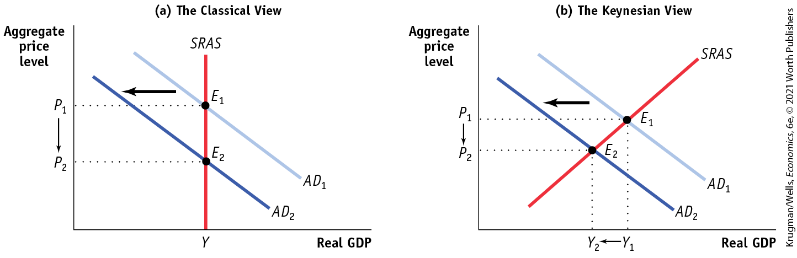
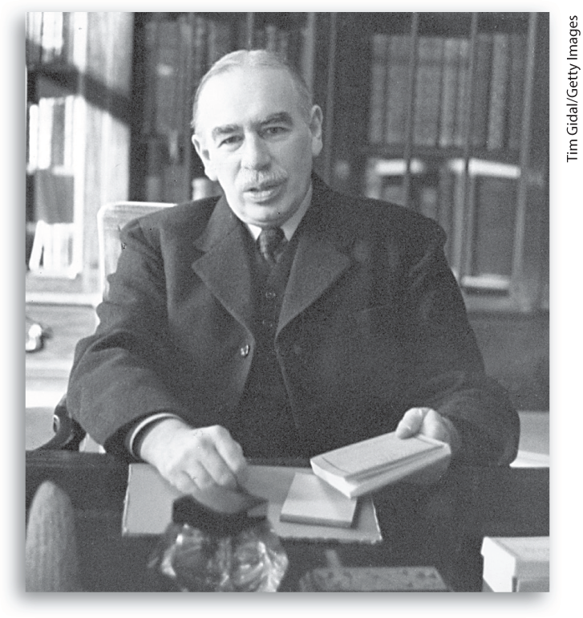
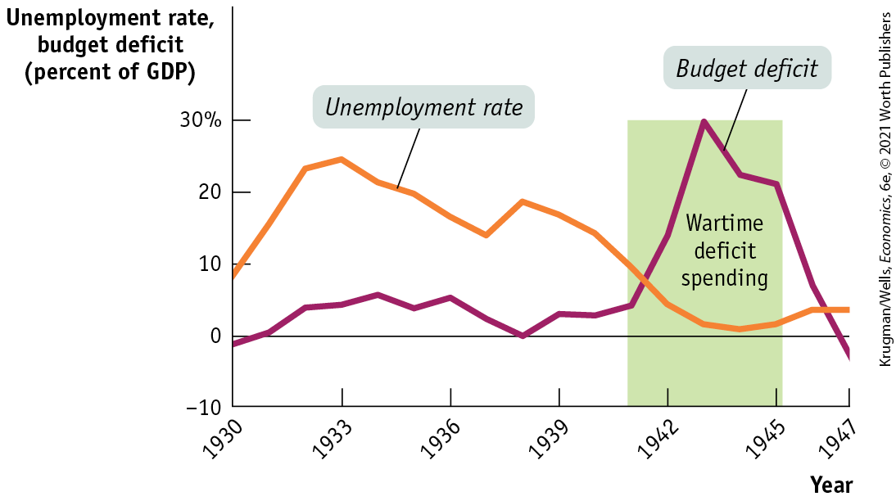
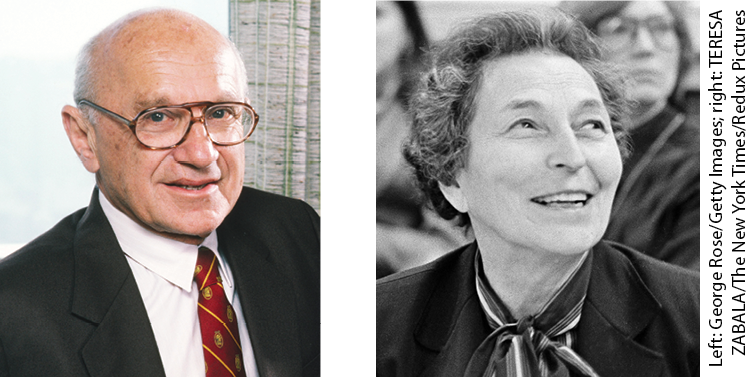

# Chapter 17 Macroeconomics: Events and Ideas

## SYMPATHY FOR THE DEFICIT

<figure id="pau_9781319320164_lrXWIngNE6" class="figure lm_img_lightbox unnum c2 right">

<figcaption>
Speaking at the American Economic Association’s Annual Meeting, President Olivier Blanchard discusses fallacies around issuing public debt.
</figcaption>
</figure>

<!--
<strong class="important">[Macro-CO17]</strong>
--> <!--
[Macro CO17]
--> <!--
[AU: Please provide photo caption.]
-->

**IN FISCAL 2019, THE U.S. FEDERAL GOVERNMENT** ran a budget deficit of almost \$1 trillion, 4.7% of GDP. It wasn’t the biggest deficit in U.S. history. However, in the past deficits that size occurred only during wars and economic emergencies like the aftermath of the 2008 financial crisis. To run such a big deficit in the face of low unemployment and healthy growth was unprecedented.

You might have expected, then, to see economists warning about fiscal irresponsibility. In fact, however, 2019 also happened to be a year in which several prominent macroeconomists published articles arguing that government debt is a much less pressing problem than many people imagine. In January 2019, Olivier Blanchard, the former chief economist of the International Monetary Fund and about as mainstream and widely respected as any modern macroeconomist, devoted his presidential lecture to the American Economic Association to the issue of public debt, and concluded that it may not do much, if any, damage.

A few weeks later Jason Furman and Lawrence Summers, who had been top economists in the Obama administration, published an article titled “Who’s afraid of budget deficits?” that concluded, “It’s time for Washington to put away its deficit obsession and focus on bigger things.”

Indeed, when budget deficits exploded in 2020 as a result of plunging revenue and emergency spending to cope with the coronavirus, economists surveyed by the University of Chicago supported a program providing income support to unemployed workers, even though this program was adding hundreds of billions to government spending.

Why have influential economists developed a soft spot for budget deficits? The answer, as is often the case in macroeconomics, is that they were strongly influenced by events — in this case both the financial crisis of 2008 and the era of very low interest rates that began during the crisis but continued right through 2020.

Macroeconomic ideas evolve because circumstances change. Solutions that were appropriate when gold and silver were the only monies available are inappropriate in an age of debit cards, Venmo, and digital currency. However, macroeconomic ideas also evolve because there is a steady accumulation of research and evidence that can be applied to the kinds of economic phenomenon that recur over time. The lessons learned in one decade are made available for the benefit of future generations.

To understand the state of macroeconomic thinking today, then, requires a trip through economic history and an understanding of the way economic ideas have evolved in the face of events.

In this chapter we’ll trace the development of macroeconomic ideas over the past 90 years: the rise of Keynesian economics in response to the Great Depression, the challenges to policy activism that arose in response to the stagflation of the 1970s, and the revisions to economic thinking induced by changes in the economic environment since the Great Recession. 

<!--
<strong class="important">[End opening story]</strong>
-->
<aside class="learning-objectives c3 main-flow v3" epub:type="learning-objectives" id="pau_9781319320164_VGyTLI8RBu">

### What you will learn

- Why was classical macroeconomics inadequate for the problems posed by the Great Depression?
- How did John Maynard Keynes and the experience of the Great Depression legitimize **macroeconomic policy activism?**
- Why did the original focus of **Keynesian economics** on fiscal policy give way to an emphasis on monetary policy?
- Why did economists come temporarily to have great faith in the power of independent central banks to stabilize the economy?
- How have events since 2008 undermined that faith, and also changed views on deficits and debt?

<!--
<strong class="important">[End of chapter-opening page]</strong>
--> <!--
<strong class="important">[Comp: Carry all blue AU queries to pages.]</strong>
-->
</aside>

## Classical Macroeconomics

The term *macroeconomics* appears to have been coined in 1933 by the Norwegian economist Ragnar Frisch. The date, during the worst year of the Great Depression, is no accident. Still, there were economists analyzing what we now consider macroeconomic issues — the behavior of the aggregate price level and aggregate output — before then.

### Money and the Price Level

In <a href="#kru_9781319245269_ch16_01.xhtml#pau_9781319320164_Upw2yOhAsg" id="kru_9781319245269_ch17_02.xhtml#pau_9781319320164_xtWM4fBpMt" class="crossref">Chapter 16</a>, we described the *classical model of the price level.* According to the classical model, prices are flexible, making the aggregate supply curve vertical even in the short run. In this model, an increase in the money supply leads, other things equal, to an equal proportional rise in the aggregate price level, with no effect on aggregate output. As a result, increases in the money supply lead to inflation, and that’s all. Before the 1930s, the classical model of the price level dominated economic thinking about the effects of monetary policy.

Did classical economists really believe that changes in the money supply affected only aggregate prices, without any effect on aggregate output? Probably not. Historians of economic thought argue that before 1930 most economists were aware that changes in the money supply affect aggregate output as well as aggregate prices in the short run — or, to use modern terms, they were aware that the short-run aggregate supply curve slopes upward. But they regarded such short-run effects as unimportant, stressing that it was the long run that mattered. It was this attitude that led the British economist John Maynard Keynes to scoff at the exclusive focus on the long run: he famously quipped that “in the long run, we are all dead.”

### The Business Cycle

Despite their lack of interest in the short run, classical economists were aware that the economy did not grow smoothly. Some economic historians argue that the first true recession in the modern sense took place in Britain in 1825–1826, when an overheated boom in canal-building collapsed. As the Industrial Revolution spread beyond Britain, so did the business cycle, which eventually became the object of systematic, quantitative study, pioneered by the American economist Wesley Mitchell. In 1920 Mitchell founded the National Bureau of Economic Research (NBER), an independent, nonprofit organization that to this day has the official role of declaring the beginnings of recessions and expansions. Thanks to Mitchell’s work, the *measurement* of business cycles was well advanced by 1930. But there was no widely accepted *theory* of what caused business cycles or what to do about them.

In the absence of any clear theory, conflicts arose among policy makers over how to respond to a recession. Some economists favored expansionary monetary and fiscal policies to fight a recession. Others believed that such policies would worsen the slump or merely postpone the inevitable. For example, in 1934 Harvard’s Joseph Schumpeter, now famous for his early recognition of the importance of technological change, warned that any attempt to alleviate the Great Depression with expansionary monetary policy “would, in the end, lead to a collapse worse than the one it was called in to remedy.” When the Great Depression hit, policy was paralyzed by this lack of consensus.

Necessity was, however, the mother of invention. As we’ll see next, the Great Depression provided an opportunity for economists to develop theories that could serve as a guide to policy.

## The Great Depression and the Keynesian Revolution

The Great Depression demonstrated, once and for all, that economists cannot safely ignore the short run. Not only was the economic pain severe; it threatened to destabilize societies and political systems. In particular, the economic plunge helped Adolf Hitler rise to power in Germany, setting the stage for World War II.

The whole world wanted to know how this economic disaster could be happening and what should be done about it. But because there was no widely accepted theory of the business cycle, economists gave conflicting and often harmful advice. Some believed that only a huge change in the economic system — such as having the government take over much of private industry and replace markets with a command economy — could end the slump. Others argued that slumps were natural — even beneficial, helping to correct past excesses — and that nothing should be done.

Some economists, however, argued that slumps were destructive and should be cured. Moreover, they could be cured without compromising the market economy. The most compelling advocate for this view was John Maynard Keynes, who compared the problems of the U.S. and British economies in 1930 to those of a car with a defective starter. Getting the economy running, he argued, would require only a modest repair, not a complete overhaul.

Nice metaphor. But what did he mean, specifically?

### Keynes’s Theory

In 1936 Keynes presented his analysis of the Great Depression — his explanation of what was wrong with the economy’s starter — in a book titled *The General Theory of Employment, Interest, and Money.* In 1946 the great American economist and Nobel Prize–winner Paul Samuelson wrote that “it is a badly written book, poorly organized. … Flashes of insight and intuition intersperse tedious algebra. … We find its analysis to be obvious and at the same time new. In short, it is a work of genius.” Samuelson was correct on both counts: *The General Theory* isn’t easy reading, yet it stands with Adam Smith’s *The Wealth of Nations* as one of the most influential books on economics ever written.

As Samuelson’s description indicates, Keynes’s book offers a vast stew of ideas. *Keynesian economics* is principally based on two innovations. First, Keynes emphasized the importance of short-run effects of changes in aggregate demand on aggregate output, unlike the classicists who focused exclusively on the long-run determination of the aggregate price level.

Until *The General Theory* appeared most economists had treated short-run macroeconomics as a minor issue. Keynes shifted the focus of attention of economists away from the unreachable long run to the world in which people actually live, one in which the short-run aggregate supply curve slopes upward and shifts in the aggregate demand curve affect aggregate output and employment as well as aggregate prices.

<a href="#kru_9781319245269_ch17_03.xhtml#pau_9781319320164_s8S8e0fG9F" id="kru_9781319245269_ch17_03.xhtml#pau_9781319320164_lt79fr3Cmr" class="crossref">Figure 17-1</a> illustrates the difference between Keynesian and classical macroeconomics. Both panels of the figure show the short-run aggregate supply curve, *SRAS;* in both it is assumed that for some reason demand falls and the aggregate demand curve shifts leftward from $AD_{1}$ to $AD_{2}$ — say, for example, in response to a fall in stock market prices that leads households to reduce consumer spending.

<!--
[Macro-Figure 17-1]

[Figure 17-1]
-->

<figure id="pau_9781319320164_s8S8e0fG9F" class="figure lm_img_lightbox num c4 main-flow">

<figcaption>
FIGURE 17-1 Classical versus Keynesian Macroeconomics

One important difference between classical and Keynesian economics involves the short-run aggregate supply curve. Panel (a) shows the classical view: the <em>SRAS</em> curve is vertical, so shifts in aggregate demand affect the aggregate price level but not aggregate output. Panel (b) shows the Keynesian view: in the short run the <em>SRAS</em> curve slopes upward, so shifts in aggregate demand affect aggregate output as well as aggregate prices.
</figcaption>
</figure>

<aside class="hidden" id="pau_9781319320164_fg0SZxEazI" title="hidden">

Graph a, The classical view: The vertical axis, labeled aggregate price level shows markings at P subscript 2 and P subscript 1, from bottom to top. The horizontal axis, labeled real G D P shows a marking at Y. A vertical line labeled S R A S starts from the marking Y. Two negative sloping parallel lines are labeled A D subscript 1 and A D subscript 2. A D subscript 1 is on the right of A D subscript 2. The vertical line, S R A S, intersects A D subscript 1 and A D subscript 2 at points E subscript 1 (Y, P subscript 1) and E subscript 2 (Y, P subscript 2), respectively. A leftward arrow points from A D subscript 1 to A D subscript 2. Graph b, The Keynesian view: The vertical axis, labeled aggregate price level shows markings at P subscript 2 and P subscript 1, from bottom to top. The horizontal axis, labeled real G D P shows markings at Y subscript 2 and Y subscript 1, from left to right. Two negative sloping parallel lines are labeled A D subscript 1 and A D subscript 2. A D subscript 1 is on the right of A D subscript 2. A positive sloping line, labeled S R A S, intersects A D subscript 2 and A D subscript 1 at points E subscript 2 (Y subscript 2, P subscript 2) and E subscript 1 (Y subscript 1, P subscript 1), respectively. A leftward arrow points from A D subscript 1 to A D subscript 2.

</aside>

Panel (a) shows the classical view: in it, the short-run aggregate supply curve is vertical. Therefore the fall in aggregate demand leads to a fall in the aggregate price level, from $P_{1}$ to $P_{2}$, but leaves aggregate output unchanged. Panel (b) shows the Keynesian view: in it, the short-run aggregate supply curve slopes upward. So a fall in aggregate demand leads to both a fall in the aggregate price level, from $P_{1}$ to $P_{2}$, and a fall in aggregate output, from $Y_{1}$ to $Y_{2}$.

As we’ve already explained, many classical macroeconomists would have agreed that panel (b) portrayed an accurate story in the short run — but they regarded the short run as unimportant. Keynes strongly disagreed, arguing that short-run economic problems caused great social distress and were in fact fixable. (Just to be clear, there isn’t any diagram that looks like panel (b) of <a href="#kru_9781319245269_ch17_03.xhtml#pau_9781319320164_s8S8e0fG9F" id="kru_9781319245269_ch17_03.xhtml#pau_9781319320164_IJjGRW5tNc" class="crossref">Figure 17-1</a> in Keynes’s *General Theory.* But Keynes’s discussion of aggregate supply, translated into modern terminology, clearly implies an upward-sloping *SRAS* curve.)

Keynes’s second innovation concerned the question of what factors shifted the aggregate demand curve and caused business cycles. Classical economists attributed shifts in the demand curve almost exclusively to changes in the money supply. Keynes, by contrast, argued that other factors, especially changes in “animal spirits” — these days usually referred to with the bland term *business confidence* — are mainly responsible for business cycles.

Before Keynes, economists argued that as long as the money supply stayed constant, changes in factors like business confidence would have no effect on either the aggregate price level or aggregate output. Keynes offered a very different picture in which, for example, pessimism about future profits can lead to a fall in investment spending, and this can cause a recession.

<a href="#kru_9781319245269_EM_glossary.xhtml#pau_9781319320164_kf4AmDsrin" id="kru_9781319245269_ch17_03.xhtml#pau_9781319320164_vbTejTXFb0" class="glossref" role="doc-glossref">Keynesian economics</a>, a view of the business cycle informed by these innovations, has penetrated deeply into the public consciousness, to the extent that many people who have never heard of Keynes, or have heard of him but think they disagree with his theory, use Keynesian ideas all the time. For example, suppose that a business commentator says something like this: “Businesses are holding back on investment spending because they’re worried about low consumer demand, and that’s why recovery has stalled.” Whether the commentator knows it or not, that statement is pure Keynesian economics.

<aside aria-label="glossary_2" class="glossary c3 main-flow v1" epub:type="glossary" id="pau_9781319320164_EqXdlTWm2e">

**Keynesian economics**  
**Keynesian economics** rests on two main tenets: changes in aggregate demand affect aggregate output, employment, and prices; and changes in business confidence cause the business cycle.

</aside>
<!--<pdata-id="VJj9xCcQqf"><strong class="important">[Comp: For Key Terms,bold punctuation follows bold word (with the exception of em dashes).See end of chapter for corresponding Margin Definition copy.]</strong>
-->

Keynes himself more or less predicted that someday people would make use of his ideas without knowing that they were *Keynesians.* As he famously wrote in *The General Theory,* “Practical men, who believe themselves to be quite exempt from any intellectual influences, are usually the slaves of some defunct economist.”

<!--<pdata-id="GgUuA9OCc3"><strong class="important">[Start FIM Box;position near here]</strong>
-->
<aside class="case-study c3 main-flow v1" epub:type="case-study" id="pau_9781319320164_IwzZobK8wn" title="For Inquiring Minds">

#### For inquiring minds 

The Politics of Keynes

Some political commentators use the term *Keynesian economics* as a synonym for left-wing economics. Because Keynes offered a rationale for some kinds of government activism, these commentators have gone on to claim that he was a leftist of some kind, maybe even a socialist. But the truth is more complicated.

As we explained, Keynesian ideas have actually been accepted among economists and policy makers across a broad range of the political spectrum. In 2004 the American president, George W. Bush, was a conservative, as was his top economist, N. Gregory Mankiw. But Mankiw is also a well-known promoter of Keynesian ideas.

In fact, Keynes was no socialist — and not much of a leftist. At the time *The General Theory* was published, the Depression had convinced many intellectuals that socialism was the only solution to the economy’s woes. They believed that the Great Depression was the final crisis of the capitalist economic system and that only a government takeover of industry could save the economy. Keynes, in contrast, argued that socialism was not the answer. Instead, he said, all the capitalist market system needed was a narrow technical fix. In essence, his ideas were pro-capitalist and politically conservative.

<figure id="pau_9781319320164_s4dDrPGnAG" class="figure lm_img_lightbox unnum c2 right">

<figcaption>
The ideas of John Maynard Keynes have been accepted across the political spectrum.
</figcaption>
</figure>

What is true is that the rise of Keynesian economics in the 1940s, 1950s, and 1960s accompanied a general enlargement of the role of government in the economy, and those who favored a larger role for government tended to be enthusiastic Keynesians. Conversely, a swing of the pendulum back toward free-market policies in the 1970s and 1980s was accompanied by a series of challenges to Keynesian ideas, which we will describe in this chapter.

Recent history shows that it is quite easy to find respected economists and policy makers who have conservative political preferences and who simultaneously respect Keynes’s fundamental contributions to macroeconomics. It is equally possible to find those of a liberal bent who question some of Keynes’s ideas.

<!--
[Macro-17UN01]

<pdata-id="XwC1QEe5s9"><strong class="important">[Macro17UN01]</strong>
--> <!--<pdata-id="gUu09Onc2q"><strong class="important">[End FIMBox]</strong>
-->
</aside>

### Policy to Fight Recessions

The greatest consequence of Keynes’s work was that it legitimized <a href="#kru_9781319245269_EM_glossary.xhtml#pau_9781319320164_4ssUA6l6dz" id="kru_9781319245269_ch17_03.xhtml#pau_9781319320164_GR5qxmJJJx" class="glossref" role="doc-glossref">macroeconomic policy activism</a> — the use of monetary and fiscal policy to smooth out the business cycle.

<aside aria-label="title 1" class="glossary c3 main-flow v1" epub:type="glossary" id="pau_9781319320164_6R0SXLoLUu">

**macroeconomic policy activism**  
**Macroeconomic policy activism** is the use of monetary and fiscal policy to smooth out the business cycle.

</aside>

It’s true that some economists had called for macroeconomic activism before Keynes, in particular advocating monetary expansion to fight economic downturns. And some economists had even argued, as Keynes did, that temporary budget deficits were a good thing in times of recession. But macroeconomic policy activism at the time was considered deeply controversial and those who advocated it were fiercely attacked.

As a result, when some governments during the 1930s followed policies that we would now call Keynesian, they were carried out in a half-hearted way and were insufficient to turn the Great Depression around. In the United States, the administration of Franklin Roosevelt engaged in modest deficit spending in an effort to create jobs, actions which seemed to gain some traction in improving the economy. But, in 1937 Roosevelt gave in to advice from non-Keynesian economists who urged him to balance the federal budget and raise interest rates, even though the economy was still deeply depressed. The result was a renewed slump.

Over time, however, Keynesian ideas spread, and they were widely accepted among economists after World War II. There were, however, a series of challenges to those ideas, which led to a considerable shift in views even among those economists who continued to believe that Keynes was broadly right about the causes of recessions. Next we’ll learn about those challenges and the schools, *new classical economics* and *new Keynesian economics,* that emerged.

<!--<pdata-id="MAa1o5UIiW"><strong class="important">[Start EIA] [Comp: ForKey Terms, bold punctuation follows bold word (with the exception ofem dashes). See end of chapter for corresponding Margin Definition copy.]</strong>
-->

### ECONOMICS \>\> *in Action*

The End of the Great Depression

It would make a good story if Keynes’s ideas had led to a change in economic policy that brought the Great Depression to an end. Unfortunately, that’s not what happened. Yet the way the Depression finally ended helped convince the economics profession that Keynes was basically right.

What economists learned from Keynes’s work was that economic recovery requires aggressive fiscal expansion — deficit spending on a sufficiently large scale to create jobs and push up aggregate demand. And that happened in the United States not because of intentional economic policy, but as the result of a very large war that required an enormous amount of government spending, World War II. The overwhelming evidence that it was government expenditures for World War II that lifted the economy out of the Great Depression finally ended the debate over the validity of Keynes’s views.

<a href="#kru_9781319245269_ch17_03.xhtml#pau_9781319320164_Cq1brDO2Px" id="kru_9781319245269_ch17_03.xhtml#pau_9781319320164_ixN34ZzSdI" class="crossref">Figure 17-2</a> shows the U.S. unemployment rate and the federal budget deficit as a share of GDP from 1930 to 1947. As you can see, deficit spending during the 1930s was on a modest scale. In 1940, as the risk of war grew larger, the United States began a large military buildup, building tanks, planes, military bases, and the like, moving the budget deep into deficit. After the attack on Pearl Harbor on December 7, 1941, the country began deficit spending on an enormous scale: in fiscal 1943, which began in July 1942, the deficit was 30% of GDP. Today that would be equivalent to a deficit of \$6 trillion.

<!--
[Macro-Figure 17-2]

<pdata-id="Rrf6L0Zyn3">[Figure17-2]
-->

<figure id="pau_9781319320164_Cq1brDO2Px" class="figure lm_img_lightbox num c3 main-flow">

<figcaption>
FIGURE 17-2 Fiscal Policy and the End of the Great Depression
</figcaption>
</figure>

<aside class="hidden" id="pau_9781319320164_bCnmYyk4gI" title="hidden">

The vertical axis, labeled unemployment rate, budget deficit (percent of G D P) ranges from negative 10 to 30 percent in increments of 10 percent. The horizontal axis, labeled year ranges from 1930 to 1942 in increments of 3 years, with an additional marking at 1947. The curve for unemployment rate passes through the following approximate points, (1930, 8), (1932, 22), (1933, 24), (1935, 20), (1937, 15), (1938, 20), (1940, 16), (1943, 2), (1944, 1), and (1946, 5). The curve for budget deficit passes through the following approximate points, (1930, negative 1), (1931, 0), (1932, 4), (1933, 4), (1934, 6), (1935, 4), (1936, 6), (1938, 0), (1939, 3), (1940, 2), (1941, 4), (1942, 13), (1943, 30), (1944, 22), (1945, 21), (1946, 8), and (1947, negative 3). A vertical bar spanning between 1941 and 1945 reaches a height of 30 percent.

</aside>
<!--<pdata-id="k1QEeSs97M"><strong class="important">[EndEIA]</strong>
--> <!--<pdata-id="Mlazo4TIh8"><strong class="important">[Quick Review andCheck Your Understanding position exactly where shown in MS. They donot float. ALL SUCH. See layouts for recto/verso design differences.]</strong>
-->

What was clear to economists and policy makers was that this enormous surge in government spending led the economy, mired in the Great Depression for well over a decade, to finally recover in a sustainable way. World War II wasn’t intended as a Keynesian fiscal policy. And it is hard to believe that any event, short of a world war, would have compelled the U.S. government to spend so much money. Yet unintentional as it was, World War II spending demonstrated that expansionary fiscal policy can lift the economy out of a deep slump.

### \>\> *Quick Review*

- Classical macroeconomists focused on the long-run effects of monetary policy on the aggregate price level, ignoring any short-run effects on aggregate output.
- By the time of the Great Depression, the measurement of business cycles was well advanced, but there was no widely accepted theory about why they happened.
- The key innovations of **Keynesian economics** are an emphasis on the short run, in which the *SRAS* curve slopes upward rather than being vertical, and the belief that changes in business confidence shift the *AD* curve and thereby generate business cycles.
- Keynesian economics legitimized **macroeconomic policy activism.**
- Keynesian ideas are widely used even by people who haven’t heard of Keynes or think they disagree with him.

### \>\> *Check Your Understanding* 17-1

1.  In their famous book *A Monetary History of the United States, 1867–1960,* the economists Milton Friedman and Anna Schwartz argued that the Federal Reserve was responsible for the Great Depression, because it failed to pursue a sufficiently expansionary monetary policy. Why would a classical economist have thought that action by the Federal Reserve would not have made a difference in the length or depth of the Great Depression?
2.  In a press release during the Great Recession, the National Federation of Independent Business, which calculates the Small Business Optimism Index, stated “The Small Business Optimism Index rose just 0.1 points in January. . . . Historically, optimism remains at recession levels. While small business owners appeared less pessimistic about the outlook for business conditions and real sales growth, that optimism did not materialize in hiring or increased inventories plans.” Would this statement seem familiar to a Keynesian economist? Which conclusion would a Keynesian economist draw for the need for public policy?

## Challenges to Keynesian Economics

Keynes’s ideas fundamentally changed the way economists think about business cycles. They did not, however, go unquestioned. In the wake of the success of government expenditures in ending the Great Depression, Keynesian economics faced a new series of challenges. As a result, by the 1980s the consensus of macroeconomists retreated somewhat from the strong version of Keynesianism that prevailed in the 1950s. In particular, many economists began to suggest limits to the effectiveness of macroeconomic policy activism.

### The Revival of Monetary Policy

Many macroeconomists agree with Keynes’s view that during a depression monetary policy would be relatively ineffective. We met this phenomenon in <a href="#kru_9781319245269_ch16_01.xhtml#pau_9781319320164_Upw2yOhAsg" id="kru_9781319245269_ch17_04.xhtml#pau_9781319320164_bOJyspm3Pm" class="crossref">Chapter 16</a> in what we called the *liquidity trap,* a situation in which monetary policy is ineffective because the interest rate cannot be pushed any lower. In the 1930s, when Keynes wrote, interest rates were, in fact, very close to zero.

When the era of near-zero interest rates came to an end after World War II and the economy had recovered, the pendulum had swung so far in favor of Keynesian economics that many economists continued to emphasize fiscal policy and downplay the usefulness of monetary policy. Eventually, however, the pendulum swung partly back as macroeconomists reassessed the importance of monetary policy.

A key milestone in this reassessment was the 1963 publication of *A Monetary History of the United States, 1867–1960,* by Milton Friedman, of the University of Chicago, and Anna Schwartz, of the National Bureau of Economic Research. Friedman and Schwartz showed that business cycles had historically been associated with fluctuations in the money supply. In particular, the money supply fell sharply during the onset of the Great Depression. Friedman and Schwartz persuaded many, though not all, economists that the Great Depression could have been avoided if the Federal Reserve had acted to prevent the monetary contraction by increasing the monetary base. They persuaded most economists that monetary policy should play a key role in economic management.

<!--
[Macro-17UN02a (Friedman) + Macro-17UN02b (Anna Schwartz)]

<pdata-id="5s9YMm31GU"><strong class="important">[Macro17UN02ab]</strong>
-->

<figure id="pau_9781319320164_J21KjUxtb3" class="figure lm_img_lightbox unnum c2 right">

<figcaption>
Milton Friedman and co-author Anna Schwartz played a key role in convincing macroeconomists of the importance of monetary policy.
</figcaption>
</figure>

The revival of interest in monetary policy was significant because it suggested that the burden of managing the economy could be shifted away from fiscal policy — meaning that economic management could largely be taken out of the hands of politicians. This feature was attractive to many because fiscal policy necessarily involves political choices. If the government tries to stimulate the economy by cutting taxes, it must decide whose taxes will be cut. If it tries to stimulate the economy with government spending, it must decide what to spend the money on. As a result, management of the economy would often be bogged down by the political process if fiscal policy were the only tool available.

Monetary policy, in contrast, does not involve such political choices: when the central bank cuts interest rates to fight a recession, it cuts everyone’s interest rate at the same time. So a shift from relying on fiscal policy to relying on monetary policy makes macroeconomics a more technical, less political undertaking. In fact, as we’ve learned, monetary policy in most major economies is set by an independent central bank that is insulated from the political process.

### Monetarism

After the publication of *A Monetary History,* Milton Friedman led a movement that sought to eliminate all forms of macroeconomic policy activism — fiscal and monetary. Instead, he asserted that the best way to manage the economy was with non-activist or *nondiscretionary* monetary policy. <a href="#kru_9781319245269_EM_glossary.xhtml#pau_9781319320164_gRBQHv9U6C" id="kru_9781319245269_ch17_04.xhtml#pau_9781319320164_m5uon6P8i6" class="glossref" role="doc-glossref">Monetarism</a> asserts that GDP will grow steadily if the money supply grows steadily. According to the monetarist policy prescription, the central bank should target a constant rate of growth of the money supply, such as 3% per year, and maintain that target regardless of any fluctuations in the economy.

<aside aria-label="glossary_2" class="glossary c3 main-flow v1" epub:type="glossary" id="pau_9781319320164_mGBXEC3Tjt">

**monetarism**  
**Monetarism** asserts that GDP will grow steadily if the money supply grows steadily.

</aside>

It’s important to realize that monetarism retained many Keynesian ideas. Like Keynes, Friedman asserted that the short run is important and that short-run changes in aggregate demand affect aggregate output as well as aggregate prices. Like Keynes, he argued that macroeconomic policy should have been much more expansionary during the Great Depression, even if he believed that only monetary policy was needed.

Monetarists argued, however, that in most cases activist macroeconomic policy to smooth out the business cycle actually makes things worse. In <a href="#kru_9781319245269_ch13_01.xhtml#pau_9781319320164_zdnoTrYOS8" id="kru_9781319245269_ch17_04.xhtml#pau_9781319320164_upC8aPIj3j" class="crossref">Chapter 13</a> we described how lags can cause problems for *discretionary fiscal policy.* For example, a government that tries to respond to recessions by increasing spending sometimes finds that by the time it realizes that a recession is underway, takes action, and gets results, the recession is over, and the spending increase feeds a boom instead of fighting a slump. According to monetarists, <a href="#kru_9781319245269_EM_glossary.xhtml#pau_9781319320164_dAOXcXgT6B" id="kru_9781319245269_ch17_04.xhtml#pau_9781319320164_URjFrXg2Rc" class="glossref" role="doc-glossref">discretionary monetary policy</a>, changes in the interest rate or the money supply by the central bank in order to stabilize the economy, faces similar problems and can easily make the economy less stable.

<aside aria-label="title 1" class="glossary c3 main-flow v1" epub:type="glossary" id="pau_9781319320164_MFmOLo2vsq">

**discretionary monetary policy**  
**Discretionary monetary policy** is the use of changes in the interest rate or the money supply to stabilize the economy.

</aside>

Friedman also argued that if the central bank followed his advice, adopting a non-activist monetary policy and refusing to change the money supply in response to fluctuations in the economy, fiscal policy would be much less effective than Keynesians believed due to *crowding out* — when government spending crowds out private investment spending. In <a href="#kru_9781319245269_ch10_01.xhtml#pau_9781319320164_GbPAtnS6LO" id="kru_9781319245269_ch17_04.xhtml#pau_9781319320164_fNZK15XCri" class="crossref">Chapter 10</a> we analyzed how this can occur: government spending leads to deficits, which drive up interest rates and reduce investment spending. Friedman and others pointed out that if the money supply is held fixed while the government pursues an expansionary fiscal policy, crowding out will occur as the interest rate rises, limiting the effect of the fiscal expansion on aggregate demand.

As already noted, Friedman didn’t favor activist monetary policy either, arguing that the problems of time lags that limit the ability of discretionary fiscal policy to stabilize the economy also apply to discretionary monetary policy. Friedman’s solution was to make monetary policy nondiscretionary, to put it on autopilot. The central bank, he argued, should follow a <a href="#kru_9781319245269_EM_glossary.xhtml#pau_9781319320164_RZxpaoFvpv" id="kru_9781319245269_ch17_04.xhtml#pau_9781319320164_3kkaeygOQI" class="glossref" role="doc-glossref">monetary policy rule</a>, a formula that determines its actions and leaves it relatively little discretion. During the 1960s and 1970s, most monetarists favored a monetary policy rule of slow, steady growth in the money supply.

<aside aria-label="glossary_2" class="glossary c3 main-flow v1" epub:type="glossary" id="pau_9781319320164_YnPmb40Bqk">

**monetary policy rule**  
A **monetary policy rule** is a formula that determines the central bank’s actions.

</aside>

Monetarism strongly influenced U.S. monetary policy in the late 1970s and early 1980s as the Fed tried to keep the rate of growth in the money supply constant. It quickly became clear, however, that this didn’t ensure steady growth in the economy.

Consequently, traditional monetarists — those who believe that GDP will grow steadily if the money supply grows steadily — are hard to find among today’s macroeconomists. However, Friedman’s argument that monetary policy can do the job of stabilizing the economy, and that fiscal policy has little role to play, became widespread among economists until it was called into question by the 2008 crisis and its aftermath.

### Limits to Macroeconomic Policy: Inflation and the Natural Rate of Unemployment

The problem of time lags in the implementation of activist macroeconomic policy was not the only criticism leveled at Keynesian economics. Another serious concern arose over its effect on inflation. During the 1940s and 1950s, many Keynesian economists believed that expansionary fiscal policy could be used to achieve full employment on a permanent basis. By the 1960s, however, many economists realized that persistently expansionary policies could cause problems with inflation. Yet they still believed that governments could choose to keep unemployment low if they were willing to accept higher inflation.

In 1968, however, Milton Friedman and Edmund Phelps of Columbia University, working independently, argued that there isn’t actually a long-run trade-off between unemployment and inflation. (Incidentally, Friedman made his argument in a famous 1969 presidential address to the American Economic Association — the same occasion that Olivier Blanchard used to downplay concerns about public debt 50 years later.) According to Friedman and Phelps’s <a href="#kru_9781319245269_EM_glossary.xhtml#pau_9781319320164_n50zJIBD5T" id="kru_9781319245269_ch17_04.xhtml#pau_9781319320164_37COgkAunG" class="glossref" role="doc-glossref">natural rate hypothesis</a>, any attempt to keep unemployment below a minimum level would lead not just to inflation but to ever-rising inflation. The important point to recognize here is that, if true, the natural rate hypothesis implies that Keynesian policies can’t accomplish as much as macroeconomists previously believed. Because the government can’t keep unemployment below the natural rate, its task is not to keep unemployment low but to keep it *stable around the natural rate —* to prevent large fluctuations in unemployment above or below the natural rate.

<aside aria-label="glossary_2" class="glossary c3 main-flow v1" epub:type="glossary" id="pau_9781319320164_aAtlPQjA4X">

**natural rate hypothesis**  
According to the **natural rate hypothesis**, because inflation is eventually embedded into expectations, to avoid accelerating inflation over time the unemployment rate should be kept stable around the natural rate.

</aside>

And the natural rate hypothesis was, in fact, accepted by most economists after the 1970s. The Friedman–Phelps hypothesis made a strong prediction: that the apparent trade-off between unemployment and inflation would not survive an extended period of rising prices. Once inflation was embedded into the public’s expectations, it would continue even in the face of high unemployment.

Sure enough, that’s exactly what happened in the 1970s. This accurate prediction was one of the triumphs of macroeconomic analysis. It convinced the great majority of economists that the natural rate hypothesis was correct, although some macroeconomists believe that at very low rates of inflation or deflation the hypothesis doesn’t work.
