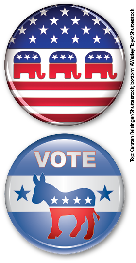
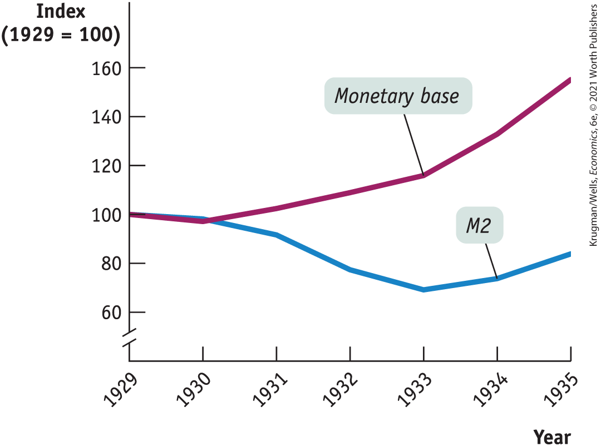
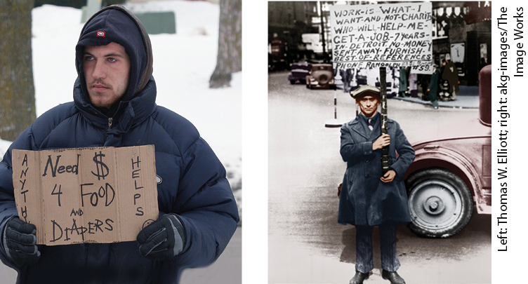
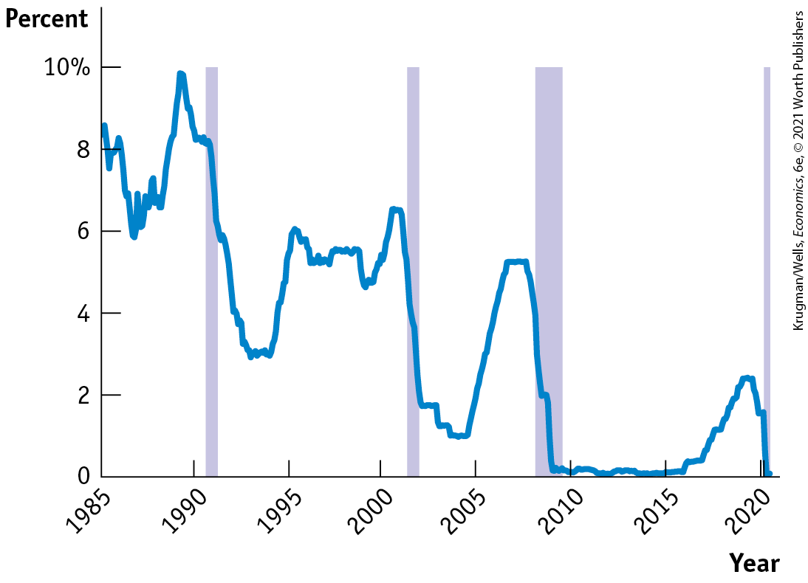
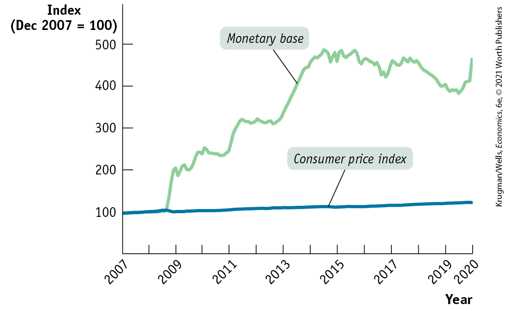
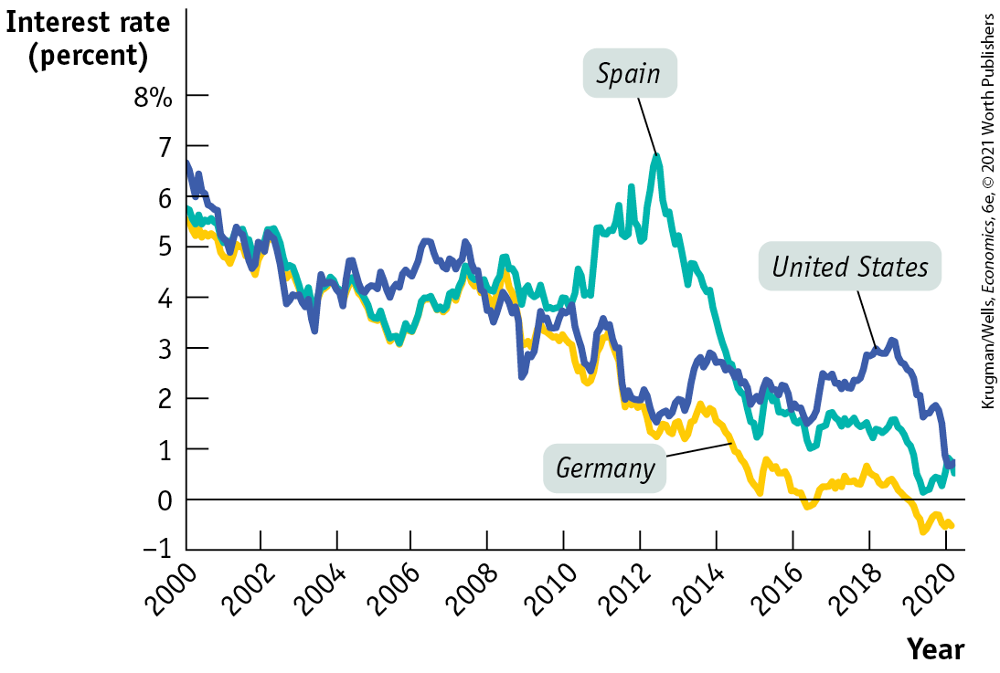

### Rational Expectations and New Classical Economics

As we have seen, one key difference between classical economics and Keynesian economics is that classical economists believed that the short-run aggregate supply curve is vertical, while Keynesian economics claims that the aggregate supply curve slopes upward in the short run. A consequence of the upward-sloping supply curve is that demand shocks — shifts in the aggregate demand curve — cause fluctuations in aggregate output.

In the 1970s and 1980s, the classical view that shifts in the aggregate demand curve affect only the aggregate price level, not aggregate output, was revived in an approach known as <a href="#kru_9781319245269_EM_glossary.xhtml#pau_9781319320164_LxDfVFpHMq" id="kru_9781319245269_ch17_04.xhtml#pau_9781319320164_YI4PvrwH9y" class="glossref" role="doc-glossref">new classical macroeconomics</a>. It evolved in two stages. First, some economists challenged traditional arguments about the slope of the short-run aggregate supply curve based on the concept of *rational expectations.* Second, some economists suggested that changes in productivity cause economic fluctuations, a view known as *real business cycle theory.*

<aside aria-label="title 1" class="glossary c3 main-flow v1" epub:type="glossary" id="pau_9781319320164_21oxtgJhua">

**new classical macroeconomics**  
**New classical macroeconomics** is an approach to the business cycle that returns to the classical view that shifts in the aggregate demand curve affect only the aggregate price level, not aggregate output.

</aside>

In the 1970s a concept known as *rational expectations* had a powerful impact on macroeconomics. <a href="#kru_9781319245269_EM_glossary.xhtml#pau_9781319320164_b1oXhgfHVZ" id="kru_9781319245269_ch17_04.xhtml#pau_9781319320164_jgYPpBYjlf" class="glossref" role="doc-glossref">Rational expectations</a>, originally introduced by John Muth in 1961, claims that individuals and firms make decisions optimally, using all available information.

<aside aria-label="glossary_2" class="glossary c3 main-flow v1" epub:type="glossary" id="pau_9781319320164_f6X6OuiYOo">

**rational expectations**  
The concept of **rational expectations** is the view that individuals and firms make decisions optimally, using all available information.

</aside>

For example, workers and employers bargaining over long-term wage contracts need to take account of the expected inflation rate over the life of that contract. The concept of rational expectations says that in making estimates of future inflation, they won’t just look at past rates of inflation; they will also take into account currently available information about monetary and fiscal policy. Suppose that prices didn’t rise last year, but that the monetary and fiscal policies announced by policy makers have made it clear that there will be substantial inflation over the next few years. According to rational expectations, long-term wage contracts will be adjusted today to reflect this future inflation, even though prices haven’t yet risen.

Adopting the premise of rational expectations can significantly alter beliefs about the effectiveness of activist macroeconomic policy. According to the original version of the natural rate hypothesis, a government attempt to persistently push the unemployment rate below the natural rate would work in the short run but will eventually fail because higher inflation will get built into expectations. According to rational expectations, we should remove the word *eventually* and replace it with *immediately:* if the government tries to lower unemployment today at the cost of higher inflation in the future, inflation will shoot up immediately without even a temporary fall in unemployment. So, under rational expectations, government intervention fails in the short run and the long run.

In the 1970s Robert Lucas of the University of Chicago used the logic of rational expectations to argue that monetary policy can change the level of output and unemployment only if it comes as a surprise to the public. In 1995 Lucas won the Nobel Prize in economics for this work, which remains widely admired. However, many — perhaps most — macroeconomists, especially those advising policy makers, now believe that his conclusions were overstated. The Federal Reserve certainly thinks that it can play a useful role in economic stabilization.

<!--
<strong class="important">[COMP: Please carry all blue AU: notes to pages.]</strong>

<strong class="important">[AU: Moved FIM box here. OK?]</strong>

<pdata-id="5K9YMm31Gg"><strong class="important">[StartFIM Box; position near here]</strong>
-->
<aside class="case-study c3 main-flow v1" epub:type="case-study" id="pau_9781319320164_NyEjPUxyuc" title="For Inquiring Minds">

#### For inquiring minds

Supply-Side Economics

During the 1970s a group of economic writers began propounding what came to be known as *supply-side economics.* Proponents of this view believed that reducing tax rates, and so increasing the incentives to work and invest, would have a powerful positive effect on the growth rate of potential output. The supply-siders urged the government to cut taxes without worrying about matching spending cuts: economic growth, they argued, would offset any negative effects from budget deficits.

Some supply-siders even argued that a cut in tax *rates* would have such a miraculous effect on economic growth that tax *revenues* — the total amount taxpayers pay to the government — would actually rise. That is, some supply-siders argued that the United States was on the wrong side of the *Laffer curve,* a hypothetical relationship between tax rates and total tax revenue that slopes upward at low tax rates but turns downward when tax rates are very high. Supply-side economics became popular with politicians, and in 1980 Ronald Reagan made supply-side economics the basis of his presidential campaign.

Because supply-side economics emphasizes supply rather than demand, and because the supply-siders are harshly critical of Keynesian economics, it would appear that it belongs in our discussion of new classical macroeconomics. But, in fact, supply-side economics is generally dismissed by economic researchers.

The main reason for this dismissal is lack of supporting evidence. Almost all economists agree that tax cuts increase incentives to work and invest. But attempts to estimate these incentive effects indicate that at current U.S. tax levels, the positive incentive effects aren’t nearly strong enough to support the strong claims made by supply-siders. In particular, the supply-side doctrine implies that large tax cuts, such as the Reagan tax cuts of the early 1980s, should sharply raise potential output, while tax hikes, like the Clinton tax hikes of 1993, should slow potential growth. Yet estimates by the Congressional Budget Office and others showed no sign of either.

Years later, in 2012, the state of Kansas provided the best evidence so far against the usefulness of supply-side economics. That year, Kansas passed large cuts in state taxes. Yet its economy tanked, with economic growth and job creation falling far below the national average, and its state deficit skyrocketed. In 2017, facing a state financial crisis and voters angry over cuts to state services, Kansas ended its experiment in supply-side economics and raised taxes.

</aside>
<!--
<strong class="important">[End FIM Box]</strong>
-->

Why, in the view of many macroeconomists, doesn’t Lucas’s <a href="#kru_9781319245269_EM_glossary.xhtml#pau_9781319320164_4XykS9m0I6" id="kru_9781319245269_ch17_04.xhtml#pau_9781319320164_mCRswihNXm" class="glossref" role="doc-glossref">rational expectations model</a> of macroeconomics accurately describe how the economy actually behaves? <a href="#kru_9781319245269_EM_glossary.xhtml#pau_9781319320164_0iaU7b3OWb" id="kru_9781319245269_ch17_04.xhtml#pau_9781319320164_4p4KeohLzu" class="glossref" role="doc-glossref">New Keynesian economics</a>, a set of ideas that became influential in the 1990s, provides an explanation. It argues that market imperfections interact to make many prices in the economy temporarily sticky. And with sticky prices, expected inflation can’t rise quickly enough to offset activist macroeconomic policy.

<aside aria-label="glossary_2" class="glossary c3 main-flow v1" epub:type="glossary" id="pau_9781319320164_c5rOEVhukT">

**rational expectations model**  
According to the **rational expectations model** of the economy, expected changes in monetary policy have no effect on unemployment and output and only affect the price level.

</aside>
<aside aria-label="title 1" class="glossary c3 main-flow v1" epub:type="glossary" id="pau_9781319320164_AXRQuj8Hvt">

**new Keynesian economics**  
According to **new Keynesian economics**, market imperfections can lead to price stickiness for the economy as a whole.

</aside>

Over time, new Keynesian ideas combined with actual experience have reduced the practical influence of the rational expectations concept. However, some macroeconomists went even further than Lucas, arguing that demand shocks play no role in recessions. In the 1980s, a number of economists argued that slowdowns in productivity growth, which they attributed to pauses in technological progress, are the main cause of recessions. <a href="#kru_9781319245269_EM_glossary.xhtml#pau_9781319320164_IsuwdV6UuB" id="kru_9781319245269_ch17_04.xhtml#pau_9781319320164_7i9eBUrh7l" class="glossref" role="doc-glossref">Real business cycle theory</a> claims that fluctuations in the rate of growth of productivity cause the business cycle.

<aside aria-label="glossary_2" class="glossary c3 main-flow v1" epub:type="glossary" id="pau_9781319320164_FVL3XLrwIP">

**real business cycle theory**  
**Real business cycle theory** claims that fluctuations in the rate of growth of total factor productivity cause the business cycle.

</aside>

This theory was strongly influential for some years, reflected by the fact that two of the founders of real business cycle theory, Finn Kydland of Carnegie Mellon University and Edward Prescott of the Federal Reserve Bank of Minneapolis, won the 2004 Nobel Prize in economics. The current status of real business cycle theory, however, is similar to that of rational expectations. It is widely recognized for making a valuable contribution to our understanding of the economy, and for cautioning against an overemphasis on aggregate demand.

But many of the real business cycle theorists themselves now acknowledge that the actual economic data indicate that their models need an upward-sloping aggregate supply curve — and that this gives aggregate demand a potential role in determining aggregate output.

### The Political Business Cycle

One final challenge to Keynesian economics focused not on the validity of the economic analysis but on its political consequences. A number of economists and political scientists pointed out that activist macroeconomic policy lends itself to political manipulation.

<!--
<strong class="important">[MACRO-17UN03 a + b]</strong>

<strong class="important">[Macro 17UN03ab]</strong>
-->

<figure id="pau_9781319320164_jt3x2OyWQk" class="figure lm_img_lightbox unnum c2 right">

<figcaption>
Political manipulation in order to win votes is a danger of activist macroeconomic policy.
</figcaption>
</figure>

Statistical evidence suggests that election results are strongly affected by the state of the economy in the months just before the election. In the United States, if the economy is growing rapidly and the unemployment rate is falling in the six months or so before Election Day, the incumbent party tends to be reelected even if the economy performed poorly in the preceding three years. This creates an obvious temptation to abuse activist macroeconomic policy: pump up the economy in an election year, and pay the price in higher inflation $\text{and/or}$ higher unemployment later. The consequence will be unnecessary instability in the economy, a <a href="#kru_9781319245269_EM_glossary.xhtml#pau_9781319320164_N0nwESU3KV" id="kru_9781319245269_ch17_04.xhtml#pau_9781319320164_zXs1S08CrJ" class="glossref" role="doc-glossref">political business cycle</a> caused by the use of macroeconomic policy to serve political ends.

<aside aria-label="glossary_2" class="glossary c3 main-flow v1" epub:type="glossary" id="pau_9781319320164_1gHj61N2Vu">

**political business cycle**  
A **political business cycle** results when politicians use macroeconomic policy to serve political ends.

</aside>

An often-cited example is the combination of expansionary fiscal and monetary policy that led to rapid growth in the U.S. economy just before the 1972 election and a sharp acceleration in inflation after the election. Kenneth Rogoff, a highly respected macroeconomist who served as chief economist at the International Monetary Fund, has proclaimed Richard Nixon, the president at the time, “the all-time hero of political business cycles.”

As we’ve learned, one way to avoid a political business cycle is to place monetary policy in the hands of an independent central bank, insulated from political pressure. The political business cycle is also a reason to limit the use of discretionary fiscal policy to extreme circumstances like a liquidity trap.

<!--
<strong class="important">[Start EIA]</strong>
-->

### ECONOMICS \>\> *in Action*

Did the Fed Cause the Great Depression?

The Great Depression gave birth to Keynesian economics and convinced most economists of the need for activist macroeconomic policy. But Friedman and Schwartz’s influential *A Monetary History* argued that the Federal Reserve could have prevented the Great Depression if only it had done its job. Some of Milton Friedman’s later writings strengthen this view and claim the Fed *caused* the depression.

Did the Fed, in fact, cause the Great Depression or at least allow it to happen through negligence?

The case against the Fed rests largely on the fact that the overall money supply, as measured by M2, fell sharply from 1929 to 1933 as the economy plunged. This monetary contraction is shown in <a href="#kru_9781319245269_ch17_04.xhtml#pau_9781319320164_8Sde6vsAIA" id="kru_9781319245269_ch17_04.xhtml#pau_9781319320164_r2fX26XRYF" class="crossref">Figure 17-3</a>, where M2 is shown as an index with $1929 = 100$. The Friedman–Schwartz view was that the Fed could have prevented the fall in M2 and hence stopped the depression from happening.

<!--
[Macro-Figure 17-3]

[Figure 17-3]

<strong class="important">[AU: Approve caption.]</strong>
-->

<figure id="pau_9781319320164_8Sde6vsAIA" class="figure lm_img_lightbox num c3 main-flow">

<figcaption>
FIGURE 17-3 Monetary Policy During the Great Depression

During the Great Depression the Federal Reserve increased the monetary base by over 50% but the overall money supply, measured by M2, declined by 30% before stabilizing in 1933 and slightly increasing in 1934 and 1935. Most economists believe the divergence in M2 and the monetary base stemmed from the widespread bank failures.

<em>Data from:</em> Friedman, Milton, and Anna Jacobson Schwartz. (1970). “Monetary Statistics of the United States: Estimates, Sources, Methods.”
</figcaption>
</figure>

<aside class="hidden" id="pau_9781319320164_EZ3S7IEvQw" title="hidden">

The vertical axis, labeled Index (1929 equals 100) is truncated and ranges from 60 to 160 in increments of 20. The horizontal axis, labeled year ranges from 1929 to 1935 in increments of 1 year. The curve for monetary base passes through the following approximate points, (1929, 100), (1930, 97), (1933, 115), and (1935, 150). The curve for M 2 passes through the following approximate points, (1929, 100), (1930, 98), (1931, 96), (1932, 79), (1933, 75), (1934, 77), and (1935, 82).

</aside>

However, the Fed doesn’t directly control monetary aggregates like M2, which consist mainly of bank deposits. What the Fed controls directly is the monetary base — currency in circulation plus bank reserves. And as <a href="#kru_9781319245269_ch17_04.xhtml#pau_9781319320164_8Sde6vsAIA" id="kru_9781319245269_ch17_04.xhtml#pau_9781319320164_66jOQAfpiU" class="crossref">Figure 17-3</a> also shows, the monetary base actually rose sharply in the early years of the Great Depression.

Why did M2 fall so much even though the monetary base was rising? The main explanation was that a wave of bank runs destroyed confidence in banks’ safety: many people chose to convert their deposits into currency, and surviving banks cut back on lending, accumulating reserves instead, so that they would have cash on hand in the event of a run.

Under these conditions, it’s not at all clear that the Fed could have prevented the plunge in M2. Interest rates were very low, giving banks little incentive to lend, so even if the Fed had engaged in large open-market operations, adding to bank reserves, the money might well have just sat there.

In fact, that’s what happened after the 2008 financial crisis, when the Fed massively increased the monetary base but saw only a small rise in M2.

In short, it’s doubtful whether the Fed could have prevented the Great Depression, and it certainly didn’t cause it.

<!--
<strong class="important">[End EIA]</strong>
-->

### \>\> *Quick Review*

- Early Keynesianism downplayed the effectiveness of monetary as opposed to fiscal policy, but later macroeconomists realized that monetary policy is effective except in the case of a liquidity trap.
- According to **monetarism**, due to time lags, both discretionary fiscal policy and **discretionary monetary policy** do more harm than good, and a simple **monetary policy rule** is the best way to stabilize the economy. This doctrine was popular for a time but has fallen out of favor as its predictions failed to materialize.
- The **natural rate hypothesis**, now very widely accepted, places sharp limits on what macroeconomic policy can achieve. It implies that policy should aim to stabilize the unemployment rate around the natural rate.
- **New classical macroeconomics** revived some pre-Keynesian views about monetary policy. The concept of **rational expectations** cast doubt on whether monetary policy can work even in the short run, while **real business cycle theory** suggested that productivity shocks are responsible for recessions. These views, however, were countered by **new Keynesian economics**, and have had little influence on policy.
- Concerns about a **political business cycle** suggest that the central bank should be independent and that discretionary fiscal policy should be avoided except in extreme circumstances like a liquidity trap.

### \>\> *Check Your Understanding* 17-2

1.  What are the limits of macroeconomic policy activism?
2.  Starting in 2008, as the economy entered the Great Recession, unemployment soared while interest rates and investment spending fell sharply. The Fed accelerated the growth of the monetary base in response.
    1.  Do you think Milton Friedman would have agreed with the Fed’s policy?
    2.  Monetarists, like Friedman, generally believe that discretionary monetary policy and fiscal policy are ineffective. Do you think their objections to fiscal and monetary policy were valid during the Great Recession? Note that unemployment did not return to its pre-recession level until 2016.
3.  In late 2008, as it became clear that the United States was experiencing a recession, the Fed reduced its target for the federal funds rate to near zero, as part of a larger aggressively expansionary monetary policy stance (including what the Fed called *quantitative easing*). Most observers agreed that the Fed’s aggressive monetary expansion helped reduce the length and severity of the Great Recession.
    1.  What would rational expectations theorists say about this conclusion?
    2.  What would real business cycle theorists say?

## From Great Moderation to Secular Stagnation

The 1970s and the first half of the 1980s were a stormy period for the U.S. economy (and for other major economies, too). There was a severe recession in 1974–1975, then two back-to-back recessions in 1979–1982 that sent the unemployment rate to almost 11%. At the same time, the inflation rate soared into double digits — and then plunged. As we have seen, these events left a strong mark on macroeconomic thought.

After about 1985, however, the economy settled down. The recession of 1990–1991 was much milder than the 1974–1975 recession or the double-dip slump from 1979 to 1982, and the inflation rate generally stayed below 4%. The period of relative calm in the economy from 1985 to 2007 came to be known as the <a href="#kru_9781319245269_EM_glossary.xhtml#pau_9781319320164_UyF5tcRLeO" id="kru_9781319245269_ch17_05.xhtml#pau_9781319320164_066JXy24v9" class="glossref" role="doc-glossref">Great Moderation</a>. And the calmness of the economy was to a large extent marked by a similar calm in macroeconomic policy discussion. In fact, it seemed that a broad consensus had emerged about several key macroeconomic issues.

<figure id="pau_9781319320164_uFTqFE7t0r" class="figure lm_img_lightbox unnum c3 main-flow">

<figcaption>
To tackle the Great Recession, policy makers were able to use the macroeconomic tools that evolved from the experience of the Great Depression.
</figcaption>
</figure>

<aside aria-label="glossary_2" class="glossary c3 main-flow v1" epub:type="glossary" id="pau_9781319320164_1zQg21qjSJ">

**Great Moderation**  
The **Great Moderation** is the period from 1985 to 2007 when the U.S. economy experienced relatively small fluctuations and low inflation. It led to widespread belief that monetary policy could stabilize the economy.

</aside>

However, the global financial crisis of 2008 and its aftermath undermined any sense that policy makers had things under control, and also led to a rethinking of macroeconomic policy — a rethinking that in some ways brought macroeconomists back to a more traditional Keynesian view.

### The Limits of Monetary Policy

<!--
<strong class="important">[AU: Review slight edits to wording in this paragraph.]</strong>
-->

In the end, Milton Friedman was unable to convince policy makers that monetarism was a good idea — simply ensuring that the money supply was growing at a steady rate was not enough to stabilize the economy. During the Great Moderation, however, both economists and policy makers generally believed that monetary policy in general was highly effective, and that apolitical technocrats at the Fed and other central banks could do the job of stabilizing the economy.

Events since 2008 have, however, undermined confidence in the ability of central bankers to keep the economy on an even keel. <a href="#kru_9781319245269_ch17_05.xhtml#pau_9781319320164_DdGjBhVq3o" id="kru_9781319245269_ch17_05.xhtml#pau_9781319320164_oVejHMBquA" class="crossref">Figure 17-4</a>, which shows the federal funds rate since the beginning of the Great Moderation, illustrates the problem. Normal monetary policy involves raising or lowering the federal funds rate through open-market operations, and the Fed has in fact cut that rate by about 5 percentage points each time recession has struck.

<!--
[Macro-Figure 17-4]

[Figure 17-4]
-->

<figure id="pau_9781319320164_DdGjBhVq3o" class="figure lm_img_lightbox num c3 main-flow">

<figcaption>
FIGURE 17-4 Monetary Policy in Recent Recessions

The Federal Reserve responds actively to economic downturns. During each of these four recessions, the Federal Reserve acted quickly to cut interest rates.

<em>Data from:</em> Federal Reserve Bank of St. Louis.
</figcaption>
</figure>

<aside class="hidden" id="pau_9781319320164_XViXx8yNgl" title="hidden">

The vertical axis, labeled percent ranges from 0 to 10 percent in increments of 2 percent. The horizontal axis, labeled year ranges from 1985 to 2020 in increments of 5 years. The graph plots a curve that passes through the following approximate points, (1985, 8.5), (1987, 6), (1989, 10), (1990, 8.2), (1993, 3), (1994, 3), (1995, 6), (1998, 5), (2000, 6.5), (2003, 2), (2004, 1), (2006, 5), (2009, 0.2), (2016, 0.2), (2019, 2.8), and (2020, 0). Four vertical bars at 1991, 2002, 2008, and 2020, respectively, indicate the recessions.

</aside>

In 2008, however, cutting the federal funds rate all the way to zero wasn’t enough to prevent a severe recession — and recovery from that recession was disappointingly slow. In other words, conventional monetary policy didn’t seem up to the job it was supposed to do.

In fact, even unconventional monetary policy seemed to fall short. Normally the Fed only buys short-term government debt. In 2010, however, it tried to boost the economy by buying other assets, including long-term government debt and the debt of government agencies that lend money to home-buyers. As <a href="#kru_9781319245269_ch17_05.xhtml#pau_9781319320164_NSeRAERZbZ" id="kru_9781319245269_ch17_05.xhtml#pau_9781319320164_WmbFT2pFau" class="crossref">Figure 17-5</a> shows, this program, generally referred to as *quantitative easing,* led to a huge increase in the monetary base.

<!--
[Macro-Figure 17-5]

[Figure 17-5]
-->

<figure id="pau_9781319320164_NSeRAERZbZ" class="figure lm_img_lightbox num c3 main-flow">

<figcaption>
FIGURE 17-5 Big Money, Small Inflation in the United States, 2007–2020

Quantitative easing led to a huge rise in the U.S. monetary base after the Great Recession, and some economists warned that this would in turn lead to high inflation. The Fed, however, argued that inflation risks were low, and, as you can see from the figure, was vindicated by events: the consumer price index stayed virtually flat, reflecting a very low inflation rate from 2008 onward.

<em>Data from:</em> Federal Reserve Bank of St. Louis.
</figcaption>
</figure>

<aside class="hidden" id="pau_9781319320164_MSJ3AbQSje" title="hidden">

The vertical axis, labeled Index (Dec 2007 equals 100) ranges from 0 to 500 in increments of 100. The horizontal axis, labeled year ranges from 2007 to 2020 in increments of 1 year. The curve for monetary base passes through the following approximate points, (2007, 100), (2008, 100), (2009, 200), (2010, 250), (2011, 220), (2012, 300), (2013, 300), (2015, 450), (2017, 420), (2018, 450), (2019, 400), and (2020, 450). The curve for consumer price index passes through the following approximate points, (2007, 100), (2008, 105), (2009, 100), (2015, 110), and (2020, 120).

</aside>

Some critics warned that the surge in the monetary base would lead to high inflation. As <a href="#kru_9781319245269_ch17_05.xhtml#pau_9781319320164_NSeRAERZbZ" id="kru_9781319245269_ch17_05.xhtml#pau_9781319320164_Dhadj9yIac" class="crossref">Figure 17-5</a> also shows, this didn’t happen. On the other hand, it didn’t lead to an economic boom either. Fed officials believe that the program had some positive effects, but if so, they weren’t dramatic.

### The Revival of Fiscal Policy

Events after 2008 showed that monetary policy wasn’t as reliable a recession-fighting tool as many economists had believed. This led to a revival of interest in fiscal policy. The United States engaged in significant expansionary fiscal policy, or <a href="#kru_9781319245269_EM_glossary.xhtml#pau_9781319320164_M5BQkzd4C0" id="kru_9781319245269_ch17_05.xhtml#pau_9781319320164_SbFSG4SKcp" class="glossref" role="doc-glossref">fiscal stimulus</a>, in 2009–2010, because the economy was still contracting even though the Fed had cut interest rates all the way to zero.

<aside aria-label="title 1" class="glossary c3 main-flow v1" epub:type="glossary" id="pau_9781319320164_F9Pp9njroU">

**fiscal stimulus**  
**Fiscal stimulus** is expansionary fiscal policy that takes the form of temporary spending measures and temporary tax cuts.

</aside>

Does fiscal policy actually work? Some observers pointed to the fact that U.S. unemployment remained high after the 2009 stimulus as evidence that it doesn’t, but this argument runs into the problem that the stimulus was a response to an economy already in trouble. Consider an analogy with visits to the doctor: people tend to see their doctor when they get sick, and many of them are still sick a few days after their office visit. You wouldn’t want to cite this as evidence that doctors are useless.

A better test came over the period from 2010–2013, when a number of countries shifted from stimulus to harsh <a href="#kru_9781319245269_EM_glossary.xhtml#pau_9781319320164_dv0tUac10F" id="kru_9781319245269_ch17_05.xhtml#pau_9781319320164_cDiQ1X0ajc" class="glossref" role="doc-glossref">austerity policies</a> — attempts to reduce their budget deficits by cutting spending and raising taxes. These policies were largely inspired by events in Greece, which saw interest rates soar in 2010 as investors lost confidence in the Greek government’s ability to pay its debts.

<aside aria-label="title 1" class="glossary c3 main-flow v1" epub:type="glossary" id="pau_9781319320164_7EamzH2Tbh">

**austerity policies**  
**Austerity policies** try to limit government borrowing by cutting spending and raising taxes.

</aside>

Fearing a similar fate, many countries, including the United States, engaged in fiscal austerity, but the degree of austerity varied a great deal from country to country. For example, Spain imposed budget cuts equal to around 8% of GDP, while Belgium, which actually had a higher level of debt relative to GDP, imposed almost no cuts.

An influential study from the International Monetary Fund showed a strong correlation between budget cuts and economic growth compared with earlier forecasts: the deeper the budget cuts, the worse the economic performance. Indeed, each dollar of budget cuts seemed to reduce GDP by around \$1.50. Together with other evidence, this experience convinced many economists that fiscal policy does indeed have strong effects in a world of low interest rates, with little evidence of crowding out.

As a result, macroeconomists have a much stronger interest in fiscal policy as a tool for stabilizing the economy than they did during the Great Moderation.

Expansionary fiscal policy, however, means higher budget deficits. Shouldn’t this be a source of concern? The answer, as we suggested in this chapter’s opening story, is that many (though not all) macroeconomists have become less concerned about debt than they once were. This reduced concern has a lot to do with the same phenomenon that has reduced confidence in the effectiveness of monetary policy: persistently low interest rates.

### Policy in a Low-Interest-Rate World

We saw in <a href="#kru_9781319245269_ch17_05.xhtml#pau_9781319320164_DdGjBhVq3o" id="kru_9781319245269_ch17_05.xhtml#pau_9781319320164_LOWlw006Ub" class="crossref">Figure 17-4</a> that the Fed cut interest rates all the way to zero in the face of the 2008 financial crisis, and found that even this wasn’t enough to avoid a severe recession followed by a sluggish recovery. At first, however, most economists — and Federal Reserve officials — believed that the Fed would be able to raise interest rates to historically normal levels once the crisis had passed. But as you can also see in <a href="#kru_9781319245269_ch17_05.xhtml#pau_9781319320164_DdGjBhVq3o" id="kru_9781319245269_ch17_05.xhtml#pau_9781319320164_e0Gow6wVAz" class="crossref">Figure 17-4</a>, the Fed ended up keeping rates close to zero for multiple years, then raised them only slightly, and began cutting again in 2019 amid signs of economic weakness. The coronavirus pandemic forced the Fed to return to their zero interest rate policy.

The persistence of low interest rates wasn’t just a U.S. phenomenon. <a href="#kru_9781319245269_ch17_05.xhtml#pau_9781319320164_2XoNnQrmgD" id="kru_9781319245269_ch17_05.xhtml#pau_9781319320164_sAJltL1uhQ" class="crossref">Figure 17-6</a> shows 10-year interest rates, which are often used as an indicator of long-term borrowing costs, for three countries since 2000: the United States, Germany, and Spain. As you can see, interest rates in both the United States and Germany have been on a declining trend — in Germany they’re actually negative. Spain saw a temporary rise in rates after the Greek debt crisis caused a panic about other European nations’ debt, but the panic soon subsided and by early 2016 Spain’s borrowing costs were even lower than those of the United States.

<!--
[Macro-Figure 17-6]

[Figure 17-6]
-->

<figure id="pau_9781319320164_2XoNnQrmgD" class="figure lm_img_lightbox num c3 main-flow">

<figcaption>
FIGURE 17-6 Check Out Our Low, Low Rates

Interest rates around the world have been extremely low since 2008.

<em>Data from:</em> Federal Reserve Bank of St. Louis.
</figcaption>
</figure>

<aside class="hidden" id="pau_9781319320164_GINDpQIdtw" title="hidden">

The vertical axis, labeled interest rate (percent) ranges from negative 1 to 8 percent, in increments of 1 percent. The horizontal axis, labeled year ranges from 2000 to 2020, in increments of 2 years. The curve for Spain passes through the following approximate points, (2000, 5.6), (2002, 5.3), (2004, 4.2), (2006, 3), (2008, 4), (2018, 4), (2013, 7), (2015, 1.5), (2016, 1.4), (2019, 1), and (2020, 0.5). The curve for United States passes through the following approximate points, (2000, 6.5), (2002, 4.5), (2003, 3.3), (2006, 4.5), (2007, 5), (2009, 2.5), (2010, 3.8), (2011, 3.5), (2012, 1.8), (2014, 3), (2016, 2), (2019, 3), and (2020, 1). The curve for Germany passes through the following approximate points, (2000, 5.5), (2002, 5.3), (2004, 4), (2006, 3), (2008, 4), (2009, 3), (2011, 3.5), (2012, 1.5), (2013, 1.5), (2014, 2), (2015, 0), (2018, 0.8), and (2020, negative 0.5).

</aside>

Why have interest rates fallen so much and so persistently? A number of economists, invoking a concept from the 1930s, suggest that underlying factors such as declining population growth and, perhaps, a slowdown in technological progress had put the world’s major economies in or on the edge of <a href="#kru_9781319245269_EM_glossary.xhtml#pau_9781319320164_PBW8OtLA2Y" id="kru_9781319245269_ch17_05.xhtml#pau_9781319320164_89uzeLW5p4" class="glossref" role="doc-glossref">secular stagnation</a>, a state in which the interest rate that is needed to achieve full employment is consistently close to zero.

<aside aria-label="title 1" class="glossary c3 main-flow v1" epub:type="glossary" id="pau_9781319320164_zg8KBaY9wp">

**secular stagnation**  
**Secular stagnation** occurs when the interest rate that is needed to achieve full employment is consistently below zero.

</aside>

If very low interest rates are the new normal, as they appear to be, this has two major consequences for economic policy: we shouldn’t worry much about debt, and we should worry a lot about fiscal responses to downturns.

We began this chapter by talking about Olivier Blanchard’s presidential address to the American Economic Association, in which he argued that fears about debt have been overstated. Low interest rates were central to his argument.

In the past, he noted, people have worried that debt might snowball over time, as interest payments on debt lead to higher deficits, which increase debt, leading to higher interest payments, and so on. As Blanchard noted, however, what matters for the economy is not the absolute size of the debt but the ratio of debt to GDP. And in recent decades interest rates have been well below the economy’s growth rate. What this means is that instead of feeding on itself, a high ratio of debt to GDP tends to shrink over time unless the government runs a large non-interest-rate deficit. You might say, we don’t need to worry about snowballing debt because the snowball tends to melt.

Indeed, there may be a good case for increasing government debt through further borrowing, if the borrowing is used to pay for things like infrastructure that will strengthen the economy in the future.

At the same time, an economy in which interest rates are persistently low is also an economy in which even medium-size adverse shocks may be too big to offset with monetary policy, simply because the Fed and its counterparts don’t have enough room to cut. This suggests that we should strengthen the economy’s *automatic stabilizers,* the tax and spending responses that help fight recessions even without new legislation. Some economists also argue that a moderate degree of persistent deficit spending may be a good thing, especially if it involves public investment, because it means that some fiscal stimulus is already in place.

<!--
<strong class="important">[Start EIA]</strong>
--> <!--
<strong class="important">[AU: Consider squeezing in a line acknowledging heading into a 4</strong><strong class="important">th</strong> <strong class="important">recession.]</strong>
-->
