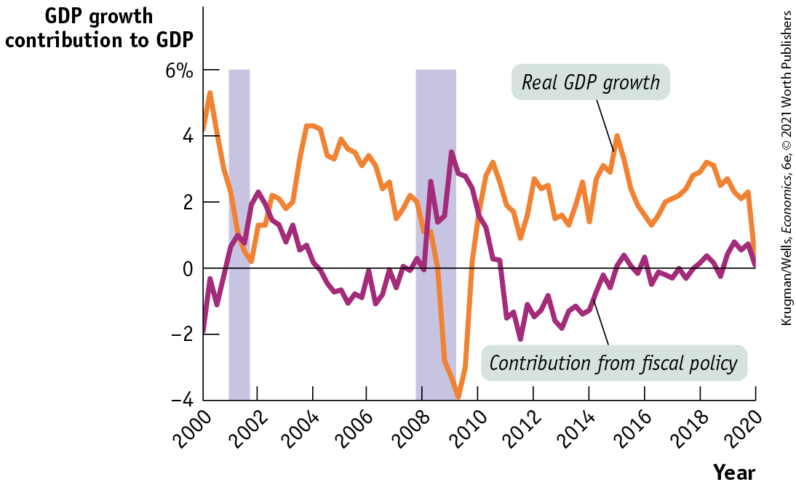

### ECONOMICS \>\> *in Action*

Debt Fears, Austerity, and the U.S. Recovery

The United States has experienced three really big recessions since World War II: one in 1974–1975, a double-dip recession from 1979 to 1982, and the Great Recession of 2007–2009. After the first two slumps, the economy experienced so-called V-shaped recoveries, quickly bouncing back. Recovery from the Great Recession, however, was much more gradual; it took about six years before the unemployment rate fell close to its pre-crisis level. Why was recovery sluggish?

<!--
<strong class="important">[AU: Changed &#x201C;the three big recessions&#x201D; to &#x201C;these three recessions&#x201D; since 2020 may be worse.]</strong>
-->

One answer is that the causes of these three recessions differed: 1974–1975 and 1979–1982 were brought on by high interest rates, imposed by the Fed to control inflation, while 2007–2009 was the result of a financial crisis, whose adverse effects were much harder to reverse. But fiscal policy also probably played an important role.

True, the U.S. government enacted a major fiscal stimulus in 2009. But the effects of that stimulus began to fade out in late 2010. And by that time much of Washington’s political establishment had decided that public debt was a major danger — that the Greek crisis was a warning to everyone — and began pushing for fiscal austerity in the form of spending cuts.

U.S. fiscal austerity was never as extreme as austerity in, say, Spain, let alone Greece. But it was significant. The Hutchins Center at Washington’s Brookings Institution provides regular estimates of what it calls its “fiscal impact measure,” which “shows how much local, state, and federal tax and spending policy adds to or subtracts from overall economic growth.” <a href="#kru_9781319245269_ch17_05.xhtml#pau_9781319320164_34I7p1elJa" id="kru_9781319245269_ch17_05.xhtml#pau_9781319320164_aOnjhGkOP7" class="crossref">Figure 17-7</a> shows this measure along with real GDP growth over the past 20 years. According to this estimate, austerity imposed a steady, significant drag on economic growth from early 2011 through 2015.

<!--
[Macro-Figure 17-7]

[Figure 17-7]
-->

<figure id="pau_9781319320164_34I7p1elJa" class="figure lm_img_lightbox num c3 main-flow">

<figcaption>
FIGURE 17-7 Austerity, American Style

Persistent cuts in government spending after 2011 may have delayed U.S. recovery from the Great Recession.

<em>Data from:</em> Federal Reserve Bank of St. Louis; Hutchins Center on Fiscal and Monetary Policy.
</figcaption>
</figure>

<aside class="hidden" id="pau_9781319320164_DfKhJDnXeu" title="hidden">

The vertical axis, labeled G D P growth, contribution to G D P ranges from negative 4 to 6 percent, in increments of 2 percent. The horizontal axis, labeled Year ranges from 2000 to 2020, in increments of 2 years. The curve for real G D P growth passes through the following approximate points, (2000, 4.2), (2002, 0.2), (2004, 4), (2008, 2), (2009, negative 4), (2011, 3.5), (2012, 1), (2015, 4), (2016, 1.2), (2018, 3), (2019, 2), and (2020, 0). The curve for contribution from fiscal policy passes through the following approximate points, (2000, negative 2), (2002, negative 2.2), (2005, negative 1), (2006, 0), (2008, 0), (2009, 3.5), (2012, negative 2), (2014, negative 1.8), (2016, 0.3), (2017, 0), (2018, 0.3), (2019, 0.7), and (2020, 1). Two vertical bars are drawn at 2001 and 2009, respectively.

</aside>

How much difference did this drag make to the pace of recovery? If the Hutchins estimate is correct, without austerity the United States might well have experienced a full recovery, with unemployment falling below 5%, by some time in 2012.

So the United States seems to have paid a large price for austerity imposed in the name of limiting government debt. If economists who now say that debt fears were overblown are right, this was a huge policy mistake.

<!--
<strong class="important">[End EIA]</strong>
-->

### \>\> *Quick Review*

- The **Great Moderation**, the period of economic calm from 1985 to 2007, led many economists to believe that monetary policy was sufficient to stabilize the economy. However, the 2008 financial crisis, in which the Fed cut rates to zero and even this wasn’t enough to prevent a severe recession, undermined this belief.
- The appearance of limits to monetary policy led to renewed interest in fiscal policy, with a temporary turn to **fiscal stimulus** to fight the Great Recession. However, concerns about government debt led many countries to reverse this policy from 2010 onward, engaging in **austerity policies** instead. The adverse effects of austerity on growth, somewhat ironically, showed that fiscal policy is effective.
- Interest rates have remained very low since the 2008 financial crisis. Some economists believe that we are suffering from **secular stagnation:** declining population growth and slower technological progress led to a state of persistent economic weakness.
- In a low-interest-rate world, former concerns about government debt appear to have been overstated, and there is a much stronger case for fiscal stimulus, especially to fight recessions, but possibly even in normal times.

### \>\> *Check Your Understanding* 17-3

1.  Why did the Great Recession lead to the decline of the Great Moderation consensus? What is the current state of consensus among most economists?
2.  Why was there such a fierce debate over both the Fed’s unconventional monetary policy and the appropriate level of the Fed’s inflation target?

<!--
<strong class="important">[Comp: there is no EOC business case. The summary is next. NEW Page.]</strong>
-->

### SUMMARY

1.  Classical macroeconomics asserted that monetary policy affected only the aggregate price level, not aggregate output, and that the short run was unimportant. By the 1930s, measurement of business cycles was a well-established subject, but there was no widely accepted theory of business cycles.
2.  **Keynesian economics** attributed the business cycle to shifts of the aggregate demand curve, often the result of changes in business confidence. Keynesian economics also offered a rationale for **macroeconomic policy activism.**
3.  In the decades that followed Keynes’s work, economists came to agree that monetary policy as well as fiscal policy is effective under certain conditions. **Monetarism**, a doctrine that called for a **monetary policy rule** as opposed to **discretionary monetary policy** and argued for steady growth in the money supply, was influential for a time but was eventually rejected by many macroeconomists.
4.  The **natural rate hypothesis** became almost universally accepted, limiting the role of macroeconomic policy to stabilizing the economy rather than seeking a permanently lower unemployment rate. Fears of a **political business cycle** led to a consensus that monetary policy should be insulated from politics.
5.  The concept of **rational expectations** claims that individuals and firms make decisions using all available information. According to the **rational expectations model** of the economy, only unexpected changes in monetary policy affect aggregate output and employment; expected changes merely alter the price level. **Real business cycle theory** claims that changes in the rate of growth of total factor productivity are the main cause of business cycles. Both of these versions of **new classical macroeconomics** received wide attention and respect, but policy makers and many economists haven’t accepted the conclusion that monetary and fiscal policy are ineffective in changing aggregate output.
6.  **New Keynesian economics** argues that market imperfections can lead to price stickiness, so that changes in aggregate demand have effects on aggregate output after all.
7.  The **Great Moderation** from 1985 to 2007 made many economists confident that monetary policy alone can stabilize the economy. But the Great Recession revealed the limits to monetary policy and the potential usefulness of **fiscal stimulus.** On the other hand, after the Greek debt crisis many countries, worried about their levels of government debt, turned to **austerity policies** that appear to have hurt growth and delayed recovery.
8.  The persistence of very low interest rates has led to concerns that we face **secular stagnation:** declining population growth and a slowdown in technological progress lead to a state of persistent economic weakness. In any case, low interest rates suggest that governments should focus less on debt, and perhaps engage in more deficit spending.

### Key Terms

- <a href="#kru_9781319245269_ch17_03.xhtml#pau_9781319320164_vbTejTXFb0" id="kru_9781319245269_ch17_06.xhtml#pau_9781319320164_aEeeAwett4" class="crossref">Keynesian economics</a>
- <a href="#kru_9781319245269_ch17_03.xhtml#pau_9781319320164_GR5qxmJJJx" id="kru_9781319245269_ch17_06.xhtml#pau_9781319320164_uaZGqz3NlW" class="crossref">Macroeconomic policy activism</a>
- <a href="#kru_9781319245269_ch17_04.xhtml#pau_9781319320164_m5uon6P8i6" id="kru_9781319245269_ch17_06.xhtml#pau_9781319320164_5ZMjAzCJUF" class="crossref">Monetarism</a>
- <a href="#kru_9781319245269_ch17_04.xhtml#pau_9781319320164_URjFrXg2Rc" id="kru_9781319245269_ch17_06.xhtml#pau_9781319320164_20I7RkEyGr" class="crossref">Discretionary monetary policy</a>
- <a href="#kru_9781319245269_ch17_04.xhtml#pau_9781319320164_3kkaeygOQI" id="kru_9781319245269_ch17_06.xhtml#pau_9781319320164_wUtfivXXZd" class="crossref">Monetary policy rule</a>
- <a href="#kru_9781319245269_ch17_04.xhtml#pau_9781319320164_37COgkAunG" id="kru_9781319245269_ch17_06.xhtml#pau_9781319320164_vEC2DjD1Vd" class="crossref">Natural rate hypothesis</a>
- <a href="#kru_9781319245269_ch17_04.xhtml#pau_9781319320164_YI4PvrwH9y" id="kru_9781319245269_ch17_06.xhtml#pau_9781319320164_Xg822603LJ" class="crossref">New classical macroeconomics</a>
- <a href="#kru_9781319245269_ch17_04.xhtml#pau_9781319320164_jgYPpBYjlf" id="kru_9781319245269_ch17_06.xhtml#pau_9781319320164_svBmBZC7fE" class="crossref">Rational expectations</a>
- <a href="#kru_9781319245269_ch17_04.xhtml#pau_9781319320164_mCRswihNXm" id="kru_9781319245269_ch17_06.xhtml#pau_9781319320164_T9PMZtkdAL" class="crossref">Rational expectations model</a>
- <a href="#kru_9781319245269_ch17_04.xhtml#pau_9781319320164_4p4KeohLzu" id="kru_9781319245269_ch17_06.xhtml#pau_9781319320164_3soGb0rJwg" class="crossref">New Keynesian economics</a>
- <a href="#kru_9781319245269_ch17_04.xhtml#pau_9781319320164_7i9eBUrh7l" id="kru_9781319245269_ch17_06.xhtml#pau_9781319320164_eZ63O2xCa1" class="crossref">Real business cycle theory</a>
- <a href="#kru_9781319245269_ch17_04.xhtml#pau_9781319320164_zXs1S08CrJ" id="kru_9781319245269_ch17_06.xhtml#pau_9781319320164_BagToIelIL" class="crossref">Political business cycle</a>
- <a href="#kru_9781319245269_ch17_05.xhtml#pau_9781319320164_066JXy24v9" id="kru_9781319245269_ch17_06.xhtml#pau_9781319320164_2p95He94BO" class="crossref">Great Moderation</a>
- <a href="#kru_9781319245269_ch17_05.xhtml#pau_9781319320164_SbFSG4SKcp" id="kru_9781319245269_ch17_06.xhtml#pau_9781319320164_nLtYfiTo9y" class="crossref">Fiscal stimulus</a>
- <a href="#kru_9781319245269_ch17_05.xhtml#pau_9781319320164_cDiQ1X0ajc" id="kru_9781319245269_ch17_06.xhtml#pau_9781319320164_9KktdOcBOT" class="crossref">Austerity policies</a>
- <a href="#kru_9781319245269_ch17_05.xhtml#pau_9781319320164_89uzeLW5p4" id="kru_9781319245269_ch17_06.xhtml#pau_9781319320164_UkvDJGQmrt" class="crossref">Secular stagnation</a>

### Practice questions

1.  <a href="#kru_9781319245269_ch17_03.xhtml#pau_9781319320164_s8S8e0fG9F" id="kru_9781319245269_ch17_06.xhtml#pau_9781319320164_VnfccKLOeh" class="crossref">Figure 17-1</a> highlights the differences in the *SRAS* for classical and Keynesian economists. What would the different *SRAS* imply about the Phillips curve? Following the Great Recession most research has found a “flattening of the Phillips curve”: what does this imply about the two schools of thought?
2.  “We are all Keynesians now,” is a quote that is often attributed to President Richard Nixon. While the origins of the exact quote remain up for debate, how does this quote, in terms to fiscal stimulus and austerity policies, apply to the lesson we’ve learned following the Great Recession and the economic shutdown tied to the coronavirus pandemic?
3.  At the start of the economic shutdown tied to the coronavirus pandemic, the Congressional Budget Office projected the federal debt to GDP ratio would reach 108% by the end of 2021, an increase of 26 percentage points from their previous projection. Going forward, what lessons can be applied from the record-level debt following World War II? What are the primary factors that will determine if debt snowballs out of control or will slowly melt?

### Problems

1.  Since the crash of its stock market in 1989, the Japanese economy has seen little economic growth and some deflation. The accompanying table from the Organization for Economic Cooperation and Development (OECD) shows some key macroeconomic data for Japan for 1991 (a “normal” year) and 1995–2003.
    1.  From the data, determine the type of policies Japan’s policy makers undertook at that time to promote growth.
    2.  We can safely consider a short-term interest rate that is less than 0.1% to effectively be a 0% interest rate. What is this situation called? What does it imply about the effectiveness of monetary policy? Of fiscal policy?<!--
[COMP: Table is from Macro 5e, p.528, problem 1]
-->
        | Year | Real GDP annual growth rate                                                                                              | Short-term interest rate | Government debt (percent of GDP) | Government budget deficit (percent of GDP)                                                                                  |
        |------|--------------------------------------------------------------------------------------------------------------------------|--------------------------|----------------------------------|-----------------------------------------------------------------------------------------------------------------------------|
        | 1991 | 3.4%                                                                                                                     | 7.38%                    | 64.8%                            | $- 1.81\%$ |
        | 1995 | 1.9                                                                                                                      | 1.23                     | 87.1                             | 4.71                                                                                                                        |
        | 1996 | 3.4                                                                                                                      | 0.59                     | 93.9                             | 5.07                                                                                                                        |
        | 1997 | 1.9                                                                                                                      | 0.60                     | 100.3                            | 3.79                                                                                                                        |
        | 1998 | $- 1.1$ | 0.72                     | 112.2                            | 5.51                                                                                                                        |
        | 1999 | 0.1                                                                                                                      | 0.25                     | 125.7                            | 7.23                                                                                                                        |
        | 2000 | 2.8                                                                                                                      | 0.25                     | 134.1                            | 7.48                                                                                                                        |
        | 2001 | 0.4                                                                                                                      | 0.12                     | 142.3                            | 6.13                                                                                                                        |
        | 2002 | $- 0.3$ | 0.06                     | 149.3                            | 7.88                                                                                                                        |
        | 2003 | 2.5                                                                                                                      | 0.04                     | 157.5                            | 7.67                                                                                                                        |
2.  The National Bureau of Economic Research (NBER) maintains the official chronology of past U.S. business cycles. Go to its website at <a href="http://www.nber.org/cycles/cyclesmain.html" id="kru_9781319245269_ch17_06.xhtml#pau_9781319320164_cNKiw24PIh" class="external">www.nber.org/cycles/cyclesmain.html</a> to answer the following questions.
    1.  How many business cycles have occurred since the end of World War II in 1945?
    2.  What was the average duration of a business cycle when measured from the end of one expansion (its peak) to the end of the next? That is, what was the average duration of a business cycle in the period from 1945 to 2009?
    3.  When was the last announcement by the NBER’s Business Cycle Dating Committee, and what was it?
3.  The fall of its military rival, the Soviet Union, in 1989 allowed the United States to significantly reduce its defense spending in subsequent years. Using the data in the following table from the Economic Report of the President, replicate <a href="#kru_9781319245269_ch17_03.xhtml#pau_9781319320164_Cq1brDO2Px" id="kru_9781319245269_ch17_06.xhtml#pau_9781319320164_axUqfnZAe0" class="crossref">Figure 17-2</a> for the 1990–2000 period. Given the strong economic growth in the United States during the late 1990s, why would a Keynesian see the reduction in defense spending during the 1990s as a good thing?<!--
[COMP: Table is from Macro 5e, p.528, problem 3]
-->
    | Year | Budget deficit (percent of GDP)                                                                                          | Unemployment rate |
    |------|--------------------------------------------------------------------------------------------------------------------------|-------------------|
    | 1990 | 3.9%                                                                                                                     | 5.6%              |
    | 1991 | 4.5                                                                                                                      | 6.8               |
    | 1992 | 4.7                                                                                                                      | 7.5               |
    | 1993 | 3.9                                                                                                                      | 6.9               |
    | 1994 | 2.9                                                                                                                      | 6.1               |
    | 1995 | 2.2                                                                                                                      | 5.6               |
    | 1996 | 1.4                                                                                                                      | 5.4               |
    | 1997 | 0.3                                                                                                                      | 4.9               |
    | 1998 | $- 0.8$ | 4.5               |
    | 1999 | $- 1.4$ | 4.2               |
    | 2000 | $- 2.4$ | 4.0               |
4.  In the modern world, central banks are free to increase or reduce the money supply as they see fit. However, some people harken back to the “good old days” of the gold standard. Under the gold standard, the money supply could expand only when the amount of available gold increased.
    1.  Under the gold standard, if a growing economy led to a rising demand for money, what would have had to happen to keep prices stable?
    2.  Why would modern macroeconomists consider the gold standard a bad idea?
5.  The chapter notes that Kenneth Rogoff proclaimed Richard Nixon “the all-time hero of political business cycles.” Using the following table of data from the Economic Report of the President, explain why Nixon may have earned that title. (*Note:* Nixon entered office in January 1969 and was reelected in November 1972. He resigned in August 1974.)<!--
[COMP: Table is from Macro 5e, p.529, problem 5]
-->

    | Year | Government receipts (billions of dollars) | Government spending (billions of dollars) | Government budget balance (billions of dollars)                                                                           | M1 growth | M2 growth | 3-month Treasury bill rate |
    |------|-------------------------------------------|-------------------------------------------|---------------------------------------------------------------------------------------------------------------------------|-----------|-----------|----------------------------|
    | 1969 | \$186.9                                   | \$183.6                                   | \$3.2                                                                                                                     | 3.3%      | 3.7%      | 6.68%                      |
    | 1970 | 192.8                                     | 195.6                                     | $- 2.8$  | 5.1       | 6.6       | 6.46                       |
    | 1971 | 187.1                                     | 210.2                                     | $- 23.0$ | 6.5       | 13.4      | 4.35                       |
    | 1972 | 207.3                                     | 230.7                                     | $- 23.4$ | 9.2       | 13.0      | 4.07                       |
    | 1973 | 230.8                                     | 245.7                                     | $- 14.9$ | 5.5       | 6.6       | 7.04                       |

6.  The economy of Albernia is facing a recessionary gap, and the leader of that nation calls together its best economists representing the classical, Keynesian, monetarist, real business cycle, Great Moderation consensus, expansionary austerity, and secular stagnationist views of the macroeconomy. Explain what policies each economist would recommend and why.
7.  Which of the following policy recommendations are consistent with the classical, Keynesian, monetarist, $\text{and/or}$ Great Moderation view, versus secular stagnationist views of the macroeconomy?
    1.  Since the long-run growth of GDP is 2%, the money supply should grow at 2%.
    2.  Decrease government spending in order to decrease inflationary pressure.
    3.  Increase the money supply in order to alleviate a recessionary gap.
    4.  Always maintain a balanced budget.
    5.  Decrease the budget deficit as a percent of GDP when facing a recessionary gap.
    6.  Pursue large, expansionary fiscal policies during a liquidity trap.
8.  Using a graph of $AD\text{/}AS$ and money supply and money demand, show how a monetarist can argue that a contractionary fiscal policy need not lead to a fall in real GDP given a fixed money supply. Explain.
9.  In response to the Great Recession, the Federal Reserve took drastic and largely untested measures to stabilize both the financial system and the macroeconomy. These measures caused the monetary base to increase from approximately \$850 billion to over \$4 trillion. What would an economist from each of the following viewpoints — classical, Keynesian, monetarist, real business cycle, Great Moderation consensus, and secular stagnationists — predict about the effect of these policies, and why? Indicate whether each school would support the Fed’s actions.
