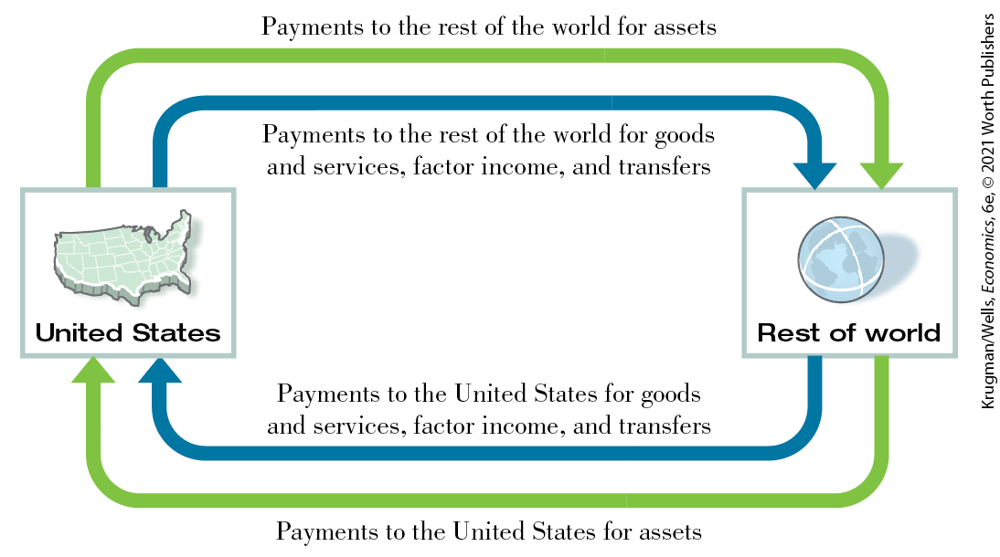

# Chapter 18 International Macroeconomics

<!--
<strong class="important">Krugman/Wells, </strong><i class="semantic-i"><strong class="important">Macroeconomics</strong></i> <strong class="important">6e Chapter 18 [will also be Econ Chapter 33]</strong>
--> <!--
<strong class="important">General Information: Comp will find Econ 5/e to be an excellent resource for preferences and desired layout of 6/e pages.</strong>
--> <!--
<strong class="important">[Comp: New RIGHT page.</strong>
--> <!--
<strong class="important">Verso running head: PART 8 THE INTERNATIONAL ECONOMY</strong>
--> <!--
<strong class="important">Recto running head: CHAPTER 18 INTERNATIONAL MACROECONOMICS]</strong>
--> <!--
<strong class="important">[Comp: Insert globe icon.]</strong>
-->

## SWITZERLAND DOESN’T WANT YOUR MONEY

<figure id="pau_9781319320164_QdnkwnMnwH" class="figure lm_img_lightbox unnum c2 right">

<figcaption>
The Swiss National Bank undertook extraordinary actions to protect the Swiss economy from massive inflows of foreign money.
</figcaption>
</figure>

**PARKING YOUR MONEY** in a Swiss bank is no way to get rich, given the low interest rates Swiss bankers offer. Since 2013, in fact, Swiss banks have paid negative interest on deposits, charging customers for the service of keeping their funds.

<!--
[CO18]
--> <!--
[Macro-CO18]
-->

But for generations, Swiss bank accounts have been seen as a way to *stay* rich, a safe place to store your wealth. In the troubled years that followed the 2008 financial crisis, the Swiss reputation for safety became especially important. European investors, in particular, poured enormous sums of money into Swiss banks.

And the Swiss hated it. The inflow of foreign funds led to a surge in the value of the Swiss franc that wreaked havoc with Swiss exports.

At the beginning of 2008, one Swiss franc traded for about 0.6 euro. By mid-2011, the franc was trading for around 0.9 euro, a 50% appreciation. That meant that Swiss exporters, other things equal, had seen a 50% rise in their labor costs relative to competitors elsewhere in Europe. Thanks to its reputation for quality, Switzerland has been remarkably successful over the years at selling goods to the world market, despite high labor costs. Nobody expects to get a bargain on Swiss watches or Swiss chocolate. But a 50% appreciation of the Swiss franc pushed Swiss exporters to the breaking point.

So what was to be done? Starting in early 2009, the Swiss National Bank, Switzerland’s equivalent of the Federal Reserve, began selling Swiss francs on the foreign exchange market in an attempt to hold down their value. In return, the Swiss National Bank received other currencies, mainly dollars and euros, which it added to its reserves. We’re talking about a *lot* of sales: over a period of $2\frac{1}{2}$ years, the bank added \$180 billion to its foreign exchange reserves, equal to a third of Switzerland’s GDP — the equivalent for the United States of selling \$5 trillion.

Yet even that wasn’t enough to stop the Swiss franc’s rise. In September 2011, as the franc seemed headed for a value of 1 euro or more, the Swiss National Bank announced that it would do whatever it took — that is, sell an unlimited amount of francs — to keep the franc below a maximum of 0.833 euro per franc. That announcement finally seemed to halt the franc’s rise.

What the extraordinary efforts of the Swiss National Bank illustrated was the importance of a dimension of macroeconomics that we haven’t emphasized so far — the fact that modern national economies trade large quantities of goods, services, and assets with the rest of the world. *International macroeconomics* is a branch of macroeconomics that deals with the relationships between national economies (it is sometimes referred to as *open-economy macroeconomics*). As the Swiss story illustrates, economic interactions with the rest of the world can have a profound impact on a domestic economy.

In this chapter we’ll learn about some of the key issues in international macroeconomics: the determinants of a country’s *balance of payments,* the factors affecting *exchange rates,* the different forms of *exchange rate policy* adopted by various countries, and the relationship between exchange rates and macroeconomic policy. 

<aside class="learning-objectives c3 main-flow v3" epub:type="learning-objectives" id="pau_9781319320164_dO67IUfpJ7">

### What you will learn

- What are the **balance of payments accounts?**
- What determines international capital flows?
- What roles do the **foreign exchange market** and the **exchange rate** play?
- How do **real exchange rates** affect the **current account?**
- Why do countries choose different **exchange rate regimes**, such as **fixed exchange rates** and **floating exchange rates?**
- How should domestic macroeconomic policy be adjusted as a consequence of international economic considerations?

</aside>

<!--
<strong class="important">[End Opening Story]</strong>
--> <!--
<strong class="important">[End of chapter-opening page]</strong>
-->

## Capital Flows and the Balance of Payments

In 2020 people living in the United States sold trillions of dollars’ worth of stuff to people living in other countries and bought trillions of dollars’ worth of stuff in return. What kind of stuff? All kinds. Residents of the United States (including firms operating in the United States) sold airplanes, bonds, software licenses, wheat, and many other items to residents of other countries. U.S. residents bought cars, stocks, oil, and many other items from residents of other countries.

How can we keep track of these transactions? In <a href="#kru_9781319245269_ch07_01.xhtml#pau_9781319320164_J4fyDEWkvv" id="kru_9781319245269_ch18_02.xhtml#pau_9781319320164_EpqAfQVRqv" class="crossref">Chapter 7</a> we learned that economists keep track of the domestic economy using the national income and product accounts. Economists keep track of international transactions using a different but related set of numbers, the *balance of payments accounts.*

### Balance of Payments Accounts

A country’s <a href="#kru_9781319245269_EM_glossary.xhtml#pau_9781319320164_UhWcVL2aCB" id="kru_9781319245269_ch18_02.xhtml#pau_9781319320164_TfapMltBKZ" class="glossref" role="doc-glossref">balance of payments accounts</a> are a summary of the country’s transactions with other countries for a given year.

<aside aria-label="title 1" class="glossary c3 main-flow v1" epub:type="glossary" id="pau_9781319320164_ksVWVUjIgO">

**balance of payments accounts**  
A country’s **balance of payments accounts** are a summary of the country’s transactions with other countries for a given year.

</aside>
<!--
<strong class="important">[Comp: For Key Terms, bold punctuation follows bold word (with the exception of em dashes). See end of chapter for corresponding Margin Definition copy.]</strong>
-->

To understand the basic idea behind the balance of payments accounts, let’s consider a small-scale example: not a country, but a family farm. Let’s say that we know the following about how last year went financially for the Costas, who own a small artichoke farm in California:

- They made \$100,000 by selling artichokes.
- They spent \$70,000 on running the farm, including purchases of new farm machinery, and another \$40,000 buying food, paying utility bills, replacing their worn-out car, and so on.
- They received \$500 in interest on their bank account but paid \$10,000 in interest on their mortgage.
- They took out a new \$25,000 loan to help pay for farm improvements but didn’t use all the money immediately. So they put the remaining \$5,500 in the bank.

|                                           |                                          |                                               |                                                                                                                                |
|-------------------------------------------|------------------------------------------|-----------------------------------------------|--------------------------------------------------------------------------------------------------------------------------------|
|                                           | Sources of cash                          | Uses of cash                                  | Net                                                                                                                            |
| Sales and purchases of goods and services | Artichoke sales: \$100,000               | Farm operation and living expenses: \$110,000 | $- \$ 10,000$ |
| Interest payments                         | Interest received on bank account: \$500 | Interest paid on mortgage: \$10,000           | $- \$ 9,500$  |
| Loans and deposits                        | Funds received from new loan: \$25,000   | Funds deposited in bank: \$5,500              | $+ \$ 19,500$ |
| Total                                     | \$125,500                                | \$125,500                                     | \$0                                                                                                                            |

TABLE 18-1 The Costas’ Financial Year

How could we summarize the Costas’ transactions for the year? One way would be with a table like <a href="#kru_9781319245269_ch18_02.xhtml#pau_9781319320164_uyN6qCnEvV" id="kru_9781319245269_ch18_02.xhtml#pau_9781319320164_iPB2LnPaUj" class="crossref">Table 18-1</a>, which shows sources of cash coming in and uses of cash going out, characterized under a few broad headings. The first row of <a href="#kru_9781319245269_ch18_02.xhtml#pau_9781319320164_uyN6qCnEvV" id="kru_9781319245269_ch18_02.xhtml#pau_9781319320164_y8DhdIRwE7" class="crossref">Table 18-1</a> shows sales and purchases of goods and services: sales of artichokes; purchases of groceries, heating oil, that new car, and so on. The second row shows interest payments: the interest the Costas received from their bank account and the interest they paid on their mortgage. The third row shows loans and deposits: cash coming in from a loan and cash deposited in the bank.

<!--
[COMP: Table 18-1 is from Macroeconomics 5e, p.532]
-->

In each row we show the net inflow of cash from that type of transaction. So the net in the first row is $- \$ 10,000$, because the Costas spent \$10,000 more than they earned. The net in the second row is $- \$ 9,500$, the difference between the interest the Costas received on their bank account and the interest they paid on the mortgage. The net in the third row is \$19,500: the Costas brought in \$25,000 with their new loan but put only \$5,500 of that sum in the bank.

The last row shows the sum of cash coming in from all sources and the sum of all cash used. These sums are equal, by definition: every dollar has a source, and every dollar received gets used somewhere. (What if the Costas hid money under the mattress? Then that would be counted as another “use” of cash.)

A country’s balance of payments accounts is a table that summarizes the country’s transactions with the rest of the world for a given year in a manner very similar to the way we just summarized the Costas’ financial year.

<a href="#kru_9781319245269_ch18_02.xhtml#pau_9781319320164_x6k1sc2YdA" id="kru_9781319245269_ch18_02.xhtml#pau_9781319320164_LbaZ7QcC1Q" class="crossref">Table 18-2</a> shows a simplified version of the U.S. balance of payments accounts for 2019. Where the Costas family’s accounts show sources and uses of cash, a country’s balance of payments accounts show payments from foreigners — sources of cash for the United States as a whole — and payments to foreigners — uses of cash for the United States as a whole.

<!--
[COMP: Update Table 18-2 from Macro 5e as shown]
-->

|                                           |                                                                                                                                                              |                          |                        |                                                                                                                             |
|-------------------------------------------|--------------------------------------------------------------------------------------------------------------------------------------------------------------|--------------------------|------------------------|-----------------------------------------------------------------------------------------------------------------------------|
|                                           |                                                                                                                                                              | Payments from foreigners | Payments to foreigners | Net                                                                                                                         |
| 1                                         | Sales and purchases of goods and services                                                                                                                    | \$2,498                  | \$3,114                | $- \$ 616$ |
| 2                                         | Factor income                                                                                                                                                | 1,123                    | 866                    | 257                                                                                                                         |
| 3                                         | Transfers                                                                                                                                                    | 143                      | 282                    | $- 139$    |
|                                           | Current account $\text{(}1 + 2 + 3\text{)}$ |                          |                        | $- 498$    |
| 4                                         | Asset sales and purchases (financial account)                                                                                                                | 784                      | 427                    | 357                                                                                                                         |
|                                           | Financial account (4)                                                                                                                                        |                          |                        | 357                                                                                                                         |
|                                           | Statistical discrepancy                                                                                                                                      | —                        | —                      | $- 141$    |
| *Data from:* Bureau of Economic Analysis. |                                                                                                                                                              |                          |                        |                                                                                                                             |

TABLE 18-2 The U.S. Balance of Payments in 2019 (billions of dollars)

Row 1 of <a href="#kru_9781319245269_ch18_02.xhtml#pau_9781319320164_x6k1sc2YdA" id="kru_9781319245269_ch18_02.xhtml#pau_9781319320164_TEdfXniJYw" class="crossref">Table 18-2</a> shows payments that arise from U.S. sales to foreigners and U.S. purchases from foreigners of goods and services in 2019. For example, the number in the second column of row 1, \$2,498 billion, incorporates items such as the value of U.S. wheat exports and the fees foreigners paid to U.S. consulting companies in 2019. The number in the third column of row 1, \$3,114 billion, incorporates items such as the value of U.S. oil imports and the fees U.S. companies paid to Indian call centers — the people who often answer your 1-800 calls — in 2019.

Row 2 shows U.S. *factor income* in 2019 — the income that foreigners paid to U.S. residents for the use of U.S.-owned factors of production, as well as income paid by Americans to foreigners for the use of foreign-owned factors of production. Factor income mostly consists of investment income, such as interest paid by Americans on loans from overseas, profits of U.S.-owned corporations that operate overseas, and the like. For example, the profits earned by Disneyland Paris, which is owned by the U.S.-based Walt Disney Company, are included in the \$1,123 billion figure in the second column of row 2. The profits earned by the U.S. operations of Japanese auto companies are included in the \$866 billion figure shown in the third column of row 2. Factor income also includes some labor income. For example, the wages of an American engineer who worked temporarily on a construction site in Dubai are counted in the \$1,123 billion figure in the second column.

Row 3 shows *international transfers* for the United States in 2019 — funds sent by U.S. residents to residents of other countries and vice versa. The figure in the second column of row 3, \$143 billion, includes payments sent home by skilled U.S. workers who work abroad. The third column accounts for the major portion of international transfers. That figure, \$282 billion, is composed mainly of remittances that immigrants who reside in the United States, such as the millions of Mexican-born workers employed in the United States, send to their families in their country of origin.

Row 4 of the table shows net payments accruing from sales and purchases of assets between U.S. residents and foreigners in 2019. Such payments involve a wide variety of transactions, from Chinese companies purchasing U.S. firms to U.S. purchases of European stocks and bonds. The details of these transactions are complex, and if you add up all purchases the value is very large, which is why we focus only on the net value. Overall, according to official figures, and as you can see in the table, U.S. residents sold \$357 billion more in assets than they purchased.

In laying out <a href="#kru_9781319245269_ch18_02.xhtml#pau_9781319320164_x6k1sc2YdA" id="kru_9781319245269_ch18_02.xhtml#pau_9781319320164_o0K0krmXxt" class="crossref">Table 18-2</a>, we have separated rows 1, 2, and 3 into one group, to distinguish them from row 4, reflecting a fundamental difference in how these two groups of transactions affect the future. When a U.S. resident sells a good such as wheat to a foreigner, that’s the end of the transaction. But a financial asset, such as a bond, is different: it is a promise to pay interest and principal in the future. So when a U.S. resident sells a bond to a foreigner, that sale creates a liability: the U.S. resident will have to pay interest and repay principal in the future. The balance of payments accounts distinguish between transactions that don’t create liabilities and those that do.

Transactions that don’t create liabilities are considered part of the <a href="#kru_9781319245269_EM_glossary.xhtml#pau_9781319320164_6gxQInMDXY" id="kru_9781319245269_ch18_02.xhtml#pau_9781319320164_5wWNcAJA2g" class="glossref" role="doc-glossref">balance of payments on current account</a>, often referred to simply as the <a href="#kru_9781319245269_EM_glossary.xhtml#pau_9781319320164_1ESliKqoJc" id="kru_9781319245269_ch18_02.xhtml#pau_9781319320164_5m8cWyG5qw" class="glossref" role="doc-glossref">current account</a>: the balance of payments on goods and services plus net international transfer payments and factor income. This corresponds to rows 1, 2, and 3 in <a href="#kru_9781319245269_ch18_02.xhtml#pau_9781319320164_x6k1sc2YdA" id="kru_9781319245269_ch18_02.xhtml#pau_9781319320164_HuXEXsS1Zt" class="crossref">Table 18-2</a>. In practice, row 4 of the table, amounting to $- \$ 616\,\text{billion}$, corresponds to the most important part of the current account: the <a href="#kru_9781319245269_EM_glossary.xhtml#pau_9781319320164_GTiimWR8YC" id="kru_9781319245269_ch18_02.xhtml#pau_9781319320164_tdK59utHo7" class="glossref" role="doc-glossref">balance of payments on goods and services</a>, the difference between the value of exports and the value of imports during a given period.

<aside aria-label="title 2" class="glossary c3 main-flow v1" epub:type="glossary" id="pau_9781319320164_TzSJfBNlhe">

**balance of payments on current account, current account**  
A country’s **balance of payments on current account**, or **current account**, is its balance of payments on goods and services plus net international transfer payments and factor income.

</aside>
<aside aria-label="title 3" class="glossary c3 main-flow v1" epub:type="glossary" id="pau_9781319320164_gVJ994yvS7">

**balance of payments on goods and services**  
A country’s **balance of payments on goods and services** is the difference between its exports and its imports during a given period.

</aside>

In economic news reports, you may see references to another measure, the <a href="#kru_9781319245269_EM_glossary.xhtml#pau_9781319320164_D2MLIxwFLJ" id="kru_9781319245269_ch18_02.xhtml#pau_9781319320164_ae9Bb9bgzQ" class="glossref" role="doc-glossref">merchandise trade balance</a>, sometimes referred to as the <a href="#kru_9781319245269_EM_glossary.xhtml#pau_9781319320164_wy1hndBvQT" id="kru_9781319245269_ch18_02.xhtml#pau_9781319320164_8EjJdEjdqe" class="glossref" role="doc-glossref">trade balance</a>, for short. It is the difference between a country’s exports and imports of goods alone — not including services. Economists sometimes focus on the merchandise trade balance, even though it’s an incomplete measure, because data on international trade in services aren’t as accurate as data on trade in physical goods, and they are also slower to arrive.

<aside aria-label="title 4" class="glossary c3 main-flow v1" epub:type="glossary" id="pau_9781319320164_BzMzmauK0j">

**merchandise trade balance, trade balance**  
The **merchandise trade balance**, or **trade balance**, is the difference between a country’s exports and imports of goods.

</aside>

Transactions that involve the sale or purchase of assets, and therefore do create future liabilities, are considered part of the <a href="#kru_9781319245269_EM_glossary.xhtml#pau_9781319320164_k6IWlmm406" id="kru_9781319245269_ch18_02.xhtml#pau_9781319320164_QJl8k52mcK" class="glossref" role="doc-glossref">balance of payments on financial account</a>, or the <a href="#kru_9781319245269_EM_glossary.xhtml#pau_9781319320164_afdH3Swfge" id="kru_9781319245269_ch18_02.xhtml#pau_9781319320164_iJlABevYrY" class="glossref" role="doc-glossref">financial account</a> for short, for a given period. This corresponds to row 4 in <a href="#kru_9781319245269_ch18_02.xhtml#pau_9781319320164_x6k1sc2YdA" id="kru_9781319245269_ch18_02.xhtml#pau_9781319320164_f6jekV2JER" class="crossref">Table 18-2</a>, which was \$357 billion in 2019. (Until a few years ago, economists often referred to the financial account as the *capital account.* We’ll use the modern term, but you may run across the older term.)

<aside aria-label="title 5" class="glossary c3 main-flow v1" epub:type="glossary" id="pau_9781319320164_23CydHXl6F">

**balance of payments on financial account, financial account**  
A country’s **balance of payments on financial account**, or simply its **financial account**, is the difference between its sales of assets to foreigners and its purchases of assets from foreigners for a given period.

</aside>

So how does it all add up? The rows shaded purple in <a href="#kru_9781319245269_ch18_02.xhtml#pau_9781319320164_x6k1sc2YdA" id="kru_9781319245269_ch18_02.xhtml#pau_9781319320164_kWJcMuPIYT" class="crossref">Table 18-2</a> show the bottom lines: the overall U.S. current account and financial account for 2019. As you can see:

- The United States ran a *current account deficit:* the amount it paid to foreigners for goods, services, factors, and transfers was more than the amount it received.
- Simultaneously, it ran a *financial account surplus:* the value of the assets it sold to foreigners was more than the value of the assets it bought from foreigners.
- In the official data, the U.S. current account deficit and financial account surplus didn’t offset each other: the financial account surplus in 2019 was \$141 billion smaller than the current account deficit (shown in the final row of the table). But that was just a statistical error, reflecting the imperfection of official data. (The discrepancy may have reflected foreign purchases of U.S. assets that official data somehow missed.)

<!--
<strong class="important">[Start FIM Box; position near here]</strong>
--> <!--
<strong class="important">[Comp: insert globe icon]</strong>
-->
<aside class="case-study c3 main-flow v1" epub:type="case-study" id="pau_9781319320164_4MFdKnhC7W" title="For Inquiring Minds">

#### For inquiring minds

GDP, GNP, and the Current Account

When we discussed national income accounting in <a href="#kru_9781319245269_ch07_01.xhtml#pau_9781319320164_J4fyDEWkvv" id="kru_9781319245269_ch18_02.xhtml#pau_9781319320164_gZJGd0VTLc" class="crossref">Chapter 7</a>, we derived the basic equation relating GDP to the components of spending:

$$Y = C + I + G + X - IM$$

where *X* and *IM* are exports and imports, respectively, of goods and services. But as we’ve learned, the balance of payments on goods and services is only one component of the current account balance. Why doesn’t the national income equation use the current account as a whole?

The answer is that gross domestic product, *Y,* is the value of goods and services produced domestically. So it doesn’t include international factor income and international transfers, two sources of income that are included in the calculation of the current account balance. The profits of Ford Motors U.K. aren’t included in the U.S. GDP, and the funds Latin American immigrants send home to their families aren’t subtracted from GDP.

<figure id="pau_9781319320164_qzK1aWkcRF" class="figure lm_img_lightbox unnum c2 right">

<figcaption>
The funds Latin American immigrants send abroad are included in GDP because they were earned for services performed in the United States.
</figcaption>
</figure>

Shouldn’t we have a broader measure that does include these sources of income? Actually, gross *national* product — GNP — does include international factor income. Estimates of U.S. GNP differ slightly from estimates of GDP because GNP adds in items such as the earnings of U.S. companies abroad and subtracts items such as the interest payments on bonds owned by residents of China and Japan. There isn’t, however, any regularly calculated measure that includes transfer payments.

Why do economists usually use GDP rather than a broader measure? Two reasons. First, the original purpose of the national accounts was to track production rather than income. Second, data on international factor income and transfer payments are generally considered somewhat unreliable. So if you’re trying to keep track of movements in the economy, it usually makes sense to focus on GDP, because it doesn’t include these unreliable data. (As the Economics in Action on “leprechaun economics” shows, however, sometimes GDP has problems, too.)

<!--
[Macro-18UN01]
--> <!--
[Macro-18UN01]
--> <!--
<strong class="important">[End FIM Box]</strong>
-->
</aside>

In fact, it’s a basic rule of balance of payments accounting that the current account and the financial account must sum to zero:

$$\text{Current}\,\text{account}\,\text{(}CA\text{)} + \text{Financial}\,\text{account}\,\text{(}FA\text{)} = 0$$

**(18-1)**

or

$$CA = - FA$$

Why must <a href="#kru_9781319245269_ch18_02.xhtml#pau_9781319320164_jMPyj0PZJ9" id="kru_9781319245269_ch18_02.xhtml#pau_9781319320164_8O4iy8vaZP" class="crossref">Equation 18-1</a> be true? We already saw the fundamental explanation in <a href="#kru_9781319245269_ch18_02.xhtml#pau_9781319320164_uyN6qCnEvV" id="kru_9781319245269_ch18_02.xhtml#pau_9781319320164_Khz0Spksw7" class="crossref">Table 18-1</a>, which showed the accounts of the Costas family: in total, the sources of cash must equal the uses of cash. The same applies to balance of payments accounts. <a href="#kru_9781319245269_ch18_02.xhtml#pau_9781319320164_1cwK0lr2IF" id="kru_9781319245269_ch18_02.xhtml#pau_9781319320164_UiZThgHTdO" class="crossref">Figure 18-1</a>, a variant on the circular-flow diagram we have found useful in discussing domestic macroeconomics, may help you visualize how this adding up works. Instead of showing the flow of money *within* a national economy, <a href="#kru_9781319245269_ch18_02.xhtml#pau_9781319320164_1cwK0lr2IF" id="kru_9781319245269_ch18_02.xhtml#pau_9781319320164_JN5DoUCiFW" class="crossref">Figure 18-1</a> shows the flow of money *between* national economies.

<!--
[Macro-Figure 18-1]
-->

<figure id="pau_9781319320164_1cwK0lr2IF" class="figure lm_img_lightbox num c3 main-flow">

<figcaption>
FIGURE 18-1 The Balance of Payments

The blue arrows represent payments that are counted in the current account. The green arrows represent payments that are counted in the financial account. Because the total flow into the United States must equal the total flow out of the United States, the sum of the current account plus the financial account is zero.
</figcaption>
</figure>

<aside class="hidden" id="pau_9781319320164_qWevovK64D" title="hidden">

A box labeled United States is on the left, and another box labeled Rest of world is on the right. A green arrow from United States to Rest of world is labeled, “Payments to the rest of the world for assets,” and a blue arrow from United States to Rest of world is labeled, “Payments to the rest of the world for goods and services, factor income, and transfers.” These two arrows are above the boxes. Another green arrow from Rest of world to United States is labeled, “Payments to the United States for assets,” and another blue arrow from Rest of world to United States is labeled, “Payments to the United States for goods and services, factor income, and transfers.” These two arrows are below the boxes.

</aside>

Money flows into the United States from the rest of the world as payment for U.S. exports of goods and services, as payment for the use of U.S.-owned factors of production, and as transfer payments. These flows, indicated by the lower blue arrow, are the positive components of the U.S. current account. Money also flows into the United States from foreigners who purchase U.S. assets. They make up the positive component of the U.S. financial account and are shown by the lower green arrow.

At the same time, money flows from the United States to the rest of the world as payment for U.S. imports of goods and services, as payment for the use of foreign-owned factors of production, and as transfer payments. These flows, indicated by the upper blue arrow, are the negative components of the U.S. current account. Money also flows from the United States to purchase foreign assets. They make up the negative component of the U.S. financial account and are shown by the upper green arrow.

As in all circular-flow diagrams, the flow into a box and the flow out of a box are equal. This means that the sum of the blue and green arrows going into the United States (at the bottom of the diagram) is equal to the sum of the blue and green arrows going out of the United States (at the top of the diagram). That is:

$$\begin{matrix}
{\begin{matrix}
\underset{\text{(lower~blue~arrow)}}{\text{Positive~current~account~entries}} & + & \underset{\text{(lower~green~arrow)}}{\text{Positive~financial~account~entries}}
\end{matrix} =} \\
\begin{matrix}
\underset{\text{(upper~blue~arrow)}}{\text{Negative~current~account~entries}} & + & \underset{\text{(upper~green~arrow)}}{\text{Negative~financial~account~entries}}
\end{matrix}
\end{matrix}$$

**(18-2)**

<a href="#kru_9781319245269_ch18_02.xhtml#pau_9781319320164_lwuDrqpa8D" id="kru_9781319245269_ch18_02.xhtml#pau_9781319320164_gA9hLqvXJg" class="crossref">Equation 18-2</a> can be rearranged as follows:

$$\begin{matrix}
\begin{matrix}
\text{Positive~current~account~entries} & - & {\text{Negative~current~account~entries}\operatorname{~+~}}
\end{matrix} \\
\begin{matrix}
\text{Positive~financial~account~entries} & - & {\text{Negative~financial~account~entries} = 0} & 
\end{matrix}
\end{matrix}$$

**(18-3)**

<a href="#kru_9781319245269_ch18_02.xhtml#pau_9781319320164_e6Q2jsegD8" id="kru_9781319245269_ch18_02.xhtml#pau_9781319320164_kk0FbUakC0" class="crossref">Equation 18-3</a> is equivalent to <a href="#kru_9781319245269_ch18_02.xhtml#pau_9781319320164_jMPyj0PZJ9" id="kru_9781319245269_ch18_02.xhtml#pau_9781319320164_JFoDMjtnQC" class="crossref">Equation 18-1</a>: once we have summed up the positive and negative entries within each account, the current account plus the financial account is equal to zero.

But what determines the current account and the financial account?

### Modeling the Financial Account

A country’s financial account measures its net sales of assets to foreigners. There is, however, another way to think about the financial account: it’s a measure of *capital inflows,* of foreign savings that are available to finance domestic investment spending.

What determines these capital inflows?

Part of the explanation will have to wait until later because some international capital flows are carried out by governments and central banks, which sometimes act very differently from private investors. But we can gain insight into the motivations for capital flows that are the result of private decisions by using the *loanable funds model* developed in <a href="#kru_9781319245269_ch10_01.xhtml#pau_9781319320164_GbPAtnS6LO" id="kru_9781319245269_ch18_02.xhtml#pau_9781319320164_bK2UsKA1WL" class="crossref">Chapter 10</a> and, in particular, in <a href="#kru_9781319245269_ch10_02.xhtml#pau_9781319320164_Ch3ZKgrG8m" id="kru_9781319245269_ch18_02.xhtml#pau_9781319320164_0Sd9dygzsz" class="crossref">Figures 10-7</a> and <a href="#kru_9781319245269_ch10_02.xhtml#pau_9781319320164_6KBQH7i7yd" id="kru_9781319245269_ch18_02.xhtml#pau_9781319320164_xievEJh3nV" class="crossref">10-8</a>. In using this model to analyze the financial account, we make two important simplifications:

1.  We assume that all international capital flows are in the form of loans. In reality, capital flows take many forms, including purchases of shares of stock in foreign companies and foreign real estate as well as *direct foreign investment,* in which companies build factories or acquire other productive assets abroad.
2.  We ignore the effects of expected changes in exchange rates, the relative values of different national currencies. We analyze the determination of exchange rates shortly.

<!--
<strong class="important">[Start GC Box; position near here]</strong>
-->
<aside class="case-study c3 main-flow v5" epub:type="case-study" id="pau_9781319320164_I4vSMkXA8c" title="GLOBAL COMPARISON">
