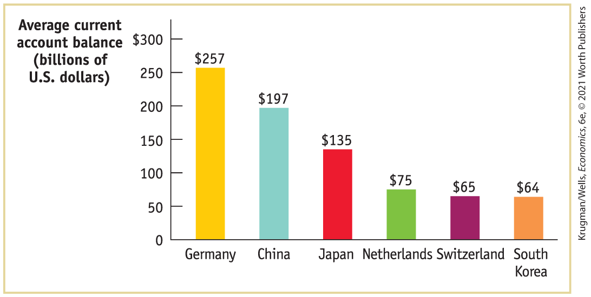
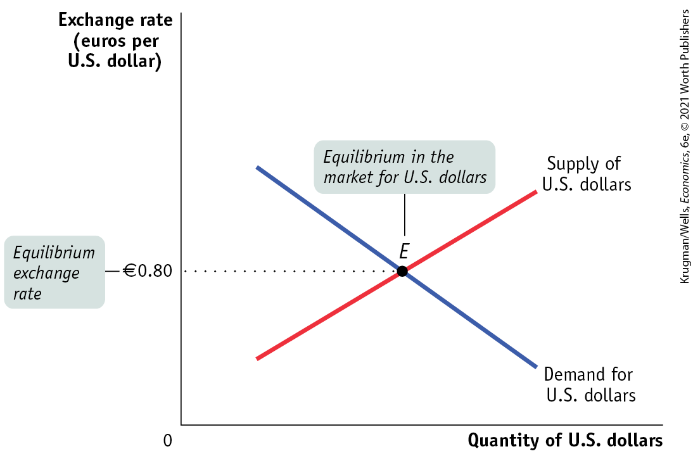
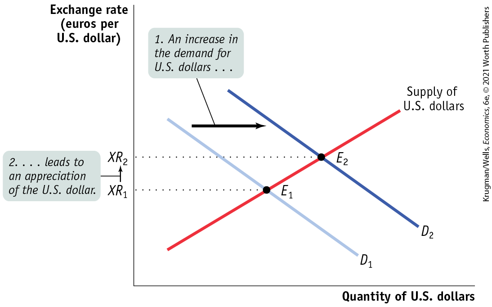

#### Global comparison

BIG SURPLUSES

As we’ve seen, the United States generally runs a large deficit in its current account. In fact, the United States leads the world in its current account deficit; other countries run bigger deficits as a share of GDP, but they have much smaller economies, so the U.S. deficit is much bigger in absolute terms.

For the world as a whole, however, deficits on the part of some countries must be matched with surpluses on the part of other countries. So who are the surplus nations offsetting U.S. deficits, and what if anything do they have in common?

The accompanying figure shows the average current account surplus of the six countries that ran the largest surpluses over the period from 2009 to 2018. You may not be surprised to see China on this list. For a time China had a deliberate policy of keeping its currency weak relative to other currencies.

<!--
[Macro-18UN02]
--> <!--
[Macro-18UN02 is UNNUMBERED LINE ART &#x2013; No caption]
-->

<figure id="pau_9781319320164_p71McrSRxM" class="figure lm_img_lightbox unnum c5 center">

</figure>

<aside class="hidden" id="pau_9781319320164_Vq27VIGbwo" title="hidden">

The vertical axis, labeled Average current account balance (billions of U S dollars) ranges from 0 to 300 dollars in increments of 50 dollars. The horizontal axis plots the following countries from left to right, Germany, China, Japan, Netherlands, Switzerland, and South Korea. The data from the graph are as follows, Germany, 257 dollars; China, 197 dollars; Japan, 135 dollars; Netherlands, 75 dollars, Switzerland, 65 dollars; and South Korea, 64 dollars.

</aside>

Germany, Japan, the Netherlands, Switzerland, and South Korea run current account surpluses for more or less the same reasons: they are rich nations with high savings rates, giving them a lot of money to invest. They also have slow long-run growth, which reduces the opportunities for domestic investment. So, much of their savings goes abroad, which means that they run deficits on the financial account and surpluses on the current account.

The current account surpluses of Germany, which tops the list, and the Netherlands have also grown thanks to the declining value of the euro. A lower euro has reduced the cost of their manufacturing goods on world markets, allowing them to export more.

Overall, the surplus countries are a diverse group. If your picture of the world is simply one of U.S. deficits versus Chinese surpluses, you’re missing a large part of the story.

<!--
 <strong class="important">[End GC Box]</strong>
-->
</aside>

Recall <a href="#kru_9781319245269_ch10_02.xhtml#pau_9781319320164_Ch3ZKgrG8m" id="kru_9781319245269_ch18_02.xhtml#pau_9781319320164_JkoJeYHqeI" class="crossref">Figure 10-7</a> from our discussion of the global loanable funds market in <a href="#kru_9781319245269_ch10_01.xhtml#pau_9781319320164_GbPAtnS6LO" id="kru_9781319245269_ch18_02.xhtml#pau_9781319320164_8hqdodL3eN" class="crossref">Chapter 10</a>. It shows a hypothetical world consisting of two countries, the United States and Britain, which would have different equilibrium interest rates — 6% in the United States, 2% in Britain — in the absence of international capital flows. But this difference in interest rates will not persist if it is easy for British lenders to make their funds available to U.S. borrowers. In fact, if British lenders consider loans to Americans just as good as domestic loans, interest rates will fall in the United States and rise in Britain until they are the same in both countries, with the United States, in effect, importing loanable funds from Britain. This equalization of interest rates (at 4%) is shown in <a href="#kru_9781319245269_ch10_02.xhtml#pau_9781319320164_6KBQH7i7yd" id="kru_9781319245269_ch18_02.xhtml#pau_9781319320164_eIcqwPz7Wl" class="crossref">Figure 10-8</a>.

However, given our two simplifying assumptions, the loanable funds the United States imports from Britain (which are Britain’s excess savings or capital outflows), are precisely the U.S. balance of payments on the financial account! So the financial account is determined by the supply and demand for loanable funds: capital moves from places where it would be cheap in the absence of international capital flows to places where it would be expensive in the absence of such flows.

### Underlying Determinants of International Capital Flows

While the loanable funds model tells us the direction of capital flows — from countries in which capital is cheap to countries in which capital is expensive — it doesn’t explain why. That is, why is capital cheap in one country but expensive in another?

International differences in investment opportunities generate international differences in the demand for capital. A country with a rapidly growing economy, other things equal, will offer more investment opportunities and a higher return to investors than a country with a slowly growing economy. So a country with a rapidly growing economy will typically have a higher demand for capital than the country with a slowly growing economy. As a result, capital tends to flow from slowly growing to rapidly growing economies.

International differences in the supply of funds reflect differences in savings across countries. These may be the result of differences in private savings rates, which vary among countries. They may also reflect differences in savings by governments. In particular, government budget deficits, which reduce overall national savings, can lead to capital inflows.

Now we can put together the demand for capital generated by investment opportunities within a country, with the supply for capital generated by savings within a country, to explain differences in interest rates across countries. Other things equal, countries with a high demand for capital $\text{and/or}$ a low supply of capital will have higher interest rates. As a result, they will be the recipients of capital inflows.

<!--
<strong class="important">[COMP: Please carry blue AU: comments to pages.]</strong>
--> <!--
<strong class="important">[AU: Comment from Ryan: Is this classic example still needed?]</strong>
-->

Conversely, other things equal, countries with a low demand for funds $\text{and/or}$ a high supply of funds will have lower interest rates. As a result, they will be the sources of capital outflows. The classic example of international capital flows is the flow of capital from Britain to the United States and other New World economies from 1870 to 1914. During that era, the United States was rapidly industrializing and had a high demand for capital. But Britain, which already industrialized, had a slowly growing economy with a large amount of accumulated savings.

### Two-Way Capital Flows

In fact, it is the direction of *net* capital flows — the excess of inflows into a country over outflows, or vice versa — that is explained by the loanable funds model. The direction of *net* flows, other things equal, is determined by differences in interest rates between countries. However, *gross* flows take place in both directions: for example, the United States both sells assets to foreigners and buys assets from foreigners. Why does capital move in both directions?

The answer to this question is that in the real world, as opposed to the simple model just described, there are other motives for international capital flows besides seeking a higher rate of interest.

Individual investors often seek to diversify against risk by buying stocks in several countries. Stocks in Europe may do well when stocks in the United States do badly, or vice versa, so investors in Europe try to reduce their risk by buying some U.S. stocks, as U.S. investors try to reduce their risk by buying some European stocks. The result is capital flows in both directions.

<!--
[Macro-18UN03]
--> <!--
[Macro-18UN03]
-->

<figure id="pau_9781319320164_iLCCdpWusV" class="figure lm_img_lightbox unnum c2 right">

<figcaption>
Many American companies have opened plants in China to access the growing Chinese market and take advantage of low labor costs.
</figcaption>
</figure>

Meanwhile, corporations often engage in international investment as part of their business strategy — for example, auto companies may find that they can compete better in an overseas market if they assemble some of their cars in that location. Such business investments can also lead to two-way capital flows, as, say, European car makers build plants in the United States even as U.S. computer companies open facilities in Europe.

Finally, some countries, including the United States, are international banking centers: people from all over the world put money in U.S. financial institutions, which then invest many of those funds overseas.

The result of these two-way flows is that modern economies are typically both debtors (countries that owe money to the rest of the world) and creditors (countries to which the rest of the world owes money). Due to years of both capital inflows and outflows, at the end of 2016, the United States had accumulated foreign assets worth \$29.3 trillion, and foreigners had accumulated assets in the United States worth \$40.3 trillion.

<!--
<strong class="important">[Start EIA] [NOTE: EIA runs in exactly as shown in MS. It DOES NOT float. ALL SUCH.]</strong>
--> <!--
<strong class="important">[Comp: insert globe icon]</strong>
-->

### ECONOMICS \>\> *in Action*

Leprechaun Economics

One factor we didn’t mention in our discussion of international capital flows was taxation. Yet tax rates on corporate profits vary considerably between nations. France, for example, has a corporate tax rate of 28%, while Ireland’s rate is only 12.5%. These tax differences create an incentive for multinational corporations to report large investments in low-tax countries.

Notice how we worded this: it gives corporations an incentive to *report* large investments in countries like Ireland. Consider the operations of Apple’s Irish subsidiary, which buys parts from Apple operations in other countries and sells much of what it makes to other Apple branches; it also pays royalties to the home company for its use of Apple patents. How profitable is that subsidiary? It’s hard to say, because both the prices it receives and the prices it pays largely reflect internal Apple decisions rather than some independent market.

So it’s easy for Apple to record very large profits on its Irish operations; as long as it doesn’t send the profits home, these profits are considered to have been invested in Ireland, even though there isn’t any real investment taking place.

Tax avoidance doesn’t just distort balance of payments statistics. It can also distort national income accounting, especially for smaller countries. In 2015 Ireland reported that its real GDP rose 26%, which was obviously not the economy’s true growth rate. What happened was that several big companies changed their accounting, choosing to attribute more of their value added to Ireland. One of this book’s authors immediately dubbed the bizarre reported figure “leprechaun economics,” a term quickly picked up by the Irish, who fortunately have a good sense of humor about themselves (and who have developed alternative measures that give a better picture of the economy’s true growth.)

Unfortunately, joking aside, this kind of profit shifting has become a major problem for tax collection. The IMF estimates that “phantom” capital flows, done solely to avoid taxes, account for about 40% of international corporate investment. This represents a serious revenue loss for many governments.

<!--
<strong class="important">[End EIA]</strong>
--> <!--
<strong class="important">[Quick Review and Check Your Understanding position exactly where shown in MS. They do not float. ALL SUCH. See layouts for recto/verso design differences.]</strong>
-->

### \>\> *Quick Review*

- The **balance of payments accounts**, which track a country’s international transactions, are composed of the **balance of payments on current account**, or the **current account**, plus the **balance of payments on financial account**, or the **financial account.** The most important component of the current account is the **balance of payments on goods and services**, which itself includes the **merchandise trade balance**, or the **trade balance.**
- Because the sources of payments must equal the uses of payments, the current account plus the financial account sum to zero.
- The direction of *net* capital flows — the excess of inflows over outflows, or vice versa — is determined by differences in interest rates. Interest rate differences across countries arise from the different types of investment opportunities available and variations in savings behavior.
- In the real world, countries experience two-way capital flows — *gross* flows of capital in and out — because factors other than interest rate differences affect investors’ decisions.

### \>\> *Check Your Understanding* 18-1

1.  Which of the balance of payments accounts do the following events affect?
    1.  Boeing, a U.S.-based company, sells a newly built airplane to China.
    2.  Chinese investors buy stock in Boeing from U.S. residents.
    3.  A Chinese company buys a used airplane from American Airlines and ships it to China.
    4.  A Chinese investor who owns property in the United States buys a corporate jet, which they will keep in the United States so they can travel around America.
2.  What effect do you think the collapse of the U.S. housing bubble in 2008, and the ensuing Great Recession, had on international capital flows into the United States?

## The Role of the Exchange Rate

We’ve just seen how differences in the supply of loanable funds from savings and the demand for loanable funds for investment spending lead to international capital flows. We’ve also learned that a country’s balance of payments on current account plus its balance of payments on financial account add to zero: a country that receives net capital inflows must run a matching current account deficit, and a country that generates net capital outflows must run a matching current account surplus.

The behavior of the financial account — reflecting inflows or outflows of capital — is best described by equilibrium in the global loanable funds market. At the same time, the balance of payments on goods and services, the main component of the current account, is determined by decisions in the international markets for goods and services.

So given that the financial account reflects the movement of capital and the current account reflects the movement of goods and services, what ensures that the balance of payments really does balance? That is, what ensures that the two accounts actually offset each other?

Not surprisingly, a price is what makes these two accounts balance. Specifically, that price is the *exchange rate,* which is determined in the *foreign exchange market.*

### Understanding Exchange Rates

In general, goods, services, and assets produced in a country must be paid for in that country’s currency. U.S. products must be paid for in dollars; European products must be paid for in euros; Japanese products must be paid for in yen. Occasionally, sellers will accept payment in foreign currency, but they will then exchange that currency for domestic money.

International transactions, then, require a market — the <a href="#kru_9781319245269_EM_glossary.xhtml#pau_9781319320164_pQLvYdEmEH" id="kru_9781319245269_ch18_03.xhtml#pau_9781319320164_OMGhQSIym2" class="glossref" role="doc-glossref">foreign exchange market</a> — in which currencies can be exchanged for each other. This market determines <a href="#kru_9781319245269_EM_glossary.xhtml#pau_9781319320164_Vn1GWSggIi" id="kru_9781319245269_ch18_03.xhtml#pau_9781319320164_oJx3Fx4rwh" class="glossref" role="doc-glossref">exchange rates</a>, the prices at which currencies trade. (The foreign exchange market is, in fact, not located in any one geographic spot. Rather, it is a global electronic market that traders around the world use to buy and sell currencies.)

<aside aria-label="title 6" class="glossary c3 main-flow v1" epub:type="glossary" id="pau_9781319320164_lMdHZPLScB">

**foreign exchange market**  
Currencies are traded in the **foreign exchange market.**

</aside>
<aside aria-label="title 7" class="glossary c3 main-flow v1" epub:type="glossary" id="pau_9781319320164_808m6bBHko">

**exchange rates**  
The prices at which currencies trade are known as **exchange rates.**

</aside>

<a href="#kru_9781319245269_ch18_03.xhtml#pau_9781319320164_ZECNnDfQq9" id="kru_9781319245269_ch18_03.xhtml#pau_9781319320164_ZF4JPuXieB" class="crossref">Table 18-3</a> shows exchange rates among the world’s three most important currencies as of 11 P.M., EDT, on May 6, 2020. Each entry shows the price of the “row” currency in terms of the “column” currency. For example, at that time US\$1 exchanged for €0.9259, so it took €0.9259 to buy US\$1. Similarly, it took US\$1.0800 to buy €1. These two numbers reflect the same rate of exchange between the euro and the U.S. dollar: $1\text{/}1.0800 = 0.9259$.

<!--
<strong class="important">[COMP: Update Macro 5e Table 18-3 as shown]</strong>
-->

|                               |              |        |        |
|-------------------------------|--------------|--------|--------|
|                               | U.S. dollars | Yen    | Euros  |
| One U.S. dollar exchanged for | 1            | 106.27 | 0.9259 |
| One yen exchanged for         | 0.0094       | 1      | 0.0087 |
| One euro exchanged for        | 1.0800       | 114.74 | 1      |

TABLE 18-3 Exchange Rates, May 6, 2020, 11 P.M.

There are two ways to write any given exchange rate. In this case, there were €0.9259 to US\$1 and US\$1.0800 to €1. Which is the correct way to write it? The answer is that there is no fixed rule. In most countries, people tend to express the exchange rate as the price of a dollar in domestic currency. However, this rule isn’t universal, and the U.S. dollar–euro rate is commonly quoted both ways. The important thing is to be sure you know which one you are using, as explained in the accompanying Pitfalls.

<!--
<strong class="important">[Start Pitfalls Box; position near here]</strong>
--> <!--
<strong class="important">[Comp: insert globe icon]</strong>
-->
<aside class="case-study c3 main-flow v5" epub:type="case-study" id="pau_9781319320164_DRJh40aTEM" title="Pitfalls">

#### *Pitfalls*

WHICH WAY IS UP?

Someone says that “The U.S. exchange rate is up.” What exactly does that mean?

It isn’t clear. Sometimes the exchange rate is measured as the price of a dollar in terms of foreign currency, sometimes as the price of foreign currency in terms of dollars. So the statement could mean either that the dollar appreciated or that it depreciated!

You have to be particularly careful when using published statistics. Most countries other than the United States state their exchange rates in terms of the price of a dollar in their domestic currency — for example, Mexican officials will say that the exchange rate is 10, meaning 10 pesos per dollar. But Britain, for historical reasons, usually states its exchange rate the other way. On May 6, 2020, US\$1 was worth £0.8088, and £1 was worth US\$1.2364. More often than not, this number is reported as an exchange rate of 1.2364. In fact, on occasion, professional economists and consultants embarrass themselves by getting the direction in which the pound is moving wrong!

By the way, Americans generally follow other countries’ lead: we usually say that the exchange rate against Mexico is 10 pesos per dollar but that the exchange rate against Britain is 1.24 dollars per pound. But this rule isn’t reliable; exchange rates against the euro are often stated both ways.

So before using exchange rate data, always ask yourself: which way is the exchange rate being measured?

<!--
<strong class="important">[End Pitfalls Box]</strong>
-->
</aside>

When discussing movements in exchange rates, economists use specialized terms to avoid confusion. When a currency becomes more valuable in terms of other currencies, economists say that the currency <a href="#kru_9781319245269_EM_glossary.xhtml#pau_9781319320164_PAu0LB214p" id="kru_9781319245269_ch18_03.xhtml#pau_9781319320164_ASmCRoFFdt" class="glossref" role="doc-glossref">appreciates</a>. When a currency becomes less valuable in terms of other currencies, it <a href="#kru_9781319245269_EM_glossary.xhtml#pau_9781319320164_EjYQXETsgV" id="kru_9781319245269_ch18_03.xhtml#pau_9781319320164_R3VkEDz0DB" class="glossref" role="doc-glossref">depreciates</a>. Suppose, for example, that the value of €1 went from \$1 to \$1.25, which means that the value of US\$1 went from €1 to €0.80 (because $1\text{/}1.25 = 0.80$). In this case, we would say that the euro appreciated and the U.S. dollar depreciated.

<aside aria-label="title 8" class="glossary c3 main-flow v1" epub:type="glossary" id="pau_9781319320164_RDJ8V7Rk4t">

**appreciates**  
When a currency becomes more valuable in terms of other currencies, it **appreciates.**

</aside>
<aside aria-label="title 9" class="glossary c3 main-flow v1" epub:type="glossary" id="pau_9781319320164_NJd22ahs1v">

**depreciates**  
When a currency becomes less valuable in terms of other currencies, it **depreciates.**

</aside>

By the way, although *appreciate* and *depreciate* are the technical, more or less official terms for a rise or fall of a currency against other currencies, you will also often hear it said that an appreciating currency is getting “stronger,” or a depreciating currency is getting “weaker.” It’s important to realize that these terms, while widely used, shouldn’t be taken as value judgments: a strong dollar isn’t necessarily a good thing and a weak dollar isn’t necessarily a bad thing.

Movements in exchange rates, other things equal, affect the relative prices of goods, services, and assets in different countries. Suppose, for example, that the price of a U.S. hotel room is US\$100 and the price of a French hotel room is €100. If the exchange rate is $\text{€}1 = \text{US}\$ 1$, these hotel rooms have the same price. If the exchange rate is $\text{€}1.25 = \text{US}\$ 1$, the French hotel room is 20% cheaper than the U.S. hotel room. If the exchange rate is $\text{€}0.80 = \text{US}\$ 1$, the French hotel room is 25% more expensive than the U.S. hotel room.

But what determines exchange rates? Supply and demand in the foreign exchange market.

### The Equilibrium Exchange Rate

Imagine, for the sake of simplicity, that there are only two currencies in the world: U.S. dollars and euros. Europeans wanting to purchase U.S. goods, services, and assets come to the foreign exchange market, wanting to exchange euros for U.S. dollars. That is, Europeans demand U.S. dollars from the foreign exchange market and, correspondingly, supply euros to that market. Americans wanting to buy European goods, services, and assets come to the foreign exchange market to exchange U.S. dollars for euros. That is, Americans supply U.S. dollars to the foreign exchange market and, correspondingly, demand euros from that market. (International transfers and payments of factor income also enter into the foreign exchange market, but to make things simple we’ll ignore these.)

<a href="#kru_9781319245269_ch18_03.xhtml#pau_9781319320164_Uxgy0xAB8q" id="kru_9781319245269_ch18_03.xhtml#pau_9781319320164_zu0SFr5Uko" class="crossref">Figure 18-2</a> shows how the foreign exchange market works. The quantity of dollars demanded and supplied at any given euro–U.S. dollar exchange rate is shown on the horizontal axis, and the euro–U.S. dollar exchange rate is shown on the vertical axis. The exchange rate plays the same role as the price of a good or service in an ordinary supply and demand diagram.

<!--
[Macro-Figure 18-2]
-->

<figure id="pau_9781319320164_Uxgy0xAB8q" class="figure lm_img_lightbox num c3 main-flow">

<figcaption>
FIGURE 18-2 The Foreign Exchange Market

The foreign exchange market matches up the demand for a currency from foreigners who want to buy domestic goods, services, and assets with the supply of a currency from domestic residents who want to buy foreign goods, services, and assets. Here the equilibrium in the market for dollars is at point <em>E,</em> corresponding to an equilibrium exchange rate of €0.80 per US$1.
</figcaption>
</figure>

<aside class="hidden" id="pau_9781319320164_07Gsu8MN5V" title="hidden">

The vertical axis, labeled Exchange rate (euros per U S dollar) shows a marking at 0.80 Euro, and the horizontal axis is labeled Quantity of U S dollars. A positive sloping straight line labeled Supply of U S dollars intersects a negative sloping straight line labeled Demand for U S dollars at point E corresponding to 0.80 Euro on the vertical axis. Point E is labeled, “Equilibrium in the market for U S dollars,” and the marking, 0.80 Euro, on the vertical axis is labeled, “Equilibrium exchange rate.”

</aside>

The figure shows two curves, the demand curve for U.S. dollars and the supply curve for U.S. dollars. The key to understanding the slopes of these curves is that the level of the exchange rate affects exports and imports. When a country’s currency appreciates (becomes more valuable), exports fall and imports rise. When a country’s currency depreciates (becomes less valuable), exports rise and imports fall.

To understand why the demand curve for U.S. dollars slopes downward, recall that the exchange rate, other things equal, determines the prices of U.S. goods, services, and assets relative to those of European goods, services, and assets.

If the U.S. dollar rises against the euro (the dollar appreciates), U.S. products will become more expensive to Europeans relative to European products. So Europeans will buy less from the United States and will acquire fewer dollars in the foreign exchange market: the quantity of U.S. dollars demanded falls as the number of euros needed to buy a U.S. dollar rises.

If the U.S. dollar falls against the euro (the dollar depreciates), U.S. products will become relatively cheaper for Europeans. Europeans will respond by buying more from the United States and acquiring more dollars in the foreign exchange market: the quantity of U.S. dollars demanded rises as the number of euros needed to buy a U.S. dollar falls.

A similar argument explains why the supply curve of U.S. dollars in <a href="#kru_9781319245269_ch18_03.xhtml#pau_9781319320164_Uxgy0xAB8q" id="kru_9781319245269_ch18_03.xhtml#pau_9781319320164_r9rihM8kHi" class="crossref">Figure 18-2</a> slopes upward: the more euros required to buy a U.S. dollar, the more dollars Americans will supply. Again, the reason is the effect of the exchange rate on relative prices. If the U.S. dollar rises against the euro, European products look cheaper to Americans — who will demand more of them. This will require Americans to convert more dollars into euros.

The <a href="#kru_9781319245269_EM_glossary.xhtml#pau_9781319320164_KDa6pLiFNP" id="kru_9781319245269_ch18_03.xhtml#pau_9781319320164_Tk9ec7JWJP" class="glossref" role="doc-glossref">equilibrium exchange rate</a> is the exchange rate at which the quantity of U.S. dollars demanded in the foreign exchange market is equal to the quantity of U.S. dollars supplied. In <a href="#kru_9781319245269_ch18_03.xhtml#pau_9781319320164_Uxgy0xAB8q" id="kru_9781319245269_ch18_03.xhtml#pau_9781319320164_mtI80NbuUY" class="crossref">Figure 18-2</a>, the equilibrium is at point *E,* and the equilibrium exchange rate is €0.80. That is, at an exchange rate of €0.80 per US\$1, the quantity of U.S. dollars supplied to the foreign exchange market is equal to the quantity of U.S. dollars demanded.

<aside aria-label="title 10" class="glossary c3 main-flow v1" epub:type="glossary" id="pau_9781319320164_jX1zZVUfR4">

**equilibrium exchange rate**  
The **equilibrium exchange rate** is the exchange rate at which the quantity of a currency demanded in the foreign exchange market is equal to the quantity supplied.

</aside>

To understand the significance of the equilibrium exchange rate, it’s helpful to consider a numerical example of what equilibrium in the foreign exchange market looks like. A hypothetical example is shown in <a href="#kru_9781319245269_ch18_03.xhtml#pau_9781319320164_su53tI9i48" id="kru_9781319245269_ch18_03.xhtml#pau_9781319320164_CNnzaY93iV" class="crossref">Table 18-4</a>. The first row shows European purchases of U.S. dollars, either to buy U.S. goods and services or to buy U.S. assets. The second row shows U.S. sales of U.S. dollars, either to buy European goods and services or to buy European assets. At the equilibrium exchange rate, the total quantity of U.S. dollars Europeans want to buy is equal to the total quantity of U.S. dollars Americans want to sell.

<!--
[Table 18-4 is from Macro 5e Table 18-4]
-->

|                                                           |                                                                                                                          |                                                                                                                          |        |
|-----------------------------------------------------------|--------------------------------------------------------------------------------------------------------------------------|--------------------------------------------------------------------------------------------------------------------------|--------|
|                                                           | Current account                                                                                                          | Financial account                                                                                                        | Totals |
| European purchases of U.S. dollars (trillions of dollars) | To buy U.S. goods and services: 1.0                                                                                      | To buy U.S. assets: 1.0                                                                                                  | 2.0    |
| U.S. sales of U.S. dollars (trillions of dollars)         | To buy European goods and services: 1.5                                                                                  | To buy European assets: 0.5                                                                                              | 2.0    |
| U.S. balance of payments                                  | $- 0.5$ | $+ 0.5$ |        |

TABLE 18-4 A Hypothetical Equilibrium in the Foreign Exchange Market

Remember that the balance of payments accounts divide international transactions into two types. Purchases and sales of goods and services are counted in the current account. (Again, we’re leaving out transfers and factor income to keep things simple.) Purchases and sales of assets are counted in the financial account. At the equilibrium exchange rate, then, we have the situation shown in <a href="#kru_9781319245269_ch18_03.xhtml#pau_9781319320164_su53tI9i48" id="kru_9781319245269_ch18_03.xhtml#pau_9781319320164_Eqzzwu3mFq" class="crossref">Table 18-4</a>: the sum of the balance of payments on the current account plus the balance of payments on the financial account is zero.

Now let’s briefly consider how a shift in the demand for U.S. dollars affects equilibrium in the foreign exchange market. Suppose that for some reason capital flows from Europe to the United States increase due to a change in the preferences of European investors. The effects are shown in <a href="#kru_9781319245269_ch18_03.xhtml#pau_9781319320164_tn5iM0GkCD" id="kru_9781319245269_ch18_03.xhtml#pau_9781319320164_DZHW1VzICc" class="crossref">Figure 18-3</a>. The demand for U.S. dollars in the foreign exchange market increases as European investors convert euros into dollars to fund their new investments in the United States. This is shown by the shift of the demand curve from $D_{1}$ to $D_{2}$. As a result, the U.S. dollar appreciates against the euro: the number of euros per U.S. dollar at the equilibrium exchange rate rises from $XR_{1}$ to $XR_{2}$.

<!--
[Macro-Figure 18-3]
-->

<figure id="pau_9781319320164_tn5iM0GkCD" class="figure lm_img_lightbox num c3 main-flow">

<figcaption>
FIGURE 18-3 An Increase in the Demand for U.S. Dollars

An increase in the demand for U.S. dollars might result from a change in the preferences of European investors. The demand curve for U.S. dollars shifts from <em>D</em>1 to <em>D</em>2. So the equilibrium number of euros per U.S. dollar rises — the dollar appreciates against the euro. As a result, the balance of payments on current account falls as the balance of payments on financial account rises.
</figcaption>
</figure>

<aside class="hidden" id="pau_9781319320164_KmEomGtEYj" title="hidden">

The vertical axis, labeled Exchange rate (euros per U S dollar) shows markings at X R subscript 1 and X R subscript 2 from bottom to top, and the horizontal axis is labeled Quantity of U.S. dollars. A positive sloping straight line labeled Supply of U S dollars intersects two negative sloping straight lines labeled D subscript 1 and D subscript 2 at point E subscript 1 and E subscript 2, respectively. D subscript 2 is on the right of D subscript 1. A rightward arrow pointing from D subscript 1 to D subscript 2 is labeled, “1. An increase in the demand for U S dollars ellipsis,” and an upward arrow pointing from X R subscript 1 to X R subscript 2 is labeled, “2. ellipsis leads to an appreciation of the U S dollar.”

</aside>

What are the consequences of this increased capital inflow for the balance of payments? The total quantity of U.S. dollars supplied to the foreign exchange market still must equal the total quantity of U.S. dollars demanded. So the increased capital inflow to the United States — an increase in the balance of payments on the financial account — must be matched by a decline in the balance of payments on the current account. What causes the balance of payments on the current account to decline? The appreciation of the U.S. dollar. A rise in the number of euros per U.S. dollar leads Americans to buy more European goods and services and Europeans to buy fewer U.S. goods and services.

<a href="#kru_9781319245269_ch18_03.xhtml#pau_9781319320164_9oAOsv2DiX" id="kru_9781319245269_ch18_03.xhtml#pau_9781319320164_GQfbFLIggo" class="crossref">Table 18-5</a> shows a hypothetical example of how this might work. Europeans are buying more U.S. assets, increasing the balance of payments on the financial account from 0.5 to 1.0. This is offset by a reduction in European purchases of U.S. goods and services and a rise in U.S. purchases of European goods and services, both the result of the dollar’s appreciation.

<!--
[Table 18-5 is Macro 5e Table 18-5]
-->

|                                                           |                                                                                                                                     |                                                                                                                                   |        |
|-----------------------------------------------------------|-------------------------------------------------------------------------------------------------------------------------------------|-----------------------------------------------------------------------------------------------------------------------------------|--------|
|                                                           | Current account                                                                                                                     | Financial account                                                                                                                 | Totals |
| European purchases of U.S. dollars (trillions of dollars) | To buy U.S. goods and services: 0.75 (down 0.25)                                                                                    | To buy U.S. assets: 1.5 (up 0.5)                                                                                                  | 2.25   |
| U.S. sales of U.S. dollars (trillions of dollars)         | To buy European goods and services: 1.75 (up 0.25)                                                                                  | To buy European assets: 0.5 (no change)                                                                                           | 2.25   |
| U.S. balance of payments                                  | $- 1.0$ (down 0.5) | $+ 1.0$ (up 0.5) |        |

TABLE 18-5 A Hypothetical Example of Effects of Increased Capital Inflows

*So any change in the U.S. balance of payments on financial account generates an equal and opposite reaction in the balance of payments on current account*. Movements in the exchange rate ensure that changes in the financial account and in the current account offset each other.

Let’s briefly run this process in reverse. Suppose there is a reduction in capital flows from Europe to the United States — again due to a change in the preferences of European investors. The demand for U.S. dollars in the foreign exchange market falls, and the dollar depreciates: the number of euros per U.S. dollar at the equilibrium exchange rate falls. This leads Americans to buy fewer European products and Europeans to buy more U.S. products. Ultimately, this generates an increase in the U.S. balance of payments on current account. So a fall in capital flows into the United States leads to a weaker dollar, which in turn generates an increase in U.S. net exports.
