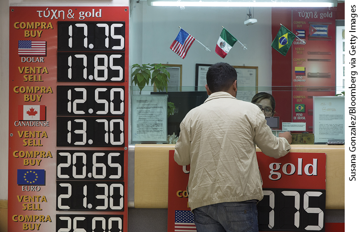
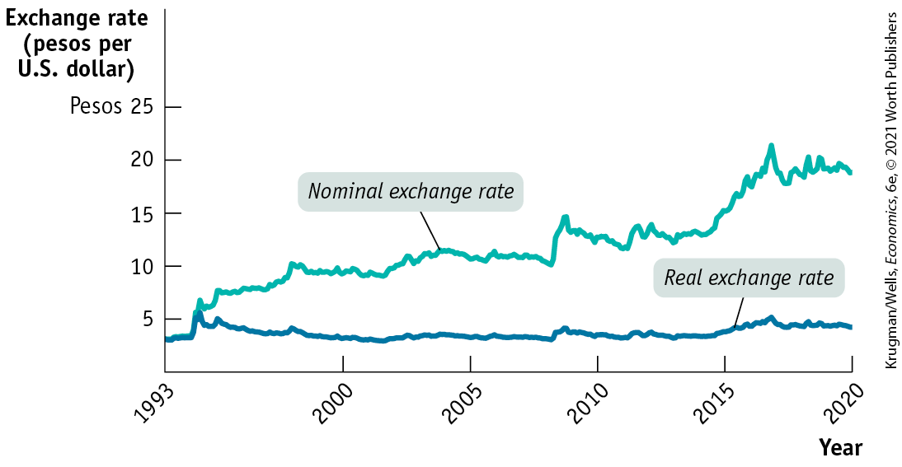
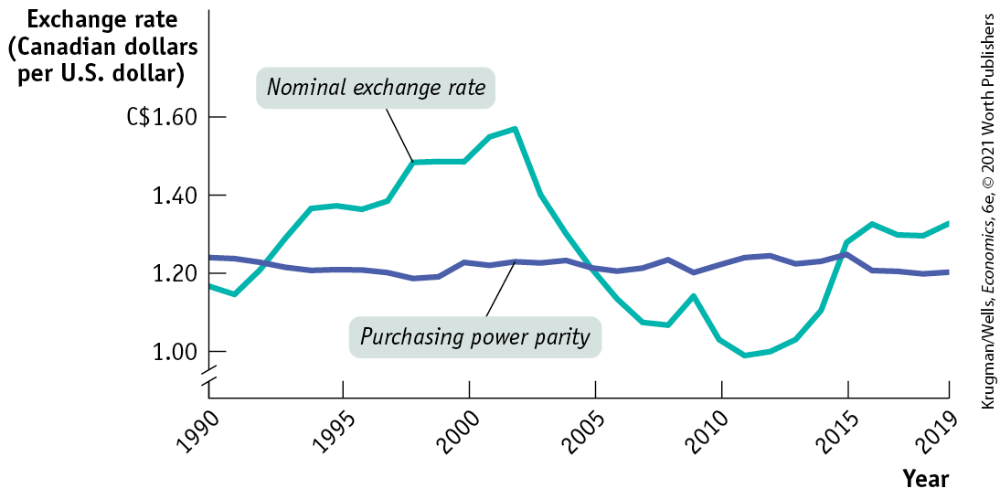
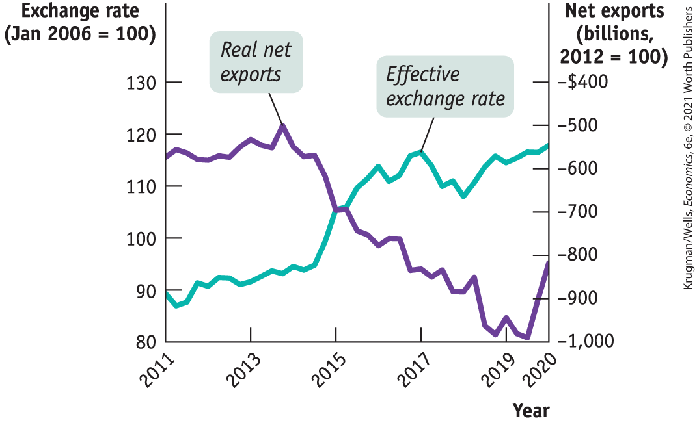
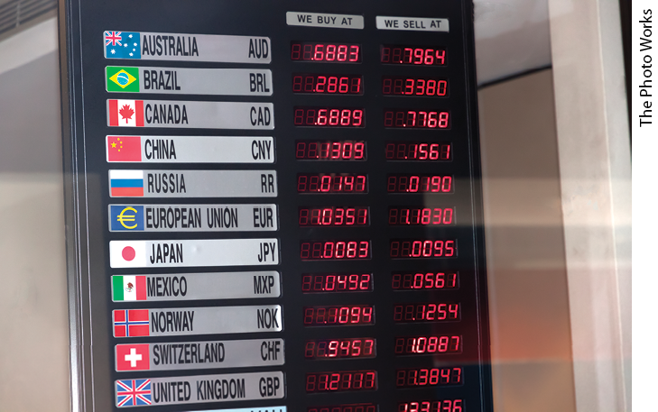
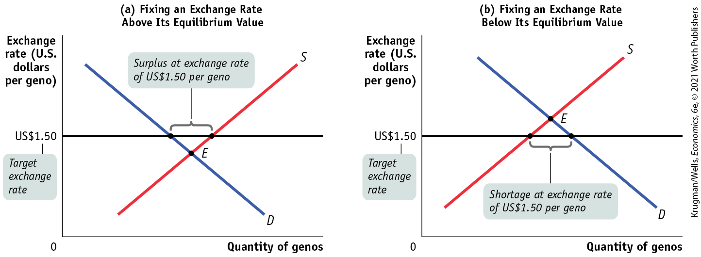

### Inflation and Real Exchange Rates

In 1993 one U.S. dollar exchanged, on average, for 3.1 Mexican pesos. By 2020 the peso had fallen against the dollar by nearly 90%, with an average exchange rate of more than 24.3 pesos per dollar. Did Mexican products also become drastically cheaper relative to U.S. products over that 27-year period? Did the price of Mexican products expressed in terms of U.S. dollars also fall by nearly 90%? The answer to both questions is no, because Mexico had much higher inflation than the United States over that period. In fact, the relative price of U.S. and Mexican products fluctuated both up and down between 1993 and 2020, with no clear trend.

To take account of the effects of differences in inflation rates, economists calculate <a href="#kru_9781319245269_EM_glossary.xhtml#pau_9781319320164_Smfq2AOLd6" id="kru_9781319245269_ch18_03.xhtml#pau_9781319320164_ARMZHKlxte" class="glossref" role="doc-glossref">real exchange rates</a>, exchange rates adjusted for international differences in aggregate price levels. Suppose that the exchange rate we are looking at is the number of Mexican pesos per U.S. dollar. Let $P_{US}$ and $P_{Mex}$ be indexes of the aggregate price levels in the United States and Mexico, respectively. Then the real exchange rate between the Mexican peso and the U.S. dollar is defined as:

$$\text{Real~exchange~rate} = \text{Mexican~pesos~per~U}\text{.S}\text{.~dollar} \times \frac{P_{US}}{P_{Mex}}$$

**(18-4)**

<aside aria-label="title 11" class="glossary c3 main-flow v1" epub:type="glossary" id="pau_9781319320164_BAkXiRhDxE">

**real exchange rates**  
**Real exchange rates** are exchange rates adjusted for international differences in aggregate price levels.

</aside>

To distinguish it from the real exchange rate, the exchange rate unadjusted for aggregate price levels is sometimes called the *nominal* exchange rate.

To understand the significance of the difference between the real and nominal exchange rates, let’s consider the following example. Suppose that the Mexican peso depreciates against the U.S. dollar, with the exchange rate going from 10 pesos per U.S. dollar to 15 pesos per U.S. dollar, a 50% change. But suppose that at the same time the price of everything in Mexico, measured in pesos, increases by 50%, so that the Mexican price index rises from 100 to 150. At the same time, suppose that there is no change in U.S. prices, so that the U.S. price index remains at 100. Then the initial real exchange rate is:

$$\text{Pesos}\,\text{per}\,\text{dollar}\,\text{before}\,\text{depreciation} \times \frac{P_{US}}{P_{Mex}} = 10 \times \frac{100}{100} = 10$$

After the peso depreciates and the Mexican price level increases, the real exchange rate is:

$$\text{Pesos}\,\text{per}\,\text{dollar}\,\text{after}\,\text{depreciation} \times \frac{P_{US}}{P_{Mex}} = 15 \times \frac{100}{100} = 10$$

In this example, the peso has depreciated substantially in terms of the U.S. dollar, but the *real* exchange rate between the peso and the U.S. dollar hasn’t changed at all. And because the real peso–U.S. dollar exchange rate hasn’t changed, the nominal depreciation of the peso against the U.S. dollar will have no effect either on the quantity of goods and services exported by Mexico to the United States or on the quantity of goods and services imported by Mexico from the United States.

To see why, consider again the example of a hotel room. Suppose that this room initially costs 1,000 pesos per night, which is \$100 at an exchange rate of 10 pesos per dollar. After both Mexican prices and the number of pesos per dollar rise by 50%, the hotel room costs 1,500 pesos per night — but 1,500 pesos divided by 15 pesos per dollar is \$100, so the Mexican hotel room still costs \$100. As a result, a U.S. tourist considering a trip to Mexico will have no reason to change plans.

<!--
[Macro-18UN04]
--> <!--
[Macro-18UN04]
-->

<figure id="pau_9781319320164_Rncr0mmdmo" class="figure lm_img_lightbox unnum c2 right">

<figcaption>
It’s the real exchange rate, not the nominal exchange rate, that counts in decisions about buying and selling abroad.
</figcaption>
</figure>

The same is true for all goods and services that enter into trade: *the current account responds only to changes in the real exchange rate, not the nominal exchange rate*. A country’s products become cheaper to foreigners only when that country’s currency depreciates in real terms, and those products become more expensive to foreigners only when the currency appreciates in real terms. As a consequence, economists who analyze movements in exports and imports of goods and services focus on the real exchange rate, not the nominal exchange rate.

<a href="#kru_9781319245269_ch18_03.xhtml#pau_9781319320164_cLO1eJv5rk" id="kru_9781319245269_ch18_03.xhtml#pau_9781319320164_LeSaFBghsN" class="crossref">Figure 18-4</a> illustrates just how important it can be to distinguish between nominal and real exchange rates. The line labeled “Nominal exchange rate” shows the number of pesos it took to buy a U.S. dollar from 1993 to 2020. As you can see, the peso depreciated massively over that period. But the line labeled “Real exchange rate” shows the real exchange rate: it was calculated using <a href="#kru_9781319245269_ch18_03.xhtml#pau_9781319320164_0sShqwUECT" id="kru_9781319245269_ch18_03.xhtml#pau_9781319320164_wuWaNYt9OO" class="crossref">Equation 18-4</a>, with price indexes for both Mexico and the United States set so that $1993 = 100$. In real terms, the peso depreciated between 1994 and 1995, but not by nearly as much as the nominal depreciation. By 2013, the real peso–U.S. dollar exchange rate was just about back where it started, although it rose again over the next two years.

<!--
[Macro-Figure 18-4]
-->

<figure id="pau_9781319320164_cLO1eJv5rk" class="figure lm_img_lightbox num c3 main-flow">

<figcaption>
FIGURE 18-4 Real versus Nominal Exchange Rates, 1993–2020

Between November 1993 and February 2020, the price of a dollar in Mexican pesos increased dramatically. But because Mexico had higher inflation than the United States, the real exchange rate, which measures the relative price of Mexican goods and services, ended up roughly where it started.

<em>Data from:</em> Federal Reserve Bank of St. Louis.
</figcaption>
</figure>

<aside class="hidden" id="pau_9781319320164_7zY41CMZAU" title="hidden">

The vertical axis, labeled Exchange rate (pesos per U S dollar) ranges from 0 to 25 Pesos in increments of 5 Pesos. The horizontal axis, labeled Year shows a marking at 1993 and after that ranges from 2000 to 2020 in increments of 5 years. The graph plots two curves labeled real exchange rate and nominal exchange rate. The Real exchange curve passes through the following approximate points, (1993, 3), (2005, 2.5), (2015, 4), (2017, 5), and (2020, 4). The nominal exchange curve passes through the following approximate points, (1993, 3), (2010, 10), (2005, 12), (2010, 13), (2015, 15), (2017, 20), and (2020, 17).

</aside>

### Purchasing Power Parity

A useful tool for analyzing exchange rates, closely connected to the concept of the real exchange rate, is known as *purchasing power parity.* The <a href="#kru_9781319245269_EM_glossary.xhtml#pau_9781319320164_hT760Jw6W2" id="kru_9781319245269_ch18_03.xhtml#pau_9781319320164_2Uw28NtbS6" class="glossref" role="doc-glossref">purchasing power parity</a> between two countries’ currencies is the nominal exchange rate at which a given basket of goods and services would cost the same amount in each country. Suppose, for example, that a basket of goods and services that costs \$100 in the United States costs 1,000 pesos in Mexico. Then the purchasing power parity is 10 pesos per U.S. dollar: at that exchange rate, $1,000\,\text{pesos} = \$ 100$, so the market basket costs the same amount in both countries.

<aside aria-label="title 12" class="glossary c3 main-flow v1" epub:type="glossary" id="pau_9781319320164_1UKq570jLd">

**purchasing power parity**  
The **purchasing power parity** between two countries’ currencies is the nominal exchange rate at which a given basket of goods and services would cost the same amount in each country.

</aside>
<!--
<strong class="important">[Start FIM Box; position near here]</strong>
--> <!--
<strong class="important">[Comp: insert globe icon.]</strong>
-->
<aside class="case-study c3 main-flow v1" epub:type="case-study" id="pau_9781319320164_ICs8tptUFe" title="For Inquiring Minds">

#### For inquiring minds

Burgernomics

*The Economist* magazine publishes an annual comparison of the cost in different countries of one particular consumption item that is found around the world — a McDonald’s Big Mac. The magazine finds the price of a Big Mac in local currency, then computes two numbers: the price of a Big Mac in U.S. dollars using the prevailing exchange rate and the exchange rate at which the price of a Big Mac would equal the U.S. price.

If purchasing power parity held for Big Macs, the dollar price of a Big Mac would be the same everywhere. If purchasing power parity is a good theory for the long run, the exchange rate at which a Big Mac’s price matches the U.S. price should offer some guidance about where the exchange rate will eventually end up.

<a href="#kru_9781319245269_ch18_03.xhtml#pau_9781319320164_7AJEmuuanY" id="kru_9781319245269_ch18_03.xhtml#pau_9781319320164_xtaNObQhOh" class="crossref">Table 18-6</a> shows The *Economist* estimates for selected countries as of January 2020, ranked in increasing order of the dollar price of a Big Mac. The countries with the cheapest Big Macs, and therefore by this measure with the most undervalued currencies, are Mexico, India, and China, all three developing countries. And topping the list, with a Big Mac some 20% more expensive than in the United States, is Switzerland — the nation that, as we described in the opening story, has taken extraordinary action in an effort to depreciate its currency.

<!--
<strong class="important">[Comp: place Table 18-6 inside this FIM box.]</strong>
--> <!--
[Table 18-6- comp please update Macro Table 18-6 as shown below. Note the placement of some countries (Mexico, Brazil) has changed.]
-->

|                               |                   |                 |                           |                      |
|-------------------------------|-------------------|-----------------|---------------------------|----------------------|
|                               | Big Mac price     |                 | Local currency per dollar |                      |
| Country                       | In local currency | In U.S. dollars | Implied PPP               | Actual exchange rate |
| India                         | Rupee 188         | \$2.65          | 33.16                     | 70.98                |
| Mexico                        | Peso 50           | 2.66            | 8.82                      | 18.82                |
| China                         | Yuan 21.5         | 3.13            | 3.79                      | 6.88                 |
| Japan                         | ¥ 390             | 3.54            | 68.78                     | 110.04               |
| Britain                       | £ 3.39            | 4.40            | 0.60                      | 0.77                 |
| Euro area                     | € 4.12            | 4.58            | 0.73                      | 0.90                 |
| Brazil                        | Real 19.90        | 4.81            | 3.51                      | 4.14                 |
| United States                 | \$5.67            | 5.67            | 1.00                      | 1.00                 |
| Switzerland                   | SFr 6.50          | 6.70            | 1.15                      | 0.97                 |
| *Data from*: *The Economist*. |                   |                 |                           |                      |

TABLE 18-6 Purchasing Power Parity and the Price of a Big Mac

<!--
<strong class="important">[End FIM Box]</strong>
-->
</aside>

Calculations of purchasing power parities are usually made by estimating the cost of buying broad market baskets containing many goods and services — everything from cars and groceries to housing and internet service. But as the For Inquiring Minds, “Burgernomics,” illustrates, nominal exchange rates almost always differ from purchasing power parities. Some of these differences are systematic: in general, aggregate price levels are lower in poor countries than in rich countries because services tend to be cheaper in poor countries. But even among countries at roughly the same level of economic development, nominal exchange rates vary quite a lot from purchasing power parity.

<a href="#kru_9781319245269_ch18_03.xhtml#pau_9781319320164_cbc5p6xNHP" id="kru_9781319245269_ch18_03.xhtml#pau_9781319320164_BqJDJEtvfZ" class="crossref">Figure 18-5</a> shows the nominal exchange rate between the Canadian dollar and the U.S. dollar, measured as the number of Canadian dollars per U.S. dollar, from 1990 to 2019, together with an estimate of the purchasing power parity exchange rate between the United States and Canada over the same period. The purchasing power parity didn’t change much over the whole period because the United States and Canada had about the same rate of inflation. For most of the 1990s through 2005, the nominal exchange rate was above the purchasing power parity, so a market basket was much cheaper in Canada than in the United States. But from 2005 to 2015, the Canadian dollar had appreciated, making a market basket more expensive in Canada.

<!--
[Macro-Figure 18-5]
-->

<figure id="pau_9781319320164_cbc5p6xNHP" class="figure lm_img_lightbox num c3 main-flow">

<figcaption>
FIGURE 18-5 Purchasing Power Parity versus the Nominal Exchange Rate, 1990–2019

The purchasing power parity between the United States and Canada — the exchange rate at which a basket of goods and services would have cost the same amount in both countries — changed very little over the period shown, staying near C$1.20 per US$1. But the nominal exchange rate fluctuated widely.

<em>Data from:</em> OECD.
</figcaption>
</figure>

<aside class="hidden" id="pau_9781319320164_D29usYapMm" title="hidden">

The vertical axis, labeled Exchange rate (Canadian dollars per U S dollar) is truncated and ranges from 1.00 to 1.60 Canadian dollars in increments of 0.20 Canadian dollars. The horizontal axis, labeled Year ranges from 1990 to 2015 in increments of 5 years with an additional marking at 2019. The graph plots two curves labeled purchasing power parity and nominal exchange rate. The purchasing power parity curve passes through the following approximate points, (1990, 1.25), (2000, 1.20), (2010, 1.20), and (2019, 1.95). The nominal exchange rate curve passes through the following approximate points, (1990, 1.90), (1995, 1.35), (2002, 1.55), (2005, 1.15), (2008, 1.10), (2009, 1.125), (2010, 1), (2015, 1.25), and (2019, 1.35).

</aside>

Over the long run, however, purchasing power parities are pretty good at predicting actual changes in nominal exchange rates. In particular, nominal exchange rates between countries at similar levels of economic development tend to fluctuate around levels that lead to similar costs for a given market basket.

<!--
<strong class="important">[Start EIA]</strong>
--> <!--
<strong class="important">[Comp: insert globe icon.]</strong>
-->

### ECONOMICS \>\> *in Action*

Strong Dollar Woes

Does the exchange rate really matter for business? To answer this question, let’s consider what happened to U.S. corporations from 2014 to 2015.

Over the course of these two years, the dollar strengthened sharply against many currencies, especially the euro and the Japanese yen. The dollar’s rise largely reflected the weaknesses of other economies: troubles in Europe and Japan kept interest rates and investment demand low, and capital flowed to the United States, which was experiencing steady job growth and overall was doing a much better job recovering from the Great Recession.

While the strong dollar reflected (relatively) good news for the U.S. economy as a whole, it was bad news for U.S. companies that sell a lot to overseas markets — companies like Procter and Gamble, which sells toothpaste and other toiletries around the world, or, Kimberly-Clark, whose Huggies diapers protect many foreign babies’ bottoms. Such companies reported large hits to their profits, and began either losing ground to foreign competitors or shifting some of their own production abroad.

<a href="#kru_9781319245269_ch18_03.xhtml#pau_9781319320164_yrCwvovmFi" id="kru_9781319245269_ch18_03.xhtml#pau_9781319320164_WmlcrRnMEm" class="crossref">Figure 18-6</a> illustrates the overall picture. It compares the *U.S. effective exchange rate,* a measure of the average value of the dollar against other currencies, with *real net exports,* exports minus imports, measured in 2012 dollars. From early 2014 to early 2016 the dollar rose about 15% on average, then has stayed at this higher level into 2020, while real net exports moved considerably deeper into deficit.

<!--
[Macro-Figure 18-6]]

[Figure 18-6]
-->

<figure id="pau_9781319320164_yrCwvovmFi" class="figure lm_img_lightbox num c3 main-flow">

<figcaption>
FIGURE 18-6 The Negative Impact of a Strong Dollar, 2011–2020

<em>Data from:</em> Federal Reserve Bank of St. Louis.
</figcaption>
</figure>

<aside class="hidden" id="pau_9781319320164_UJEOTjVTJv" title="hidden">

The left vertical axis, labeled Exchange rate (January 2006 equals 100) ranges from 80 to 130 in increments of 10. The right vertical axis, labeled Net exports (billions, 2012 equals 100) ranges from negative 1,000 to negative 400 dollars in increments of 100 dollars. The horizontal axis, labeled Year ranges from 2011 to 2019 in increments of 2 years with an additional marking at 2020. The graph plots two curves labeled effective exchange rate and real net exports. The effective exchange rate curve passes through the following approximate points, (2011, 90), (2013, 91), (2015, 105), (2017, 115), (2018, 108), (2019, 115), and (2020, 118). The real net exports curve passes through the following approximate points, (2011, negative 550), (2013, negative 550), (2015, negative 700), (2017, negative 850), (2019, negative 950), and (2020, negative 820).

</aside>

In other words, the exchange rate does matter a lot for businesses that compete with foreign rivals. Earlier we noted that while it’s common to describe an appreciating currency as “getting stronger,” that doesn’t mean it’s a good thing. And the stronger dollar of 2014 to 2015 definitely wasn’t a good thing for some U.S. companies.

<!--
<strong class="important">[End EIA]</strong>
-->

### \>\> *Quick Review*

- Currencies are traded in the **foreign exchange market**, which determines **exchange rates.**
- Exchange rates can be measured in two ways. To avoid confusion, economists say that a currency **appreciates** or **depreciates.** The **equilibrium exchange rate** matches the supply and demand for currencies on the foreign exchange market.
- To take account of differences in national price levels, economists calculate **real exchange rates.** The current account responds only to changes in the real exchange rate, not the nominal exchange rate.
- **Purchasing power parity** is the nominal exchange rate that equalizes the price of a market basket in two countries. While the nominal exchange rate almost always differs from purchasing power parity, purchasing power parity is a good predictor of actual changes in the nominal exchange rate.

### \>\> *Check Your Understanding* 18-2

1.  Mexico discovers huge reserves of oil and starts exporting oil to the United States. Describe how this would affect the following.
    1.  The nominal peso–U.S. dollar exchange rate
    2.  Mexican exports to the United States of other goods and services
    3.  Mexican imports from the United States of goods and services
2.  A basket of goods and services that costs \$100 in the United States costs 800 pesos in Mexico, and the current nominal exchange rate is 10 pesos per U.S. dollar. Over the next five years, the cost of that market basket rises to \$120 in the United States and to 1,200 pesos in Mexico, although the nominal exchange rate remains at 10 pesos per U.S. dollar. Calculate the following.
    1.  The real exchange rate now and five years from now, if today’s price index in both countries is 100
    2.  Purchasing power parity today and five years from now

## Exchange Rate Policy

The nominal exchange rate, like other prices, is determined by supply and demand. Unlike the price of wheat or oil, however, the exchange rate is the price of a country’s money (in terms of another country’s money). Money isn’t a good or service produced by the private sector; it’s an asset whose quantity is determined by government policy. As a result, governments have much more power to influence nominal exchange rates than they have to influence ordinary prices.

The nominal exchange rate is a very important price for many countries because it determines the price of imports and the price of exports. In economies where exports and imports are large percentages of GDP, movements in the exchange rate can have major effects on aggregate output and the aggregate price level. What do governments do with their power to influence this important price?

The answer is, it depends. At different times and in different places, governments have adopted a variety of *exchange rate regimes.* Let’s talk about these regimes, how they are enforced, and how governments choose a regime. (From now on, we’ll adopt the convention that we mean the nominal exchange rate when we refer to the exchange rate.)

### Exchange Rate Regimes

An <a href="#kru_9781319245269_EM_glossary.xhtml#pau_9781319320164_JYnsWk0VGc" id="kru_9781319245269_ch18_04.xhtml#pau_9781319320164_R4mzeKJF1R" class="glossref" role="doc-glossref">exchange rate regime</a> is a rule governing policy toward the exchange rate. There are two main kinds of exchange rate regimes. A country has a <a href="#kru_9781319245269_EM_glossary.xhtml#pau_9781319320164_jYuDG2oZih" id="kru_9781319245269_ch18_04.xhtml#pau_9781319320164_9IMMvmtt6Q" class="glossref" role="doc-glossref">fixed exchange rate</a> when the government keeps the exchange rate against some other currency at or near a particular target. For example, Hong Kong has an official policy of setting an exchange rate of HK\$7.80 per US\$1. In contrast, a country has a <a href="#kru_9781319245269_EM_glossary.xhtml#pau_9781319320164_27gXHfKf0u" id="kru_9781319245269_ch18_04.xhtml#pau_9781319320164_9JbMweMTbH" class="glossref" role="doc-glossref">floating exchange rate</a> when the government lets market forces determine the exchange rate. This is the policy followed by Britain, Canada, and the United States.

<aside aria-label="title 13" class="glossary c3 main-flow v1" epub:type="glossary" id="pau_9781319320164_MAx8AJRaDr">

**exchange rate regime**  
An **exchange rate regime** is a rule governing policy toward the exchange rate.

</aside>
<aside aria-label="title 14" class="glossary c3 main-flow v1" epub:type="glossary" id="pau_9781319320164_kMYoEFZUgg">

**fixed exchange rate**  
A country has a **fixed exchange rate** when the government keeps the exchange rate against some other currency at or near a particular target.

</aside>
<aside aria-label="title 15" class="glossary c3 main-flow v1" epub:type="glossary" id="pau_9781319320164_S3PdtX147Y">

**floating exchange rate**  
A country has a **floating exchange rate** when the government lets market forces determine the exchange rate.

</aside>
<!--
[Macro-18UN05]
--> <!--
[Macro-18UN05]
-->

<figure id="pau_9781319320164_Ef9sHKsltp" class="figure lm_img_lightbox unnum c2 right">

<figcaption>
Exchange rates play a very important role in the global economy.
</figcaption>
</figure>

Fixed exchange rates and floating exchange rates aren’t the only possibilities. At various times, countries have adopted compromise policies that lie somewhere between fixed and floating exchange rates. These include exchange rates that are fixed at any given time but are adjusted frequently, exchange rates that aren’t fixed but are managed by the government to avoid wide swings, and exchange rates that float within a *target zone* but are prevented from leaving that zone. In this chapter, however, we’ll focus on the two main exchange rate regimes.

The immediate puzzle posed by a fixed exchange rate is how a government can fix the exchange rate when the exchange rate is determined by supply and demand.

### How Can an Exchange Rate Be Held Fixed?

To understand how it is possible for a country to fix its exchange rate, let’s consider a hypothetical country, Genovia, which for some reason has decided to fix the value of its currency, the geno, at US\$1.50.

The obvious problem is that \$1.50 may not be the equilibrium exchange rate in the foreign exchange market: the equilibrium rate may be either higher or lower than the target exchange rate. <a href="#kru_9781319245269_ch18_04.xhtml#pau_9781319320164_G0N4Rx5KBk" id="kru_9781319245269_ch18_04.xhtml#pau_9781319320164_0StB65BDsi" class="crossref">Figure 18-7</a> shows the foreign exchange market for genos, with the quantities of genos supplied and demanded on the horizontal axis and the exchange rate of the geno, measured in U.S. dollars per geno, on the vertical axis. Panel (a) shows the case in which the equilibrium value of the geno is *below* the target exchange rate. Panel (b) shows the case in which the equilibrium value of the geno is *above* the target exchange rate.

<!--
[Macro-Figure 18-7]
-->

<figure id="pau_9781319320164_G0N4Rx5KBk" class="figure lm_img_lightbox num c4 main-flow">

<figcaption>
FIGURE 18-7 Exchange Market Intervention

In both panels, the imaginary country of Genovia is trying to keep the exchange rate of the geno fixed at US$1.50 per geno. In panel (a), the equilibrium exchange rate is below $1.50, leading to a surplus of genos on the foreign exchange market. To keep the geno from falling below $1.50, the Genovian government can buy genos and sell U.S. dollars. In panel (b), the equilibrium exchange rate is above $1.50, leading to a shortage of genos on the foreign exchange market. To keep the geno from rising above $1.50, the Genovian government can sell genos and buy U.S. dollars.
</figcaption>
</figure>

<aside class="hidden" id="pau_9781319320164_L4DSMnH2u2" title="hidden">

Graph a, Fixing an Exchange Rate Above Its Equilibrium Value: The vertical axis, labeled Exchange rate (U.S. dollars per geno) shows a marking at 1.50 U S dollars. The horizontal axis is labeled Quantity of genos. A horizontal line runs to the right from the marking 1.50 U S dollars. A negative sloping line labeled D intersects a positive sloping line labeled S at E. Point E is below the horizontal line. A gap between the intersection of D with the horizontal line and the intersection of S with the horizontal line is labeled, “Surplus at exchange rate of 1.50 U S dollar per geno.” The marking, 1.50 U S dollar, on the vertical axis is labeled, “Target exchange rate.” Graph b, Fixing an Exchange Rate Below Its Equilibrium Value: The vertical axis, labeled Exchange rate (U.S. dollars per geno) shows a marking at 1.50 U S dollars. The horizontal axis is labeled Quantity of genos. A horizontal line runs to the right from the marking 1.50 U S dollars. A negative sloping line labeled D intersects a positive sloping line labeled S at E. Point E is above the horizontal line. A gap between the intersection of D with the horizontal line and the intersection of S with the horizontal line is labeled, “Shortage at exchange rate of 1.50 U S dollar per geno.” The marking, 1.50 U S dollar, on the vertical axis is labeled, “Target exchange rate.”

</aside>

Consider first the case in which the equilibrium value of the geno is below the target exchange rate. As panel (a) shows, at the target exchange rate of \$1.50 per geno, there is a surplus of genos in the foreign exchange market, which would normally push the value of the geno down. How can the Genovian government support the value of the geno to keep the rate where it wants? There are three possible answers, all of which have been used by governments at some point.

One way the Genovian government can support the geno is to soak up the surplus of genos by buying its own currency in the foreign exchange market. A government purchase or sale of currency in the foreign exchange market is called an <a href="#kru_9781319245269_EM_glossary.xhtml#pau_9781319320164_84Ri6eb5V2" id="kru_9781319245269_ch18_04.xhtml#pau_9781319320164_joyaetCZBN" class="glossref" role="doc-glossref">exchange market intervention</a>. To buy genos in the foreign exchange market, of course, the Genovian government must have U.S. dollars to exchange for genos. In fact, most countries maintain <a href="#kru_9781319245269_EM_glossary.xhtml#pau_9781319320164_ctBVN6Sz0y" id="kru_9781319245269_ch18_04.xhtml#pau_9781319320164_VuFicf3mat" class="glossref" role="doc-glossref">foreign exchange reserves</a>, stocks of foreign currency (usually U.S. dollars or euros) that they can use to buy their own currency to support its price.

<aside aria-label="title 16" class="glossary c3 main-flow v1" epub:type="glossary" id="pau_9781319320164_YHPWWMHbqx">

**exchange market intervention**  
A government purchase or sale of currency in the foreign exchange market is an **exchange market intervention.**

</aside>
<aside aria-label="title 17" class="glossary c3 main-flow v1" epub:type="glossary" id="pau_9781319320164_KBt718ULii">

**foreign exchange reserves**  
**Foreign exchange reserves** are stocks of foreign currency that governments maintain to buy their own currency on the foreign exchange market.

</aside>

We mentioned earlier in the chapter that an important part of international capital flows is the result of purchases and sales of foreign assets by governments and central banks. Now we can see why governments sell foreign assets: they are supporting their currency through exchange market intervention. As we’ll see in a moment, governments that keep the value of their currency *down* through exchange market intervention must *buy* foreign assets. First, however, let’s talk about the other ways governments fix exchange rates.

A second way for the Genovian government to support the geno is to try to shift the supply and demand curves for the geno in the foreign exchange market. Governments usually do this by changing monetary policy. For example, to support the geno the Genovian central bank can raise the Genovian interest rate. This will increase capital flows into Genovia, increasing the demand for genos, at the same time that it reduces capital flows out of Genovia, reducing the supply of genos. So, other things equal, an increase in a country’s interest rate will increase the value of its currency.

Third, the Genovian government can support the geno by reducing the supply of genos to the foreign exchange market. It can do this by requiring domestic residents who want to buy foreign currency to get a license and giving these licenses only to people engaging in approved transactions (such as the purchase of imported goods the Genovian government thinks are essential). Licensing systems that limit the right of individuals to buy foreign currency are called <a href="#kru_9781319245269_EM_glossary.xhtml#pau_9781319320164_jJOdGdyUmS" id="kru_9781319245269_ch18_04.xhtml#pau_9781319320164_ImfwyGAkqu" class="glossref" role="doc-glossref">foreign exchange controls</a>. Other things equal, foreign exchange controls increase the value of a country’s currency.

<aside aria-label="title 18" class="glossary c3 main-flow v1" epub:type="glossary" id="pau_9781319320164_5vncqsI8XL">

**foreign exchange controls**  
**Foreign exchange controls** are licensing systems that limit the right of individuals to buy foreign currency.

</aside>

So far we’ve been discussing a situation in which the government is trying to prevent a depreciation of the geno. Suppose, instead, that the situation is as shown in panel (b) of <a href="#kru_9781319245269_ch18_04.xhtml#pau_9781319320164_G0N4Rx5KBk" id="kru_9781319245269_ch18_04.xhtml#pau_9781319320164_aAj4kSldcJ" class="crossref">Figure 18-7</a>, where the equilibrium value of the geno is *above* the target exchange rate of \$1.50 per geno and there is a shortage of genos. To maintain the target exchange rate, the Genovian government can apply the same three basic options in the reverse direction. It can intervene in the foreign exchange market, in this case *selling* genos and acquiring U.S. dollars, which it can add to its foreign exchange reserves. It can *reduce* interest rates to increase the supply of genos and reduce the demand. Or it can impose foreign exchange controls that limit the ability of foreigners to buy genos. All of these actions, other things equal, will reduce the value of the geno.

As we said, all three techniques have been used to manage fixed exchange rates. But we haven’t said whether fixing the exchange rate is a good idea. In fact, the choice of exchange rate regime poses a dilemma for policy makers, because fixed and floating exchange rates each have both advantages and disadvantages.

### The Exchange Rate Regime Dilemma

Few questions in macroeconomics produce as many arguments as that of whether a country should adopt a fixed or a floating exchange rate. And there are so many arguments because both sides have a case.

To understand the case for a fixed exchange rate, consider for a moment how easy it is to conduct business across state lines in the United States. There are a number of things that make interstate commerce trouble-free, but one of them is the absence of any uncertainty about the value of money: a dollar is a dollar, in both New York City and Los Angeles.

By contrast, a dollar isn’t a dollar in transactions between New York City and Toronto. The exchange rate between the Canadian dollar and the U.S. dollar fluctuates, sometimes widely. If a U.S. firm promises to pay a Canadian firm a given number of U.S. dollars a year from now, the value of that promise in Canadian currency can vary by 10% or more. This uncertainty has the effect of deterring trade between the two countries. So, one benefit of a fixed exchange rate is certainty about the future value of a currency.

There is also, in some cases, an additional benefit to adopting a fixed exchange rate: by committing itself to a fixed rate, a country is also committing itself not to engage in inflationary policies. For example, in 1991 Argentina, which has a long history of irresponsible policies leading to severe inflation, adopted a fixed exchange rate of US\$1 per Argentine peso in an attempt to commit itself to noninflationary policies in the future. (Argentina’s fixed exchange rate regime collapsed disastrously in late 2001. But that’s another story.)

The point is that there is some economic value in having a stable exchange rate. Indeed, as the accompanying For Inquiring Minds explains, the presumed benefits of stable exchange rates motivated the international system of fixed exchange rates created after World War II. It was also a major reason for the creation of the euro.

However, there are also costs to fixing the exchange rate. To stabilize an exchange rate through intervention, a country must keep large quantities of foreign currency on hand — usually a low-return investment. Furthermore, even large reserves can be quickly exhausted when there are large capital flows out of a country. If a country chooses to stabilize an exchange rate by adjusting monetary policy rather than through intervention, it must divert monetary policy from other goals, notably stabilizing the economy and managing the inflation rate. Finally, foreign exchange controls, like import quotas and tariffs, distort incentives for importing and exporting goods and services. They can also create substantial costs in terms of red tape and corruption.

<!--
<strong class="important">[Start FIM Box; position near here]</strong>
--> <!--
<strong class="important">[Comp: insert globe icon]</strong>
-->
<aside class="case-study c3 main-flow v1" epub:type="case-study" id="pau_9781319320164_jiqmAJoHtP" title="For Inquiring Minds">
