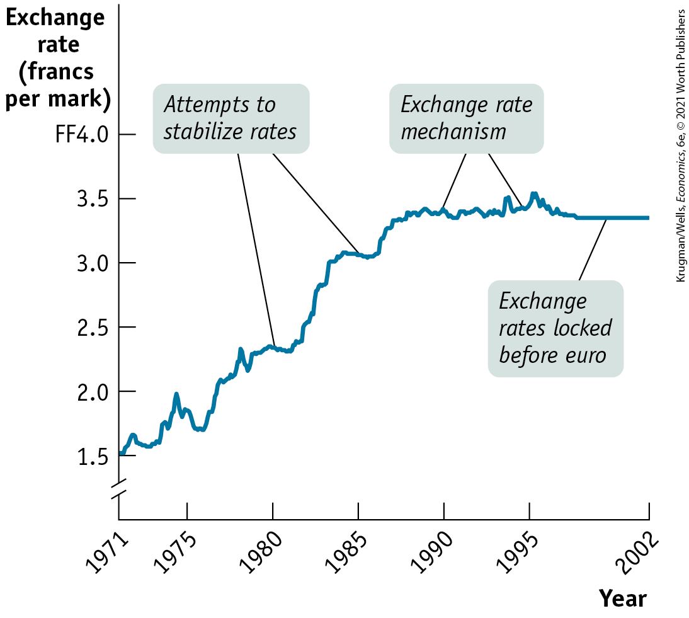
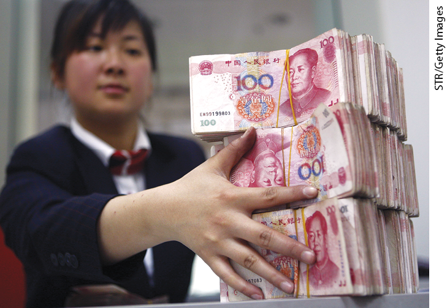
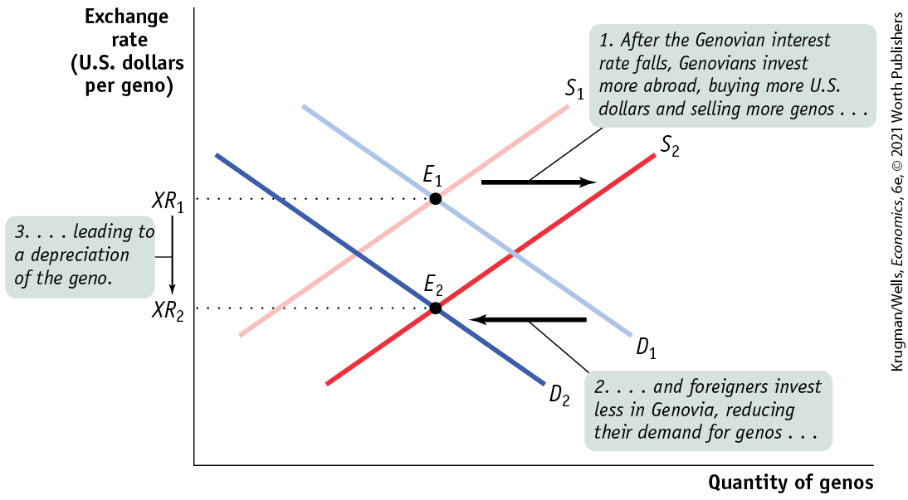
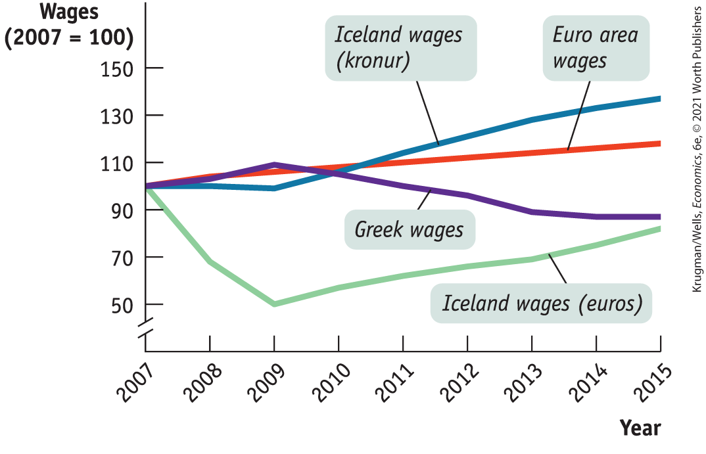
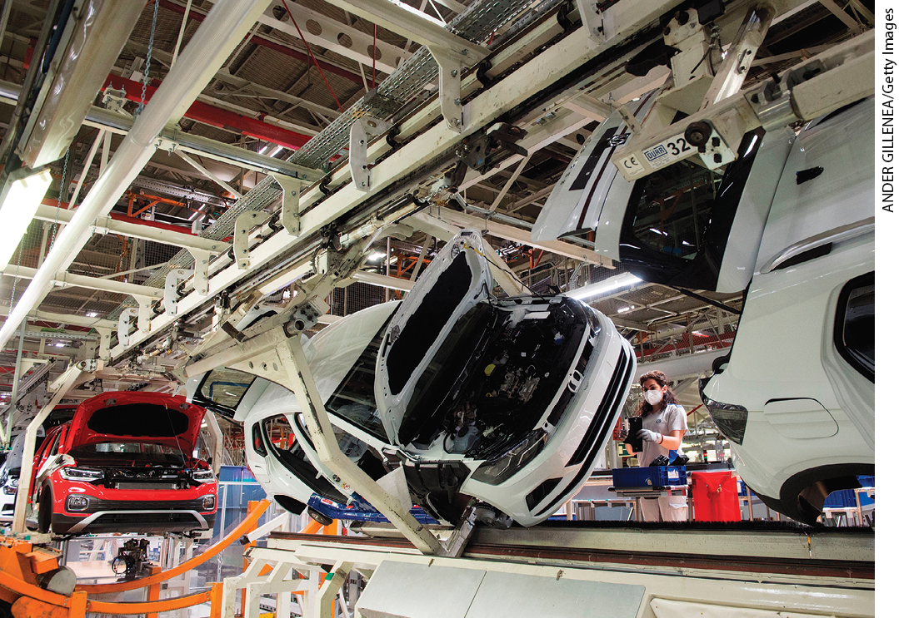

#### For inquiring minds

From Bretton Woods to the Euro

In 1944, while World War II was still raging, representatives of Allied nations met in Bretton Woods, New Hampshire, to establish a postwar international monetary system of fixed exchange rates among major currencies. The system was highly successful at first, but it broke down in 1971. After a confusing interval during which policy makers tried unsuccessfully to establish a new fixed exchange rate system, by 1973 most economically advanced countries had moved to floating exchange rates.

In Europe, however, many policy makers were unhappy with floating exchange rates, which they believed created too much uncertainty for business. From the late 1970s onward they tried several times to create a system of more or less fixed exchange rates in Europe, culminating in an arrangement known as the Exchange Rate Mechanism. (The Exchange Rate Mechanism was, strictly speaking, a target zone system — European exchange rates were free to move within a narrow band, but not outside it.) And in 1991 they agreed to move to the ultimate in fixed exchange rates: a common European currency, the euro. To the surprise of many analysts, they pulled it off: today most of Europe has abandoned national currencies for the euro.

<a href="#kru_9781319245269_ch18_04.xhtml#pau_9781319320164_KnANFZFI77" id="kru_9781319245269_ch18_04.xhtml#pau_9781319320164_e9AOfUHk2k" class="crossref">Figure 18-8</a> illustrates the history of European exchange rate arrangements. It shows the exchange rate between the French franc and the German mark, measured as francs per mark, from 1971 until their replacement by the euro. The exchange rate fluctuated widely at first. The plateaus you can see in the data — eras when the exchange rate fluctuated only modestly — are periods when attempts to restore fixed exchange rates were in process. The Exchange Rate Mechanism, after a couple of false starts, became effective in 1987, stabilizing the exchange rate at about 3.4 francs per mark. (The wobbles in the early 1990s reflect two *currency crises* — episodes in which widespread expectations of imminent devaluations led to large but temporary capital flows.)

<!--
[Macro-Figure 18-8]
-->

<figure id="pau_9781319320164_KnANFZFI77" class="figure lm_img_lightbox num c4 main-flow">

<figcaption>
FIGURE 18-8 The Road to the Euro

<em>Data from:</em> Pacific Exchange Rate Service.
</figcaption>
</figure>

<aside class="hidden" id="pau_9781319320164_xIPCofu8iO" title="hidden">

The vertical axis, labeled Exchange rate (francs per mark) is truncated and ranges from 1.50 to 4.0 French franc in increments of 0.5 francs. The horizontal axis, labeled year shows a marking at 1971 and after that ranges from 1975 to 1995 in increments of 5 years, with an additional marking at 2002. The curve passes through the following approximate points, (1971, 1.5), (1975, 1.80), (1980, 2.40), (1985, 3), (1990, 3.25), (1995, 3.5), and (2002, 3.5). The points on the curve corresponding to years 1980 and 1985 are labeled, “Attempts to stabilize rates,” the points on the curve corresponding to years 1990 and 1995 are labeled, “Exchange rate mechanism,” and the point on the curve corresponding to year 2000 is labeled, “Exchange rates locked before euro.”

</aside>

In 1999 the exchange rate was *locked* — no further fluctuations were allowed as the countries prepared to switch from francs and marks to the euro. At the end of 2001, the franc and the mark ceased to exist.

The transition to the euro has not been without costs. Countries that adopted the euro sacrificed some important policy tools: they could no longer tailor monetary policy to their specific economic circumstances, and they could no longer lower their costs relative to other European nations simply by letting their currencies depreciate.

<!--
<strong class="important">[End FIM Box]</strong>
-->
</aside>

So there’s a dilemma. Should a country let its currency float, which leaves monetary policy available for macroeconomic stabilization but creates uncertainty for business? Or should it fix the exchange rate, which eliminates the uncertainty but means giving up monetary policy, adopting exchange controls, or both?

Different countries reach different conclusions at different times. Most European countries, except for Britain, have long believed that exchange rates among major European economies, which do most of their international trade with each other, should be fixed. But Canada seems happy with a floating exchange rate with the United States, even though the United States accounts for most of Canada’s trade.

Fortunately we don’t have to resolve this dilemma. For the rest of the chapter, we’ll take exchange rate regimes as given and ask how they affect macroeconomic policy.

<!--
<strong class="important">[Start EIA]</strong>
--> <!--
<strong class="important">[Comp: insert globe icon.]</strong>
-->

### ECONOMICS \>\> *in Action*

China Pegs the Yuan

In the early years of the twenty-first century, China provided a striking example of the lengths to which countries sometimes go to maintain a fixed exchange rate.

In the first act of this story, China acted to keep its currency down. The country’s spectacular success as an exporter had produced a rising surplus on current account, and private investors became increasingly eager to shift funds into China, to invest in its growing domestic economy.

<!--
[Macro-18UN06]
--> <!--
[Macro-18UN06]
-->

<figure id="pau_9781319320164_Qu5CCm8Jts" class="figure lm_img_lightbox unnum c2 right">

<figcaption>
China provides a striking example of the lengths to which countries sometimes go to maintain a fixed exchange rate.
</figcaption>
</figure>

These capital flows were somewhat limited by foreign exchange controls — but kept coming in anyway. As a result of the current account surplus and private capital inflows, China found itself in the position described by panel (b) of <a href="#kru_9781319245269_ch18_04.xhtml#pau_9781319320164_G0N4Rx5KBk" id="kru_9781319245269_ch18_04.xhtml#pau_9781319320164_tz7xxYq6PJ" class="crossref">Figure 18-7</a>: at the target exchange rate, the demand for yuan exceeded the supply. Yet the Chinese government was determined to keep the exchange rate fixed at a value below its equilibrium level.

To keep the rate fixed, China had to engage in large-scale exchange market intervention, selling yuan, buying up other countries’ currencies (mainly U.S. dollars) on the foreign exchange market, and adding them to its reserves. Indeed, between early 2009 and early 2014 China added \$2 trillion to its foreign exchange reserves, which by mid-2014 had risen to a remarkable \$4 trillion, roughly 40% of GDP. Not surprisingly, China’s exchange rate policy led to some friction with its trading partners, who felt that it had the effect of subsidizing Chinese exports.

But then came the second act of the story. After 2012 China’s current account surplus declined, partly reflecting rising wages and the rise of new competitors like Vietnam and Bangladesh. Also, China’s economic growth, while still fast, slowed, and investors grew nervous about a possible financial or political crisis. So capital inflows turned into capital outflows: the 2015 outflow was estimated at an amazing \$1 trillion, the great majority of it going to the United States.

In the absence of government intervention, this capital flight might well have caused a sharp decline in the yuan. But the Chinese government was as reluctant to see its currency fall as it had once been to see it rise. So China began using its reserves of foreign currency to buy large quantities of yuan. And by early 2017 reserves had fallen from \$4 trillion to approximately \$3 trillion, where it has remained into 2020.

<!--
<strong class="important">[End EIA]</strong>
-->

### \>\> *Quick Review*

- Countries choose different **exchange rate regimes.** The two main regimes are **fixed exchange rates** and **floating exchange rates.**
- Exchange rates can be fixed through **exchange market intervention**, using **foreign exchange reserves.** Countries can also use domestic policies to shift supply and demand in the foreign exchange market (usually monetary policy), or they can impose **foreign exchange controls.**
- Choosing an exchange rate regime poses a dilemma. Stable exchange rates are good for business. But holding large foreign exchange reserves is costly, using domestic policy to fix the exchange rate makes it hard to pursue other objectives, and foreign exchange controls distort incentives.

### \>\> *Check Your Understanding* 18-3

1.  Draw a diagram, similar to <a href="#kru_9781319245269_ch18_04.xhtml#pau_9781319320164_G0N4Rx5KBk" id="kru_9781319245269_ch18_04.xhtml#pau_9781319320164_N6qxtQZxPZ" class="crossref">Figure 18-7</a>, representing the foreign exchange situation of China when it kept the exchange rate fixed. Express the exchange rate as U.S. dollars per yuan. Then show with a diagram how each of the following policy changes will eliminate the disequilibrium in the market.
    1.  China no longer fixing its exchange rate, allowing it to float freely
    2.  Placing restrictions on foreigners who want to invest in China
    3.  Removing restrictions on Chinese who want to invest abroad
    4.  Imposing taxes on Chinese exports, such as shipments of clothing, that are causing a political backlash in the importing countries

## Exchange Rates and Macroeconomic Policy

When the euro was created in 1999, there were celebrations across the nations of Europe where it was seen as a step toward a brighter future. But there were a few notable exceptions. You see, some countries chose not to adopt the new currency. The most important of these was Britain, but other European countries, such as Sweden, also decided that the euro was not for them.

Why did Britain say no? Part of the answer was national pride: if Britain gave up the pound, it would also have to give up currency that bears the portrait of the queen. But there were also serious economic concerns about giving up the pound in favor of the euro. British economists who favored adoption of the euro argued that if Britain used the same currency as its neighbors, the country’s international trade would expand and its economy would become more productive. But other economists pointed out that adopting the euro would take away Britain’s ability to have an independent monetary policy and might lead to macroeconomic problems.

As this discussion suggests, the fact that modern economies are open to international trade and capital flows adds a new level of complication to our analysis of macroeconomic policy. Let’s look at three policy issues raised by international aspects of macroeconomics:

1.  Devaluation and revaluation of fixed exchange rates
2.  Monetary policy under floating exchange rates
3.  International business cycles

### Devaluation and Revaluation of Fixed Exchange Rates

Historically, fixed exchange rates haven’t been permanent commitments. Sometimes countries with a fixed exchange rate switch to a floating rate. In other cases, they retain a fixed rate but change the target exchange rate. Such adjustments in the target were common during the Bretton Woods era described in the preceding For Inquiring Minds. For example, in 1967 Britain changed the exchange rate of the pound against the U.S. dollar from US\$2.80 per £1 to US\$2.40 per £1. A modern example is Argentina, which maintained a fixed exchange rate against the dollar from 1991 to 2001 but switched to a floating exchange rate at the end of 2001.

A reduction in the value of a currency that is set under a fixed exchange rate regime is called a <a href="#kru_9781319245269_EM_glossary.xhtml#pau_9781319320164_6bOqMnbkxz" id="kru_9781319245269_ch18_05.xhtml#pau_9781319320164_hCHfddxJsJ" class="glossref" role="doc-glossref">devaluation</a>. As we’ve already learned, a *depreciation* is a downward move in a currency. A devaluation is a depreciation that is due to a revision in a fixed exchange rate target. An increase in the value of a currency that is set under a fixed exchange rate regime is called a <a href="#kru_9781319245269_EM_glossary.xhtml#pau_9781319320164_21oChPahHa" id="kru_9781319245269_ch18_05.xhtml#pau_9781319320164_8LAiapEJRO" class="glossref" role="doc-glossref">revaluation</a>.

<aside aria-label="title 19" class="glossary c3 main-flow v1" epub:type="glossary" id="pau_9781319320164_f7xdtCwEEg">

**devaluation**  
A **devaluation** is a reduction in the value of a currency that is set under a fixed exchange rate regime.

</aside>
<aside aria-label="title 20" class="glossary c3 main-flow v1" epub:type="glossary" id="pau_9781319320164_EfZ1O9gRvj">

**revaluation**  
A **revaluation** is an increase in the value of a currency that is set under a fixed exchange rate regime.

</aside>

A devaluation, like any depreciation, makes domestic goods cheaper in terms of foreign currency, which leads to higher exports. At the same time, it makes foreign goods more expensive in terms of domestic currency, which reduces imports. The effect is to increase the balance of payments on current account. Similarly, a revaluation makes domestic goods more expensive in terms of foreign currency, which reduces exports, and makes foreign goods cheaper in domestic currency, which increases imports. So a revaluation reduces the balance of payments on current account.

Devaluations and revaluations serve two purposes under fixed exchange rates. First, they can be used to eliminate shortages or surpluses in the foreign exchange market. For example, in 2010 some economists and politicians were urging China to revalue the yuan because they believed that China’s exchange rate policy unfairly aided Chinese exports.

Second, devaluation and revaluation can be used as tools of macroeconomic policy. A devaluation, by increasing exports and reducing imports, increases aggregate demand. So a devaluation can be used to reduce or eliminate a recessionary gap. A revaluation has the opposite effect, reducing aggregate demand. So a revaluation can be used to reduce or eliminate an inflationary gap.

### Monetary Policy Under Floating Exchange Rates

Under a floating exchange rate regime, a country’s central bank retains its ability to pursue independent monetary policy: it can increase aggregate demand by cutting the interest rate or decrease aggregate demand by raising the interest rate. But the exchange rate adds another dimension to the effects of monetary policy. To see why, let’s return to the hypothetical country of Genovia and ask what happens if the central bank cuts the interest rate.

Just as in an economy without international linkages, a lower interest rate leads to higher investment spending and higher consumer spending. But the decline in the interest rate also affects the foreign exchange market. Foreigners have less incentive to move funds into Genovia because they will receive a lower interest rate on their loans. As a result, they have less need to exchange U.S. dollars for genos, so the demand for genos falls. At the same time, Genovians have *more* incentive to move funds abroad because the interest rate on loans at home has fallen, making investments outside the country more attractive. As a result, they need to exchange more genos for U.S. dollars, so the supply of genos rises.

<a href="#kru_9781319245269_ch18_05.xhtml#pau_9781319320164_nVnqypZXEo" id="kru_9781319245269_ch18_05.xhtml#pau_9781319320164_pAU5j6CEzo" class="crossref">Figure 18-9</a> shows the effect of an interest rate reduction on the foreign exchange market. The demand curve for genos shifts leftward, from $D_{1}$ to $D_{2}$, and the supply curve shifts rightward, from $S_{1}$ to $S_{2}$. The equilibrium exchange rate, as measured in U.S. dollars per geno, falls from $XR_{1}$ to $XR_{2}$. That is, a reduction in the Genovian interest rate causes the geno to *depreciate.*

<!--
[Macro-Figure 18-9]
-->

<figure id="pau_9781319320164_nVnqypZXEo" class="figure lm_img_lightbox num c3 main-flow">

<figcaption>
FIGURE 18-9 Monetary Policy and the Exchange Rate

Here we show what happens in the foreign exchange market if Genovia cuts its interest rate. Residents of Genovia have a reduced incentive to keep their funds at home, so they invest more abroad. As a result, the supply of genos shifts rightward, from <em>S</em>1 to <em>S</em>2. Meanwhile, foreigners have less incentive to put funds into Genovia, so the demand for genos shifts leftward, from <em>D</em>1 to <em>D</em>2. The geno depreciates: the equilibrium exchange rate falls from <em>X</em><em>R</em>1 to <em>X</em><em>R</em>2.
</figcaption>
</figure>

<aside class="hidden" id="pau_9781319320164_M3L2ICbu4Z" title="hidden">

The vertical axis, labeled Exchange rate (U S dollars per geno) shows markings at X R subscript 2 and X R subscript 1 from bottom to top. The horizontal axis is labeled quantity of genos. Two positive sloping straight lines parallel to each other are labeled S subscript 1 and S subscript 2, and two negative sloping straight lines are labeled D subscript 2 and D subscript 1. S subscript 2 is on the right of S subscript 1, and D subscript 2 is on the left of D subscript 1. S subscript 1 intersects D subscript 1 at E subscript 1 corresponding to X R subscript 1, and S subscript 2 intersects D subscript 2 at E subscript 2 corresponding to X R subscript 2. A rightward arrow pointing from S subscript 1 to S subscript 2 is labeled, “1. After the Genovian interest rate falls, Genovians invest more abroad, buying more U.S. dollars and selling more genos ellipsis.” A leftward arrow pointing from D subscript 1 to D subscript 2 is labeled, “2. ellipsis and foreigners invest less in Genovia, reducing their demand for genos ellipsis.” A downward arrow pointing from X R subscript 1 to X R subscript 2 is labeled, “3. ellipsis leading to a depreciation of the geno.”

</aside>

The depreciation of the geno, in turn, affects aggregate demand. We’ve already seen that a devaluation — a depreciation that is the result of a change in a fixed exchange rate — increases exports and reduces imports, thereby increasing aggregate demand. A depreciation that results from an interest rate cut has the same effect: it increases exports and reduces imports, increasing aggregate demand.

In other words, monetary policy under floating rates has effects beyond those we’ve described before. In the absence of international trade and capital flows, a reduction in the interest rate leads to a rise in aggregate demand because it leads to more investment spending and consumer spending. In an economy with a floating exchange rate, the interest rate reduction leads to increased investment spending and consumer spending, but it also increases aggregate demand in another way: it leads to a currency depreciation, which increases exports and reduces imports, and further increases aggregate demand.

### International Business Cycles

Up to this point, we have discussed macroeconomics as if all demand shocks originate from the domestic economy. In reality, however, economies sometimes face shocks coming from abroad. For example, recessions in the United States have historically led to recessions in Mexico.

The key point is that changes in aggregate demand affect the demand for goods and services produced abroad as well as at home: other things equal, a recession leads to a fall in imports and an expansion leads to a rise in imports. And one country’s imports are another country’s exports. This link between aggregate demand in different national economies is one reason business cycles in different countries sometimes — but not always — seem to be synchronized. Prime examples are the Great Depression of the 1930s, the Great Recession of 2008, and the 2020 slump brought on by the coronavirus pandemic, all of which affected countries around the world.

The extent of this link depends, however, on the exchange rate regime. To see why, think about what happens if a recession abroad reduces the demand for Genovia’s exports. A reduction in foreign demand for Genovian goods and services is also a reduction in demand for genos in the foreign exchange market. If Genovia has a fixed exchange rate, it responds to this decline with exchange market intervention. But if Genovia has a floating exchange rate, the geno depreciates. Because Genovian goods and services become cheaper to foreigners when the demand for exports falls, the quantity of goods and services exported doesn’t fall by as much as it would under a fixed rate. At the same time, the fall in the geno makes imports more expensive to Genovians, leading to a fall in imports. Both effects limit the decline in Genovia’s aggregate demand compared to what it would have been under a fixed exchange rate.

One of the virtues of a floating exchange rate, according to advocates of such exchange rates, is that they help insulate countries from recessions originating abroad. This theory looked pretty good in the early 2000s: Britain, with a floating exchange rate, managed to stay out of a recession that affected the rest of Europe, and Canada, which also has a floating rate, suffered a less severe recession than the United States.

In the Great Recession, however, a financial crisis that began in the United States led to a recession in virtually every country. In this case, it appears that “financial contagion” — the spread of market disruption via international linkages among financial markets — was much stronger than any insulation from overseas disturbances provided by floating exchange rates.

Finally, the coronavirus slump was global in large part because of literal contagion: nations around the world put much of their economies on temporary lockdown in an attempt to limit the spread of COVID-19.

<!--
<strong class="important">[Start EIA]</strong>
--> <!--
<strong class="important">[Comp: insert globe icon]</strong>
-->

### ECONOMICS \>\> *in Action*

The Little Currency That Could

Iceland, with a population around 334,000, is a tiny country. And in 2008, it had a very big economic problem. Between 2003 and 2007 the country’s main banks expanded very aggressively, mainly with money borrowed from banks in other countries, and the banking boom led in turn to a booming local economy. But then the boom went bust, as did the banks, and Iceland needed to go back to more mundane ways of making a living, like fishing and tourism. To do this it needed to reduce costs, mainly by cutting wages. It wasn’t the only country in this position. Other nations that had borrowed a lot of money, like Greece, also needed to make big adjustments.

But there was one big difference between Iceland and Greece (aside from the weather): Greece no longer had its own currency, because it had adopted the euro, whereas Iceland, tiny though it was, still had its own currency, the krona (plural kronur) — and Icelandic wages are set in kronur, not euros or dollars.

This made the process of cutting wages very different in Iceland than it was in euro-using countries. In Greece, employers actually had to tell workers that they would be paid less — something companies are reluctant to do, because at best it creates bad feelings and at worst it leads to strikes. Iceland, however, could gain competitiveness without wage cuts, simply by letting the krona fall.

<a href="#kru_9781319245269_ch18_05.xhtml#pau_9781319320164_wYCqbmC1TL" id="kru_9781319245269_ch18_05.xhtml#pau_9781319320164_EFzzN9gRSi" class="crossref">Figure 18-10</a> shows how the different options played out. The red line shows average wages in the euro area as a whole, with $2007 = 100$, while the purple line shows Greek wages over the same period. As you can see, Greece did manage to cut wages gradually over time while wages in other European nations rose, so the Greek economy gradually became more competitive. It was, however, a slow and extremely painful process.

<!--
[Macro-Figure 18-10]
-->

<figure id="pau_9781319320164_wYCqbmC1TL" class="figure lm_img_lightbox num c3 main-flow">

<figcaption>
FIGURE 18-10 Cutting Wages in Iceland and Greece, 2007–2015

<em>Data from:</em> OECD.
</figcaption>
</figure>

<aside class="hidden" id="pau_9781319320164_UtuGwqaZXG" title="hidden">

The vertical axis, labeled Wages (2007 equals 100) is truncated and ranges from 50 to 150 in increments of 20. The horizontal axis, labeled Year ranges from 2007 to 2015 in increments of 1 year. The graph plots four curves labeled Iceland wages (euros), Greek wages, Euro area wages, and Iceland wages (kronur). The curve of Iceland wages (euros) passes through following approximate points, (2007, 100), (2008, 65), (2009, 50), (2010, 60), (2012, 70), (2013, 72), (2014, 75), and (2015, 80). The curve of Greek wages passes through the following approximate points, (2007, 100), (2009, 110), (2010, 100), (2013, 90), and (2015, 90). The curve of Euro area wages maintains an approximate average between 90 and 110. The curve of Iceland wages (kronur) passes through the following approximate points, (2007, 100), (2009, 100), (2011, 110), (2013, 120), and (2015, 130).

</aside>

The other two lines show Iceland’s story. The blue line shows wages in Iceland’s own currency, kronur. These continued to rise; there were no nominal wage cuts. The green line shows Icelandic wages in euros, which fell dramatically thanks to the depreciation of the krona.

It would be wrong to say that this process was painless — Icelandic workers saw the prices of imported goods rise, reducing their purchasing power. But it wasn’t nearly as painful as Greece’s adjustment. In Greece, unemployment rose year after year, peaking at 28% in late 2013 before it began inching down. In Iceland, by contrast, the jobs crisis only lasted about two years, and by late 2014 the unemployment rate was under 5%.

Overall, Iceland’s experience was an object lesson in the advantages of having your own currency — even when your country is no bigger than a medium-sized U.S. town.

<!--
<strong class="important">[End EIA]</strong>
-->

### \>\> *Quick Review*

- Countries can change fixed exchange rates. A **devaluation**, a reduction in the value of the currency, can help reduce surpluses in the foreign exchange market and can increase aggregate demand. A **revaluation**, an increase in the value of the currency, can help reduce shortages in the foreign exchange market and can reduce aggregate demand.
- In an open economy with a floating exchange rate, interest rates also affect the exchange rate, and so monetary policy affects aggregate demand through the effects of the exchange rate on imports and exports.
- Because one country’s imports are another country’s exports, business cycles are sometimes synchronized across countries. However, floating exchange rates may reduce this link.

### \>\> *Check Your Understanding* 18-4

1.  Look at the data in <a href="#kru_9781319245269_ch18_04.xhtml#pau_9781319320164_KnANFZFI77" id="kru_9781319245269_ch18_05.xhtml#pau_9781319320164_TppeqVJUSG" class="crossref">Figure 18-8</a>. Where do you see devaluations and revaluations of the franc against the mark?
2.  In the late 1980s Canadian economists argued that the high interest rate policies of the Bank of Canada weren’t just causing high unemployment — they were also making it hard for Canadian manufacturers to compete with the United States. Explain this complaint, using our analysis of how monetary policy works under floating exchange rates.

## Business Case 

German Cars, Made in Spain

 <!--
<strong class="important">[Comp: the chapter&#x2019;s business case follows, on a new page and runs for that single page, in a 2-column format]</strong>
--> <!--
<strong class="important">[Start Business Case]</strong>
--> <!--
<strong class="important">[Comp: insert globe icon.]</strong>
--> <!--
[Macro-18UN07]
--> <!--
[Macro-18UN07 is Business Case photo &#x2013; no caption]
-->

The town of Pamplona, Spain, is famous for the “running of the bulls,” a summer event in which thrill-seekers attempt to outrun a group of bulls through a cordoned-off section of the town’s ancient center. But that is an annual event, and while it does draw in tourists, the town’s residents have to make a living all year long. And what many of them actually live off, directly or indirectly, is something you probably don’t associate with Spain: automotive manufacturing.

<figure id="pau_9781319320164_9bjjmlpXwF" class="figure lm_img_lightbox unnum c2 right">

</figure>

Pamplona is home to a large assembly plant owned by Volkswagen, one of many car producers operating in Spain. Volkswagen, like other automotive firms — especially but not only German corporations — began investing large sums expanding its Spanish operations in the early 2010s. You probably don’t think of Spain as an auto-industry powerhouse, since there are no Spanish-owned car companies. But multinational auto companies have flocked to Spain, making it Europe’s second-largest producer of cars, behind only Germany.

The Spanish auto industry mainly produces cars for consumers in other countries; 80% of its output is exported. So why are companies like Volkswagen moving production to Spain? In a word, costs.

Spain, like Germany, uses the euro. When it faced a severe recession that drove the unemployment rate to 26%, it couldn’t devalue its currency the way Iceland did. However, as we noted in the Economics in Action in <a href="#kru_9781319245269_ch16_01.xhtml#pau_9781319320164_Upw2yOhAsg" id="kru_9781319245269_ch18_06.xhtml#pau_9781319320164_n5tw2iE8qX" class="crossref">Chapter 16</a>, Spanish inflation dropped drastically in the face of high unemployment, while prices in other countries, including Germany, continued to rise. Spanish wages also lagged. From 2010 to 2018, the hourly cost of labor in Spanish manufacturing rose only 0.9% per year, compared with 2.4% in Germany.

Spain’s relative wage restraint seems to have mattered a lot for its auto industry. And the booming auto industry has been one of the biggest forces behind Spain’s economic recovery.

<aside class="assessments c3 main-flow v1" epub:type="assessments" id="pau_9781319320164_nqWFRWmC7x">

### Questions for thought

1.  How does the story of Spain’s auto industry relate to our discussion of the determinants of the current account on <a href="#kru_9781319245269_ch18_03.xhtml#page542" id="kru_9781319245269_ch18_06.xhtml#pau_9781319320164_UmGu45DbYI" class="crossref">p. 542</a>?
2.  Spain’s adjustment since the early 2010s is sometimes described as “internal devaluation.” What do you think that means?
3.  Spain’s rising auto exports are entirely due to the investments of non-Spanish companies. How might this affect changes in Spain’s current account?

<!--
<strong class="important">[End Business Case]</strong>
-->
</aside>

### SUMMARY

1.  A country’s **balance of payments accounts** summarize its transactions with the rest of the world. The **balance of payments on current account**, or **current account**, includes the **balance of payments on goods and services** together with balances on factor income and transfers. The **merchandise trade balance**, or **trade balance**, is a frequently cited component of the balance of payments on goods and services. The **balance of payments on financial account**, or **financial account**, measures capital flows. By definition, the balance of payments on current account plus the balance of payments on financial account is zero.
2.  The loanable funds model shows that the direction of net capital flows — the excess of inflows over outflows, or vice versa — across countries is determined by differences in interest rates that arise from differences in investment opportunities and savings behavior. Capital flows move to equalize interest rates across countries. In the real world, countries experience two-way capital flows — gross flows of capital in and out — because factors other than interest rate differences affect investors’ decisions. Those factors are risk considerations, business strategy, and banking industry expertise.
3.  Currencies are traded in the **foreign exchange market;** the prices at which they are traded are **exchange rates.** When a currency rises against another currency, it **appreciates;** when it falls, it **depreciates.** The **equilibrium exchange rate** matches the quantity of that currency supplied to the foreign exchange market to the quantity demanded.
4.  To correct for international differences in inflation rates, economists calculate **real exchange rates**, which multiply the exchange rate between two countries’ currencies by the ratio of the countries’ price levels. The current account responds only to changes in the real exchange rate, not the nominal exchange rate. **Purchasing power parity** is the exchange rate that makes the cost of a basket of goods and services equal in two countries. While purchasing power parity and the nominal exchange rate almost always differ, purchasing power parity is a good predictor of actual changes in the nominal exchange rate.
5.  Countries adopt different **exchange rate regimes**, rules governing exchange rate policy. The main types are **fixed exchange rates**, where the government takes action to keep the exchange rate at a target level, and **floating exchange rates**, where the exchange rate is free to fluctuate. Countries can fix exchange rates using **exchange market intervention**, which requires them to hold **foreign exchange reserves** that they use to buy any surplus of their currency. Alternatively, they can change domestic policies, especially monetary policy, to shift the demand and supply curves in the foreign exchange market. Finally, they can use **foreign exchange controls.**
6.  Exchange rate policy poses a dilemma: there are economic payoffs to stable exchange rates, but the policies used to fix the exchange rate have costs. Exchange market intervention requires large reserves, and exchange controls distort incentives. If monetary policy is used to help fix the exchange rate, it isn’t available to use for domestic policy.
7.  Fixed exchange rates aren’t always permanent commitments: countries with a fixed exchange rate sometimes engage in **devaluations**, reductions in the target value of the currency, or **revaluations**, increases in the target value of the currency. In addition to helping eliminate a surplus of domestic currency on the foreign exchange market, a devaluation increases aggregate demand. Similarly, a revaluation reduces shortages of domestic currency and reduces aggregate demand.
8.  Under floating exchange rates, expansionary monetary policy works in part through the exchange rate: cutting domestic interest rates leads to a depreciation, and through that to higher exports and lower imports, which increases aggregate demand. Contractionary monetary policy has the reverse effect.
9.  The fact that one country’s imports are another country’s exports creates a link between the business cycle in different countries. Floating exchange rates, however, may reduce the strength of that link.
