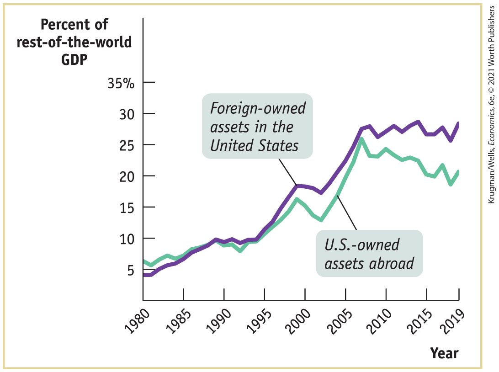
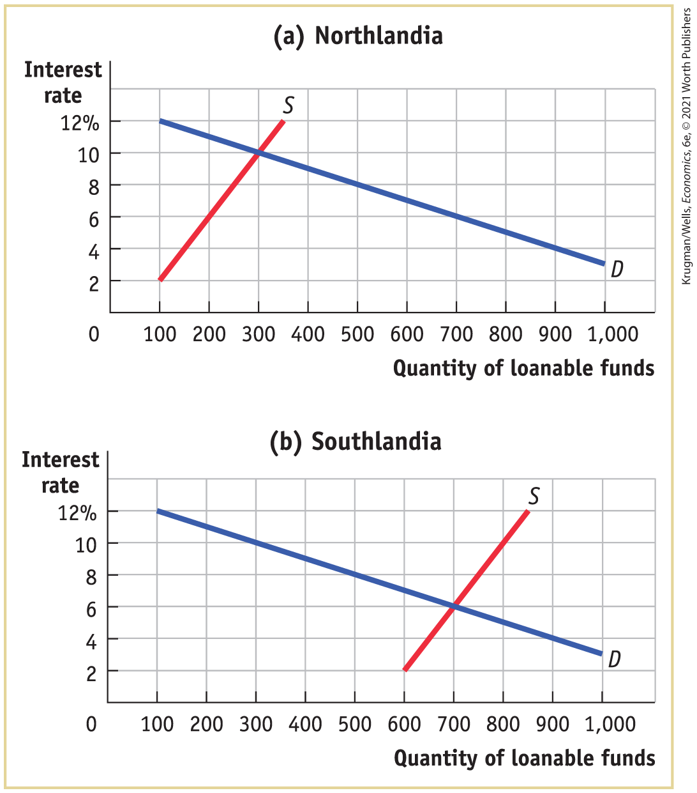
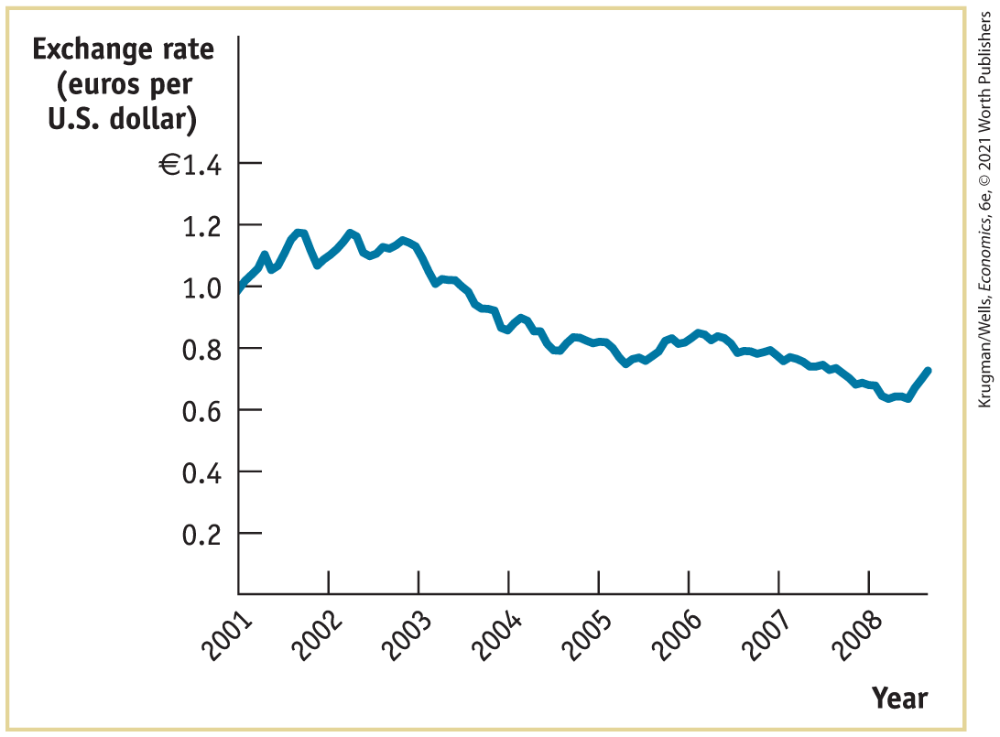
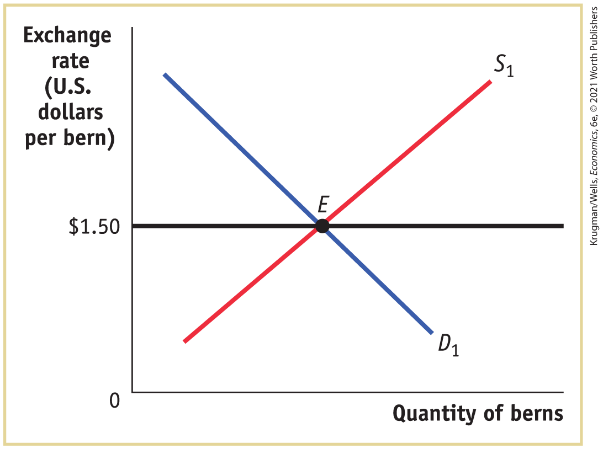
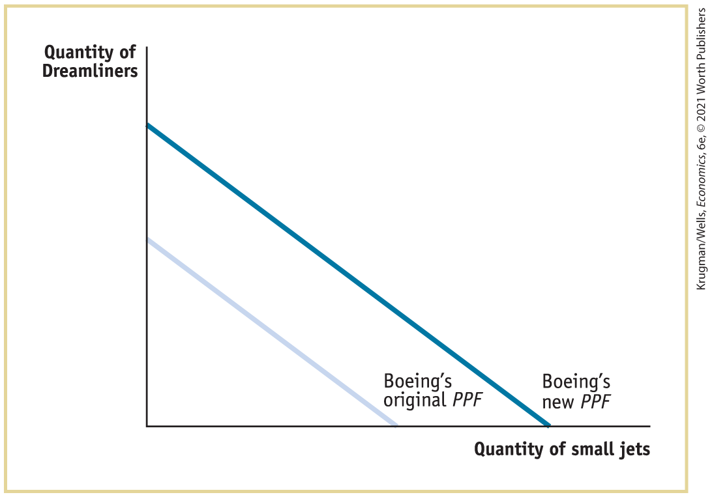
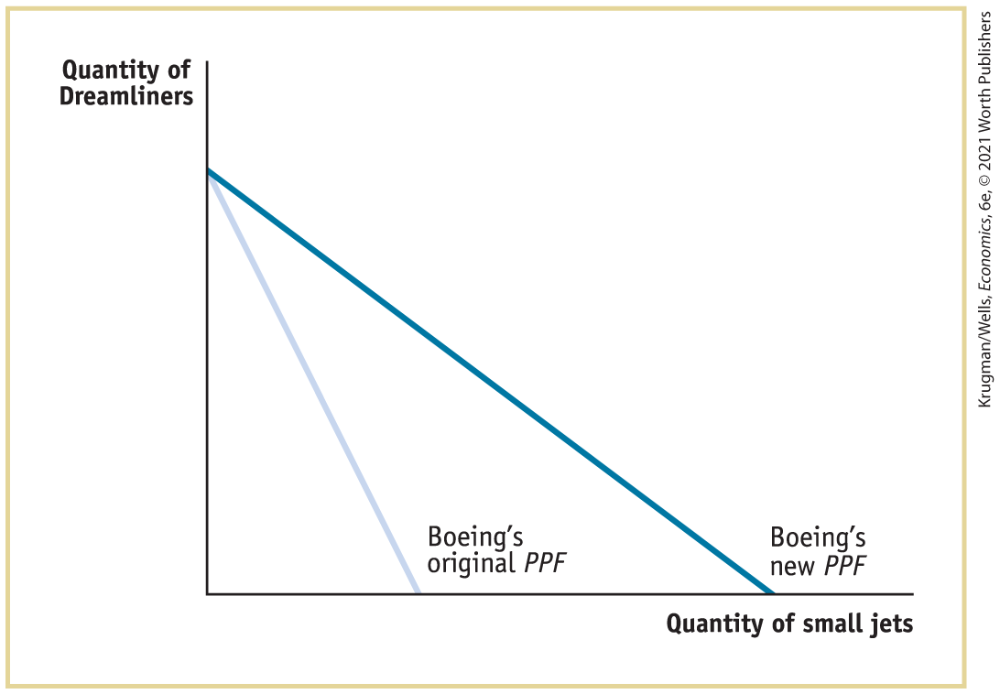

### Key Terms

- <a href="#kru_9781319245269_ch18_02.xhtml#pau_9781319320164_TfapMltBKZ" id="kru_9781319245269_ch18_07.xhtml#pau_9781319320164_dj6Q4uFJbz" class="crossref">Balance of payments accounts</a>
- <a href="#kru_9781319245269_ch18_02.xhtml#pau_9781319320164_5wWNcAJA2g" id="kru_9781319245269_ch18_07.xhtml#pau_9781319320164_1bIzyXHHTn" class="crossref">Balance of payments on current account (current account)</a>
- <a href="#kru_9781319245269_ch18_02.xhtml#pau_9781319320164_tdK59utHo7" id="kru_9781319245269_ch18_07.xhtml#pau_9781319320164_QmY98MnBu4" class="crossref">Balance of payments on goods and services</a>
- <a href="#kru_9781319245269_ch18_02.xhtml#pau_9781319320164_ae9Bb9bgzQ" id="kru_9781319245269_ch18_07.xhtml#pau_9781319320164_nxqomflEvX" class="crossref">Merchandise trade balance (trade balance)</a>
- <a href="#kru_9781319245269_ch18_02.xhtml#pau_9781319320164_QJl8k52mcK" id="kru_9781319245269_ch18_07.xhtml#pau_9781319320164_aFNoQUM3By" class="crossref">Balance of payments on financial account (financial account)</a>
- <a href="#kru_9781319245269_ch18_03.xhtml#pau_9781319320164_OMGhQSIym2" id="kru_9781319245269_ch18_07.xhtml#pau_9781319320164_1iF6brhvZF" class="crossref">Foreign exchange market</a>
- <a href="#kru_9781319245269_ch18_03.xhtml#pau_9781319320164_oJx3Fx4rwh" id="kru_9781319245269_ch18_07.xhtml#pau_9781319320164_3RDxaBOXz7" class="crossref">Exchange rates</a>
- <a href="#kru_9781319245269_ch18_03.xhtml#pau_9781319320164_ASmCRoFFdt" id="kru_9781319245269_ch18_07.xhtml#pau_9781319320164_cRDvJkluRh" class="crossref">Appreciates</a>
- <a href="#kru_9781319245269_ch18_03.xhtml#pau_9781319320164_R3VkEDz0DB" id="kru_9781319245269_ch18_07.xhtml#pau_9781319320164_cUwrWLR7Mf" class="crossref">Depreciates</a>
- <a href="#kru_9781319245269_ch18_03.xhtml#pau_9781319320164_Tk9ec7JWJP" id="kru_9781319245269_ch18_07.xhtml#pau_9781319320164_QUFRAqbZIJ" class="crossref">Equilibrium exchange rate</a>
- <a href="#kru_9781319245269_ch18_03.xhtml#pau_9781319320164_ARMZHKlxte" id="kru_9781319245269_ch18_07.xhtml#pau_9781319320164_3Nhbz2Ds6N" class="crossref">Real exchange rate</a>
- <a href="#kru_9781319245269_ch18_03.xhtml#pau_9781319320164_2Uw28NtbS6" id="kru_9781319245269_ch18_07.xhtml#pau_9781319320164_9rZD3qUNX6" class="crossref">Purchasing power parity</a>
- <a href="#kru_9781319245269_ch18_04.xhtml#pau_9781319320164_R4mzeKJF1R" id="kru_9781319245269_ch18_07.xhtml#pau_9781319320164_nituNd6eT3" class="crossref">Exchange rate regime</a>
- <a href="#kru_9781319245269_ch18_04.xhtml#pau_9781319320164_9IMMvmtt6Q" id="kru_9781319245269_ch18_07.xhtml#pau_9781319320164_Hp5AWvz6iR" class="crossref">Fixed exchange rate</a>
- <a href="#kru_9781319245269_ch18_04.xhtml#pau_9781319320164_9JbMweMTbH" id="kru_9781319245269_ch18_07.xhtml#pau_9781319320164_Ugtt1Kg5Zl" class="crossref">Floating exchange rate</a>
- <a href="#kru_9781319245269_ch18_04.xhtml#pau_9781319320164_joyaetCZBN" id="kru_9781319245269_ch18_07.xhtml#pau_9781319320164_eAwBnUUCU8" class="crossref">Exchange market intervention</a>
- <a href="#kru_9781319245269_ch18_04.xhtml#pau_9781319320164_VuFicf3mat" id="kru_9781319245269_ch18_07.xhtml#pau_9781319320164_P3GxDhYMtl" class="crossref">Foreign exchange reserves</a>
- <a href="#kru_9781319245269_ch18_04.xhtml#pau_9781319320164_ImfwyGAkqu" id="kru_9781319245269_ch18_07.xhtml#pau_9781319320164_peLrGuKCVy" class="crossref">Foreign exchange controls</a>
- <a href="#kru_9781319245269_ch18_05.xhtml#pau_9781319320164_hCHfddxJsJ" id="kru_9781319245269_ch18_07.xhtml#pau_9781319320164_vII9u9WQI4" class="crossref">Devaluation</a>
- <a href="#kru_9781319245269_ch18_05.xhtml#pau_9781319320164_8LAiapEJRO" id="kru_9781319245269_ch18_07.xhtml#pau_9781319320164_7VqvjCkb5z" class="crossref">Revaluation</a>

### Practice questions

1.  You recently read a headline that states: “The U.S. loses \$500 billion a year to trade with China.” This amount would be included as part of the U.S. current account deficit. How is this headline misleading? How do these transactions affect the loanable funds framework?
2.  During his presidency, Donald Trump attempted to alleviate the U.S. trade deficit by passing a series of tariffs on Chinese exports. Prior to President Trump taking office, the U.S. had an average tariff rate of 3.1% on Chinese exports but by February of 2020 the average tariff rate had increased to 19.3%. During the same time period, the U.S. dollar appreciated from 6.27 Chinese yuan to 7.10 yuan per U.S. dollar. Using the foreign exchange market, explain how the implementation of the tariffs would change the $\text{yuan/dollar}$ exchange rate. Is this consistent with what we observed in the data?
3.  With oil priced in U.S. dollars, most Middle Eastern and other oil-producing countries have a fixed exchange rate peg to the U.S. dollar. What are the pros and cons of these countries pegging their currency to the U.S. dollar?

### Problems

1.  How would the following transactions be categorized in the U.S. balance of payments accounts? Would they be entered in the current account (as a payment to or from a foreigner) or the financial account (as a sale of assets to or purchase of assets from a foreigner)? How will the balance of payments on the current and financial accounts change?
    1.  A French importer buys a case of California wine for \$500.
    2.  An American who works for a French company deposits her paycheck, drawn on a Paris bank, into her San Francisco bank.
    3.  An American buys a bond from a Japanese company for \$10,000.
    4.  An American charity sends \$100,000 to Africa to help local residents buy food after a harvest shortfall.

2.  The accompanying diagram shows foreign-owned assets in the United States and U.S.-owned assets abroad, both as a percentage of foreign GDP. As you can see from the diagram, both increased around fivefold from 1980 to 2019. <!--
[Macro-18UN08]
--> <!--
[Macro-18UN08, 09, 10, 11 are all unnumbered line art to accompany problems; no captions]
-->

    <figure id="pau_9781319320164_9OspfSRt3k" class="figure lm_img_lightbox unnum c5 center">
    
    <figcaption>
<em>Data from:</em> IMF; Bureau of Economic Analysis.
</figcaption>
    </figure>

    <aside class="hidden" id="pau_9781319320164_daRsmb1lqS" title="hidden">

    The vertical axis, labeled Percent of rest-of-the-world G D P ranges from 0 to 35 percent in increments of 5 percent. The horizontal axis, labeled Year ranges from 1980 to 2015 in increments of 5 years with an additional marking at 2019. A curve, labeled Foreign-owned assets in the United States, passes through the following approximate points, (1980, 4), (1985, 6), (1990, 10), (1995, 10), (2000, 17), (2005, 22), (2010, 25), (2015, 25), and (2019, 28). Another curve, labeled U S owned assets abroad, passes through the following approximate points, (1980, 6), (1985, 7), (1990, 9), (1995, 10), (2000, 17), (2005, 20), (20007, 25), (2010, 24), (2015, 22), and (2019, 21).

    </aside>

    1.  As U.S.-owned assets abroad increased as a percentage of foreign GDP, does this mean that the United States, over the period, experienced net capital outflows?
    2.  Does this diagram indicate that world economies were more tightly linked in 2019 than they were in 1980?

3.  In the economy of Scottopia in 2020, exports equaled \$400 billion of goods and \$300 billion of services, imports equaled \$500 billion of goods and \$350 billion of services, and the rest of the world purchased \$250 billion of Scottopia’s assets. What was the merchandise trade balance for Scottopia? What was the balance of payments on current account in Scottopia? What was the balance of payments on financial account? What was the value of Scottopia’s purchases of assets from the rest of the world?

4.  In the economy of Popania in 2020, total Popanian purchases of assets in the rest of the world equaled \$300 billion, purchases of Popanian assets by the rest of the world equaled \$400 billion, and Popania exported goods and services equal to \$350 billion. What was Popania’s balance of payments on financial account in 2020? What was its balance of payments on current account? What was the value of its imports?

5.  Suppose that Northlandia and Southlandia are the only two trading countries in the world, that each nation runs a balance of payments on both current and financial accounts equal to zero, and that each nation sees the other’s assets as identical to its own. Using the accompanying diagrams, explain how the demand and supply of loanable funds, the interest rate, and the balance of payments on current and financial accounts will change in each country if international capital flows are possible. <!--
[Macro-18UN09]
-->

    <figure id="pau_9781319320164_1K77vZk7vk" class="figure lm_img_lightbox unnum c5 center">
    
    </figure>

    <aside class="hidden" id="pau_9781319320164_67hP8Wwed9" title="hidden">

    Graph a, Northlandia: the vertical axis, labeled Interest rate ranges from 0 to 12 percent in increments of 2 percent. The horizontal axis, labeled Quantity of loanable funds ranges from 0 to 1,000 in increments 100. A positive sloping straight line labeled S starts at (100, 2) and ends at (350, 12). A negative sloping straight line labeled D starts at (100, 12) and ends at (1,000, 3). Graph b, Southlandia: the vertical axis, labeled Interest rate ranges from 0 to 12 percent in increments of 2 percent. The horizontal axis, labeled Quantity of loanable funds ranges from 0 to 1,000 in increments 100. A positive sloping straight line labeled S starts at (600, 2) and ends at (850, 12). A negative sloping straight line labeled D starts at (100, 12) and ends at (1,000, 3).

    </aside>

6.  Based on the exchange rates for the trading days of 2019 and 2020 shown in the accompanying table, did the U.S. dollar appreciate or depreciate over the year? Did the movement in the value of the U.S. dollar make American goods and services more or less attractive to foreigners?
    | April 1, 2019                            | April 1, 2020                            |
    |------------------------------------------|------------------------------------------|
    | US\$1.31 to buy 1 British pound sterling | US\$1.24 to buy 1 British pound sterling |
    | 30.81 Taiwan dollars to buy US\$1        | 30.29 Taiwan dollars to buy US\$1        |
    | US\$0.75 to buy 1 Canadian dollar        | US\$0.70 to buy 1 Canadian dollar        |
    | 111.23 Japanese yen to buy US\$1         | 107.22 Japanese yen to buy US\$1         |
    | US\$1.12 to buy 1 euro                   | US\$1.09 to buy 1 euro                   |
    | 1.00 Swiss franc to buy US\$1            | 0.97 Swiss franc to buy US\$1            |

7.  Go to <a href="http://fx.sauder.ubc.ca" id="kru_9781319245269_ch18_07.xhtml#pau_9781319320164_imzw7A9rVe" class="external">http://fx.sauder.ubc.ca</a>. Using the table labeled “The Most Recent Cross-Rates of Major Currencies,” determine whether the British pound (GBP), the Canadian dollar (CAD), the Japanese yen (JPY), the euro (EUR), and the Swiss franc (CHF) have appreciated or depreciated against the U.S. dollar (USD) since April 1, 2020. The exchange rates on April 1, 2020 are listed in the table in Problem 6.

8.  In January 2001, the U.S. federal funds rate was 6.5%, falling to 2% in November 2004. During the same period, the marginal lending rate at the European Central Bank fell from 5.75% to 3%.
    1.  Considering the change in interest rates over the period and using the loanable funds model, would you have expected funds to flow from the United States to Europe or from Europe to the United States over this period?

    2.  The accompanying diagram shows the exchange rate between the euro and the U.S. dollar from January 1, 2001, through September 2008. Is the movement of the exchange rate over the period January 2001 to November 2004 consistent with the movement in funds predicted in part a? <!--
[Macro-18UN10]
-->

        <figure id="pau_9781319320164_r40PD6m0ed" class="figure lm_img_lightbox unnum c5 center">
        
        <figcaption>
<em>Data from:</em> Federal Reserve Bank of St. Louis.
</figcaption>
        </figure>

        <aside class="hidden" id="pau_9781319320164_Mx6Fu8nhiS" title="hidden">

        The vertical axis, labeled Exchange rate (euros per U S dollar) ranges from 0 to 1.4 euros in increments of 0.2 euros. The horizontal axis, labeled Year ranges from 2001 to 2008 in increments of 1 year. The graph plots a curve that passes through the following approximate points, (2001, 1.0), (2002, 1.1), (2003, 1), (2005, 0.8), (2007, 0.8), and (2008, 0.7).

        </aside>

9.  In each of the following scenarios, suppose that the two nations are the only trading nations in the world. Given inflation and the change in the nominal exchange rate, which nation’s goods become more attractive?
    1.  Inflation is 10% in the United States and 5% in Japan; the U.S. dollar–Japanese yen exchange rate remains the same.
    2.  Inflation is 3% in the United States and 8% in Mexico; the price of the U.S. dollar falls from 12.50 to 10.25 Mexican pesos.
    3.  Inflation is 5% in the United States and 3% in the euro area; the price of the euro falls from \$1.30 to \$1.20.
    4.  Inflation is 8% in the United States and 4% in Canada; the price of the Canadian dollar rises from US\$0.60 to US\$0.75.

10. Starting from a position of equilibrium in the foreign exchange market under a fixed exchange rate regime, how must a government react to an increase in the demand for the nation’s goods and services by the rest of the world to keep the exchange rate at its fixed value?

11. Suppose that Albernia’s central bank has fixed the value of its currency, the bern, to the U.S. dollar (at a rate of US\$1.50 to 1 bern) and is committed to that exchange rate. Initially, the foreign exchange market for the bern is also in equilibrium, as shown in the accompanying diagram. However, both Albernians and Americans begin to believe that there are big risks in holding Albernian assets; as a result, they become unwilling to hold Albernian assets unless they receive a higher rate of return on them than they do on U.S. assets. How would this affect the diagram? If the Albernian central bank tries to keep the exchange rate fixed using monetary policy, how will this affect the Albernian economy? <!--
[Macro-18UN11]
-->

    <figure id="pau_9781319320164_imzm33Cjo9" class="figure lm_img_lightbox unnum c5 center">
    
    </figure>

    <aside class="hidden" id="pau_9781319320164_IJRd3mHRy0" title="hidden">

    The vertical axis, labeled Exchange rate (U S dollars per Bern) shows a marking at 1.50 dollars, and the horizontal axis is labeled Quantity of berns. A positive sloping straight line labeled S subscript 1 intersects a negative sloping straight line labeled D subscript 1 at E. A horizontal line runs to the right from 1.50 dollars on the vertical axis and passes through point E.

    </aside>

12.  Access the Discovering Data exercise for <!--<a class="crossref" href="kru_9781319245269_ch18_01.xhtml#ch18_sec_1" id="dumm-41">-->Chapter 18<!--</a>--> online to answer the following questions.
    1.  Using the most current data available, how has the exchange rate changed for Mexico, the United Kingdom, and Switzerland?
    2.  By how much did each of these three currencies appreciate and depreciate against the U.S. dollar?
    3.  How will the exchange rate change in each of the three countries affect their exports to the United States?

13. Your study partner asks you, “If central banks lose the ability to use discretionary monetary policy under fixed exchange rates, why would nations agree to a fixed exchange rate system?” How do you respond?

 **Work It Out**

14. Suppose the United States and Japan are the only two trading countries in the world. What will happen to the value of the U.S. dollar if the following occur, other things equal?
    1.  Japan relaxes some of its import restrictions.
    2.  The United States imposes some import tariffs on Japanese goods.
    3.  Interest rates in the United States rise dramatically.
    4.  A report indicates that Japanese cars last much longer than previously thought, especially compared with U.S. cars. 

## Solutions to *Check Your Understanding* Questions

<!--
<strong class="important">[New Right Page; set drop folio S-1; show partial pages corresponding to chapters as chapters ship; running heads left and right: SOLUTIONS TO CHECK YOUR UNDERSTANDING PROBLEMS]</strong>
--> <!--
<strong class="important">[Note that Solu<strong class="important">tions to Check Your Understanding Problems set ragged right and ragged bottom. Columns do not need to align.]</strong>
--> <!--&#x003C;APP1-INTR-->

This section offers suggested answers to the *Check Your Understanding* questions found within chapters.

### Chapter one

#### 1-1 Check Your Understanding

1.  

    1.  This illustrates the concept of opportunity cost. Given that a person can only eat so much at one sitting, having a slice of chocolate cake requires that you forgo eating something else, such as a slice of coconut cream pie.
    2.  This illustrates the concept that resources are scarce. Even if there were more resources in the world, the total amount of those resources would be limited. As a result, scarcity would still arise. For there to be no scarcity, there would have to be unlimited amounts of everything (including unlimited time in a human life), which is clearly impossible.
    3.  This illustrates the concept that people usually exploit opportunities to make themselves better off. Students will seek to make themselves better off by signing up for the tutorials of teaching assistants with good reputations and avoiding those teaching assistants with poor reputations. It also illustrates the concept that resources are scarce. If there were unlimited spaces in tutorials with good teaching assistants, they would not fill up.
    4.  This illustrates the concept of marginal analysis. Your decision about allocating your time is a “how much” decision: how much time spent exercising versus how much time spent studying. You make your decision by comparing the benefit of an additional hour of exercising to its cost, the effect on your grades of one less hour spent studying.

2.  

    1.  Yes. The increased time spent commuting is a cost you will incur if you accept the new job. That additional time spent commuting — or equivalently, the benefit you would get from spending that time doing something else — is an opportunity cost of the new job.
    2.  Yes. One of the benefits of the new job is that you will be making \$50,000. But if you take the new job, you will have to give up your current job; that is, you have to give up your current salary of \$45,000. So \$45,000 is one of the opportunity costs of taking the new job.
    3.  No. A more spacious office is an additional benefit of your new job and does not involve forgoing something else. So it is not an opportunity cost.

#### 1-2 Check Your Understanding

1.  

    1.  This illustrates the concept that there are gains from trade. Students trade tutoring services based on their different abilities in academic subjects.
    2.  This illustrates the concept that when markets don’t achieve efficiency, government intervention can improve society’s welfare. In this case the market, left alone, will permit bars and nightclubs to impose costs on their neighbors in the form of loud music, costs that the bars and nightclubs have no incentive to take into account. This is an inefficient outcome because society as a whole can be made better off if bars and nightclubs are induced to reduce their noise.
    3.  This illustrates the concept that resources should be used as efficiently as possible to achieve society’s goals. By closing neighborhood clinics and shifting funds to the main hospital, better health care can be provided at a lower cost.
    4.  This illustrates the concept that markets move toward equilibrium. Here, because books with the same amount of wear and tear sell for about the same price, no buyer or seller can be made better off by engaging in a different trade than he or she undertook. This means that the market for used textbooks has moved to an equilibrium.

2.  

    1.  This does not describe an equilibrium situation. Many students should want to change their behavior and switch to eating at the restaurants. An equilibrium will be established when students are equally as well off eating at the restaurants as eating at the dining hall — which would happen if, say, prices at the dining hall were higher than at the restaurants.
    2.  This does describe an equilibrium situation. By changing your behavior and riding the bus, you would not be made better off. Therefore, you have no incentive to change your behavior.

#### 1-3 Check Your Understanding

1.  

    1.  This illustrates the principle that increases in the economy’s potential lead to economic growth over time. Cheaper solar panels will lower the cost of energy, increasing the economy’s potential and economic growth. Solar panel manufacturers will be better off but firms producing competing energy will be worse off.
    2.  This illustrates the principle that overall spending sometimes gets out of line with the economy’s productive capacity; when it does, government policy can change spending. The tax cut would increase people’s after-tax incomes, leading to higher consumer spending.
    3.  This illustrates the principle that one person’s spending is another person’s income. As oil companies decrease their spending on labor by laying off workers and paying remaining workers lower wages, those workers’ incomes fall. In turn, those workers decrease their consumer spending, causing restaurants and other consumer businesses to lose income.

<!--
<strong class="important">[Chapter 2 will run in; see layouts]</strong>
-->

### Chapter two

<!--
<strong class="important">Krugman/Wells, Econ 6e</strong>
--> <!--
<strong class="important">Chapter 2: CYU Solutions</strong>
--> <!--
<strong class="important">[Solutions to </strong><i class="semantic-i"><strong class="important">Check Your Understanding</strong></i><strong class="important"> Questions. Chapter 2 runs in to Chapter 1; show partial pages corresponding to chapters as chapters ship; running heads left and right: SOLUTIONS TO Check Your Understanding PROBLEMS]</strong>
--> <!--
<strong class="important">[Note that Solutions to Check Your Understanding Problems set ragged right and ragged bottom. Columns do not need to align.]</strong>
-->

#### 2-1 Check Your Understanding

1.  

    1.  False. An increase in the resources available to Boeing for use in producing Dreamliners and small jets changes the production possibility frontier by shifting it outward. This is because Boeing can now produce more small jets and Dreamliners than before. In the accompanying figure, the line labeled “Boeing’s original PPF” represents Boeing’s original production possibility frontier, and the line labeled “Boeing’s new PPF” represents the new production possibility frontier that results from an increase in resources available to Boeing. <!--
<strong class="important">[Insert CYUS 2-1 1a]</strong>
-->

        <figure id="pau_9781319320164_xj4WJTLR7L" class="figure lm_img_lightbox unnum c5 center">
        
        </figure>

        <aside class="hidden" id="pau_9781319320164_Wukjq0GAzH" title="hidden">

        The horizontal axis is labeled Quantity of small jets, and the vertical axis is labeled Quantity of Dreamliners. The negative sloping line denoting Boeing’s original P P F falls from the vertical axis to the horizontal axis. The negative sloping line denoting Boeing’s new P P F is parallel and above the Boeing’s original P P F line.

        </aside>

    2.  True. A technological change that allows Boeing to build more small jets for any amount of Dreamliners built results in a change in its production possibility frontier. This is illustrated in the accompanying figure: the new production possibility frontier is represented by the line labeled “Boeing’s new PPF,” and the original production frontier is represented by the line labeled “Boeing’s original PPF.” Since the maximum quantity of Dreamliners that Boeing can build is the same as before, the new production possibility frontier intersects the vertical axis at the same point as the original frontier. But since the maximum possible quantity of small jets is now greater than before, the new frontier intersects the horizontal axis to the right of the original frontier. <!--
<strong class="important">[Insert CYUS 2-1 1b]</strong>
-->

        <figure id="pau_9781319320164_LGSS1Czl6i" class="figure lm_img_lightbox unnum c5 center">
        
        </figure>

        <aside class="hidden" id="pau_9781319320164_ehpIRQbZCd" title="hidden">

        The horizontal axis is labeled Quantity of small jets, and the vertical axis is labeled Quantity of Dreamliners. The negative sloping line denoting Boeing’s original P P F falls from the vertical axis to the horizontal axis. The negative sloping line denoting Boeing’s new P P F starts from the vertical axis at the same point as the original frontier and meets the horizontal axis to the right of the original frontier.

        </aside>

    3.  False. The production possibility frontier illustrates how much of one good an economy must give up to get more of another good only when resources are used efficiently in production. If an economy is producing inefficiently — that is, inside the frontier — then it does not have to give up a unit of one good in order to get another unit of the other good. Instead, by becoming more efficient in production, this economy can have more of both goods.

2.  

    1.  The United States has an absolute advantage in automobile production because it takes fewer Americans (6) to produce a car in one day than Italians (8). The United States also has an absolute advantage in washing machine production because it takes fewer Americans (2) to produce a washing machine in one day than Italians (3).
    2.  In Italy the opportunity cost of a washing machine in terms of an automobile is $\frac{3}{8}\mspace{2mu}:\frac{3}{8}$ of a car can be produced with the same number of workers and in the same time it takes to produce 1 washing machine. In the United States the opportunity cost of a washing machine in terms of an automobile is $\frac{2}{6} = \frac{1}{3}\mspace{2mu}:\frac{1}{3}$ of a car can be produced with the same number of workers and in the same time it takes to produce 1 washing machine. Since $\frac{1}{3} < \frac{3}{8}$, the United States has a comparative advantage in the production of washing machines: to produce a washing machine, only $\frac{1}{3}$ of a car must be given up in the United States but $\frac{3}{8}$ of a car must be given up in Italy. This means that Italy has a comparative advantage in automobiles. This can be checked as follows. The opportunity cost of an automobile in terms of a washing machine in Italy is $\frac{8}{3}$, equal to $2\frac{2}{3}\mspace{2mu}:2\frac{2}{3}$ washing machines can be produced with the same number of workers and in the time it takes to produce 1 car in Italy. And the opportunity cost of an automobile in terms of a washing machine in the United States is $\frac{6}{2}$, equal to 3:3 washing machines can be produced with the same number of workers and in the time it takes to produce 1 car in the United States. Since $2\frac{2}{3} < 3$, Italy has a comparative advantage in producing automobiles.
    3.  The greatest gains are realized when each country specializes in producing the good for which it has a comparative advantage. Therefore, the United States should specialize in washing machines and Italy should specialize in automobiles.

3.  At a trade of 10 U.S. large jets for 15 Brazilian small jets, Brazil gives up less for a large jet than it would if it were building large jets itself. Without trade, Brazil gives up 3 small jets for each large jet it produces. With trade, Brazil gives up only 1.5 small jets for each large jet from the United States. Likewise, the United States gives up less for a small jet than it would if it were producing small jets itself. Without trade, the United States gives up $\frac{3}{4}$ of a large jet for each small jet. With trade, the United States gives up only $\frac{2}{3}$ of a large jet for each small jet from Brazil.

4.  An increase in the amount of money spent by households results in an increase in the flow of goods to households. This, in turn, generates an increase in demand for factors of production by firms. So, there is an increase in the number of jobs in the economy.

#### 2-2 Check Your Understanding

1.  

    1.  This is a normative statement because it stipulates what should be done. In addition, it may have no “right” answer. That is, should people be prevented from all dangerous personal behavior if they enjoy that behavior — like skydiving? Your answer will depend on your point of view.
    2.  This is a positive statement because it is a description of fact.

2.  

    1.  True. Economists often have different value judgments about the desirability of a particular social goal. But despite those differences in value judgments, they will tend to agree that society, once it has decided to pursue a given social goal, should adopt the most efficient policy to achieve that goal. Therefore economists are likely to agree on adopting policy choice B.
    2.  False. Disagreements between economists are more likely to arise because they base their conclusions on different models or because they have different value judgments about the desirability of the policy.

<!--
<strong class="important">[Chapter 3 will run in.]</strong>
-->

### Chapter three

<!--
<strong class="important">Krugman/Wells, Economics 6e</strong>
--> <!--
<strong class="important">Chapter 3: CYU Solutions</strong>
--> <!--
<strong class="important">[Solutions to </strong><i class="semantic-i"><strong class="important">Check Your Understanding</strong></i><strong class="important"> Questions. Chapters run in; show partial pages corresponding to chapters as chapters ship; running heads left and right: SOLUTIONS TO Check Your Understanding PROBLEMS]</strong>
--> <!--
<strong class="important">[Note that Solutions to Check Your Understanding Problems set ragged right and ragged bottom. Columns do not need to align.]</strong>
-->

#### 3-1 Check Your Understanding

1.  

    1.  The quantity of umbrellas demanded is higher at any given price on a rainy day than on a dry day. This is a rightward shift of the demand curve, since at any given price the quantity demanded rises. This implies that any specific quantity can now be sold at a higher price.
    2.  The quantity of summer Caribbean cruises demanded rises in response to a price reduction. This is a movement along the demand curve for summer Caribbean cruises.
    3.  The demand for roses increases the week of Valentine’s Day. This is a rightward shift of the demand curve.
    4.  The quantity of gasoline demanded falls in response to a rise in price. This is a movement along the demand curve.

#### 3-2 Check Your Understanding

1.  

    1.  The quantity of houses supplied rises as a result of an increase in prices. This is a movement along the supply curve.
    2.  The quantity of strawberries supplied is higher at any given price. This is a rightward shift of the supply curve.
    3.  The quantity of labor supplied is lower at any given wage. This is a leftward shift of the supply curve compared to the supply curve during school vacation. So, in order to attract workers, fast-food chains have to offer higher wages.
    4.  The quantity of labor supplied rises in response to a rise in wages. This is a movement along the supply curve.
    5.  The quantity of cabins supplied is higher at any given price. This is a rightward shift of the supply curve.

#### 3-3 Check Your Understanding

1.  

    1.  The supply curve shifts rightward. At the original equilibrium price of the year before, the quantity of grapes supplied exceeds the quantity demanded. This is a case of surplus. The price of grapes will fall.
    2.  The demand curve shifts leftward. At the original equilibrium price, the quantity of hotel rooms supplied exceeds the quantity demanded. This is a case of surplus. The rates for hotel rooms will fall.
    3.  The demand curve for second-hand snowblowers shifts rightward. At the original equilibrium price, the quantity of second-hand snowblowers demanded exceeds the quantity supplied. This is a case of shortage. The equilibrium price of second-hand snowblowers will rise.
