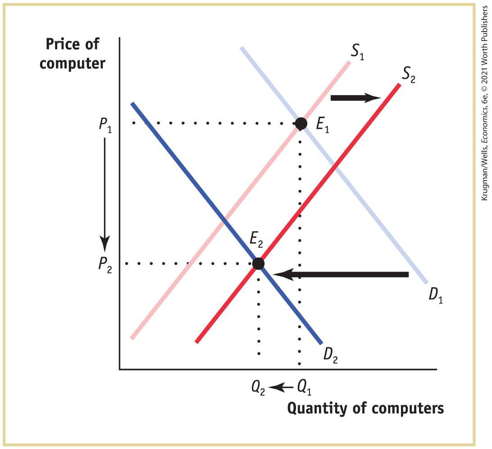
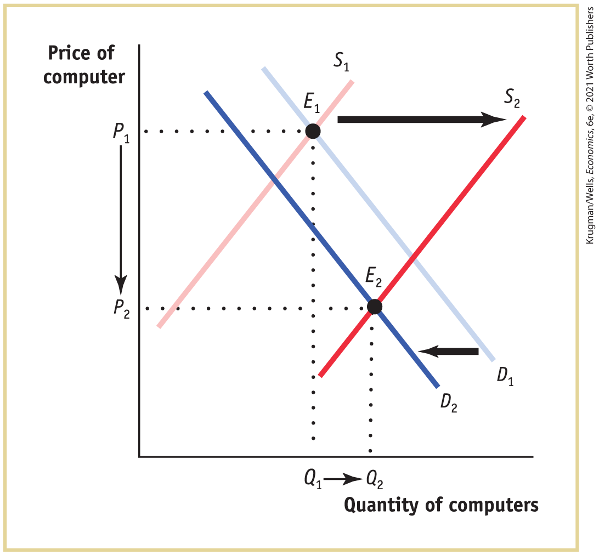
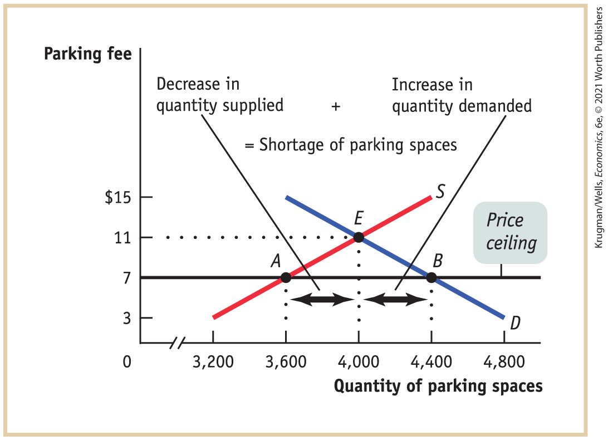
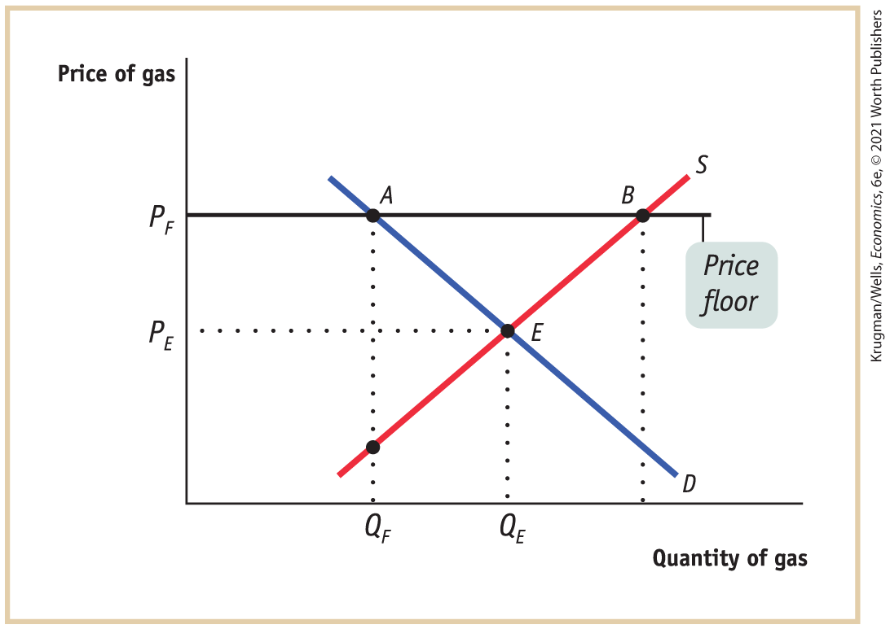
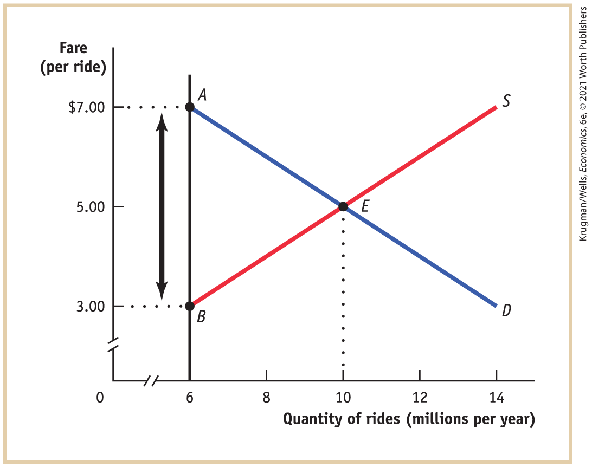
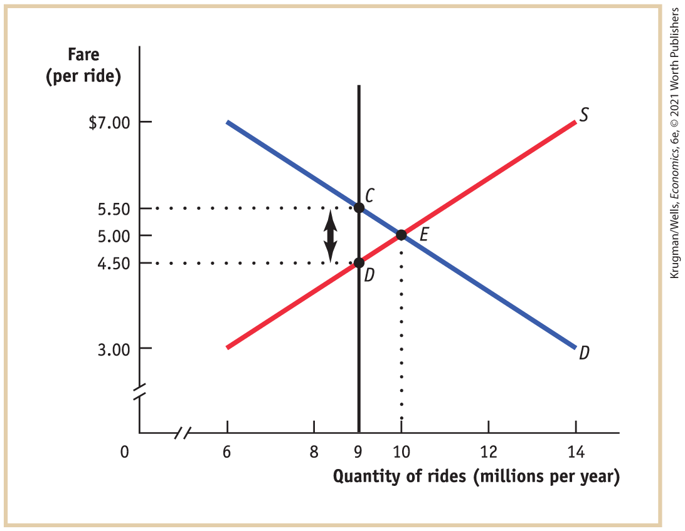
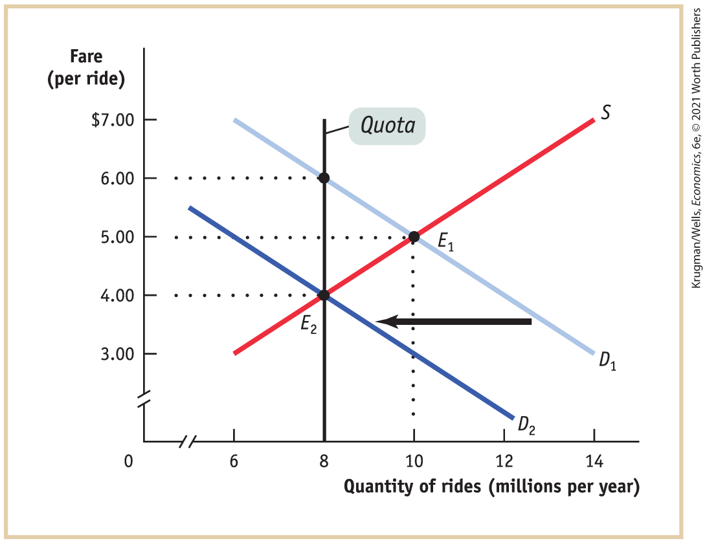
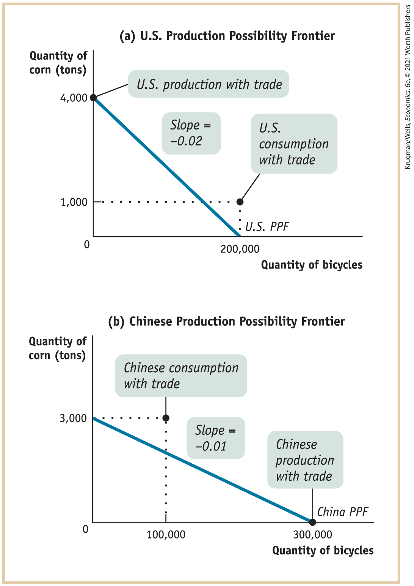
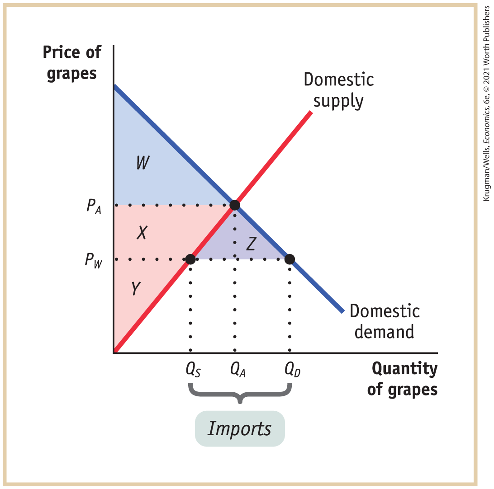
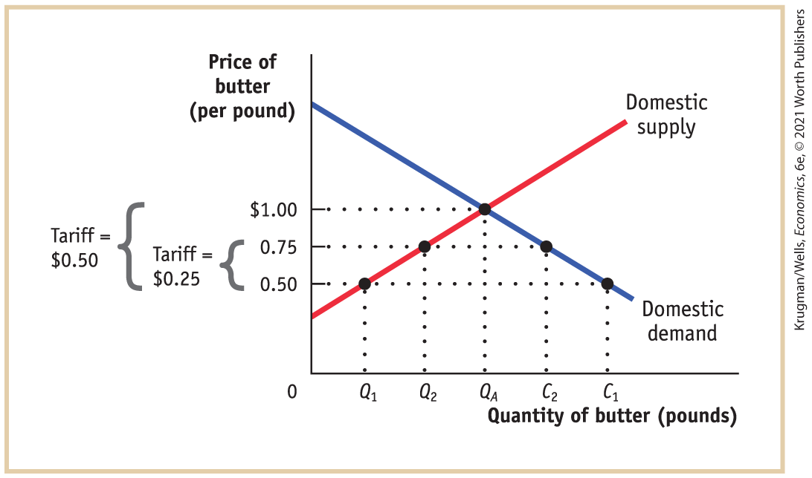

#### 3-4 Check Your Understanding

1.  

    1.  The market for large cars: this is a rightward shift in demand caused by a decrease in the price of a complement, gasoline. As a result of the shift, the equilibrium price of large cars will rise and the equilibrium quantity of large cars bought and sold will also rise.
    2.  The market for fresh paper made from recycled stock: this is a rightward shift in supply due to a technological innovation. As a result of this shift, the equilibrium price of fresh paper made from recycled stock will fall and the equilibrium quantity bought and sold will rise.
    3.  The market for movies at a local movie theater: this is a leftward shift in demand caused by a fall in the price of a substitute, on-demand films. As a result of this shift, the equilibrium price of movie tickets will fall and the equilibrium number of people who go to the movies will also fall.

2.  Upon the announcement of the new chip, the demand curve for computers using the earlier chip shifts leftward, as demand decreases, and the supply curve for these computers shifts rightward, as supply increases.
    1.  If demand decreases relatively more than supply increases, then the equilibrium quantity falls, as shown here:

        <figure id="pau_9781319320164_lf1xDMqRNU" class="figure lm_img_lightbox unnum c5 center">
        
        </figure>

        <aside class="hidden" id="pau_9781319320164_ZC39xiyOA0" title="hidden">

        The horizontal axis is labeled Quantity of computers, and the vertical axis is labeled price of computer. The supply curves are positive sloping parallel lines, and the demand curves are negative sloping parallel lines. Supply curve S subscript 2 is parallel and to the right of supply curve S subscript 1. A horizontal right arrow between the supply lines indicates the shift from S subscript 1 to S subscript 2. Demand curve D subscript 1 intersects supply curve S subscript 1 at a point E subscript 1, where Quantity is Q subscript 1, and Price is P subscript 1. Demand curve D subscript 2 intersects supply curve S subscript 2 at a point E subscript 2, where Quantity is Q subscript 2, and Price is P subscript 2. A horizontal left arrow between the demand lines indicates the shift from D subscript 1 to D subscript 2. The shift in demand is higher than the shift in supply. Point E subscript 2 is to the left of point E subscript 1. The fall in price and quantity between points E subscript 1 and E subscript 2 is indicated by arrows.

        </aside>

        <!--
<strong class="important">[CYUS 3-4 2a1]</strong>
-->

        If supply increases relatively more than demand decreases, then the equilibrium quantity rises, as shown here:

        <figure id="pau_9781319320164_F1nFBiMsAU" class="figure lm_img_lightbox unnum c5 center">
        
        </figure>

        <aside class="hidden" id="pau_9781319320164_0jIgl7zzFh" title="hidden">

        The horizontal axis is labeled Quantity of computers, and the vertical axis is labeled price of computer. The supply curves are positive sloping parallel lines, and the demand curves are negative sloping parallel lines. Supply curve S subscript 2 is parallel and to the right of supply curve S subscript 1. A horizontal right arrow between the supply lines indicates the shift from S subscript 1 to S subscript 2. Demand curve D subscript 1 intersects supply curve S subscript 1 at a point E subscript 1, where Quantity is Q subscript 1, and Price is P subscript 1. Demand curve D subscript 2 intersects supply curve S subscript 2 at a point E subscript 2, where Quantity is Q subscript 2, and Price is P subscript 2. A horizontal left arrow between the demand lines indicates the shift from D subscript 1 to D subscript 2. The shift in supply is higher than the shift in demand. Point E subscript 2 is to the right of point E subscript 1. The fall in price and the rise in quantity between points E subscript 1 and E subscript 2 are indicated by arrows.

        </aside>

    2.  In both cases, the equilibrium price falls.

### Chapter four

<!--
<strong class="important">Krugman/Wells, ECON6E</strong>
--> <!--
<strong class="important">Chapter 5: CYU Solutions</strong>
--> <!--
 <strong class="important">[Solutions to </strong><i class="semantic-i"><strong class="important">Check Your Understanding</strong></i> <strong class="important">Questions. Chapters run in; show partial pages corresponding to chapters as chapters ship; running heads left and right: SOLUTIONS TO Check Your Understanding PROBLEMS]</strong>
--> <!--
<strong class="important">[Note that Solutions to Check Your Understanding Problems set ragged right and ragged bottom. Columns do not need to align.]</strong>
-->

#### 4-1 Check Your Understanding

1.  

    1.  Fewer homeowners are willing to rent out their driveways because the price ceiling has reduced the payment they receive. This is an example of a fall in price leading to a fall in the quantity supplied. It is shown in the accompanying diagram by the movement from point *E* to point *A* along the supply curve, a reduction in quantity of 400 parking spaces.<!--
<strong class="important">[CYUS 5-1 1a]</strong>
-->

        <figure id="pau_9781319320164_6HhtNOW23h" class="figure lm_img_lightbox unnum c5 center">
        
        </figure>

        <aside class="hidden" id="pau_9781319320164_JXCW0OCK8v" title="hidden">

        The vertical axis labeled parking fee shows markings at 0, 3, 7, 11, and 15 dollars from bottom to top. The horizontal axis labeled quantity of parking spaces is truncated and ranges from 3,200 to 4,800, in increments of 400. Supply curve S is a positive sloping line that extends through (3,200, 3) and (4,000, 11). Demand curve D is a negative sloping line that extends through (4,000, 11) and (4,400, 7). A line labeled Price ceiling runs parallel to the horizontal axis, starting from (0, 7) and passing through (3,600, 7) and (4,400, 7). The supply curve S intersects the demand curve D at E (4,000, 11), a point above the price ceiling line. An equation at the top reads decrease in quantity supplied plus increase in quantity demanded equals shortage of parking spaces. The horizontal gap between points A (3,600, 7) and E (4,000, 11) is labeled Decrease in quantity supplied. The horizontal gap between points E (4,000, 11) and B (4,400, 7) is labeled Increase in quantity demanded.

        </aside>

    2.  The quantity demanded increases by 400 spaces as the price decreases. At a lower price, more fans are willing to drive and rent a parking space. It is shown in the diagram by the movement from point *E* to point *B* along the demand curve.

    3.  Under a price ceiling, the quantity demanded exceeds the quantity supplied; as a result, shortages arise. In this case, there will be a shortage of 800 parking spaces. It is shown by the horizontal distance between points *A* and *B*.

    4.  Price ceilings result in wasted resources. The additional time fans spend to guarantee a parking space is wasted time.

    5.  Price ceilings lead to inefficient allocation of a good — here, the parking spaces — to consumers.

    6.  Price ceilings lead to black markets.

2.  

    1.  False. By lowering the price that producers receive, a price ceiling leads to a decrease in the quantity supplied.
    2.  True. A price ceiling leads to a lower quantity supplied than in an efficient, unregulated market. As a result, some people who would have been willing to pay the market price, and so would have gotten the good in an unregulated market, are unable to obtain it when a price ceiling is imposed.
    3.  True. Those producers who still sell the product now receive less for it and are therefore worse off. Other producers will no longer find it worthwhile to sell the product at all and so will also be made worse off.

#### 4-2 Check Your Understanding

1.  

    1.  Some gas station owners will benefit from getting a higher price. *QF* indicates the sales made by these owners. But some will lose; there are those who make sales at the market equilibrium price of *PE* but do not make sales at the regulated price of *PF*. These missed sales are indicated on the graph by the fall in the quantity demanded along the demand curve, from point *E* to point *A.*

    2.  Those who buy gas at the higher price of *PF* will probably receive better service; this is an example of *inefficiently high quality* caused by a price floor as gas station owners compete on quality rather than price. But opponents are correct to claim that consumers are generally worse off — those who buy at *PF* would have been happy to buy at *PE*, and many who were willing to buy at a price between *PE* and *PF* are now unwilling to buy. This is indicated on the graph by the fall in the quantity demanded along the demand curve, from point *E* to point *A.*

    3.  Proponents are wrong because consumers and some gas station owners are hurt by the price floor, which creates “missed opportunities” — desirable transactions between consumers and station owners that never take place. Moreover, the inefficiency of wasted resources arises as consumers spend time and money driving to other states. The price floor also tempts people to engage in black market activity. With the price floor, only *QF* units are sold. But at prices between *PE* and *PF*, there are drivers who cumulatively want to buy more than *QF* and owners who are willing to sell to them, a situation likely to lead to illegal activity.<!--
<strong class="important">[CYUS 5-2 1c]</strong>
-->

        <figure id="pau_9781319320164_tQYAJaZBdC" class="figure lm_img_lightbox unnum c5 center">
        
        </figure>

        <aside class="hidden" id="pau_9781319320164_DXQW6AFHRj" title="hidden">

        The graph plots price of gas in the vertical axis against quantity of gas in the horizontal axis. The price floor line runs parallel to the horizontal axis at P subscript F. A positive sloping supply curve S intersects a negative sloping demand curve D at point E, corresponding to the price P subscript E and Quantity Q subscript E. The demand curve intersects the price floor line at point A, corresponding to the quantity Q subscript F. The supply curve passes through a point corresponding to the quantity Q subscript F, and intersects the price floor at a point B.

        </aside>

#### 4-3 Check Your Understanding

1.  

    1.  The price of a ride is \$7 since the quantity demanded at this price is 6 million: \$7 is the *demand price* of 6 million rides. This is represented by point *A* in the accompanying figure.<!--
<strong class="important">[CYUS 5-3 1a]</strong>
-->

        <figure id="pau_9781319320164_D3pg7Cs3Or" class="figure lm_img_lightbox unnum c5 center">
        
        </figure>

        <aside class="hidden" id="pau_9781319320164_GA0sDkgJJ5" title="hidden">

        The vertical axis, labeled “fare (per ride)” is truncated and ranges from 3 to 7 dollars, in increments of 2 dollars, and the horizontal axis, labeled “quantity of rides (millions per year)” is truncated and ranges from 6 to 14, in increments of 2. A positive sloping supply curve S is a line that extends through (6, 3), (10, 5), and (14, 7). A negative sloping demand curve D is a line that extends through (6, 7), (10, 5), and (14, 3). The supply curve intersects the demand curve at point E (10, 5). A line parallel to the vertical axis extends from (6, 0). It intersects the supply curve at point B (6, 3) and the demand curve at point A (6, 7). Dotted horizontal lines from points A and B meet their respective coordinates on the vertical axis. The difference in fare between points A and B is depicted by a bi-directional vertical arrow between the two dotted horizontal lines.

        </aside>

    2.  At 6 million rides, the supply price is \$3 per ride, represented by point *B* in the figure. The wedge between the demand price of \$7 per ride and the supply price of \$3 per ride is the quota rent per ride, \$4. This is represented in the figure above by the vertical distance between points *A* and *B.*

    3.  At 9 million rides, the demand price is \$5.50 per ride, indicated by point *C* in the accompanying figure, and the supply price is \$4.50 per ride, indicated by point *D.* The quota rent is the difference between the demand price and the supply price: \$1. <!--
<strong class="important">[CYUS 5-3 1d]</strong>
-->

        <figure id="pau_9781319320164_VKGqvAirZD" class="figure lm_img_lightbox unnum c5 center">
        
        </figure>

        <aside class="hidden" id="pau_9781319320164_qISylcZfjX" title="hidden">

        The vertical axis, labeled “fare (per ride)” is truncated and shows markings at 3, 4.50, 5, 5.50, and 7 dollars from bottom to top, and the horizontal axis, labeled “quantity of rides (millions per year)” is truncated and shows markings at 6, 8, 9, 10, 12, and 14, from left to right. A positive sloping supply curve S is a line that extends through (6, 3), (9, 4.50), (10, 5), and (14, 7). A negative sloping demand curve D is a line that extends through (6, 7), (9, 5.50), (10, 5), and (14, 3). The supply curve intersects the demand curve at point E (10, 5). A line parallel to the vertical axis extends from (9, 0). It intersects the supply curve at point D (9, 4.50) and the demand curve at point C (9, 5.50). Dotted horizontal lines from points C and D meet their respective coordinates on the vertical axis. The difference in fare between points C and D is depicted by a bi-directional vertical arrow between the two dotted horizontal lines.

        </aside>

2.  The accompanying figure shows a decrease in demand by 4 million rides, represented by a leftward shift of the demand curve from *D*1 to *D*2: at any given price, the quantity demanded falls by 4 million rides. (For example, at a price of \$5, the quantity demanded falls from 10 million to 6 million rides per year.) This eliminates the effect of a quota limit of 8 million rides. At point *E*2, the new market equilibrium, the equilibrium quantity is equal to the quota limit; as a result, the quota has no effect on the market. <!--
<strong class="important">[CYUS 5-3 2]</strong>
-->

    <figure id="pau_9781319320164_OGvQL0DlUO" class="figure lm_img_lightbox unnum c5 center">
    
    </figure>

    <aside class="hidden" id="pau_9781319320164_kqeEkzMBpG" title="hidden">

    The vertical axis labeled fare (per ride) is truncated and ranges from 3 to 7 dollars, in increments of 1 dollar, and the horizontal axis labeled quantity of rides (millions per year) is truncated and ranges from 6 to 14, in increments of 2. All coordinates are approximated. A negative sloping demand curve labeled D subscript 1 starts at (6, 7) and ends at (14, 3). Another negative sloping demand curve labeled D subscript 2 starts at (4, 5.50) and ends at (12.2, 1). A horizontal left arrow between the demand lines indicates the shift from D subscript 1 to D subscript 2. A positive sloping supply curve labeled S starts at (6, 3) and ends at (14, 7). The curves S and D subscript 1 intersect each other at point E subscript 1 (10, 5). The curves S and D subscript 2 intersect each other at point E subscript 2 (8, 4). A point on the curve D subscript 1 corresponds to (8, 6). Dotted lines from points E subscript 1, E subscript 2, and the point on the curve D subscript 1 meet their respective coordinates on the vertical and horizontal axes. A line parallel to the vertical axis is labeled quota and extends from (8, 0). It intersects the supply curve S and demand curve D subscript 2 at point E subscript 2 (8, 4) and the demand curve D subscript 1 at (8, 6).

    </aside>

### Chapter five

#### 5-1 Check Your Understanding

1.  

    1.  To determine comparative advantage, we must compare the two countries’ opportunity costs for a given good. Take the opportunity cost of 1 ton of corn in terms of bicycles. In China, the opportunity cost of 1 bicycle is 0.01 ton of corn; so the opportunity cost of 1 ton of corn is $1\text{/}0.01\text{~bicycles} = 100\text{~bicycles}$. The United States has the comparative advantage in corn since its opportunity cost in terms of bicycles is 50, a smaller number. Similarly, the opportunity cost in the United States of 1 bicycle in terms of corn is $1\text{/}50\text{~ton~of~corn} = 0.02\text{~ton~of~corn}$. This is greater than 0.01, the Chinese opportunity cost of 1 bicycle in terms of corn, implying that China has a comparative advantage in bicycles.

    2.  Given that the United States can produce 200,000 bicycles if no corn is produced, it can produce $200\text{,}000\text{~bicycles}\, \times \, 0.02\text{~ton~of~corn/bicycle}\, = \, 4\text{,}000\,\text{tons}$ of corn when no bicycles are produced. Likewise, if China can produce 3,000 tons of corn if no bicycles are produced, it can produce $3\text{,}000\text{~tons~of~corn~}\operatorname{\times~100~bicycles/ton~of~corn~=~300,000}$ bicycles if no corn is produced. These points determine the vertical and horizontal intercepts of the U.S. and Chinese production possibility frontiers, as shown in the accompanying diagram.

        <figure id="pau_9781319320164_m6KbtacC68" class="figure lm_img_lightbox unnum c5 center">
        
        </figure>

        <aside class="hidden" id="pau_9781319320164_GqT7ALva2e" title="hidden">

        In graph (a), the vertical axis represents Quantity of corn (tons) and shows the following markings: 0, 1,000, and 4,000 from bottom to top. The horizontal axis represents Quantity of bicycles and shows the following markings, 0 and 200,000 from left to right. The graph has a negative sloping line that starts at (0, 4,000) labeled “U. S. production with trade,” and ends at (200,000, 0) labeled U.S. P P F. A point at (200,000, 1,000) is labeled, “U. S. consumption with trade.” Slope equals negative 0.02. In graph (b), the vertical axis represents Quantity of corn (tons) and shows the following markings from bottom to top: 0 and 3,000. The horizontal axis represents Quantity of bicycles and shows the following markings from left to right, 0, 100,000, and 300,000. The graph has a negative sloping line that starts at (0, 3,000) and ends at (300,000, 0). A point at (100,000, 3,000) is labeled, “Chinese consumption with trade.” A point at (300,000, 0) is labeled, “Chinese production with trade.” Slope equals negative 0.01.

        </aside>

    3.  The diagram shows the production and consumption points of the two countries. Each country is clearly better off with international trade because each now consumes a bundle of the two goods that lies outside its own production possibility frontier, indicating that these bundles were unattainable in autarky.

2.  

    1.  According to the Heckscher–Ohlin model, this pattern of trade occurs because the United States has a relatively larger endowment of factors of production, such as human capital and physical capital, that are suited to the production of movies, but France has a relatively larger endowment of factors of production suited to wine-making, such as vineyards and the human capital of vintners.
    2.  According to the Heckscher–Ohlin model, this pattern of trade occurs because the United States has a relatively larger endowment of factors of production, such as human and physical capital, that are suited to making machinery, but Brazil has a relatively larger endowment of factors of production suited to shoe-making, such as unskilled labor and leather.

#### 5-2 Check Your Understanding

1.  In the accompanying diagram, $P_{A}$ is the U.S. price of grapes in autarky and $P_{W}$ is the world price of grapes under international trade. With trade, U.S. consumers pay a price of $P_{W}$ for grapes and consume quantity $Q_{D}$*,* U.S. grape producers produce quantity $Q_{S}$*,* and the difference, $Q_{D} - Q_{S}$*,* represents imports of Mexican grapes. As a consequence of the strike by truckers, imports are halted, the price paid by American consumers rises to the autarky price, $P_{A}$*,* and U.S. consumption falls to the autarky quantity, $Q_{A}$*.* <!--
<strong class="important">[CYU SOL 8-2 1]</strong>
-->

    <figure id="pau_9781319320164_kClSdZ7eCS" class="figure lm_img_lightbox unnum c5 center">
    
    </figure>

    <aside class="hidden" id="pau_9781319320164_6nhnjeyp4k" title="hidden">

    The vertical axis labeled Price of grapes shows two markings P subscript W and P subscript A from bottom to top. The horizontal axis labeled Quantity of grapes shows the following markings, Q subscript S, Q subscript A, and Q subscript D, from left to right. The horizontal distance between Q subscript S and Q subscript D is labeled Imports. A positive sloping line labeled domestic supply from the origin intersects a negative sloping line labeled domestic demand from the positive vertical axis at a point (Q subscript A, P subscript A). Two points, (Q subscript S, P subscript W) and (Q subscript D, P subscript W), are marked on the supply and demand curves, respectively. The area above the horizontal dotted line from P subscript A and below the demand curve is shaded and labeled W. The area below W and above the horizontal dotted line from P subscript W, bound by the supply curve, is shaded and labeled X. The area below X and above the supply curve is shaded and labeled Y. The triangular area between equilibrium point and the two other points on the curves is shaded and labeled Z.

    </aside>

    1.  Before the strike, U.S. consumers enjoyed consumer surplus equal to areas $W + X + Z$*.* After the strike, their consumer surplus shrinks to *W.* So consumers are worse off, losing consumer surplus represented by $X + Z$*.*
    2.  Before the strike, U.S. producers had producer surplus equal to the area *Y.* After the strike, their producer surplus increases to $Y + X$*.* So U.S. producers are better off, gaining producer surplus represented by *X.*
    3.  U.S. total surplus falls as a result of the strike by an amount represented by area *Z,* the loss in consumer surplus that does not accrue to producers.

2.  Mexican grape producers are worse off because they lose sales of exported grapes to the United States, and Mexican grape pickers are worse off because they lose the wages that were associated with the lost sales. The lower demand for Mexican grapes caused by the strike implies that the price Mexican consumers pay for grapes falls, making them better off. U.S. grape pickers are better off because their wages increase as a result of the increase of $Q_{A} - Q_{S}$ in U.S. sales.

#### 5-3 Check Your Understanding

1.  

    1.  If the tariff is \$0.50, the price paid by domestic consumers for a pound of imported butter is $\$ 0.50 + \$ 0.50 = \$ 1.00$, the same price as a pound of domestic butter. Imported butter will no longer have a price advantage over domestic butter, imports will cease, and domestic producers will capture all the feasible sales to domestic consumers, selling amount $Q_{A}$ in the accompanying figure. If the tariff is \$0.25, the price paid by domestic consumers for a pound of imported butter is $\$ 0.50 + \$ 0.25 = \$ 0.75,\ \$ 0.25$ cheaper than a pound of domestic butter. American butter producers will gain sales in the amount of $Q_{2} - Q_{1}$ as a result of the \$0.25 tariff. But this is smaller than the amount they would have gained under the \$0.50 tariff, the amount $Q_{A} - Q_{1}$. <!--
<strong class="important">[CYU SOL 8-3 1a]</strong>
-->

        <figure id="pau_9781319320164_DKyQ6KGRaQ" class="figure lm_img_lightbox unnum c5 center">
        
        </figure>

        <aside class="hidden" id="pau_9781319320164_eU0rvOyq6m" title="hidden">

        The vertical axis labeled Price of butter (per pound) shows three markings at 0.50 dollars, 0.75 dollars, and 1 dollar, from bottom to top. The horizontal axis labeled Quantity of butter (pounds) shows the following markings from left to right, Q subscript 1, Q subscript 2, Q subscript A, C subscript 2, and C subscript 1. The graph shows a positive sloping line labeled domestic supply from a price less than 0.50 dollars on the vertical axis, and a negative sloping line labeled domestic demand from a price greater than 1 dollar on the vertical axis. Both the lines intersect each other at (Q subscript A, 1). Four points on the graph are marked at (Q subscript 1, 0.50) and (Q subscript 2, 0.75) on the supply line, and at (C subscript 2, 0.75) and (C subscript 1, 0.50) on the demand line. The difference between 0.75 and 0.5 on the vertical axis is labeled, “Tariff equals 0.25 dollars.” The difference between 1 and 0.5 on the vertical axis is labeled, “Tariff equals 0.5 dollars.”

        </aside>

    2.  As long as the tariff is at least \$0.50, increasing it more has no effect. At a tariff of \$0.50, all imports are effectively blocked.

2.  All imports are effectively blocked at a tariff of \$0.50. So such a tariff corresponds to an import quota of 0.

#### 5-4 Check Your Understanding

1.  There are many fewer businesses that use steel as an input than there are consumers who buy sugar or clothing. So it will be easier for such businesses to communicate and coordinate among themselves to lobby against tariffs than it will be for consumers. In addition, each business will perceive that the cost of a steel tariff is quite costly to its profits, but an individual consumer is either unaware of or perceives little loss from tariffs on sugar or clothing.
2.  Countries are often tempted to protect domestic industries by claiming that an import poses a quality, health, or environmental danger to domestic consumers. A WTO official should examine whether domestic producers are subject to the same stringency in the application of quality, health, or environmental regulations as foreign producers. If they are, then it is more likely that the regulations are for legitimate, non–trade protection purposes; if they are not, then it is more likely that the regulations are intended as trade protection measures.

### Chapter six

<!--
<strong class="important">[COMP: For now, begin a new page for this chapter. Later, at Second Pages, we will create the run-in version. Chapter 1, 2, and 3 will be picked up from Micro. We&#x2019;ll add Chapters 4 and 5 to those when we have them, and follow up with Chapter 6.]</strong>
--> <!--
<strong class="important">[Solutions to </strong><i class="semantic-i"><strong class="important">Check Your Understanding</strong></i><strong class="important">Questions. Chapters run in; show partial pages corresponding to chapters as chapters ship; running heads left and right: SOLUTIONS TO Check Your Understanding PROBLEMS]</strong>
--> <!--
<strong class="important">[Note that Solutions to Check Your Understanding Problems set ragged right and ragged bottom. Columns do not need to align.]</strong>
-->

#### 6-1 Check Your Understanding

1.  

    1.  This is a microeconomic question because it addresses decisions made by consumers about a particular product.
    2.  This is a macroeconomic question because it addresses consumer spending in the overall economy.
    3.  This is a macroeconomic question because it addresses changes in the overall economy.
    4.  This is a microeconomic question because it addresses changes in a particular market, in this case the market for economists.
    5.  This is a microeconomic question because it addresses choices made by consumers and producers about which mode of transportation to use.
    6.  This is a microeconomic question because it addresses changes in a particular market.
    7.  This is a macroeconomic question because it addresses changes in a measure of the economy’s overall price level.

2.  

    1.  When people can’t get credit to finance their purchases, they will be unable to spend money. This will weaken the economy, and as others see the economy weaken, they will also cut back on their spending in order to save for future bad times. As a result, the credit shortfall will spark a compounding effect through the economy as people cut back their spending, making the economy worse, leading to more cutbacks in spending, and so on.
    2.  If you believe the economy is self-regulating, then you would advocate doing nothing in response to the slump.
    3.  If you believe in Keynesian economics, you would advocate that policy makers undertake monetary and fiscal policies to stimulate spending in the economy.

#### 6-2 Check Your Understanding

1.  We talk about business cycles for the economy as a whole because recessions and expansions are not confined to a few industries — they reflect downturns and upturns for the economy as a whole. In downturns, almost every sector of the economy reduces output and the number of people employed. Moreover, business cycles are an international phenomenon, sometimes moving in rough synchrony across countries.
2.  A recession can hurt people throughout society. They cause large numbers of workers to lose their jobs and make it hard to find new jobs. Recessions hurt the standard of living of many families and are usually associated with a rise in the number of people living below the poverty line, an increase in the number of people who lose their houses because they can’t afford their mortgage payments, and a fall in the percentage of Americans with health insurance. Recessions also hurt the profits of firms.

#### 6-3 Check Your Understanding

1.  Countries with high rates of population growth will have to maintain higher long-run growth rates of overall output than countries with low rates of population growth in order to achieve an increased standard of living per person, because aggregate output will have to be divided among a larger number of people.
2.  No, Argentina is not poorer than it was in the past. Both Argentina and Canada have experienced long-run growth. However, after World War II, Argentina did not make as much progress as Canada, perhaps because of political instability and bad macroeconomic policies. Also, Canada’s economy grew much faster than Argentina’s. Although Canada is now about three times as rich as Argentina, Argentina still experienced long-run growth.

#### 6-4 Check Your Understanding

1.  

    1.  As some prices have risen but other prices have fallen, there may be overall inflation or deflation. The answer is ambiguous.
    2.  As all prices have risen significantly, this sounds like inflation.
    3.  As most prices have fallen and others have not changed, this sounds like deflation.

#### 6-5 Check Your Understanding

1.  

    1.  This situation reflects comparative advantage. Canada’s comparative advantage results from the development of oil — Canada now has an abundance of oil.
    2.  This situation reflects comparative advantage. China’s comparative advantage results from an abundance of labor; China is good at labor-intensive activities such as assembly.
    3.  This situation reflects macroeconomic forces. Germany has been running huge trade surpluses because of underlying decisions regarding savings and investment spending with its savings in excess of its investment spending.
    4.  This situation reflects macroeconomic forces. The United States was able to begin running large trade deficits because the technology boom made the United States an attractive place to invest, with investment spending outstripping U.S. savings.

### Chapter seven

#### 7-1 Check Your Understanding

1.  Let’s start by considering the relationship between the total value added of all domestically produced final goods and services and aggregate spending on domestically produced final goods and services. These two quantities are equal because every final good and service produced in the economy is either purchased by someone or added to inventories. And additions to inventories are counted as spending by firms. Next, consider the relationship between aggregate spending on domestically produced final goods and services and total factor income. These two quantities are equal because all spending that is channeled to firms to pay for purchases of domestically produced final goods and services is revenue for firms. Those revenues must be paid out by firms to their factors of production in the form of wages, profit, interest, and rent. Taken together, this means that all three methods of calculating GDP are equivalent.
2.  Firms make sales to other firms, households, the government, and the rest of the world. Households are linked to firms through the sale of factors of production to firms, through purchases from firms of final goods and services, and through lending funds to firms in the financial markets. Households are linked to the government through their payment of taxes, their receipt of transfers, and their lending of funds to the government via the financial markets. Finally, households are linked to the rest of the world through their purchases of imports and transactions with foreigners in financial markets.
3.  You would be counting the value of the steel twice — once as it was sold by National Steel to National Motors and once as part of the car sold by National Motors.
