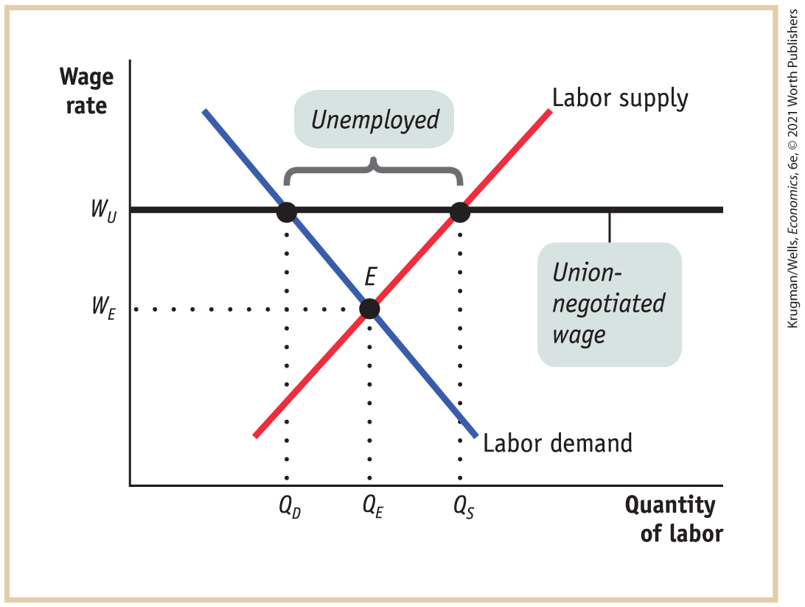
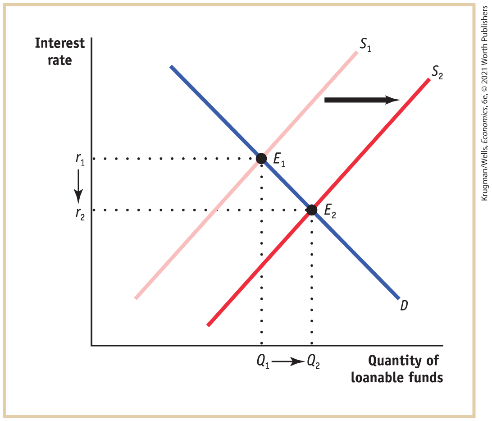
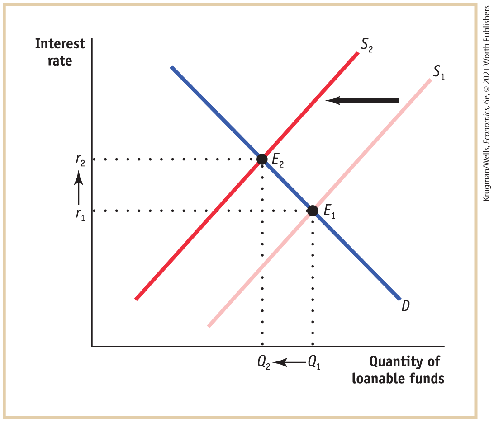

#### 7-2 Check Your Understanding

1.  

    1.  In 2019 nominal GDP was $(1\text{,}000\text{,}000 \times \$ 0.40) +$$(800\text{,}000 \times \$ 0.60) = \$ 400\text{,}000 + \$ 480\text{,}000 = \$ 880\text{,}000$. A 25% rise in the price of french fries from 2019 to 2020 means that the 2020 price of french fries was $1.25 \times \$ 0.40 = \$ 0.50$. A 10% fall in servings sold means that $1\text{,}000\text{,}000 \times 0.9 = 900\text{,}000$ servings were sold in 2020. As a result, the total value of sales of french fries in 2020 was $900\text{,}000 \times \$ 0.50 = \$ 450\text{,}000$. A 15% fall in the price of onion rings from 2019 to 2020 means that the 2020 price of onion rings was $0.85 \times \$ 0.60 = \$ 0.51$. A 5% rise in servings sold means that $800\text{,}000 \times 1.05 = 840\text{,}000$ servings were sold in 2020. As a result, the total value of sales of onion rings in 2020 was $840\text{,}000 \times \$ 0.51 =$$\$ 428\text{,}400$. Nominal GDP in 2020 was $\$ 450\text{,}000 +$$\$ 428\text{,}400 = \$ 878\text{,}400$. To find real GDP in 2020, we must calculate the value of sales in 2020 using 2019 prices: $(900\text{,}000\,\text{french}\,\text{fries} \times \$ 0.40) + (840\text{,}000\,\text{onion}\,\text{rings} \times$$\$ 0.60) = \$ 360\text{,}000 + \$ 504\text{,}000 = \$ 864\text{,}000$.
    2.  The change in nominal GDP from 2019 to 2020 was $((\$ 878\text{,}400 - \$ 880\text{,}000)\text{/}\$ 880\text{,}000) \times 100 = - 0.18\%$, a decline. But a comparison using real GDP shows a decline of $((\$ 864\text{,}000 - \$ 880\text{,}000)\text{/}\$ 880\text{,}000) \times 100 = - 1.8\%$. That is, a calculation based on real GDP shows a drop 10 times larger (1.8%) than a calculation based on nominal GDP (0.18%). In this case, the calculation based on nominal GDP underestimates the true magnitude of the change.

2.  A price index based on 2016 prices will contain a relatively high price of electronics and a relatively low price of housing compared to a price index based on 2020 prices. This means that a 2016 price index used to calculate real GDP in 2018 will magnify the value of electronics production in the economy, but a 2020 price index will magnify the value of housing production in the economy.

#### 7-3 Check Your Understanding

1.  This market basket costs, pre-frost, $(100 \times \$ 0.20) +$$(50 \times \$ 0.60) + (200 \times \$ 0.25) = \$ 20 + \$ 30 + \$ 50 = \$ 100$. The same market basket, post-frost, costs $(100 \times \$ 0.40) +$$(50 \times \$ 1.00) + (200 \times \$ 0.45) = \$ 40 + \$ 50 + \$ 90 = \$ 180$. So the price index is $(\$ 100\text{/}\$ 100) \times 100 = 100$ before the frost and $(\$ 180\text{/}\$ 100) \times 100 = 180$ after the frost, implying a rise in the price index of 80%. This increase in the price index is less than the 84.2% increase calculated in the text. The reason for this difference is that the new market basket of 100 oranges, 50 grapefruit, and 200 lemons contains proportionately more of the items that have experienced relatively lower price increases (the lemons, whose price has increased by 80%) and proportionately fewer of the items that have experienced relatively large price increases (the oranges, whose price has increased by 100%). This shows that the price index can be very sensitive to the composition of the market basket. If the market basket contains a large proportion of goods whose prices have risen faster than the prices of other goods, it will lead to a higher estimate of the increase in the price level. If it contains a large proportion of goods whose prices have risen more slowly than the prices of other goods, it will lead to a lower estimate of the increase in the price level.

2.  

    1.  A market basket determined 10 years ago would contain fewer cars than at present. Given that the average price of a car has grown faster than the average prices of other goods, this basket will underestimate the true increase in the cost of living because it contains relatively too few cars.
    2.  A market basket determined 20 years ago will not contain broadband internet access. So it cannot track the fall in prices of internet access over the past few years. As a result, it will overestimate the true increase in the cost of living.

3.  Using <a href="#kru_9781319245269_ch07_04.xhtml#pau_9781319320164_oo8dxknVKa" id="kru_9781319245269_EM_soul.xhtml#pau_9781319320164_gNlvRUCqG0" class="crossref">Equation 7-3</a>, the inflation rate from 2017 to 2018 is $((252.723 - 247.901)\text{/}247.901) \times 100 = 1.95\%$.

### Chapter eight

#### 8-1 Check Your Understanding

1.  Software improvements developed by employment websites that enable job-seekers to find jobs more quickly will reduce the unemployment rate over time. However, websites that induce discouraged workers to begin actively looking for work again will lead to an increase in the unemployment rate over time.

2.  

    1.  Rosa is not counted as unemployed because she is not actively looking for work, but she is counted in broader measures of labor underutilization as a discouraged worker.
    2.  Anthony is not counted as unemployed; he is considered employed because he has a job.
    3.  Kanako is unemployed; she is not working and is actively looking for work.
    4.  Sergio is not unemployed, but underemployed; he is working part time for economic reasons. He is counted in broader measures of labor underutilization.
    5.  Natasha is not unemployed, but she is a marginally attached worker. She is counted in broader measures of labor underutilization.

3.  Both parts a and b are consistent with the relationship, illustrated in <a href="#kru_9781319245269_ch08_02.xhtml#pau_9781319320164_phVVJWz0cj" id="kru_9781319245269_EM_soul.xhtml#pau_9781319320164_slAy62mrEL" class="crossref">Figure 8-5</a>, between above-average or below-average growth in real GDP and changes in the unemployment rate: during years of above-average growth, the unemployment rate falls, and during years of below-average growth, the unemployment rate rises. However, part c is not consistent: it implies that a recession is associated with a fall in the unemployment rate, which is incorrect.

#### 8-2 Check Your Understanding

1.  

    1.  When the pace of technological advancement quickens, there will be higher rates of job creation and destruction as old industries disappear and new ones emerge. As a result, frictional unemployment will be higher as workers leave jobs in declining industries in search of jobs in expanding industries.
    2.  When the pace of technological advancement quickens, there will be greater mismatch between the skills employees have and the skills employers are looking for, leading to higher structural unemployment.
    3.  When the unemployment rate is low, frictional unemployment will account for a larger share of total unemployment because other sources of unemployment will be diminished. So the share of total unemployment composed of the frictionally unemployed will rise.

2.  A binding minimum wage represents a price floor below which wages cannot fall. As a result, actual wages cannot move toward equilibrium. So a minimum wage causes the quantity of labor supplied to exceed the quantity of labor demanded. Because this surplus of labor reflects unemployed workers, it affects the unemployment rate. Collective bargaining has a similar effect — unions are able to raise the wage above the equilibrium level to a level like *WU* in the accompanying diagram. This will act like a minimum wage by causing the number of job-seekers to be larger than the number of workers firms are willing to hire. Collective bargaining causes the unemployment rate to be higher than it otherwise would be, as shown in the accompanying diagram.

    <figure id="pau_9781319320164_cGGT8m2udv" class="figure lm_img_lightbox unnum c5 center">
    
    </figure>

    <aside class="hidden" id="pau_9781319320164_2QKRzzXlv9" title="hidden">

    The vertical axis, labeled “wage rate” shows the following markings from bottom to top, W subscript E and W subscript U. The horizontal axis, labeled “quantity of labor” shows the following markings from left to right, Q subscript D, Q subscript E and Q subscript S. A positive sloping supply curve labeled labor supply is a line that extends through (Q subscript E, W subscript E) and (Q subscript S, W subscript U). A negative sloping demand curve labeled labor demand is a line that extends through (Q subscript D, W subscript U) and (Q subscript E, W subscript E). The supply curve intersects the demand curve at point E (Q subscript E, W subscript E). A horizontal line labeled union-negotiated wage runs parallel to the horizontal axis, starting from (0, W subscript U) and passing through (Q subscript D, W subscript U) and (Q subscript S, W subscript U). The section of the horizontal line between points (Q subscript D, W subscript U) and (Q subscript S, W subscript U) is labeled unemployed.

    </aside>

3.  An increase in unemployment benefits at the peak of the business cycle reduces the cost to individuals of being unemployed, causing them to spend more time searching for new jobs. So the natural rate of unemployment would increase.

#### 8-3 Check Your Understanding

1.  Shoe-leather costs as a result of inflation will be lower because it is now less costly for individuals to manage their assets in order to economize on their money holdings. This reduction in the costs associated with converting other assets into money translates into lower shoe-leather costs.
2.  If inflation came to an unexpected and complete stop over the next 15 or 20 years, the inflation rate would be zero, which of course is less than the expected inflation rate of 2% to 3%. Because the real interest rate is the nominal interest rate minus the inflation rate, the real interest rate on a loan would be higher than expected, and lenders would gain at the expense of borrowers. Borrowers would have to repay their loans with funds that have a higher real value than had been expected.

<!--
<strong class="important">[KW Macro Ch09/will become Econ24]</strong>
--> <!--
<strong class="important">[Solutions to </strong><i class="semantic-i"><strong class="important">Check Your Understanding</strong></i> <strong class="important">Questions. Chapters run in; show partial pages corresponding to chapters as chapters ship; running heads left and right: SOLUTIONS TO Check Your Understanding PROBLEMS]</strong>
--> <!--
<strong class="important">[Note that Solutions to Check Your Understanding Problems set ragged right and ragged bottom. Columns do not need to align.]</strong>
-->

### Chapter nine

#### 9-1 Check Your Understanding

1.  Economic progress raises the living standards of the average resident of a country. An increase in overall real GDP does not accurately reflect an increase in an average resident’s living standard because it does not account for growth in the number of residents. If, for example, real GDP rises by 10% but population grows by 20%, the living standard of the average resident falls: after the change, the average resident has only $(110\mspace{2mu}/\mspace{2mu} 120) \times 100 = 91.6\%$ as much real income as before the change. Similarly, an increase in nominal GDP per capita does not accurately reflect an increase in living standards because it does not account for any change in prices. For example, a 5% increase in nominal GDP per capita generated by a 5% increase in prices implies that there has been no change in living standards. Real GDP per capita is the only measure that accounts for both changes in the population and changes in prices.
2.  Using the Rule of 70, the number of years it will take for China to double its real GDP per capita is $(70\mspace{2mu}/\mspace{2mu} 7.8) = 8.97,$ or approximately 9 years; India, $(70\mspace{2mu}/\mspace{2mu} 4.1) = 17.07$, or approximately 17 years; Ireland, $(70\mspace{2mu}/\mspace{2mu} 3.7) = 18.92$, or approximately 19 years; Bangladesh, $(70\mspace{2mu}/\mspace{2mu} 3) = 23.33$, or approximately 23 years; the United States, $(70\mspace{2mu}/\mspace{2mu} 1.6) = 43.75,$ or approximately 44 years; France, $(70\mspace{2mu}/\mspace{2mu} 1.3) = 53.85$, or approximately 54 years; and Argentina $(70\mspace{2mu}/\mspace{2mu} 0.5) = 140$ years. Since the Rule of 70 can only be applied to a positive growth rate, we cannot apply it to the case of Venezuela, which experienced negative growth. If India continues to have a higher growth rate of real GDP per capita than the United States, then India’s real GDP per capita will eventually surpass that of the United States.
3.  The United States began growing rapidly over a century ago, but China and India have begun growing rapidly only recently. As a result, the living standard of the typical Chinese or Indian household has not yet caught up with that of the typical American household.

#### 9-2 Check Your Understanding

1.  

    1.  Significant technological progress will result in a positive growth rate of productivity even though physical capital per worker and human capital per worker are unchanged.
    2.  The growth rate of productivity will fall but remain positive due to diminishing returns to physical capital.

2.  

    1.  If output has grown 3% per year and the labor force has grown 1% per year, then productivity — output per person — has grown at approximately $3\% - 1\% = 2\%$ per year.
    2.  If physical capital has grown 4% per year and the labor force has grown 1% per year, then physical capital per worker has grown at approximately $4\% - 1\% = 3\%$ per year.
    3.  According to estimates, each 1% rise in physical capital, other things equal, increases productivity by 0.3%. So, as physical capital per worker has increased by 3%, productivity growth that can be attributed to an increase in physical capital per worker is $0.3 \times 3\% = 0.9\%$. As a percentage of total productivity growth, this is $0.9\%\mspace{2mu}/\mspace{2mu} 2\% \times 100\% = 45\%$.
    4.  If the rest of productivity growth is due to technological progress, then technological progress has contributed $2\% - 0.9\% = 1.1\%$ to productivity growth. As a percentage of total productivity growth, this is $1.1\%\text{/}2\% \times 100\% = 55\%$.

3.  It will take a period of time for workers to learn how to use the new computer system and to adjust their routines. And because there are often setbacks in learning a new system, such as accidentally erasing your computer files, productivity at Multinomics, Inc. may decrease for a period of time.

#### 9-3 Check Your Understanding

1.  A country that has high domestic savings is able to achieve a high rate of investment spending as a percent of GDP. This, in turn, allows the country to achieve a high growth rate.
2.  It is likely that the United States will experience a greater pace of innovation and development of new drugs because closer links between private companies and academic research centers will lead to research and development more directly focused on producing new drugs rather than on pure research.
3.  It is likely that these events resulted in a fall in the country’s growth rate because the lack of property rights would have dissuaded people from making investments in a productive capacity.

#### 9-4 Check Your Understanding

1.  The conditional version of the convergence hypothesis says that countries grow faster, other things equal, when they start from relatively low GDP per capita. From this we can infer that they grow more slowly, other things equal, when their real GDP per capita is relatively higher. This points to lower future Asian growth. However, other things might not be equal: if Asian economies continue investing in human capital, if savings rates continue to be high, if governments invest in infrastructure, and so on, growth might continue at an accelerated pace.
2.  The regions of East Asia, Western Europe, and the United States support the convergence hypothesis because a comparison among them shows that the growth rate of real GDP per capita falls as real GDP per capita rises. Eastern Europe, West Asia, Latin America, and Africa do not support the hypothesis because they all have much lower real GDP per capita than the United States but have either approximately the same growth rate (West Asia and Eastern Europe) or a lower growth rate (Africa and Latin America).
3.  The evidence suggests that both sets of factors matter: better infrastructure is important for growth, but so is political and financial stability. Policies should try to address both areas.

#### 9-5 Check Your Understanding

1.  Economists are typically more concerned about environmental degradation than resource scarcity. The reason is that in modern economies the price response tends to alleviate the limits imposed by resource scarcity through conservation and the development of alternatives. However, because environmental degradation involves a cost imposed by individuals or firms on others without the requirement to pay compensation (known as a *negative externality*), effective government intervention is required to address it. As a result, economists are more concerned about the limits to growth imposed by environmental degradation because a market response would be inadequate.
2.  Growth increases a country’s greenhouse gas emissions. The current best estimates are that a large reduction in emissions will result in only a modest reduction in growth. The international burden sharing of greenhouse gas emissions reduction is contentious because rich countries are reluctant to pay the costs of reducing their emissions only to see newly emerging countries like China rapidly increase their emissions. Yet most of the current accumulation of gases is due to the past actions of rich countries. Poorer countries like China are equally reluctant to sacrifice their growth to pay for the past actions of rich countries.

### Chapter ten

<!--
<strong class="important">[KW Macro Csh10/will become Econ25]</strong>
--> <!--
<strong class="important">[Solutions to </strong><i class="semantic-i"><strong class="important">Check Your Understanding</strong></i> <strong class="important">Questions. Chapters run in; show partial pages corresponding to chapters as chapters ship; running heads left and right: SOLUTIONS TO Check Your Understanding PROBLEMS]</strong>
--> <!--
<strong class="important">[Note that Solutions to Check Your Understanding Problems set ragged right and ragged bottom. Columns do not need to align.]</strong>
-->

#### 10-1 Check Your Understanding

1.  

    1.  As there is a net capital inflow into the economy, the supply of loanable funds increases. This is illustrated by the shift of the supply curve from $S_{1}$ to $S_{2}$ in the accompanying diagram. As the equilibrium moves from $E_{1}$ to $E_{2}$, the equilibrium interest rate falls from $r_{1}$ to $r_{2}$, and the equilibrium quantity of loanable funds increases from $Q_{1}$ to $Q_{2}$. <!--
<strong class="important">[Insert CYUS 10-1 1a]</strong>
-->

        <figure id="pau_9781319320164_F0jYvumLF3" class="figure lm_img_lightbox unnum c5 center">
        
        </figure>

        <aside class="hidden" id="pau_9781319320164_fS9DAzZV8N" title="hidden">

        The horizontal axis, labeled “Quantity of loanable funds” shows the following markings from left to right, Q subscript 1 and Q subscript 2. The vertical axis, labeled “Interest rate” shows the following markings from bottom to top, r subscript 2 and r subscript 1. The supply curves are positive sloping parallel lines, and the demand curve is a negative sloping line. Supply curve S subscript 2 is parallel and to the right of supply curve S subscript 1. A horizontal right arrow between the supply lines indicates the shift from S subscript 1 to S subscript 2. Demand curve D intersects supply curve S subscript 1 at a point E subscript 1, where Quantity is Q subscript 1, and rate is r subscript 1. Demand curve D intersects supply curve S subscript 2 at a point E subscript 2, where Quantity is Q subscript 2, and rate is r subscript 2. Point E subscript 2 is to the right of point E subscript 1. The fall in rate and rise in quantity between points E subscript 1 and E subscript 2 are indicated by arrows.

        </aside>

    2.  Savings fall due to the higher proportion of retired people, and the supply of loanable funds decreases. This is illustrated by the leftward shift of the supply curve from $S_{1}$ to $S_{2}$ in the accompanying diagram. The equilibrium moves from $E_{1}$ to $E_{2}$, the equilibrium interest rate rises from $r_{1}$ to $r_{2}$, and the equilibrium quantity of loanable funds falls from $Q_{1}$ to $Q_{2}$. <!--
<strong class="important">[Insert CYUS 10-1 1b]</strong>
-->

        <figure id="pau_9781319320164_M3pAvWHJ0Y" class="figure lm_img_lightbox unnum c5 center">
        
        </figure>

        <aside class="hidden" id="pau_9781319320164_V3NwUqbxsd" title="hidden">

        The horizontal axis, labeled “Quantity of loanable funds” shows the following markings from left to right, Q subscript 2 and Q subscript 1. The vertical axis, labeled “Interest rate” shows the following markings from bottom to top, r subscript 1 and r subscript 2. The supply curves are positive sloping parallel lines, and the demand curve is a negative sloping line. Supply curve S subscript 1 is parallel and to the right of supply curve S subscript 2. A horizontal left arrow between the supply lines indicates the shift from S subscript 1 to S subscript 2. Demand curve D intersects supply curve S subscript 1 at a point E subscript 1, where Quantity is Q subscript 1, and rate is r subscript 1. Demand curve D intersects supply curve S subscript 2 at a point E subscript 2, where Quantity is Q subscript 2, and rate is r subscript 2. Point E subscript 2 is to the left of point E subscript 1. The rise in rate and fall in quantity between points E subscript 1 and E subscript 2 are indicated by arrows.

        </aside>

2.  We know from the loanable funds market that as the interest rate rises, households want to save more and consume less. But at the same time, an increase in the interest rate lowers the number of investment spending projects with returns at least as high as the interest rate. The statement “households will want to save more money than businesses will want to invest” cannot represent an equilibrium in the loanable funds market because it says that the quantity of loanable funds offered exceeds the quantity of loanable funds demanded. If that were to occur, the interest rate must fall to make the quantity of loanable funds offered equal to the quantity of loanable funds demanded.

3.  

    1.  The real interest rate will not change. According to the Fisher effect, an increase in expected inflation drives up the nominal interest rate, leaving the real interest rate unchanged.
    2.  The nominal interest rate will rise by 3%. Each additional percentage point of expected inflation drives up the nominal interest rate by 1 percentage point.
    3.  As we saw in <a href="#kru_9781319245269_ch10_02.xhtml#pau_9781319320164_P72TPZZINi" id="kru_9781319245269_EM_soul.xhtml#pau_9781319320164_3MnCyGpRc3" class="crossref">Figure 10-9</a>, as long as inflation is expected, it does not affect the equilibrium quantity of loanable funds. Both the supply and demand curves for loanable funds are pushed upward, leaving the equilibrium quantity of loanable funds unchanged.

#### 10-2 Check Your Understanding

1.  The transaction costs for (a) a bank deposit and (b) a share of a mutual fund are approximately equal because each can typically be accomplished by making a phone call, going online, or visiting a branch office. Transaction costs are highest for (c) a share of a family business, since finding a buyer for the share consumes time and resources. The level of risk is lowest for (a) a bank deposit, since these deposits are insured by the Federal Deposit Insurance Corporation (FDIC) up to \$250,000; somewhat higher for (b) a share of a mutual fund, since despite diversification, there is still risk associated with holding mutual funds; and highest for (c) a share of a family business, since this investment is not diversified. The level of liquidity is highest for (a) a bank deposit, since withdrawals can usually be made immediately; somewhat lower for (b) a share of a mutual fund, since it may take a few days between selling your shares and the payment being processed; and lowest for (c) a share of a family business, since it can only be sold with the unanimous agreement of other members and it will take some time to find a buyer.
2.  Economic development and growth are the result of, among other factors, investment spending on physical capital. Since investment spending is equal to savings, the greater the amount saved, the higher investment spending will be, and so the higher growth and economic development will be. So the existence of institutions that facilitate savings will help a country’s growth and economic development. As a result, a country with a financial system that provides low transaction costs, opportunities for diversification of risk, and high liquidity to its savers will experience faster growth and economic development than a country that doesn’t.

#### 10-3 Check Your Understanding

1.  

    1.  Today’s stock prices reflect the market’s expectation of future stock prices, and according to the efficient markets hypothesis, stock prices always take account of all available information. The fact that this year’s profits are low is not new information, so it is already built into the share price. However, when it becomes known that the company’s profits will be high next year, the price of a share of its stock will rise today, reflecting this new information.
    2.  The expectations of investors about high profits were already built into the stock price. Since profits will be lower than expected, the market’s expectations about the company’s future stock price will be revised downward. This new information will lower the stock price.
    3.  When other companies in the same industry announce that sales are unexpectedly slow this year, investors are likely to conclude that sales will also be unexpectedly slow for this company. As a result, investors will revise their expectations of future profits and of the future stock price downward. This new information will result in a lower stock price today.
    4.  This announcement will either have no effect on the company’s stock price or will increase it only slightly. It does not add any new information, beyond removing some uncertainty about whether the profit forecast was correct. It should therefore result in either no increase or only a small increase in the stock price.

2.  The efficient markets hypothesis states that all available information is immediately taken into account in stock prices. So if investors consistently bought stocks the day after the Dow rose by 1%, a smart investor would *sell* on that day because demand — and so stock prices — would be high. If a profit can be made that way, eventually many investors would be selling, and it would no longer be true that investors always bought stocks the day after the Dow rose by 1%.

### Chapter eleven

<!--
<strong class="important">[KW Macro Ch11/will become Econ 26]</strong>
--> <!--
<strong class="important">[Solutions to </strong><i class="semantic-i"><strong class="important">Check Your Understanding</strong></i><strong class="important"> Questions. Chapters run in; show partial pages corresponding to chapters as chapters ship; running heads left and right: SOLUTIONS TO Check Your Understanding PROBLEMS]</strong>
--> <!--
<strong class="important">[Note that Solutions to Check Your Understanding Problems set ragged right and ragged bottom. Columns do not need to align.]</strong>
-->

#### 11-1 Check Your Understanding

1.  A decline in investment spending, like a rise in investment spending, has a multiplier effect on real GDP — the only difference in this case is that real GDP falls instead of rises. The fall in *I* leads to an initial fall in real GDP, which leads to a fall in disposable income, which leads to lower consumer spending, which leads to another fall in real GDP, and so on. So consumer spending falls as an indirect result of the fall in investment spending.
2.  When *MPC* is 0.5, the multiplier is equal to <!--&#x003C;&amp;lt;-->$1\text{/}(1 - 0.5) = 1\text{/}0.5 = 2$<!---->--\>. When *MPC* is 0.8, the multiplier is equal to <!--&#x003C;&amp;lt;-->$1\text{/}(1 - 0.8) = 1\text{/}0.2 = 5$<!---->--\>.
3.  The greater the share of GDP that is saved rather than spent, the lower the *MPC.* Disposable income that goes to savings is like a “leak” in the system, reducing the amount of spending that fuels a further expansion. So it is likely that Amerigo will have the larger multiplier.

#### 11-2 Check Your Understanding

1.  

    1.  Angelina’s autonomous consumer spending is \$8,000. When her current disposable income rises by \$10,000, her consumer spending rises by <!--&#x003C;&amp;lt;-->$\$ 12\text{,}000 - \$ 8\text{,}000 = \$ 4\text{,}000$ <!---->--\>. So her *MPC* is <!--&#x003C;&amp;lt;-->$\$ 4\text{,}000\text{/}\$ 10\text{,}000 = 0.4$ <!---->--\> and her consumption function is <!--&#x003C;&amp;lt;-->$c = \$ 8\text{,}000 + 0.4 \times yd$ <!---->--\>. Felicia’s autonomous consumer spending is \$6,500. When her current disposable income rises by \$10,000, her consumer spending rises by <!--&#x003C;&amp;lt;-->$\$ 14\text{,}500 - \$ 6\text{,}500 = \$ 8\text{,}000$ <!---->--\>. So her *MPC* is <!--&#x003C;&amp;lt;-->$\$ 8\text{,}000\text{/}\$ 10\text{,}000 = 0.8$ <!---->--\> and her consumption function is <!--&#x003C;&amp;lt;-->$c = \$ 6\text{,}500 + 0.8 \times yd$ <!---->--\>. Marina’s autonomous consumer spending is \$7,250. When her current disposable income rises by \$10,000, her consumer spending rises by <!--&#x003C;&amp;lt;-->$\$ 14\text{,}250 - \$ 7\text{,}250 = \$ 7\text{,}000$ <!---->--\>. So her *MPC* is <!--&#x003C;&amp;lt;-->$\$ 7\text{,}000\text{/}\$ 10\text{,}000 = 0.7$ <!---->--\> and her consumption function is <!--&#x003C;&amp;lt;-->$c = \$ 7\text{,}250 + 0.7 \times yd$ <!---->--\>.
    2.  The aggregate autonomous consumer spending in this economy is <!--&#x003C;&amp;lt;-->$\$ 8\text{,}000 + \$ 6\text{,}500 + \$ 7\text{,}250 = \$ 21\text{,}750$ <!---->--\>. A \$30,000 increase in disposable income <!--&#x003C;&amp;lt;-->$(3 \times \$ 10\text{,}000)$ <!---->--\> leads to a <!--&#x003C;&amp;lt;-->$\$ 4\text{,}000 + \$ 8\text{,}000 + \$ 7\text{,}000 = \$ 19\text{,}000$ <!---->--\> increase in consumer spending. So the economy-wide *MPC* is <!--&#x003C;&amp;lt;-->$\$ 19\text{,}000\text{/}\$ 30\text{,}000 = 0.63$ <!---->--\> and the aggregate consumption function is <!--&#x003C;&amp;lt;-->$C = \$ 21\text{,}750 + 0.63 \times YD$ <!---->--\>.

2.  If you expect your future disposable income to fall, you would like to save some of today’s disposable income to tide you over in the future. But you cannot do this if you cannot save. If you expect your future disposable income to rise, you would like to spend some of tomorrow’s higher income today. But you cannot do this if you cannot borrow. If you cannot save or borrow, your expected future disposable income will have no effect on your consumer spending today. In fact, your *MPC* must always equal 1: you must consume all your current disposable income today, and you will be unable to smooth your consumption over time.

#### 11-3 Check Your Understanding

1.  

    1.  An unexpected increase in consumer spending will result in a reduction in inventories as producers sell items from their inventories to satisfy this short-term increase in demand. This is negative unplanned inventory investment: it reduces the value of producers’ inventories.
    2.  A rise in the cost of borrowing is equivalent to a rise in the interest rate: fewer investment spending projects are now profitable to producers, whether they are financed through borrowing or retained earnings. As a result, producers will reduce the amount of planned investment spending.
    3.  A sharp increase in the rate of real GDP growth leads to a higher level of planned investment spending by producers, according to the accelerator principle, as they increase production capacity to meet higher demand.
    4.  As sales fall, producers sell less, and their inventories grow. This leads to positive unplanned inventory investment.

2.  Since the marginal propensity to consume is less than 1 — because consumers normally spend part but not all of an additional dollar of disposable income — consumer spending does not fully respond to fluctuations in current disposable income. This behavior diminishes the effect of fluctuations in the economy on consumer spending. In contrast, by the accelerator principle, investment spending is directly related to the expected future growth rate of GDP. As a result, investment spending will magnify fluctuations in the economy: a higher expected future growth rate of real GDP leads to higher planned investment spending; a lower expected future growth rate of real GDP leads to lower planned investment spending.

3.  When consumer spending is sluggish, firms with excess production capacity will cut back on planned investment spending because they think their existing capacities are sufficient for expected future sales. Similarly, when consumer spending is sluggish and firms have a large amount of unplanned inventory investment, they are likely to cut back their production of output because they think their existing inventories are sufficient for expected future sales. So an inventory overhang is likely to depress current economic activity as firms cut back on their planned investment spending and on their output.
