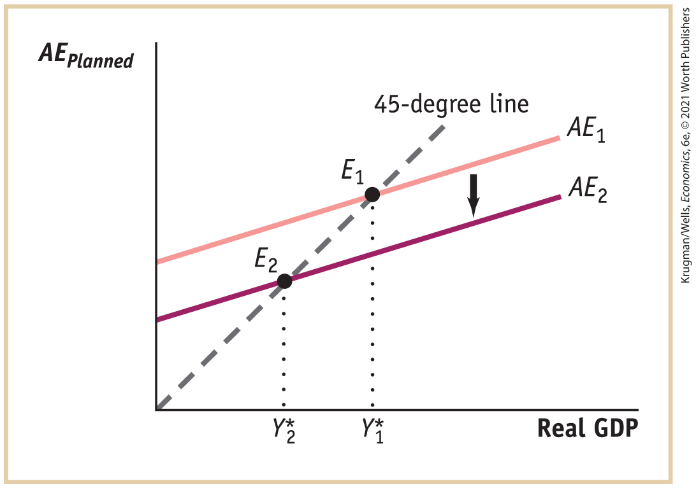
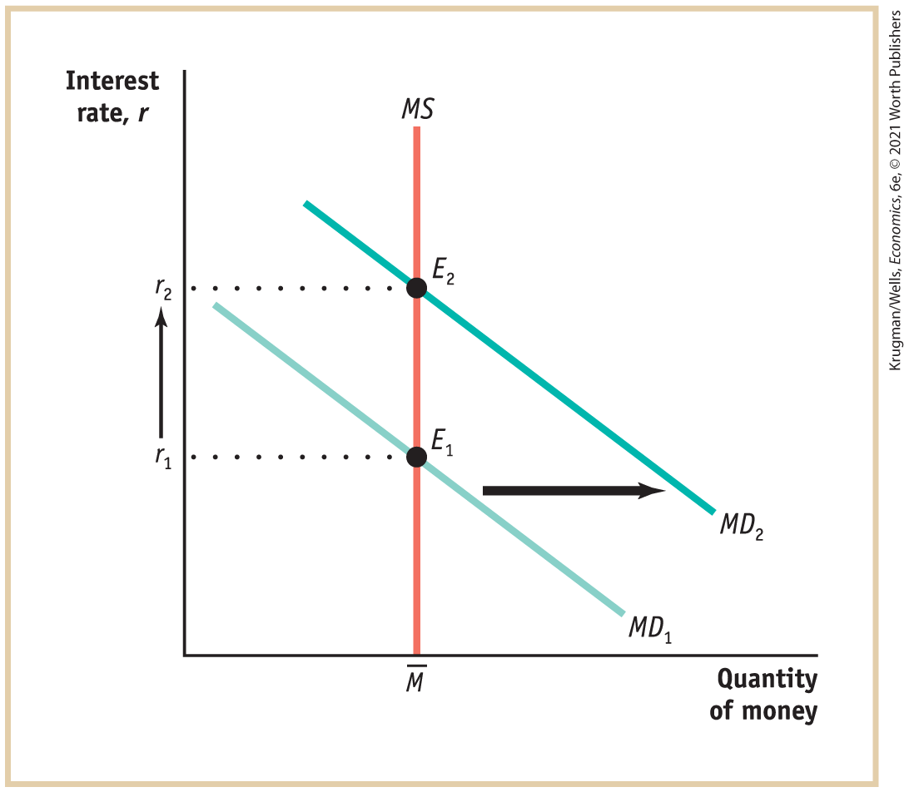
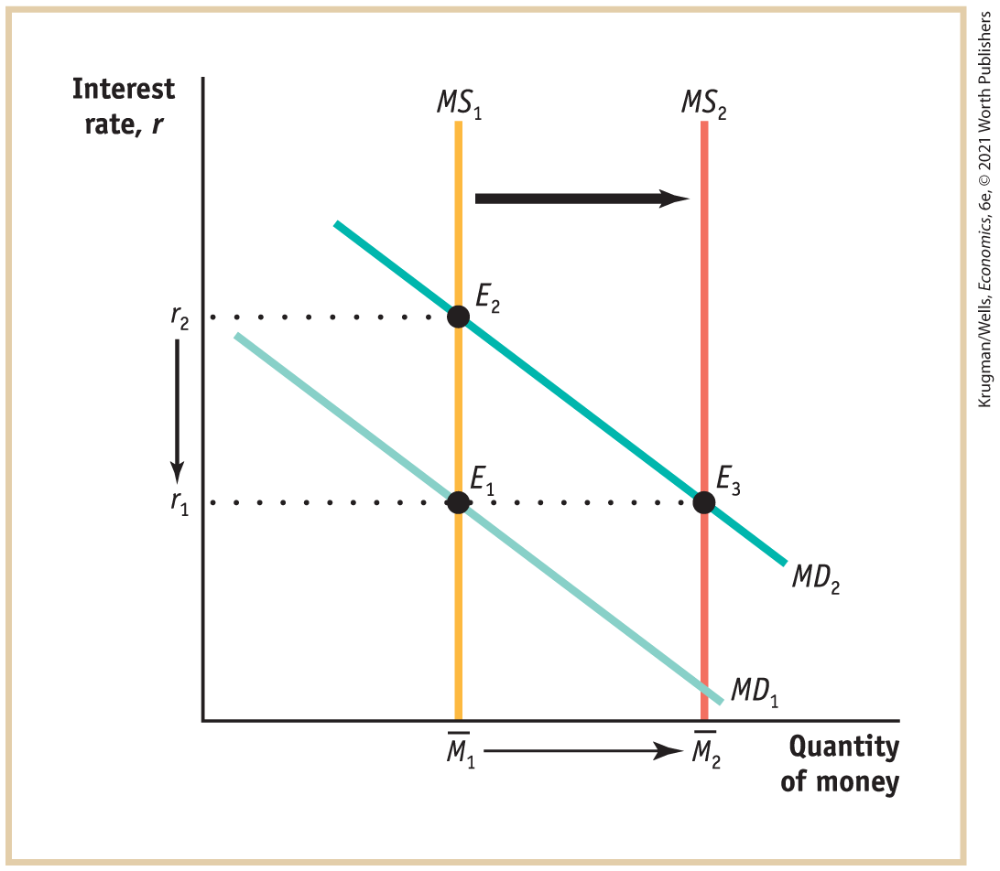

#### 11-4 Check Your Understanding

1.  A slump in planned investment spending will lead to a fall in real GDP in response to an unanticipated increase in inventories. The fall in real GDP will translate into a fall in households’ disposable income, and households will respond by reducing consumer spending. The decrease in consumer spending leads producers to further decrease output, further lowering disposable income and leading to further reductions in consumer spending. So although the slump originated in investment spending, it will cause a reduction in consumer spending.

2.  

    1.  After an autonomous fall in planned aggregate spending, the economy is no longer in equilibrium: real GDP is greater than planned aggregate spending. The accompanying figure shows this autonomous fall in planned aggregate spending by the shift of the aggregate spending curve from <!--&#x003C;&amp;lt;-->$AE_{1}$ <!---->--\> to <!--&#x003C;&amp;lt;-->$AE_{2}$ <!---->--\>. The difference between the two results in positive unplanned inventory investment: there is an unanticipated increase in inventories. Firms will respond by reducing production. This will eventually move the economy to a new equilibrium. In the accompanying figure, this is illustrated by the movement from the initial income–expenditure equilibrium at <!--&#x003C;&amp;lt;-->$E_{1}$ <!---->--\> to the new income–expenditure equilibrium at <!--&#x003C;&amp;lt;-->$E_{2}$ <!---->--\>. As the economy moves to its new equilibrium, real GDP falls from its initial income–expenditure equilibrium level at <!--&#x003C;&amp;lt;-->$Y\text{*}_{1}$ <!---->--\> to its new lower level, <!--&#x003C;&amp;lt;-->$Y\text{*}_{2}$ <!---->--\>. <!--
[Insert MACRO CYUS 11-4 2b]
-->

        <figure id="pau_9781319320164_fQi849DmrM" class="figure lm_img_lightbox unnum c5 center">
        
        </figure>

        <aside class="hidden" id="pau_9781319320164_VIsf8CONuj" title="hidden">

        The horizontal axis, labeled “Real G D P” shows the following markings from left to right, Y asterisk subscript 2 and Y asterisk subscript 1. The vertical axis is labeled “A E subscript planned.” A positive sloping 45-degree dashed line extends from the origin. The aggregate expenditure curves are positive sloping parallel lines from the positive vertical axis, with lesser steepness than the 45-degree line. Aggregate expenditure curve A E subscript 1 is parallel and above aggregate expenditure curve A E subscript 2. A vertical down arrow between the aggregate expenditure lines indicates the shift from A E subscript 1 to A E subscript 2. Aggregate expenditure curve A E subscript 1 intersects the 45-degree line at a point E subscript 1, where real G D P is Y asterisk subscript 1. Aggregate expenditure curve A E subscript 2 intersects the 45-degree line at a point E subscript 2, where real G D P is Y asterisk subscript 2.

        </aside>

    2.  We know that the change in income–expenditure equilibrium GDP is given by <a href="#kru_9781319245269_ch11_05.xhtml#pau_9781319320164_6qxcHiwzjc" id="kru_9781319245269_EM_soul.xhtml#pau_9781319320164_WMNOX7XCA2" class="crossref">Equation 11-17</a>: <!--&#x003C;&amp;lt;-->$\text{Δ}Y* = \text{Multiplier} \times \text{Δ}AAE_{Planned}$ <!---->--\>. Here, the multiplier is equal to <!--&#x003C;&amp;lt;-->$1\text{/}(1 - 0.5) = 1\text{/}0.5 = 2$ <!---->--\>. So a \$300 million autonomous reduction in planned aggregate spending will lead to a <!--&#x003C;&amp;lt;-->$2 \times \$ 300\,\text{million} = \$ 600\,\text{million}\,(\$ 0.6\,\text{billion})$ <!---->--\> fall in income–expenditure equilibrium GDP. The new <!--&#x003C;&amp;lt;-->$Y\text{*}$ <!---->--\> will be <!--&#x003C;&amp;lt;-->$\$ 500\,\text{billion} - \$ 0.6\,\text{billion} = \$ 499.4\,\text{billion}$ <!---->--\>.

### Chapter twelve

<!--
<strong class="important">[KW Macro Ch12/will become Econ 27]</strong>
--> <!--
<strong class="important">[Solutions to </strong><i class="semantic-i"><strong class="important">Check Your Understanding</strong></i><strong class="important"> Questions. Chapters run in; show partial pages corresponding to chapters as chapters ship; running heads left and right: SOLUTIONS TO Check Your Understanding PROBLEMS]</strong>
--> <!--
<strong class="important">[Note that Solutions to Check Your Understanding Problems set ragged right and ragged bottom. Columns do not need to align.]</strong>
-->

#### 12-1 Check Your Understanding

1.  

    1.  This is a shift of the aggregate demand curve. A decrease in the quantity of money raises the interest rate, since people now want to borrow more and lend less. A higher interest rate reduces investment and consumer spending at any given aggregate price level. So the aggregate demand curve shifts to the left.
    2.  This is a movement up along the aggregate demand curve. As the aggregate price level rises, the real value of money holdings falls. This is the interest rate effect of a change in the aggregate price level: as the value of money falls, people want to hold more money. They do so by borrowing more and lending less. This leads to a rise in the interest rate and a reduction in consumer and investment spending. So it is a movement along the aggregate demand curve.
    3.  This is a shift of the aggregate demand curve. Expectations of a poor job market, and so lower average disposable incomes, will reduce people’s consumer spending today at any given aggregate price level. So the aggregate demand curve shifts to the left.
    4.  This is a shift of the aggregate demand curve. A fall in tax rates raises people’s disposable income. At any given aggregate price level, consumer spending is now higher. So the aggregate demand curve shifts to the right.
    5.  This is a movement down along the aggregate demand curve. As the aggregate price level falls, the real value of assets rises. This is the wealth effect of a change in the aggregate price level: as the value of assets rises, people will increase their consumption plans. This leads to higher consumer spending. So it is a movement along the aggregate demand curve.
    6.  This is a shift of the aggregate demand curve. A rise in the real value of assets in the economy due to a surge in real estate values raises consumer spending at any given aggregate price level. So the aggregate demand curve shifts to the right.

#### 12-2 Check Your Understanding

1.  

    1.  This represents a movement along the *SRAS* curve because the CPI — like the GDP deflator — is a measure of the aggregate price level, the overall price level of final goods and services in the economy.
    2.  This represents a shift of the *SRAS* curve because oil is a commodity. The *SRAS* curve will shift to the right because production costs are now lower, leading to a higher quantity of aggregate output supplied at any given aggregate price level.
    3.  This represents a shift of the *SRAS* curve because it involves a change in nominal wages. An increase in legally mandated benefits to workers is equivalent to an increase in nominal wages. As a result, the *SRAS* curve will shift leftward because production costs are now higher, leading to a lower quantity of aggregate output supplied at any given aggregate price level.

2.  You would need to know what happened to the aggregate price level. If the increase in the quantity of aggregate output supplied was due to a movement along the *SRAS* curve, the aggregate price level would have increased at the same time as the quantity of aggregate output supplied increased. If the increase in the quantity of aggregate output supplied was due to a rightward shift of the *LRAS* curve, the aggregate price level might not rise. Alternatively, you could make the determination by observing what happened to aggregate output in the long run. If it fell back to its initial level in the long run, then the temporary increase in aggregate output was due to a movement along the *SRAS* curve. If it stayed at the higher level in the long run, the increase in aggregate output was due to a rightward shift of the *LRAS* curve.

#### 12-3 Check Your Understanding

1.  

    1.  An increase in the minimum wage raises the nominal wage and, as a result, shifts the short-run aggregate supply curve to the left. As a result of this negative supply shock, the aggregate price level rises and aggregate output falls.
    2.  Increased investment spending shifts the aggregate demand curve to the right. As a result of this positive demand shock, both the aggregate price level and aggregate output rise.
    3.  An increase in taxes and a reduction in government spending both result in negative demand shocks, shifting the aggregate demand curve to the left. As a result, both the aggregate price level and aggregate output fall.
    4.  This is a negative supply shock, shifting the short-run aggregate supply curve to the left. As a result, the aggregate price level rises and aggregate output falls.

2.  As the rise in productivity increases potential output, the long-run aggregate supply curve shifts to the right. If, in the short run, there is now a recessionary gap (aggregate output is less than potential output), nominal wages will fall, shifting the short-run aggregate supply curve to the right. This results in a fall in the aggregate price level and a rise in aggregate output. As prices fall, we move along the aggregate demand curve due to the wealth and interest rate effects of a change in the aggregate price level. Eventually, as long-run macroeconomic equilibrium is reestablished, aggregate output will rise to be equal to potential output.

#### 12-4 Check Your Understanding

1.  

    1.  An economy is overstimulated when an inflationary gap is present. This will arise if an expansionary monetary or fiscal policy is implemented when the economy is currently in long-run macroeconomic equilibrium. This shifts the aggregate demand curve to the right, in the short run raising the aggregate price level and aggregate output and creating an inflationary gap. Eventually nominal wages will rise and shift the short-run aggregate supply curve to the left, and aggregate output will fall back to potential output. This is the scenario envisaged by the speaker.
    2.  No, this is not a valid argument. When the economy is not currently in long-run macroeconomic equilibrium, an expansionary monetary or fiscal policy does not lead to the outcome described above. Suppose a negative demand shock has shifted the aggregate demand curve to the left, resulting in a recessionary gap. An expansionary monetary or fiscal policy can shift the aggregate demand curve back to its original position in long-run macroeconomic equilibrium. In this way, the short-run fall in aggregate output and deflation caused by the original negative demand shock can be avoided. So, if used in response to demand shocks, fiscal or monetary policy is an effective policy tool.

2.  Those within the Fed who advocated lowering interest rates were focused on boosting aggregate demand in order to counteract the negative demand shock caused by the collapse of the housing bubble. Lowering interest rates will result in a rightward shift of the aggregate demand curve, increasing aggregate output but raising the aggregate price level. Those within the Fed who advocated holding interest rates steady were focused on the fact that fighting the slump in aggregate demand in the face of a negative supply shock could result in a rise in inflation. Holding interest rates steady relies on the ability of the economy to self-correct in the long run, with the aggregate price level and aggregate output only gradually returning to their levels before the negative supply shock.

### Chapter thirteen

<!--
<strong class="important">[KW Macro Ch13/will become Econ 28]</strong>
--> <!--
<strong class="important">[Solutions to </strong><i class="semantic-i"><strong class="important">Check Your Understanding</strong></i><strong class="important"> Questions. Chapters run in; show partial pages corresponding to chapters as chapters ship; running heads left and right: SOLUTIONS TO Check Your Understanding PROBLEMS]</strong>
--> <!--
<strong class="important">[Note that Solutions to Check Your Understanding Problems set ragged right and ragged bottom. Columns do not need to align.]</strong>
-->

#### 13-1 Check Your Understanding

1.  

    1.  This is contractionary fiscal policy because it is a reduction in government purchases of goods and services.
    2.  This is expansionary fiscal policy because it is an increase in government transfers that will increase disposable income.
    3.  This is contractionary fiscal policy because it is an increase in taxes that will reduce disposable income.

2.  Federal disaster relief that is quickly disbursed is more effective than legislated aid because there is very little time lag between the time of the disaster and the time it is received by victims. So it will stabilize the economy after a disaster. In contrast, legislated aid is likely to entail a time lag in its disbursement, potentially destabilizing the economy.

3.  This statement implies that expansionary fiscal policy will result in crowding out of the private sector, and that the opposite, contractionary fiscal policy, will lead the private sector to grow. Whether this statement is true or not depends upon whether the economy is at full employment; it is only then that we should expect expansionary fiscal policy to lead to crowding out. If, instead, the economy has a recessionary gap, then we should expect instead that the private sector grows along with the fiscal expansion, and contracts along with a fiscal contraction.

#### 13-2 Check Your Understanding

1.  A \$500 million increase in government purchases of goods and services directly increases aggregate spending by \$500 million, which then starts the multiplier in motion. It will increase real GDP by <!--&#x003C;&amp;lt;-->$\$ 500\,\text{million} \times 1\text{/(}1 - MPC\text{)}$ <!---->--\>. A \$500 million increase in government transfers increases aggregate spending only to the extent that it leads to an increase in consumer spending. Consumer spending rises by <!--&#x003C;&amp;lt;-->$MPC \times \$ 1$ <!---->--\> for every \$1 increase in disposable income, where *MPC* is less than 1. So a \$500 million increase in government transfers will cause a rise in real GDP only *MPC* times as much as a \$500 million increase in government purchases of goods and services. It will increase real GDP by <!--&#x003C;&amp;lt;-->$\$ 500\,\text{million} \times MPC\text{/(}1 - MPC\text{)}$ <!---->--\>.
2.  This is the same issue as in Problem 1, but in reverse. If government purchases of goods and services fall by \$500 million, the initial fall in aggregate spending is \$500 million. If there is a \$500 million reduction in government transfers, the initial fall in aggregate spending is <!--&#x003C;&amp;lt;-->$MPC \times \$ 500\,\text{million}$ <!---->--\>, which is less than \$500 million.
3.  Boldovia will experience greater variation in its real GDP than Moldovia because Moldovia has automatic stabilizers while Boldovia does not. In Moldovia the effects of slumps will be lessened by unemployment insurance benefits that will support residents’ incomes, while the effects of booms will be diminished because tax revenues will go up. In contrast, incomes will not be supported in Boldovia during slumps because there is no unemployment insurance. In addition, because Boldovia has lump-sum taxes, its booms will not be diminished by increases in tax revenue.

#### 13-3 Check Your Understanding

1.  The actual budget balance takes into account the effects of the business cycle on the budget deficit. During recessionary gaps, it incorporates the effect of lower tax revenues and higher transfers on the budget balance; during inflationary gaps, it incorporates the effect of higher tax revenues and reduced transfers. In contrast, the cyclically adjusted budget balance factors out the effects of the business cycle and assumes that real GDP is at potential output. Since, in the long run, real GDP tends to potential output, the cyclically adjusted budget balance is a better measure of the long-run sustainability of government policies.
2.  In recessions, real GDP falls. This implies that consumers’ incomes, consumer spending, and producers’ profits also fall. So in recessions, states’ tax revenue (which depends in large part on consumers’ incomes, consumer spending, and producers’ profits) falls. In order to balance the state budget, states have to cut spending or raise taxes. But that deepens the recession. Without a balanced-budget requirement, states could use expansionary fiscal policy during a recession to lessen the fall in real GDP.

#### 13-4 Check Your Understanding

1.  

    1.  A higher growth rate of real GDP implies that tax revenue will increase. If government spending remains constant and the government runs a budget surplus, the size of the public debt will be less than it would otherwise have been.
    2.  If retirees live longer, the average age of the population increases. As a result, the implicit liabilities of the government increase because spending on programs for older Americans, such as Social Security and Medicare, will rise.
    3.  A decrease in tax revenue without offsetting reductions in government spending will cause the public debt to increase.
    4.  Public debt will increase as a result of government borrowing to pay interest on its current public debt.

2.  In order to stimulate the economy in the short run, the government can use fiscal policy to increase real GDP. This entails borrowing, increasing the size of the public debt further and leading to undesirable consequences: in extreme cases, governments can be forced to default on their debts. Even in less extreme cases, a large public debt is undesirable because government borrowing crowds out borrowing for private investment spending. This reduces the amount of investment spending, reducing the long-run growth of the economy.

3.  A contractionary fiscal policy like austerity reduces government spending, which in turn reduces income and reduces tax revenue. With less tax revenue, the government is less able to pay its debts. Also, a failing economy causes lenders to have less confidence that a government is able to pay its debts and leads them to raise interest rates on the debt. Higher interest rates on the debt make it even less likely the government can repay.

### Chapter fourteen

<!--
<strong class="important">[KW Macro Ch14/will become Econ 29]</strong>
--> <!--
<strong class="important">[Solutions to </strong><i class="semantic-i"><strong class="important">Check Your Understanding</strong></i><strong class="important"> Questions. Chapters run in; show partial pages corresponding to chapters as chapters ship; running heads left and right: SOLUTIONS TO Check Your Understanding PROBLEMS]</strong>
--> <!--
<strong class="important">[Note that Solutions to Check Your Understanding Problems set ragged right and ragged bottom. Columns do not need to align.]</strong>
-->

#### 14-1 Check Your Understanding

1.  The defining characteristic of money is its liquidity: how easily it can be used to purchase goods and services. Although a gift card can easily be used to purchase a very defined set of goods or services (the goods or services available at the store issuing the gift card), it cannot be used to purchase any other goods or services. A gift card is therefore not money, since it cannot easily be used to purchase all goods and services.
2.  Again, the important characteristic of money is its liquidity: how easily it can be used to purchase goods and services. M1, the narrowest definition of the money supply, contains only currency in circulation and checkable bank deposits. CDs aren’t checkable — and they can’t be made checkable without incurring a cost because there’s a penalty for early withdrawal. This makes them less liquid than the assets counted in M1.
3.  Commodity-backed money uses resources more efficiently than simple commodity money, like gold and silver coins, because commodity-backed money ties up fewer valuable resources. Although a bank must keep some of the commodity — generally gold and silver — on hand, it only has to keep enough to satisfy demand for redemptions. It can then lend out the remaining gold and silver, which allows society to use these resources for other purposes, with no loss in the ability to achieve gains from trade.

#### 14-2 Check Your Understanding

1.  Even though you know that the rumor about the bank is not true, you are concerned about other depositors pulling their money out of the bank. And you know that if enough other depositors pull their money out, the bank will fail. In that case, it is rational for you to pull your money out before the bank fails. All depositors will think like this, so even if they all know that the rumor is false, they may still rationally pull their money out, leading to a bank run. Deposit insurance leads depositors to worry less about the possibility of a bank run. Even if a bank fails, the FDIC will currently pay each depositor up to \$250,000 per account. This will make you much less likely to pull your money out in response to a rumor. Since other depositors will think the same, there will be no bank run.
2.  The aspects of modern bank regulation that would frustrate this scheme are *capital requirements* and *reserve requirements.* Capital requirements mean that a bank has to have a certain amount of capital — the difference between its assets (loans plus reserves) and its liabilities (deposits). So the con artist could not open a bank without putting any of their own wealth in because the bank needs a certain amount of capital — that is, it needs to hold more assets (loans plus reserves) than deposits. So the con artist would be at risk of losing their own wealth if their loans turn out badly.

#### 14-3 Check Your Understanding

1.  Since they only have to hold \$100 in reserves, instead of \$200, banks now lend out \$100 of their reserves. Whoever borrows the \$100 will deposit it in a bank, which will lend out <!--&#x003C;&amp;lt;-->$\$ 100 \times \text{(}1 - rr\text{)} = \$ 100 \times 0.9 = \$ 90$ <!---->--\>. Whoever borrows the \$90 will put it into a bank, which will lend out <!--&#x003C;&amp;lt;-->$\$ 90 \times 0.9 = \$ 81$ <!---->--\>, and so on. Overall, deposits will increase by <!--&#x003C;&amp;lt;-->$\$ 100\text{/}0.1 = \$ 1,\mspace{2mu} 000$ <!---->--\>.
2.  Silas puts \$1,000 in the bank, of which the bank lends out <!--&#x003C;&amp;lt;-->$\$ 1\text{,}000 \times \text{(}1 - rr\text{)} = \$ 1\text{,}000 \times 0.9 = \$ 900$ <!---->--\>. Whoever borrows the \$900 will keep \$450 in cash and deposit \$450 in a bank. The bank will lend out <!--&#x003C;&amp;lt;-->$\$ 450 \times 0.9 = \$ 405$ <!---->--\>. Whoever borrows the \$405 will keep \$202.50 in cash and deposit \$202.50 in a bank. The bank will lend out <!--&#x003C;&amp;lt;-->$\$ 202.50 \times 0.9 = \$ 182.25$ <!---->--\>, and so on. Overall, this leads to an increase in deposits of <!--&#x003C;&amp;lt;-->$\$ 1\text{,}000 + \$ 450 + \$ 202.50 + .\,.\,.\,.$ <!---->--\> But it decreases the amount of currency in circulation: the amount of cash is reduced by the \$1,000 Silas puts into the bank. This is offset, but not fully, by the amount of cash held by each borrower. The amount of currency in circulation therefore changes by <!--&#x003C;&amp;lt;-->$- \$ 1\text{,}000 + \$ 450 + \$ 202.50 + .\,.\,.\,.$ <!---->--\> The money supply therefore increases by the sum of the increase in deposits and the change in currency in circulation, which is <!--&#x003C;&amp;lt;-->$\$ 1\text{,}000 - \$ 1\text{,}000 + \$ 450 + \$ 450 + \$ 202.50 + \$ 202.50 + .\,.\,.$ <!---->--\> and so on.

#### 14-4 Check Your Understanding

1.  An open-market purchase of \$100 million by the Fed increases banks’ reserves by \$100 million as the Fed credits their accounts with additional reserves. In other words, this open-market purchase increases the monetary base (currency in circulation plus bank reserves) by \$100 million. Banks lend out the additional \$100 million. Whoever borrows the money puts it back into the banking system in the form of deposits. Of these deposits, banks lend out <!--&#x003C;&amp;lt;-->$\$ 100\,\text{million} \times (1 - rr) = \$ 100\,\text{million} \times 0.9 = \$ 90\,\text{million}$ <!---->--\>. Whoever borrows the money deposits it back into the banking system. And banks lend out <!--&#x003C;&amp;lt;-->$\$ 90\,\text{million} \times 0.9 =$ <!---->--\> \$81 million, and so on. As a result, bank deposits increase by $\$ 100\,\text{million} + \$ 90\,\text{million} + \$ 81\,\text{million} + \,.\,.\,. = \,$ <!---->--\>$\$ 100\,\text{million/}rr = \$ 100\,\text{million/}0.1 = \$ 1\text{,}000\,\text{million} =$ \$1 billion. Since in this simplified example all money lent out is deposited back into the banking system, there is no increase of currency in circulation, so the increase in bank deposits is equal to the increase in the money supply. In other words, the money supply increases by \$1 billion. This is greater than the increase in the monetary base by a factor of 10: in this simplified model in which deposits are the only component of the money supply and in which banks hold no excess reserves, the money multiplier is <!--&#x003C;&amp;lt;-->$1\text{/}rr = 10$ <!---->--\>.

#### 14-5 Check Your Understanding

1.  The Panic of 1907, the S&L crisis, and the crisis of 2008 all involved losses by shadow bank–like financial institutions that were less regulated than traditional depository banks. In the crises of 1907 and 2008, there was a widespread loss of confidence in the financial sector and a collapse of credit markets. Like the crisis of 1907 and the S&L crisis, the crisis of 2008 exerted a powerful negative effect on the economy.
2.  The creation of the Federal Reserve failed to prevent bank runs because it did not eradicate the fears of depositors that a bank collapse would cause them to lose their money. The bank runs eventually stopped after federal deposit insurance was instituted and the public came to understand that their deposits were now protected.
3.  Extraordinary measures were needed to address the financial crisis of 2008 because the failure of unregulated shadow banks, like Lehman Brothers, led to increased panic in markets as asset prices tumbled and credit markets froze for households and businesses. The failure of shadow banks also put the entire financial system at risk of failure, both the financially sound traditional depository banks and nondepository financial institutions, that were eventually deemed too critical to the economy to fail.

### Chapter fifteen

<!--
<strong class="important">[KW Macro Ch15/will become Econ 30]</strong>
--> <!--
<strong class="important">[Solutions to </strong><i class="semantic-i"><strong class="important">Check Your Understanding</strong></i> <strong class="important">Questions. Chapters run in; show partial pages corresponding to chapters as chapters ship; running heads left and right: SOLUTIONS TO Check Your Understanding PROBLEMS]</strong>
--> <!--
<strong class="important">[Note that Solutions to Check Your Understanding Problems set ragged right and ragged bottom. Columns do not need to align.]</strong>
-->

#### 15-1 Check Your Understanding

1.  

    1.  By increasing the opportunity cost of holding money, a high interest rate reduces the quantity of money demanded. This is a movement up and to the left along the money demand curve.
    2.  A 10% fall in prices reduces the quantity of money demanded at any given interest rate, shifting the money demand curve leftward.
    3.  This technological change reduces the quantity of money demanded at any given interest rate. So it shifts the money demand curve leftward.
    4.  This will increase the demand for money at any given interest rate. With more of the economy’s assets in overseas bank accounts that are difficult to access, people will want to hold more cash to finance purchases. The money demand curve shifts to the right.

2.  

    1.  The 0.5% interest paid on cash balances will reduce the opportunity cost of holding cash for PayBuddy customers because they now forgo less by holding cash.
    2.  An increase in the interest paid on six-month CDs raises the opportunity cost of holding cash because holding cash requires forgoing the higher interest paid.
    3.  One year of zero-interest financing on holiday purchases increases the opportunity cost of holding cash. A holiday shopper need not convert interest-paying assets into cash in order to avoid paying interest on credit card purchases. So what a shopper forgoes by paying for holiday purchases with cash instead of charging it on a credit card has increased.

#### 15-2 Check Your Understanding

1.  In the accompanying diagram, the increase in the demand for money is shown as a rightward shift of the money demand curve, from $MD_{1}$ to $MD_{2}$. This raises the equilibrium interest rate from $r_{1}$ to $r_{2}$.<!--
[EOC figures-no captions]
-->

    <figure id="pau_9781319320164_tJBXdy0vnV" class="figure lm_img_lightbox unnum c5 center">
    
    </figure>

    <aside class="hidden" id="pau_9781319320164_qyYnIrFXRH" title="hidden">

    The horizontal axis, labeled “Quantity of money” shows a marking, M bar. The vertical axis, labeled “Interest rate” shows the following markings from bottom to top, r subscript 1 and r subscript 2. The money demand curves are negative sloping parallel lines, and the money supply curve is a vertical line extending from M bar on the horizontal axis. Money demand curve M D subscript 2 is parallel and above money demand curve M D subscript 1. A horizontal right arrow between the money demand lines indicates the shift from M D subscript 1 to M D subscript 2. Money demand curve M D subscript 1 intersects money supply curve M S at a point E subscript 1, where rate is r subscript 1. Money demand curve M D subscript 2 intersects money supply curve M S at a point E subscript 2, where rate is r subscript 1. Point E subscript 2 is above point E subscript 1. The rise in rate between points E subscript 1 and E subscript 2 is indicated by an arrow.

    </aside>

2.  In order to prevent the interest rate from rising, the Federal Reserve must make an open-market purchase of Treasury bills, shifting the money supply curve rightward. This is shown in the accompanying diagram as the move from $MS_{1}$ to $MS_{2}$.<!--
[EOC figures-no captions]
-->

    <figure id="pau_9781319320164_OsThiAUnEY" class="figure lm_img_lightbox unnum c5 center">
    
    </figure>

    <aside class="hidden" id="pau_9781319320164_vY5zVaLycz" title="hidden">

    The horizontal axis, labeled “Quantity of money” shows the following markings from left to right, M subscript 1 bar and M subscript 2 bar. The vertical axis, labeled “Interest rate” shows the following markings from bottom to top, r subscript 1 and r subscript 2. The money demand curves are negative sloping parallel lines. The money supply curves, M S subscript 1 and M S subscript 2, are vertical lines extending from M subscript 1 bar and M subscript 2 bar on the horizontal axis, respectively. Money demand curve M D subscript 2 is parallel and above money demand curve M D subscript 1. A horizontal right arrow between the money supply lines indicates the shift from M S subscript 1 to M S subscript 2. Money demand curve M D subscript 2 intersects money supply curves M S subscript 1 and M S subscript 2 at points E subscript 2, where rate is r subscript 2, and E subscript 3, where rate is r subscript 1, respectively. Money demand curve M D subscript 1 intersects money supply curve M S subscript 1 at a point E subscript 1, where rate is r subscript 1. Point E subscript 2 is above point E subscript 1. Point E subscript 3 is to the right of point E subscript 1. The fall in rate between points E subscript 2 and E subscript 1 and rise in quantity between points E subscript 1 and E subscript 3 are indicated by arrows.

    </aside>

3.  

    1.  Malia is better off buying a one-year bond today and a one-year bond next year because this allows her to get the higher interest rate one year from now.
    2.  Malia is better off buying a two-year bond today because it gives her a higher interest rate in the second year than if she bought two one-year bonds.

#### 15-3 Check Your Understanding

1.  

    1.  The money supply curve shifts to the right.
    2.  The equilibrium interest rate falls.
    3.  Investment spending rises, due to the fall in the interest rate.
    4.  Consumer spending rises, due to the multiplier process.
    5.  Aggregate output rises because of the rightward shift of the aggregate demand curve.

2.  The central bank that uses a Taylor rule is likely to respond more directly to a financial crisis than one that uses inflation targeting because with a Taylor rule the central bank does not have to set policy to meet a prespecified inflation target. Additionally, under the Taylor rule, central banks will respond directly to a change in the unemployment rate because in a financial crisis unemployment is more likely to increase than inflation is to decrease.

#### 15-4 Check Your Understanding

1.  

    1.  Aggregate output rises in the short run, then falls back to equal potential output in the long run.
    2.  The aggregate price level rises in the short run, but by less than 25%. It rises further in the long run, for a total increase of 25%.
    3.  The interest rate falls in the short run, then rises back to its original level in the long run.

2.  In the short run, a change in the interest rate alters the economy because it affects investment spending, which in turn affects aggregate demand and real GDP through the multiplier process. However, in the long run, changes in consumer spending and investment spending will eventually result in changes in nominal wages and the nominal prices of other factors of production. For example, an expansionary monetary policy will eventually cause a rise in factor prices; a contractionary policy will eventually cause a fall in factor prices. In response, the short-run aggregate supply curve will shift to move the economy back to long-run equilibrium. So in the long run, monetary policy has no effect on the economy.

### Chapter sixteen

<!--
<strong class="important">[KW Macro Ch16; will become Econ 31]</strong>
--> <!--
<strong class="important">[Solutions to </strong><i class="semantic-i"><strong class="important">Check Your Understanding</strong></i> <strong class="important">Questions. Chapters run in; show partial pages corresponding to chapters as chapters ship; running heads left and right: SOLUTIONS TO Check Your Understanding PROBLEMS]</strong>
--> <!--
<strong class="important">[Note that Solutions to Check Your Understanding Problems set ragged right and ragged bottom. Columns do not need to align.]</strong>
-->

#### 16-1 Check Your Understanding

1.  The inflation rate is more likely to quickly reflect changes in the money supply when the economy has had an extended period of high inflation. That’s because an extended period of high inflation sensitizes workers and firms to raise nominal wages and prices of intermediate goods when the aggregate price level rises. As a result, there will be little or no increase in real output in the short run after an increase in the money supply, and the increase in the money supply will simply be reflected in an equal-sized percent increase in prices. In an economy where people are not sensitized to high inflation because of low inflation in the past, an increase in the money supply will lead to an increase in real output in the short run. This illustrates the fact that the classical model of the price level best applies to economies with persistently high inflation, not those with little or no history of high inflation even though they may currently have high inflation.
2.  Yes, there can still be an inflation tax because the tax is levied on people who hold money. As long as people hold money, regardless of whether prices are indexed or not, the government is able to use seigniorage to capture real resources from the public.

#### 16-2 Check Your Understanding

1.  When real GDP equals potential output, cyclical unemployment is zero and the unemployment rate is equal to the natural rate. This is given by point $E_{1}$ in <a href="#kru_9781319245269_ch16_03.xhtml#pau_9781319320164_4bV22aLO1E" id="kru_9781319245269_EM_soul.xhtml#pau_9781319320164_VO7cXRbNKr" class="crossref">Figure 16-7</a>. Assuming a 0% expected inflation rate, this also corresponds to a 6% unemployment rate on curve $E_{1}$ in <a href="#kru_9781319245269_ch16_03.xhtml#pau_9781319320164_3x1ssfdopT" id="kru_9781319245269_EM_soul.xhtml#pau_9781319320164_bV36awMJhM" class="crossref">Figure 16-9</a>. Any unemployment in excess of this 6% rate, or less than the 6% rate, represents cyclical unemployment. An increase in aggregate demand leads to a fall in the unemployment rate below the natural rate (negative cyclical unemployment) and an increase in the inflation rate. This is given by the movement from $E_{1}$ to $E_{1}$ in <a href="#kru_9781319245269_ch16_03.xhtml#pau_9781319320164_4bV22aLO1E" id="kru_9781319245269_EM_soul.xhtml#pau_9781319320164_Wm6KpzlBC1" class="crossref">Figure 16-7</a> and traces a movement upward along the short-run Phillips curve. A reduction in aggregate demand leads to a rise in the unemployment rate above the natural rate (positive cyclical unemployment) and a fall in the inflation rate. This would be represented by a movement down along the short-run Phillips curve from point $E_{1}$. So for a given expected inflation rate, the short-run Phillips curve illustrates the relationship between cyclical unemployment and the actual inflation rate.
2.  A fall in commodities prices leads to a positive supply shock, which lowers the aggregate price level and reduces inflation. As a result, any given level of unemployment can be sustained with a lower inflation rate now — meaning that the short-run Phillips curve has shifted downward. In contrast, a surge in commodities prices leads to a negative supply shock, which raises the aggregate price level and increases inflation. Any given level of unemployment can be sustained only with a higher inflation rate — meaning that the short-run Phillips curve has shifted upward.
