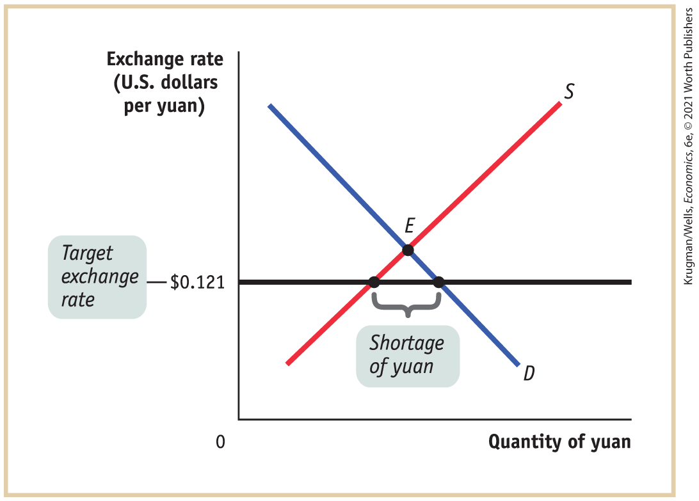
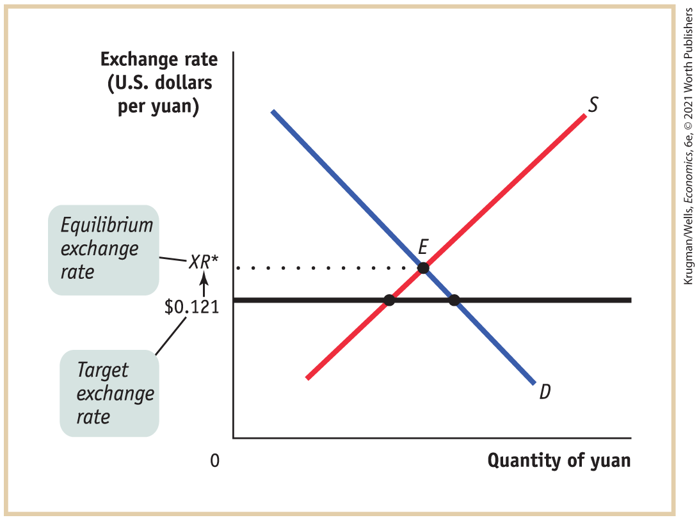
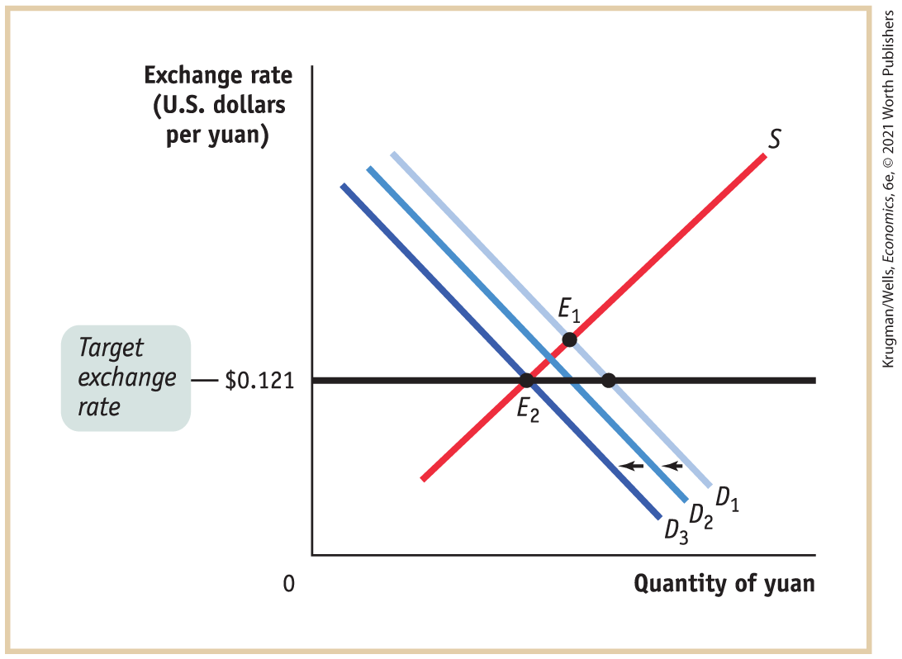
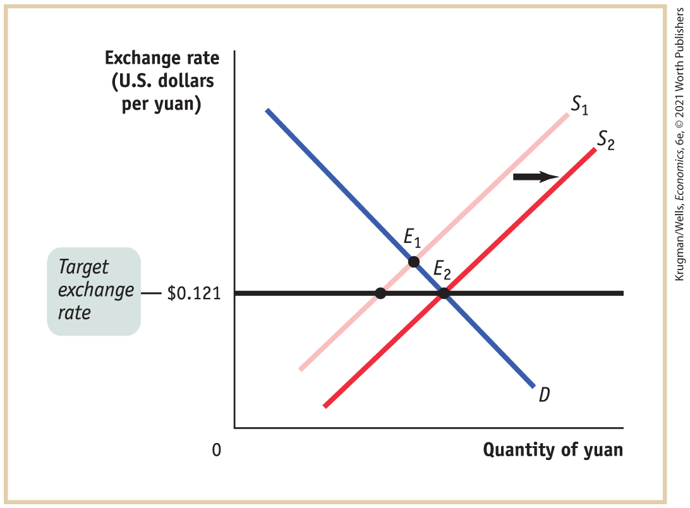

#### 16-3 Check Your Understanding

1.  There is no long-run trade-off between unemployment and inflation because once expectations of inflation adjust, wages will also adjust, returning employment and the unemployment rate to their equilibrium (natural) levels. This implies that once expectations of inflation fully adjust to any change in actual inflation, the unemployment rate will return to the natural rate of unemployment, or NAIRU. This also implies that the long-run Phillips curve is vertical.
2.  There are two possible explanations for this. First, negative supply shocks (for example, increases in the price of oil) will cause an increase in unemployment and an increase in inflation. Second, it is possible that British policy makers attempted to lower the unemployment rate below the natural rate of unemployment. Any attempt to lower the unemployment rate below the natural rate will result in an increase in inflation.
3.  Disinflation is costly because to reduce the inflation rate, aggregate output in the short run must typically fall below potential output. This, in turn, results in an increase in the unemployment rate above the natural rate. In general, we would observe a reduction in real GDP. The costs of any disinflation will be lower if the central bank is credible and it announces in advance its policy to reduce inflation. In this situation, the adjustment to the disinflationary policy will be more rapid, resulting in a smaller loss of aggregate output.

#### 16-4 Check Your Understanding

1.  If the nominal interest rate is negative, an individual is better off simply holding cash, which has a 0% nominal rate of return. If the options facing an individual are to lend and receive a negative nominal interest rate or to hold cash and receive a 0% nominal interest rate, the individual will hold cash. Such a scenario creates the possibility of a liquidity trap, in which monetary policy is ineffective because the nominal interest rate cannot fall more than a small amount below zero. Once the nominal interest rate falls to zero, further increases in the money supply will lead firms and individuals to simply hold the additional cash.

### Chapter seventeen

<!--
<strong class="important">[KW Macro Ch17; will become Econ 32]</strong>
--> <!--
<strong class="important">[Solutions to </strong><i class="semantic-i"><strong class="important">Check Your Understanding</strong></i> <strong class="important">Questions. Chapters run in; show partial pages corresponding to chapters as chapters ship; running heads left and right: SOLUTIONS TO Check Your Understanding PROBLEMS]</strong>
--> <!--
<strong class="important">[Note that Solutions to Check Your Understanding Problems set ragged right and ragged bottom. Columns do not need to align.]</strong>
-->

#### 17-1 Check Your Understanding

1.  A classical economist would have said that although expansionary monetary policy would probably have some effect in the short run, the short run was unimportant. Instead, a classical economist would have stressed the long run, claiming expansionary monetary policy would result only in an increase in the aggregate price level without affecting aggregate output.
2.  The statement would seem very familiar to a Keynesian economist. According to Keynes, business confidence (which he called “animal spirits”) is mainly responsible for recessions. If business confidence is low, a Keynesian economist would think of this as a case for macroeconomic policy activism: that the government should use expansionary monetary and fiscal policy to help the economy recover.

#### 17-2 Check Your Understanding

1.  Fiscal policy is limited by time lags in recognizing economic problems, forming a response, passing legislation, and implementing the policies. Monetary policy is also limited by time lags, but these lags are not as severe as those for fiscal policy because the Federal Reserve tends to act more quickly than Congress. Attempts to reduce unemployment below the natural rate via both fiscal and monetary policy are limited by predictions of the natural rate hypothesis: that these attempts will result in accelerating inflation. Also, both fiscal and monetary policy are limited by concerns about the political business cycle: that they will be used to satisfy political ends and will end up destabilizing the economy.

2.  

    1.  It’s likely that Milton Friedman would have agreed with the Fed policy of accelerating the growth of M1, because we know that Friedman believed that the Fed should have undertaken a more expansionary monetary policy in the wake of the Great Depression. Although he may have expressed caution over using discretionary policy.
    2.  The monetarist objections to fiscal policy are based on the problems of time lags in its implementation and crowding out. Monetarists also believe time lags undermine the effectiveness of monetary policy, but to a lesser extent than with fiscal policy. However, none of these objections applied during the Great Recession. Because it lasted so long, both fiscal policy and monetary policy were effective despite time lags. And because interest rates and investment spending plunged, crowding out by fiscal policy was not a problem.

3.  

    1.  Rational expectations theorists would argue that only unexpected changes in the money supply would have any short-run effect on economic activity. They would also argue that expected changes in the money supply would affect only the aggregate price level, with no short-run effect on aggregate output. So such theorists would give credit to the Fed for limiting the severity of the Great Recession only if the Fed’s monetary policy had been more aggressive than individuals expected during this period.
    2.  Real business cycle theorists would argue that the Fed’s policy had no effect on ending the Great Recession because they believe that fluctuations in aggregate output are caused largely by changes in total factor productivity.

#### 17-3 Check Your Understanding

1.  The liquidity trap brought on by the Great Recession greatly diminished the Great Moderation consensus, which considered monetary policy to be the main policy tool, and monetary policy was now largely ineffective. The continuing disagreements over fiscal policy were brought to the forefront. The dismal experience of European countries that had adopted fiscal austerity, when compared to the faster recovery of the United States, which had adopted fiscal expansionary policies, has led most economists to more or less agree with the Keynesian view about the effects of fiscal policy.
2.  The Fed was criticized by some individuals who thought it was doing too much and by secular stagnationists who thought it was doing too little. Some individuals believed that the huge increase in the monetary base and quantitative easing would lead to high inflation. Secular stagnationists believed the economy was in a liquidity trap and in a state of secular stagnation. Therefore, the stagnationists advocated for a higher inflation target that would allow the Fed to push the real interest rate down while the nominal rate was near zero.

### Chapter eighteen

#### 18-1 Check Your Understanding

1.  

    1.  The sale of the new airplane to China represents an export of a good to China and so enters the current account.
    2.  The sale of Boeing stock to Chinese investors is a sale of a U.S. asset and so enters the financial account.
    3.  Even though the plane already exists, when it is shipped to China it is an export of a good from the United States. So the sale of the plane enters the current account.
    4.  Because the plane stays in the United States, the Chinese investor is buying a U.S. asset. So this is identical to the answer to part b: the sale of the jet enters the financial account.

2.  The collapse of the U.S. housing bubble and the ensuing recession led to a dramatic fall in interest rates in the United States because of the deeply depressed economy. Consequently, capital inflows into the United States dried up.

#### 18-2 Check Your Understanding

1.  

    1.  The increased purchase of Mexican oil will cause U.S. individuals (and firms) to increase their demand for the peso. To purchase pesos, individuals will increase their supply of U.S. dollars to the foreign exchange market, causing a rightward shift in the supply curve of U.S. dollars. This will cause the peso price of the dollar to fall (the amount of pesos per dollar will fall). The peso has appreciated and the U.S. dollar has depreciated as a result.
    2.  This appreciation of the peso means it will take more U.S. dollars to obtain the same quantity of Mexican pesos. If we assume that the price level (measured in Mexican pesos) of other Mexican goods and services does not change, other Mexican goods and services become more expensive to U.S. households and firms. The dollar cost of other Mexican goods and services will rise as the peso appreciates. So Mexican exports to the United States of goods and services other than oil will fall.
    3.  Assuming that the U.S. price level (measured in U.S. dollars) does not change, the appreciation of the peso will make U.S. goods and services cheaper in terms of pesos. So Mexican imports from the United States of goods and services will rise.

2.  

    1.  The real exchange rate equals

        $\text{Pesos}\,\text{per}\,\text{U}\text{.S}\text{.}\,\text{dollar} \times \frac{\text{Aggregate}\,\text{price}\,\text{level}\,\text{in}\,\text{the}\,\text{U}\text{.S}\text{.}}{\text{Aggregate}\,\text{price}\,\text{level}\,\text{in}\,\text{Mexico}}$

        Today, the aggregate price levels in both countries are both equal to 100. The real exchange rate today is $10 \times \text{(}100\text{/}100\text{)} = 10$. The aggregate price level in five years in the U.S. will be $100 \times \text{(}120\text{/}100\text{)} = 120$, and in Mexico it will be $100 \times \text{(}1,200\text{/}800\text{)} = 150$. The real exchange rate in five years, assuming the nominal exchange rate does not change, will be $10 \times \text{(12}0\text{/15}0\text{)} = 8$.

    2.  Today, a basket of goods and services that costs \$100 costs 800 pesos, so the purchasing power parity is 8 pesos per U.S. dollar. In five years, a basket that costs \$120 will cost 1,200 pesos, so the purchasing power parity will be 10 pesos per U.S. dollar.

#### 18-3 Check Your Understanding

1.  The accompanying diagram shows the supply of and demand for the yuan, with the U.S. dollar price of the yuan on the vertical axis. In 2005, prior to the revaluation, the exchange rate was pegged at 8.28 yuan per U.S. dollar or, equivalently, 0.121 U.S. dollars per yuan (\$0.121). At the target exchange rate of \$0.121, the quantity of yuan demanded exceeded the quantity of yuan supplied, creating the shortage depicted in the diagram. Without any intervention by the Chinese government, the U.S. dollar price of the yuan would have been bid up, causing an appreciation of the yuan. The Chinese government, however, intervened to prevent this appreciation.<!--
[Insert CYUS 18-3 1]
-->

    <figure id="pau_9781319320164_Yxapyfg5lM" class="figure lm_img_lightbox unnum c5 center">
    
    </figure>

    <aside class="hidden" id="pau_9781319320164_4o69CBt5Py" title="hidden">

    The horizontal axis is labeled “Quantity of yuan”, and the vertical axis is labeled “Exchange rate (U. S. dollars per yuan).” A marking, 0.121 dollars is on the vertical axis and is labeled, “Target exchange rate.” The supply curve S is a positive sloping line, and the demand curve D is a negative sloping line. Supply curve intersects demand curve at a point E. A horizontal line extends from 0.121 dollars on the vertical axis and intersects the supply and demand curves at two different points below the point E. The horizontal distance between these two points is labeled “Shortage of yuan.”

    </aside>

    1.  If the exchange rate is allowed to move freely, the U.S. dollar price of the exchange rate will move toward the equilibrium exchange rate (labeled *XR*\* in the accompanying diagram). This will occur as a result of the shortage, when buyers of the yuan will bid up its U.S. dollar price. As the exchange rate increases, the quantity of yuan demanded will fall and the quantity of yuan supplied will increase. If the exchange rate increases to *XR*\*, the disequilibrium will be entirely eliminated.<!--
[Insert CYUS 18-3 1a]
-->

        <figure id="pau_9781319320164_6flVpmHdBb" class="figure lm_img_lightbox unnum c5 center">
        
        </figure>

        <aside class="hidden" id="pau_9781319320164_5Vu24FQXlA" title="hidden">

        The horizontal axis is labeled “Quantity of yuan.” The vertical axis, labeled “Exchange rate (U. S. dollars per yuan)” shows the following markings from bottom to top, 0.121 dollars labeled Target exchange rate, and X R asterisk labeled equilibrium exchange rate. The supply curve S is a positive sloping line, and the demand curve D is a negative sloping line. Supply curve intersects demand curve at a point E, where rate is X R asterisk. A horizontal line extends from 0.121 dollars on the vertical axis and intersects the supply and demand curves at two different points below the point E.

        </aside>

    2.  Placing restrictions on foreigners who want to invest in China will reduce the demand for the yuan, causing the demand curve to shift in the accompanying diagram from $D_{1}$ to a position like $D_{2}$. This will cause a reduction in the shortage of the yuan. If demand fell to $D_{3}$, the disequilibrium will be completely eliminated.<!--
[Insert CYUS 18-3 1b]
-->

        <figure id="pau_9781319320164_3h6BFMiOdO" class="figure lm_img_lightbox unnum c5 center">
        
        </figure>

        <aside class="hidden" id="pau_9781319320164_3GQ6CeSL3r" title="hidden">

        The horizontal axis is labeled “Quantity of yuan,” and the vertical axis is labeled “Exchange rate (U. S. dollars per yuan).” A marking, 0.121 dollars is on the vertical axis and is labeled, Target exchange rate. The supply curve S is a positive sloping line, and the demand curves are negative sloping parallel lines. Demand curve D subscript 1 is above and parallel to demand curve D subscript 2, which in turn is above and parallel to D subscript 3. Horizontal left arrows between the demand lines indicate the shift from D subscript 1 to D subscript 2, and the shift from D subscript 2 to D subscript 3. Demand curve D subscript 1 intersects supply curve S at a point E subscript 1. Demand curve D subscript 3 intersects supply curve S at a point E subscript 2, where the rate is 0.121 dollars. E subscript 1 is above E subscript 2. A horizontal line extends from 0.121 dollars on the vertical axis and intersects the demand curve D subscript 3 at E subscript 2, and demand curve D subscript 1 at a point.

        </aside>

    3.  Removing restrictions on Chinese who wish to invest abroad will cause an increase in the supply of the yuan and a rightward shift in the supply curve. This increase in supply will also cause a reduction in the size of the shortage. If, for example, supply increased from $S_{1}$ to $S_{2}$, the disequilibrium will be eliminated completely in the accompanying diagram.<!--
[Insert CYUS 18-3 1c]
-->

        <figure id="pau_9781319320164_cVJNLzQM62" class="figure lm_img_lightbox unnum c5 center">
        
        </figure>

        <aside class="hidden" id="pau_9781319320164_XNq5ktjEkN" title="hidden">

        The horizontal axis is labeled “Quantity of yuan,” and the vertical axis is labeled “Exchange rate (U. S. dollars per yuan).” A marking 0.121 dollars is on the vertical axis and is labeled, Target exchange rate. The supply curves are positive sloping parallel lines, and the demand curve D is a negative sloping line. Supply curve S subscript 1 is above and parallel to supply curve S subscript 2. A horizontal right arrow between the supply lines indicates the shift from S subscript 1 to S subscript 2. Demand curve D intersects supply curve S subscript 1 at a point E subscript 1. Demand curve D intersects supply curve S subscript 2 at a point E subscript 2, where the rate is 0.121 dollars. E subscript 1 is above E subscript 2. A horizontal line extends from 0.121 dollars on the vertical axis and intersects the supply curve S subscript 2 at E subscript 2.

        </aside>

    4.  Imposing a tax on exports (Chinese goods sold to foreigners) will raise the price of these goods and decrease the amount of Chinese goods purchased. This will also decrease the demand for the yuan. The graphical analysis here is virtually identical to that found in the figure accompanying part b.

#### 18-4 Check Your Understanding

1.  The devaluations and revaluations most likely occurred in those periods when there was a sudden change in the franc–mark exchange rate: 1974, 1976, the early 1980s, 1986, and 1993–1994.
2.  The high Canadian interest rates would likely have caused an increase in capital inflows to Canada. To obtain these assets (which yielded a relatively higher interest rate) in Canada, investors would first have had to obtain Canadian dollars. The increase in the demand for the Canadian dollar would have caused the Canadian dollar to appreciate. This appreciation of the Canadian currency would have raised the price of Canadian goods to foreigners (measured in terms of the foreign currency). This would have made it more difficult for Canadian firms to compete in other markets.
