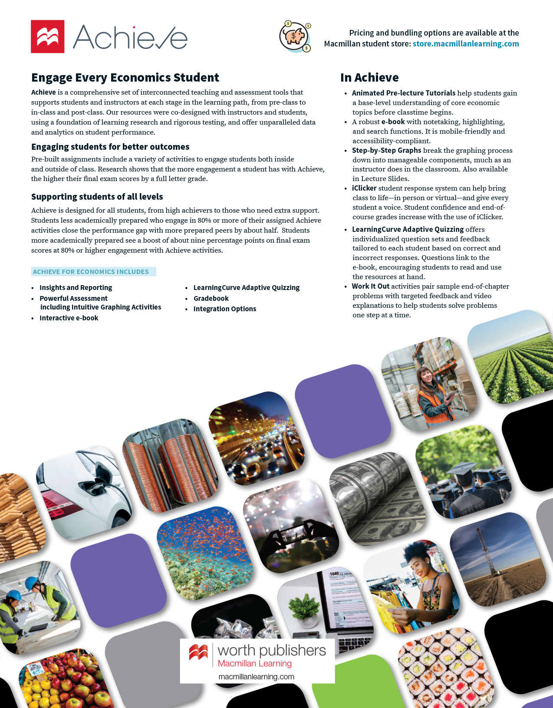

## V

- value
  - absolute, <a href="#kru_9781319245269_ch02_app.xhtml#page56" id="kru_9781319245269_EM_index.xhtml#pau_9781319320164_QDErixnpqW" class="index-locator">56</a>
  - money as store of, <a href="#kru_9781319245269_ch14_02.xhtml#page419" id="kru_9781319245269_EM_index.xhtml#pau_9781319320164_63q8EzX9X7" class="index-locator">419</a>–<a href="#kru_9781319245269_ch14_02.xhtml#page420" id="kru_9781319245269_EM_index.xhtml#pau_9781319320164_2WkEpXLP9p" class="index-locator">420</a>
- **value added**, <a href="#kru_9781319245269_ch07_02.xhtml#page193" id="kru_9781319245269_EM_index.xhtml#pau_9781319320164_X9aMy2jTRn" class="index-locator">193</a>
- value-added tax, <a href="#kru_9781319245269_ch02_06.xhtml#page43" id="kru_9781319245269_EM_index.xhtml#pau_9781319320164_CBi5m8DbsX" class="index-locator">43</a>
- Vanguard 500 Index Fund, <a href="#kru_9781319245269_ch10_03.xhtml#page296" id="kru_9781319245269_EM_index.xhtml#pau_9781319320164_Sfxwlxg90q" class="index-locator">296</a>
- **variable(s)**, <a href="#kru_9781319245269_ch02_app.xhtml#page51" id="kru_9781319245269_EM_index.xhtml#pau_9781319320164_KrQZbYUufm" class="index-locator">51</a>, <a href="#kru_9781319245269_ch02_app.xhtml#page52" id="kru_9781319245269_EM_index.xhtml#pau_9781319320164_cSzv0prAxE" class="index-locator">52</a>–<a href="#kru_9781319245269_ch02_app.xhtml#page53" id="kru_9781319245269_EM_index.xhtml#pau_9781319320164_gVSodtAblK" class="index-locator">53</a>
  - dependent and independent, <a href="#kru_9781319245269_ch02_app.xhtml#page52" id="kru_9781319245269_EM_index.xhtml#pau_9781319320164_YiJ5fpgAZO" class="index-locator">52</a>–<a href="#kru_9781319245269_ch02_app.xhtml#page53" id="kru_9781319245269_EM_index.xhtml#pau_9781319320164_c3eWiUfnoi" class="index-locator">53</a>
  - omitted, <a href="#kru_9781319245269_ch02_app.xhtml#page63" id="kru_9781319245269_EM_index.xhtml#pau_9781319320164_OsdkcLg0dM" class="index-locator">63</a>–<a href="#kru_9781319245269_ch02_app.xhtml#page64" id="kru_9781319245269_EM_index.xhtml#pau_9781319320164_JldDh0Gdzs" class="index-locator">64</a>
- VAT. *See* <a href="#kru_9781319245269_EM_index.xhtml#pau_9781319320164_zYFNZp9tNt" id="kru_9781319245269_EM_index.xhtml#pau_9781319320164_79KxUnSvJl" class="index-locator">value-added tax</a>
- Venezuela
  - economic growth of, <a href="#kru_9781319245269_ch09_02.xhtml#page244" id="kru_9781319245269_EM_index.xhtml#pau_9781319320164_xwkYBDbsD5" class="index-locator">244</a>
  - growth of money supply of, <a href="#kru_9781319245269_ch16_02.xhtml#page485" id="kru_9781319245269_EM_index.xhtml#pau_9781319320164_jpqPiufTGv" class="index-locator">485</a>–<a href="#kru_9781319245269_ch16_02.xhtml#page486" id="kru_9781319245269_EM_index.xhtml#pau_9781319320164_o1ye8R5FdA" class="index-locator">486</a>
  - inflation in, <a href="#kru_9781319245269_ch16_01.xhtml#page483" id="kru_9781319245269_EM_index.xhtml#pau_9781319320164_AN6l83p7jZ" class="index-locator">483</a>, <a href="#kru_9781319245269_ch16_02.xhtml#page489" id="kru_9781319245269_EM_index.xhtml#pau_9781319320164_FNEg27BCE7" class="index-locator">489</a>, <a href="#kru_9781319245269_ch16_06.xhtml#page506" id="kru_9781319245269_EM_index.xhtml#pau_9781319320164_JMafLvPItD" class="index-locator">506</a>
  - price controls in, <a href="#kru_9781319245269_ch04_03.xhtml#page110" id="kru_9781319245269_EM_index.xhtml#pau_9781319320164_3tUdfocq9c" class="index-locator">110</a>–<a href="#kru_9781319245269_ch04_03.xhtml#page111" id="kru_9781319245269_EM_index.xhtml#pau_9781319320164_NgefExUQgu" class="index-locator">111</a>
  - printing of currency of, <a href="#kru_9781319245269_ch16_06.xhtml#page506" id="kru_9781319245269_EM_index.xhtml#pau_9781319320164_vp3c3e9ENX" class="index-locator">506</a>
- Venmo, <a href="#kru_9781319245269_ch15_02.xhtml#page454" id="kru_9781319245269_EM_index.xhtml#pau_9781319320164_KEG5yB5Ls8" class="index-locator">454</a>, <a href="#kru_9781319245269_ch15_06.xhtml#page475" id="kru_9781319245269_EM_index.xhtml#pau_9781319320164_XZDw1auRTE" class="index-locator">475</a>, <a href="#kru_9781319245269_ch17_01.xhtml#page511" id="kru_9781319245269_EM_index.xhtml#pau_9781319320164_Vpo1q9U7Hz" class="index-locator">511</a>
- **vertical axis**, <a href="#kru_9781319245269_ch02_app.xhtml#page52" id="kru_9781319245269_EM_index.xhtml#pau_9781319320164_hxDtpn03kT" class="index-locator">52</a>
- vertical curves, <a href="#kru_9781319245269_ch02_app.xhtml#page55" id="kru_9781319245269_EM_index.xhtml#pau_9781319320164_smeFdDpLC8" class="index-locator">55</a>–<a href="#kru_9781319245269_ch02_app.xhtml#page56" id="kru_9781319245269_EM_index.xhtml#pau_9781319320164_4noJlxqgyq" class="index-locator">56</a>
- **vertical intercept**, <a href="#kru_9781319245269_ch02_app.xhtml#page54" id="kru_9781319245269_EM_index.xhtml#pau_9781319320164_OOy1Q8Ntzh" class="index-locator">54</a>
- Viacom Media, <a href="#kru_9781319245269_ch04_04.xhtml#page116" id="kru_9781319245269_EM_index.xhtml#pau_9781319320164_yyYA6e5lct" class="index-locator">116</a>
- Vietnam
  - clothing industry of, <a href="#kru_9781319245269_ch02_03.xhtml#page38" id="kru_9781319245269_EM_index.xhtml#pau_9781319320164_l48Zlx5Utf" class="index-locator">38</a>
  - shrimp production of, <a href="#kru_9781319245269_ch05_02.xhtml#page131" id="kru_9781319245269_EM_index.xhtml#pau_9781319320164_YNKTPARtDS" class="index-locator">131</a>, <a href="#kru_9781319245269_ch05_02.xhtml#page134" id="kru_9781319245269_EM_index.xhtml#pau_9781319320164_0Ho28EzTBc" class="index-locator">134</a>–<a href="#kru_9781319245269_ch05_02.xhtml#page135" id="kru_9781319245269_EM_index.xhtml#pau_9781319320164_OZaApcbwX2" class="index-locator">135</a>
- virtual currency, <a href="#kru_9781319245269_ch14_02.xhtml#page422" id="kru_9781319245269_EM_index.xhtml#pau_9781319320164_SjcE8ydJ4d" class="index-locator">422</a>
- Volkswagen, <a href="#kru_9781319245269_ch18_06.xhtml#page557" id="kru_9781319245269_EM_index.xhtml#pau_9781319320164_RKt0KLP99S" class="index-locator">557</a>

## W

- wages
  - currencies and, <a href="#kru_9781319245269_ch18_05.xhtml#page555" id="kru_9781319245269_EM_index.xhtml#pau_9781319320164_jcLV1uEFGL" class="index-locator">555</a>–<a href="#kru_9781319245269_ch18_05.xhtml#page556" id="kru_9781319245269_EM_index.xhtml#pau_9781319320164_HanBzwr90t" class="index-locator">556</a>
  - efficiency, structural unemployment and, <a href="#kru_9781319245269_ch08_03.xhtml#page224" id="kru_9781319245269_EM_index.xhtml#pau_9781319320164_21nhciE4FE" class="index-locator">224</a>–<a href="#kru_9781319245269_ch08_03.xhtml#page225" id="kru_9781319245269_EM_index.xhtml#pau_9781319320164_gAQaiDgUWV" class="index-locator">225</a>
  - as factor prices, <a href="#kru_9781319245269_ch05_03.xhtml#page144" id="kru_9781319245269_EM_index.xhtml#pau_9781319320164_BMIqA68QMl" class="index-locator">144</a>
  - hourly, <a href="#kru_9781319245269_ch16_01.xhtml#page483" id="kru_9781319245269_EM_index.xhtml#pau_9781319320164_L1FGTChUYI" class="index-locator">483</a>
  - international comparison of, <a href="#kru_9781319245269_ch04_04.xhtml#page112" id="kru_9781319245269_EM_index.xhtml#pau_9781319320164_kcGLaceDhp" class="index-locator">112</a>, <a href="#kru_9781319245269_ch05_02.xhtml#page136" id="kru_9781319245269_EM_index.xhtml#pau_9781319320164_uvzvb85tcD" class="index-locator">136</a>
  - international trade and, <a href="#kru_9781319245269_ch05_03.xhtml#page143" id="kru_9781319245269_EM_index.xhtml#pau_9781319320164_4G6du54QTi" class="index-locator">143</a>–<a href="#kru_9781319245269_ch05_03.xhtml#page145" id="kru_9781319245269_EM_index.xhtml#pau_9781319320164_Vzha2LJmds" class="index-locator">145</a>
  - minimum. *See* <a href="#kru_9781319245269_EM_index.xhtml#pau_9781319320164_kG3zOfqx0k" id="kru_9781319245269_EM_index.xhtml#pau_9781319320164_w8rxOzsSxY" class="index-locator">minimum wage</a>
  - nominal. *See* <a href="#kru_9781319245269_EM_index.xhtml#pau_9781319320164_X58ehtF0Yo" id="kru_9781319245269_EM_index.xhtml#pau_9781319320164_NirBmxQCbm" class="index-locator">nominal wage</a>
  - real, <a href="#kru_9781319245269_ch08_04.xhtml#page229" id="kru_9781319245269_EM_index.xhtml#pau_9781319320164_Nqr1K12Uoh" class="index-locator">229</a>
  - sticky, <a href="#kru_9781319245269_ch12_03.xhtml#page359" id="kru_9781319245269_EM_index.xhtml#pau_9781319320164_etlk9WJcja" class="index-locator">359</a>, <a href="#kru_9781319245269_ch12_03.xhtml#page361" id="kru_9781319245269_EM_index.xhtml#pau_9781319320164_Js2amlQtHk" class="index-locator">361</a>, <a href="#kru_9781319245269_ch12_03.xhtml#page367" id="kru_9781319245269_EM_index.xhtml#pau_9781319320164_BPDVZWCwOi" class="index-locator">367</a>
  - structural unemployment and, <a href="#kru_9781319245269_ch08_03.xhtml#page223" id="kru_9781319245269_EM_index.xhtml#pau_9781319320164_LcSjeYp0UN" class="index-locator">223</a>–<a href="#kru_9781319245269_ch08_03.xhtml#page224" id="kru_9781319245269_EM_index.xhtml#pau_9781319320164_UMXAfHBT6b" class="index-locator">224</a>
  - unions and, <a href="#kru_9781319245269_ch08_03.xhtml#page224" id="kru_9781319245269_EM_index.xhtml#pau_9781319320164_WZZ6b1FTDd" class="index-locator">224</a>
- Wall Street Reform and Consumer Protection Act of 2010, <a href="#kru_9781319245269_ch14_06.xhtml#page444" id="kru_9781319245269_EM_index.xhtml#pau_9781319320164_YtprO5Fd9f" class="index-locator">444</a>–<a href="#kru_9781319245269_ch14_06.xhtml#page445" id="kru_9781319245269_EM_index.xhtml#pau_9781319320164_3cQvStJSQq" class="index-locator">445</a>
- Walmart, <a href="#kru_9781319245269_ch01_02.xhtml#page8" id="kru_9781319245269_EM_index.xhtml#pau_9781319320164_aq7xdqNuMW" class="index-locator">8</a>, <a href="#kru_9781319245269_ch05_06.xhtml#page155" id="kru_9781319245269_EM_index.xhtml#pau_9781319320164_VFUc8lY1fX" class="index-locator">155</a>, <a href="#kru_9781319245269_ch08_03.xhtml#page225" id="kru_9781319245269_EM_index.xhtml#pau_9781319320164_vKW2cymage" class="index-locator">225</a>
- Walt Disney Company, <a href="#kru_9781319245269_ch18_02.xhtml#page533" id="kru_9781319245269_EM_index.xhtml#pau_9781319320164_PoJuF03EVe" class="index-locator">533</a>
- wampum, <a href="#kru_9781319245269_ch14_02.xhtml#page422" id="kru_9781319245269_EM_index.xhtml#pau_9781319320164_o81MYqKEJp" class="index-locator">422</a>
- Wang, Jing, <a href="#kru_9781319245269_ch09_03.xhtml#page247" id="kru_9781319245269_EM_index.xhtml#pau_9781319320164_yBYgq5MBJr" class="index-locator">247</a>
- **wasted resources**
  - price ceilings causing, <a href="#kru_9781319245269_ch04_03.xhtml#page108" id="kru_9781319245269_EM_index.xhtml#pau_9781319320164_CGUSv1QvCx" class="index-locator">108</a>–<a href="#kru_9781319245269_ch04_03.xhtml#page109" id="kru_9781319245269_EM_index.xhtml#pau_9781319320164_aYXOMJ80WK" class="index-locator">109</a>
  - price floors causing, <a href="#kru_9781319245269_ch04_04.xhtml#page115" id="kru_9781319245269_EM_index.xhtml#pau_9781319320164_1qZv6YwZyA" class="index-locator">115</a>
- watches, Swiss trade in, <a href="#kru_9781319245269_ch05_02.xhtml#page138" id="kru_9781319245269_EM_index.xhtml#pau_9781319320164_vEuqisljc8" class="index-locator">138</a>
- water pollution. *See* <a href="#kru_9781319245269_EM_index.xhtml#pau_9781319320164_ML9VqJleVP" id="kru_9781319245269_EM_index.xhtml#pau_9781319320164_Gj9ntV8aNM" class="index-locator">pollution</a>
- **wealth**, <a href="#kru_9781319245269_ch10_02.xhtml#page291" id="kru_9781319245269_EM_index.xhtml#pau_9781319320164_3574hEC0GM" class="index-locator">291</a>
  - changes in, shifts of the aggregate demand curve and, <a href="#kru_9781319245269_ch12_02.xhtml#page355" id="kru_9781319245269_EM_index.xhtml#pau_9781319320164_CcUsbR5SpC" class="index-locator">355</a>–<a href="#kru_9781319245269_ch12_02.xhtml#page356" id="kru_9781319245269_EM_index.xhtml#pau_9781319320164_nE1XLWAr8p" class="index-locator">356</a>
- **wealth effect of a change in the aggregate price level**, <a href="#kru_9781319245269_ch12_02.xhtml#page351" id="kru_9781319245269_EM_index.xhtml#pau_9781319320164_QbzcyYuDFP" class="index-locator">351</a>
- *The Wealth of Nations* (Smith), <a href="#kru_9781319245269_ch00_02.xhtml#page2" id="kru_9781319245269_EM_index.xhtml#pau_9781319320164_lj7pjj3ePZ" class="index-locator">2</a>–<a href="#kru_9781319245269_ch00_02.xhtml#page3" id="kru_9781319245269_EM_index.xhtml#pau_9781319320164_NldoRtpGIC" class="index-locator">3</a>, <a href="#kru_9781319245269_ch01_03.xhtml#page13" id="kru_9781319245269_EM_index.xhtml#pau_9781319320164_RrocBoE2NY" class="index-locator">13</a>–<a href="#kru_9781319245269_ch01_03.xhtml#page14" id="kru_9781319245269_EM_index.xhtml#pau_9781319320164_3nQNjrpxJk" class="index-locator">14</a>, <a href="#kru_9781319245269_ch14_02.xhtml#page420" id="kru_9781319245269_EM_index.xhtml#pau_9781319320164_11mpO23jil" class="index-locator">420</a>, <a href="#kru_9781319245269_ch14_02.xhtml#page421" id="kru_9781319245269_EM_index.xhtml#pau_9781319320164_MELEGuuvov" class="index-locator">421</a>, <a href="#kru_9781319245269_ch17_03.xhtml#page513" id="kru_9781319245269_EM_index.xhtml#pau_9781319320164_eB1rv04ZE0" class="index-locator">513</a>
- **wedges**, <a href="#kru_9781319245269_ch04_05.xhtml#page120" id="kru_9781319245269_EM_index.xhtml#pau_9781319320164_xEeRhUHm3Q" class="index-locator">120</a>
- well-being, GDP per capita and, <a href="#kru_9781319245269_ch07_03.xhtml#page200" id="kru_9781319245269_EM_index.xhtml#pau_9781319320164_pKF9bQf2kr" class="index-locator">200</a>
- Whalley, John, <a href="#kru_9781319245269_ch09_03.xhtml#page247" id="kru_9781319245269_EM_index.xhtml#pau_9781319320164_cZ3T0eoxdU" class="index-locator">247</a>
- wholesale price index, <a href="#kru_9781319245269_ch07_04.xhtml#page203" id="kru_9781319245269_EM_index.xhtml#pau_9781319320164_4QdNPrVY0W" class="index-locator">203</a>
- **willingness to pay**
  - consumer surplus and, <a href="#kru_9781319245269_ch05_app.xhtml#page162" id="kru_9781319245269_EM_index.xhtml#pau_9781319320164_GktgXrUTJU" class="index-locator">162</a>–<a href="#kru_9781319245269_ch05_app.xhtml#page164" id="kru_9781319245269_EM_index.xhtml#pau_9781319320164_R768aR0qng" class="index-locator">164</a>
  - demand curve and, <a href="#kru_9781319245269_ch05_app.xhtml#page161" id="kru_9781319245269_EM_index.xhtml#pau_9781319320164_olHKJzs8OW" class="index-locator">161</a>–<a href="#kru_9781319245269_ch05_app.xhtml#page162" id="kru_9781319245269_EM_index.xhtml#pau_9781319320164_hJmk0KNmnH" class="index-locator">162</a>
- work. *See* <a href="#kru_9781319245269_EM_index.xhtml#pau_9781319320164_0zTzxUYulT" id="kru_9781319245269_EM_index.xhtml#pau_9781319320164_DmKDOegDOp" class="index-locator">employment</a>; <a href="#kru_9781319245269_EM_index.xhtml#pau_9781319320164_fOBRpAK6PF" id="kru_9781319245269_EM_index.xhtml#pau_9781319320164_oCcvdO4Ast" class="index-locator">labor <em>entries</em></a>; <a href="#kru_9781319245269_EM_index.xhtml#pau_9781319320164_IjxgzPQOYa" id="kru_9781319245269_EM_index.xhtml#pau_9781319320164_Ia93PwTb7N" class="index-locator">unemployment</a>; <a href="#kru_9781319245269_EM_index.xhtml#pau_9781319320164_pvgU2OldA2" id="kru_9781319245269_EM_index.xhtml#pau_9781319320164_rkHIEUuAOJ" class="index-locator">unemployment rate</a>
- world GDP, <a href="#kru_9781319245269_ch05_02.xhtml#page130" id="kru_9781319245269_EM_index.xhtml#pau_9781319320164_vs2fCbjeq1" class="index-locator">130</a>
- **world price**, <a href="#kru_9781319245269_ch05_03.xhtml#page140" id="kru_9781319245269_EM_index.xhtml#pau_9781319320164_2TYrcN3sci" class="index-locator">140</a>
- **World Trade Organization (WTO)**, <a href="#kru_9781319245269_ch05_05.xhtml#page152" id="kru_9781319245269_EM_index.xhtml#pau_9781319320164_v4wj49ziqX" class="index-locator">152</a>
- World War II
  - government expenditures for, ending of Great Depression and, <a href="#kru_9781319245269_ch17_03.xhtml#page516" id="kru_9781319245269_EM_index.xhtml#pau_9781319320164_KHhmKLsoy4" class="index-locator">516</a>
  - public debt from, <a href="#kru_9781319245269_ch13_05.xhtml#page406" id="kru_9781319245269_EM_index.xhtml#pau_9781319320164_rnL6p43nja" class="index-locator">406</a>–<a href="#kru_9781319245269_ch13_05.xhtml#page407" id="kru_9781319245269_EM_index.xhtml#pau_9781319320164_8rMKNsYw3F" class="index-locator">407</a>
  - women in labor force during, <a href="#kru_9781319245269_ch09_02.xhtml#page246" id="kru_9781319245269_EM_index.xhtml#pau_9781319320164_eexK3yAC4d" class="index-locator">246</a>
- Wright, Wilbur and Orville, <a href="#kru_9781319245269_ch02_01.xhtml#page27" id="kru_9781319245269_EM_index.xhtml#pau_9781319320164_ZC670nP3mK" class="index-locator">27</a>
- Wright Flyer, <a href="#kru_9781319245269_ch02_01.xhtml#page27" id="kru_9781319245269_EM_index.xhtml#pau_9781319320164_ox58O40Aa8" class="index-locator">27</a>
- WTO. *See* <a href="#kru_9781319245269_EM_index.xhtml#pau_9781319320164_VQlchr9ttd" id="kru_9781319245269_EM_index.xhtml#pau_9781319320164_sSGP910lda" class="index-locator">World Trade Organization (WTO)</a>

## X

- ***x*-axis**, <a href="#kru_9781319245269_ch02_app.xhtml#page52" id="kru_9781319245269_EM_index.xhtml#pau_9781319320164_c8bExHXd0u" class="index-locator">52</a>

## Y

- ***y*-axis**, <a href="#kru_9781319245269_ch02_app.xhtml#page52" id="kru_9781319245269_EM_index.xhtml#pau_9781319320164_15H973u5oN" class="index-locator">52</a>
- Yellen, Janet, <a href="#kru_9781319245269_ch14_04.xhtml#page433" id="kru_9781319245269_EM_index.xhtml#pau_9781319320164_6xH4Fu5qkX" class="index-locator">433</a>
- yuan, pegging of, <a href="#kru_9781319245269_ch18_04.xhtml#page551" id="kru_9781319245269_EM_index.xhtml#pau_9781319320164_ZVxgg5QiNl" class="index-locator">551</a>–<a href="#kru_9781319245269_ch18_04.xhtml#page552" id="kru_9781319245269_EM_index.xhtml#pau_9781319320164_YgSr4gZMKa" class="index-locator">552</a>
- Yunus, Mohammad, <a href="#kru_9781319245269_ch10_05.xhtml#page305" id="kru_9781319245269_EM_index.xhtml#pau_9781319320164_Kuh6YM9Rqt" class="index-locator">305</a>

## Z

- Zappos, <a href="#kru_9781319245269_ch08_04.xhtml#page231" id="kru_9781319245269_EM_index.xhtml#pau_9781319320164_nWnYzK6m5V" class="index-locator">231</a>
- zero interest rate policy (ZIRP), <a href="#kru_9781319245269_ch16_03.xhtml#page497" id="kru_9781319245269_EM_index.xhtml#pau_9781319320164_4nlmuJHrXf" class="index-locator">497</a>–<a href="#kru_9781319245269_ch16_03.xhtml#page498" id="kru_9781319245269_EM_index.xhtml#pau_9781319320164_KT1Iik3Obf" class="index-locator">498</a>
- **zero lower bound for interest rates**, <a href="#kru_9781319245269_ch15_04.xhtml#page466" id="kru_9781319245269_EM_index.xhtml#pau_9781319320164_gtYBgg3wFc" class="index-locator">466</a>, <a href="#kru_9781319245269_ch15_04.xhtml#page469" id="kru_9781319245269_EM_index.xhtml#pau_9781319320164_DFg8cdOfRc" class="index-locator">469</a>, <a href="#kru_9781319245269_ch16_05.xhtml#page503" id="kru_9781319245269_EM_index.xhtml#pau_9781319320164_1qyYI2mMRO" class="index-locator">503</a>–<a href="#kru_9781319245269_ch16_05.xhtml#page504" id="kru_9781319245269_EM_index.xhtml#pau_9781319320164_OyygIJIDFK" class="index-locator">504</a>, <a href="#kru_9781319245269_ch17_05.xhtml#page525" id="kru_9781319245269_EM_index.xhtml#pau_9781319320164_bW7dJ2u34u" class="index-locator">525</a>
- Zimbabwe, hyperinflation in, <a href="#kru_9781319245269_ch08_04.xhtml#page231" id="kru_9781319245269_EM_index.xhtml#pau_9781319320164_5KaGBESVOg" class="index-locator">231</a>, <a href="#kru_9781319245269_ch16_01.xhtml#page483" id="kru_9781319245269_EM_index.xhtml#pau_9781319320164_8TiWArH7dR" class="index-locator">483</a>
- ZIRP (zero interest rate policy), <a href="#kru_9781319245269_ch16_05.xhtml#page504" id="kru_9781319245269_EM_index.xhtml#pau_9781319320164_88lNfa8Rq6" class="index-locator">504</a>
- Zuckerberg, Mark, <a href="#kru_9781319245269_ch01_02.xhtml#page9" id="kru_9781319245269_EM_index.xhtml#pau_9781319320164_DYHfjgXwLg" class="index-locator">9</a>

<aside class="hidden" id="pau_9781319320164_RyaTO7yP1n" title="hidden">

The back cover has the Macmillan Learning logo with the text “Achieve” at the top left. Text below this is under four headings as follows. Text under the heading “Engage Every Economics Student” reads, “Achieve is a comprehensive set of interconnected teaching and assessment tools that supports students and instructors at each stage in the learning path, from pre-class to in-class and post-class. Our resources were co-designed with instructors and students, using a foundation of learning re-search and rigorous testing, and offer unparalleled data and analytics on student performance.” Text under the heading “Engaging students for better outcomes” reads, “Pre-built assignments include a variety of activities to engage students both inside and outside of class. Research shows that the more engagement a student has with Achieve, the higher their final exam scores by a full letter grade.” Text under the heading “Supporting students of all levels” reads, “Achieve is designed for all students, from high achievers to those who need extra support. Students less academically pre-pared who engage in 80 percent or more of their assigned Achieve activities close the performance gap with more prepared peers by about half. Students more academically prepared see a boost of about nine percentage points on final exam scores at 80 percent or higher engagement with Achieve activities.” A list of text under the heading “achieve for economics includes” reads, “Insights and Re-porting, Powerful Assessment including Intuitive Graphing Activities, Interactive e-book, Learning Curve Adaptive Quizzing, Gradebook, and Integration Options.” At the top right of the back cover has text that reads, “Pricing and bundling options are available at the Macmillan student store: store dot macmillan learning dot com.” Below this, six paragraphs under the heading “In Achieve” are as follows, “Animated Pre-lecture Tutorials help students gain a base-level understanding of core eco-nomic topics before class time begins; An e-book fully integrates text, activities, and quizzes. It is mobile-friendly and accessibility compliant; Step-by-Step Graphs break the graphing process down into manageable components, much as an instructor does in the classroom. Also available in Lecture Slides; i Clicker student response system can help bring class to life, in person or virtual, and give every student a voice. Student confidence and end of course grades increase with the use of i Click-er; Learning Curve Adaptive Quizzing offers individualized question sets and feedback tailored to each student based on correct and incorrect responses. Questions link to the e-book, encouraging students to read and use the resources at hand; and Work It Out activities pair sample end-of-chapter problems with targeted feedback and video explanations to help students solve problems one step at a time.” The bottom portion of the back cover page has many photo thumbnails arranged in rows. The row arrangement of the thumbnails is oriented diagonally from the bottom left. The bottom of the thumbnails is affixed with a “Macmillan Authentic” logo, a “Worth Publishers, Macmillan Learning” logo, and a bar code.

</aside>
