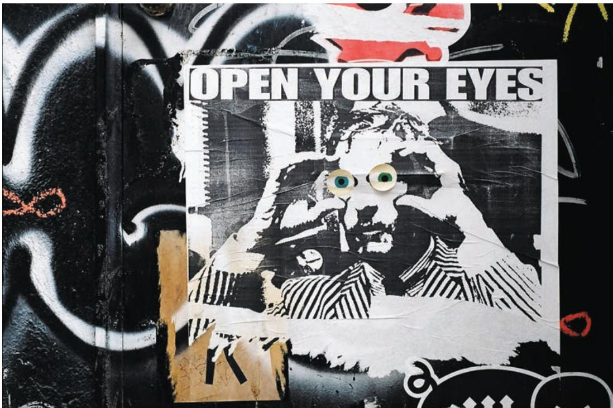

## MACROECONOMICS

8TH EDITION

## Olivier Blanchard

Eighth Edition

MACROECONOMICS

Olivier Blanchard

Please contact https://support.pearson.com/getsupport/s/contactsupport with any queries on this content.

Microsoft and/or its respective suppliers make no representations about the suitability of the information contained in the documents and related graphics published as part of the services for any purpose. All such documents and related graphics are provided “as is” without warranty of any kind. Microsoft and/or its respective suppliers hereby disclaim all warranties and conditions with regard to this information, including all warranties and conditions of merchantability, whether express, implied or statutory, fitness for a particular purpose, title and non-infringement. In no event shall Microsoft and/or its respective suppliers be liable for any special, indirect or consequential damages or any damages whatsoever resulting from loss of use, data or profits, whether in an action of contract, negligence or other tortious action, arising out of or in connection with the use or performance of information available from the services.

The documents and related graphics contained herein could include technical inaccuracies or typographical errors. Changes are periodically added to the information herein. Microsoft and/or its respective suppliers may make improvements and/or changes in the product(s) and/or the program(s) described herein at any time. Partial screen shots may be viewed in full within the software version specified.

Microsoft® and Windows® are registered trademarks of the Microsoft Corporation in the U.S.A. and other countries. This book is not sponsored or endorsed by or affiliated with the Microsoft Corporation.

Copyright © 2021, 2017, 2013 by Pearson Education, Inc. or its affiliates, 221 River Street, Hoboken, NJ 07030. All Rights Reserved. Manufactured in the United States of America. This publication is protected by copyright, and permission should be obtained from the publisher prior to any prohibited reproduction, storage in a retrieval system, or transmission in any form or by any means, electronic, mechanical, photocopying, recording, or otherwise. For information regarding permissions, request forms, and the appropriate contacts within the Pearson Education Global Rights and Permissions department, please visit www.pearsoned.com/ permissions/.

Acknowledgments of third-party content appear on the appropriate page within the text and on the Credits page at the end of the book, which constitutes an extension of this copyright page.

Cover Photo: Thinkstock/Stockbyte/Getty Images

PEARSON, ALWAYS LEARNING, and MYLAB are exclusive trademarks owned by Pearson Education, Inc. or its affiliates in the U.S. and/or other countries.

Unless otherwise indicated herein, any third-party trademarks, logos, or icons that may appear in this work are the property of their respective owners, and any references to third-party trademarks, logos, icons, or other trade dress are for demonstrative or descriptive purposes only. Such references are not intended to imply any sponsorship, endorsement, authorization, or promotion of Pearson’s products by the owners of such marks, or any relationship between the owner and Pearson Education, Inc., or its affiliates, authors, licensees, or distributors.

## Library of Congress Cataloging-in-Publication Data

Name: Blanchard, Olivier (Olivier J.), author. Title: Macroeconomics / Olivier Blanchard. Description: Eighth Edition. | Hoboken : Pearson, [2021] | Revised edition of Macroeconomics, [2017] Identifiers: LCCN 2019015670| ISBN 9780134897899 | ISBN 0134897897 Subjects: LCSH: Macroeconomics. Classification: LCC HB172.5 .B573 2019 | DDC 339—dc23 LC record available at https://lccn.loc.gov/2019015670

ScoutAutomatedPrintCode

To Noelle  

