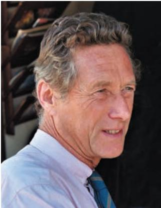

# About the Author

A citizen of France, Olivier Blanchard has spent most of his professional life in Cambridge, U.S.A. After obtaining his Ph.D. in economics at the Massachusetts Institute of Technology in 1977, he taught at Harvard University, returning to MIT in 1982. He was chair of the economics department from 1998 to 2003. In 2008, he took a leave of absence to be the Economic Counsellor and Director of the Research Department of the International Monetary Fund. Since October 2015, he has been the Fred Bergsten Senior Fellow at the Peterson Institute for International Economics, in Washington. He also remains Robert M. Solow Professor of Economics emeritus at MIT.

He has worked on a wide set of macroeconomic issues, from the role of monetary policy, to the nature of speculative bubbles, to the nature of the labor market and the determinants of unemployment, to transition in former communist countries, and to forces behind the recent global crisis. In the process, he has worked with numerous countries and international organizations. He is the author of many books and articles, including a graduate level textbook with Stanley Fischer.

He is a past editor of the Quarterly Journal of Economics, of the NBER Macroeconomics Annual, and founding editor of the AEJ Macroeconomics. He is a fellow and past council member of the Econometric Society, a past president of the American Economic Association, and a member of the American Academy of Sciences.

## Introduction

The first two chapters of this book introduce you to the issues and the approach of macroeconomics.

Chapter 1 takes you on a macroeconomic tour of the world. It starts with a look at the economic crisis that has shaped the world economy since the late 2000s. The tour then stops at each of the world’s major economic powers: the United States, the euro area, and China.

Chapter 2 takes you on a tour of the book. It defines the three central variables of macroeconomics: output, unemployment, and inflation. It then introduces the three time periods around which the book is organized: the short run, the medium run, and the long run.

This page is intentionally left blank
